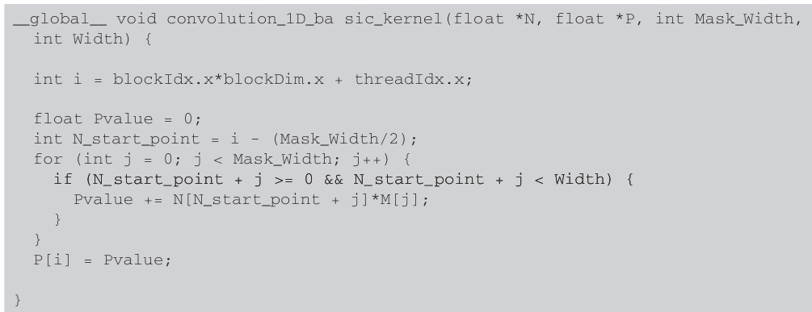

## Convolução com Máscaras: Aplicações e Considerações em CUDA

### Introdução
Este capítulo explora o conceito de **máscaras de convolução** e sua aplicação no contexto da programação CUDA. Máscaras de convolução são ferramentas essenciais no processamento de imagem e em outras áreas do cálculo numérico, permitindo a realização de diversas operações como *blur*, *sharpen* e detecção de bordas. Abordaremos a estrutura dessas máscaras, como elas são aplicadas aos dados de entrada e as considerações importantes para evitar conflitos de nomes com funções kernel CUDA [^5].

### Conceitos Fundamentais

**Máscaras de Convolução**: Uma **máscara de convolução**, também conhecida como *kernel*, é um pequeno array de pesos que é aplicado a elementos vizinhos em um array de entrada. O tamanho da máscara é geralmente ímpar (ex: 3x3, 5x5) para que haja um elemento central que corresponda ao pixel ou elemento de entrada que está sendo processado.

A operação de **convolução** consiste em deslizar a máscara sobre o array de entrada, multiplicando os valores da máscara pelos valores correspondentes do array de entrada e somando os resultados para obter o valor resultante no array de saída. Matematicamente, a convolução discreta 2D pode ser expressa como:

$$
(f * g)(x, y) = \sum_{i=-\infty}^{\infty} \sum_{j=-\infty}^{\infty} f(i, j) g(x-i, y-j)
$$

Onde:
*   $f(x, y)$ representa o array de entrada.
*   $g(i, j)$ representa a máscara de convolução.
*   $(f * g)(x, y)$ representa o array de saída após a convolução.

**Aplicação Uniforme**: É crucial entender que a máscara de convolução é aplicada *uniformemente* a todos os elementos do array de entrada [^5]. Isso significa que a mesma operação de ponderação é realizada em cada pixel (ou elemento) do array, garantindo que o efeito da convolução seja consistente em toda a imagem ou conjunto de dados.

**Exemplo**: Considere uma máscara de blur 3x3 simples:

$$
\begin{bmatrix}
1/9 & 1/9 & 1/9 \\
1/9 & 1/9 & 1/9 \\
1/9 & 1/9 & 1/9
\end{bmatrix}
$$

Ao aplicar essa máscara a um pixel em uma imagem, o novo valor do pixel será a média ponderada dos valores de seus 8 vizinhos e dele próprio.

**Considerações em CUDA**: Ao implementar operações de convolução em CUDA, é crucial estar atento a alguns aspectos:

1.  **Conflitos de Nomes**: Evitar conflitos de nomes com funções kernel CUDA é fundamental [^5]. Escolha nomes descritivos e únicos para as máscaras e funções de convolução. Um prefixo específico (ex: `mask_`, `conv_`) pode ajudar a organizar e diferenciar os nomes.

2.  **Tratamento de Bordas**: Ao aplicar a máscara nas bordas do array de entrada, é necessário lidar com a falta de vizinhos. Existem diversas estratégias para isso:
    *   *Zero-padding*: Preencher a borda com zeros.

    

    *   *Clamping*: Repetir o valor do pixel da borda.
    *   *Wrapping*: Usar os pixels do lado oposto do array.

    

3.  **Otimização**: A convolução é uma operação computacionalmente intensiva. Otimizações como o uso de memória compartilhada e *tiling* são importantes para melhorar o desempenho em GPUs.

    

    

    

    
Exemplos de convolução 1D e 2D:

![Illustration of 1D convolution: input array N convolved with mask M results in output array P, calculating P[2] as 57.](./../images/image2.jpg)

![1D convolution example showing calculation of P[3] based on input array N and mask M.](./../images/image11.jpg)

Código CUDA para convolução 1D:

### Conclusão

As máscaras de convolução são ferramentas poderosas para o processamento de arrays de dados, especialmente em aplicações de visão computacional e processamento de sinais. A aplicação uniforme e a escolha correta da máscara permitem realizar uma ampla gama de operações. Ao implementar convoluções em CUDA, é fundamental considerar os aspectos específicos da arquitetura, como o tratamento de bordas, a otimização do código e a prevenção de conflitos de nomes. A correta aplicação desses princípios garante um desempenho eficiente e resultados precisos.

### Referências
[^5]: Convolution masks are arrays of weights applied to neighboring elements.  It's important to avoid naming conflicts with CUDA kernel functions.  These masks are applied uniformly to all elements of the input array.

<!-- END -->