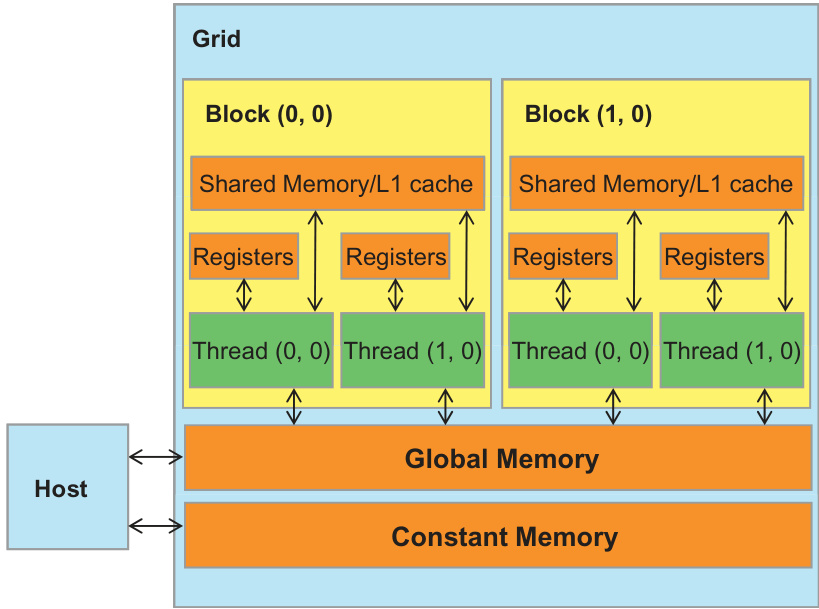

## Convolução 1D Paralela: Cálculo Paralelo dos Elementos de Saída

### Introdução
A computação paralela, especialmente utilizando CUDA e GPUs, oferece uma abordagem eficiente para resolver problemas computacionalmente intensivos. A **convolução**, uma operação fundamental em diversas áreas como processamento de sinais, processamento de imagens e aprendizado de máquina, apresenta uma oportunidade natural para paralelização. Neste capítulo, exploraremos como calcular todos os elementos de saída em uma operação de convolução 1D de forma paralela, aproveitando a arquitetura CUDA. A capacidade de executar esse cálculo simultaneamente em múltiplos núcleos da GPU resulta em ganhos significativos de desempenho, tornando essa técnica particularmente útil para aplicações que exigem processamento em tempo real ou o processamento de grandes volumes de dados.

### Conceitos Fundamentais
A operação de **convolução 1D** entre um sinal de entrada $x[n]$ e um kernel $h[n]$ é definida como:

$$
y[n] = \sum_{k=-\infty}^{\infty} x[k]h[n-k]
$$

Onde $y[n]$ representa o sinal de saída. No contexto da computação, tanto $x[n]$ quanto $h[n]$ são tipicamente vetores de tamanho finito. A convolução é uma operação intensiva em computação, pois cada elemento de saída $y[n]$ requer a soma de produtos entre elementos do sinal de entrada e do kernel.

![Illustration of 1D convolution: input array N convolved with mask M results in output array P, calculating P[2] as 57.](./../images/image2.jpg)

A natureza independente do cálculo de cada elemento $y[n]$ torna a convolução um candidato ideal para **paralelização**. Em outras palavras, cada elemento de saída pode ser calculado simultaneamente por um thread diferente em uma GPU CUDA.

**Implementação CUDA:**

1.  **Alocação de Memória:** Alocar memória na GPU para o sinal de entrada ($x$), o kernel ($h$) e o sinal de saída ($y$). Isso geralmente envolve o uso de `cudaMalloc`.

2.  **Transferência de Dados:** Transferir os dados do sinal de entrada e do kernel da memória do host (CPU) para a memória do dispositivo (GPU) usando `cudaMemcpy`.

3.  **Kernel CUDA:** Definir um kernel CUDA que calcula cada elemento de saída $y[n]$. Cada thread executa o cálculo da convolução para um único elemento de saída. O índice do thread pode ser mapeado diretamente para o índice $n$ do elemento de saída.

4.  **Configuração do Grid e Blocos:** Configurar a grade (grid) e os blocos de threads para cobrir todos os elementos de saída. Por exemplo, se o sinal de saída tem $N$ elementos, pode-se lançar $N$ threads, cada um responsável por calcular um elemento.



5.  **Sincronização:** Sincronizar os threads após o cálculo para garantir que todos os elementos de saída sejam calculados antes de transferir os resultados de volta para o host. Isso pode ser feito usando `cudaDeviceSynchronize` ou funções de sincronização dentro do kernel, se necessário.

6.  **Transferência de Resultados:** Transferir os resultados (o sinal de saída $y$) da memória do dispositivo para a memória do host usando `cudaMemcpy`.

7.  **Liberação de Memória:** Liberar a memória alocada na GPU usando `cudaFree`.

**Exemplo de Kernel CUDA (Simplificado):**

```c++
__global__ void convolution1D(float *x, float *h, float *y, int N, int K) {
    int n = blockIdx.x * blockDim.x + threadIdx.x; // Calcula o índice global do thread

    if (n < N) {
        float sum = 0.0f;
        for (int k = 0; k < K; ++k) {
            int index = n - k;
            if (index >= 0 && index < N) { // Verifica os limites do array
                sum += x[index] * h[k];
            }
        }
        y[n] = sum;
    }
}
```

Neste exemplo, `N` é o tamanho do sinal de saída e `K` é o tamanho do kernel. Cada thread calcula a convolução para um único índice `n`. A verificação de limites é crucial para lidar com os casos em que o kernel se estende além dos limites do sinal de entrada.

![1D convolution example showing calculation of P[3] based on input array N and mask M.](./../images/image11.jpg)


**Considerações de Desempenho:**

*   **Acesso à Memória:** O desempenho da convolução paralela depende fortemente da eficiência do acesso à memória global da GPU. A organização dos dados e o padrão de acesso podem ter um impacto significativo. Técnicas como memória compartilhada (shared memory) podem ser usadas para reduzir a latência do acesso à memória global.


    
*   **Tamanho do Bloco:** A escolha do tamanho do bloco de threads (blockDim) é crítica. Blocos muito pequenos podem levar à subutilização da GPU, enquanto blocos muito grandes podem exceder os recursos disponíveis. A escolha ideal depende da arquitetura da GPU e do tamanho do problema.
*   **Kernel Separável:** Se o kernel for separável, a convolução pode ser realizada em duas etapas, o que pode reduzir a complexidade computacional e melhorar o desempenho.


### Conclusão
O cálculo paralelo dos elementos de saída em uma convolução 1D usando CUDA oferece uma solução eficiente para problemas que exigem alto poder computacional. Ao mapear cada elemento de saída para um thread individual, a GPU pode realizar a convolução de forma altamente paralela, resultando em ganhos significativos de desempenho. A otimização do acesso à memória e a escolha adequada do tamanho do bloco são cruciais para maximizar o desempenho. Esta abordagem é aplicável a uma variedade de problemas de processamento de sinais, processamento de imagens e aprendizado de máquina.

### Referências
[^1]: Definição da operação de convolução 1D: $y[n] = \sum_{k=-\infty}^{\infty} x[k]h[n-k]$.
<!-- END -->