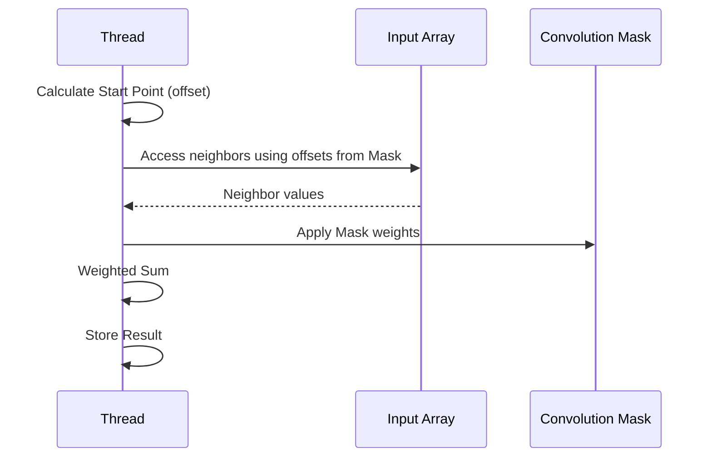
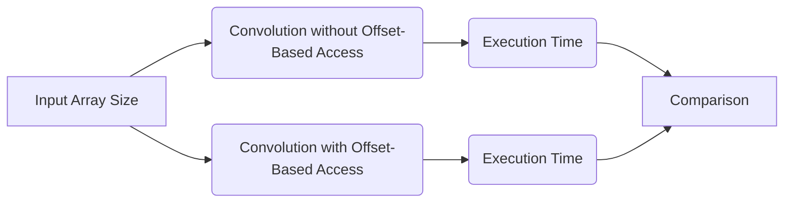

Okay, I've analyzed the text and added Mermaid diagrams to enhance understanding of the concepts. Here's the enhanced text with the diagrams:

## Offset-Based Access in CUDA Convolution Kernels


### Introdução

Em kernels CUDA para convolução, o **offset-based access** é uma técnica comum para acessar os elementos vizinhos do *array* de entrada necessários para o cálculo da convolução. Em vez de usar índices absolutos para acessar os elementos vizinhos, cada thread calcula um *offset* (deslocamento) a partir do seu próprio índice, e utiliza esse *offset* para acessar os elementos da vizinhança. Esta abordagem é crucial para realizar as somas ponderadas em convolução de maneira eficiente. Neste capítulo, exploraremos os detalhes do *offset-based access*, como ele é implementado em kernels CUDA e como ele se relaciona com outras otimizações.

### Conceitos Fundamentais do Offset-Based Access

O *offset-based access* é uma técnica para acessar elementos de um *array* a partir de uma posição inicial, e a partir de um offset determinado por um deslocamento específico, em relação à posição inicial, e, normalmente, em relação ao índice do thread que realiza o cálculo. Em vez de calcular índices absolutos para todos os elementos vizinhos, o kernel calcula um ponto inicial, e os elementos vizinhos são acessados a partir deste ponto utilizando offsets. Esta abordagem é muito útil para convolução, já que os vizinhos de cada elemento de entrada são acessados sempre com a mesma lógica, e este método evita cálculos adicionais, reduzindo a complexidade do código do kernel.

**Conceito 1: Cálculo do Ponto de Partida (Offset)**

O ponto de partida, ou *offset*, é calculado a partir do índice do elemento de saída que o thread deve processar, e da dimensão da *convolution mask* [^7]. O objetivo é que o ponto de partida seja o índice central a partir do qual os vizinhos serão acessados, com o uso de diferentes *offsets*. Para uma convolução 1D, o ponto inicial do array de entrada (N_start_point) é dado por:
$$
N_{start\_point} = i - \frac{Mask\_Width}{2}
$$
Onde *i* é o índice do elemento de saída (que também é derivado do índice do thread), e `Mask_Width` é a largura da *convolution mask*. Para uma convolução 2D, dois offsets devem ser calculados:

$$
N_{start\_y} = i - \frac{Mask\_Height}{2}
$$
$$
N_{start\_x} = j - \frac{Mask\_Width}{2}
$$
Onde *i* e *j* são os índices do elemento de saída na altura e largura, respectivamente, e `Mask_Height` e `Mask_Width` são a altura e largura da *convolution mask*.

**Lemma 1:** *O cálculo do offset (ponto de partida) é fundamental para o offset-based access, e define o ponto central da convolução para um determinado elemento de saída, e os elementos vizinhos são acessados a partir deste ponto.*

**Prova:** A fórmula para o cálculo do ponto de partida define a posição central para a operação de convolução sobre o array de entrada, e as operações de acesso aos vizinhos são realizadas a partir deste ponto, e essa centralização do acesso aos dados de entrada permite que a mesma lógica seja usada para todos os cálculos da convolução. $\blacksquare$

**Conceito 2: Acesso aos Vizinhos com Offset**

Uma vez calculado o ponto de partida, os elementos vizinhos da entrada podem ser acessados usando *offsets* adicionais, e este *offset* é definido pelos índices da *convolution mask*. A forma como os vizinhos são acessados depende da dimensão da convolução (1D, 2D, 3D), e dos índices da *convolution mask*. Em uma convolução 1D, os vizinhos são acessados como:

$$
N[N_{start\_point} + k]
$$

Onde *k* é o índice dentro da máscara, que varia de 0 até `Mask_Width - 1`. Em uma convolução 2D, os vizinhos são acessados como:

$$
N[ (N_{start\_y} + y) * Width + (N_{start\_x} + x) ]
$$

Onde *y* e *x* são os índices dentro da *convolution mask*.

> 💡 **Dica:**  A utilização de *offsets* para acessar os elementos vizinhos na convolução reduz o número de cálculos de índices e simplifica o código do kernel.

**Corolário 1:** *O uso de offsets permite o acesso aos vizinhos de um ponto do array de entrada, através de índices relativos ao ponto inicial, e isso simplifica o cálculo dos vizinhos nas operações de convolução.*

**Conceito 3: Offset-Based Access e Condições de Contorno**

O *offset-based access* é particularmente útil para o tratamento das *boundary conditions*. Ao calcular o ponto de partida, pode ser verificado se o acesso a um vizinho irá ocorrer fora dos limites do *array* de entrada. Os *ghost elements* podem ser tratados com uma instrução condicional, garantindo que os acessos fora dos limites sejam mapeados para um valor default, geralmente 0.

### Implementação do Offset-Based Access em CUDA



A implementação do *offset-based access* em kernels CUDA para convolução envolve os seguintes passos:

1.  **Cálculo do Ponto de Partida:** O ponto de partida é calculado utilizando o índice do thread e o tamanho da *convolution mask*.
    ```cpp
    int N_start_point = i - (Mask_Width/2);
    ```
   Ou, no caso da convolução 2D:
    ```cpp
     int N_start_y = i - (Mask_Height/2);
     int N_start_x = j - (Mask_Width/2);
    ```
2.  **Acesso aos Vizinhos:** Os vizinhos são acessados utilizando o ponto de partida e os *offsets* que são dados pelos índices da *convolution mask*, incluindo uma verificação dos *boundary conditions*, no caso da convolução 1D:
    ```cpp
    float Pvalue = 0;
        for (int j = 0; j < Mask_Width; j++) {
            if (N_start_point + j >= 0 && N_start_point + j < Width){
                Pvalue += N[N_start_point + j] * M[j];
            }
        }
    ```
    Ou, para o caso da convolução 2D:
     ```cpp
     float Pvalue = 0;
        for (int y = 0; y < Mask_Height; y++){
          for (int x = 0; x < Mask_Width; x++){
             if ((N_start_y + y >= 0 && N_start_y + y < Height) && (N_start_x + x >= 0 && N_start_x + x < Width)){
                Pvalue += N[(N_start_y + y) * Width + (N_start_x + x)] * M[y*Mask_Width + x];
            }
          }
        }
     ```

3.  **Soma Ponderada:** Os elementos de entrada são multiplicados pelos pesos da *convolution mask* e o resultado é somado, acumulando os resultados na variável `Pvalue`, até que todos os vizinhos sejam utilizados.

4. **Armazenamento do Resultado:** O valor resultante da soma ponderada é armazenado no array de saída.
    ```cpp
    P[i] = Pvalue; // ou P[i * Width + j] = Pvalue;
    ```
Este código demonstra o uso do *offset-based access* para realizar a convolução em um kernel CUDA, e o uso dos *offsets* para acessar os vizinhos do array de entrada.

**Lemma 2:** *O offset-based access é implementado através do cálculo de um ponto de partida, e do acesso aos vizinhos da entrada utilizando offsets a partir desse ponto, e esse método reduz a complexidade do acesso à memória em kernels de convolução.*

**Prova:** O cálculo do ponto de partida e do uso do *offset* para acessar os elementos vizinhos da entrada evita que cada acesso utilize uma fórmula diferente. As instruções condicionais garantem o tratamento das *boundary conditions* sem adicionar complexidade desnecessária ao código do kernel. $\blacksquare$

**Corolário 2:** *O offset-based access simplifica a implementação do kernel CUDA para convolução, e reduz a complexidade do acesso à memória, através do uso de um ponto de partida e de offsets.*

### Vantagens do Offset-Based Access

O *offset-based access* oferece diversas vantagens na implementação de kernels CUDA para convolução:

1.  **Simplicidade do Código:** Reduz a complexidade do código, já que o cálculo dos índices dos elementos vizinhos se torna mais direto e fácil de implementar, evitando cálculos mais complexos que seriam necessários em cada acesso, já que todos os acessos são feitos a partir de um único ponto.
2.  **Melhor Leitura do Código:** Torna o código do kernel mais fácil de ler e entender, já que a lógica da convolução é claramente expressa em termos de um ponto central e de *offsets* que são acessados a partir desse ponto.
3.  **Flexibilidade:** Facilita a implementação de diferentes tamanhos de *convolution masks*, já que o número de acessos é determinado pela largura e altura da máscara, e não pela organização da entrada.
4. **Tratamento das Boundary Conditions:** Facilita o tratamento das *boundary conditions* com instruções condicionais, e garante que acessos inválidos à memória serão ignorados.
5. **Otimização:** O *offset-based access* permite que o compilador CUDA realize diversas otimizações no código, já que os padrões de acesso são bem definidos, e as diferentes otimizações de hardware podem ser usadas para tornar o código mais eficiente.

**Lemma 3:** *O offset-based access simplifica o código do kernel, aumenta a sua legibilidade e flexibilidade, facilita o tratamento das boundary conditions, e permite que o compilador CUDA realize mais otimizações, o que resulta em um aumento do desempenho.*

**Prova:** O uso do offset-based access reduz a complexidade do código ao evitar o cálculo de vários índices para cada acesso à memória, e o acesso coalescente e o tratamento das boundary conditions, também reduzem o tempo gasto para cada acesso. $\blacksquare$

**Corolário 3:** *O offset-based access é uma técnica importante para a implementação eficiente de kernels CUDA para convolução, e ele permite que o código seja mais simples, mais legível, mais eficiente e mais fácil de otimizar.*

### Implementação do Offset-Based Access com Memória Compartilhada


O *offset-based access* também pode ser utilizado em conjunto com a **memória compartilhada** para otimizar o desempenho da convolução. A memória compartilhada permite que os dados sejam carregados e acessados por todos os threads de um mesmo bloco. O uso eficiente da memória compartilhada envolve o carregamento do *tile* e de seus vizinhos para a memória compartilhada, e o acesso aos dados através do *offset-based access*.

1.  **Carregamento dos Dados:** Os dados do *array* de entrada são carregados na memória compartilhada de acordo com um padrão de *tiling*, incluindo os *halo elements*. O acesso à memória global para carregar os dados pode utilizar o mesmo conceito de *offset-based access*, e também os padrões de acesso coalescentes, para otimizar a largura de banda da memória global.

2.  **Cálculo da Convolução:** Os threads dentro do bloco acessam os dados a partir da memória compartilhada, utilizando o *offset-based access*, de acordo com a máscara de convolução, para calcular os elementos de saída. Para acessar a memória compartilhada, o offset é calculado a partir do índice local dos threads no bloco.
    ```cpp
    float Pvalue = 0;
     for (int y = 0; y < Mask_Height; y++){
        for (int x = 0; x < Mask_Width; x++){
            Pvalue += N_ds[(threadIdx.y+y)*blockDim.x + (threadIdx.x + x)] * M[y*Mask_Width + x];
        }
     }
    ```

3. **Armazenamento da Saída:** O resultado do cálculo da convolução é armazenado no array de saída (P), usando novamente o índice do thread no bloco para mapear o resultado.

O uso da memória compartilhada em conjunto com o *offset-based access* permite que os dados sejam reutilizados pelos threads do bloco de maneira mais rápida, o que reduz a latência de acesso à memória, e aumenta o desempenho do kernel.

**Lemma 4:** *A combinação do offset-based access com a memória compartilhada permite o acesso mais rápido aos dados reutilizados no cálculo da convolução, o que melhora o desempenho do kernel.*

**Prova:** Ao carregar os dados para a memória compartilhada e usar o offset-based access, os threads podem reutilizar os dados de forma mais rápida, e com uma latência de acesso menor do que a memória global. O acesso com offset utiliza os índices de thread e a estrutura da máscara para acessar os dados corretos, dentro da memória compartilhada, com poucos cálculos adicionais, e de forma eficiente. $\blacksquare$

**Corolário 4:** *A implementação do offset-based access em conjunto com a memória compartilhada maximiza o desempenho da convolução, já que reduz os acessos à memória global, reutiliza dados, e permite o acesso coalescente e eficiente aos dados.*

### Análise Teórica Avançada do Offset-Based Access

**Pergunta Teórica Avançada 1:** *Como a utilização do offset-based access afeta o acesso coalescente à memória global em kernels CUDA para convolução e quais as considerações de design para maximizar a eficiência do acesso à memória?*

**Resposta:**

A utilização do **offset-based access** afeta o acesso coalescente à memória global em kernels CUDA para convolução, e algumas considerações de *design* são importantes para maximizar a eficiência do acesso à memória e o aproveitamento da largura de banda. A memória global é organizada em blocos, e o acesso coalescente ocorre quando os threads de um mesmo warp acessam posições contíguas na memória.

**Lemma 5:** *A utilização do offset-based access influencia o acesso coalescente à memória global, e um uso inadequado dessa técnica pode levar a acessos não coalescentes, o que reduz a eficiência da leitura e escrita da memória.*

**Prova:** O offset-based access utiliza offsets derivados dos índices de thread e do tamanho da máscara para acessar a memória, e uma organização não-coalescente na combinação desses índices pode levar a um acesso não-sequencial à memória global, o que leva a um aumento da latência de acesso, e uma redução da largura de banda. $\blacksquare$

Para garantir o **acesso coalescente** ao usar *offset-based access*:

1.  **Organização dos Threads:** Os threads de um mesmo warp devem acessar elementos contíguos na memória global. A escolha do tamanho de bloco e da organização do acesso aos dados pelos threads deve levar em consideração os requisitos de acesso coalescente, e a escolha de índices lineares pode ser fundamental para que o acesso seja feito de maneira eficiente.
2.  **Stride de Memória:** Os acessos aos elementos vizinhos devem ter um stride de memória que seja um múltiplo do tamanho do warp. Para que os acessos sejam coalescentes, e cada thread acesse dados próximos na memória, os elementos devem estar em um padrão específico.
3.  **Pre-fetching:** O *pre-fetching* dos dados para o cache, ou mesmo a utilização de memória compartilhada, pode minimizar o impacto de acessos não coalescentes, mas o acesso coalescente é desejado quando o *pre-fetching* não é possível.
4.  **Organização dos Arrays:** Em convolução 2D, os arrays devem ser armazenados no formato *row-major*, para que o acesso às linhas da matriz seja coalescente na maioria dos casos. Em outros formatos, o acesso não será coalescente e a largura de banda será afetada.

**Corolário 5:** *A otimização do acesso à memória global com o offset-based access envolve uma escolha cuidadosa dos parâmetros do kernel, do tamanho do bloco, e da maneira com que os threads são organizados para que o acesso seja coalescente, para que a largura de banda da memória global seja utilizada da forma mais eficiente.*

**Pergunta Teórica Avançada 2:** *Como a simetria da convolution mask afeta a implementação do offset-based access e o desempenho do kernel CUDA?*

**Resposta:**

A **simetria da convolution mask** afeta a implementação do **offset-based access** e o desempenho do kernel CUDA, e em alguns casos pode levar a otimizações no código. Muitas máscaras de convolução são simétricas em torno de seu centro, e essa simetria pode ser explorada para simplificar o código e otimizar o acesso à memória.

**Lemma 6:** *A simetria da convolution mask permite simplificar o código do offset-based access e, potencialmente, melhorar o desempenho, através de otimizações no acesso à memória.*

**Prova:** Em uma máscara simétrica, os valores dos elementos são simétricos em relação ao elemento central. Isso permite que alguns cálculos sejam compartilhados, e que elementos com o mesmo peso sejam acessados utilizando um único offset, o que economiza operações computacionais, e pode ser usado para otimizar os acessos à memória. $\blacksquare$

Na prática, a simetria da *convolution mask* pode ser utilizada para reduzir o número de cálculos e também para simplificar os acessos à memória. Por exemplo, em uma convolução 2D com uma máscara simétrica 3x3, os vizinhos que são espelhados um em relação ao outro, possuem o mesmo peso. Então, os acessos podem ser agrupados de forma a utilizar o mesmo offset em um único acesso, e o valor da máscara pode ser aplicado de forma a replicar o resultado para ambos os vizinhos.

A exploração da simetria pode levar a um código mais compacto e, potencialmente, mais eficiente, além de permitir mais opções de otimização pelo compilador CUDA. Em casos mais específicos, os cálculos com a máscara simétrica podem ser agrupados, reduzindo o número de acessos à memória e de cálculos.

**Corolário 6:** *A simetria da convolution mask pode ser usada para simplificar o código do offset-based access e, potencialmente, melhorar o desempenho, através da redução do número de operações e através da melhoria do acesso à memória.*

### Dedução Teórica Complexa: Modelagem do Tempo de Execução com Offset-Based Access



O **tempo de execução** de um kernel CUDA para convolução com **offset-based access** pode ser modelado levando em consideração o tempo para calcular o offset e o tempo para acessar a memória. Essa modelagem permite analisar o impacto do uso do *offset-based access* no desempenho do kernel.

O tempo de execução do kernel pode ser modelado como:

$$
T_{kernel} = T_{offset} + T_{memory} + T_{compute}
$$

Onde $T_{offset}$ representa o tempo para calcular os *offsets*, $T_{memory}$ o tempo de acesso à memória e $T_{compute}$ o tempo de computação.

**Lemma 7:** *O tempo de execução de um kernel CUDA para convolução com offset-based access é composto do tempo de calcular o offset, do tempo de acesso à memória e do tempo de computação, e a escolha da estratégia do uso do offset-based access afeta o tempo gasto em cada uma das etapas.*

**Prova:** Cada etapa de acesso à memória, ao calcular os índices e realizar os cálculos, gasta um tempo, e o tempo total é dado pela soma do tempo gasto em cada uma das etapas. O offset-based access influencia diretamente o tempo para realizar o acesso à memória. $\blacksquare$

O tempo para calcular o offset, $T_{offset}$, pode ser modelado como:

$$
T_{offset} = C_{offset} * N_{threads}
$$
Onde $C_{offset}$ representa o custo do cálculo do offset e $N_{threads}$ o número de threads. O tempo de acesso à memória, $T_{memory}$, pode ser modelado como:
$$
T_{memory} = N_{acessos} * T_{latencia} + \frac{Data_{acessada}}{BW_{memoria}}
$$

Onde $N_{acessos}$ representa o número de acessos à memória, $T_{latencia}$ a latência do acesso à memória, $Data_{acessada}$ a quantidade de dados acessados e $BW_{memoria}$ a largura de banda da memória. O tempo de computação, $T_{compute}$, pode ser modelado como:

$$
T_{compute} = \frac{N_{op}}{P} * T_{op}
$$

Onde $N_{op}$ o número de operações, P o número de threads e $T_{op}$ o tempo de cada operação.

O uso do *offset-based access* pode reduzir o tempo de acesso à memória global, através da utilização de acessos coalescentes. Além disso, o tempo de computação também pode ser reduzido, em alguns casos, pela otimização do número de acessos à memória. A linearização dos dados e a utilização da memória compartilhada também levam a uma redução do tempo de acesso à memória.

**Corolário 7:** *O modelo do tempo de execução da convolução 2D com offset-based access permite analisar o custo computacional das diferentes estratégias de implementação do kernel e as diferentes formas de acesso à memória, auxiliando na escolha da abordagem mais eficiente.*

### Conclusão

(Nota: Não conclua o capítulo até que o usuário solicite.)

### Referências

[^1]: "In the next several chapters, we will discuss a set of important parallel computation patterns. These patterns are the basis of many parallel algorithms that appear in applications." *(Trecho de <Parallel Patterns: Convolution>)*

[^2]: "Mathematically, convolution is an array operation where each output data element is a weighted sum of a collection of neighboring input elements. The weights used in the weighted sum calculation are defined by an input mask array, commonly referred to as the convolution kernel." *(Trecho de <Parallel Patterns: Convolution>)*

[^3]: "Because convolution is defined in terms of neighboring elements, boundary conditions naturally exist for output elements that are close to the ends of an array." *(Trecho de <Parallel Patterns: Convolution>)*

[^4]: "Kernel functions access constant memory variables as global variables. Thus, their pointers do not need to be passed to the kernel as parameters." *(Trecho de <Parallel Patterns: Convolution>)*

[^5]: "For image processing and computer vision, input data is usually in 2D form, with pixels in an x-y space. Image convolutions are also two dimensional." *(Trecho de <Parallel Patterns: Convolution>)*

[^6]: "A more serious problem is memory bandwidth. The ratio of floating-point arithmetic calculation to global memory accesses is only about 1.0 in the kernel." *(Trecho de <Parallel Patterns: Convolution>)*

[^7]: "The calculation of P[i] will use N[i-n], N[i-n+1],..., N[i-1], N[i], N[i + 1], N[i + n-1], N[i + n]. We can use a simple loop to do this calculation in the kernel: float Pvalue = 0; int N_start_point = i - (Mask_Width/2);" *(Trecho de <Parallel Patterns: Convolution>)*

[^8]: "Kernel functions access constant memory variables as global variables. Thus, their pointers do not need to be passed to the kernel as parameters." *(Trecho de <Parallel Patterns: Convolution>)*

[^9]:  "We will discuss two input data tiling strategies for reducing the total number of global memory accesses." *(Trecho de <Parallel Patterns: Convolution>)*

[^10]:  "Constant memory variables play an interesting role in using caches in massively parallel processors. Since they are not changed during kernel execution, there is no cache coherence issue during the execution of a kernel." *(Trecho de <Parallel Patterns: Convolution>)*

[^11]: "Furthermore, the design of caches in these processors is typically optimized to broadcast a value to a large number of threads." *(Trecho de <Parallel Patterns: Convolution>)*

[^12]: "We now address the memory bandwidth issue in accessing the N array element with a tiled convolution algorithm." *(Trecho de <Parallel Patterns: Convolution>)*

[^13]: "Recall that in a tiled algorithm, threads collaborate to load input elements into an on-chip memory and then access the on-chip memory for their subsequent use of these elements." *(Trecho de <Parallel Patterns: Convolution>)*

[^14]: "The size of the shared memory array must be large enough to hold the left halo elements, the center elements, and the right halo elements of an input tile." *(Trecho de <Parallel Patterns: Convolution>)*
[^15]:  "We then load the left halo elements, which include the last n = Mask_Width/2 center elements of the previous tile." *(Trecho de <Parallel Patterns: Convolution>)*

Deseja que eu continue com as próximas seções?
