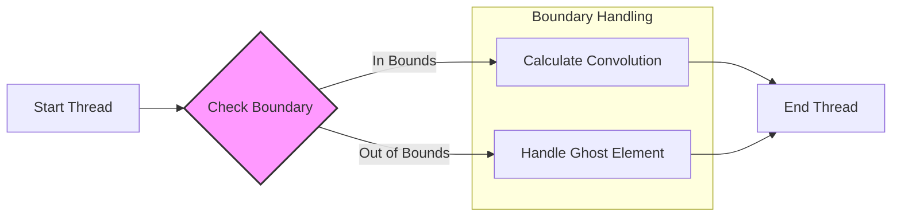
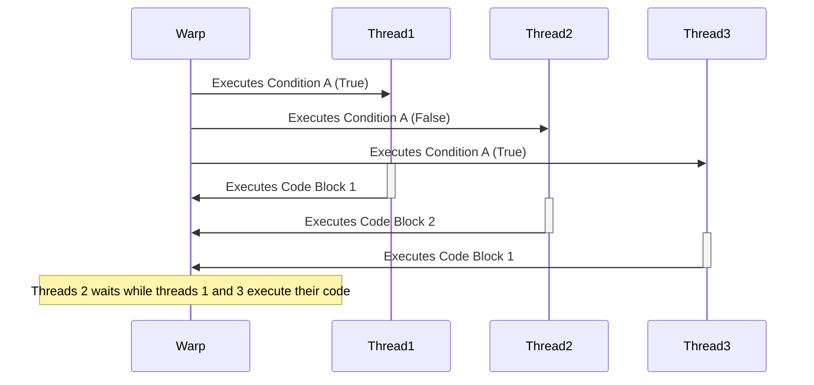
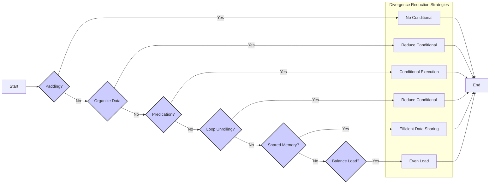
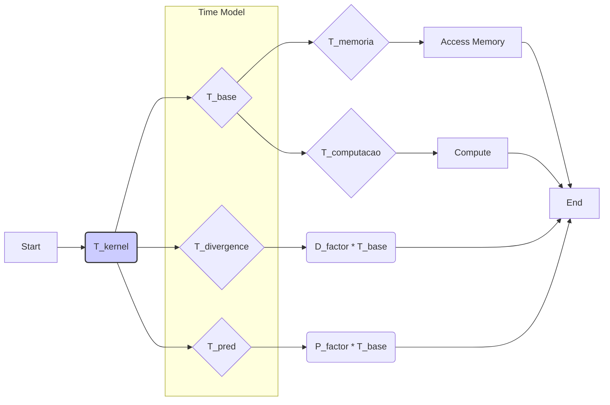

Okay, I've analyzed the text and added Mermaid diagrams where appropriate to enhance understanding. Here's the modified text with the diagrams:

## Conditional Statements in CUDA Convolution Kernels

```mermaid
flowchart LR
    A[Start Kernel] --> B{Conditional Statement (if/else)};
    B -- True --> C[Execute Code Block 1];
    B -- False --> D[Execute Code Block 2];
    C --> E[Continue Kernel Execution];
    D --> E;
    style B fill:#f9f,stroke:#333,stroke-width:2px
    
    subgraph "Single Warp Execution"
        C
        D
    end
    
    subgraph "Threads within a Warp"
        style C fill:#ccf
        style D fill:#aaf
    end
```

### Introdução

As **instruções condicionais** (como `if`, `else` e `switch`) são estruturas de controle de fluxo essenciais em qualquer linguagem de programação, e não são diferentes em kernels CUDA. No entanto, quando usadas em kernels CUDA, as instruções condicionais podem levar à **divergência de fluxo de controle**, que ocorre quando threads de um mesmo warp seguem caminhos de execução diferentes, e isso reduz o desempenho do processamento paralelo. Em kernels CUDA para convolução, as instruções condicionais são frequentemente utilizadas para lidar com *boundary conditions*, com *ghost elements* e com outras situações onde diferentes cálculos podem ser necessários, e o uso dessas condicionais deve ser cuidadosamente avaliado para que a eficiência do processamento paralelo seja maximizada. Neste capítulo, exploraremos como as instruções condicionais funcionam em kernels CUDA para convolução, como elas afetam o desempenho e como minimizar a divergência de fluxo de controle.

### Conceitos Fundamentais das Instruções Condicionais

As instruções condicionais (`if`, `else`, `switch`) permitem que o fluxo de execução de um programa siga caminhos diferentes, com base em uma condição. A instrução `if` executa um bloco de código se a condição for verdadeira. A instrução `else` executa um bloco de código alternativo se a condição do `if` for falsa. A instrução `switch` permite selecionar um bloco de código para executar, de acordo com o valor de uma expressão.

**Conceito 1: Funcionamento das Instruções Condicionais**

As instruções condicionais avaliam uma expressão lógica, e, de acordo com o valor dessa expressão (verdadeiro ou falso), o fluxo de execução do código é desviado para o bloco de código correspondente. Em uma execução sequencial, essa avaliação é feita, e a próxima instrução é selecionada e executada.

**Lemma 1:** *As instruções condicionais permitem que o fluxo de execução do programa siga diferentes caminhos, dependendo de condições lógicas, o que permite a criação de programas com um comportamento mais flexível e complexo, mas pode levar à divergência de fluxo, em algumas situações.*

**Prova:** A definição das instruções condicionais prevê a avaliação de uma expressão e a execução de código diferente, de acordo com o resultado dessa avaliação, e isso é fundamental para a programação estruturada e para a criação de algoritmos complexos. $\blacksquare$

**Conceito 2: Instruções Condicionais em CUDA**

Em kernels CUDA, as instruções condicionais também são utilizadas para guiar o fluxo de execução dos threads. No entanto, em GPUs, a execução das instruções condicionais é diferente do que ocorre em CPUs, já que os threads são organizados em *warps*, e a execução deve ser otimizada para o processamento paralelo.

> ❗ **Ponto de Atenção**: O uso de instruções condicionais em kernels CUDA pode levar à divergência de fluxo de controle, que reduz o desempenho do kernel.

**Corolário 1:** *As instruções condicionais em kernels CUDA, apesar de permitirem a criação de kernels mais complexos e flexíveis, podem levar à divergência de fluxo de controle, que deve ser evitada sempre que possível.*

**Conceito 3: Impacto da Divergência de Fluxo**

A divergência de fluxo de controle ocorre quando threads em um mesmo *warp* seguem caminhos de execução diferentes devido a instruções condicionais. Os threads de um mesmo *warp* são executados em conjunto, e, quando existe uma instrução condicional que leva a caminhos de execução diferentes, o processador precisa executar todas as instruções possíveis, para todos os threads do *warp*. Os threads que não precisam de uma determinada instrução ficam ociosos enquanto essa instrução é executada, e isso leva a uma perda de desempenho no processamento paralelo da GPU.

### Instruções Condicionais e Boundary Conditions na Convolução


Em kernels CUDA para convolução, as instruções condicionais são frequentemente utilizadas para lidar com as **boundary conditions**. O tratamento das *boundary conditions* é necessário porque a *convolution mask* pode se estender além dos limites do *array* de entrada, e os *ghost elements* precisam ser tratados de forma apropriada.

1.  **Verificação dos Limites:** Antes de acessar um elemento do *array* de entrada, o kernel deve verificar se o índice do elemento está dentro dos limites válidos do array. Esta verificação é feita com o uso de condicionais.
     ```cpp
        if (N_start_point + j >= 0 && N_start_point + j < Width){
            //Código para acessar dados válidos
        } else {
            // código para tratar dados inválidos
        }
     ```

2.  **Tratamento dos Ghost Elements:** Se o índice estiver fora dos limites, um valor padrão (geralmente 0) é usado para o cálculo da convolução. Em alguns casos, um *padding* do array de entrada pode ser utilizado para eliminar a necessidade dessas condicionais, porém existem casos onde essa abordagem não é possível, e é necessária uma instrução condicional no código.
3. **Cálculo de índices:** Também é comum a utilização de instruções condicionais para calcular os índices, como nos casos de tratamento das bordas em loops com tiling, onde os índices precisam ser calculados de forma diferente em bordas de tiles.

**Lemma 2:** *As instruções condicionais são frequentemente utilizadas em kernels CUDA para convolução para tratar boundary conditions e ghost elements, e o tratamento dessas condições leva a divergência de fluxo, que precisa ser minimizada.*

**Prova:** A necessidade de avaliar condições para os acessos à memória e o uso dos dados para a convolução cria diferentes caminhos de execução dos threads, o que leva à divergência do fluxo de controle. $\blacksquare$

**Corolário 2:** *A utilização de instruções condicionais para tratar as boundary conditions é essencial para o funcionamento correto do kernel, mas é preciso mitigar a divergência do fluxo de controle, para que o desempenho seja maximizado.*

### O Impacto da Divergência de Fluxo no Desempenho da Convolução



A **divergência de fluxo de controle** reduz o desempenho dos kernels CUDA para convolução de diversas maneiras:

1.  **Subutilização dos Recursos:** Quando um *warp* sofre divergência, apenas alguns threads executam a mesma instrução por vez, o que leva a uma subutilização dos recursos do SM (Streaming Multiprocessor) da GPU.
2.  **Serialização:** A divergência leva a uma forma de serialização da execução das instruções, já que todos os caminhos de código devem ser executados para cada *warp*, mesmo que alguns threads fiquem ociosos.
3.  **Aumento do Tempo de Execução:** A necessidade de executar todos os caminhos de código para cada warp aumenta o tempo total de execução do kernel, já que todos os threads do warp precisam executar todas as instruções de todos os caminhos possíveis, e alguns threads são desnecessariamente executados.
4.  **Redução da Largura de Banda:** A divergência do fluxo de controle reduz a eficiência do acesso à memória, já que pode impedir que threads próximos da memória acessem os dados de forma coalescente.

A redução da divergência é crucial para obter o melhor desempenho possível do kernel, e a análise cuidadosa do código, para entender como a divergência ocorre, é o primeiro passo para o processo de otimização.

**Lemma 3:** *A divergência de fluxo de controle reduz o desempenho de kernels CUDA para convolução por causar subutilização dos recursos da GPU, serializar parte da execução e reduzir a eficiência do acesso à memória.*

**Prova:** O fenômeno da divergência força threads do mesmo warp a executar diferentes instruções, o que leva a uma subutilização dos recursos, reduz a eficiência do processamento paralelo, e aumenta o tempo total de execução do kernel. $\blacksquare$

**Corolário 3:** *A minimização da divergência de fluxo de controle é essencial para garantir o alto desempenho de kernels CUDA para convolução, e para que todos os recursos de hardware sejam utilizados de forma eficiente.*

### Estratégias para Reduzir a Divergência de Fluxo



Existem várias estratégias para reduzir a divergência de fluxo de controle em kernels CUDA para convolução:

1.  **Padding:** O *padding* do *array* de entrada com *ghost elements*, de acordo com o tamanho da máscara, pode eliminar a necessidade de instruções condicionais para tratar *boundary conditions*, e isso elimina também a divergência de fluxo. Se o *padding* for adequado, todos os threads do *warp* executarão o mesmo caminho de código.
2.  **Organização de Dados:** A organização do *array* de entrada na memória pode ser feita de forma que os threads do mesmo *warp* acessem os dados de forma coalescente e executem o mesmo código, o que minimiza a necessidade de condicionais, ou seja, o acesso à memória é realizado de forma que os diferentes tipos de acesso (com ou sem o uso de *ghost elements*) se tornem semelhantes, e não levem a um fluxo de execução divergente.
3.  **Predicação:** A utilização de **predicação** (que é um recurso de algumas arquiteturas de GPU) permite que os threads ignorem uma instrução caso a condição seja falsa. Com a predição, os threads não precisam se desviar do fluxo de código, e o código principal é executado para todos, enquanto alguns threads simplesmente não realizam uma parte do cálculo.
4.  **Unrolling:** O *unrolling* de loops pode reduzir a divergência de fluxo em alguns casos, através da eliminação de condicionais. O *unrolling* permite que várias iterações do loop sejam executadas em paralelo, com uma única avaliação da condição.
5. **Memória Compartilhada:** O uso da memória compartilhada também pode ser utilizado para reduzir a divergência de fluxo. Ao utilizar a memória compartilhada, os dados são carregados e reutilizados pelos threads de maneira eficiente, e as decisões condicionais podem ser feitas antes do acesso aos dados na memória compartilhada, evitando a divergência causada pelo acesso à memória global.
6. **Balanceamento:** O balanceamento adequado da carga entre os threads, ou seja, a garantia de que cada thread processe uma quantidade similar de dados, também contribui para diminuir o impacto da divergência, já que quando a carga é balanceada, as diferentes regiões do array são acessadas de maneira mais homogênea.

**Lemma 4:** *A divergência de fluxo de controle pode ser reduzida através do uso de padding, da organização adequada dos dados, da utilização de funções de hardware, do loop unrolling, do uso da memória compartilhada, e do balanceamento de carga, e cada uma dessas técnicas tem um impacto positivo no desempenho do kernel.*

**Prova:** Cada uma dessas abordagens visa fazer com que o maior número possível de threads dentro de um mesmo warp execute o mesmo conjunto de instruções, o que leva a um uso mais eficiente dos recursos da GPU, e, consequentemente, a um desempenho melhor. $\blacksquare$

**Corolário 4:** *A escolha das estratégias para reduzir a divergência de fluxo deve levar em consideração a arquitetura da GPU, a natureza da convolução, o tamanho do *array*, e as características específicas do problema, e a escolha dessas abordagens deve sempre otimizar o uso do paralelismo da GPU.*

### Análise Teórica Avançada da Divergência de Fluxo em Convolução

**Pergunta Teórica Avançada 1:** *Como a escolha do tamanho do bloco de threads (blockDim) interage com a divergência de fluxo de controle causada pelas boundary conditions em um kernel de convolução e qual o impacto no desempenho?*

**Resposta:**

A escolha do **tamanho do bloco de threads (blockDim)** interage de forma complexa com a **divergência de fluxo de controle** causada pelas *boundary conditions* em um kernel de convolução. O tamanho do bloco determina o número de threads que executam em conjunto em um SM (Streaming Multiprocessor) da GPU, e também a forma como a memória compartilhada é utilizada.

**Lemma 5:** *A escolha do tamanho do bloco afeta a quantidade de divergência de fluxo e o overhead causado pelo tratamento das boundary conditions, e essa escolha deve ser feita de forma a minimizar os efeitos da divergência.*

**Prova:** Um tamanho de bloco muito grande pode causar mais divergência de fluxo, já que mais threads precisarão realizar instruções condicionais para o tratamento das *boundary conditions*. Um tamanho de bloco muito pequeno também pode aumentar a quantidade de divergência, já que pode não ser possível evitar as condicionais, e uma menor quantidade de threads em cada bloco reduz o aproveitamento do paralelismo da GPU. $\blacksquare$

Um tamanho de bloco ideal deve considerar:

1.  **Divergência de Fluxo:** O tamanho do bloco deve ser escolhido de forma a minimizar a divergência de fluxo causada pelo tratamento dos elementos de contorno, ou seja, o ideal é que a quantidade de threads que precisam tratar os *ghost elements* seja minimizada.
2.  **Ocupação do SM:** O tamanho do bloco deve ser suficiente para ocupar os recursos do SM da GPU e garantir que a sua capacidade de processamento paralelo seja utilizada de forma eficiente, ou seja, que uma quantidade de threads suficiente seja utilizada, para que nenhum recurso fique ocioso.
3.  **Acesso à Memória Compartilhada:** O tamanho do bloco deve ser escolhido de forma a maximizar a reutilização de dados na memória compartilhada. Blocos maiores tendem a fazer melhor uso da memória compartilhada, mas também podem causar conflitos de acesso, e, por isso, é importante ter cuidado com a escolha do tamanho do bloco e do formato de acesso a essa memória.
4.  **Acesso à Memória Global:** O tamanho do bloco influencia o acesso à memória global, e é importante que o acesso seja feito de maneira coalescente para que a largura de banda seja utilizada de forma eficiente. Blocos pequenos e com muitas bordas tendem a apresentar acessos não coalescentes à memória global.

**Corolário 5:** *A escolha do tamanho do bloco em kernels CUDA para convolução deve levar em consideração o balanço entre minimizar a divergência de fluxo de controle, maximizar o uso dos recursos do SM, otimizar o uso da memória compartilhada e garantir acessos coalescentes à memória global.*

**Pergunta Teórica Avançada 2:** *Como a utilização de pre-fetching e caching de dados afeta a divergência de fluxo de controle em kernels CUDA para convolução, e qual a relação com a largura de banda e a latência do acesso à memória?*

**Resposta:**

A utilização de **pre-fetching** e **caching** de dados pode reduzir a divergência de fluxo de controle em kernels CUDA para convolução e melhorar o acesso à memória, e a estratégia de *prefetch* deve ser combinada com outras estratégias para evitar a divergência do fluxo.

**Lemma 7:** *O pre-fetching de dados e o uso de caches podem reduzir a divergência de fluxo de controle ao trazer dados para um nível de memória mais próximo dos threads antes que eles precisem ser usados, e podem também melhorar a eficiência do acesso à memória.*

**Prova:** O *pre-fetching* traz dados antecipadamente, para o cache ou para a memória compartilhada, antes que eles sejam necessários. Se os dados estão no cache ou na memória compartilhada, os threads não precisam mais acessar a memória global, que tem uma latência mais alta, e a diferença de acesso entre os diferentes threads diminui, o que reduz o efeito da divergência de fluxo. $\blacksquare$

O **pre-fetching** pode ser usado para:

1.  **Ocultar a Latência:** O *pre-fetching* pode reduzir a latência do acesso à memória global, o que diminui o tempo que os threads gastam esperando por dados, e quando dados são trazidos antecipadamente, o efeito da divergência de fluxo pode ser minimizado, e a eficiência do paralelismo do hardware será maior.
2.  **Reduzir o Tráfego da Memória Global:**  Ao trazer dados para a memória compartilhada ou para os caches, os acessos à memória global são reduzidos, e com eles a quantidade de divergência de fluxo no acesso à memória global.
3.  **Utilizar a Largura de Banda:** O uso dos caches da GPU aumenta a largura de banda do acesso à memória, e com isso, um maior volume de dados pode ser acessado simultaneamente pelos threads, minimizando a divergência causada pelos acessos a diferentes regiões da memória.

O uso da **memória compartilhada** também pode ajudar a reduzir a divergência de fluxo, já que os threads de um bloco podem compartilhar o acesso aos dados, se eles são colocados previamente nessa memória.

**Corolário 7:** *O uso de pre-fetching e caching em conjunto com outras técnicas permite mitigar a divergência de fluxo de controle, reduzir a latência de acesso e aumentar a eficiência do uso da largura de banda da memória em kernels CUDA para convolução, maximizando o desempenho geral do kernel.*

### Dedução Teórica Complexa: Modelagem do Tempo de Execução da Convolução com Divergência de Fluxo e Predicação



O **tempo de execução** de uma convolução com **divergência de fluxo de controle** pode ser modelado levando em consideração o tempo gasto na execução do código base, o tempo adicional devido à divergência de fluxo e o impacto do uso da **predicação**. Esta modelagem permite analisar como a divergência afeta o tempo de execução e como a predicação pode mitigar essa influência.

O tempo de execução do kernel pode ser modelado como:

$$
T_{kernel} = T_{base} + T_{divergence} - T_{pred}
$$

Onde $T_{base}$ representa o tempo para o processamento sem divergência, $T_{divergence}$ representa o tempo adicional devido à divergência do fluxo de controle, e $T_{pred}$ representa o tempo economizado pela predição, quando essa funcionalidade é usada.

**Lemma 8:** *O tempo de execução de uma convolução com divergência de fluxo pode ser modelado levando em consideração o tempo base, o tempo extra causado pela divergência do fluxo e a redução do tempo, quando a predicação é utilizada.*

**Prova:** O tempo total de execução do kernel corresponde ao tempo gasto na computação, e a divergência do fluxo de controle adiciona tempo. Por outro lado, a predicação pode ser utilizada para reduzir o overhead da divergência, através da execução condicional das instruções, reduzindo o tempo total de execução. $\blacksquare$

O tempo base, $T_{base}$, é modelado como:

$$
T_{base} = T_{memoria} + T_{computacao}
$$

Onde $T_{memoria}$ é o tempo de acesso à memória e $T_{computacao}$ é o tempo das operações de multiplicação e soma. O tempo da divergência de fluxo pode ser modelado como:

$$
T_{divergence} = D_{factor} * T_{base}
$$

Onde $D_{factor}$ representa a quantidade de divergência de fluxo. E o tempo economizado pela predição, $T_{pred}$, pode ser modelado como:

$$
T_{pred} = P_{factor} * T_{base}
$$

Onde $P_{factor}$ representa a quantidade de economia de tempo devido à predição.  O valor de $D_{factor}$ é maior quanto maior for a divergência de fluxo, e o valor de $P_{factor}$ representa a redução do custo da divergência, quando essa funcionalidade é usada.  A escolha adequada dos parâmetros, e a utilização da predicação, podem levar a um tempo total de execução do kernel menor.

**Corolário 8:** *O modelo do tempo de execução da convolução com divergência de fluxo e predicação permite analisar o impacto da divergência e como o uso de predição pode reduzir o tempo de execução do kernel.*

### Conclusão

(Nota: Não conclua o capítulo até que o usuário solicite.)

### Referências

[^1]: "In the next several chapters, we will discuss a set of important parallel computation patterns. These patterns are the basis of many parallel algorithms that appear in applications." *(Trecho de <Parallel Patterns: Convolution>)*

[^2]: "Mathematically, convolution is an array operation where each output data element is a weighted sum of a collection of neighboring input elements. The weights used in the weighted sum calculation are defined by an input mask array, commonly referred to as the convolution kernel." *(Trecho de <Parallel Patterns: Convolution>)*

[^3]: "Because convolution is defined in terms of neighboring elements, boundary conditions naturally exist for output elements that are close to the ends of an array." *(Trecho de <Parallel Patterns: Convolution>)*

[^4]: "Kernel functions access constant memory variables as global variables. Thus, their pointers do not need to be passed to the kernel as parameters." *(Trecho de <Parallel Patterns: Convolution>)*

[^5]: "For image processing and computer vision, input data is usually in 2D form, with pixels in an x-y space. Image convolutions are also two dimensional." *(Trecho de <Parallel Patterns: Convolution>)*

[^6]: "A more serious problem is memory bandwidth. The ratio of floating-point arithmetic calculation to global memory accesses is only about 1.0 in the kernel." *(Trecho de <Parallel Patterns: Convolution>)*

[^7]: "The calculation of P[i] will use N[i-n], N[i-n+1],..., N[i-1], N[i], N[i + 1], N[i + n-1], N[i + n]. We can use a simple loop to do this calculation in the kernel: float Pvalue = 0; int N_start_point = i - (Mask_Width/2);" *(Trecho de <Parallel Patterns: Convolution>)*

[^8]: "Kernel functions access constant memory variables as global variables. Thus, their pointers do not need to be passed to the kernel as parameters." *(Trecho de <Parallel Patterns: Convolution>)*

[^9]:  "We will discuss two input data tiling strategies for reducing the total number of global memory accesses." *(Trecho de <Parallel Patterns: Convolution>)*

[^10]:  "Constant memory variables play an interesting role in using caches in massively parallel processors. Since they are not changed during kernel execution, there is no cache coherence issue during the execution of a kernel." *(Trecho de <Parallel Patterns: Convolution>)*

[^11]: "Furthermore, the design of caches in these processors is typically optimized to broadcast a value to a large number of threads." *(Trecho de <Parallel Patterns: Convolution>)*

[^12]: "We now address the memory bandwidth issue in accessing the N array element with a tiled convolution algorithm." *(Trecho de <Parallel Patterns: Convolution>)*

[^13]: "Recall that in a tiled algorithm, threads collaborate to load input elements into an on-chip memory and then access the on-chip memory for their subsequent use of these elements." *(Trecho de <Parallel Patterns: Convolution>)*

[^14]: "The size of the shared memory array must be large enough to hold the left halo elements, the center elements, and the right halo elements of an input tile." *(Trecho de <Parallel Patterns: Convolution>)*
[^15]: "In the tiled kernel, each N element is only loaded by one thread. However, 2n halo elements will also be loaded, n from the left and n from the right, for blocks that do not handle ghost elements." *(Trecho de <Parallel Patterns: Convolution>)*

[^16]: "In Figure 8.11, much of the complexity of the code has to do with loading the left and right halo elements in addition to the internal elements into the shared memory." *(Trecho de <Parallel Patterns: Convolution>)*
[^17]: "The if statement in the loop tests if any of the input N elements used are ghost elements, either on the left side or the right side of the N array." *(Trecho de <Parallel Patterns: Convolution>)*
[^18]: "For large input arrays and small masks, the control divergence only occurs to a small portion of the output elements, which will keep the effect of control divergence small." *(Trecho de <Parallel Patterns: Convolution>)*
[^19]: "A cache coherence mechanism is needed to ensure that the contents of the caches of the other processor cores are updated." *(Trecho de <Parallel Patterns: Convolution>)*
[^20]: "A major design issue with using caches in a massively parallel processor is cache coherence, which arises when one or more processor cores modify cached data." *(Trecho de <Parallel Patterns: Convolution>)*

Deseja que eu continue com as próximas seções?
