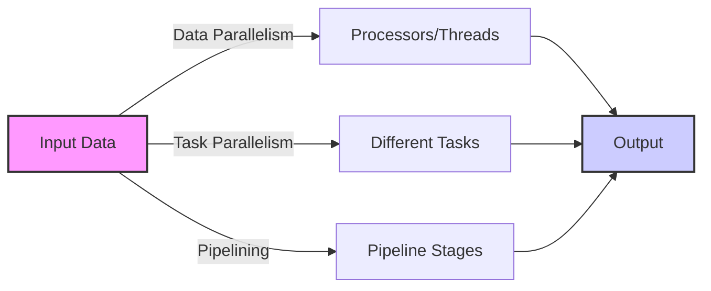
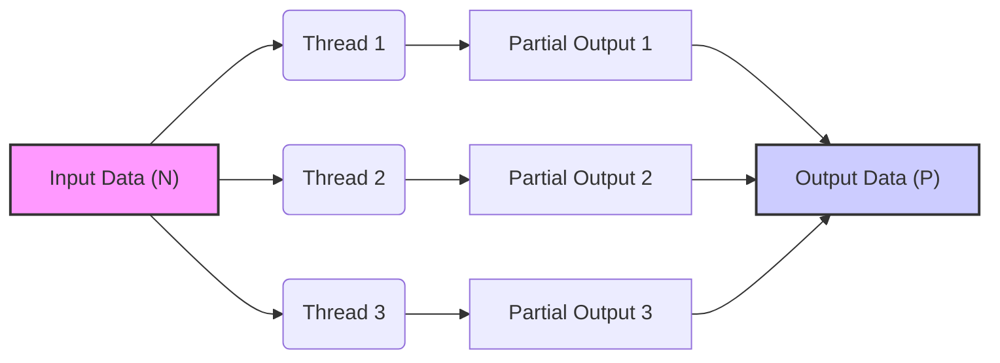
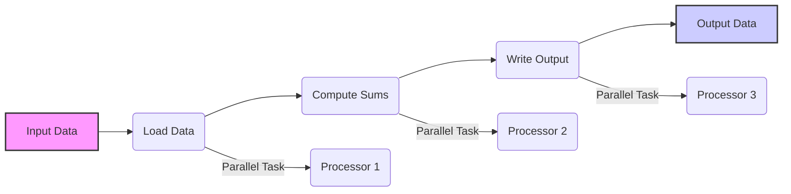
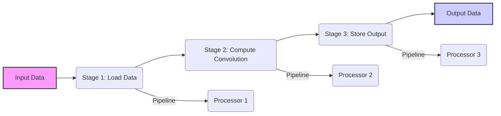
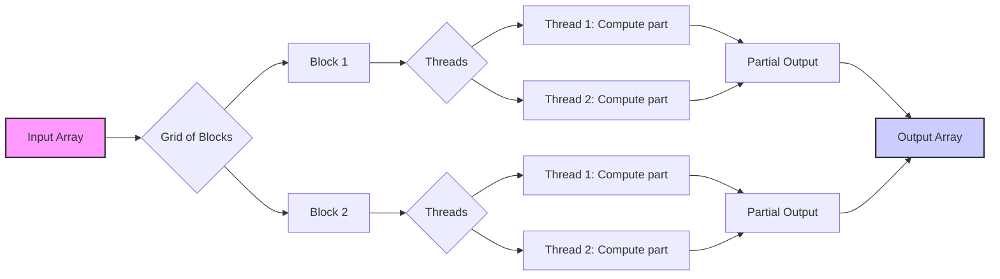
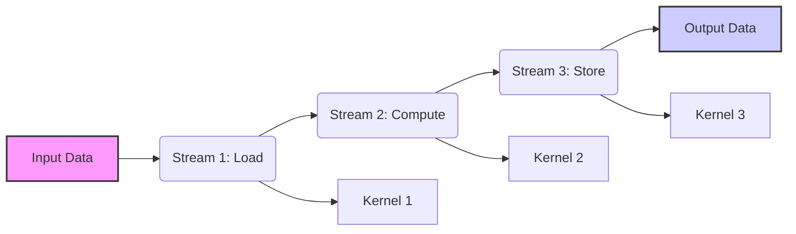
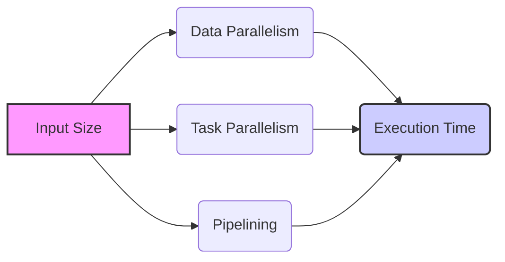

Okay, I understand. Here's the enhanced text with Mermaid diagrams added:

## Parallelism in Convolution



### Introdução

A **convolução**, devido à sua natureza computacionalmente intensiva, é um excelente candidato para a computação paralela. As tarefas envolvidas na convolução (multiplicação e acumulação) podem ser distribuídas entre múltiplos processadores (ou cores de processadores, ou threads) para reduzir o tempo de execução. Neste capítulo, exploraremos como o **paralelismo** pode ser aplicado à convolução, incluindo as diferentes formas de paralelização, suas vantagens e desvantagens e como elas são implementadas em CUDA.

### Formas de Paralelismo em Convolução

A convolução pode ser paralelizada de diferentes maneiras, cada uma com suas próprias características e requisitos. As abordagens mais comuns incluem:

1.  **Paralelismo de Dados (Data Parallelism):** Divide os dados de entrada entre os processadores, com cada processador trabalhando em uma parte diferente dos dados [^1]. Esta abordagem é muito utilizada para algoritmos que realizam a mesma operação sobre um grande conjunto de dados, como a convolução.
2.  **Paralelismo de Tarefas (Task Parallelism):** Divide as diferentes tarefas do algoritmo entre os processadores. Esta abordagem pode ser utilizada quando diferentes partes do algoritmo podem ser executadas em paralelo, mas não é uma abordagem natural para a convolução, e geralmente é combinada com outros métodos de paralelismo.
3.  **Pipelining:** Divide o algoritmo em etapas e utiliza vários processadores para realizar as diferentes etapas simultaneamente, em um modelo de "linha de montagem". Este método é útil para algoritmos que podem ser divididos em etapas sequenciais, e também é combinada com outras abordagens de paralelismo.

**Conceito 1: Paralelismo de Dados (Data Parallelism) em Convolução**

Em **paralelismo de dados**, cada thread ou processador é responsável por calcular a convolução para um subconjunto dos elementos de saída [^1]. Em uma convolução 1D, cada thread pode ser responsável por calcular um ou mais elementos de saída do array P, utilizando partes da entrada N e da máscara M. Em uma convolução 2D, cada thread é responsável por calcular um ou mais *pixels* da imagem de saída. Em ambos os casos, a mesma operação (multiplicação e acumulação) é realizada em diferentes porções dos dados, e o paralelismo é alcançado pela execução simultânea dessas operações pelos diferentes threads.



**Lemma 1:** *Em paralelismo de dados, o array de entrada é dividido entre os processadores, e cada processador executa a mesma operação (a convolução) sobre sua porção de dados de forma independente.*

**Prova:** O paralelismo de dados divide os dados de entrada entre os threads (ou processadores), e cada um desses processadores calcula a mesma operação para uma porção dos dados. Como o cálculo de cada elemento na convolução é independente (exceto pelas *boundary conditions*), as porções da entrada que são processadas por diferentes threads não se afetam. Portanto, o paralelismo de dados é uma abordagem que pode ser utilizada na convolução, já que a mesma operação é realizada sobre diferentes partes do *array* de dados. $\blacksquare$

**Conceito 2: Paralelismo de Tarefas (Task Parallelism) em Convolução**

Em **paralelismo de tarefas**, as diferentes tarefas envolvidas na convolução podem ser distribuídas entre diferentes processadores. Em convolução, diferentes tarefas podem ser identificadas, como: carregamento dos dados de entrada, cálculo das somas ponderadas, escrita dos resultados na saída e o tratamento das *boundary conditions*. Esta abordagem pode ser útil para arquiteturas heterogêneas, mas em GPUs ela geralmente é menos comum em aplicações simples de convolução, sendo mais utilizada em casos onde diferentes etapas de pré-processamento ou pós-processamento podem ocorrer em paralelo. Em GPUs, geralmente, o paralelismo de tarefas é realizado com o uso de múltiplas *streams* que executam diferentes kernels em paralelo.



**Corolário 1:** *O paralelismo de tarefas divide as diferentes etapas do algoritmo de convolução entre os threads ou processadores, e esse método pode ser utilizado em conjunção com o paralelismo de dados, em casos mais complexos.*

**Conceito 3: Pipelining em Convolução**

Em **pipelining**, a operação de convolução é dividida em etapas, e diferentes processadores são designados para realizar cada etapa. Os dados fluem através do *pipeline*, com cada etapa realizando um pequeno processamento sobre o dado. Em uma convolução, por exemplo, uma etapa pode carregar dados na memória compartilhada, outra pode calcular a soma ponderada e outra pode armazenar o resultado. O *pipelining* pode ser mais útil em processadores com hardware específico para uma determinada operação ou em casos em que os dados podem ser processados de forma sequencial, em etapas, com uma dependência entre as etapas. Essa abordagem também é combinada com outros tipos de paralelismo em situações mais complexas, e em GPUs ela é menos comum em casos simples de convolução.



> 💡 **Dica:** Em GPUs, o *pipelining* pode ser implementado através do uso de várias *streams* que executam diferentes kernels em paralelo, combinando o *pipelining* com o paralelismo de dados.

### Implementação do Paralelismo de Dados em CUDA para Convolução



A implementação do **paralelismo de dados** em CUDA para convolução envolve a organização dos threads em blocos e grids e a atribuição de diferentes porções do array de entrada a cada thread. O objetivo é que cada thread execute o mesmo código sobre dados diferentes, de forma simultânea.

1.  **Mapeamento de Threads para Dados:** Os índices dos threads são utilizados para calcular a porção do array que cada thread deve processar. O número de threads por bloco, e de blocos na grade são definidos para que todos os elementos do array de saída sejam processados.

   ```cpp
   int i = blockIdx.y * blockDim.y + threadIdx.y;
   int j = blockIdx.x * blockDim.x + threadIdx.x;
   ```

2.  **Cálculo Independente:** Cada thread realiza o cálculo da convolução para a sua parte dos dados.

   ```cpp
   float Pvalue = 0;
   for(int y = -n; y <= n; y++){
       for (int x = -n; x <= n; x++){
           if ((i + y >= 0 && i + y < height) && (j + x >= 0 && j + x < width)){
                Pvalue += N[(i+y)*width + (j + x)] * M[(y+n)*mask_width + (x+n)];
           }
       }
    }
   P[i * width + j] = Pvalue;
   ```

3.  **Sincronização:** Em alguns casos, pode ser necessário usar uma sincronização de threads para garantir que todas as threads de um bloco tenham acesso aos dados corretamente carregados na memória compartilhada, antes que os cálculos sejam iniciados, como ocorre no caso de algoritmos com tiling.

**Lemma 2:** *A implementação do paralelismo de dados em CUDA para convolução mapeia os threads para diferentes porções de dados e executa a mesma operação em paralelo, o que resulta em um processamento mais rápido.*

**Prova:** O modelo de paralelismo de dados é alcançado através da execução da mesma operação de convolução por diferentes threads em diferentes partes dos dados. A organização em blocos e grids garante que todos os elementos do array de saída sejam processados, e o uso da mesma operação por cada thread permite um ganho de desempenho. $\blacksquare$

**Corolário 2:** *O uso de blocos e threads em CUDA permite realizar a convolução em paralelo através do paralelismo de dados, com cada thread executando uma parte da computação, o que resulta em um processamento mais rápido.*

### Implementação do Paralelismo de Tarefas e Pipelining em CUDA



O **paralelismo de tarefas** e o **pipelining** podem ser implementados em CUDA utilizando *streams*. Uma *stream* é uma sequência de operações que são executadas na GPU. Diferentes *streams* podem ser usadas para executar diferentes tarefas de forma paralela ou realizar operações em *pipeline*.

1.  **Streams:** A criação de várias *streams* permite que diferentes kernels sejam executados simultaneamente. Por exemplo, uma *stream* pode ser usada para realizar o carregamento dos dados, outra para o cálculo da convolução, e outra para o armazenamento do resultado, com dependências entre elas, no caso do *pipelining*.
    ```cpp
    cudaStream_t stream1, stream2, stream3;
    cudaStreamCreate(&stream1);
    cudaStreamCreate(&stream2);
    cudaStreamCreate(&stream3);
    ```

2.  **Kernels:** Cada kernel pode ser associado a uma stream diferente, para a realização de tarefas diferentes e para criar um pipeline, com o uso de dependências para criar o fluxo de dados entre as etapas.
    ```cpp
    convolutionLoadData<<<grid1, block1, 0, stream1>>>(N, ...);
    convolutionCompute<<<grid2, block2, 0, stream2>>>(N, M, P, ...);
    convolutionStoreData<<<grid3, block3, 0, stream3>>>(P, ...);
    ```

3.  **Dependências:** As dependências entre as streams são definidas para garantir que os dados sejam processados na ordem correta. Em um pipeline, por exemplo, a stream que realiza o cálculo da convolução deve esperar a stream que carrega os dados ser finalizada, e depois, uma stream que armazena o resultado pode iniciar.
    ```cpp
    cudaEvent_t event;
    cudaEventCreate(&event);
    cudaEventRecord(event, stream1);
    cudaStreamWaitEvent(stream2, event, 0);
    cudaEventRecord(event, stream2);
    cudaStreamWaitEvent(stream3, event, 0);
    ```
O uso das streams em conjunto com a execução de diferentes kernels pode levar a um aumento no processamento paralelo através do *task parallelism* e do *pipelining*. No entanto, em implementações simples de convolução, essa abordagem geralmente é menos eficiente, e o *data parallelism* costuma ser suficiente.

**Lemma 3:** *O paralelismo de tarefas e pipelining podem ser implementados em CUDA usando múltiplas streams e kernels, o que permite que diferentes etapas do algoritmo sejam executadas em paralelo.*

**Prova:** O uso de diferentes streams permite que diferentes tarefas (kernels) sejam executadas ao mesmo tempo, e as dependências entre elas garante a ordem correta das execuções. Assim, tanto o paralelismo de tarefas como o pipelining podem ser implementados utilizando a estrutura de streams do CUDA, que permite que diferentes kernels sejam executados de maneira concorrente na GPU, mas é necessária análise do problema específico para escolher a melhor abordagem para maximizar o desempenho. $\blacksquare$

**Corolário 3:** *O uso de múltiplas streams em CUDA permite combinar diferentes formas de paralelismo (tarefas, dados, pipeline) e otimizar o desempenho de aplicações mais complexas, apesar de que em casos simples de convolução, o paralelismo de dados geralmente é suficiente.*

> ⚠️ **Nota Importante:** A escolha da estratégia de paralelismo deve considerar a arquitetura da GPU, a natureza do problema, as características dos dados e o grau de dependência entre as tarefas para otimizar o desempenho.

### Análise Teórica Avançada do Paralelismo na Convolução

**Pergunta Teórica Avançada 1:** *Como a escolha do tamanho do bloco de threads afeta a escalabilidade do paralelismo de dados na convolução, e qual o tamanho ideal de bloco que maximiza o uso dos recursos da GPU?*

**Resposta:**

A escolha do **tamanho do bloco de threads** é fundamental para a escalabilidade do **paralelismo de dados** na convolução. Um bloco é a unidade básica de execução em um Streaming Multiprocessor (SM) da GPU, e seu tamanho influencia diretamente a ocupação do SM, o uso de memória compartilhada e o desempenho do kernel.

**Lemma 4:** *O tamanho do bloco de threads influencia a ocupação dos SMs da GPU, e a eficiência da utilização da memória compartilhada e dos recursos de hardware, e isso afeta a escalabilidade do paralelismo de dados na convolução.*

**Prova:** Um tamanho de bloco muito pequeno pode levar à subutilização dos SMs da GPU, reduzindo o paralelismo geral do kernel. Um tamanho de bloco muito grande pode levar a problemas de gerenciamento da memória compartilhada e a um overhead na sincronização dos threads, reduzindo o desempenho. A escolha ideal é aquela que permite o máximo de ocupação dos SMs sem sobrecarregar os recursos de memória e processamento. $\blacksquare$

Um tamanho de bloco ideal deve levar em consideração os seguintes aspectos:

1.  **Ocupação do SM:** O tamanho do bloco deve ser grande o suficiente para ocupar os SMs da GPU e garantir que todos os recursos de hardware estejam sendo utilizados. É importante analisar o número máximo de threads que um SM suporta e escolher um tamanho de bloco próximo desse valor.
2.  **Memória Compartilhada:** O tamanho do bloco influencia o uso da memória compartilhada, o que deve ser levado em consideração ao definir o tamanho do bloco, para que todos os dados utilizados pelos threads possam ser carregados na memória compartilhada.
3.  **Divergência de Fluxo:** Blocos menores podem apresentar menos divergência de fluxo, especialmente em situações com *boundary conditions*. Blocos grandes podem apresentar uma divergência maior no tratamento dos *ghost elements*, e isso pode levar a um desempenho menor.
4.  **Latência da Memória:** Blocos maiores podem ocultar a latência de acesso à memória global, mas isso pode não ocorrer se o acesso à memória global não é otimizado.

**Corolário 4:** *A escolha do tamanho ideal de bloco envolve um balanço entre a ocupação do SM, o uso eficiente da memória compartilhada, a minimização da divergência de fluxo, e o balanceamento entre o tamanho do bloco, o número de threads por bloco e o uso da memória.*

**Pergunta Teórica Avançada 2:** *Em qual tipo de aplicação o paralelismo de tarefas e o pipelining podem ser mais vantajosos do que o paralelismo de dados na convolução em GPUs?*

**Resposta:**

O **paralelismo de tarefas** e o **pipelining** podem ser mais vantajosos do que o **paralelismo de dados** em cenários específicos, especialmente quando a convolução é parte de um *pipeline* de processamento mais complexo, e as etapas desse processamento podem ser executadas em paralelo. A vantagem do paralelismo de tarefas surge em aplicações em que diferentes processamentos ou transformações podem ocorrer sobre os dados, e não apenas operações de convolução, e que a execução em paralelo dessas tarefas resulta em um desempenho maior.

**Lemma 5:** *O paralelismo de tarefas e o pipelining são mais vantajosos do que o paralelismo de dados em casos em que a convolução faz parte de um fluxo de processamento maior, com dependências entre diferentes tarefas, e essa abordagem permite utilizar recursos da GPU que poderiam ficar ociosos com o uso apenas de paralelismo de dados.*

**Prova:** O paralelismo de dados é uma boa estratégia para a convolução, mas pode não ser tão eficiente quando existem outras operações envolvidas, que podem não ser computacionalmente intensas ou necessitam de outros tipos de processamento. O paralelismo de tarefas e o pipelining permitem distribuir essas diferentes operações entre diferentes recursos de hardware, que podem ser executados em paralelo, como em *streams* CUDA, e esse conjunto de operações pode realizar um processamento mais amplo em comparação com o processamento isolado da convolução. $\blacksquare$

Exemplos onde o paralelismo de tarefas e *pipelining* podem ser mais vantajosos:

1.  **Processamento de Vídeo:** Em aplicações de processamento de vídeo, a convolução pode ser usada para realizar filtragem ou detecção de bordas, mas isso faz parte de um processo maior, como a compressão de vídeo, ou o rastreamento de objetos. Diferentes kernels ou streams podem ser usadas para realizar cada etapa, maximizando o uso dos recursos da GPU.
2.  **Simulações Físicas Complexas:** Em simulações físicas, a convolução pode ser utilizada para calcular forças e campos de interação, mas existem outros componentes, como a atualização da posição das partículas, ou o cálculo das energias, que podem ser executadas em paralelo com a etapa da convolução.
3.  **Aprendizado de Máquina:** Em redes neurais convolucionais (CNNs), a convolução é uma etapa fundamental, mas outros processamentos são necessários, como *pooling*, ativação e *fully connected layers*, e estas diferentes operações podem ser executadas com paralelismo de tarefas e pipelining para aproveitar o potencial de processamento das GPUs.
4.  **Processamento de Sinais:** Em aplicações de processamento de sinais, a convolução pode ser usada para realizar filtragens, transformações, e equalização, e a combinação de diferentes kernels em pipeline e a execução em streams garante que todas as etapas sejam executadas com o máximo de desempenho.

**Corolário 5:** *O paralelismo de tarefas e o pipelining são mais eficientes do que o paralelismo de dados em casos complexos, com múltiplas etapas de processamento, onde a execução em paralelo de diferentes tarefas permite que os recursos de hardware da GPU sejam utilizados de maneira mais eficiente.*

### Dedução Teórica Complexa: Modelagem do Tempo de Execução de um Kernel com Paralelismo de Dados, Tarefas e Pipelining



O **tempo de execução** de um kernel CUDA com diferentes estratégias de paralelismo pode ser modelado levando em consideração o tempo de cada etapa e os *overheads* associados a cada estratégia. O tempo de execução pode ser modelado como:

$$
T_{kernel} = T_{data} + T_{task} + T_{pipeline} + T_{overhead}
$$

Onde $T_{data}$ representa o tempo de execução do paralelismo de dados, $T_{task}$ o tempo de execução do paralelismo de tarefas,  $T_{pipeline}$ o tempo de execução do pipelining, e  $T_{overhead}$  o tempo dos *overheads* associados às diferentes estratégias de paralelismo.

**Lemma 6:** *O tempo de execução de um kernel de convolução com diferentes estratégias de paralelismo é dado pela soma do tempo de cada estratégia e pelos overheads associados, e cada componente depende da escolha da estratégia e da forma com que ela é implementada.*

**Prova:** O tempo de execução total corresponde à soma do tempo gasto em cada etapa e dos overheads associados a cada uma. Cada parte depende da forma com que o paralelismo foi implementado, e da natureza do problema que está sendo processado. $\blacksquare$

O tempo do paralelismo de dados, $T_{data}$, pode ser modelado como:
$$
T_{data} = \frac{N * M_w}{P} * T_{op}
$$
Onde N é o número de elementos,  $M_w$ o tamanho da máscara, P o número de threads e $T_{op}$ o tempo de uma operação.  O tempo de paralelismo de tarefas, $T_{task}$, pode ser modelado como:

$$
T_{task} = max(T_{task1}, T_{task2}, ..., T_{taskN})
$$

Onde $T_{task_i}$ representa o tempo para cada uma das tarefas. O tempo do pipelining pode ser modelado como:

$$
T_{pipeline} = T_{stage1} + T_{stage2} + ... + T_{stageN} + T_{sync}
$$
Onde $T_{stage_i}$ representa o tempo gasto em cada etapa do pipeline, e $T_{sync}$ o tempo de sincronização entre as etapas. O overhead representa os custos de sincronização, comunicação entre threads, e também os custos de setup do sistema, que podem ser relevantes em alguns casos.

**Corolário 6:** *O modelo de tempo de execução permite que o desempenho de diferentes estratégias de paralelismo na convolução possa ser avaliado, permitindo a escolha da melhor estratégia para diferentes situações.*

### Conclusão

(Nota: Não conclua o capítulo até que o usuário solicite.)

### Referências

[^1]: "In the next several chapters, we will discuss a set of important parallel computation patterns. These patterns are the basis of many parallel algorithms that appear in applications." *(Trecho de <Parallel Patterns: Convolution>)*

[^2]: "Mathematically, convolution is an array operation where each output data element is a weighted sum of a collection of neighboring input elements. The weights used in the weighted sum calculation are defined by an input mask array, commonly referred to as the convolution kernel." *(Trecho de <Parallel Patterns: Convolution>)*

[^3]: "Because convolution is defined in terms of neighboring elements, boundary conditions naturally exist for output elements that are close to the ends of an array." *(Trecho de <Parallel Patterns: Convolution>)*

[^4]: "In audio digital signal processing, the input data are in 1D form and represent signal volume as a function of time." *(Trecho de <Parallel Patterns: Convolution>)*

[^5]: "For image processing and computer vision, input data is usually in 2D form, with pixels in an x-y space. Image convolutions are also two dimensional." *(Trecho de <Parallel Patterns: Convolution>)*

[^6]: "A more serious problem is memory bandwidth. The ratio of floating-point arithmetic calculation to global memory accesses is only about 1.0 in the kernel." *(Trecho de <Parallel Patterns: Convolution>)*

[^7]: "The CUDA programming model allows programmers to declare a variable in the constant memory. Like global memory variables, constant memory variables are also visible to all thread blocks." *(Trecho de <Parallel Patterns: Convolution>)*

[^8]: "Kernel functions access constant memory variables as global variables. Thus, their pointers do not need to be passed to the kernel as parameters." *(Trecho de <Parallel Patterns: Convolution>)*

[^9]:  "We will discuss two input data tiling strategies for reducing the total number of global memory accesses." *(Trecho de <Parallel Patterns: Convolution>)*

[^10]:  "Constant memory variables play an interesting role in using caches in massively parallel processors. Since they are not changed during kernel execution, there is no cache coherence issue during the execution of a kernel." *(Trecho de <Parallel Patterns: Convolution>)*

[^11]: "Furthermore, the design of caches in these processors is typically optimized to broadcast a value to a large number of threads." *(Trecho de <Parallel Patterns: Convolution>)*

[^12]: "We now address the memory bandwidth issue in accessing the N array element with a tiled convolution algorithm." *(Trecho de <Parallel Patterns: Convolution>)*

[^13]: "Recall that in a tiled algorithm, threads collaborate to load input elements into an on-chip memory and then access the on-chip memory for their subsequent use of these elements." *(Trecho de <Parallel Patterns: Convolution>)*

[^14]: "The size of the shared memory array must be large enough to hold the left halo elements, the center elements, and the right halo elements of an input tile." *(Trecho de <Parallel Patterns: Convolution>)*

[^15]: "In the tiled kernel, each N element is only loaded by one thread. However, 2n halo elements will also be loaded, n from the left and n from the right, for blocks that do not handle ghost elements." *(Trecho de <Parallel Patterns: Convolution>)*

[^16]: "In Figure 8.11, much of the complexity of the code has to do with loading the left and right halo elements in addition to the internal elements into the shared memory." *(Trecho de <Parallel Patterns: Convolution>)*

[^17]: "Most convolution masks are less than 10 elements in each dimension. Even in the case of a 3D convolution, the mask typically contains only less than 1,000 elements." *(Trecho de <Parallel Patterns: Convolution>)*

[^18]: "In the simpler tiled kernel, the shared memory N_ds array only needs to hold the internal elements of the tile." *(Trecho de <Parallel Patterns: Convolution>)*

[^19]:  "As a result, the memory accesses to these halo elements may be naturally served from the L2 cache without causing additional DRAM traffic." *(Trecho de <Parallel Patterns: Convolution>)*

[^20]: "That is, we can leave the accesses to these halo elements in the original N elements rather than loading them into the N_ds." *(Trecho de <Parallel Patterns: Convolution>)*

[^21]:  "The total is TILE_SIZE + MAX_MASK_WIDTH -1, which is used in the following declaration in the kernel:  _shared_ float N_ds[TILE_SIZE + MAX_MASK_WIDTH - 1];" *(Trecho de <Parallel Patterns: Convolution>)*

[^22]: "We then load the left halo elements, which include the last n = Mask_Width/2 center elements of the previous tile." *(Trecho de <Parallel Patterns: Convolution>)*
[^23]: "The next step is to load the center elements of the input tile. This is done by mapping the blockIdx.x and threadIdx.x values into the appropriate N indices, as shown in the following statement. Readers should be familiar with the N index expression used: N_ds[n + threadIdx.x] = N[blockIdx.x*blockDim.x + threadIdx.x];" *(Trecho de <Parallel Patterns: Convolution>)*
[^24]: "Now that all the input tile elements are in N_ds, each thread can calculate their output P element value using the N_ds elements." *(Trecho de <Parallel Patterns: Convolution>)*
[^25]:  "In general, each thread will use N_ds[threadIdx.x] through N [threadIdx.x + Mask_Width-1]." *(Trecho de <Parallel Patterns: Convolution>)*

Deseja que eu continue com as próximas seções?
