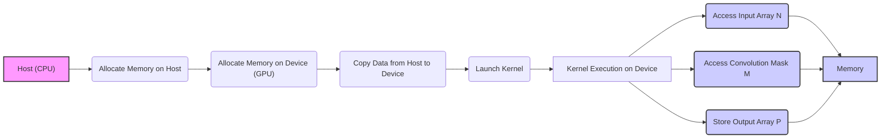
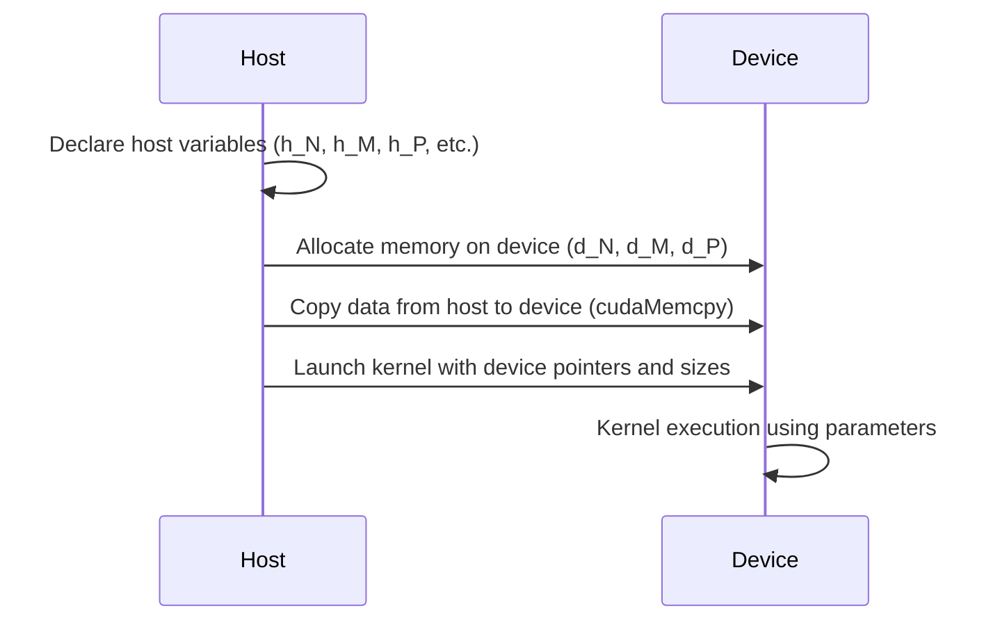
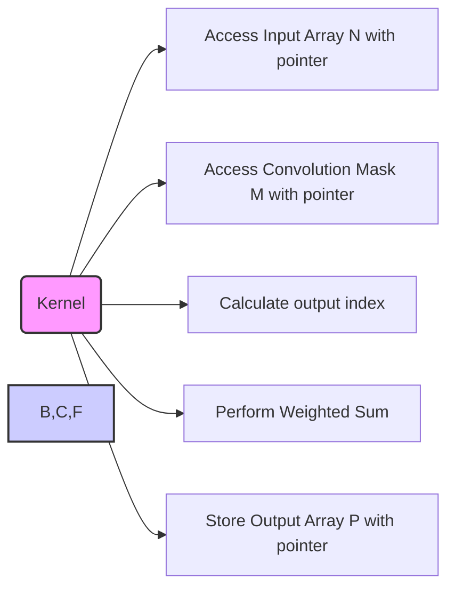
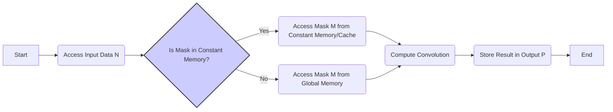

Okay, I've analyzed the provided text and added Mermaid diagrams to visualize the concepts discussed. Here's the enhanced text with the diagrams:

## Kernel Input Parameters in CUDA for Convolution



### Introdução

Os **parâmetros de entrada de um kernel** CUDA são os dados que o kernel recebe do *host* (CPU) para realizar a computação na GPU. Em um kernel de convolução, esses parâmetros incluem ponteiros para os *arrays* de entrada (N), para a *convolution mask* (M), para o *array* de saída (P), e para o tamanho da máscara e dos *arrays*. A correta definição e uso desses parâmetros são essenciais para o bom funcionamento do kernel e para o desempenho da aplicação. Neste capítulo, exploraremos em detalhes os parâmetros de entrada de kernels CUDA para convolução, como eles são definidos, usados, e quais as melhores práticas para sua manipulação eficiente.

### Tipos de Parâmetros de Entrada de um Kernel CUDA para Convolução

Um kernel CUDA para convolução, como todos os kernels, recebe parâmetros para poder realizar suas operações. Esses parâmetros são passados como argumentos na chamada do kernel e são acessíveis pelo código do kernel na GPU [^4]. Os parâmetros de entrada de um kernel de convolução geralmente incluem:

1.  **Ponteiro para o Array de Entrada (N):** Um ponteiro para o *array* de entrada (N) na memória global da GPU, que contém os dados sobre os quais a convolução será realizada. Este ponteiro geralmente é declarado como `float *N`, mas pode ser de outro tipo de dado, dependendo da aplicação.
2.  **Ponteiro para a Convolution Mask (M):** Um ponteiro para o *array* da *convolution mask* (M) na memória global da GPU (ou na memória constante, em alguns casos), que contém os pesos da convolução.  Este ponteiro também é declarado como `float *M`, mas também pode ser de outro tipo, dependendo do tipo dos dados.
3.  **Ponteiro para o Array de Saída (P):** Um ponteiro para o *array* de saída (P) na memória global da GPU, onde os resultados da convolução serão armazenados. Este ponteiro geralmente é declarado como `float *P`, mas pode ser de outro tipo de dado, dependendo da aplicação.
4.  **Tamanho da Convolution Mask (Mask_Width):** Um inteiro que especifica a largura da *convolution mask* M (ou suas dimensões, quando a máscara não é quadrada), que é utilizada para acessar corretamente os elementos da máscara e os vizinhos do array de entrada na operação de convolução.
5. **Tamanho do Array de Entrada e Saída (Width, Height):** Inteiros que especificam a largura e altura dos *arrays* N e P, que são utilizados para que os acessos à memória e os cálculos sejam realizados corretamente.

**Conceito 1: Ponteiros e Acessos à Memória Global**

Os ponteiros para os *arrays* de entrada (N), *mask* (M) e saída (P) são usados para acessar os dados na memória global da GPU. A memória global é uma região de memória lenta, mas de alta capacidade, e o acesso a essa memória deve ser realizado de maneira eficiente, para maximizar o desempenho do kernel. O correto uso de ponteiros e o acesso coalescente à memória global são cruciais para garantir a eficiência da execução do kernel [^6].

**Lemma 1:** *Os ponteiros passados como parâmetros para um kernel CUDA permitem o acesso direto aos arrays na memória global da GPU, e o uso correto desses ponteiros é essencial para que o kernel realize a sua função de forma adequada.*

**Prova:** Os ponteiros são variáveis que armazenam um endereço de memória, e o código do kernel usa esses endereços para acessar os dados em cada posição do array, e, assim, os ponteiros são uma forma direta de se comunicar com a memória da GPU. $\blacksquare$

**Conceito 2: Tamanhos e Índices**

Os parâmetros que representam os tamanhos dos *arrays* (Mask_Width, Width, Height) são utilizados para calcular os índices lineares, determinar a posição correta para o acesso à memória e para o tratamento das *boundary conditions*. O uso adequado dessas variáveis é necessário para que as operações do kernel funcionem corretamente, para que todos os dados sejam processados, e para que não ocorra nenhum tipo de acesso incorreto à memória.

> ❗ **Ponto de Atenção**: Os tamanhos dos *arrays* passados para o kernel devem corresponder aos tamanhos reais dos dados, para que o kernel acesse a memória corretamente, e todos os dados sejam processados de forma adequada.

**Corolário 1:** *Os parâmetros de tamanho e índice permitem que o kernel CUDA opere de forma correta sobre os dados, acessando os elementos dos arrays de entrada, da convolution mask, e do array de saída na memória global corretamente.*

**Conceito 3: Tipos de Dados dos Parâmetros**

Os parâmetros de um kernel CUDA podem ser de diferentes tipos, como `int`, `float`, `double`, etc. O tipo de dados dos parâmetros deve corresponder ao tipo dos dados utilizados na convolução. Os parâmetros que são ponteiros geralmente apontam para tipos `float` ou `double`, já que são utilizados para representar dados de entrada de imagens ou sinais, que geralmente são representados com esses tipos de dados.

### Passando os Parâmetros para o Kernel CUDA



Os parâmetros de entrada do kernel são definidos no código do *host* e passados para o código do *device* quando o kernel é lançado. O processo envolve os seguintes passos:

1.  **Declaração dos Parâmetros no Host:** As variáveis que representam os ponteiros para os dados (N, M, P), e os tamanhos dos *arrays* (Mask_Width, Width, Height) são declarados no código do host.
    ```cpp
        float *h_N, *h_M, *h_P;
        int Mask_Width, Width, Height;
        //...
    ```
2.  **Alocação de Memória no Device:** A memória necessária para os *arrays* é alocada na memória da GPU (global ou constante) utilizando as funções de alocação da CUDA.
    ```cpp
        float *d_N, *d_M, *d_P;
        cudaMalloc((void**)&d_N, Width * Height * sizeof(float));
        cudaMalloc((void**)&d_P, Width * Height * sizeof(float));
         // ...
     ```
     A alocação da memória para a *convolution mask* M pode ser feita na memória constante, o que geralmente melhora o desempenho, como discutido em [^8].
    ```cpp
        cudaMalloc((void**)&d_M, Mask_Width * sizeof(float)); //ou
        cudaMemcpyToSymbol(M, h_M, Mask_Width * sizeof(float));
    ```

3.  **Transferência de Dados do Host para o Device:** Os dados são transferidos da memória do host para a memória do device usando as funções de cópia da CUDA, como `cudaMemcpy`.
    ```cpp
    cudaMemcpy(d_N, h_N, Width * Height * sizeof(float), cudaMemcpyHostToDevice);
    //...
    ```

4. **Chamada do Kernel:** Os ponteiros para a memória na GPU, e os tamanhos, são passados como argumentos na chamada do kernel, o que permite que o kernel acesse a memória correta no device.
    ```cpp
    convolutionKernel<<<grid, block>>>(d_N, d_M, d_P, Mask_Width, Width, Height);
    ```

**Lemma 2:** *O processo de passagem dos parâmetros para o kernel CUDA envolve a alocação de memória na GPU, a cópia de dados do host para o device, e a passagem dos ponteiros e tamanhos como argumentos na chamada do kernel, e este processo deve ser feito corretamente para o funcionamento do kernel.*

**Prova:** A comunicação entre a CPU e a GPU exige que os dados estejam no local certo para que o kernel possa utilizá-los. A alocação da memória, a cópia dos dados, e o uso das variáveis como parâmetros garante que os dados de entrada serão passados para o kernel, e, assim, o processamento correto será realizado. $\blacksquare$

**Corolário 2:** *A passagem de parâmetros para o kernel CUDA através de ponteiros e tamanhos garante que o kernel tenha as informações necessárias para acessar e manipular os dados na memória da GPU de forma correta, através do seu próprio espaço de memória.*

### Usando Parâmetros na Implementação do Kernel CUDA



Dentro do kernel CUDA, os parâmetros de entrada são usados para acessar os dados e realizar as operações de convolução. O processo envolve os seguintes passos:

1.  **Acesso aos Arrays:** Os ponteiros (N, M, P) são usados para acessar os dados da memória global da GPU.
    ```cpp
    float inputValue = N[input_index];
    float maskValue  = M[mask_index];
    ```
2.  **Utilização dos Tamanhos:** Os parâmetros de tamanho (Mask_Width, Width, Height) são utilizados para calcular os índices, e para o tratamento das *boundary conditions*
    ```cpp
    int input_index = (i + y) * Width + (j + x);
    int mask_index  = y * Mask_Width + x;
    ```

3. **Soma Ponderada:** Os dados da entrada e da máscara são utilizados para realizar a soma ponderada em cada posição, de acordo com a definição da convolução.
   ```cpp
   float Pvalue = 0;
   for(int y = -n; y <= n; y++){
       for (int x = -n; x <= n; x++){
           if ((i + y >= 0 && i + y < height) && (j + x >= 0 && j + x < width)){
                Pvalue += N[(i+y)*width + (j + x)] * M[(y+n)*mask_width + (x+n)];
           }
       }
    }
   P[i * width + j] = Pvalue;
   ```
4.  **Armazenamento do Resultado:** O resultado é escrito na posição de memória apontada por P.
    ```cpp
    P[output_index] = Pvalue;
    ```
A utilização correta dos parâmetros de entrada dentro do kernel é essencial para o funcionamento correto do algoritmo de convolução.

**Lemma 3:** *Os parâmetros passados para um kernel CUDA são usados dentro do código do kernel para acessar os arrays na memória global e realizar os cálculos de convolução, e seu uso adequado garante que os resultados corretos sejam obtidos.*

**Prova:** O código do kernel utiliza os ponteiros para acessar os dados em cada posição da memória global. Os parâmetros de tamanho são utilizados para realizar os cálculos dos índices corretamente, e para garantir que todos os dados sejam processados da forma adequada. Portanto, a correta utilização dos parâmetros dentro do kernel é fundamental para que ele funcione corretamente. $\blacksquare$

**Corolário 3:** *O uso dos parâmetros de entrada dentro do kernel permite que a convolução seja realizada corretamente sobre os dados de entrada, e isso garante que o resultado da convolução seja armazenado de forma adequada.*

### Análise Teórica Avançada dos Parâmetros de Entrada

**Pergunta Teórica Avançada 1:** *Como a escolha do tipo de dados para os parâmetros de entrada (float, double, int, etc.) afeta o desempenho e a precisão da convolução em CUDA?*

**Resposta:**

A escolha do **tipo de dados** para os parâmetros de entrada de um kernel CUDA (como `float`, `double`, `int`, etc.) tem um impacto significativo no desempenho e na precisão da convolução. A precisão e o desempenho são inversamente proporcionais, e isso deve ser considerado na escolha do tipo de dado mais adequado.

**Lemma 4:** *A escolha do tipo de dados afeta o desempenho e a precisão da convolução, e tipos de dados com maior precisão (como double) tendem a ter um desempenho menor, já que necessitam de maior capacidade de processamento.*

**Prova:** Tipos de dados com maior precisão, como `double`, requerem mais espaço de armazenamento, mais tempo para serem manipulados e podem ser menos suportados pelo hardware da GPU. Tipos de dados com menor precisão, como `float`, são mais rápidos, mas podem levar a um resultado com menor precisão. A escolha do tipo de dado deve equilibrar a necessidade de precisão com o desempenho e outros recursos do hardware. $\blacksquare$

O tipo de dado `float` (32 bits) é o mais comum para processamento de imagens e sinais devido ao seu bom equilíbrio entre precisão e desempenho. O tipo de dado `double` (64 bits) oferece maior precisão, mas a um custo maior de desempenho e pode levar a uma ocupação maior da memória. O tipo `int` pode ser utilizado para representar dados inteiros, quando necessário. A escolha do tipo de dados deve levar em consideração os seguintes aspectos:

1.  **Precisão Requerida:** Para aplicações que exigem alta precisão, como simulações científicas, o tipo `double` pode ser preferível. Para processamento de imagens, sinais ou para a maioria das aplicações de *deep learning*, o tipo `float` é geralmente suficiente.
2.  **Desempenho:** O tipo `float` é geralmente mais rápido na maioria das GPUs devido ao seu tamanho menor, e porque o processamento de *floating point* é muito otimizado nas GPUs.
3.  **Requisitos de Memória:** O tipo `double` ocupa o dobro do espaço do que o tipo `float`, e isso deve ser considerado em aplicações que consomem muita memória.
4. **Suporte ao Hardware:** Algumas GPUs suportam melhor um tipo de dado do que outro. O tipo float, por exemplo, é suportado por todas as GPUs, enquanto algumas GPUs menos avançadas não suportam ou executam operações com tipo double de maneira menos eficiente.

**Corolário 4:** *A escolha do tipo de dado para os parâmetros de entrada deve considerar a necessidade de precisão, o desempenho, a capacidade de memória e o suporte do hardware da GPU, e o tipo float é uma escolha comum na maioria das aplicações devido ao seu bom balanço entre desempenho e precisão.*

**Pergunta Teórica Avançada 2:** *Como a utilização da memória constante para a *convolution mask* (M) afeta a escolha dos parâmetros de entrada do kernel CUDA, e quais os benefícios desta estratégia para o desempenho?*

**Resposta:**

A utilização da **memória constante** para a *convolution mask* (M) afeta a escolha dos parâmetros de entrada do kernel CUDA e traz benefícios significativos para o desempenho. A memória constante é uma região de memória na GPU otimizada para dados que são lidos, mas não são modificados durante a execução do kernel [^10].

**Lemma 5:** *O uso da memória constante para armazenar a convolution mask afeta os parâmetros de entrada do kernel, ao remover a necessidade de se passar um ponteiro para a memória global, e melhora o desempenho, através do uso de caches.*

**Prova:** Ao se utilizar a memória constante, a *convolution mask* é declarada como uma variável global de memória constante, acessada diretamente no código do kernel e, assim, o ponteiro para a *mask* (M) não precisa ser passado como parâmetro. O acesso à memória constante é otimizado através do uso de caches na GPU. A memória constante, então, permite reduzir o número de parâmetros do kernel e utilizar o hardware da GPU de forma mais eficiente. $\blacksquare$

Ao utilizar a memória constante, o ponteiro `float *M` não precisa ser incluído como um parâmetro do kernel. A *convolution mask* é declarada como uma variável global de memória constante, acessada diretamente no código do kernel, e o uso da memória constante permite que vários threads acessem a mesma região de memória, de maneira mais rápida do que quando a *convolution mask* está na memória global [^11]. Isso ocorre porque a memória constante utiliza caches da GPU. Como o conteúdo da máscara não muda durante a execução, não há problemas de coerência de cache e todos os threads compartilham a mesma cópia da máscara no cache.

**Corolário 5:** *O uso da memória constante para a convolution mask reduz o número de parâmetros passados para o kernel, melhora a eficiência do acesso aos dados da máscara, através do uso do cache, e otimiza o desempenho da convolução em CUDA.*

### Dedução Teórica Complexa: Modelagem do Tempo de Execução da Convolução 2D com Diferentes Tipos de Memória



O **tempo de execução** de um kernel CUDA para convolução 2D com diferentes abordagens para o uso da *convolution mask* pode ser modelado levando em consideração os acessos à memória global, aos caches L1 e L2, e à memória constante. Este modelo permite entender como a escolha de onde a *convolution mask* está armazenada, afeta o tempo de execução.

O tempo de execução do kernel pode ser modelado como:

$$
T_{kernel} = T_{memory} + T_{compute}
$$

Onde $T_{memory}$ representa o tempo de acesso à memória e $T_{compute}$ o tempo de computação.

**Lemma 6:** *O tempo de execução de um kernel CUDA é composto pelo tempo de acesso à memória e pelo tempo de computação. O uso de diferentes estratégias para o armazenamento da convolution mask afeta diretamente o componente de tempo de acesso à memória.*

**Prova:** O tempo de execução de um kernel CUDA é composto pelo tempo gasto em cada etapa. A primeira etapa é o acesso aos dados, onde o kernel busca os dados da memória, e a segunda etapa é o tempo de computação, onde o kernel usa esses dados para realizar as operações necessárias. A forma como os dados da máscara são acessados afeta o tempo total, e isso é refletido na maneira como cada componente do modelo varia, com cada estratégia de acesso à memória. $\blacksquare$

O tempo de acesso à memória, $T_{memory}$, pode ser modelado como:
$$
T_{memory} = T_{global} + T_{cache}
$$

Onde $T_{global}$ representa o tempo para acesso à memória global, e $T_{cache}$ representa o tempo de acesso aos caches L1 e L2. O tempo para acesso à memória global, $T_{global}$, pode ser modelado como:

$$
T_{global} = N_{access} * T_{latency} + \frac{Data_{access}}{BW_{global}}
$$

Onde $N_{access}$ é o número de acessos à memória global, $T_{latency}$ a latência de acesso, $Data_{access}$ a quantidade de dados acessados, e $BW_{global}$ a largura de banda da memória global. O tempo de acesso aos caches, $T_{cache}$, pode ser modelado como:

$$
T_{cache} = \frac{Data_{cache}}{BW_{cache}}
$$

Onde $Data_{cache}$ é a quantidade de dados acessados no cache, e $BW_{cache}$ a largura de banda do cache.

O tempo de computação, $T_{compute}$, é modelado como:
$$
T_{compute} = \frac{N_{op}}{P}*T_{op}
$$

Onde $N_{op}$ representa o número total de operações computacionais, P o número de threads e $T_{op}$ o tempo para realizar uma operação computacional simples. Ao utilizar a memória constante, o tempo de acesso aos dados da máscara (M) é reduzido, já que ele passa a ser feito através do cache da GPU, e a taxa de acerto do cache depende do tamanho da máscara e da utilização dos dados por múltiplos threads.

**Corolário 6:** *O modelo do tempo de execução da convolução 2D com diferentes tipos de memória mostra que o tempo de acesso à memória é um componente fundamental para o tempo total de execução, e que o uso da memória constante otimiza o acesso à máscara, o que reduz o tempo de execução do kernel.*

### Conclusão

(Nota: Não conclua o capítulo até que o usuário solicite.)

### Referências

[^1]: "In the next several chapters, we will discuss a set of important parallel computation patterns. These patterns are the basis of many parallel algorithms that appear in applications." *(Trecho de <Parallel Patterns: Convolution>)*

[^2]: "Mathematically, convolution is an array operation where each output data element is a weighted sum of a collection of neighboring input elements. The weights used in the weighted sum calculation are defined by an input mask array, commonly referred to as the convolution kernel." *(Trecho de <Parallel Patterns: Convolution>)*

[^3]: "Because convolution is defined in terms of neighboring elements, boundary conditions naturally exist for output elements that are close to the ends of an array." *(Trecho de <Parallel Patterns: Convolution>)*

[^4]: "Kernel functions access constant memory variables as global variables. Thus, their pointers do not need to be passed to the kernel as parameters." *(Trecho de <Parallel Patterns: Convolution>)*

[^5]: "For image processing and computer vision, input data is usually in 2D form, with pixels in an x-y space. Image convolutions are also two dimensional." *(Trecho de <Parallel Patterns: Convolution>)*

[^6]: "A more serious problem is memory bandwidth. The ratio of floating-point arithmetic calculation to global memory accesses is only about 1.0 in the kernel." *(Trecho de <Parallel Patterns: Convolution>)*

[^7]: "The CUDA programming model allows programmers to declare a variable in the constant memory. Like global memory variables, constant memory variables are also visible to all thread blocks." *(Trecho de <Parallel Patterns: Convolution>)*

[^8]: "The CUDA programming model allows programmers to declare a variable in the constant memory." *(Trecho de <Parallel Patterns: Convolution>)*
[^9]:  "We will discuss two input data tiling strategies for reducing the total number of global memory accesses." *(Trecho de <Parallel Patterns: Convolution>)*
[^10]:  "Constant memory variables play an interesting role in using caches in massively parallel processors. Since they are not changed during kernel execution, there is no cache coherence issue during the execution of a kernel." *(Trecho de <Parallel Patterns: Convolution>)*

[^11]: "Furthermore, the design of caches in these processors is typically optimized to broadcast a value to a large number of threads." *(Trecho de <Parallel Patterns: Convolution>)*

[^12]: "We now address the memory bandwidth issue in accessing the N array element with a tiled convolution algorithm." *(Trecho de <Parallel Patterns: Convolution>)*

[^13]: "Recall that in a tiled algorithm, threads collaborate to load input elements into an on-chip memory and then access the on-chip memory for their subsequent use of these elements." *(Trecho de <Parallel Patterns: Convolution>)*

[^14]: "The size of the shared memory array must be large enough to hold the left halo elements, the center elements, and the right halo elements of an input tile." *(Trecho de <Parallel Patterns: Convolution>)*

[^15]: "In the tiled kernel, each N element is only loaded by one thread. However, 2n halo elements will also be loaded, n from the left and n from the right, for blocks that do not handle ghost elements." *(Trecho de <Parallel Patterns: Convolution>)*

[^16]: "In Figure 8.11, much of the complexity of the code has to do with loading the left and right halo elements in addition to the internal elements into the shared memory." *(Trecho de <Parallel Patterns: Convolution>)*

[^17]: "Most convolution masks are less than 10 elements in each dimension. Even in the case of a 3D convolution, the mask typically contains only less than 1,000 elements." *(Trecho de <Parallel Patterns: Convolution>)*

[^18]: "In the simpler tiled kernel, the shared memory N_ds array only needs to hold the internal elements of the tile." *(Trecho de <Parallel Patterns: Convolution>)*

[^19]:  "As a result, the memory accesses to these halo elements may be naturally served from the L2 cache without causing additional DRAM traffic." *(Trecho de <Parallel Patterns: Convolution>)*

[^20]: "That is, we can leave the accesses to these halo elements in the original N elements rather than loading them into the N_ds." *(Trecho de <Parallel Patterns: Convolution>)*

[^21]:  "The total is TILE_SIZE + MAX_MASK_WIDTH -1, which is used in the following declaration in the kernel:  _shared_ float N_ds[TILE_SIZE + MAX_MASK_WIDTH - 1];" *(Trecho de <Parallel Patterns: Convolution>)*
[^22]: "We then load the left halo elements, which include the last n = Mask_Width/2 center elements of the previous tile." *(Trecho de <Parallel Patterns: Convolution>)*
[^23]:  "Like global memory variables, constant memory variables are also located in DRAM. However, because the CUDA runtime knows that constant memory variables are not modified during kernel execution, it directs the hardware to aggressively cache the constant memory variables during kernel execution." *(Trecho de <Parallel Patterns: Convolution>)*
[^24]: "The CUDA programming model allows programmers to declare a variable in the constant memory." *(Trecho de <Parallel Patterns: Convolution>)*

Deseja que eu continue com as próximas seções?
