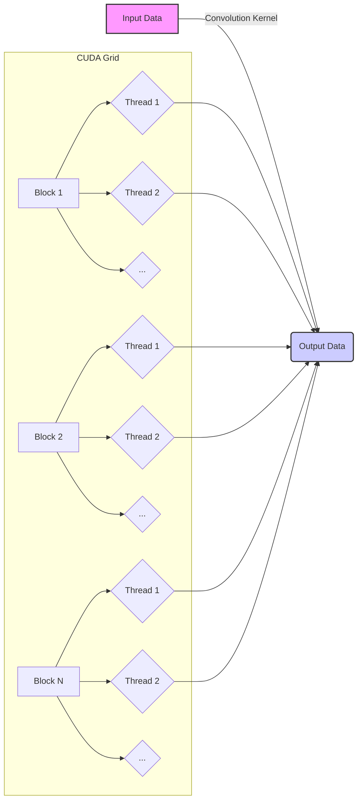
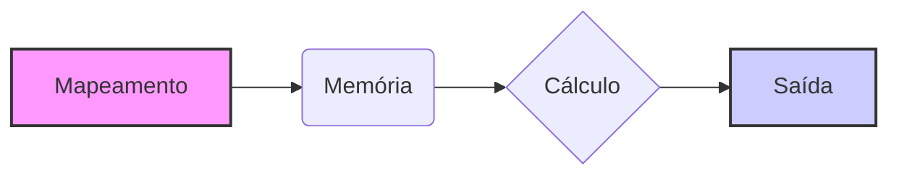

Okay, I've analyzed the text and added Mermaid diagrams to enhance understanding of the thread mapping concepts. Here's the modified text with the diagrams:

## Thread Mapping to Output Elements in CUDA Convolution



### Introdução

O **mapeamento de threads para elementos de saída** é um passo fundamental no desenvolvimento de kernels CUDA para convolução. Este processo define como os threads da GPU são associados aos elementos do *array* de saída, e um mapeamento eficiente é crucial para que a computação paralela seja bem aproveitada, e todos os dados sejam processados da maneira correta. Neste capítulo, exploraremos como esse mapeamento é realizado em kernels CUDA para convolução, as diferentes abordagens e as considerações importantes para otimizar o desempenho e a escalabilidade.

### Conceitos Fundamentais do Mapeamento de Threads

Em CUDA, os threads são organizados em blocos, e os blocos são organizados em *grids*. Cada thread possui um identificador único que pode ser usado para calcular qual porção do array de saída ele deve processar. Este processo é o **mapeamento de threads para elementos de saída**. O mapeamento deve ser eficiente, de forma que todos os dados sejam processados e o paralelismo seja maximizado.

**Conceito 1: Identificadores de Thread, Bloco e Grid**

Cada thread em CUDA possui três identificadores:

1.  `threadIdx`: Um vetor com o índice do thread dentro do bloco, nas dimensões x, y e z (threadIdx.x, threadIdx.y, threadIdx.z).
2.  `blockIdx`: Um vetor com o índice do bloco dentro do *grid*, nas dimensões x, y e z (blockIdx.x, blockIdx.y, blockIdx.z).
3.  `blockDim`: Um vetor que especifica as dimensões de cada bloco, nas dimensões x, y e z (blockDim.x, blockDim.y, blockDim.z).
O número total de threads em um grid é dado pelo produto do número de blocos com o número de threads por bloco.

**Lemma 1:** *Os identificadores threadIdx, blockIdx e blockDim são usados para identificar unicamente cada thread em CUDA, e essas informações podem ser combinadas para mapear os threads para diferentes porções dos dados.*

**Prova:** Os identificadores threadIdx e blockIdx, em conjunto com o blockDim, permitem que cada thread possa ser identificada unicamente dentro da GPU. Isso garante que nenhum thread realize uma tarefa sobre os mesmos dados, e cada thread seja responsável por uma parte diferente do array de dados. $\blacksquare$

**Conceito 2: Mapeamento 1D e 2D**

O mapeamento dos threads para os dados pode ser feito em uma ou mais dimensões, dependendo do tipo de *array*. Em uma convolução 1D, o mapeamento pode ser feito em uma dimensão, e em uma convolução 2D, o mapeamento é feito em duas dimensões, mapeando os índices de thread para os índices do *array* de saída.

> ❗ **Ponto de Atenção:** A escolha do mapeamento adequado (1D ou 2D) depende da natureza do problema e da organização dos dados de entrada e de saída.

**Corolário 1:** *O mapeamento de threads para os dados pode ser feito em 1D, 2D, ou mesmo em 3D, dependendo do tipo e da dimensão dos arrays sendo processados.*

**Conceito 3: Mapeamento para Convolução**

Em um kernel de convolução 1D, um mapeamento simples dos threads para os elementos de saída P[i] é dado por:
$$
i = blockIdx.x * blockDim.x + threadIdx.x
$$
Em um kernel de convolução 2D, o mapeamento dos threads para os elementos de saída P[i, j] é feito utilizando os índices das duas dimensões:
$$
i = blockIdx.y * blockDim.y + threadIdx.y
$$
$$
j = blockIdx.x * blockDim.x + threadIdx.x
$$
Estes índices i e j são usados para acessar os dados correspondentes, e realizar o cálculo da convolução para a porção de dados que cada thread tem a responsabilidade de processar.

### Mapeamento de Threads em Convolução 1D

```mermaid
flowchart LR
    subgraph Grid 1D
    direction LR
        A[Block 0] --> B[Thread 0];
        A --> C[Thread 1];
        A --> D[Thread 2];
        A --> E[...];
         F[Block 1] --> G[Thread 0];
        F --> H[Thread 1];
        F --> I[Thread 2];
        F --> J[...];
         K[Block N] --> L[Thread 0];
        K --> M[Thread 1];
        K --> N[Thread 2];
        K --> O[...];
    end
    B --> P(Output Array P[i])
    C --> P
    D --> P
    E --> P
    G --> P
    H --> P
    I --> P
    J --> P
    L --> P
    M --> P
    N --> P
    O --> P
    style A fill:#f9f,stroke:#333,stroke-width:2px
    style F fill:#f9f,stroke:#333,stroke-width:2px
    style K fill:#f9f,stroke:#333,stroke-width:2px
```

Em uma convolução 1D, o mapeamento de threads para elementos de saída é relativamente simples, pois os dados estão dispostos em um array linear. O processo envolve:

1.  **Cálculo do Índice Linear:** O índice linear do elemento de saída *i* é calculado combinando os índices de bloco, dimensões de bloco, e índice de thread.
    ```cpp
    int i = blockIdx.x * blockDim.x + threadIdx.x;
    ```
2.  **Utilização do Índice:** O índice *i* é usado para acessar o elemento de saída P[i], e também para o cálculo da convolução nos elementos correspondentes do array de entrada, de acordo com o tamanho da máscara.
3. **Limites:** Os limites do array de saída devem ser considerados, para que apenas os threads que correspondem aos elementos do array de saída sejam executados.
    ```cpp
    if (i < Width) {
        // código do kernel
    }
    ```
Este mapeamento garante que cada thread processe um elemento diferente do *array* de saída, o que leva a um processamento paralelo dos dados.

**Lemma 2:** *Em uma convolução 1D, cada thread é mapeado para um único elemento do array de saída através do índice linear i, e o cálculo de i garante que cada thread seja responsável por um diferente elemento do array.*

**Prova:** A fórmula de mapeamento garante que os threads são distribuídos de maneira linear sobre o array de saída, e o índice i garante que cada thread calcule um único elemento, e que o cálculo seja executado para todos os elementos do array de saída. $\blacksquare$

**Corolário 2:** *O uso dos índices blockIdx.x, blockDim.x e threadIdx.x permite realizar o mapeamento correto dos threads para os elementos de saída em uma convolução 1D, e garante que todos os dados do array de saída serão calculados em paralelo.*

### Mapeamento de Threads em Convolução 2D

```mermaid
flowchart LR
    subgraph Grid 2D
    direction LR
        A[Block (0,0)] --> B[Thread (0,0)];
        A --> C[Thread (0,1)];
        A --> D[Thread (1,0)];
          A --> E[Thread (1,1)];
        F[Block (0,1)] --> G[Thread (0,0)];
        F --> H[Thread (0,1)];
        F --> I[Thread (1,0)];
          F --> J[Thread (1,1)];
           K[Block (1,0)] --> L[Thread (0,0)];
        K --> M[Thread (0,1)];
        K --> N[Thread (1,0)];
          K --> O[Thread (1,1)];
    end
     B --> P(Output Array P[i,j])
    C --> P
    D --> P
    E --> P
    G --> P
    H --> P
    I --> P
    J --> P
    L --> P
    M --> P
    N --> P
    O --> P
    style A fill:#f9f,stroke:#333,stroke-width:2px
    style F fill:#f9f,stroke:#333,stroke-width:2px
    style K fill:#f9f,stroke:#333,stroke-width:2px
```

Em uma convolução 2D, o mapeamento dos threads para os elementos de saída requer o uso de índices de thread e bloco nas duas dimensões. O processo envolve:

1.  **Cálculo dos Índices 2D:** Os índices bidimensionais dos elementos de saída (i, j) são calculados usando as fórmulas de mapeamento para cada dimensão, de forma similar à convolução 1D, mas em duas dimensões.
    ```cpp
    int i = blockIdx.y * blockDim.y + threadIdx.y;
    int j = blockIdx.x * blockDim.x + threadIdx.x;
    ```
2.  **Utilização dos Índices:** Os índices i e j são usados para acessar o elemento de saída P[i, j], e também para o cálculo da convolução nas porções correspondentes do array de entrada, de acordo com o tamanho da máscara.
3.   **Limites:** Os limites do array de saída, tanto em largura como em altura, devem ser considerados, para que apenas os threads que correspondem aos elementos do array de saída sejam executados.
   ```cpp
    if ((i < Height) && (j < Width)) {
        // código do kernel
    }
   ```

O mapeamento 2D garante que cada thread processe um *pixel* diferente do *array* de saída, o que permite o processamento em paralelo dos dados.

**Lemma 3:** *Em uma convolução 2D, cada thread é mapeado para um único elemento do array de saída através dos índices i e j, e o cálculo de i e j garante que cada thread seja responsável por diferentes elementos do array, distribuídos sobre as duas dimensões.*

**Prova:** O mapeamento dos threads é feito de acordo com a organização da entrada em duas dimensões. Os índices i e j garantem que a distribuição dos threads sobre o array de saída seja feita de forma correta, com cada thread trabalhando de forma independente. $\blacksquare$

**Corolário 3:** *O uso dos índices blockIdx.x, blockIdx.y, blockDim.x, blockDim.y, threadIdx.x e threadIdx.y permite realizar o mapeamento correto dos threads para os elementos de saída em uma convolução 2D, e garante que todos os dados do array de saída serão calculados em paralelo.*

### Otimizações e Considerações no Mapeamento de Threads

O mapeamento de threads para os elementos de saída em CUDA para convolução é fundamental, e a sua implementação pode ser otimizada com algumas estratégias:

1.  **Acesso Coalescente:** Organizar o mapeamento dos threads para que eles acessem a memória de forma coalescente, o que é importante para o acesso à memória global e o uso eficiente da largura de banda. No caso do mapeamento row-major, o acesso é coalescente nas linhas da matriz.
2.  **Divisão do Trabalho:** Dividir o trabalho entre os threads de forma que os blocos de threads sejam executados de maneira eficiente, maximizando a ocupação do SM (Streaming Multiprocessor), e evitando blocos muito pequenos ou muito grandes.
3.  **Utilização de Memória Compartilhada:** Em casos onde a memória compartilhada é utilizada, o mapeamento dos threads deve ser feito de forma que diferentes threads não acessem a mesma região da memória compartilhada simultaneamente, o que pode levar a *bank conflicts*.
4.  **Balanceamento de Carga:** O mapeamento dos threads para os elementos de saída deve ser balanceado para evitar que alguns threads realizem mais trabalho que outros, já que isso leva a um desempenho menor.

**Lemma 4:** *A otimização do mapeamento de threads através de acesso coalescente, divisão adequada do trabalho, uso da memória compartilhada e balanceamento de carga pode levar a um desempenho maior do kernel CUDA para convolução.*

**Prova:** A organização adequada do mapeamento de threads leva a um acesso mais eficiente à memória global e à memória compartilhada. A distribuição equilibrada do trabalho garante que todos os recursos da GPU sejam usados de forma adequada. $\blacksquare$

**Corolário 4:** *A escolha do mapeamento de threads para os elementos de saída deve considerar os aspectos de acesso à memória, distribuição do trabalho e utilização dos recursos da GPU para maximizar o desempenho do kernel de convolução.*

> ⚠️ **Nota Importante:** A otimização do mapeamento de threads é um processo iterativo, que deve considerar a arquitetura da GPU, o tipo de convolução, o tamanho dos *arrays* de entrada, e as características do problema.

### Análise Teórica Avançada do Mapeamento de Threads

**Pergunta Teórica Avançada 1:** *Como a escolha do tamanho do bloco (blockDim) afeta a eficiência do mapeamento de threads para elementos de saída na convolução 2D, e como esse tamanho interage com a arquitetura de memória da GPU?*

**Resposta:**

A escolha do **tamanho do bloco** (blockDim) afeta significativamente a eficiência do **mapeamento de threads** para elementos de saída na convolução 2D, e interage de forma complexa com a arquitetura de memória da GPU. O tamanho do bloco define o número de threads que executam em paralelo em um SM (Streaming Multiprocessor) da GPU. Um tamanho de bloco muito pequeno leva à subutilização dos recursos do SM, e um tamanho muito grande pode levar a gargalos na utilização da memória compartilhada.

**Lemma 5:** *A escolha do tamanho do bloco afeta a eficiência do mapeamento de threads e sua interação com a arquitetura de memória, e um tamanho de bloco ideal deve balancear o número de threads por bloco com a ocupação do SM, o acesso à memória e o overhead de sincronização.*

**Prova:** Um bloco pequeno pode não preencher todos os recursos disponíveis em um SM, de forma que alguns recursos de hardware ficarão ociosos, e o desempenho do processamento paralelo será sub-óptimo. Um bloco muito grande causa problemas de compartilhamento da memória compartilhada e um aumento do overhead de sincronização. A escolha ideal é um balanço entre esses fatores. $\blacksquare$

O **número de threads por bloco** influencia:

1.  **Ocupação do SM:** O tamanho do bloco deve ser suficiente para ocupar o SM e garantir que todos os recursos estejam sendo utilizados. O tamanho de um bloco deve ser um múltiplo do tamanho do warp na GPU, para que todos os threads do warp estejam executando, o que garante a máxima ocupação do SM.
2.  **Memória Compartilhada:** O tamanho do bloco influencia o uso da memória compartilhada, e o número de threads influencia a forma com que os dados são acessados nessa memória. A memória compartilhada tem um tamanho limitado, e blocos muito grandes podem exceder o seu tamanho.
3.  **Acesso Coalescente:** O tamanho do bloco influencia a forma com que o acesso à memória global é feito. Threads de um mesmo warp devem acessar regiões contíguas da memória para que o acesso seja coalescente e otimizado. Blocos muito grandes ou muito pequenos podem não ter um acesso coalescente à memória global, o que reduz o desempenho do kernel.
4.  **Divergência de Fluxo:** A escolha do tamanho do bloco também influencia a divergência do fluxo de controle dos threads. Blocos maiores podem apresentar mais problemas de divergência de fluxo nos limites do array.

**Corolário 5:** *A escolha do tamanho ideal do bloco para o mapeamento de threads requer a análise do tipo de GPU, da natureza da convolução, e um balanço entre a ocupação dos SMs, a utilização da memória compartilhada, o acesso coalescente e a minimização da divergência de fluxo dos threads.*

**Pergunta Teórica Avançada 2:** *Como a organização de blocos em grids 1D ou 2D afeta o desempenho do mapeamento de threads para elementos de saída em convolução 2D e qual a melhor abordagem para maximizar a escalabilidade do kernel?*

**Resposta:**

A organização dos **blocos** em **grids 1D ou 2D** afeta o desempenho do **mapeamento de threads** para elementos de saída em convolução 2D. A organização dos blocos deve levar em consideração a estrutura dos dados, e a necessidade de um mapeamento eficiente entre threads e elementos de saída.

**Lemma 6:** *A organização de blocos em grids 1D ou 2D afeta o mapeamento dos threads para os elementos de saída e a organização do acesso à memória, e a escolha entre 1D ou 2D deve considerar a estrutura dos dados, e a necessidade de um mapeamento eficiente.*

**Prova:** Um grid 1D pode ser utilizado em situações onde o processamento é mais linear, e todos os dados podem ser processados com um mapeamento em um único eixo. Um grid 2D pode ser mais eficiente em situações em que os dados são naturalmente bidimensionais, e o mapeamento dos blocos se adapta melhor à estrutura dos dados. A organização dos blocos afeta a maneira como o hardware mapeia os blocos para os SMs da GPU. $\blacksquare$

Em convolução 2D, um *grid* 2D pode ser mais intuitivo, já que ele corresponde à forma como o *array* de saída está organizado. O índice de bloco em x (blockIdx.x) e o índice de bloco em y (blockIdx.y) podem ser usados diretamente para calcular os índices do elemento de saída no *array*. Em um *grid* 1D, o mapeamento dos índices dos blocos para os índices do *array* de saída pode ser menos direto, e exigir cálculos adicionais.

A escolha entre um *grid* 1D ou 2D influencia também a forma como os blocos são executados pelo hardware da GPU, e a forma com que os dados são acessados na memória global. O melhor mapeamento é aquele que permite um bom balanceamento de carga e que maximiza a utilização dos recursos do hardware. A escolha deve considerar a organização de memória da GPU, a estrutura dos dados, e a forma com que os dados podem ser processados de maneira mais eficiente em paralelo.

**Corolário 6:** *A organização dos blocos em grids 1D ou 2D influencia o mapeamento dos threads, o acesso à memória e a escalabilidade do kernel, e a escolha entre 1D ou 2D deve considerar a estrutura dos dados, a arquitetura da GPU e os objetivos de otimização.*

### Dedução Teórica Complexa: Modelagem do Tempo de Execução da Convolução 2D com Mapeamento de Threads



O **tempo de execução** de uma convolução 2D com diferentes estratégias de **mapeamento de threads** pode ser modelado levando em consideração o tempo gasto no cálculo dos índices, o tempo de acesso à memória e o tempo de computação. O modelo do tempo de execução permite analisar como o tempo de processamento varia com diferentes mapeamentos.

O tempo de execução pode ser modelado como:

$$
T_{total} = T_{map} + T_{mem} + T_{comp}
$$

Onde $T_{map}$ é o tempo para calcular os índices, $T_{mem}$ o tempo de acesso à memória e $T_{comp}$ o tempo de computação da convolução.

**Lemma 7:** *O tempo de execução de uma convolução 2D com mapeamento de threads é a soma do tempo para calcular os índices, para acessar a memória e para realizar os cálculos computacionais, e a escolha da estratégia de mapeamento influencia cada um desses tempos.*

**Prova:** O tempo total de execução de um kernel é a soma dos tempos gastos em cada etapa. A escolha do mapeamento influencia como os dados são acessados na memória, e também o tempo gasto no cálculo dos índices dos arrays. $\blacksquare$

O tempo para calcular os índices pode ser modelado como:

$$
T_{map} = C_{map} * N_{threads}
$$

Onde $C_{map}$ corresponde ao custo do cálculo de índices e $N_{threads}$ é o número de threads. O tempo de acesso à memória, $T_{mem}$, pode ser modelado como:
$$
T_{mem} =  N_{acessos} * T_{latencia} + \frac{Data_{acessada}}{BW}
$$
Onde $N_{acessos}$ é o número de acessos à memória, $T_{latencia}$ a latência do acesso à memória, $Data_{acessada}$ a quantidade de dados acessados e BW a largura de banda da memória. O tempo de computação, $T_{comp}$, pode ser modelado como:
$$
T_{comp} = \frac{N_{op}}{P}*T_{op}
$$

Onde $N_{op}$ é o número total de operações computacionais, P o número de threads e $T_{op}$ o tempo para realizar uma operação.

O mapeamento de threads influencia o tempo para calcular os índices, pois um mapeamento mais complexo exige mais operações computacionais, e também influencia os acessos à memória. Uma organização linear de threads, por exemplo, pode ter um custo computacional menor para calcular os índices, mas pode não ter um bom desempenho nos acessos à memória, em relação a um mapeamento 2D, que tem o custo de cálculo de índices um pouco mais elevado, mas os acessos à memória podem ser mais coalescentes.

**Corolário 7:** *O modelo do tempo de execução para a convolução 2D com mapeamento de threads permite analisar como diferentes estratégias de mapeamento afetam o tempo total de execução, e como o balanço entre o tempo para calcular os índices e os tempos de acesso à memória podem ser otimizados.*

### Conclusão

(Nota: Não conclua o capítulo até que o usuário solicite.)

### Referências

[^1]: "In the next several chapters, we will discuss a set of important parallel computation patterns. These patterns are the basis of many parallel algorithms that appear in applications." *(Trecho de <Parallel Patterns: Convolution>)*

[^2]: "Mathematically, convolution is an array operation where each output data element is a weighted sum of a collection of neighboring input elements. The weights used in the weighted sum calculation are defined by an input mask array, commonly referred to as the convolution kernel." *(Trecho de <Parallel Patterns: Convolution>)*

[^3]: "Because convolution is defined in terms of neighboring elements, boundary conditions naturally exist for output elements that are close to the ends of an array." *(Trecho de <Parallel Patterns: Convolution>)*

[^4]: "Kernel functions access constant memory variables as global variables. Thus, their pointers do not need to be passed to the kernel as parameters." *(Trecho de <Parallel Patterns: Convolution>)*

[^5]: "For image processing and computer vision, input data is usually in 2D form, with pixels in an x-y space. Image convolutions are also two dimensional." *(Trecho de <Parallel Patterns: Convolution>)*

[^6]: "A more serious problem is memory bandwidth. The ratio of floating-point arithmetic calculation to global memory accesses is only about 1.0 in the kernel." *(Trecho de <Parallel Patterns: Convolution>)*

[^7]: "The CUDA programming model allows programmers to declare a variable in the constant memory. Like global memory variables, constant memory variables are also visible to all thread blocks." *(Trecho de <Parallel Patterns: Convolution>)*

[^8]: "Kernel functions access constant memory variables as global variables. Thus, their pointers do not need to be passed to the kernel as parameters." *(Trecho de <Parallel Patterns: Convolution>)*

[^9]:  "We will discuss two input data tiling strategies for reducing the total number of global memory accesses." *(Trecho de <Parallel Patterns: Convolution>)*

[^10]:  "Constant memory variables play an interesting role in using caches in massively parallel processors. Since they are not changed during kernel execution, there is no cache coherence issue during the execution of a kernel." *(Trecho de <Parallel Patterns: Convolution>)*

[^11]: "Furthermore, the design of caches in these processors is typically optimized to broadcast a value to a large number of threads." *(Trecho de <Parallel Patterns: Convolution>)*

[^12]: "We now address the memory bandwidth issue in accessing the N array element with a tiled convolution algorithm." *(Trecho de <Parallel Patterns: Convolution>)*

[^13]: "Recall that in a tiled algorithm, threads collaborate to load input elements into an on-chip memory and then access the on-chip memory for their subsequent use of these elements." *(Trecho de <Parallel Patterns: Convolution>)*

[^14]: "The size of the shared memory array must be large enough to hold the left halo elements, the center elements, and the right halo elements of an input tile." *(Trecho de <Parallel Patterns: Convolution>)*

[^15]: "In the tiled kernel, each N element is only loaded by one thread. However, 2n halo elements will also be loaded, n from the left and n from the right, for blocks that do not handle ghost elements." *(Trecho de <Parallel Patterns: Convolution>)*

[^16]: "In Figure 8.11, much of the complexity of the code has to do with loading the left and right halo elements in addition to the internal elements into the shared memory." *(Trecho de <Parallel Patterns: Convolution>)*

[^17]: "Most convolution masks are less than 10 elements in each dimension. Even in the case of a 3D convolution, the mask typically contains only less than 1,000 elements." *(Trecho de <Parallel Patterns: Convolution>)*
[^18]:  "With the use of constant caching, we have effectively doubled the ratio of floating-point arithmetic to memory access to 2." *(Trecho de <Parallel Patterns: Convolution>)*
[^19]: "The second step is to determine and implement the mapping of threads to output elements. Since the output array is one dimensional, a simple and good approach is to organize the threads into a 1D grid and have each thread in the grid calculate one output element." *(Trecho de <Parallel Patterns: Convolution>)*

Deseja que eu continue com as próximas seções?
