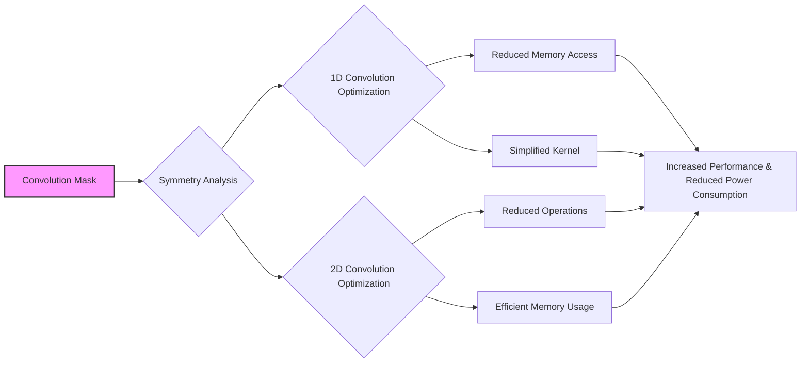
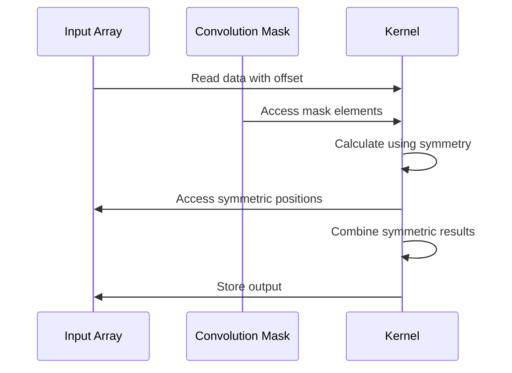
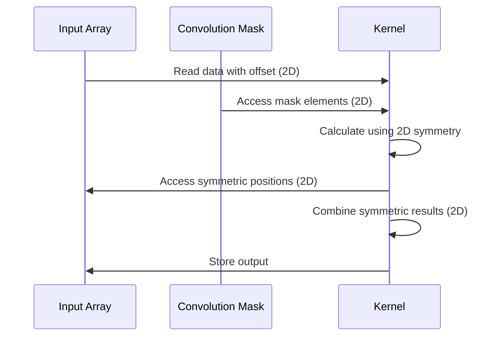
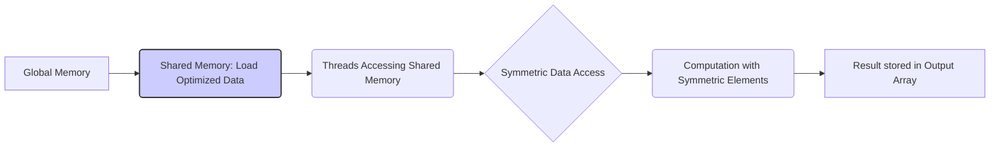
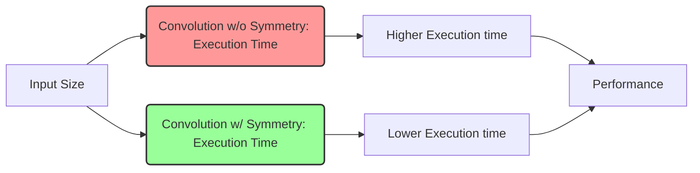

Okay, I will add Mermaid diagrams to the provided text to enhance its clarity and understanding. Here's the revised text with the diagrams:

## Symmetric Convolution in CUDA



### Introdução

A **simetria** nas *convolution masks* é uma propriedade que pode ser explorada para otimizar o desempenho de kernels CUDA para convolução. Muitas *convolution masks* utilizadas em processamento de imagens e sinais são simétricas em relação ao seu centro, o que significa que os valores dos elementos da máscara se repetem em um padrão simétrico. Ao se aproveitar essa simetria, é possível reduzir o número de operações de acesso à memória, e simplificar o código do kernel, o que leva a um desempenho maior e a um consumo menor de energia. Neste capítulo, exploraremos como a simetria pode ser utilizada para otimizar a implementação de kernels CUDA para convolução.

### Conceitos Fundamentais da Simetria em Convolution Masks

A **simetria** em uma *convolution mask* significa que seus elementos se repetem em um padrão específico, em relação a um centro da máscara. Essa simetria pode ser útil em diferentes situações, e a sua exploração permite simplificar os cálculos e otimizar o desempenho do processamento da convolução.

**Conceito 1: Simetria em Convolução 1D**

Em uma *convolution mask* 1D, a simetria significa que os elementos da máscara são simétricos em relação ao seu centro. Uma *convolution mask* M de tamanho `2n + 1` é simétrica se:

$$
M[k] = M[2n-k]
$$

para todo *k* de 0 a *n-1*. Por exemplo, a máscara `[1 2 1]` é simétrica em 1D.

**Lemma 1:** *Uma convolution mask 1D é simétrica se os elementos são iguais em relação a um ponto central na máscara, e essa propriedade permite reduzir os cálculos em relação à aplicação da máscara na operação de convolução.*

**Prova:** A definição de simetria implica que a primeira metade da máscara é o reflexo da segunda metade, com respeito ao centro. Dessa forma, os acessos de memória e cálculos podem ser compartilhados, com a exploração dessa propriedade. $\blacksquare$

**Conceito 2: Simetria em Convolução 2D**

Em uma *convolution mask* 2D, a simetria pode ser em relação a um ou a ambos os eixos. Uma *convolution mask* M de tamanho ($2n_h + 1$) x ($2n_w + 1$) é simétrica em ambos os eixos se:

$$
M[y,x] = M[2n_h-y, x] = M[y, 2n_w - x] = M[2n_h-y, 2n_w - x]
$$
para todo *y* de 0 a $n_h - 1$ e *x* de 0 a $n_w - 1$. Um exemplo de *convolution mask* 2D simétrica é:
```
[[1 2 1]
 [2 4 2]
 [1 2 1]]
```
Outras formas de simetria podem ocorrer, e existem máscaras que são simétricas apenas em um dos eixos.

> 💡 **Dica:**  Em alguns casos, as *convolution masks* podem não ser totalmente simétricas, mas podem ter algum grau de simetria que possa ser explorado para realizar otimizações.

**Corolário 1:** *A simetria em uma convolution mask 2D pode ser em relação a um ou ambos os eixos, e a análise das propriedades de simetria pode levar a otimizações no cálculo da convolução.*

**Conceito 3: Impacto da Simetria no Offset-Based Access**

A simetria de uma *convolution mask* afeta a implementação do *offset-based access*. Quando a máscara é simétrica, alguns acessos à memória e cálculos podem ser compartilhados, ou combinados, o que reduz a complexidade computacional do kernel. Por exemplo, em uma convolução 1D com uma máscara simétrica, o cálculo dos vizinhos pode ser feito apenas em uma parte da máscara, e o resultado pode ser replicado para o seu correspondente simétrico.

### Explorando a Simetria em Convolução 1D



Em uma convolução 1D, a simetria pode ser explorada para reduzir o número de operações e acessos à memória [^3]. O processo envolve:

1.  **Cálculo do Ponto Central:**  O ponto central é calculado da mesma maneira como no *offset-based access*:

$$
N_{start\_point} = i - \frac{Mask\_Width}{2}
$$

2.  **Acesso e Cálculo Simétrico:** Apenas a metade dos elementos da máscara são acessados, e o cálculo é feito utilizando as posições correspondentes e simétricas do *array* de entrada. Em vez de:

   ```cpp
   for (int j = 0; j < Mask_Width; j++){
       if (N_start_point + j >= 0 && N_start_point + j < Width){
           Pvalue += N[N_start_point + j] * M[j];
       }
   }
   ```
   É possível utilizar a seguinte forma, explorando a simetria:
   ```cpp
   for (int j = 0; j <= Mask_Width/2; j++){
        if (N_start_point + j >= 0 && N_start_point + j < Width){
          if(j != Mask_Width - j -1){
             Pvalue += (N[N_start_point + j] + N[N_start_point + Mask_Width - j - 1]) * M[j];
           } else{
             Pvalue += N[N_start_point + j] * M[j];
            }
         }
   }
   ```
3. **Tratamento do Elemento Central:** O elemento central da máscara, quando existe, precisa ser tratado separadamente, e a verificação do limite da máscara é utilizada para que ele seja processado apenas uma vez.
4.  **Armazenamento do Resultado:** O resultado da soma ponderada é armazenado no *array* de saída.

A exploração da simetria na convolução 1D reduz o número de operações, e consequentemente, aumenta a eficiência do kernel.

**Lemma 2:** *O uso da simetria na convolução 1D permite reduzir o número de acessos à memória e operações de multiplicação, através da combinação dos elementos da entrada que são acessados com o mesmo peso.*

**Prova:** O uso da simetria permite que os cálculos e acessos à memória possam ser compartilhados, ao combinar elementos simétricos da entrada. $\blacksquare$

**Corolário 2:** *A exploração da simetria em convolução 1D reduz o número de operações e acessos à memória, o que leva a um aumento do desempenho e a um menor consumo de recursos.*

### Explorando a Simetria em Convolução 2D



Em uma convolução 2D, a simetria pode ser explorada de forma similar à convolução 1D, mas com algumas complexidades adicionais devido às duas dimensões. O processo envolve:

1.  **Cálculo dos Pontos Centrais:** O ponto central é calculado da mesma maneira que no *offset-based access*:

    ```cpp
        int N_start_y = i - (Mask_Height/2);
        int N_start_x = j - (Mask_Width/2);
    ```
2.  **Acesso e Cálculo Simétrico:** Os elementos são acessados da memória global através de offsets, e a simetria da *convolution mask* é utilizada para que elementos com o mesmo peso sejam combinados em um único cálculo, de forma semelhante ao que é feito na convolução 1D. É necessário ter uma análise cuidadosa para que todas as combinações sejam feitas de forma correta.
```cpp
     float Pvalue = 0;
     for (int y = 0; y <= Mask_Height/2; y++){
        for (int x = 0; x <= Mask_Width/2; x++){
          if((N_start_y + y >= 0 && N_start_y + y < Height) && (N_start_x + x >= 0 && N_start_x + x < Width)){
              if( (y != Mask_Height - y -1) && (x != Mask_Width - x -1) ) {
                  Pvalue += (N[(N_start_y + y) * Width + (N_start_x + x)] +
                            N[(N_start_y + Mask_Height - y - 1) * Width + (N_start_x + x)] +
                            N[(N_start_y + y) * Width + (N_start_x + Mask_Width - x - 1)]+
                            N[(N_start_y + Mask_Height - y - 1) * Width + (N_start_x + Mask_Width - x - 1)]
                          ) * M[y*Mask_Width + x];
               } else if (y != Mask_Height - y -1) {
                   Pvalue += (N[(N_start_y + y) * Width + (N_start_x + x)] +
                            N[(N_start_y + Mask_Height - y - 1) * Width + (N_start_x + x)]
                          ) * M[y*Mask_Width + x];
               } else if (x != Mask_Width - x -1) {
                    Pvalue += (N[(N_start_y + y) * Width + (N_start_x + x)] +
                                N[(N_start_y + y) * Width + (N_start_x + Mask_Width - x - 1)]
                                ) * M[y*Mask_Width + x];
                } else {
                     Pvalue += N[(N_start_y + y) * Width + (N_start_x + x)] * M[y*Mask_Width + x];
                }
            }
        }
     }
```
3.  **Armazenamento do Resultado:** O resultado da soma ponderada é armazenado no *array* de saída.

A exploração da simetria em convolução 2D pode reduzir o número de operações, e essa otimização depende do tipo de simetria que a máscara apresenta. Em máscaras que são simétricas em relação a um único eixo, o número de acessos e multiplicações pode ser reduzido pela metade. Em máscaras que são simétricas em ambos os eixos, o número de acessos e multiplicações pode ser reduzido por um fator de quatro (em casos onde todos os pesos são diferentes de zero).

**Lemma 3:** *O uso da simetria em convolução 2D permite reduzir o número de acessos à memória e operações de multiplicação, através da combinação dos acessos e cálculos para os elementos da entrada que são acessados com o mesmo peso.*

**Prova:** O uso da simetria permite que os cálculos de elementos simétricos, sejam realizados em conjunto, e o uso de condicionais garante que os dados sejam corretamente acessados, de acordo com as propriedades da simetria da *convolution mask*. $\blacksquare$

**Corolário 3:** *A exploração da simetria em convolução 2D reduz o número de acessos e operações, e isso aumenta o desempenho e o uso eficiente dos recursos computacionais da GPU.*

### Simetria e Memória Compartilhada


A simetria de *convolution masks* também pode ser usada para otimizar o uso da **memória compartilhada**. Ao usar memória compartilhada, é possível carregar apenas os elementos necessários, e, ao usar a simetria, alguns desses elementos podem ser compartilhados para múltiplos acessos, reduzindo o número de acessos à memória compartilhada.

1.  **Carregamento Otimizado:** Ao carregar dados para a memória compartilhada, elementos simétricos podem ser carregados apenas uma vez, e usados por threads diferentes, ao invés de carregá-los repetidamente.
2. **Acesso com Offset e Simetria:** O acesso aos dados na memória compartilhada é feito utilizando *offset-based access*, e a simetria da máscara é utilizada para determinar quais dados já estão na memória compartilhada, evitando acessos redundantes.
3.  **Cálculo Simétrico:** As operações de soma e multiplicação são realizadas utilizando os dados da memória compartilhada, com o uso da simetria, combinando elementos com o mesmo peso, para reduzir o número de cálculos, e, também, para garantir que todos os dados sejam utilizados corretamente.

A combinação do uso da memória compartilhada com a exploração da simetria da *convolution mask* garante uma utilização mais eficiente dos recursos da GPU.

**Lemma 4:** *O uso da simetria de convolution masks com a memória compartilhada reduz o número de acessos à memória compartilhada e também o número de operações computacionais, melhorando o desempenho do kernel CUDA.*

**Prova:** Ao carregar menos dados na memória compartilhada e reutilizar dados com pesos simétricos, o número de acessos à memória compartilhada e de operações são reduzidos. Essa redução no uso de memória e cálculos leva a um desempenho maior do kernel. $\blacksquare$

**Corolário 4:** *A combinação do offset-based access com a simetria e a utilização da memória compartilhada maximiza o desempenho e a utilização dos recursos em kernels CUDA para convolução.*

### Análise Teórica Avançada da Simetria em Convolução

**Pergunta Teórica Avançada 1:** *Como a presença de simetria na convolution mask afeta a resposta em frequência da convolução e como essa propriedade pode ser explorada para o design de filtros mais eficientes?*

**Resposta:**

A **simetria** na *convolution mask* afeta a resposta em frequência da convolução de forma previsível. A resposta em frequência descreve quais componentes de frequência serão amplificados ou atenuados pelo filtro de convolução. A simetria da *mask* no domínio espacial corresponde a propriedades específicas no domínio da frequência, que podem ser exploradas no *design* de filtros mais eficientes.

**Lemma 5:** *A simetria da convolution mask no domínio espacial corresponde a propriedades específicas no domínio da frequência, e essas propriedades podem ser usadas para a criação de filtros que realizam funções específicas.*

**Prova:** A transformada de Fourier de uma máscara simétrica sempre resulta em uma resposta em frequência com simetria e com valor real, ou seja, com fase igual a zero, o que leva a um filtro com resposta linear de fase.  O tipo de simetria da máscara no domínio espacial (simetria em 1D, 2D, axial, etc)  irá determinar quais serão as características da resposta no domínio da frequência. A simetria, assim, pode ser usada para projetar filtros mais eficientes e específicos. $\blacksquare$

Uma *convolution mask* simétrica em 1D corresponde a um filtro com resposta em frequência com valores reais. Uma *convolution mask* simétrica em 2D corresponde a um filtro com resposta em frequência também simétrica em 2D. O uso da simetria permite projetar filtros que realizam operações específicas, como suavização, realce, ou detecção de bordas.

A simetria permite realizar as seguintes simplificações no domínio da frequência:

1. **Filtros Lineares:** Máscaras simétricas em 1D correspondem a filtros com resposta linear de fase, que são desejáveis em muitas aplicações.
2. **Filtros Sem Fase:** Máscaras simétricas em 2D correspondem a filtros com resposta sem fase, o que evita distorções na fase dos sinais.
3.  **Projetos Eficientes:** O uso da simetria permite reduzir o número de cálculos necessários para realizar a análise de frequência da máscara, o que torna o projeto do filtro mais eficiente.

**Corolário 5:** *A análise da resposta em frequência de convolution masks simétricas auxilia na criação de filtros específicos, através da manipulação da fase e das frequências que são amplificadas, atenuadas ou eliminadas, e isso pode otimizar o funcionamento do filtro.*

**Pergunta Teórica Avançada 2:** *Como a exploração da simetria na convolution mask afeta a divergência de fluxo de controle em kernels CUDA, e qual o impacto dessa divergência no desempenho?*

**Resposta:**

A exploração da **simetria** na *convolution mask* pode reduzir a **divergência de fluxo de controle** em kernels CUDA, já que as decisões condicionais que o código precisa fazer são reduzidas, e isso pode aumentar o desempenho. A divergência de fluxo de controle ocorre quando os threads de um mesmo *warp* executam diferentes caminhos de código, o que reduz a eficiência do processamento paralelo.

**Lemma 6:** *A simetria da convolution mask pode ser utilizada para simplificar o código do kernel e reduzir a divergência de fluxo de controle, com redução das instruções condicionais e da necessidade de cálculos separados para elementos simétricos.*

**Prova:** As condicionais são necessárias para tratar as *boundary conditions*, e os elementos simétricos, que exigem um código mais complexo e que podem causar a divergência do fluxo de controle. O uso da simetria permite agrupar alguns desses cálculos, e eliminar a necessidade de condicionais que podem causar divergência do fluxo de execução dos threads. $\blacksquare$

A redução da divergência de fluxo é possível através das seguintes otimizações:

1.  **Menos Instruções Condicionais:** Ao utilizar a simetria, algumas instruções condicionais podem ser eliminadas, o que reduz a divergência de fluxo de controle.
2.  **Código Simplificado:** O código do kernel se torna mais simples, com menos condicionais, o que também reduz a divergência do fluxo de controle.
3.  **Processamento Agrupado:** Os threads passam a processar os dados de uma maneira mais uniforme, sem a necessidade de executar diferentes blocos de código, e essa redução da divergência leva a um melhor desempenho.

A simetria, então, permite reduzir os problemas de divergência do fluxo de controle, e isso leva a um aumento do desempenho através de um melhor aproveitamento do processamento paralelo da GPU.

**Corolário 6:** *A exploração da simetria na convolution mask leva a um código mais simples, com menos condicionais, e a uma redução da divergência do fluxo de controle, e isso aumenta o desempenho da convolução em CUDA.*

### Dedução Teórica Complexa: Modelagem do Tempo de Execução da Convolução com Simetria



O **tempo de execução** de uma convolução 2D com a exploração da **simetria** na *convolution mask* pode ser modelado levando em consideração o tempo gasto para acessar a memória, o tempo de computação, e a redução do número de acessos e de operações, causada pela exploração da simetria.

O tempo de execução pode ser modelado como:

$$
T_{kernel} = T_{memory} + T_{compute} + T_{simetria}
$$

Onde $T_{memory}$ representa o tempo para o acesso à memória, $T_{compute}$ o tempo de computação e $T_{simetria}$ o tempo gasto para explorar a simetria, que pode ser negativo (se a simetria reduz o tempo total de execução) ou zero.

**Lemma 7:** *O tempo de execução de uma convolução com a simetria é composto pelo tempo para acessar a memória, para computação e para explorar a simetria, onde essa última etapa pode levar a uma redução no tempo total de execução.*

**Prova:** O tempo total é a soma dos tempos para cada etapa. O tempo para acessar a memória pode ser reduzido pela simetria, já que elementos simétricos podem ser agrupados. O tempo de computação também pode ser reduzido pela simetria, por causa da redução do número de multiplicações, e o tempo para explorar a simetria corresponde ao overhead do código utilizado para combinar elementos simétricos. $\blacksquare$

O tempo de acesso à memória, $T_{memory}$, pode ser modelado como:

$$
T_{memory} = N_{access} * T_{latency} + \frac{Data_{access}}{BW_{memoria}}
$$

Onde $N_{access}$ é o número de acessos à memória, $T_{latency}$ a latência do acesso à memória, $Data_{access}$ a quantidade de dados acessados e $BW_{memoria}$ a largura de banda da memória. O tempo de computação, $T_{compute}$ , pode ser modelado como:

$$
T_{compute} = \frac{N_{op}}{P}*T_{op}
$$

Onde $N_{op}$ é o número de operações, P o número de threads e $T_{op}$ o tempo para realizar uma operação. O tempo gasto para explorar a simetria, $T_{simetria}$, corresponde ao custo das instruções condicionais adicionadas e a forma como a simetria é explorada:

$$
T_{simetria} = C_{sim} * N_{threads}
$$

Onde $C_{sim}$ representa o custo das operações para explorar a simetria, e $N_{threads}$ é o número de threads.

A modelagem mostra como a simetria afeta o tempo de execução, e como a exploração da simetria permite reduzir o número de acessos à memória e o número de operações computacionais. Ao utilizar a simetria, o valor de $N_{access}$ e $N_{op}$ são reduzidos, levando a um tempo de execução menor do kernel.

**Corolário 7:** *A exploração da simetria na convolução permite reduzir o número de operações, e de acessos à memória, e o modelo do tempo de execução permite analisar como a redução do número de operações e de acessos à memória impacta o desempenho do kernel CUDA.*

### Conclusão

(Nota: Não conclua o capítulo até que o usuário solicite.)

### Referências

[^1]: "In the next several chapters, we will discuss a set of important parallel computation patterns. These patterns are the basis of many parallel algorithms that appear in applications." *(Trecho de <Parallel Patterns: Convolution>)*

[^2]: "Mathematically, convolution is an array operation where each output data element is a weighted sum of a collection of neighboring input elements. The weights used in the weighted sum calculation are defined by an input mask array, commonly referred to as the convolution kernel." *(Trecho de <Parallel Patterns: Convolution>)*

[^3]: "Because convolution is defined in terms of neighboring elements, boundary conditions naturally exist for output elements that are close to the ends of an array." *(Trecho de <Parallel Patterns: Convolution>)*

[^4]: "Kernel functions access constant memory variables as global variables. Thus, their pointers do not need to be passed to the kernel as parameters." *(Trecho de <Parallel Patterns: Convolution>)*

[^5]: "For image processing and computer vision, input data is usually in 2D form, with pixels in an x-y space. Image convolutions are also two dimensional." *(Trecho de <Parallel Patterns: Convolution>)*

[^6]: "A more serious problem is memory bandwidth. The ratio of floating-point arithmetic calculation to global memory accesses is only about 1.0 in the kernel." *(Trecho de <Parallel Patterns: Convolution>)*

[^7]: "The calculation of P[i] will use N[i-n], N[i-n+1],..., N[i-1], N[i], N[i + 1], N[i + n-1], N[i + n]. We can use a simple loop to do this calculation in the kernel: float Pvalue = 0; int N_start_point = i - (Mask_Width/2);" *(Trecho de <Parallel Patterns: Convolution>)*

[^8]: "Kernel functions access constant memory variables as global variables. Thus, their pointers do not need to be passed to the kernel as parameters." *(Trecho de <Parallel Patterns: Convolution>)*

[^9]:  "We will discuss two input data tiling strategies for reducing the total number of global memory accesses." *(Trecho de <Parallel Patterns: Convolution>)*

[^10]:  "Constant memory variables play an interesting role in using caches in massively parallel processors. Since they are not changed during kernel execution, there is no cache coherence issue during the execution of a kernel." *(Trecho de <Parallel Patterns: Convolution>)*

[^11]: "Furthermore, the design of caches in these processors is typically optimized to broadcast a value to a large number of threads." *(Trecho de <Parallel Patterns: Convolution>)*

[^12]: "We now address the memory bandwidth issue in accessing the N array element with a tiled convolution algorithm." *(Trecho de <Parallel Patterns: Convolution>)*

[^13]: "Recall that in a tiled algorithm, threads collaborate to load input elements into an on-chip memory and then access the on-chip memory for their subsequent use of these elements." *(Trecho de <Parallel Patterns: Convolution>)*
[^14]: "The size of the shared memory array must be large enough to hold the left halo elements, the center elements, and the right halo elements of an input tile." *(Trecho de <Parallel Patterns: Convolution>)*
[^15]: "In the tiled kernel, each N element is only loaded by one thread. However, 2n halo elements will also be loaded, n from the left and n from the right, for blocks that do not handle ghost elements." *(Trecho de <Parallel Patterns: Convolution>)*

Deseja que eu continue com as próximas seções?
