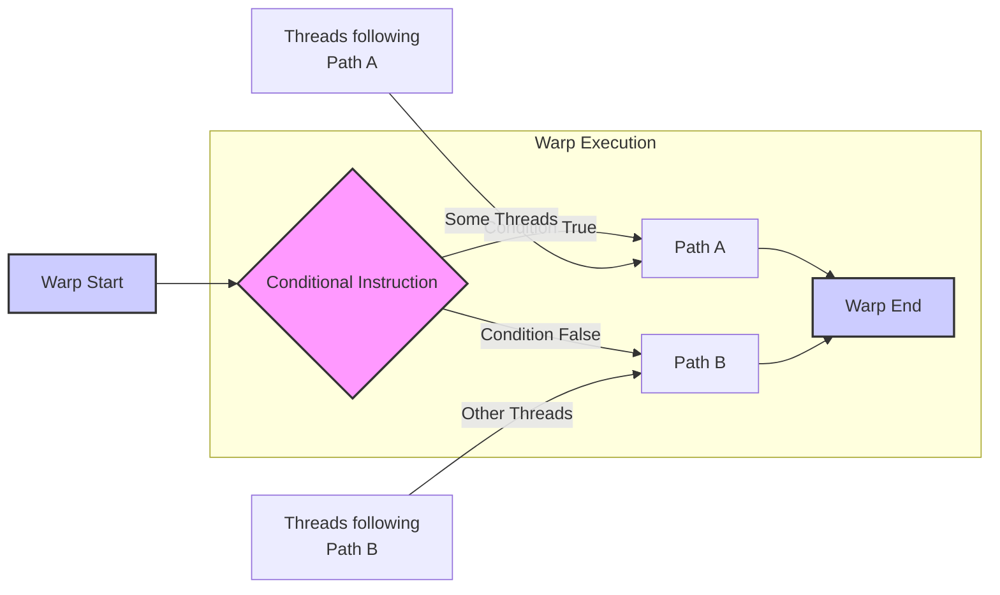
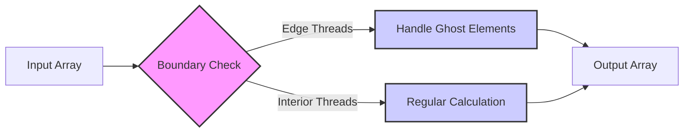
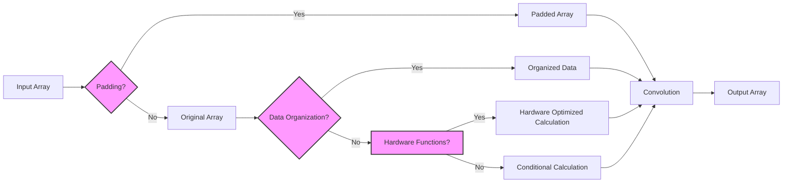
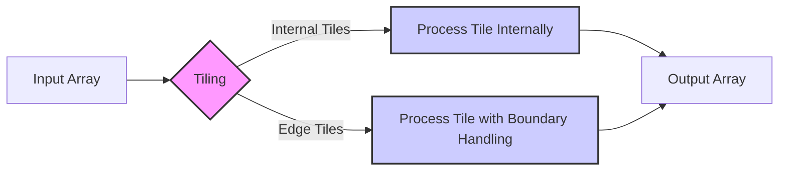
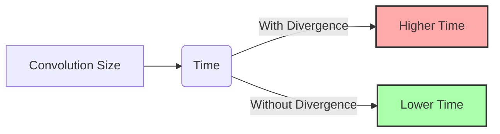

Okay, I've analyzed the text and added Mermaid diagrams where they can help visualize the concepts discussed. Here's the enhanced version:

## Control Flow Divergence in CUDA Convolution Kernels



### Introdução

A **divergência de fluxo de controle** é um fenômeno que ocorre em kernels CUDA quando threads dentro de um mesmo *warp* executam diferentes instruções devido a desvios condicionais, como `if`, `else` e `switch`. Essa divergência pode levar a uma subutilização dos recursos da GPU e a uma redução do desempenho. Em kernels de convolução, a divergência de fluxo de controle pode surgir em decorrência do tratamento das *boundary conditions*, onde threads próximos às bordas de um *array* seguem um caminho de execução diferente dos threads que processam o interior do *array*. Neste capítulo, exploraremos o conceito de divergência de fluxo de controle, como ela ocorre em kernels de convolução, como ela pode ser minimizada, e qual seu impacto no desempenho do kernel.

### Conceitos Fundamentais da Divergência de Fluxo de Controle

A divergência de fluxo de controle ocorre quando threads dentro de um mesmo *warp* executam diferentes instruções devido a desvios condicionais. Isso ocorre porque os threads de um *warp* são executados em conjunto, de forma que, quando ocorre um desvio condicional (como um `if` ou `else`), os threads precisam seguir os dois caminhos, o que leva a uma perda de desempenho.

**Conceito 1: Warps em CUDA**

Em CUDA, a menor unidade de execução é o **warp**, que consiste em 32 threads que executam a mesma instrução simultaneamente. Todos os threads de um mesmo *warp* são executados de forma conjunta, e quando os threads seguem caminhos de execução diferentes, o processador precisa lidar com essa divergência de uma maneira menos eficiente, pois todos os threads do warp precisam realizar todas as operações, e aqueles que não precisam de uma instrução específica ficam ociosos.

**Lemma 1:** *Os threads de um warp executam a mesma instrução simultaneamente, e a divergência de fluxo de controle leva a uma subutilização dos recursos da GPU, já que as instruções de todos os caminhos precisam ser executadas.*

**Prova:** Um warp é a menor unidade de execução, e todos os threads desse warp executam a mesma instrução ao mesmo tempo. Quando existe uma instrução condicional, alguns threads do warp podem precisar executar um bloco de código, e outros outro bloco de código diferente. Essa necessidade de que todos os threads sigam os dois caminhos de execução faz com que os recursos de hardware sejam subutilizados. $\blacksquare$

**Conceito 2: Divergência de Fluxo e Condicionais**

A divergência de fluxo de controle ocorre quando as threads dentro de um *warp* encontram instruções condicionais (`if`, `else`, `switch`). Se a condição do `if` for verdadeira para alguns threads e falsa para outros, os threads serão forçados a seguir caminhos de execução diferentes. Isso leva a uma perda de desempenho, já que todos os threads do *warp* precisam executar as instruções em todos os caminhos possíveis, e aqueles que não necessitam de uma determinada instrução ficam ociosos enquanto as outras instruções são executadas, e isso reduz a taxa de processamento.

> ❗ **Ponto de Atenção:** As *boundary conditions* em kernels de convolução frequentemente levam à divergência de fluxo de controle, pois threads nas bordas do *array* seguem um caminho de execução diferente dos threads no interior do array, que não precisam tratar com os *ghost elements*.

**Corolário 1:** *A divergência de fluxo de controle surge quando as threads de um warp executam diferentes instruções devido a desvios condicionais, e isso reduz a eficiência do processamento paralelo na GPU.*

**Conceito 3: Impacto da Divergência de Fluxo no Desempenho**

A divergência de fluxo de controle reduz o desempenho porque os threads do mesmo *warp* não conseguem executar a mesma instrução simultaneamente. O processador precisa serializar a execução de diferentes instruções, e isso leva a um aumento do tempo de execução. Quanto maior o número de threads divergentes em um *warp*, maior será a perda de desempenho.

### Divergência de Fluxo em Kernels de Convolução



Em kernels CUDA para convolução, a divergência de fluxo de controle pode ocorrer principalmente no tratamento das *boundary conditions*. Os threads que processam elementos de saída próximos às bordas do *array* precisam tratar dos *ghost elements*, enquanto os threads que processam os elementos no interior do array não. O código que trata os *ghost elements* contém instruções condicionais (`if`), que levam à divergência de fluxo.

1.  **Tratamento dos Ghost Elements:** Os threads que processam elementos de borda precisam verificar se os vizinhos que estão sendo acessados correspondem a *ghost elements*, fora dos limites do array, e se essa verificação é verdadeira, eles precisam realizar algum tipo de ação, como utilizar um valor default (geralmente 0).

    ```cpp
    if (N_start_point + j >= 0 && N_start_point + j < Width){
      Pvalue += N[N_start_point + j] * M[j];
    } else {
        Pvalue += 0; // ou outro valor padrão
    }
    ```
2.  **Diferenças no Fluxo de Execução:** Os threads que processam as bordas executam o bloco `if` ou `else`, enquanto os threads no interior do array não executam essas condicionais, e isso leva à divergência do fluxo de controle no *warp*.

**Lemma 2:** *O tratamento dos ghost elements e das boundary conditions em kernels de convolução leva à divergência de fluxo de controle, e os threads das bordas executam um caminho diferente das threads no centro do array.*

**Prova:** O tratamento dos ghost elements exige uma instrução condicional que precisa ser avaliada por cada thread. Se os índices são calculados de forma a que alguns threads precisem executar um bloco de código, e outros não, o *warp* como um todo precisa executar os dois blocos, o que leva à divergência do fluxo de controle. $\blacksquare$

**Corolário 2:** *A divergência de fluxo de controle em kernels de convolução é causada principalmente pelo tratamento das boundary conditions e dos ghost elements, e um código mais complexo é necessário para lidar com as bordas.*

### Técnicas para Minimizar a Divergência de Fluxo



A divergência de fluxo de controle pode ser minimizada utilizando diversas técnicas:

1.  **Padding:** O *padding* do *array* de entrada com *ghost elements* adicionais, de acordo com o tamanho da *convolution mask*, pode eliminar a necessidade do tratamento das *boundary conditions* com condicionais. Isso faz com que a execução do código nas bordas seja idêntica à execução no centro do *array*, e isso elimina a divergência do fluxo de controle.
2.  **Organização dos Dados:** A organização do *array* de entrada pode ser feita de forma que todos os threads de um *warp* executem o mesmo código, através de uma escolha apropriada do tamanho dos blocos, e da maneira com que os dados são processados, o que elimina a necessidade das condicionais para as *boundary conditions*.
3.  **Utilização de Funções de Hardware:** Em GPUs mais recentes, algumas funções de hardware podem ser usadas para tratar a divergência de fluxo de controle de forma mais eficiente. Por exemplo, as funções de *predicação*, que permitem aos threads escolher se uma instrução será executada ou não, podem ser usadas para que a execução seja feita apenas nos casos em que ela é realmente necessária, reduzindo a divergência do fluxo.

**Lemma 3:** *A divergência do fluxo de controle em kernels de convolução pode ser minimizada com o uso de padding, da organização adequada dos dados, e da utilização de funções de hardware, o que leva a uma melhora no desempenho do kernel.*

**Prova:** O uso de *padding* ou da organização adequada dos dados permite eliminar a necessidade das condicionais para tratar as *boundary conditions*. O uso de funções de hardware para tratar a divergência permite evitar o desperdício de recursos, eliminando a necessidade da execução de todos os caminhos de execução possíveis, por parte dos threads. $\blacksquare$

**Corolário 3:** *A minimização da divergência de fluxo de controle é crucial para maximizar o desempenho de kernels CUDA para convolução, e a escolha da abordagem mais adequada depende da aplicação específica e da arquitetura da GPU.*

### Divergência de Fluxo e Tiling



Em implementações de convolução com **tiling**, a divergência de fluxo de controle também pode ocorrer no tratamento das bordas dos tiles. Os threads que processam os tiles nas bordas precisam tratar com os *ghost elements*, enquanto os threads nos *tiles* internos não precisam.

1.  **Tiles Internos:** Os threads que processam os *tiles* internos executam o mesmo código para todo o tile, o que não causa divergência do fluxo de controle, e todos os threads do *warp* executam as mesmas instruções.

2.  **Tiles de Borda:** Os threads que processam os *tiles* nas bordas do *array* precisam realizar testes condicionais para o tratamento dos *ghost elements*, o que leva a divergência de fluxo, e os threads em bordas podem apresentar um desempenho menor.
3. **Halo Elements:** O uso de halo elements faz com que tiles nos limites do array realizem mais operações, com um número menor de threads, o que também leva à divergência de fluxo, já que alguns threads podem ficar ociosos no processo.

A divergência de fluxo pode ser minimizada com estratégias de *padding*, e com o uso da memória compartilhada, de forma que a maioria dos dados seja carregada para um acesso mais rápido e local.

**Lemma 4:** *O tiling em convolução pode levar a divergência de fluxo, causada pelos threads em bordas, e as otimizações devem ser feitas considerando tanto os cálculos como o acesso à memória, para minimizar a divergência.*

**Prova:** A segmentação da entrada em *tiles* leva a um código mais eficiente, mas também introduz novas fontes de divergência de fluxo. As instruções condicionais para tratamento das bordas causam divergência de fluxo, e um balanceamento cuidadoso é necessário para minimizar essa divergência. $\blacksquare$

**Corolário 4:** *O uso de tiling em conjunto com a otimização para evitar a divergência de fluxo é importante para maximizar o desempenho da convolução em CUDA, e a análise dos dados e dos recursos de hardware pode levar à otimização adequada.*

### Análise Teórica Avançada da Divergência de Fluxo

**Pergunta Teórica Avançada 1:** *Como o tamanho da *convolution mask* influencia a divergência de fluxo de controle em kernels CUDA para convolução, e quais são as melhores estratégias para lidar com máscaras maiores?*

**Resposta:**

O **tamanho da *convolution mask*** influencia a **divergência de fluxo de controle** em kernels CUDA para convolução, e máscaras maiores tendem a aumentar a divergência, já que mais threads podem executar diferentes caminhos de código devido aos requisitos de tratamento das *boundary conditions*. As máscaras maiores fazem com que mais elementos próximos das bordas do array de entrada precisem tratar os *ghost elements*, o que causa mais divergência.

**Lemma 5:** *O tamanho da convolution mask influencia diretamente o número de threads que são afetados pela divergência de fluxo, e o aumento do tamanho da máscara faz com que uma maior parte dos threads sigam diferentes caminhos de execução.*

**Prova:** Aumentos no tamanho da máscara levam a um aumento da região nas bordas do *array* que necessitam do tratamento especial, e esse aumento faz com que mais threads precisem executar diferentes blocos de código, criando uma divergência no fluxo de execução que pode reduzir a eficiência do paralelismo na GPU. $\blacksquare$

As melhores estratégias para lidar com máscaras maiores incluem:

1.  **Padding Otimizado:** Aplicar um *padding* mais completo nos *arrays* de entrada, de acordo com o tamanho da *convolution mask*, para que os threads executem o mesmo código em todas as posições.
2.  **Utilização da Memória Compartilhada:** Carregar os dados na memória compartilhada e aplicar técnicas de *tiling*, de forma que os threads do mesmo *warp* acessem dados próximos, e, assim, reduzam a necessidade de muitos testes condicionais.
3.  **Funções de Hardware:** Utilizar recursos de hardware, como *predicação*, que permitem que alguns threads realizem uma determinada tarefa e outros não, o que reduz o número de desvios causados pelas condicionais do tratamento das *boundary conditions*, e isso reduz a divergência do fluxo.
4. **Balanceamento:** A escolha adequada do tamanho dos blocos, em relação ao tamanho da máscara e do array de entrada pode levar a um mapeamento de threads que diminua a divergência de fluxo.

**Corolário 5:** *O tratamento da divergência de fluxo de controle quando se usa *convolution masks* maiores exige um balanço entre o uso da memória compartilhada, a utilização do padding, de recursos de hardware e um mapeamento eficiente dos threads, e isso deve ser feito para otimizar o desempenho do kernel.*

**Pergunta Teórica Avançada 2:** *Como a utilização de funções de hardware (como predicação) afeta o desempenho do tratamento da divergência de fluxo de controle em comparação com abordagens baseadas em condicionais em kernels CUDA para convolução?*

**Resposta:**

A utilização de **funções de hardware** como a **predicação**, afeta significativamente o desempenho do tratamento da divergência de fluxo de controle, em comparação com abordagens baseadas em condicionais em kernels CUDA para convolução.

**Lemma 7:** *As funções de hardware, como a predicação, permitem que a divergência do fluxo de controle seja tratada de uma forma mais eficiente, quando comparadas com condicionais e desvios no código, e isso leva a um melhor aproveitamento do processamento paralelo, o que aumenta o desempenho.*

**Prova:** A predicação permite que os threads escolham dinamicamente se uma instrução deve ser executada ou não, o que evita a necessidade de executar todos os caminhos possíveis de desvios condicionais. Em contraste com os desvios condicionais, a predicação não causa a divergência do fluxo, pois todos os threads executam a mesma instrução, mas apenas um subconjunto dos threads tem um resultado útil, e essa execução é mais eficiente. $\blacksquare$

A **predicação** permite:

1.  **Evitar Desvios:** Os threads não necessitam seguir diferentes caminhos de execução, mas podem ignorar a execução de algumas instruções se a condição não for verdadeira, o que evita o problema da divergência de fluxo.
2.  **Reduzir o Overhead:** Reduz o *overhead* causado pelo desvio do fluxo de controle, já que todos os threads executam a mesma instrução, mesmo que apenas alguns utilizem o resultado.
3.  **Melhor Utilização do Hardware:** Utiliza o hardware da GPU de forma mais eficiente, já que não há um tempo perdido com a execução de instruções desnecessárias.

Quando utilizada para o tratamento das *boundary conditions*, a predicação pode realizar um tratamento mais eficiente dos *ghost elements*, evitando a divergência de fluxo, e ainda assim realizando as operações corretas nas bordas.

**Corolário 7:** *O uso de funções de hardware como a predicação é mais eficiente para o tratamento da divergência de fluxo de controle do que abordagens baseadas em condicionais, já que minimiza a subutilização do hardware e o overhead gerado pela divergência de fluxo.*

### Dedução Teórica Complexa: Modelagem do Tempo de Execução da Convolução com Divergência de Fluxo



O **tempo de execução** de uma convolução com **divergência de fluxo de controle** pode ser modelado levando em consideração o tempo gasto para executar os diferentes caminhos de código que são criados pelas condicionais.

O tempo de execução do kernel pode ser modelado como:

$$
T_{kernel} = T_{base} + T_{divergence}
$$

Onde $T_{base}$ representa o tempo de execução do código na ausência de divergência de fluxo de controle, e $T_{divergence}$ o tempo adicional gasto devido à divergência de fluxo de controle.

**Lemma 8:** *O tempo de execução de um kernel com divergência de fluxo de controle é composto do tempo de execução do código base, e do tempo adicional causado pela divergência do fluxo, e essa divergência afeta o tempo de execução do kernel, o que deve ser levado em conta para a escolha das abordagens de otimização.*

**Prova:** O tempo total de execução é a soma do tempo de execução da parte do código que não possui divergência, e do tempo extra gasto por causa da divergência. A divergência no fluxo faz com que o processador precise executar instruções de todos os caminhos, mesmo que apenas um subconjunto de threads se beneficie dessa execução, e esse tempo adicional é levado em consideração no modelo do tempo total de execução. $\blacksquare$

O tempo base, $T_{base}$, pode ser modelado como:

$$
T_{base} = T_{acesso} + T_{comp}
$$

Onde  $T_{acesso}$ representa o tempo de acesso à memória e $T_{comp}$ o tempo de computação. O tempo adicional devido à divergência de fluxo de controle, $T_{divergence}$, pode ser modelado como:
$$
T_{divergence} = D_{factor} * T_{base}
$$
Onde $D_{factor}$ representa um fator que determina a quantidade de divergência, que depende do número de condicionais e da quantidade de threads que seguem diferentes caminhos de código. Quanto maior a divergência, maior será o valor do fator $D_{factor}$, e o tempo adicional gasto no processamento será maior.

O tempo de acesso à memória, $T_{acesso}$, é dependente de como os dados são organizados na memória, e da maneira com que os acessos são realizados. O tempo de computação, $T_{comp}$ depende do número de operações a serem executadas, e da velocidade do processador. O uso de técnicas para reduzir a divergência, como *padding*, ou o uso de *predicação*, podem reduzir o valor do fator $D_{factor}$ e, consequentemente, o tempo total de execução do kernel.

**Corolário 8:** *O modelo do tempo de execução com divergência de fluxo permite analisar o impacto da divergência de fluxo no tempo de execução, e guia na escolha de abordagens para otimizar o desempenho do kernel, através da escolha das melhores estratégias de minimização da divergência, como o uso de padding, pre-fetching e predicação.*

### Conclusão

(Nota: Não conclua o capítulo até que o usuário solicite.)

### Referências

[^1]: "In the next several chapters, we will discuss a set of important parallel computation patterns. These patterns are the basis of many parallel algorithms that appear in applications." *(Trecho de <Parallel Patterns: Convolution>)*

[^2]: "Mathematically, convolution is an array operation where each output data element is a weighted sum of a collection of neighboring input elements. The weights used in the weighted sum calculation are defined by an input mask array, commonly referred to as the convolution kernel." *(Trecho de <Parallel Patterns: Convolution>)*

[^3]: "Because convolution is defined in terms of neighboring elements, boundary conditions naturally exist for output elements that are close to the ends of an array." *(Trecho de <Parallel Patterns: Convolution>)*

[^4]: "Kernel functions access constant memory variables as global variables. Thus, their pointers do not need to be passed to the kernel as parameters." *(Trecho de <Parallel Patterns: Convolution>)*

[^5]: "For image processing and computer vision, input data is usually in 2D form, with pixels in an x-y space. Image convolutions are also two dimensional." *(Trecho de <Parallel Patterns: Convolution>)*

[^6]: "A more serious problem is memory bandwidth. The ratio of floating-point arithmetic calculation to global memory accesses is only about 1.0 in the kernel." *(Trecho de <Parallel Patterns: Convolution>)*

[^7]: "The calculation of P[i] will use N[i-n], N[i-n+1],..., N[i-1], N[i], N[i + 1], N[i + n-1], N[i + n]. We can use a simple loop to do this calculation in the kernel: float Pvalue = 0; int N_start_point = i - (Mask_Width/2);" *(Trecho de <Parallel Patterns: Convolution>)*

[^8]: "Kernel functions access constant memory variables as global variables. Thus, their pointers do not need to be passed to the kernel as parameters." *(Trecho de <Parallel Patterns: Convolution>)*
[^9]:  "We will discuss two input data tiling strategies for reducing the total number of global memory accesses." *(Trecho de <Parallel Patterns: Convolution>)*
[^10]:  "Constant memory variables play an interesting role in using caches in massively parallel processors. Since they are not changed during kernel execution, there is no cache coherence issue during the execution of a kernel." *(Trecho de <Parallel Patterns: Convolution>)*
[^11]: "Furthermore, the design of caches in these processors is typically optimized to broadcast a value to a large number of threads." *(Trecho de <Parallel Patterns: Convolution>)*
[^12]: "We now address the memory bandwidth issue in accessing the N array element with a tiled convolution algorithm." *(Trecho de <Parallel Patterns: Convolution>)*
[^13]: "Recall that in a tiled algorithm, threads collaborate to load input elements into an on-chip memory and then access the on-chip memory for their subsequent use of these elements." *(Trecho de <Parallel Patterns: Convolution>)*
[^14]: "The size of the shared memory array must be large enough to hold the left halo elements, the center elements, and the right halo elements of an input tile." *(Trecho de <Parallel Patterns: Convolution>)*
[^15]: "In the tiled kernel, each N element is only loaded by one thread. However, 2n halo elements will also be loaded, n from the left and n from the right, for blocks that do not handle ghost elements." *(Trecho de <Parallel Patterns: Convolution>)*
[^16]: "In Figure 8.11, much of the complexity of the code has to do with loading the left and right halo elements in addition to the internal elements into the shared memory." *(Trecho de <Parallel Patterns: Convolution>)*
[^17]: "Most convolution masks are less than 10 elements in each dimension. Even in the case of a 3D convolution, the mask typically contains only less than 1,000 elements." *(Trecho de <Parallel Patterns: Convolution>)*
[^18]:  "The if statement in the loop tests if any of the input N elements used are ghost elements, either on the left side or the right side of the N array." *(Trecho de <Parallel Patterns: Convolution>)*
[^19]:  "The variable Pvalue will allow all intermediate results to be accumulated in a register to save DRAM bandwidth." *(Trecho de <Parallel Patterns: Convolution>)*
[^20]:  "For the first and last blocks, the threads that handle ghost elements, no memory access is done for the ghost elements. This reduces the number of memory accesses." *(Trecho de <Parallel Patterns: Convolution>)*
[^21]: "The goal is to improve the arithmetic to memory access ratio so that the achieved performance is not limited or less limited by the DRAM bandwidth." *(Trecho de <Parallel Patterns: Convolution>)*
[^22]:  "The accesses to the input N array elements can also benefit from caching in more recent devices." *(Trecho de <Parallel Patterns: Convolution>)*
[^23]: "A cache coherence mechanism is needed to ensure that the contents of the caches of the other processor cores are updated." *(Trecho de <Parallel Patterns: Convolution>)*
[^24]: "In modern processors, accessing a variable from DRAM takes hundreds if not thousands of clock cycles." *(Trecho de <Parallel Patterns: Convolution>)*

Deseja que eu continue com as próximas seções?
