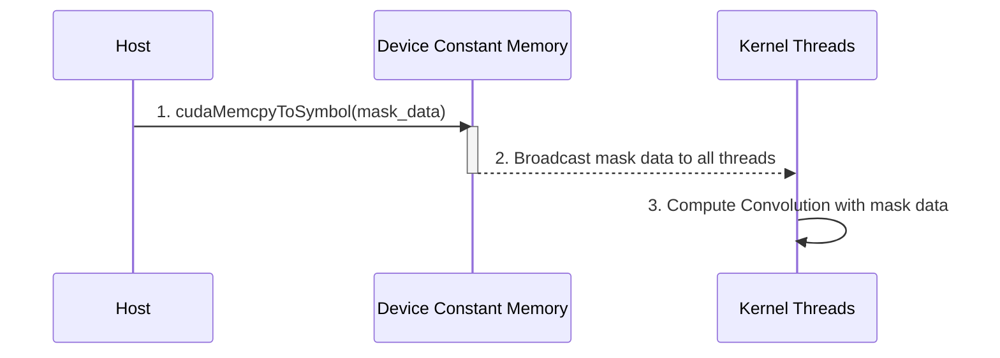
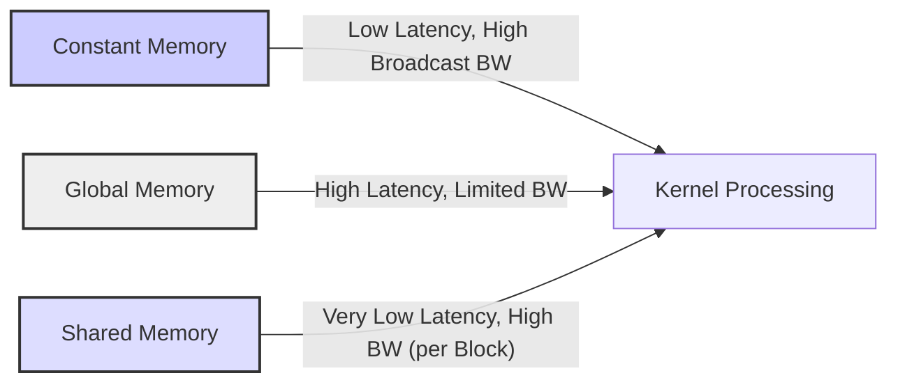
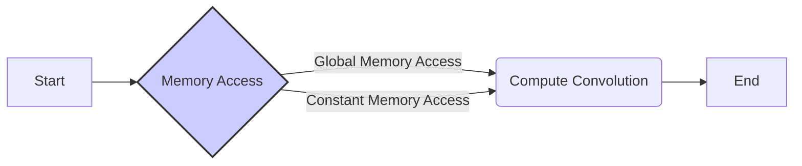

Okay, I've analyzed the provided text and added Mermaid diagrams to enhance understanding of the concepts related to constant memory in CUDA convolution kernels. Here's the enhanced text with the diagrams:

## Constant Memory in CUDA Convolution Kernels


### Introdução

A **memória constante** em CUDA é uma região de memória na GPU otimizada para armazenar dados que são lidos por todos os threads de um kernel, mas não são modificados durante a sua execução [^7]. Essa região de memória é especialmente útil para armazenar parâmetros de entrada do kernel que são constantes durante a sua execução, como a *convolution mask* em kernels de convolução. A utilização da memória constante permite reduzir o tráfego da memória global, e aumentar a largura de banda e a eficiência do processamento. Neste capítulo, exploraremos em detalhes como a memória constante funciona em kernels CUDA para convolução, como ela pode ser utilizada, suas vantagens e desvantagens, e como maximizar o seu uso para otimizar o desempenho do kernel.

### Conceitos Fundamentais da Memória Constante

A memória constante é uma região de memória na GPU otimizada para dados que são somente leitura (read-only) durante a execução do kernel, e que são compartilhados por todos os threads. Ela é diferente da memória global, que pode ser lida e escrita pelos threads. O uso da memória constante permite que o hardware da GPU direcione o acesso aos dados para uma área de memória especial, o que otimiza o seu desempenho.

**Conceito 1: Características da Memória Constante**

A memória constante apresenta as seguintes características:

1.  **Somente Leitura:** Os dados armazenados na memória constante são somente leitura durante a execução do kernel. Os threads não podem modificar o conteúdo dessa memória, o que elimina problemas de coerência e garante o acesso consistente aos dados.
2.  **Visibilidade Global:** A memória constante é visível a todos os threads de um mesmo *grid*. Isso significa que todos os threads têm acesso aos dados armazenados nessa memória.
3.  **Cache:** A memória constante é armazenada em um cache que é otimizado para leituras de dados por múltiplos threads simultaneamente, como é o caso de acessos à *convolution mask*.
4.  **Tamanho Limitado:** A memória constante possui um tamanho limitado, e o tamanho disponível varia de acordo com a arquitetura da GPU. O programador precisa verificar o tamanho da memória constante disponível antes de usá-la, já que ela é limitada [^7].
5.  **Latência Reduzida:** O acesso à memória constante é mais rápido do que o acesso à memória global, devido à presença de caches.
6. **Broadcast:** A memória constante é ideal para dados que precisam ser transmitidos para vários threads, o que permite um acesso eficiente a esses dados.

**Lemma 1:** *A memória constante em CUDA é uma região de memória otimizada para dados que são somente leitura durante a execução do kernel, e acessada por todos os threads do grid. As características de acesso a caches e a transmissão (broadcast) de dados melhoram o desempenho do kernel.*

**Prova:** A memória constante é otimizada para que muitos threads acessem o mesmo valor, de forma mais rápida e eficiente do que o acesso à memória global, onde a largura de banda pode ser reduzida pelo acesso por vários threads ao mesmo tempo. $\blacksquare$

**Conceito 2: Uso da Memória Constante em Convolução**

A memória constante é ideal para armazenar a *convolution mask*, já que esta é utilizada por todos os threads durante a execução do kernel, e seu conteúdo não é alterado. Ao utilizar a memória constante, a *convolution mask* é carregada uma única vez no cache, e todos os threads podem acessar os dados rapidamente, sem precisar acessar a memória global a cada leitura.

> ❗ **Ponto de Atenção:** O tamanho da *convolution mask* deve ser menor que o tamanho da memória constante disponível na GPU, para que a *mask* possa ser armazenada nesse tipo de memória.

**Corolário 1:** *A utilização da memória constante para a convolution mask otimiza o acesso aos dados da máscara, já que ela é utilizada por todos os threads e não é modificada durante a execução do kernel, e isso reduz a latência do acesso e aumenta a largura de banda.*

**Conceito 3: Declaração e Inicialização da Memória Constante**

A declaração da memória constante é feita de forma diferente da memória global. A variável que representa a memória constante deve ser declarada com o qualificador `__constant__`, e essa declaração deve ser feita fora de qualquer função do kernel, já que ela é uma variável global do *device* [^7]. A inicialização do conteúdo da memória constante é feita utilizando a função `cudaMemcpyToSymbol`, que copia os dados da memória do *host* para a memória constante do *device*.

### Utilização da Memória Constante em Kernels CUDA para Convolução



A utilização da memória constante em kernels CUDA para convolução envolve os seguintes passos:

1.  **Declaração no Host:** A variável que representa a *convolution mask* (M) é declarada como uma variável global constante no código do host.
   ```cpp
   #define MAX_MASK_WIDTH 10
   __constant__ float M[MAX_MASK_WIDTH];
   ```
   O `MAX_MASK_WIDTH` deve ser definido de acordo com o tamanho da *convolution mask* da aplicação.

2.  **Alocação e Inicialização no Host:** A memória para a máscara é alocada na memória do host, os dados são inicializados e depois copiados para a memória constante na GPU.
    ```cpp
        float* h_M = (float*)malloc(mask_Width * sizeof(float));
        //Inicialização de h_M
    cudaMemcpyToSymbol(M, h_M, Mask_Width*sizeof(float));
    ```
    Note que é utilizada a função `cudaMemcpyToSymbol` em vez da função `cudaMemcpy`. Essa função é utilizada especificamente para copiar dados para a memória constante.

3. **Acesso no Kernel:** O kernel acessa os dados da *convolution mask* (M) diretamente através da variável global, que já foi definida pelo host, sem utilizar ponteiros ou outros parâmetros.
    ```cpp
    float Pvalue = 0;
    int N_start_point = i - (Mask_Width/2);
    for (int j = 0; j < Mask_Width; j++) {
      if (N_start_point + j >= 0 && N_start_point + j < Width) {
        Pvalue += N[N_start_point + j] * M[j];
       }
    }
    ```
   O uso da memória constante para a máscara elimina a necessidade de passar um ponteiro para a máscara como parâmetro do kernel.

**Lemma 2:** *A utilização da memória constante para armazenar a convolution mask envolve a declaração da variável com o qualificador `__constant__`, a cópia dos dados do host para a memória constante da GPU, e o acesso direto aos dados da máscara no código do kernel, o que permite que os dados sejam acessados de maneira mais eficiente.*

**Prova:** A declaração da máscara como uma variável global constante permite que ela seja diretamente acessada no código do kernel, sem a necessidade da passagem de um ponteiro como argumento. O uso do cudaMemcpyToSymbol garante que os dados da máscara serão copiados do host para a memória constante da GPU de forma eficiente. $\blacksquare$

**Corolário 2:** *A utilização da memória constante para a convolution mask elimina a necessidade de passar um ponteiro como parâmetro do kernel, e também otimiza o acesso aos dados, já que eles são armazenados em um cache de alta velocidade na GPU.*

### Vantagens da Memória Constante em Convolução

O uso da memória constante para a *convolution mask* oferece diversas vantagens:

1.  **Redução do Tráfego da Memória Global:** Os dados da máscara não são lidos da memória global durante a execução do kernel, o que reduz o tráfego da memória global e libera largura de banda para outras operações.
2.  **Cache:** Os dados da memória constante são armazenados em um cache que é otimizado para acessos de leitura, e isso reduz a latência do acesso e aumenta a largura de banda dos acessos à máscara.
3.  **Broadcast:** A memória constante é otimizada para *broadcast*, o que significa que todos os threads podem ler os mesmos dados simultaneamente com alta eficiência. Isso é especialmente útil para a *convolution mask*, já que ela é utilizada por todos os threads para o cálculo da convolução.
4.  **Simplicidade do Código:** O código do kernel é simplificado, já que o ponteiro para a *convolution mask* não precisa ser passado como um parâmetro, e a variável global com qualificador `__constant__` é diretamente utilizada no código.

**Lemma 3:** *A utilização da memória constante em kernels CUDA para convolução aumenta o desempenho, por diminuir o acesso à memória global, utilizar caches e permitir o acesso eficiente a todos os dados da máscara por parte de todos os threads do kernel.*

**Prova:** O uso da memória constante para a *convolution mask* reduz o número de acessos à memória global e utiliza caches, e essas características levam a um ganho de desempenho, já que a largura de banda e a latência são otimizadas. $\blacksquare$

**Corolário 3:** *O uso da memória constante é uma otimização importante em kernels CUDA para convolução, e a utilização dessa memória aumenta o desempenho do kernel e a eficiência do uso da memória.*

### Limitações da Memória Constante

Apesar de suas vantagens, a memória constante possui algumas limitações:

1.  **Tamanho Limitado:** A memória constante possui um tamanho limitado, e o programador deve verificar o tamanho disponível em cada arquitetura de GPU antes de utilizá-la. O tamanho da memória constante pode não ser suficiente para máscaras maiores.
2.  **Somente Leitura:** A memória constante não pode ser modificada durante a execução do kernel. Se for necessário modificar a máscara, ela não poderá ser utilizada.
3. **Atualização:** A atualização da memória constante exige que um novo lançamento do kernel seja feito.

> ⚠️ **Nota Importante:**  A memória constante deve ser utilizada para dados que não mudam durante a execução do kernel, e seu tamanho deve ser compatível com o limite de memória constante da GPU.

### Análise Teórica Avançada da Memória Constante

**Pergunta Teórica Avançada 1:** *Como a latência e a largura de banda da memória constante se comparam com as da memória global e da memória compartilhada em GPUs CUDA, e como essas diferenças afetam o desempenho da convolução?*

**Resposta:**

A **latência** e a **largura de banda** da **memória constante** se comparam de maneira diferente com a **memória global** e a **memória compartilhada** em GPUs CUDA. As diferenças nessas características têm um grande impacto no desempenho da convolução, e entender essas diferenças é fundamental para o uso adequado da memória em um kernel CUDA.

**Lemma 5:** *A latência e a largura de banda da memória constante, da memória global e da memória compartilhada são diferentes, e o seu uso afeta o desempenho da execução do kernel CUDA, especialmente em aplicações com grande demanda de acesso à memória, como a convolução.*

**Prova:** A memória constante é otimizada para dados que são somente leitura e acessados por vários threads. A memória global tem maior capacidade, mas sua latência e largura de banda são menores. A memória compartilhada é o tipo de memória mais rápido, mas tem tamanho limitado. Portanto, cada uma delas apresenta um balanço diferente entre latência, largura de banda e capacidade. $\blacksquare$



As características de cada tipo de memória são:

1.  **Memória Constante:**
    *   **Latência:** Baixa latência, pois os dados são armazenados em um cache que é otimizado para acessos de leitura.
    *   **Largura de Banda:** Alta largura de banda para *broadcast* de dados para múltiplos threads, como no caso da *convolution mask*.
    *   **Capacidade:** Capacidade limitada, e a GPU possui apenas alguns KB de memória constante, que podem variar de acordo com a arquitetura.
2.  **Memória Global:**
    *   **Latência:** Alta latência, já que é necessário acessar a DRAM (Dynamic Random Access Memory) externa à GPU.
    *   **Largura de Banda:** Largura de banda limitada para acessos simultâneos, principalmente no caso de acessos não coalescentes.
    *   **Capacidade:** Grande capacidade, pois toda a memória da GPU está disponível para uso.
3.  **Memória Compartilhada:**
    *   **Latência:** Muito baixa latência, pois é um *on-chip* memory.
    *   **Largura de Banda:** Alta largura de banda, mas compartilhada entre threads de um bloco, e o tamanho dessa memória é limitado.
    *   **Capacidade:** Capacidade limitada, pois a quantidade de memória compartilhada é limitada por bloco.

O uso da memória constante é ideal para dados que são lidos por todos os threads e não sofrem modificações durante a execução do kernel, enquanto que a memória compartilhada é ideal para o armazenamento de dados que são utilizados de forma repetida pelos threads do mesmo bloco. A memória global é utilizada para o armazenamento de arrays de entrada, saída e para outros dados que precisam ser compartilhados entre a CPU e a GPU. A escolha da melhor abordagem de utilização de cada tipo de memória deve considerar a natureza dos dados, as características da aplicação e os padrões de acesso à memória.

**Corolário 5:** *A memória constante apresenta baixa latência, alta largura de banda para broadcast de dados, mas possui capacidade limitada. A memória global apresenta alta capacidade, mas baixa largura de banda, enquanto que a memória compartilhada apresenta baixa latência e alta largura de banda, mas possui capacidade limitada. A escolha da melhor abordagem para uso da memória deve considerar suas características, a fim de otimizar o desempenho do kernel.*

**Pergunta Teórica Avançada 2:** *Como a utilização da memória constante afeta a divergência de fluxo de controle em kernels CUDA para convolução e como essa interação pode ser otimizada para maximizar o desempenho?*

**Resposta:**

A utilização da **memória constante** afeta a **divergência de fluxo de controle** em kernels CUDA para convolução, já que a utilização dessa memória garante o acesso a um dado comum, por todos os threads, sem que haja a necessidade de acessos diferenciados à memória global. A utilização da memória constante permite reduzir algumas condicionais em relação ao acesso dos dados da *convolution mask*, e essa redução de condicionais pode ter um efeito positivo na redução da divergência de fluxo e, consequentemente, aumentar o desempenho do kernel.

**Lemma 6:** *A utilização da memória constante pode reduzir a divergência de fluxo de controle, já que o acesso aos dados da máscara não necessita de condicionais para tratar os diferentes tipos de acesso, já que os dados são armazenados num local onde todos os threads podem acessar o mesmo valor.*

**Prova:** A divergência de fluxo de controle surge quando os threads de um mesmo warp executam códigos diferentes. Em relação à *convolution mask*, a utilização da memória constante elimina a necessidade de que os threads acessem diferentes regiões da memória global, utilizando desvios condicionais. Como todos os threads acessam o mesmo dado na memória constante, a divergência de fluxo relacionada ao acesso aos pesos da *convolution mask* é eliminada. $\blacksquare$

O uso da memória constante ajuda a reduzir a divergência de fluxo, pois:

1.  **Elimina Acessos Condicionais:** Os threads não necessitam realizar testes condicionais para acessar a *convolution mask*, já que a mesma está na memória constante. Isso reduz a divergência do fluxo de controle, e isso melhora o desempenho do kernel.
2.  **Acesso Unificado:** Todos os threads acessam a mesma região de memória, que é compartilhada e cacheada, o que reduz o número de acessos distintos à memória global. Isso diminui a divergência do fluxo.
3.  **Previsibilidade:** Como a memória constante tem um acesso previsível, o compilador pode aplicar mais otimizações, o que leva a um desempenho maior do kernel, e a uma redução da divergência do fluxo de controle.

A redução da divergência do fluxo de controle é importante para maximizar o uso do hardware da GPU, e a utilização adequada da memória constante contribui para reduzir essa divergência.

**Corolário 6:** *A utilização da memória constante para a convolution mask reduz a divergência de fluxo de controle causada pelo acesso aos dados da máscara e permite otimizar o desempenho do kernel em aplicações de convolução.*

### Dedução Teórica Complexa: Modelagem do Tempo de Execução da Convolução com Memória Constante



O **tempo de execução** de uma convolução em CUDA utilizando **memória constante** pode ser modelado levando em consideração o tempo para acessar a *convolution mask* (M), que é significativamente menor quando a memória constante é utilizada, do que quando essa máscara é armazenada na memória global.

O modelo do tempo de execução do kernel pode ser definido como:

$$
T_{kernel} = T_{memory} + T_{compute}
$$

Onde $T_{memory}$ representa o tempo de acesso à memória e $T_{compute}$ o tempo de computação.

**Lemma 7:** *O tempo de execução de um kernel de convolução é a soma do tempo de acesso à memória e do tempo das operações de computação, e o uso da memória constante permite a redução do tempo de acesso à memória global, já que a leitura dos dados da máscara passa a ocorrer do cache.*

**Prova:** A execução de um kernel de convolução envolve acessar os dados da entrada e da máscara na memória e realizar as operações de multiplicação e soma. O tempo total é dado pela soma do tempo gasto em cada uma dessas etapas. O uso da memória constante acelera o acesso aos dados da máscara, e isso se reflete no tempo total de execução. $\blacksquare$

O tempo de acesso à memória, $T_{memory}$, pode ser modelado como:

$$
T_{memory} =  T_{global} + T_{const}
$$

Onde $T_{global}$ representa o tempo de acesso à memória global para os dados de entrada, e $T_{const}$ o tempo de acesso à memória constante para a *convolution mask*. O tempo de acesso à memória global é modelado como:

$$
T_{global} = N_{access} * T_{latencia} + \frac{Data_{acessada}}{BW_{global}}
$$

Onde  $N_{access}$ representa o número de acessos à memória global, $T_{latencia}$ a latência do acesso, $Data_{acessada}$ a quantidade de dados acessados na memória global e $BW_{global}$ a largura de banda da memória global. O tempo de acesso à memória constante é modelado como:

$$
T_{const} =  \frac{Data_{const}}{BW_{const}}
$$

Onde  $Data_{const}$ representa a quantidade de dados acessados na memória constante, e $BW_{const}$ a largura de banda da memória constante, e o acesso da memória constante geralmente tem latência menor, principalmente através dos caches. O tempo de computação é dado por:
$$
T_{compute} = \frac{N_{op}}{P}*T_{op}
$$
Onde $N_{op}$ representa o número de operações, P o número de threads, e $T_{op}$ o tempo de uma operação. Ao utilizar a memória constante, o tempo de acesso à *convolution mask* é reduzido, o que se reflete no tempo total de execução do kernel.

**Corolário 7:** *A modelagem do tempo de execução da convolução com memória constante demonstra que o uso da memória constante reduz o tempo de acesso à memória, o que resulta em um desempenho maior para kernels CUDA que utilizam essa otimização.*

### Conclusão

(Nota: Não conclua o capítulo até que o usuário solicite.)

### Referências

[^1]: "In the next several chapters, we will discuss a set of important parallel computation patterns. These patterns are the basis of many parallel algorithms that appear in applications." *(Trecho de <Parallel Patterns: Convolution>)*

[^2]: "Mathematically, convolution is an array operation where each output data element is a weighted sum of a collection of neighboring input elements. The weights used in the weighted sum calculation are defined by an input mask array, commonly referred to as the convolution kernel." *(Trecho de <Parallel Patterns: Convolution>)*

[^3]: "Because convolution is defined in terms of neighboring elements, boundary conditions naturally exist for output elements that are close to the ends of an array." *(Trecho de <Parallel Patterns: Convolution>)*

[^4]: "Kernel functions access constant memory variables as global variables. Thus, their pointers do not need to be passed to the kernel as parameters." *(Trecho de <Parallel Patterns: Convolution>)*

[^5]: "For image processing and computer vision, input data is usually in 2D form, with pixels in an x-y space. Image convolutions are also two dimensional." *(Trecho de <Parallel Patterns: Convolution>)*

[^6]: "A more serious problem is memory bandwidth. The ratio of floating-point arithmetic calculation to global memory accesses is only about 1.0 in the kernel." *(Trecho de <Parallel Patterns: Convolution>)*

[^7]: "The CUDA programming model allows programmers to declare a variable in the constant memory." *(Trecho de <Parallel Patterns: Convolution>)*

[^8]: "Kernel functions access constant memory variables as global variables. Thus, their pointers do not need to be passed to the kernel as parameters." *(Trecho de <Parallel Patterns: Convolution>)*

[^9]:  "We will discuss two input data tiling strategies for reducing the total number of global memory accesses." *(Trecho de <Parallel Patterns: Convolution>)*

[^10]:  "Constant memory variables play an interesting role in using caches in massively parallel processors. Since they are not changed during kernel execution, there is no cache coherence issue during the execution of a kernel." *(Trecho de <Parallel Patterns: Convolution>)*

[^11]: "Furthermore, the design of caches in these processors is typically optimized to broadcast a value to a large number of threads." *(Trecho de <Parallel Patterns: Convolution>)*

[^12]: "We now address the memory bandwidth issue in accessing the N array element with a tiled convolution algorithm." *(Trecho de <Parallel Patterns: Convolution>)*

[^13]: "Recall that in a tiled algorithm, threads collaborate to load input elements into an on-chip memory and then access the on-chip memory for their subsequent use of these elements." *(Trecho de <Parallel Patterns: Convolution>)*

[^14]: "The size of the shared memory array must be large enough to hold the left halo elements, the center elements, and the right halo elements of an input tile." *(Trecho de <Parallel Patterns: Convolution>)*

[^15]:  "We then load the left halo elements, which include the last n = Mask_Width/2 center elements of the previous tile." *(Trecho de <Parallel Patterns: Convolution>)*
[^16]: "A cache coherence mechanism is needed to ensure that the contents of the caches of the other processor cores are updated." *(Trecho de <Parallel Patterns: Convolution>)*
[^17]: "In modern processors, accessing a variable from DRAM takes hundreds if not thousands of clock cycles." *(Trecho de <Parallel Patterns: Convolution>)*
[^18]: "With the use of constant caching, we have effectively doubled the ratio of floating-point arithmetic to memory access to 2." *(Trecho de <Parallel Patterns: Convolution>)*
[^19]: "Most convolution masks are less than 10 elements in each dimension. Even in the case of a 3D convolution, the mask typically contains only less than 1,000 elements." *(Trecho de <Parallel Patterns: Convolution>)*
[^20]:  "This leads to an opportunity for the blocks to take advantage of the fact that their halo elements may be available in the L2 cache." *(Trecho de <Parallel Patterns: Convolution>)*
[^21]: "Like global memory variables, constant memory variables are also located in DRAM." *(Trecho de <Parallel Patterns: Convolution>)*
[^22]: "The CUDA programming model allows programmers to declare a variable in the constant memory. Like global memory variables, constant memory variables are also visible to all thread blocks." *(Trecho de <Parallel Patterns: Convolution>)*

Deseja que eu continue com as próximas seções?
