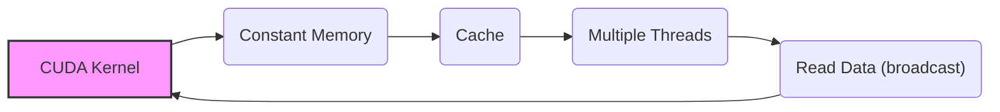
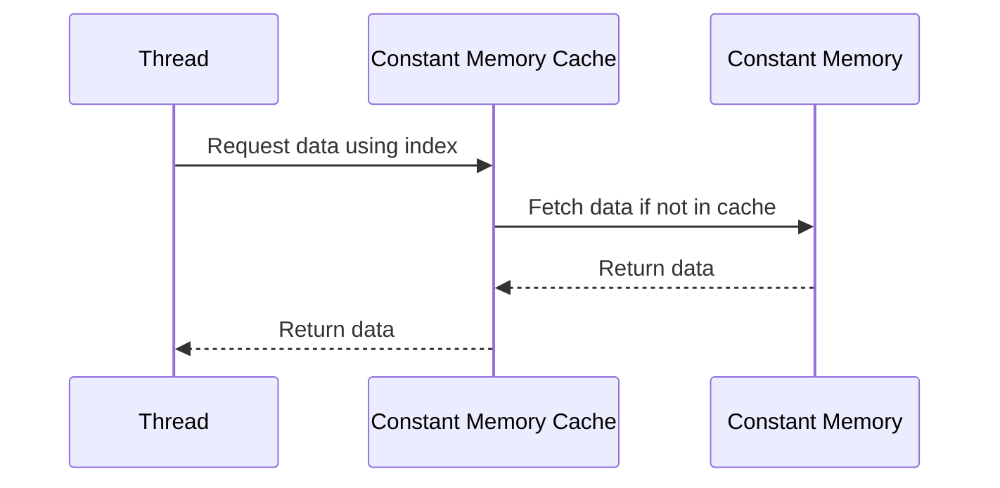
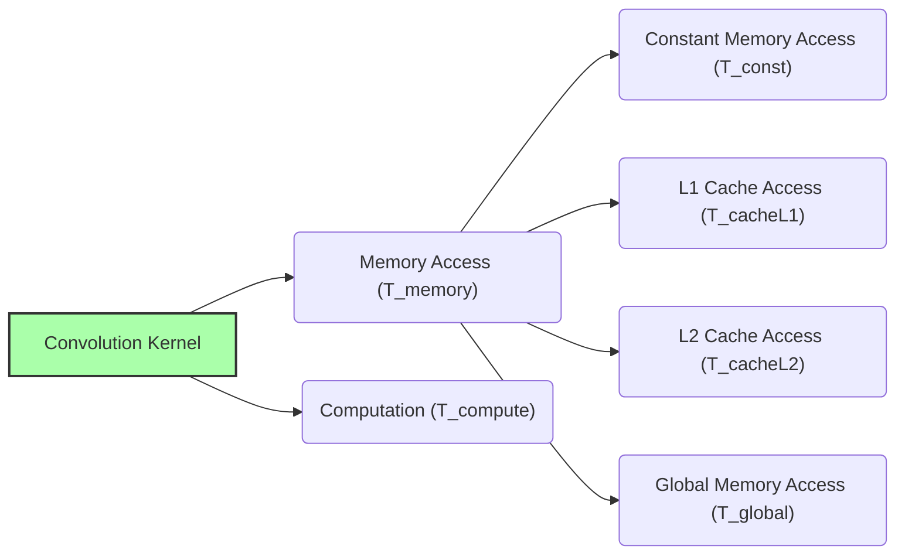

Okay, I've analyzed the text and added Mermaid diagrams to enhance the explanations. Here's the updated text with the diagrams:

## Constant Memory Access in CUDA Convolution Kernels



### Introdução

O **acesso à memória constante** é uma parte fundamental do desempenho de kernels CUDA para convolução que utilizam esse tipo de memória. Como discutido em capítulos anteriores, a memória constante é otimizada para o acesso por múltiplos threads, que necessitam de acesso à *convolution mask*, que é um dado de somente leitura durante a execução do kernel. Compreender como o acesso à memória constante funciona, e como ela interage com os *caches* da GPU, é essencial para maximizar a eficiência do kernel e o desempenho da aplicação. Neste capítulo, exploraremos os detalhes do acesso à memória constante em kernels CUDA para convolução, suas características, as vantagens e desvantagens, e como otimizar o acesso para obter o melhor desempenho.

### Características do Acesso à Memória Constante

O acesso à memória constante em CUDA possui características específicas que o tornam ideal para o armazenamento da *convolution mask*:

1.  **Acesso em *Broadcast*:** A memória constante é projetada para o acesso simultâneo de múltiplos threads. Quando vários threads acessam a mesma região da memória constante, o hardware da GPU realiza um *broadcast*, onde todos os threads recebem o mesmo valor, o que reduz a necessidade de leituras repetidas da memória.
2.  **Cache:** A memória constante é armazenada em um *cache* de leitura de alta velocidade, e a presença do cache reduz a latência do acesso à memória constante e aumenta a largura de banda, já que os acessos são feitos através de caches, e não da memória global, que tem latência e largura de banda menores.
3.  **Dados Somente Leitura:** Os dados da memória constante são somente leitura durante a execução do kernel, e essa característica permite que os acessos sejam otimizados, com um gerenciamento do cache mais eficiente.
4.  **Visibilidade Global:** Os dados armazenados na memória constante são visíveis a todos os threads de um mesmo *grid*, e, desta forma, a máscara pode ser utilizada por todos os threads sem que cada um necessite de sua própria cópia.
5.  **Latência Ocultada:** A latência do acesso à memória constante pode ser ocultada através de técnicas de *pre-fetching* e da otimização da utilização dos caches.

**Conceito 1: Acesso Simultâneo e Broadcast**

A principal característica do acesso à memória constante é a capacidade de todos os threads de um *warp* acessarem os mesmos dados de forma eficiente. Quando vários threads acessam a mesma região da memória constante, o hardware da GPU realiza um *broadcast*, onde um único valor é lido da memória e distribuído para todos os threads, evitando acessos repetidos à memória.

**Lemma 1:** *O acesso simultâneo e o broadcast da memória constante permitem que múltiplos threads acessem o mesmo dado de forma eficiente, o que reduz a latência e aumenta a largura de banda, especialmente ao acessar os dados da convolution mask, que são utilizados por todos os threads.*

**Prova:** A capacidade de *broadcast* permite que todos os threads leiam o mesmo dado com uma única leitura da memória, o que permite que todos os threads leiam a mesma máscara de convolução, com alta eficiência e baixa latência. $\blacksquare$

**Conceito 2: Utilização do Cache e Ocultação da Latência**

A memória constante é armazenada em um *cache* de alta velocidade e baixa latência. O uso do cache permite que os acessos subsequentes aos mesmos dados sejam realizados de forma muito mais rápida. O hardware da GPU realiza o *pre-fetching* dos dados, trazendo os dados para o *cache* antes mesmo que eles sejam necessários, o que ajuda a ocultar a latência do acesso à memória constante, principalmente nos casos de acesso sequencial aos dados, como ocorre no acesso à máscara de convolução.

> ❗ **Ponto de Atenção:** A utilização eficiente do cache na memória constante é fundamental para o bom desempenho da convolução, e para que o tráfego da memória global seja minimizado, e a latência do acesso aos dados seja reduzida ao máximo.

**Corolário 1:** *A utilização do cache e o *pre-fetching* da memória constante reduzem a latência do acesso aos dados da convolution mask, o que aumenta o desempenho do kernel e melhora a eficiência do processamento.*

**Conceito 3: Acesso aos Dados da Máscara em um Kernel de Convolução**

Dentro de um kernel de convolução, os elementos da *convolution mask* são acessados através de índices, de acordo com o tamanho da máscara e o offset da convolução. Quando a memória constante é utilizada para armazenar a máscara, todos os threads do mesmo *warp* acessam a mesma região de memória, que é armazenada no cache. O acesso a um elemento da máscara `M[j]`, em uma convolução 1D, por exemplo, é feita utilizando o índice j, o mesmo índice sendo usado por todos os threads para acessar os dados da *mask*. Em uma convolução 2D, o acesso à máscara M[y,x] é feito através dos índices y e x, que também são utilizados por todos os threads, e, dessa forma, os dados são compartilhados por todos.

### Acesso à Memória Constante em Kernels CUDA



O acesso à memória constante em kernels CUDA para convolução é feito de forma direta, através da variável global que representa a *convolution mask*, que foi declarada com o qualificador `__constant__`. O código do kernel acessa os dados da *mask* através de índices, da mesma forma como se fosse um *array* normal:

1.  **Acesso aos Dados da Máscara (1D):** Para uma convolução 1D, o acesso aos elementos da *convolution mask* (M) é feito utilizando o índice *j*, dentro de um *loop* interno:
    ```cpp
    float Pvalue = 0;
    int N_start_point = i - (Mask_Width/2);
    for (int j = 0; j < Mask_Width; j++) {
      if (N_start_point + j >= 0 && N_start_point + j < Width){
        Pvalue += N[N_start_point + j] * M[j];
       }
    }
    ```

2. **Acesso aos Dados da Máscara (2D):** Para uma convolução 2D, o acesso aos elementos da máscara M[y,x] é feito através dos índices *y* e *x*, dentro de dois loops aninhados:
    ```cpp
     float Pvalue = 0;
     int N_start_y = i - (Mask_Height/2);
     int N_start_x = j - (Mask_Width/2);
     for (int y = 0; y < Mask_Height; y++){
       for (int x = 0; x < Mask_Width; x++){
         if ((N_start_y + y >= 0 && N_start_y + y < Height) && (N_start_x + x >= 0 && N_start_x + x < Width)){
            Pvalue += N[(N_start_y + y) * Width + (N_start_x + x)] * M[y*Mask_Width + x];
         }
        }
     }
   ```
3.  **Cálculo da Convolução:** Os valores dos elementos do *array* de entrada (N) são multiplicados pelos valores correspondentes da *convolution mask* (M), e o resultado é acumulado na variável `Pvalue`, que representa a saída da convolução.

**Lemma 2:** *O acesso à memória constante em kernels CUDA para convolução é realizado de forma direta, através da variável global que representa a convolution mask, e as operações de leitura são feitas utilizando índices que são derivados do offset da convolução.*

**Prova:** O uso da variável global com o qualificador `__constant__` permite que cada thread utilize a máscara, sem a necessidade de parâmetros adicionais, e o acesso através de índices garante o acesso ao valor correto de cada elemento da máscara. $\blacksquare$

**Corolário 2:** *O acesso à memória constante em kernels CUDA para convolução é simples e eficiente, e permite que todos os threads acessem a convolution mask através de um cache, com baixa latência e alta largura de banda.*

### Otimizações no Acesso à Memória Constante


Apesar de a memória constante ser otimizada para acesso por vários threads, o acesso pode ser ainda mais otimizado utilizando algumas técnicas:

1.  **Acesso Sequencial:**  O acesso aos dados da memória constante deve ser feito de forma sequencial, de forma que os threads acessem as posições contíguas na memória, já que os caches são otimizados para o acesso sequencial de dados.
2.  **Pre-Fetching:**  A GPU realiza um *pre-fetching* dos dados da memória constante automaticamente para o cache, mas o programador pode organizar o código de forma que os dados da memória constante sejam utilizados em um padrão sequencial, o que maximiza o uso do cache. A garantia do acesso sequencial faz com que o *pre-fetching* seja mais eficiente.
3. **Simetria:** A simetria na *convolution mask* pode ser usada para que um número menor de acessos à memória constante seja realizado, utilizando o mesmo elemento para o cálculo com diferentes vizinhos na entrada, o que também melhora a largura de banda da memória.
4.  **Uso Eficiente dos Índices:** Os índices usados para acessar os dados da memória constante devem ser calculados com o menor custo possível, e devem ser utilizados da forma mais eficiente para o acesso à memória compartilhada. A escolha do tipo de dado para os índices, e também para os dados da memória constante pode influenciar o desempenho.
5.  **Evitar Acessos Condicionais:** É importante evitar acessos à memória constante que dependam de condicionais dentro do loop, já que elas podem levar a um mau uso da capacidade de *broadcast* da memória constante e podem levar à divergência de fluxo, de uma forma que pode não ser tão aparente como nos acessos à memória global.

**Lemma 3:** *O acesso à memória constante em kernels CUDA para convolução pode ser ainda mais otimizado através do uso do acesso sequencial, pre-fetching, utilização da simetria da máscara e organização adequada do código, o que permite utilizar o cache de forma eficiente, e também permite que os recursos de hardware da GPU sejam utilizados de maneira mais eficiente.*

**Prova:** O uso de acesso sequencial aos dados, juntamente com o pre-fetching, garante o melhor uso do cache da memória constante, e a utilização da simetria reduz o número de acessos necessários à memória, e todos estes fatores juntos resultam em um melhor desempenho do kernel. $\blacksquare$

**Corolário 3:** *A aplicação de técnicas de otimização no acesso à memória constante, em conjunto com outras técnicas de otimização, maximiza o desempenho da convolução em CUDA e garante que o uso da memória seja eficiente, e que a latência seja minimizada.*

### Análise Teórica Avançada do Acesso à Memória Constante

**Pergunta Teórica Avançada 1:** *Como o tamanho da convolution mask e o número de threads por warp interagem com o desempenho do acesso à memória constante em kernels CUDA para convolução, e como escolher o tamanho da máscara para maximizar o aproveitamento do cache?*

**Resposta:**

O **tamanho da *convolution mask*** e o **número de threads por *warp*** interagem de forma complexa com o desempenho do acesso à **memória constante** em kernels CUDA para convolução, e essa interação tem um impacto significativo na performance do kernel. A memória constante é acessada através de um cache otimizado para *broadcast*, e o desempenho é influenciado pela maneira com que os dados são acessados pelos threads.

**Lemma 4:** *O tamanho da convolution mask e o número de threads por warp interagem com o desempenho do acesso à memória constante. O tamanho da máscara afeta a quantidade de dados que precisam ser armazenados no cache, e o número de threads afeta a forma como os dados são acessados.*

**Prova:** Uma máscara grande pode não caber completamente no cache, o que leva a *cache misses*, e um número muito pequeno de threads pode não aproveitar o potencial de *broadcast* e a baixa latência da memória constante. O tamanho do warp é uma característica do hardware e precisa ser considerada no projeto de um kernel que vai utilizar a memória constante.  $\blacksquare$

A **escolha do tamanho da máscara** deve considerar:

1.  **Capacidade do Cache:** A *convolution mask* deve ser pequena o suficiente para caber no *cache* da memória constante. Se a *mask* for muito grande, o desempenho pode ser reduzido devido a *cache misses*. Um número grande de threads utilizando a mesma *mask* podem ser uma vantagem para o desempenho da memória constante, já que o cache de *broadcast* pode ser utilizado.
2.  **Número de Threads:** O tamanho da máscara deve ser compatível com o número de threads por *warp*. Se muitos threads acessam a mesma parte da máscara, e a largura da máscara é um múltiplo do tamanho do warp, o acesso será mais eficiente, pois o *broadcast* da memória constante irá ocorrer de maneira mais eficiente, e menos acessos à memória constante serão necessários.
3.  **Otimização do Cache:** Se a máscara é muito pequena, o cache pode ser subutilizado, e é importante fazer com que o uso do cache seja eficiente, e com a menor quantidade possível de *cache misses*. O acesso sequencial aos dados da máscara pode ser uma boa estratégia para manter os dados no cache.

A escolha ideal do tamanho da máscara deve buscar o balanço entre o tamanho dos dados, a capacidade do cache e o número de threads por *warp*, para que todos os recursos sejam utilizados de forma eficiente.

**Corolário 4:** *A escolha do tamanho da convolution mask para otimizar o acesso à memória constante deve considerar a capacidade do cache, o número de threads por warp, a reutilização dos dados, e as características da aplicação, e o ajuste do tamanho da máscara para uma arquitetura específica pode levar a um aumento significativo de desempenho.*

**Pergunta Teórica Avançada 2:** *Como a utilização de diferentes níveis de cache (L1, L2, caches da memória constante) afeta a latência do acesso à convolution mask em kernels CUDA e como o pre-fetching e a organização dos dados podem ser utilizados para melhorar a utilização desses caches?*

**Resposta:**

A utilização de diferentes níveis de **cache** (L1, L2 e *cache* da memória constante) afeta a **latência do acesso** à *convolution mask* em kernels CUDA, e a otimização do uso desses *caches* é fundamental para melhorar o desempenho do kernel. Cada tipo de cache tem características diferentes de latência e largura de banda, e o uso adequado de cada tipo de *cache* depende do padrão de acesso aos dados e das características do kernel.

**Lemma 6:** *A latência do acesso à memória da convolution mask é influenciada pela hierarquia de caches da GPU. A utilização eficiente dos caches L1 e L2 e a utilização do cache da memória constante permite reduzir o tempo de acesso aos dados da máscara e otimizar o desempenho do kernel.*

**Prova:** O acesso à memória constante é feita através de um cache próprio. O uso da memória compartilhada pode levar aos dados serem armazenados nos caches L1 e L2, e o acesso à memória global também utiliza a hierarquia de caches da GPU. A escolha de onde e como os dados são armazenados impacta diretamente a latência do acesso, e, para a melhor utilização dos caches, os dados devem ser organizados de forma a reduzir a quantidade de *cache misses*. $\blacksquare$

Os diferentes níveis de *caches* interagem da seguinte forma:

1.  **Cache da Memória Constante:** O acesso à memória constante é feito através de um cache de baixa latência, otimizado para o *broadcast* de dados para vários threads. O *cache* da memória constante é geralmente pequeno, mas muito rápido, e o pre-fetching dos dados para esse cache é muito eficiente.
2.  **Cache L1:** O *cache* L1 é um *cache* menor e mais rápido, dedicado a cada SM (Streaming Multiprocessor) da GPU. Os dados carregados para a memória compartilhada podem ser armazenados no *cache* L1, se forem utilizados por um bloco de threads, e isso reduz a necessidade de acessar a memória global. O *cache* L1 pode ser compartilhado entre threads do mesmo SM.
3.  **Cache L2:** O *cache* L2 é maior que o L1, mas tem uma latência maior, e ele é compartilhado entre vários SMs. Os dados carregados da memória global, caso não estejam no L1, podem ser armazenados no L2, e o acesso aos dados que estão armazenados no L2 é mais rápido que o acesso à memória global.

A utilização de **pre-fetching** e da **organização dos dados** visa garantir que os dados sejam armazenados no nível apropriado de *cache*, para que o seu acesso seja feito de forma rápida. O *pre-fetching* deve ser usado de maneira a trazer os dados para o *cache* antes que o thread necessite dos dados, e a organização dos dados deve ser feita de forma a que o acesso a esses dados seja feito da maneira mais eficiente, evitando a ocorrência de *cache misses*. A escolha do nível de *cache* a ser utilizado e a organização dos dados são fundamentais para otimizar a latência e a largura de banda da memória.

**Corolário 6:** *A escolha de onde os dados são armazenados, e a organização do acesso a eles, devem considerar a hierarquia de caches da GPU, com o uso adequado do pre-fetching para reduzir a latência de acesso aos dados, e para maximizar o desempenho do kernel.*

### Dedução Teórica Complexa: Modelagem do Tempo de Execução da Convolução com Memória Constante e Caches



O **tempo de execução** de uma convolução com a utilização da **memória constante** e dos diferentes níveis de **caches** pode ser modelado levando em consideração o tempo gasto com a operação de convolução, o tempo para acesso à memória, e a influência do uso dos caches no tempo de acesso à memória.

O tempo de execução pode ser modelado como:

$$
T_{kernel} = T_{memory} + T_{compute}
$$

Onde $T_{memory}$ representa o tempo de acesso à memória e $T_{compute}$ o tempo de computação.

**Lemma 7:** *O tempo de execução de uma convolução em CUDA é composto pelo tempo para acessar a memória e o tempo para computar a convolução, e o tempo de acesso à memória é influenciado pela escolha do tipo de memória e do nível de cache utilizado.*

**Prova:** O tempo total de execução do kernel é a soma dos tempos de cada etapa. O tempo para acesso à memória é composto pelos tempos de leitura da memória global e da memória constante (utilizando os caches), e o tempo para computar a convolução é influenciado pelo número de operações necessárias. $\blacksquare$

O tempo de acesso à memória, $T_{memory}$, pode ser modelado como:
$$
T_{memory} = T_{const} + T_{cacheL1} + T_{cacheL2} + T_{global}
$$
Onde $T_{const}$ representa o tempo de acesso à memória constante, $T_{cacheL1}$ o tempo de acesso ao cache L1, $T_{cacheL2}$ o tempo de acesso ao cache L2, e $T_{global}$ o tempo de acesso à memória global. O tempo de acesso à memória constante, $T_{const}$, é modelado como:

$$
T_{const} = \frac{Data_{const}}{BW_{const}} + Lat_{const}
$$
Onde $Data_{const}$ representa a quantidade de dados acessados na memória constante, $BW_{const}$ a largura de banda da memória constante, e $Lat_{const}$ a latência do acesso à memória constante. O acesso através dos caches L1 e L2 pode ser modelado de forma similar:
$$
T_{cache} = \frac{Data_{cache}}{BW_{cache}} + Lat_{cache}
$$

Onde $Data_{cache}$ representa a quantidade de dados acessados no cache (L1 ou L2), $BW_{cache}$ a largura de banda do cache, e $Lat_{cache}$ a latência de acesso ao cache. O tempo de acesso à memória global, $T_{global}$, é modelado como:

$$
T_{global} = N_{acessos} * T_{latencia} + \frac{Data_{acessada}}{BW_{global}}
$$

Onde $N_{acessos}$ é o número de acessos à memória global, $T_{latencia}$ a latência do acesso à memória, $Data_{acessada}$ a quantidade de dados acessados, e $BW_{global}$ a largura de banda da memória global. O tempo de computação pode ser modelado como:

$$
T_{compute} = \frac{N_{op}}{P}*T_{op}
$$
Onde $N_{op}$ representa o número total de operações, P o número de threads, e $T_{op}$ o tempo para realizar uma operação. A utilização da memória constante e dos caches otimiza os acessos à memória, e reduz o tempo total de execução do kernel.

**Corolário 8:** *O modelo do tempo de execução da convolução mostra como os caches, e o uso da memória constante influenciam o tempo total de execução, e a organização do acesso à memória é crucial para que os caches possam ser utilizados de maneira adequada e eficiente.*

### Conclusão

(Nota: Não conclua o capítulo até que o usuário solicite.)

### Referências

[^1]: "In the next several chapters, we will discuss a set of important parallel computation patterns. These patterns are the basis of many parallel algorithms that appear in applications." *(Trecho de <Parallel Patterns: Convolution>)*

[^2]: "Mathematically, convolution is an array operation where each output data element is a weighted sum of a collection of neighboring input elements. The weights used in the weighted sum calculation are defined by an input mask array, commonly referred to as the convolution kernel." *(Trecho de <Parallel Patterns: Convolution>)*

[^3]: "Because convolution is defined in terms of neighboring elements, boundary conditions naturally exist for output elements that are close to the ends of an array." *(Trecho de <Parallel Patterns: Convolution>)*

[^4]: "Kernel functions access constant memory variables as global variables. Thus, their pointers do not need to be passed to the kernel as parameters." *(Trecho de <Parallel Patterns: Convolution>)*

[^5]: "For image processing and computer vision, input data is usually in 2D form, with pixels in an x-y space. Image convolutions are also two dimensional." *(Trecho de <Parallel Patterns: Convolution>)*

[^6]: "A more serious problem is memory bandwidth. The ratio of floating-point arithmetic calculation to global memory accesses is only about 1.0 in the kernel." *(Trecho de <Parallel Patterns: Convolution>)*

[^7]: "The CUDA programming model allows programmers to declare a variable in the constant memory. Like global memory variables, constant memory variables are also visible to all thread blocks. The main difference is that a constant memory variable cannot be changed by threads during kernel execution. Furthermore, the size of the constant memory can vary from device to device." *(Trecho de <Parallel Patterns: Convolution>)*

[^8]: "We will discuss two input data tiling strategies for reducing the total number of global memory accesses." *(Trecho de <Parallel Patterns: Convolution>)*

[^9]:  "Constant memory variables play an interesting role in using caches in massively parallel processors. Since they are not changed during kernel execution, there is no cache coherence issue during the execution of a kernel." *(Trecho de <Parallel Patterns: Convolution>)*
[^10]: "Furthermore, the design of caches in these processors is typically optimized to broadcast a value to a large number of threads." *(Trecho de <Parallel Patterns: Convolution>)*
[^11]:  "With the use of constant caching, we have effectively doubled the ratio of floating-point arithmetic to memory access to 2." *(Trecho de <Parallel Patterns: Convolution>)*
[^12]:  "The accesses to the input N array elements can also benefit from caching in more recent devices." *(Trecho de <Parallel Patterns: Convolution>)*
[^13]: "A cache coherence mechanism is needed to ensure that the contents of the caches of the other processor cores are updated." *(Trecho de <Parallel Patterns: Convolution>)*
[^14]: "In modern processors, accessing a variable from DRAM takes hundreds if not thousands of clock cycles." *(Trecho de <Parallel Patterns: Convolution>)*
[^15]: "We now address the memory bandwidth issue in accessing the N array element with a tiled convolution algorithm." *(Trecho de <Parallel Patterns: Convolution>)*
[^16]: "Recall that in a tiled algorithm, threads collaborate to load input elements into an on-chip memory and then access the on-chip memory for their subsequent use of these elements." *(Trecho de <Parallel Patterns: Convolution>)*
[^17]: "In the tiled kernel, each N element is only loaded by one thread. However, 2n halo elements will also be loaded, n from the left and n from the right, for blocks that do not handle ghost elements." *(Trecho de <Parallel Patterns: Convolution>)*
[^18]:  "The multiply-accumulate statement becomes more complex: _syncthreads(); int This_tile_start_point = blockIdx.x * blockDim.x; int Next_tile_start_point = (blockIdx.x + 1) * blockDim.x; int N_start_point = i - (Mask_Width/2);" *(Trecho de <Parallel Patterns: Convolution>)*
[^19]: "The variables This_tile_start_point and Next_tile_start_point hold the starting position index of the tile processed by the current block and that of the tile processed by the next in the next block." *(Trecho de <Parallel Patterns: Convolution>)*

Deseja que eu continue com as próximas seções?
