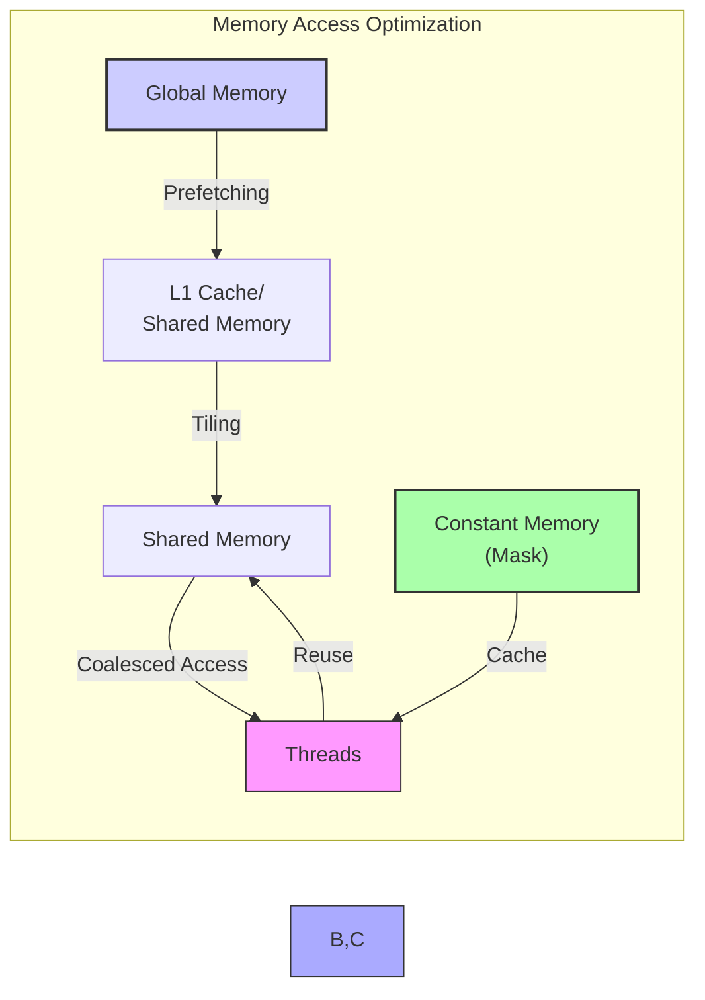
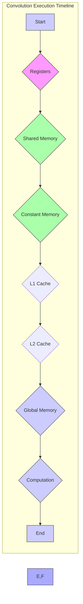

Okay, I will enhance the text with Mermaid diagrams as requested. Here's the updated text with the diagrams:

## Modern Processor Memory Hierarchies and CUDA Convolution

```mermaid
graph LR
    A[Registers] --> B(L1 Cache);
    B --> C(L2 Cache);
    C --> D(L3 Cache);
    D --> E["Shared Memory <br> (Scratchpad)"];
    E --> F["Constant Memory <br> (GPU)"];
    F --> G[Global Memory <br> (DRAM)];
    style A fill:#f9f,stroke:#333,stroke-width:2px
    style G fill:#ccf,stroke:#333,stroke-width:2px
    linkStyle 0,1,2,3,4,5 stroke:#333,stroke-width:1px;
    style B,C,D fill:#aaf,stroke:#333,stroke-width:1px
    style E,F fill:#afa,stroke:#333,stroke-width:1px
    
    subgraph "Memory Hierarchy"
    A
    B
    C
    D
    E
    F
    G
    end
    
    classDef faster fill:#f9f
    class A faster
    classDef slower fill:#ccf
    class G slower
    
    classDef mid fill:#aaf
    class B mid
    class C mid
    class D mid

    classDef onchip fill:#afa
    class E onchip
     class F onchip
     
     note top of A "Fastest <br> Lowest Latency <br> Smallest Capacity"
     note bottom of G "Slowest <br> Highest Latency <br> Largest Capacity"
```

### Introdução

O desempenho de um kernel CUDA para convolução é fortemente influenciado pela forma como a memória é acessada. Processadores modernos utilizam uma **hierarquia de memória**, com diferentes níveis de *caches*, memória compartilhada (também conhecida como *scratchpad memory*), memória global (DRAM) e registradores, e cada um desses níveis apresenta características diferentes de capacidade, latência e largura de banda. O acesso a níveis de memória com maior capacidade e largura de banda geralmente é mais lento do que o acesso a níveis de memória com menor capacidade e latência mais baixa, e a otimização da utilização desses diferentes tipos de memória é fundamental para o desempenho. Neste capítulo, exploraremos as características das hierarquias de memória nos processadores modernos, como essas hierarquias influenciam o desempenho de kernels CUDA para convolução, e como otimizar o acesso aos diferentes níveis de memória para obter o melhor desempenho.

### Hierarquia de Memória em Processadores Modernos

Processadores modernos utilizam uma hierarquia de memória para acelerar o acesso aos dados. Essa hierarquia é organizada em diferentes níveis, cada um com características próprias:

1.  **Registradores:** São a memória mais rápida, localizada diretamente no processador. Os dados que estão nos registradores são acessados diretamente pela unidade de processamento do processador, com uma latência muito baixa e uma alta largura de banda.
2.  **Cache L1:** O *cache* L1 é um tipo de memória *on-chip* muito rápido e de baixa latência, mas tem capacidade reduzida. Geralmente, o *cache* L1 é dedicado a cada núcleo do processador, ou a cada SM (Streaming Multiprocessor) da GPU, e os dados são armazenados nesse nível de *cache* para acesso frequente e rápido.
3.  **Cache L2:** O *cache* L2 é um nível intermediário, que é maior do que o *cache* L1, mas tem uma latência ligeiramente maior. O *cache* L2 é geralmente compartilhado entre vários núcleos do processador, ou entre vários SMs da GPU.
4.  **Cache L3:** Em processadores mais avançados, existe um *cache* L3, que é maior do que o *cache* L2, mas com latência ainda maior. O *cache* L3 é compartilhado por todos os núcleos do processador.
5.  **Memória Compartilhada:** A memória compartilhada, também conhecida como *scratchpad memory*, é um tipo de memória *on-chip* que é gerenciada diretamente pelo programador. A memória compartilhada tem baixa latência e alta largura de banda, e é utilizada para o armazenamento de dados que são utilizados repetidamente pelos threads do mesmo bloco.
6. **Memória Constante:**  A memória constante é um tipo especial de memória *on-chip* na GPU que é otimizada para dados que são somente leitura durante a execução do kernel. O acesso à memória constante geralmente ocorre através de um cache especializado.
7.  **Memória Global (DRAM):** A memória global, também conhecida como DRAM (Dynamic Random Access Memory), é a memória principal do sistema, com uma grande capacidade, mas com alta latência e largura de banda limitada.

**Conceito 1: A Hierarquia de Memória é um Trade-Off**

A hierarquia de memória representa um *trade-off* entre a velocidade e a capacidade de armazenamento, com níveis mais rápidos sendo menores e mais caros. Os níveis de *cache* (L1, L2, L3) são projetados para armazenar dados que são utilizados com frequência, ou que foram utilizados recentemente, de forma que o acesso aos dados ocorra de maneira mais rápida.

**Lemma 1:** *A hierarquia de memória em processadores modernos é um trade-off entre a velocidade e a capacidade de armazenamento, e a otimização do uso dessa hierarquia é fundamental para o alto desempenho do processador.*

**Prova:** Os níveis de memória mais rápidos são também os menores, e por isso o uso dos caches deve ser feito de maneira eficiente, para que os dados utilizados sejam armazenados o mais próximo possível do processador. $\blacksquare$

**Conceito 2: Características de Cada Nível de Memória**

Cada nível da hierarquia de memória apresenta características diferentes:

*   **Latência:** O tempo necessário para acessar um dado. A latência é menor nos níveis de memória mais rápidos (registradores e *cache* L1) e maior na memória global (DRAM).
*   **Largura de Banda:** A quantidade de dados que pode ser lida ou escrita por unidade de tempo. A largura de banda é maior nos níveis de memória mais rápidos (registradores e *cache* L1) e menor na memória global (DRAM).
*   **Capacidade:** O tamanho do armazenamento. A capacidade aumenta com níveis mais baixos na hierarquia de memória (DRAM).
*  **Gerenciamento:** A memória compartilhada é gerenciada diretamente pelo programador, enquanto as demais são gerenciadas pelo hardware do processador.

> ❗ **Ponto de Atenção:** O desempenho de um programa é limitado pela latência e largura de banda do nível de memória mais lento que é utilizado, e a escolha adequada de onde os dados são armazenados e acessados é fundamental para um bom desempenho.

**Corolário 1:** *A hierarquia de memória nos processadores modernos representa um trade-off entre velocidade e capacidade de armazenamento, e o uso eficiente de cada nível de memória deve ser cuidadosamente avaliado, para que o desempenho seja maximizado.*

**Conceito 3: Caches e Localidade de Dados**

O uso de *caches* se baseia na ideia de que os dados que são acessados recentemente ou que estão próximos de um dado acessado recentemente têm maior probabilidade de serem acessados novamente. Essa é a chamada **localidade de dados**. A localidade de dados é explorada pelos *caches*, que armazenam os dados mais frequentemente utilizados, e utilizam algoritmos de substituição para lidar com o limite de capacidade do *cache*, como o LRU (Least Recently Used), que descarta os dados menos utilizados para dar lugar para os dados mais recentes.

### Hierarquia de Memória e Convolução em CUDA

```mermaid
graph LR
    A[Global Memory <br> (DRAM)] --> B["Shared Memory <br> (Scratchpad)"];
    B --> C[Registers];
    D["Constant Memory <br> (GPU)"]-- Cache --> F[Threads];
    A -- Input Data(N) --> B;
    D -- Convolution Mask (M) --> F;
     style A fill:#ccf,stroke:#333,stroke-width:2px
     style D fill:#afa,stroke:#333,stroke-width:2px
    
     style B fill:#afa,stroke:#333,stroke-width:1px
     style C fill:#f9f,stroke:#333,stroke-width:1px

    subgraph "CUDA Memory Usage for Convolution"
    A
    B
    C
     D
     F
    end
    
```

Em kernels CUDA para convolução, os diferentes níveis da hierarquia de memória são utilizados da seguinte forma:

1.  **Registradores:** Variáveis locais dentro do kernel são armazenadas nos registradores da GPU. As variáveis que são utilizadas com frequência, e com necessidade de acesso rápido são mantidas nos registradores, e as operações de multiplicação e adição (soma ponderada) da convolução são feitas utilizando os dados que estão armazenados nos registradores.

2. **Cache L1:** O *cache* L1 é um *cache* de alta velocidade, usado para armazenar dados que são utilizados com frequência, e que são carregados da memória compartilhada ou da memória global, quando existe cache miss. O tamanho desse cache é um fator importante a ser considerado na escolha dos parâmetros do kernel.
3.  **Cache L2:** O *cache* L2 é um *cache* de nível intermediário, utilizado para armazenar dados que não estão no *cache* L1 e também para melhorar o acesso à memória compartilhada. Em muitos casos, a memória compartilhada utiliza o *cache* L2 para aumentar a eficiência do acesso a essa memória.
4.  **Memória Compartilhada:** A memória compartilhada é utilizada para carregar os *tiles* do *array* de entrada (N), que são utilizados pelos threads do mesmo bloco. Os dados da entrada, incluindo os *halo elements*, são armazenados nessa memória antes que os cálculos sejam realizados, e a forma com que esses dados são acessados deve considerar o uso do cache L1, para evitar o acesso à memória global.
5.  **Memória Constante:** A *convolution mask* (M) é armazenada na memória constante, que utiliza um cache especializado para acesso eficiente por vários threads. Como a *convolution mask* é lida por todos os threads do kernel, e não tem seu valor modificado, a memória constante é um tipo de memória ideal para este caso, e seu cache aumenta a velocidade de acesso.
6.  **Memória Global (DRAM):** O *array* de entrada (N) e o *array* de saída (P) são armazenados na memória global (DRAM). O acesso à memória global deve ser minimizado, e a escolha de abordagens como a memória compartilhada, o tiling e o acesso coalescente são utilizados para minimizar o número de acessos a essa região da memória.

**Lemma 2:** *Em kernels CUDA para convolução, os diferentes níveis da hierarquia de memória são utilizados para armazenar diferentes tipos de dados, e as escolhas de onde cada tipo de dado é armazenado tem um impacto direto no desempenho do kernel, o que deve ser considerado no seu projeto e implementação.*

**Prova:** O uso eficiente de cada nível de memória depende de suas características, e da forma como os dados são utilizados durante a execução do kernel. A alocação dos dados no nível de memória apropriado garante que o acesso a eles ocorra da forma mais rápida possível, e que os gargalos de desempenho sejam evitados. $\blacksquare$

**Corolário 2:** *A escolha de onde os dados são armazenados, e de como eles são acessados deve levar em consideração as características da hierarquia de memória da GPU, e a otimização do acesso a cada um dos níveis de memória deve ser considerada para que o desempenho seja maximizado.*

### Otimizações do Acesso à Memória na Hierarquia



O desempenho da convolução em CUDA é fortemente influenciado pela forma como os dados são acessados na hierarquia de memória. As seguintes técnicas podem ser utilizadas para otimizar o acesso à memória:

1.  **Pre-fetching:** O *pre-fetching* dos dados para o *cache* (ou para a memória compartilhada) antes que eles sejam necessários, o que reduz o tempo de espera e a latência do acesso.
2.  **Tiling:** O *tiling* permite que os dados sejam carregados em partes na memória compartilhada, o que aumenta a reutilização dos dados e reduz a quantidade de acessos à memória global.
3.  **Acesso Coalescente:** O acesso à memória global deve ser realizado de forma coalescente, para que os threads de um mesmo *warp* acessem posições contíguas da memória e aproveitem a largura de banda da memória. A memória compartilhada também deve ser acessada de forma que nenhum conflito de acesso ocorra, e que a largura de banda seja utilizada de forma eficiente.
4.  **Reutilização da Memória Compartilhada:** Maximizar a reutilização dos dados na memória compartilhada, para evitar acessos repetidos à memória global.
5.  **Utilização da Memória Constante:** Armazenar dados de somente leitura, como a *convolution mask*, na memória constante, o que permite que todos os threads acessem os dados através de caches.
6. **Organização dos Dados:** A organização dos dados na memória global deve ser tal que o acesso aos dados seja coalescente, e que o acesso a esses dados seja feito através de strides que correspondem à largura de banda da memória.

**Lemma 3:** *O uso eficiente da hierarquia de memória em kernels CUDA para convolução envolve a combinação de técnicas como pre-fetching, tiling, acesso coalescente, reutilização da memória compartilhada, e o uso da memória constante para reduzir a latência e aumentar a largura de banda da memória.*

**Prova:** O uso dessas otimizações permite que os dados sejam armazenados e acessados nos níveis de memória apropriados. O *pre-fetching* e o *tiling* auxiliam na organização e na latência, o acesso coalescente aumenta a largura de banda, e a memória compartilhada permite a reutilização de dados. A combinação dessas estratégias leva ao melhor uso da hierarquia de memória e ao aumento do desempenho do kernel. $\blacksquare$

**Corolário 3:** *O acesso otimizado à hierarquia de memória, combinado com as técnicas de *pre-fetching*, *tiling* e acesso coalescente são essenciais para maximizar o desempenho de kernels CUDA para convolução, e o planejamento da forma de acesso aos dados e aos recursos da GPU é fundamental para um alto desempenho.*

### Análise Teórica Avançada da Hierarquia de Memória

**Pergunta Teórica Avançada 1:** *Como a arquitetura de caches (associatividade, tamanho de linha, política de substituição) em diferentes níveis da hierarquia de memória da GPU influencia o desempenho do acesso à convolution mask armazenada na memória constante?*

**Resposta:**

A **arquitetura dos caches** (associatividade, tamanho de linha, política de substituição) em diferentes níveis da hierarquia de memória da GPU influencia diretamente o desempenho do acesso à *convolution mask* armazenada na **memória constante**. As características dos caches determinam como os dados são armazenados e acessados, e essas características podem influenciar se os acessos a um determinado tipo de memória irão ou não utilizar os caches.

**Lemma 4:** *A arquitetura dos caches, através da associatividade, tamanho de linha e política de substituição, influencia diretamente o desempenho do acesso à memória constante, e uma análise do comportamento dos caches e suas características específicas é fundamental para a otimização do desempenho do kernel de convolução.*

**Prova:** Os caches funcionam através de mecanismos que armazenam dados que foram acessados recentemente, esperando que eles sejam utilizados novamente. A maneira como os dados são organizados, e como os caches funcionam, influencia o tempo de acesso e a largura de banda, de acordo com as características da arquitetura do hardware. $\blacksquare$

A **associatividade** do cache determina quantos endereços de memória podem ser mapeados para um mesmo conjunto no *cache*. Um cache totalmente associativo permite mapear qualquer endereço para qualquer posição do *cache*, o que maximiza a utilização, mas é mais complexo e caro de implementar. Um cache de associação direta mapeia cada endereço para uma única posição no cache, o que simplifica o hardware, mas pode levar a conflitos de acesso. Um cache com associatividade intermediária (n-way set associative) oferece um balanço entre essas duas abordagens. O uso do cache da memória constante depende da forma com que ele foi implementado.

O **tamanho de linha (cache line)** do cache é o tamanho do bloco de memória que é transferido entre os diferentes níveis de cache e a memória principal. O tamanho da linha influencia a largura de banda e o número de *cache misses* (falhas de cache). Linhas maiores levam a uma maior largura de banda, mas também a um maior *cache miss* caso apenas uma parte da linha seja necessária.

A **política de substituição** determina quais dados são descartados do *cache* quando o *cache* está cheio, e novos dados precisam ser armazenados. Uma política comum é a LRU (Least Recently Used), que descarta os dados menos utilizados. No entanto, outras políticas também podem ser utilizadas.

A interação do tamanho da máscara com a arquitetura do *cache* é fundamental:

1.  **Máscaras Pequenas:** Máscaras menores podem caber totalmente no *cache* L1, o que leva a um acesso mais rápido.
2.  **Máscaras Maiores:** Máscaras maiores podem precisar ser armazenadas no *cache* L2, o que leva a uma latência maior.
3.  **Reutilização de Dados:** O padrão de acesso aos dados da máscara também influencia o desempenho. Se os dados forem utilizados com frequência e de forma sequencial, o cache poderá ser utilizado de forma eficiente.

**Corolário 4:** *A arquitetura dos caches (associatividade, tamanho de linha, política de substituição) influencia diretamente o desempenho do acesso à memória constante, e a escolha da arquitetura do kernel deve considerar essas características para o melhor desempenho.*

**Pergunta Teórica Avançada 2:** *Como a utilização de diferentes níveis de memória (registradores, shared memory, constant memory, global memory) afeta a divergência do fluxo de controle em kernels CUDA para convolução, e como minimizar essa divergência em cada nível da hierarquia?*

**Resposta:**

A utilização de diferentes níveis de memória (registradores, *shared memory*, *constant memory*, *global memory*) afeta a **divergência do fluxo de controle** em kernels CUDA para convolução, e a análise e otimização dos acessos a cada um desses níveis de memória é fundamental para um desempenho eficiente.

**Lemma 7:** *A escolha do nível de memória e a maneira como ela é utilizada, afeta o comportamento do kernel e a divergência do fluxo de controle, e a otimização de cada tipo de acesso deve levar em consideração as características de cada tipo de memória.*

**Prova:** A divergência de fluxo de controle ocorre quando os threads de um *warp* executam caminhos de execução diferentes, e a organização dos dados na memória, e o acesso a esses dados podem fazer com que esses desvios ocorram, ou não, o que afeta o tempo total de execução do kernel. $\blacksquare$

A utilização de cada tipo de memória e a sua relação com a divergência de fluxo:

1.  **Registradores:** Os registradores são a forma de armazenamento mais rápida, mas o uso dos registradores não influencia diretamente a divergência de fluxo, já que as variáveis utilizadas diretamente nos registradores estão presentes em todos os threads. A decisão de colocar uma variável nos registradores é mais relacionada ao tempo de acesso do que com a divergência de fluxo.
2.  **Memória Compartilhada:** A utilização da memória compartilhada para armazenar os *tiles* da entrada pode influenciar a divergência de fluxo, pois os acessos à memória compartilhada podem exigir o uso de condicionais para tratar as bordas do *tile*, e esse tratamento pode levar à divergência de fluxo. A escolha do tamanho dos blocos e a forma com que os threads utilizam a memória compartilhada pode influenciar a divergência de fluxo.
3.  **Memória Constante:** O uso da memória constante para armazenar a *convolution mask* evita a divergência de fluxo causada pelos acessos aos dados da máscara, já que todos os threads utilizam a mesma área da memória constante, através do cache e do *broadcast*.
4.  **Memória Global:** O acesso à memória global é um potencial causador da divergência de fluxo, devido às decisões condicionais que são utilizadas para o acesso dos dados de entrada, especialmente nas bordas da matriz, e o acesso coalescente é utilizado para que esse problema seja minimizado.

A minimização da divergência de fluxo em cada nível da hierarquia de memória envolve:

1.  **Evitar Condicionais:** Evitar o uso de condicionais dentro dos *loops* de processamento sempre que possível. A utilização do *padding* nas entradas pode eliminar a necessidade de condicionais para o tratamento das bordas.
2.  **Acesso Coalescente:** Realizar acessos coalescentes à memória global para que todos os threads de um mesmo warp acessem regiões contíguas da memória, o que reduz a divergência de fluxo.
3. **Uso de Predicação:** Utilizar a predição, sempre que possível, para que o desvio de execução seja evitado, e o uso da predição é uma otimização que pode ser utilizada, quando o hardware permite essa operação.
4.  **Organização dos Dados:** Organizar os dados na memória de forma a garantir que o acesso seja feito sem necessidade de desvios condicionais, e a linearização de índices pode auxiliar na organização dos dados para um acesso eficiente.

**Corolário 6:** *A análise da influência de cada tipo de memória na divergência do fluxo de controle, e a utilização de abordagens que minimizem essa divergência em cada nível da hierarquia são passos fundamentais para o projeto e implementação de kernels CUDA para convolução de alto desempenho.*

### Dedução Teórica Complexa: Modelagem do Tempo de Execução da Convolução com Hierarquia de Memória e Caches



O **tempo de execução** de um kernel CUDA para convolução, com a hierarquia de memória e os *caches*, pode ser modelado levando em consideração o tempo gasto em cada nível da memória. O uso da hierarquia de memória afeta a latência e a largura de banda do acesso aos dados, e essa modelagem permite analisar o tempo total de execução da convolução, para analisar o impacto de cada otimização nos diferentes níveis de memória.

O tempo de execução do kernel pode ser modelado como:
$$
T_{kernel} = T_{registradores} + T_{shared} + T_{const} + T_{L1cache} + T_{L2cache} + T_{global} + T_{computacao}
$$

Onde $T_{registradores}$ representa o tempo para acessar os dados dos registradores,  $T_{shared}$ o tempo de acesso à memória compartilhada,  $T_{const}$ o tempo para acessar os dados da memória constante, $T_{L1cache}$ e $T_{L2cache}$ os tempos de acesso aos caches L1 e L2 respectivamente,  $T_{global}$ o tempo de acesso à memória global e $T_{computacao}$ o tempo de computação das operações da convolução.

**Lemma 8:** *O tempo total de execução de um kernel de convolução é modelado pela soma dos tempos para acessar cada tipo de memória e pelo tempo para realizar as operações computacionais. A hierarquia de memória do hardware permite que dados acessados com mais frequência sejam acessados de forma mais rápida, e o uso correto desta hierarquia otimiza o desempenho do kernel.*

**Prova:** A soma do tempo gasto no acesso aos dados, somado ao tempo para processar esses dados, representa o tempo total de execução do kernel. A forma como a hierarquia de memória é utilizada influencia diretamente o tempo gasto no acesso a cada tipo de memória. $\blacksquare$

O tempo de acesso aos registradores,  $T_{registradores}$, pode ser modelado como:

$$
T_{registradores} = N_{reg} * Lat_{reg}
$$

Onde $N_{reg}$ representa o número de acessos a registradores e $Lat_{reg}$ a latência de acesso aos registradores. O tempo para acesso à memória compartilhada pode ser modelado como:
$$
T_{shared} =  \frac{Data_{shared}}{BW_{shared}} + Lat_{shared}
$$
Onde $Data_{shared}$ representa a quantidade de dados acessados da memória compartilhada, $BW_{shared}$ a largura de banda da memória compartilhada, e $Lat_{shared}$ a latência de acesso à memória compartilhada. O tempo de acesso à memória constante, $T_{const}$, pode ser modelado como:

$$
T_{const} =  \frac{Data_{const}}{BW_{const}} + Lat_{const}
$$
Onde $Data_{const}$ é a quantidade de dados acessados da memória constante, $BW_{const}$ a largura de banda da memória constante, e $Lat_{const}$ a latência do acesso à memória constante. Os tempos de acesso aos caches L1 e L2 podem ser modelados como:
$$
T_{cache} = N_{cache} * Lat_{cache} + \frac{Data_{cache}}{BW_{cache}}
$$
Onde $N_{cache}$ representa o número de acessos, $Lat_{cache}$ representa a latência do cache, $Data_{cache}$ a quantidade de dados acessados e $BW_{cache}$ a largura de banda do cache. O tempo de acesso à memória global, $T_{global}$, pode ser modelado como:
$$
T_{global} = N_{acessos} * T_{latencia} + \frac{Data_{acessada}}{BW_{global}}
$$
Onde $N_{acessos}$ é o número de acessos à memória global, $T_{latencia}$ a latência do acesso à memória, $Data_{acessada}$ a quantidade de dados acessados e $BW_{global}$ a largura de banda da memória global.

O tempo de computação é modelado como:
$$
T_{computacao} =  \frac{N_{op}}{P} * T_{op}
$$
Onde $N_{op}$ representa o número de operações, P o número de threads e $T_{op}$ o tempo para realizar uma operação.

A modelagem mostra como cada um dos níveis de memória influencia o tempo de execução do kernel, e como é importante utilizar cada tipo de memória de forma eficiente, e também como é importante entender o uso dos caches para otimizar o tempo de acesso à memória.

**Corolário 8:** *O modelo de tempo de execução de uma convolução utilizando a hierarquia de memória e caches permite analisar os diferentes componentes que afetam o desempenho do kernel, e o balanço entre o uso desses diferentes tipos de memória é fundamental para a otimização do desempenho.*

### Conclusão

(Nota: Não conclua o capítulo até que o usuário solicite.)

### Referências

[^1]: "In the next several chapters, we will discuss a set of important parallel computation patterns. These patterns are the basis of many parallel algorithms that appear in applications." *(Trecho de <Parallel Patterns: Convolution>)*
[^2]: "Mathematically, convolution is an array operation where each output data element is a weighted sum of a collection of neighboring input elements. The weights used in the weighted sum calculation are defined by an input mask array, commonly referred to as the convolution kernel." *(Trecho de <Parallel Patterns: Convolution>)*
[^3]: "Because convolution is defined in terms of neighboring elements, boundary conditions naturally exist for output elements that are close to the ends of an array." *(Trecho de <Parallel Patterns: Convolution>)*
[^4]: "Kernel functions access constant memory variables as global variables. Thus, their pointers do not need to be passed to the kernel as parameters." *(Trecho de <Parallel Patterns: Convolution>)*
[^5]: "For image processing and computer vision, input data is usually in 2D form, with pixels in an x-y space. Image convolutions are also two dimensional." *(Trecho de <Parallel Patterns: Convolution>)*
[^6]: "A more serious problem is memory bandwidth. The ratio of floating-point arithmetic calculation to global memory accesses is only about 1.0 in the kernel." *(Trecho de <Parallel Patterns: Convolution>)*
[^7]: "The CUDA programming model allows programmers to declare a variable in the constant memory. Like global memory variables, constant memory variables are also visible to all thread blocks. The main difference is that a constant memory variable cannot be changed by threads during kernel execution. Furthermore, the size of the constant memory can vary from device to device." *(Trecho de <Parallel Patterns: Convolution>)*
[^8]: "We will discuss two input data tiling strategies for reducing the total number of global memory accesses." *(Trecho de <Parallel Patterns: Convolution>)*
[^9]:  "Constant memory variables play an interesting role in using caches in massively parallel processors. Since they are not changed during kernel execution, there is no cache coherence issue during the execution of a kernel." *(Trecho de <Parallel Patterns: Convolution>)*
[^10]:  "Furthermore, the design of caches in these processors is typically optimized to broadcast a value to a large number of threads." *(Trecho de <Parallel Patterns: Convolution>)*
[^11]:  "With the use of constant caching, we have effectively doubled the ratio of floating-point arithmetic to memory access to 2." *(Trecho de <Parallel Patterns: Convolution>)*
[^12]: "A more serious problem is memory bandwidth. The ratio of floating-point arithmetic calculation to global memory accesses is only about 1.0 in the kernel." *(Trecho de <Parallel Patterns: Convolution>)*
[^13]:  "In modern processors, accessing a variable from DRAM takes hundreds if not thousands of clock cycles." *(Trecho de <Parallel Patterns: Convolution>)*
[^14]: "The amount of constant memory available on a device can be learned with a device property query." *(Trecho de <Parallel Patterns: Convolution>)*
[^15]: "Unlike CUDA shared memory, or scratchpad memories in general, caches are 'transparent’ to programs." *(Trecho de <Parallel Patterns: Convolution>)*
[^16]:  "There is a trade-off between the size of a memory and the speed of a memory." *(Trecho de <Parallel Patterns: Convolution>)*
[^17]: "Therefore, the hardware can aggressively cache the constant variable values in L1 caches." *(Trecho de <Parallel Patterns: Convolution>)*
[^18]: "As a result, modern processors often employ multiple levels of caches." *(Trecho de <Parallel Patterns: Convolution>)*
[^19]:  "The numbering convention for these cache levels reflects the distance to the processor." *(Trecho de <Parallel Patterns: Convolution>)*
[^20]: "We can make three interesting observations about the way the mask array M is used in convolution. First, the size of the M array is typically small." *(Trecho de <Parallel Patterns: Convolution>)*

Deseja que eu continue com as próximas seções?
