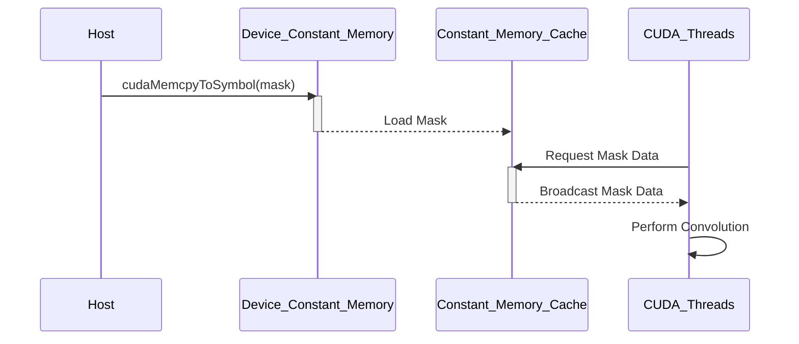
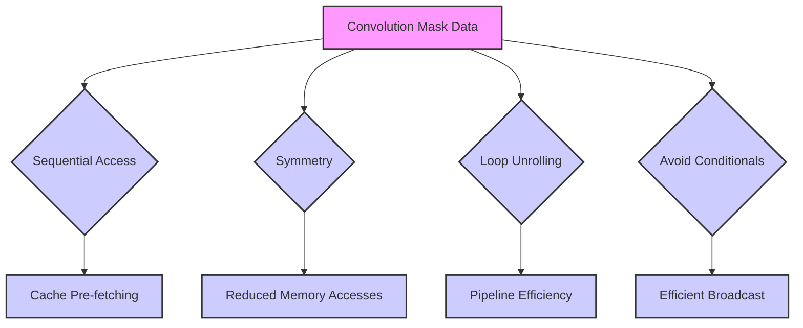

Okay, I've analyzed the text and added Mermaid diagrams to enhance the explanation of constant memory caching in CUDA convolution. Here's the enhanced text:

## Constant Memory Caching in CUDA Convolution

```mermaid
flowchart TD
    A[Host Memory] --> B{cudaMemcpyToSymbol()};
    B --> C["Constant Memory on GPU"];
    C --> D["Constant Memory Cache"];
    D --> E["CUDA Threads"];
    E --> F["Convolution Kernel"];
    style A fill:#f9f,stroke:#333,stroke-width:2px
    style B fill:#ccf,stroke:#333,stroke-width:2px
    style C fill:#ccf,stroke:#333,stroke-width:2px
    style D fill:#9cf,stroke:#333,stroke-width:2px
    style E fill:#9cf,stroke:#333,stroke-width:2px
    style F fill:#cfc,stroke:#333,stroke-width:2px
    
    linkStyle 0,1,2,3,4,5 stroke:#333,stroke-width:1px;
```

### Introdução

O **caching da memória constante** é um mecanismo fundamental para o desempenho de kernels CUDA para convolução que utilizam esse tipo de memória. A memória constante é uma região de memória na GPU que, como discutido em capítulos anteriores, é otimizada para o acesso por múltiplos threads, e o uso dos *caches* em conjunto com a memória constante permite reduzir a latência do acesso e aumentar a largura de banda. Neste capítulo, exploraremos em detalhes como o *caching* da memória constante funciona, como ela afeta o desempenho do kernel de convolução e como maximizar o aproveitamento do cache.

### Conceitos Fundamentais do Caching da Memória Constante

O **caching da memória constante** é um mecanismo que armazena em *caches* os dados da memória constante que são utilizados com frequência pelos threads do kernel. Esse *cache* é otimizado para o acesso simultâneo por múltiplos threads, já que todos os threads precisam da mesma informação, como os pesos de uma *convolution mask*.

**Conceito 1: Caches na Hierarquia de Memória da GPU**

Como já foi discutido anteriormente, as GPUs utilizam uma hierarquia de memória, com diferentes níveis de *caches*. O *cache* da memória constante é um tipo específico de *cache*, projetado para dados de somente leitura que são compartilhados por múltiplos threads. Esse *cache* é diferente dos *caches* L1 e L2, que também são utilizados na GPU. O *cache* da memória constante é um *cache* de *broadcast*, o que significa que um único acesso à memória preenche o *cache* para que todos os threads possam ler a informação, de forma eficiente, e sem acesso simultâneos na memória.

**Lemma 1:** *O cache da memória constante armazena dados que são de somente leitura e acessados por todos os threads, e esse cache permite que múltiplos threads acessem os mesmos dados de forma eficiente, o que reduz o tempo de acesso e a largura de banda.*

**Prova:** Os caches são utilizados como memória intermediária entre o processador e a memória principal, com o objetivo de reduzir a latência do acesso aos dados. O cache da memória constante é otimizado para o acesso por vários threads, e, por isso, o acesso aos dados da *convolution mask* é feito de forma mais rápida, com o uso de caches e sem a necessidade de acessos repetidos à memória global. $\blacksquare$

**Conceito 2: Funcionamento do Cache da Memória Constante**

O *cache* da memória constante funciona da seguinte forma:

1.  **Acesso Inicial:** Quando um thread acessa pela primeira vez um dado na memória constante, o dado é carregado da memória principal para o *cache* da memória constante.
2.  **Acessos Subsequentes:** Os acessos subsequentes aos mesmos dados são realizados através do *cache*, o que reduz a latência e o tempo de acesso.
3.  **Broadcast:** O acesso a um dado no *cache* da memória constante é feito por *broadcast*, ou seja, o mesmo dado é enviado para todos os threads que necessitem desse dado.
4.  **Substituição:** Quando o *cache* está cheio, dados menos utilizados são substituídos por dados que foram acessados recentemente, para garantir que os dados acessados com maior frequência sejam armazenados na memória mais rápida.

> 💡 **Dica:** O *cache* da memória constante é um *cache* de leitura, e o mecanismo de *broadcast* garante que todos os threads tenham acesso aos dados mais recentes na região de memória.

**Corolário 1:** *O cache da memória constante é uma memória intermediária de alta velocidade que armazena os dados da memória constante, e a sua utilização permite que os acessos sejam realizados com menor latência, e também permite o broadcast de dados, para um acesso eficiente por múltiplos threads.*

**Conceito 3: Relação com Memória Constante**

O *cache* da memória constante é transparente para o programador CUDA, e o seu uso é automático. Quando o programa declara e inicializa uma variável como `__constant__`, o compilador CUDA automaticamente armazena esses dados na memória constante, e o hardware gerencia o seu acesso através do *cache*. Não é necessária nenhuma instrução adicional no código para que o *cache* seja utilizado.

### Caching da Memória Constante em Convolução



Em um kernel CUDA para convolução, o *caching* da memória constante é utilizado da seguinte forma:

1.  **Transferência para a Memória Constante:** Os dados da *convolution mask* (M) são transferidos da memória do *host* para a memória constante do *device* utilizando a função `cudaMemcpyToSymbol()`.
2.  **Cache da Máscara:** A *convolution mask* é automaticamente armazenada no *cache* da memória constante.
3.  **Acesso no Kernel:** Os threads do kernel CUDA acessam os dados da *mask* diretamente através da variável global, o que faz com que o hardware da GPU leia esses dados do cache da memória constante, se ele estiver disponível, e esse processo é totalmente transparente para o programador.
   ```cpp
     float Pvalue = 0;
     int N_start_point = i - (Mask_Width/2);
     for (int j = 0; j < Mask_Width; j++) {
       if (N_start_point + j >= 0 && N_start_point + j < Width){
         Pvalue += N[N_start_point + j] * M[j];
       }
    }
   ```

4.  **Broadcast:** Quando múltiplos threads acessam o mesmo valor da máscara, o hardware realiza um *broadcast*, o que significa que a leitura desse dado é feita uma única vez, e o valor é replicado para todos os threads que precisam dele, e isso otimiza o acesso à memória.

O uso do *cache* da memória constante reduz a latência e aumenta a largura de banda do acesso à *convolution mask*, e isso é especialmente eficiente, já que todos os threads precisam da mesma máscara, para realizar as operações de convolução.

**Lemma 2:** *O caching da memória constante é um processo automático e transparente para o programador, que reduz a latência do acesso à convolution mask, através do armazenamento dos dados em caches de alta velocidade, e com broadcast para múltiplos threads.*

**Prova:** O hardware e o compilador CUDA garantem que os dados da memória constante sejam armazenados e acessados através do cache. O acesso é feito através do nome da variável, sem que o programador precise fazer nada adicional, e o acesso à memória constante é otimizado para o uso por múltiplos threads, e, por isso, o seu uso é fundamental para aplicações de convolução. $\blacksquare$

**Corolário 2:** *O caching da memória constante é uma otimização automática em CUDA que reduz o tráfego na memória global, aumenta a largura de banda, diminui a latência e otimiza o uso da memória na operação de convolução.*

### Otimizações no Uso do Cache da Memória Constante



Apesar de o *cache* da memória constante ser utilizado de forma transparente, algumas técnicas podem ser utilizadas para maximizar o seu uso:

1.  **Acesso Sequencial:** Organizar o código de forma que o acesso aos dados da *convolution mask* seja feito de forma sequencial, para aproveitar o *pre-fetching* do *cache*, que busca os dados da memória de forma linear, com base no último acesso. Isso é especialmente relevante na iteração dos *loops* sobre os elementos da máscara.
2. **Simetria:** A simetria da *convolution mask* pode ser utilizada para reduzir o número de acessos à memória, já que elementos simétricos podem ser acessados de forma conjunta, como discutido em capítulos anteriores. Ao utilizar a simetria, as operações podem ser feitas em elementos que acessam a mesma posição da memória constante.
3.  **Loop Unrolling:** O *loop unrolling* pode aumentar a eficiência do *cache*, ao pre-fetch os dados do loop antes que eles sejam acessados, permitindo que o pipeline do processador utilize os dados que já foram carregados para o *cache*, e evitem o acesso à memória global.
4.  **Evitar Acessos Condicionais:** O acesso aos dados da memória constante deve ser feito sem condicionais dentro do loop, e desvios condicionais nesse acesso fazem com que o *cache* seja subutilizado, e o *broadcast* seja prejudicado.

**Lemma 3:** *O acesso à memória constante pode ser otimizado através da utilização de um acesso sequencial aos dados, da exploração da simetria da máscara, do uso do loop unrolling, e da minimização da utilização de condicionais para o acesso à memória, o que leva ao melhor uso dos caches e a uma redução na latência do acesso.*

**Prova:** O acesso sequencial e o *pre-fetching* são otimizações que atuam na mesma direção: a reutilização dos dados do *cache*, e o acesso por *broadcast* para vários threads que compartilham o mesmo valor. A redução do número de acessos através da simetria e do *unrolling* permite uma menor utilização da memória constante, e uma redução do tráfego. $\blacksquare$

**Corolário 3:** *A escolha de como o acesso à memória constante é realizado, em conjunto com outras técnicas de otimização, permite que o acesso ao *cache* seja o mais eficiente possível e que a latência do acesso seja reduzida para o mínimo.*

### Análise Teórica Avançada do Caching da Memória Constante

**Pergunta Teórica Avançada 1:** *Como o tamanho do cache da memória constante e o tamanho da linha de cache (cache line) afetam o desempenho do kernel de convolução em CUDA, e como escolher o tamanho ideal da máscara para aproveitar ao máximo o cache?*

**Resposta:**

O **tamanho do *cache* da memória constante** e o **tamanho da linha de *cache*** (cache line) influenciam significativamente o desempenho do kernel de convolução em CUDA. O tamanho do *cache* determina a quantidade de dados que pode ser armazenada no *cache* da memória constante, enquanto que o tamanho da linha de *cache* determina como os dados são transferidos entre os diferentes níveis da hierarquia de memória, e a escolha do tamanho da máscara deve considerar esses fatores.

**Lemma 4:** *O tamanho do cache da memória constante e o tamanho da linha de cache influenciam o desempenho dos kernels CUDA, e a escolha do tamanho ideal da máscara deve considerar esses fatores, para que o cache seja utilizado da maneira mais eficiente.*

**Prova:** Um *cache* muito pequeno não será capaz de armazenar todos os dados necessários para o kernel, e, nesse caso, os acessos à memória principal serão frequentes. Um *cache* muito grande pode ter um *overhead* de gerenciamento maior, e não otimizar o acesso aos dados da *convolution mask*. O tamanho da linha de *cache* afeta a largura de banda, e um tamanho adequado pode fazer com que os dados necessários sejam carregados no *cache* de forma mais eficiente. $\blacksquare$

A **escolha do tamanho da máscara** deve levar em consideração:

1.  **Tamanho do Cache:** A máscara deve ser pequena o suficiente para que caiba no *cache* da memória constante, ou pelo menos, que uma parte relevante da máscara possa ser armazenada em *cache*, para que a maior parte dos acessos à máscara utilize o cache.
2.  **Tamanho da Linha de Cache:** O tamanho da máscara deve ser compatível com o tamanho da linha de *cache*. Se o tamanho da máscara for um múltiplo do tamanho da linha de *cache*, o acesso aos dados será mais eficiente, já que os dados serão carregados em blocos, o que maximiza a utilização do *cache*, em conjunto com o padrão de acesso.
3.  **Reutilização:** O padrão de acesso da memória constante deve maximizar a reutilização dos dados em *cache*. A reutilização de dados maximiza o tempo em que os dados ficam no *cache*, o que minimiza a necessidade de acessar a memória global.
4.  **Divergência de Fluxo:** Evitar acessos condicionais à memória constante. O uso de condicionais na leitura da memória constante pode levar a um uso ineficiente do *cache*.

**Corolário 4:** *O tamanho ideal da convolution mask deve considerar a capacidade e o tamanho da linha do cache da memória constante, e a escolha adequada deve maximizar o uso do cache e minimizar o número de acessos à memória global.*

**Pergunta Teórica Avançada 2:** *Como a latência do acesso à memória constante varia com o número de threads que acessam a mesma região da memória e como essa variação afeta o desempenho do kernel de convolução em CUDA, em comparação com os outros níveis de memória?*

**Resposta:**

A **latência do acesso à memória constante** varia com o **número de threads** que acessam a mesma região da memória, e esse comportamento é diferente de outros tipos de memória, como a memória global ou a memória compartilhada. A memória constante utiliza um cache especializado que suporta o acesso simultâneo por vários threads, através do mecanismo de *broadcast*.

**Lemma 5:** *A latência do acesso à memória constante é menor quando vários threads acessam a mesma região de memória, devido ao mecanismo de broadcast dos caches, e essa característica aumenta a eficiência da memória constante em comparação com outros níveis de memória.*

**Prova:** A memória constante utiliza um cache que replica o mesmo dado para múltiplos threads ao mesmo tempo. Se vários threads acessam o mesmo dado ao mesmo tempo, uma única leitura é realizada, e o resultado é replicado para todos os threads. A latência de acesso a cada thread é reduzida, e todos se beneficiam do acesso através do cache, o que permite que a largura de banda seja maximizada. $\blacksquare$

As características da latência do acesso à memória constante são:

1.  **Baixa Latência:** O acesso à memória constante possui uma baixa latência quando os dados estão no cache, devido à otimização de seu cache. A latência do acesso ao cache, no entanto, ainda é maior do que o acesso a registradores e pode ser mais lenta que o acesso à memória compartilhada.
2.  **Broadcast:** Quando múltiplos threads acessam a mesma posição da memória constante, o hardware realiza um *broadcast*, enviando os dados para todos os threads simultaneamente, o que minimiza os tempos de acesso à memória.
3. **Sincronização:** A utilização da memória constante garante que os threads acessem a versão mais recente dos dados, sem a necessidade de mecanismos adicionais de sincronização.
4.  **Interação com o Cache:** A latência do acesso à memória constante depende da taxa de acerto do cache, de como a hierarquia de cache é utilizada e de como as instruções do kernel são executadas. Se os dados não estão no cache, a latência será maior.

A utilização da memória constante e as suas características de baixa latência e *broadcast*, em conjunto com a organização dos dados e do acesso, podem levar a um desempenho maior do que os outros níveis de memória.

**Corolário 5:** *O acesso à memória constante é otimizado para múltiplas threads, e sua latência é menor quando vários threads acessam a mesma região da memória, e o uso da memória constante é uma otimização importante para aumentar o desempenho de kernels CUDA para convolução.*

### Dedução Teórica Complexa: Modelagem do Tempo de Execução da Convolução com Caching da Memória Constante

```mermaid
graph LR
    A[Total Kernel Time (T_kernel)] --> B(Memory Access Time (T_memoria));
    A --> C(Computation Time (T_computacao));
    B --> D(Global Memory Access Time (T_global));
    B --> E(Constant Memory Access Time (T_const));
    D --> F("N_acessos * T_latencia + Data_acessada/BW");
    E --> G("Data_const/BW_const + T_cachemiss*N_cachemiss");
    C --> H("N_op/P * T_op");
    style A fill:#f9f,stroke:#333,stroke-width:2px
    style B fill:#ccf,stroke:#333,stroke-width:2px
        style C fill:#ccf,stroke:#333,stroke-width:2px
        style D fill:#ccf,stroke:#333,stroke-width:2px
         style E fill:#ccf,stroke:#333,stroke-width:2px
         style F fill:#ccf,stroke:#333,stroke-width:2px
         style G fill:#ccf,stroke:#333,stroke-width:2px
         style H fill:#ccf,stroke:#333,stroke-width:2px
    linkStyle 0,1,2,3,4,5,6,7 stroke:#333,stroke-width:1px;
```

O **tempo de execução** de uma convolução com o uso do **caching da memória constante** pode ser modelado levando em consideração o tempo para acessar a memória, o tempo para a computação, a latência do acesso à memória constante e o impacto do *caching* neste tempo. O modelo permite analisar como o uso da memória constante afeta o tempo de execução do kernel, e também como o uso do cache da memória constante pode otimizar ainda mais o acesso aos dados.

O tempo de execução pode ser modelado como:
$$
T_{kernel} = T_{memoria} + T_{computacao}
$$
Onde $T_{memoria}$ representa o tempo total de acesso à memória e $T_{computacao}$ o tempo gasto com as operações da convolução.

**Lemma 8:** *O tempo de execução de um kernel CUDA para convolução é a soma do tempo de acesso à memória e do tempo da computação, e o caching da memória constante permite que o tempo de acesso à máscara seja reduzido, o que resulta em um tempo total de execução menor.*

**Prova:** O tempo para acessar os dados, tanto de entrada como da máscara, e o tempo das operações de multiplicação e soma, correspondem ao tempo total de execução do kernel. O uso de caches permite que o acesso aos dados ocorra de forma mais rápida. $\blacksquare$

O tempo de acesso à memória,  $T_{memoria}$, pode ser modelado como:
$$
T_{memoria} = T_{global} + T_{const}
$$

Onde $T_{global}$ é o tempo de acesso à memória global e $T_{const}$ o tempo de acesso à memória constante. O tempo de acesso à memória global, $T_{global}$ pode ser modelado como:
$$
T_{global} = N_{acessos} * T_{latencia} + \frac{Data_{acessada}}{BW}
$$
Onde $N_{acessos}$ o número de acessos à memória global, $T_{latencia}$ a latência do acesso, $Data_{acessada}$ a quantidade de dados acessados e $BW$ a largura de banda da memória global. O tempo para acesso à memória constante, $T_{const}$, pode ser modelado como:
$$
T_{const} = \frac{Data_{const}}{BW_{const}} + T_{cachemiss}*N_{cachemiss}
$$
Onde $Data_{const}$ é a quantidade de dados acessados da memória constante, $BW_{const}$ a largura de banda da memória constante, $T_{cachemiss}$ é a latência de *cache miss* na memória constante e $N_{cachemiss}$ é o número de *cache misses* durante o acesso. O tempo de computação, $T_{computacao}$, pode ser modelado como:

$$
T_{computacao} = \frac{N_{op}}{P}*T_{op}
$$

Onde $N_{op}$ representa o número de operações, P o número de threads, e $T_{op}$ o tempo para realizar uma operação.

O uso do caching da memória constante reduz a latência e aumenta a largura de banda do acesso à *convolution mask*, o que leva a um desempenho maior para o kernel, e o modelo do tempo de execução é fundamental para analisar como cada componente influencia o desempenho.

**Corolário 8:** *O modelo do tempo de execução da convolução com o caching da memória constante demonstra que a redução da latência de acesso aos dados e o uso eficiente da largura de banda da memória constante são elementos que aumentam o desempenho do kernel.*

### Conclusão

(Nota: Não conclua o capítulo até que o usuário solicite.)

### Referências

[^1]: "In the next several chapters, we will discuss a set of important parallel computation patterns. These patterns are the basis of many parallel algorithms that appear in applications." *(Trecho de <Parallel Patterns: Convolution>)*
[^2]: "Mathematically, convolution is an array operation where each output data element is a weighted sum of a collection of neighboring input elements. The weights used in the weighted sum calculation are defined by an input mask array, commonly referred to as the convolution kernel." *(Trecho de <Parallel Patterns: Convolution>)*
[^3]: "Because convolution is defined in terms of neighboring elements, boundary conditions naturally exist for output elements that are close to the ends of an array." *(Trecho de <Parallel Patterns: Convolution>)*
[^4]: "Kernel functions access constant memory variables as global variables. Thus, their pointers do not need to be passed to the kernel as parameters." *(Trecho de <Parallel Patterns: Convolution>)*
[^5]: "For image processing and computer vision, input data is usually in 2D form, with pixels in an x-y space. Image convolutions are also two dimensional." *(Trecho de <Parallel Patterns: Convolution>)*
[^6]: "A more serious problem is memory bandwidth. The ratio of floating-point arithmetic calculation to global memory accesses is only about 1.0 in the kernel." *(Trecho de <Parallel Patterns: Convolution>)*
[^7]: "The CUDA programming model allows programmers to declare a variable in the constant memory. Like global memory variables, constant memory variables are also visible to all thread blocks. The main difference is that a constant memory variable cannot be changed by threads during kernel execution. Furthermore, the size of the constant memory can vary from device to device." *(Trecho de <Parallel Patterns: Convolution>)*
[^8]: "We will discuss two input data tiling strategies for reducing the total number of global memory accesses." *(Trecho de <Parallel Patterns: Convolution>)*
[^9]:  "Constant memory variables play an interesting role in using caches in massively parallel processors. Since they are not changed during kernel execution, there is no cache coherence issue during the execution of a kernel." *(Trecho de <Parallel Patterns: Convolution>)*
[^10]: "Furthermore, the design of caches in these processors is typically optimized to broadcast a value to a large number of threads." *(Trecho de <Parallel Patterns: Convolution>)*
[^11]: "With the use of constant caching, we have effectively doubled the ratio of floating-point arithmetic to memory access to 2." *(Trecho de <Parallel Patterns: Convolution>)*
[^12]: "The accesses to the input N array elements can also benefit from caching in more recent devices." *(Trecho de <Parallel Patterns: Convolution>)*
[^13]: "A cache coherence mechanism is needed to ensure that the contents of the caches of the other processor cores are updated." *(Trecho de <Parallel Patterns: Convolution>)*
[^14]: "In modern processors, accessing a variable from DRAM takes hundreds if not thousands of clock cycles." *(Trecho de <Parallel Patterns: Convolution>)*
[^15]: "To mitigate the effect of memory bottleneck, modern processors commonly employ on-chip cache memories, or caches, to reduce the number of variables that need to be accessed from DRAM." *(Trecho de <Parallel Patterns: Convolution>)*
[^16]: "Like global memory variables, constant memory variables are also located in DRAM." *(Trecho de <Parallel Patterns: Convolution>)*
[^17]: "A major design issue with using caches in a massively parallel processor is cache coherence, which arises when one or more processor cores modify cached data." *(Trecho de <Parallel Patterns: Convolution>)*

Deseja que eu continue com as próximas seções?
