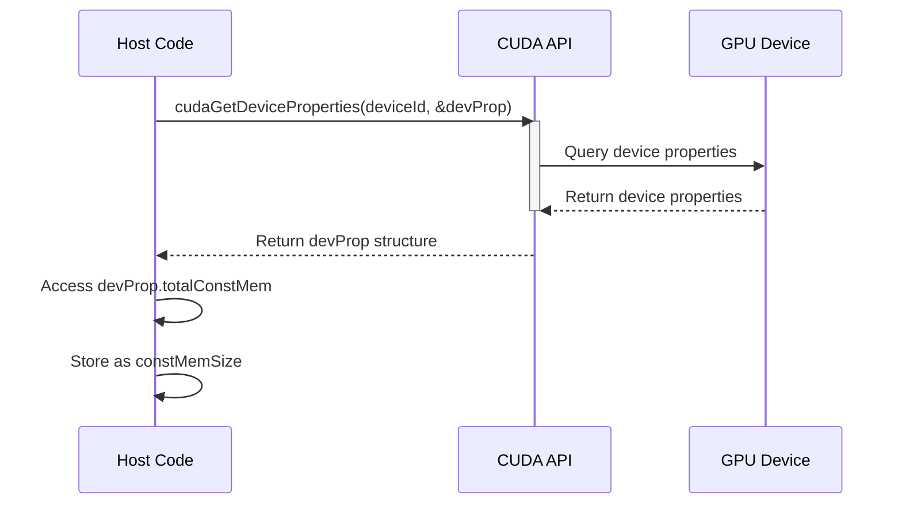
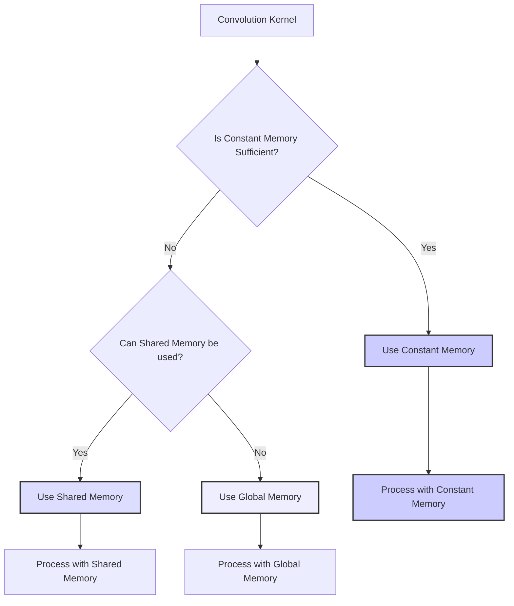
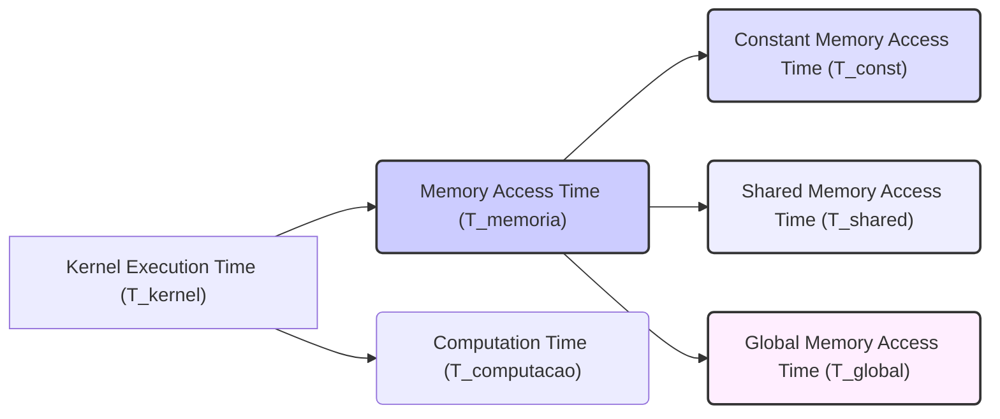

Okay, I will enhance the text by adding Mermaid diagrams as requested.

## Constant Memory Size Variation in CUDA

```mermaid
flowchart LR
    A["CUDA Program"] --> B("Host (CPU)");
    B --> C("cudaGetDeviceProperties()");
    C --> D("GPU Device Properties");
    D --> E("totalConstMem");
    E --> F["Constant Memory Size"];
    F --> G("Host Logic");
    G --> H("Kernel");
    H --> I["Constant Memory"];
    style D fill:#f9f,stroke:#333,stroke-width:2px
    style E fill:#ccf,stroke:#333,stroke-width:2px
    style I fill:#ccf,stroke:#333,stroke-width:2px
```



### Introdução

O **tamanho da memória constante** em GPUs CUDA não é fixo, e pode variar entre diferentes arquiteturas e modelos de GPUs. Essa variação é uma característica do hardware, e os programas CUDA devem ser capazes de lidar com essas diferenças de tamanho. Um código que funciona em uma GPU com um certo tamanho de memória constante pode não funcionar em outras GPUs com um limite diferente. Neste capítulo, exploraremos como o tamanho da memória constante varia entre GPUs, como descobrir o tamanho disponível para uma GPU específica e como escrever código CUDA que seja adaptável a essa variação.

### Variação do Tamanho da Memória Constante

O tamanho da **memória constante** é uma característica do hardware da GPU, e varia entre diferentes modelos e arquiteturas de GPUs [^7]. Algumas GPUs podem ter uma memória constante pequena, enquanto outras podem ter uma memória constante maior. Essa variação é um fator importante a ser considerado ao escrever código CUDA, especialmente quando a memória constante é usada para armazenar dados como a *convolution mask* em kernels de convolução.

**Conceito 1: O Tamanho da Memória Constante é Dependente do Hardware**

O tamanho da memória constante é uma característica da arquitetura da GPU, e não é um parâmetro que possa ser modificado no código do kernel. Cada modelo de GPU tem um tamanho específico para a memória constante, e esse tamanho é definido pelo fabricante da GPU.

**Lemma 1:** *O tamanho da memória constante varia entre diferentes GPUs, e essa característica é dependente do hardware, e não pode ser modificada no código do kernel.*

**Prova:** O tamanho da memória constante é uma característica da arquitetura física da GPU, e, como tal, depende do hardware específico, e o programador não tem a capacidade de alterar essa característica. $\blacksquare$

**Conceito 2: Implicações da Variação do Tamanho da Memória Constante**

A variação do tamanho da memória constante implica que:

1.  **O Código Pode Não Ser Portável:** Um código que utiliza memória constante e que funciona em uma GPU, pode não funcionar em outra que tenha um limite menor. O código deve ser adaptável para diferentes tamanhos da memória constante.
2.  **Escolha da Arquitetura:** A escolha da GPU para rodar uma aplicação deve considerar o tamanho da memória constante disponível, e, dependendo da aplicação, o tamanho da memória constante pode ser um fator limitante.
3.  **Otimizações:** O programador pode precisar utilizar abordagens alternativas para lidar com dados que não caibam na memória constante.
4. **Código Adaptável:** O código deve verificar o tamanho da memória constante disponível, para que o kernel possa ser utilizado em diferentes arquiteturas, sem necessitar de recompilação.

> ❗ **Ponto de Atenção:** A variação do tamanho da memória constante exige que o código CUDA seja escrito de forma a lidar com diferentes capacidades de memória constante, e isso é fundamental para a portabilidade e a escalabilidade do código.

**Corolário 1:** *A variação do tamanho da memória constante entre GPUs exige que o código CUDA seja escrito de forma adaptável e que o programador considere esses limites ao projetar e implementar seus kernels.*

**Conceito 3: Obtendo o Tamanho da Memória Constante**

O tamanho da memória constante disponível em uma GPU pode ser obtido através de uma consulta às propriedades do *device*. O código no *host* deve realizar uma consulta para obter o tamanho da memória constante, para decidir se é possível utilizar essa memória em um determinado kernel, e, para garantir a portabilidade do código, é recomendável realizar essa consulta antes de utilizar essa região de memória.

### Obtendo o Tamanho da Memória Constante em CUDA



O tamanho da memória constante disponível em uma GPU pode ser obtido utilizando a API CUDA, e o código a seguir demonstra como isso é realizado:

1.  **Consulta às Propriedades do Device:** A função `cudaGetDeviceProperties()` é utilizada para obter as propriedades de uma GPU específica.
    ```cpp
    cudaDeviceProp devProp;
    cudaGetDeviceProperties(&devProp, deviceId);
    ```

    Onde `deviceId` é um inteiro que identifica a GPU específica.

2.  **Acesso ao Tamanho da Memória Constante:** O tamanho da memória constante está armazenado no campo `totalConstMem` da estrutura `cudaDeviceProp`.
    ```cpp
    size_t constMemSize = devProp.totalConstMem;
    ```
3.  **Utilização do Tamanho:** O valor obtido em `constMemSize` pode ser utilizado no código do host, para alocar a memória necessária para a *convolution mask* ou para outros dados que serão armazenados na memória constante, e também para garantir que os dados utilizados sejam menores do que a capacidade de memória disponível na GPU.

Este processo garante que o código do *host* utilize a memória constante apenas se ela for grande o suficiente para acomodar os dados que serão necessários, e essa consulta dinâmica garante a portabilidade do código.

**Lemma 2:** *O tamanho da memória constante disponível em uma GPU pode ser obtido utilizando a API CUDA, através da função cudaGetDeviceProperties() e do acesso ao campo totalConstMem, o que garante que o programa será capaz de se adaptar a diferentes GPUs.*

**Prova:** A API CUDA é utilizada para consultar o hardware, e o resultado desta consulta é utilizada para decidir se a memória constante pode ser utilizada na aplicação atual. Dessa forma, o programa é capaz de lidar com as limitações da memória constante. $\blacksquare$

**Corolário 2:** *A consulta ao tamanho da memória constante através da API CUDA garante a portabilidade do código e permite que o programa utilize a memória constante de forma eficiente, para diferentes arquiteturas de GPU.*

### Lidando com a Variação do Tamanho da Memória Constante



Existem diversas abordagens para lidar com a variação do tamanho da memória constante em kernels CUDA para convolução, e a escolha da melhor abordagem depende da aplicação e das características dos dados.

1.  **Memória Compartilhada:** Se a *convolution mask* for muito grande para caber na memória constante, ela pode ser armazenada na memória compartilhada. Isso permite que os dados da máscara sejam acessados de forma rápida pelos threads do mesmo bloco, e possibilita o uso de máscaras maiores, que ultrapassem o limite da memória constante. A memória compartilhada, no entanto, tem um limite por bloco, e esse limite também deve ser considerado.
2.  **Memória Global:** Se a *convolution mask* não couber na memória constante ou na memória compartilhada, ela pode ser armazenada na memória global da GPU. No entanto, o acesso à memória global é mais lento e pode reduzir o desempenho do kernel, e o acesso deve ser realizado de forma coalescente, para melhorar o desempenho do acesso a essa região de memória.
3.  **Tiling:** A utilização de *tiling* pode ser utilizada para lidar com dados maiores. Ao utilizar *tiling*, apenas uma parte da *convolution mask* é carregada na memória compartilhada em cada iteração, reduzindo a necessidade de memória, e o processamento é feito de maneira segmentada.
4. **Código Adaptável:** O código pode ser adaptado para utilizar a memória constante, se ela estiver disponível, e, se não, para usar outras regiões da memória (compartilhada ou global), e o código deve usar a consulta à API CUDA para verificar o tamanho da memória constante disponível antes de iniciar o processamento, e assim, escolher a melhor abordagem.

A escolha entre essas abordagens envolve um balanço entre a utilização da memória e o desempenho do kernel, e o programador precisa avaliar qual das abordagens melhor se adapta aos seus requisitos.

**Lemma 3:** *A variação do tamanho da memória constante pode ser tratada através do uso de memória compartilhada, da memória global, do tiling, e do código adaptável que escolha a melhor forma de utilizar a memória de acordo com o tamanho disponível na GPU.*

**Prova:** Cada uma dessas abordagens permite que os dados possam ser acessados mesmo quando a memória constante não é suficiente, e a escolha da melhor abordagem depende da aplicação e das suas características, e da avaliação do balanço entre a necessidade de memória, e o desempenho final do processamento. $\blacksquare$

**Corolário 3:** *A utilização da memória compartilhada, da memória global, do tiling e de código adaptável garante que o kernel CUDA para convolução possa funcionar em diferentes arquiteturas de GPU, mesmo quando o limite da memória constante não é suficiente, para o tamanho dos dados necessários.*

### Análise Teórica Avançada da Variação do Tamanho da Memória Constante

**Pergunta Teórica Avançada 1:** *Como a falta de conhecimento do tamanho da memória constante em tempo de compilação afeta a otimização de kernels CUDA e quais estratégias podem ser usadas para mitigar o impacto no desempenho?*

**Resposta:**

A falta de conhecimento do **tamanho da memória constante** em tempo de compilação afeta a otimização de kernels CUDA, e impõe limitações na capacidade do compilador de realizar algumas otimizações. Se o tamanho da memória constante é conhecido apenas em tempo de execução, o compilador não tem essa informação para realizar otimizações que dependam do tamanho.

**Lemma 4:** *A falta de conhecimento do tamanho da memória constante em tempo de compilação limita as possibilidades de otimização por parte do compilador CUDA, e exige que o programador implemente estratégias para mitigar essa limitação.*

**Prova:** O compilador CUDA tem conhecimento da arquitetura de destino, mas não tem conhecimento do tamanho exato da memória constante no hardware específico que está sendo utilizado. Essa limitação restringe a possibilidade de algumas otimizações que dependam do tamanho da memória. $\blacksquare$

Para mitigar o impacto da falta de conhecimento do tamanho da memória constante em tempo de compilação, as seguintes estratégias podem ser utilizadas:

1.  **Código Genérico:** O código do kernel deve ser escrito de forma genérica, de forma que seja capaz de funcionar com diferentes tamanhos de memória constante. O código pode usar diretivas `#ifdef` para utilizar código diferente dependendo da capacidade da memória constante.
2.  **Consulta Dinâmica:** O código do host deve sempre consultar o tamanho da memória constante através da API CUDA, e usar essas informações para escolher a melhor estratégia para alocar e acessar os dados.
3.  **Abordagens Alternativas:** Se o tamanho da memória constante não for suficiente, o programa deve estar preparado para utilizar abordagens alternativas, como a memória compartilhada ou a memória global.
4. **Tiling:** A utilização de tiling garante que blocos pequenos de dados podem ser processados, mesmo com a falta de memória constante para alocar todos os dados da máscara.

**Corolário 4:** *A falta de conhecimento do tamanho da memória constante em tempo de compilação limita a otimização, mas a combinação de código genérico, consulta dinâmica, e abordagens alternativas permite que o kernel funcione de forma eficiente em diferentes arquiteturas de GPU.*

**Pergunta Teórica Avançada 2:** *Como a utilização de caches em diferentes níveis da hierarquia de memória da GPU (L1, L2 e caches da memória constante) interagem com as decisões de como utilizar a memória constante, e qual o impacto no desempenho do kernel de convolução?*

**Resposta:**

A utilização de **caches** em diferentes níveis da hierarquia de memória da GPU (L1, L2 e caches da memória constante) interagem de forma complexa com as decisões de como utilizar a **memória constante**, e compreender essa interação é essencial para otimizar o desempenho do kernel. O uso da memória constante e a sua forma de armazenamento nos caches tem impacto na largura de banda e na latência dos acessos à memória.

**Lemma 5:** *O uso de caches L1, L2 e caches da memória constante afeta a latência e a largura de banda da memória em kernels de convolução CUDA, e uma escolha inadequada de onde os dados são armazenados pode levar a um uso subótimo da memória e dos caches.*

**Prova:** Cada nível de cache tem características diferentes de latência e largura de banda. Os caches L1 são menores e mais rápidos e são dedicados a cada núcleo da GPU (SM). Os caches L2 são maiores, mas com latência mais alta e são compartilhados entre os diferentes núcleos. Os caches da memória constante são otimizados para broadcast de dados, e sua utilização é desejável quando muitos threads acessam os mesmos dados, e essa é a forma como a convolução necessita da máscara. $\blacksquare$

A hierarquia de caches na GPU interage com a memória constante da seguinte forma:

1.  **Memória Constante e Caches:** Quando os dados são armazenados na memória constante, eles são automaticamente armazenados em um cache de alta velocidade e baixa latência, otimizado para acessos simultâneos por múltiplos threads.
2.  **Caches L1 e L2:** A utilização da memória compartilhada (ou da memória global, em alguns casos) também utiliza os caches L1 e L2 da GPU. A utilização da memória compartilhada permite um acesso mais rápido, mas os dados precisam ser carregados corretamente, e isso pode levar a problemas de coalescência e de divergência de fluxo de controle.
3.  **Pre-Fetching:** O pre-fetching dos dados para a memória compartilhada ou caches pode reduzir a latência e melhorar a utilização da largura de banda da memória, e isso deve ser considerado em conjunto com a utilização da memória constante.

A escolha de como alocar a memória deve considerar os diferentes níveis de caches e escolher a opção que leve ao melhor desempenho do kernel, e a avaliação de diferentes abordagens deve ser sempre parte do processo de otimização.

**Corolário 5:** *A utilização adequada da hierarquia de caches, da memória compartilhada e da memória constante, maximiza o desempenho da convolução, e a análise da interação entre esses níveis de memória é essencial para otimizar a escolha da abordagem mais adequada.*

### Dedução Teórica Complexa: Modelagem do Tempo de Execução com Variação do Tamanho da Memória Constante



O **tempo de execução** de uma convolução em CUDA com diferentes abordagens (uso da memória constante, uso da memória compartilhada e uso da memória global) e com a **variação do tamanho da memória constante** pode ser modelado levando em consideração o tempo gasto para acessar os dados da máscara, a latência e largura de banda de cada tipo de memória, o tempo de computação e o overhead de gerenciamento de memória.

O tempo de execução pode ser modelado como:

$$
T_{kernel} = T_{memoria} + T_{computacao}
$$

Onde $T_{memoria}$ representa o tempo de acesso à memória, e $T_{computacao}$ o tempo de computação.

**Lemma 8:** *O tempo de execução de uma convolução com variação do tamanho da memória constante pode ser modelado com o tempo de acesso à memória e com o tempo da computação, e o tempo de acesso à memória é influenciado pela forma com que a convolution mask é armazenada (memória constante, memória compartilhada ou memória global).*

**Prova:** O tempo total de execução é dado pela soma do tempo de acesso à memória e do tempo gasto na computação. A escolha da memória influencia diretamente o tempo de acesso. $\blacksquare$

O tempo de acesso à memória pode ser modelado como:

$$
T_{memoria} = T_{const} + T_{shared} + T_{global}
$$

Onde $T_{const}$ é o tempo de acesso à memória constante, $T_{shared}$ o tempo de acesso à memória compartilhada e $T_{global}$ é o tempo de acesso à memória global. O tempo de acesso à memória constante, $T_{const}$, é modelado como:
$$
T_{const} =  \frac{Data_{const}}{BW_{const}} + Lat_{const}
$$

Onde $Data_{const}$ é a quantidade de dados acessados da memória constante, $BW_{const}$ a largura de banda da memória constante, e $Lat_{const}$ a latência de acesso à memória constante. O tempo de acesso à memória compartilhada, $T_{shared}$, pode ser modelado como:
$$
T_{shared} =  \frac{Data_{shared}}{BW_{shared}} + Lat_{shared}
$$
Onde $Data_{shared}$ é a quantidade de dados acessados da memória compartilhada, $BW_{shared}$ a largura de banda da memória compartilhada, e $Lat_{shared}$ a latência de acesso à memória compartilhada. O tempo de acesso à memória global, $T_{global}$, é modelado como:

$$
T_{global} = N_{access} * T_{latencia} + \frac{Data_{access}}{BW_{global}}
$$

Onde $N_{access}$ é o número de acessos à memória global, $T_{latencia}$ a latência de acesso, $Data_{access}$ a quantidade de dados acessados e $BW_{global}$ a largura de banda da memória global. O tempo de computação é modelado como:

$$
T_{computacao} =  \frac{N_{op}}{P} * T_{op}
$$

Onde $N_{op}$ representa o número de operações, P o número de threads e $T_{op}$ o tempo de uma operação.

O tamanho da memória constante influencia a forma como os dados da máscara são acessados, e também na escolha do tipo de memória, e essas características influenciam diretamente os valores dos componentes desse modelo.

**Corolário 8:** *O modelo do tempo de execução da convolução com diferentes abordagens de tratamento do tamanho da memória constante permite analisar o impacto da escolha do tipo de memória, da largura de banda e da latência de acesso no desempenho do kernel, o que guia a implementação de kernels mais eficientes.*

### Conclusão

(Nota: Não conclua o capítulo até que o usuário solicite.)

### Referências

[^1]: "In the next several chapters, we will discuss a set of important parallel computation patterns. These patterns are the basis of many parallel algorithms that appear in applications." *(Trecho de <Parallel Patterns: Convolution>)*

[^2]: "Mathematically, convolution is an array operation where each output data element is a weighted sum of a collection of neighboring input elements. The weights used in the weighted sum calculation are defined by an input mask array, commonly referred to as the convolution kernel." *(Trecho de <Parallel Patterns: Convolution>)*

[^3]: "Because convolution is defined in terms of neighboring elements, boundary conditions naturally exist for output elements that are close to the ends of an array." *(Trecho de <Parallel Patterns: Convolution>)*

[^4]: "Kernel functions access constant memory variables as global variables. Thus, their pointers do not need to be passed to the kernel as parameters." *(Trecho de <Parallel Patterns: Convolution>)*

[^5]: "For image processing and computer vision, input data is usually in 2D form, with pixels in an x-y space. Image convolutions are also two dimensional." *(Trecho de <Parallel Patterns: Convolution>)*

[^6]: "A more serious problem is memory bandwidth. The ratio of floating-point arithmetic calculation to global memory accesses is only about 1.0 in the kernel." *(Trecho de <Parallel Patterns: Convolution>)*

[^7]: "The CUDA programming model allows programmers to declare a variable in the constant memory. Like global memory variables, constant memory variables are also visible to all thread blocks. The main difference is that a constant memory variable cannot be changed by threads during kernel execution. Furthermore, the size of the constant memory can vary from device to device." *(Trecho de <Parallel Patterns: Convolution>)*

[^8]: "We will discuss two input data tiling strategies for reducing the total number of global memory accesses." *(Trecho de <Parallel Patterns: Convolution>)*

[^9]:  "Constant memory variables play an interesting role in using caches in massively parallel processors. Since they are not changed during kernel execution, there is no cache coherence issue during the execution of a kernel." *(Trecho de <Parallel Patterns: Convolution>)*

[^10]:  "Furthermore, the design of caches in these processors is typically optimized to broadcast a value to a large number of threads." *(Trecho de <Parallel Patterns: Convolution>)*

[^11]:  "With the use of constant caching, we have effectively doubled the ratio of floating-point arithmetic to memory access to 2." *(Trecho de <Parallel Patterns: Convolution>)*

[^12]: "We now address the memory bandwidth issue in accessing the N array element with a tiled convolution algorithm." *(Trecho de <Parallel Patterns: Convolution>)*

[^13]: "Recall that in a tiled algorithm, threads collaborate to load input elements into an on-chip memory and then access the on-chip memory for their subsequent use of these elements." *(Trecho de <Parallel Patterns: Convolution>)*

[^14]: "The size of the shared memory array must be large enough to hold the left halo elements, the center elements, and the right halo elements of an input tile." *(Trecho de <Parallel Patterns: Convolution>)*

[^15]: "In the tiled kernel, each N element is only loaded by one thread. However, 2n halo elements will also be loaded, n from the left and n from the right, for blocks that do not handle ghost elements." *(Trecho de <Parallel Patterns: Convolution>)*
[^16]: "In Figure 8.11, much of the complexity of the code has to do with loading the left and right halo elements in addition to the internal elements into the shared memory." *(Trecho de <Parallel Patterns: Convolution>)*
[^17]: "In the simpler tiled kernel, the shared memory N_ds array only needs to hold the internal elements of the tile." *(Trecho de <Parallel Patterns: Convolution>)*
[^18]: "This leads to an opportunity for the blocks to take advantage of the fact that their halo elements may be available in the L2 cache." *(Trecho de <Parallel Patterns: Convolution>)*
[^19]: "Also, since the size of M is typically small, we can assume that all M elements are effectively always accessed from caches." *(Trecho de <Parallel Patterns: Convolution>)*
[^20]: "The field dev_prop.totalConstMem indicates the amount of constant memory available on a device is in the field." *(Trecho de <Parallel Patterns: Convolution>)*

Deseja que eu continue com as próximas seções?
