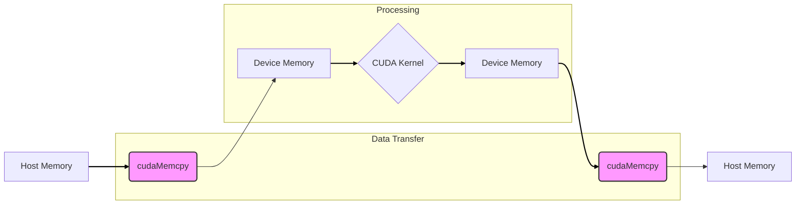
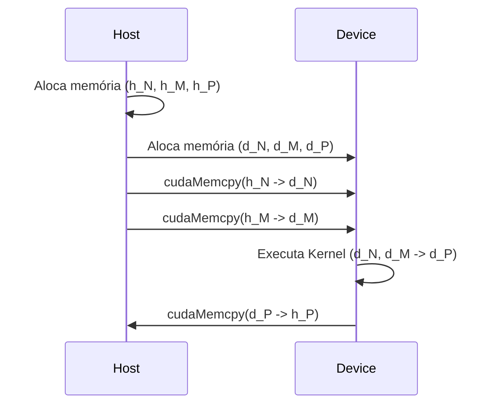
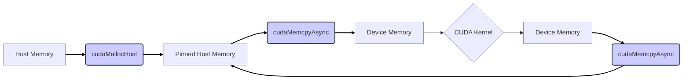
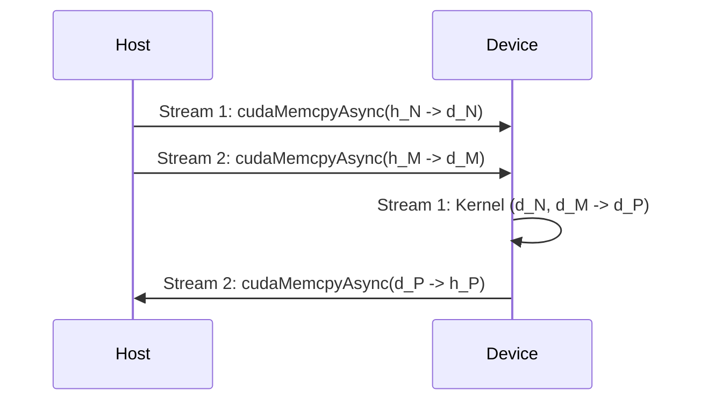
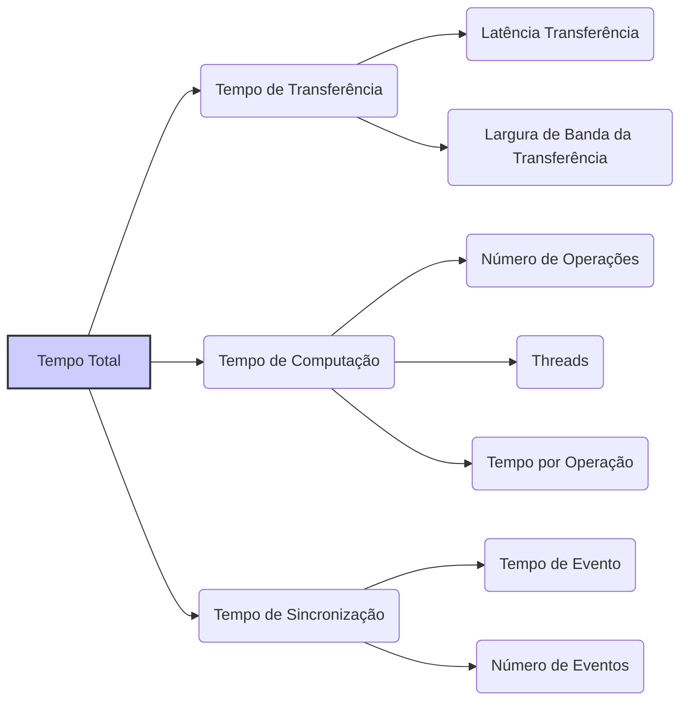

Okay, I've analyzed the text and added Mermaid diagrams where they best support the explanation of concepts, following your guidelines. Here's the enhanced text:

## Host-to-Device Data Transfer in CUDA Convolution



### Introdução

A **transferência de dados do host para o device** é uma etapa fundamental em qualquer aplicação CUDA, e não é diferente em kernels de convolução. A CPU (*host*) é responsável por preparar os dados e por controlar a execução do kernel na GPU (*device*), mas a computação pesada é feita na GPU, e isso exige que os dados da CPU sejam transferidos para a GPU antes do processamento, e o resultado do processamento também precisa ser transferido de volta para a CPU. A eficiência dessa transferência tem um impacto direto no desempenho da aplicação, e minimizar a latência e maximizar a largura de banda dessa transferência é crucial para um bom desempenho. Neste capítulo, exploraremos o processo de transferência de dados do *host* para o *device* em aplicações de convolução com CUDA, e abordaremos as melhores práticas e as técnicas de otimização para maximizar a eficiência dessa transferência.

### Conceitos Fundamentais da Transferência de Dados Host-Device

A transferência de dados entre o *host* e o *device* é uma operação que envolve a comunicação entre a CPU e a GPU, e esta comunicação é geralmente o gargalo de uma aplicação CUDA, pois a velocidade de transferência de dados entre a CPU e a GPU é menor do que a velocidade de acesso à memória local da GPU. Os principais conceitos envolvidos na transferência de dados incluem:

1.  **Alocação de Memória:** A memória é alocada no *host* (CPU) e no *device* (GPU) para armazenar os dados que serão transferidos. As alocações são feitas com as funções `malloc()` (na CPU), e `cudaMalloc()` (na GPU).
2.  **Transferência:** Os dados são transferidos da memória do *host* para a memória do *device* utilizando a função `cudaMemcpy()`.
3.  **Sincronização:** A execução do kernel na GPU é sincronizada com a transferência de dados, ou seja, o kernel não deve iniciar antes que os dados estejam disponíveis na GPU, e os dados não podem ser modificados na CPU antes da finalização da execução do kernel na GPU.

**Conceito 1: Alocação de Memória no Host e no Device**

Antes de qualquer transferência de dados, a memória deve ser alocada tanto no *host* quanto no *device*. A alocação de memória no *host* é feita utilizando as funções de alocação padrão de C/C++, como `malloc()`. A alocação de memória no *device* é feita utilizando a função `cudaMalloc()`, que aloca memória na memória global da GPU.

**Lemma 1:** *A alocação de memória no host e no device é um passo necessário antes da transferência de dados, e deve ser feita de forma correta para evitar erros de segmentação.*

**Prova:** Antes de qualquer operação, a memória deve ser alocada corretamente, tanto no *host* como no *device*, e o uso incorreto da memória pode levar a erros de segmentação ou comportamentos inesperados na aplicação. $\blacksquare$

**Conceito 2: Transferência de Dados com cudaMemcpy**

A transferência de dados do *host* para o *device* é realizada pela função `cudaMemcpy()`. Essa função copia uma quantidade especificada de bytes de uma região de memória de origem para uma região de memória de destino. A direção da transferência (host para *device* ou *device* para *host*) deve ser especificada como um dos parâmetros dessa função. A função `cudaMemcpy()` pode ser utilizada para copiar dados para a memória global do *device*, para a memória compartilhada, ou para a memória constante.

> ❗ **Ponto de Atenção:** A transferência de dados com `cudaMemcpy()` é uma operação síncrona, que bloqueia a execução do *host* até que a transferência seja concluída, e essa operação, devido à sua latência, é um gargalo para o desempenho.

**Corolário 1:** *A função cudaMemcpy() é utilizada para transferir dados entre a memória do host e do device, e o uso correto dessa função é fundamental para que os dados sejam transferidos de forma apropriada, e o programa funcione corretamente.*

**Conceito 3: Tipos de Transferência**

A função `cudaMemcpy()` pode ser usada para diferentes tipos de transferência de dados:

1.  `cudaMemcpyHostToDevice`: Cópia de dados da memória do host para a memória do device.
2. `cudaMemcpyDeviceToHost`: Cópia de dados da memória do device para a memória do host.
3.  `cudaMemcpyDeviceToDevice`: Cópia de dados entre regiões de memória diferentes do mesmo *device*.
4.  `cudaMemcpyHostToHost`: Cópia de dados entre regiões de memória diferentes do *host*.

A escolha do tipo de transferência depende de onde os dados estão localizados e para onde eles serão transferidos, e também da necessidade de que a cópia dos dados seja feita.

### Transferência de Dados Host-Device em Convolução

Em um kernel CUDA para convolução, a transferência de dados do *host* para o *device* envolve as seguintes etapas:

1.  **Alocação no Host:** Alocação de memória na CPU para os *arrays* de entrada (N), *convolution mask* (M) e *array* de saída (P), e os dados são inicializados na CPU.
    ```cpp
    float *h_N = (float*)malloc(Width * Height * sizeof(float));
    float *h_M = (float*)malloc(Mask_Width * sizeof(float));
    float *h_P = (float*)malloc(Width * Height * sizeof(float));
      //Inicialização dos arrays de entrada e da máscara na CPU (h_N e h_M)
    ```
2.  **Alocação no Device:** Alocação de memória na GPU para os *arrays* de entrada (N), *convolution mask* (M) e *array* de saída (P).
    ```cpp
     float *d_N, *d_M, *d_P;
    cudaMalloc((void**)&d_N, Width * Height * sizeof(float));
    cudaMalloc((void**)&d_M, Mask_Width * sizeof(float)); //ou a alocação em memória constante
    cudaMalloc((void**)&d_P, Width * Height * sizeof(float));
    ```

3.  **Transferência de Dados:** Transferência dos *arrays* de entrada (N) e da *convolution mask* (M) do *host* para o *device*, através da função `cudaMemcpy()`.
    ```cpp
    cudaMemcpy(d_N, h_N, Width * Height * sizeof(float), cudaMemcpyHostToDevice);
      cudaMemcpy(d_M, h_M, Mask_Width * sizeof(float), cudaMemcpyHostToDevice); //ou para memória constante cudaMemcpyToSymbol(M,h_M,...);
    ```
    A transferência da *convolution mask* (M) pode ser feita para a memória constante utilizando a função `cudaMemcpyToSymbol()`, como visto no capítulo anterior.
4.  **Execução do Kernel:** Após a transferência, o kernel é executado na GPU, utilizando os dados que foram transferidos para a memória do device.
5.  **Transferência de Resultado:** Após a execução do kernel, o resultado (o array de saída P) é transferido da memória do device para a memória do host.
    ```cpp
    cudaMemcpy(h_P, d_P, Width * Height * sizeof(float), cudaMemcpyDeviceToHost);
    ```

**Lemma 2:** *A transferência de dados do host para o device em aplicações de convolução envolve a alocação de memória na CPU e na GPU, a transferência dos dados através da função cudaMemcpy(), e, no caso da convolution mask, com a possibilidade do uso da memória constante.*

**Prova:** A alocação de memória no host, a alocação de memória no device e a transferência de dados com a função cudaMemcpy() são passos obrigatórios para a execução de um kernel CUDA, e o uso correto dessas funções garante o fluxo correto de dados para o processamento na GPU. $\blacksquare$

**Corolário 2:** *A transferência de dados entre o host e o device é um passo essencial para a execução de um kernel CUDA para convolução, e a escolha correta da direção da cópia, do tipo de memória e da função a ser utilizada é fundamental para o funcionamento correto do programa.*

### Otimizações para a Transferência de Dados Host-Device


A transferência de dados entre *host* e *device* é geralmente um gargalo no desempenho das aplicações CUDA, e a otimização dessa transferência é crucial para maximizar o desempenho geral. As seguintes técnicas podem ser utilizadas para otimizar a transferência:

1.  **Memória Paginável (Pinned Memory):** Utilizar memória paginável (pinned memory) no *host*, através da função `cudaMallocHost()`, para aumentar a largura de banda e reduzir a latência da transferência de dados. A memória paginável é uma memória que não pode ser trocada para o disco rígido, e é alocada de forma que ela seja contígua na memória física, o que otimiza o acesso da GPU a essa memória.
2.  **Streams:** Utilizar *streams* para realizar as transferências de dados em paralelo com a execução do kernel. Uma *stream* é uma sequência de operações que são executadas na GPU de forma assíncrona, e permite que a transferência de dados seja feita ao mesmo tempo em que o kernel está sendo executado, o que minimiza a latência da transferência.
3.  **Transferência Coalescente:** Organizar a transferência de dados de forma que ela seja realizada em blocos contíguos de memória, e isso garante que a largura de banda seja utilizada de maneira mais eficiente. Em alguns casos, é necessário reorganizar os dados para que o acesso seja feito de maneira coalescente.
4.  **Redução do Tamanho dos Dados:** Reduzir a quantidade de dados a serem transferidos, apenas se isso não afetar o resultado da aplicação. Por exemplo, realizar algumas operações na CPU antes da transferência para a GPU, ou utilizar um formato de dados com menor tamanho.
5. **Transferência Assíncrona:** A transferência assíncrona é realizada com o uso de streams. A função `cudaMemcpyAsync` pode ser utilizada para transferir dados sem bloquear a execução do *host*, mas o desenvolvedor deve verificar se a transferência foi finalizada para evitar conflitos e inconsistências nos dados.
6. **Overlapping de Cópia e Computação:** Quando são usadas várias streams, é possível organizar as operações de transferência de dados e computação de forma que eles se sobreponham no tempo. A latência da transferência pode ser ocultada por parte do tempo gasto na computação, e com isso, a eficiência do uso da GPU é maximizada.

**Lemma 4:** *A otimização da transferência de dados do host para o device em CUDA envolve o uso da memória paginável, o uso de streams, a utilização de transferência coalescente, a redução do tamanho dos dados e o overlapping da transferência e computação, e todas essas estratégias permitem aumentar a largura de banda e reduzir a latência, levando a um melhor desempenho.*

**Prova:** Cada uma dessas técnicas visa reduzir o tempo gasto na transferência dos dados. A memória paginável aumenta a largura de banda da transferência, as streams permitem a transferência assíncrona e a sobreposição com a computação, e a redução do tamanho dos dados e o acesso coalescente diminui o tempo de acesso e a quantidade de dados a serem transferidos. $\blacksquare$

**Corolário 4:** *A combinação de diferentes técnicas de otimização na transferência de dados é crucial para maximizar o desempenho das aplicações CUDA, especialmente em casos onde existe uma grande quantidade de dados a ser processada, ou onde a velocidade da transferência se torna um fator limitante no desempenho.*

### Análise Teórica Avançada da Transferência Host-Device

**Pergunta Teórica Avançada 1:** *Como a escolha do tipo de memória no host (paginável ou não paginável) afeta o desempenho da transferência de dados para o device e quais as implicações para o design de kernels CUDA para convolução?*

**Resposta:**

A escolha do tipo de memória no host (paginável ou não paginável) afeta de forma significativa o desempenho da transferência de dados para o device em CUDA, e essa escolha deve ser feita de maneira consistente com os objetivos de desempenho do kernel.

**Lemma 5:** *A memória paginável (pinned memory) oferece melhor desempenho na transferência de dados host-device em comparação com a memória não paginável, pois ela permite o acesso direto pela GPU à memória física, sem a necessidade de operações adicionais de paginação e troca de memória virtual.*

**Prova:** A memória paginável é alocada de forma que ela seja contígua na memória física, e o acesso a ela pela GPU é direto, sem intermediários. A memória não paginável (alocada por malloc), por outro lado, é gerenciada pelo sistema operacional e pode ser paginada para o disco rígido, e o acesso pela GPU exige mais etapas e causa um overhead adicional na transferência. $\blacksquare$

A utilização da **memória paginável** traz as seguintes vantagens:

1.  **Acesso Direto:** A GPU pode acessar a memória paginável diretamente, sem a necessidade de copiar os dados para uma região intermediária na memória do sistema. Isso reduz a latência do acesso e aumenta a eficiência da transferência.
2.  **Largura de Banda:** O acesso direto à memória paginável permite uma maior largura de banda na transferência, e isso pode ser crucial para reduzir o tempo total da transferência, principalmente quando grandes quantidades de dados são utilizadas.
3.  **Redução do Overhead:** A utilização da memória paginável evita o overhead causado pelas operações de paginação do sistema operacional. Como o acesso é direto, essa etapa não precisa ser realizada, e o tempo de transferência é reduzido.
4. **Transferências Assíncronas:** A memória paginável é necessária para a realização de transferências assíncronas com a função `cudaMemcpyAsync`, que permite que os dados sejam transferidos de forma paralela a outros processamentos, o que é fundamental para ocultar a latência de transferência.

As implicações para o *design* de kernels CUDA para convolução são:

1.  **Uso da Memória Paginável:** A alocação de dados no *host* usando `cudaMallocHost()` é fundamental para obter o melhor desempenho na transferência de dados.
2. **Transferências Assíncronas:** A transferência assíncrona pode ser feita utilizando a memória paginável, e essa estratégia permite reduzir o gargalo causado pela transferência de dados, e aumentar a utilização da GPU.
3. **Otimização de Desempenho:** A utilização da memória paginável aumenta a largura de banda da transferência, o que resulta em um desempenho maior para o kernel.

**Corolário 5:** *A utilização da memória paginável no host é fundamental para maximizar o desempenho da transferência de dados para o device, e a escolha entre memória paginável e não paginável deve considerar as características do hardware, os requisitos de desempenho da aplicação e as diferentes formas de acesso à memória.*

**Pergunta Teórica Avançada 2:** *Como a utilização de streams em CUDA pode ser usada para ocultar a latência da transferência de dados host-device em operações de convolução e como o número de streams e sua configuração afeta o desempenho?*

**Resposta:**

A utilização de **streams** em CUDA pode ser usada para ocultar a latência da transferência de dados *host-device* em operações de convolução, e o número de *streams* e sua configuração afeta diretamente o desempenho da aplicação. Uma *stream* é uma fila de operações a serem executadas na GPU, e cada *stream* pode ser executada de forma assíncrona, permitindo que a transferência de dados e a execução do kernel ocorram em paralelo.

**Lemma 6:** *O uso de múltiplas streams permite que a transferência de dados e a execução de kernels ocorram em paralelo, o que reduz o tempo total de execução do kernel. O número de streams e a forma como eles são utilizados influencia diretamente a eficiência dessa sobreposição, e o seu impacto no desempenho.*

**Prova:** A execução de operações de transferência de dados em diferentes *streams* permite que essa operação seja realizada em paralelo com a execução do kernel. O uso de *streams* permite que o processador e a GPU estejam trabalhando ao mesmo tempo, e isso reduz o tempo de latência total da execução. $\blacksquare$

O uso de múltiplas *streams* permite:

1.  **Ocultar Latência:** A sobreposição das transferências de dados com a computação permite que o tempo gasto na transferência seja "ocultado" pelo tempo gasto na execução do kernel. O uso de múltiplas *streams* permite que o tempo total de execução seja reduzido, e a utilização da GPU seja maximizada.
2.  **Aumento da Largura de Banda:** O uso de *streams* pode aumentar a largura de banda aparente da transferência, já que transferências simultâneas são realizadas através de diferentes *streams*, e o gargalo da largura de banda é minimizado.
3.  **Paralelismo:** O uso de *streams* permite o paralelismo de diferentes tarefas, como pré-processamento, computação e pós-processamento. Ao ter diferentes operações ocorrendo em paralelo, o tempo total da aplicação é reduzido.
4. **Dependências:** O uso de eventos é necessário para que a execução do kernel se inicie apenas depois que a transferência de dados foi realizada, e para que a transferência do resultado ocorra apenas depois que a execução do kernel foi finalizada, e essas dependências precisam ser definidas corretamente para que o pipeline de operações funcione da forma esperada.

O **número de *streams*** e sua configuração são fundamentais para otimizar o desempenho da transferência:

1.  **Número de Streams:** O número de *streams* deve ser escolhido de forma a balancear a carga de trabalho entre a CPU e a GPU. Um número excessivo de *streams* pode levar a *overhead* de gerenciamento. Um número muito pequeno pode não aproveitar ao máximo a capacidade da GPU e do barramento de comunicação.
2.  **Tamanho dos Blocos:** O tamanho dos blocos de dados que são transferidos através de cada *stream* deve ser balanceado com a capacidade do sistema de comunicação, da GPU e do processador.
3. **Dependências:** A dependência entre as diferentes streams deve ser cuidadosamente analisada, para garantir que as operações ocorram na ordem correta, e que os dados utilizados nas computações sejam os dados atualizados.

**Corolário 6:** *O uso de múltiplas streams permite ocultar a latência da transferência de dados, e a escolha adequada do número de streams e de suas configurações é fundamental para o desempenho do kernel CUDA, em aplicações de convolução.*

### Dedução Teórica Complexa: Modelagem do Tempo de Execução com Transferência de Dados e Streams



O **tempo de execução** de uma convolução em CUDA, com a utilização de **streams** para a transferência de dados, pode ser modelado considerando o tempo de transferência, o tempo de execução do kernel, e o tempo de sincronização entre os *streams*. A modelagem permite avaliar o impacto do uso de *streams* na execução do kernel.

O tempo de execução do kernel pode ser modelado como:

$$
T_{kernel} = T_{transfer} + T_{compute} + T_{sync}
$$

Onde  $T_{transfer}$ é o tempo de transferência de dados, $T_{compute}$ o tempo de computação e $T_{sync}$ o tempo de sincronização das *streams*.

**Lemma 7:** *O tempo de execução do kernel com transferência de dados e streams pode ser modelado como a soma do tempo de transferência, do tempo de computação e do tempo de sincronização entre as streams, e o uso correto das streams pode levar à ocultação de parte da latência da transferência de dados.*

**Prova:** O tempo total é a soma dos tempos gastos em cada etapa. O uso de *streams* permite a sobreposição do tempo de transferência e o tempo de computação, o que permite reduzir o tempo total de execução do kernel. $\blacksquare$

O tempo de transferência pode ser modelado como:
$$
T_{transfer} = \frac{Data}{BW_{transfer}} + Lat_{transfer}
$$

Onde Data representa a quantidade de dados sendo transferida, $BW_{transfer}$ a largura de banda da transferência, e $Lat_{transfer}$ a latência de transferência.
O tempo de computação pode ser modelado como:
$$
T_{compute} = \frac{N_{op}}{P}*T_{op}
$$

Onde $N_{op}$ representa o número total de operações, P o número de threads, e $T_{op}$ o tempo para realizar uma operação. O tempo de sincronização entre as *streams*, $T_{sync}$, é o tempo que o kernel gasta esperando a transferência finalizar antes de poder executar a computação, ou o tempo que a transferência do resultado gasta até o fim da execução do kernel. Esse tempo pode ser modelado como:
$$
T_{sync} = T_{event} * N_{events}
$$
Onde  $T_{event}$ representa o tempo para executar um evento de sincronização e $N_{events}$ é o número de eventos de sincronização.

O uso de múltiplas *streams* reduz o tempo total de execução do kernel por meio da sobreposição da transferência de dados com a computação, de forma que a latência da transferência é minimizada, e o uso eficiente da GPU é maximizado.

**Corolário 7:** *O modelo de tempo de execução do kernel com transferência de dados e streams mostra como o uso de múltiplas streams permite a sobreposição das operações, o que reduz o tempo de execução total do kernel e a importância de uma correta sincronização entre as streams.*

### Conclusão

(Nota: Não conclua o capítulo até que o usuário solicite.)

### Referências

[^1]: "In the next several chapters, we will discuss a set of important parallel computation patterns. These patterns are the basis of many parallel algorithms that appear in applications." *(Trecho de <Parallel Patterns: Convolution>)*

[^2]: "Mathematically, convolution is an array operation where each output data element is a weighted sum of a collection of neighboring input elements. The weights used in the weighted sum calculation are defined by an input mask array, commonly referred to as the convolution kernel." *(Trecho de <Parallel Patterns: Convolution>)*

[^3]: "Because convolution is defined in terms of neighboring elements, boundary conditions naturally exist for output elements that are close to the ends of an array." *(Trecho de <Parallel Patterns: Convolution>)*

[^4]: "Kernel functions access constant memory variables as global variables. Thus, their pointers do not need to be passed to the kernel as parameters." *(Trecho de <Parallel Patterns: Convolution>)*

[^5]: "For image processing and computer vision, input data is usually in 2D form, with pixels in an x-y space. Image convolutions are also two dimensional." *(Trecho de <Parallel Patterns: Convolution>)*

[^6]: "A more serious problem is memory bandwidth. The ratio of floating-point arithmetic calculation to global memory accesses is only about 1.0 in the kernel." *(Trecho de <Parallel Patterns: Convolution>)*

[^7]: "The CUDA programming model allows programmers to declare a variable in the constant memory. Like global memory variables, constant memory variables are also visible to all thread blocks. The main difference is that a constant memory variable cannot be changed by threads during kernel execution. Furthermore, the size of the constant memory can vary from device to device." *(Trecho de <Parallel Patterns: Convolution>)*

[^8]: "We will discuss two input data tiling strategies for reducing the total number of global memory accesses." *(Trecho de <Parallel Patterns: Convolution>)*

[^9]:  "Constant memory variables play an interesting role in using caches in massively parallel processors. Since they are not changed during kernel execution, there is no cache coherence issue during the execution of a kernel." *(Trecho de <Parallel Patterns: Convolution>)*

[^10]:  "Furthermore, the design of caches in these processors is typically optimized to broadcast a value to a large number of threads." *(Trecho de <Parallel Patterns: Convolution>)*

[^11]:  "With the use of constant caching, we have effectively doubled the ratio of floating-point arithmetic to memory access to 2." *(Trecho de <Parallel Patterns: Convolution>)*

[^12]: "We now address the memory bandwidth issue in accessing the N array element with a tiled convolution algorithm." *(Trecho de <Parallel Patterns: Convolution>)*

[^13]: "Recall that in a tiled algorithm, threads collaborate to load input elements into an on-chip memory and then access the on-chip memory for their subsequent use of these elements." *(Trecho de <Parallel Patterns: Convolution>)*
[^14]:  "The size of the shared memory array must be large enough to hold the left halo elements, the center elements, and the right halo elements of an input tile." *(Trecho de <Parallel Patterns: Convolution>)*
[^15]: "We then load the left halo elements, which include the last n = Mask_Width/2 center elements of the previous tile." *(Trecho de <Parallel Patterns: Convolution>)*
[^16]:  "We now load the right halo elements, which is quite similar to loading the left halo." *(Trecho de <Parallel Patterns: Convolution>)*
[^17]:  "The variable Pvalue will allow all intermediate results to be accumulated in a register to save DRAM bandwidth." *(Trecho de <Parallel Patterns: Convolution>)*
[^18]: "The if statement in the loop tests if any of the input N elements used are ghost elements, either on the left side or the right side of the N array." *(Trecho de <Parallel Patterns: Convolution>)*
[^19]: "For the first and last blocks, the threads that handle ghost elements, no memory access is done for the ghost elements. This reduces the number of memory accesses." *(Trecho de <Parallel Patterns: Convolution>)*
[^20]: "We can calculate the reduced number of memory accesses by enumerating the number of threads that use each ghost element." *(Trecho de <Parallel Patterns: Convolution>)*
[^21]: "A cache coherence mechanism is needed to ensure that the contents of the caches of the other processor cores are updated." *(Trecho de <Parallel Patterns: Convolution>)*

Deseja que eu continue com as próximas seções?
