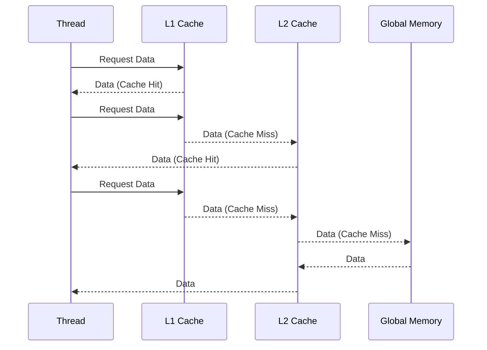
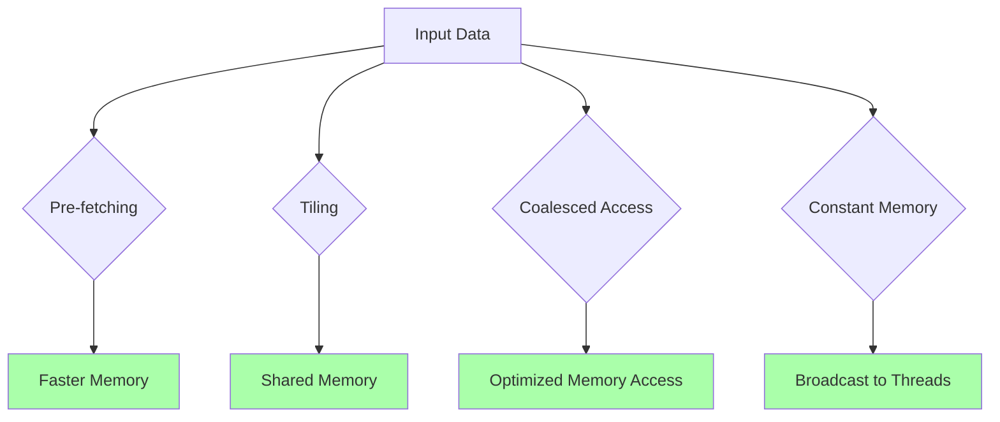
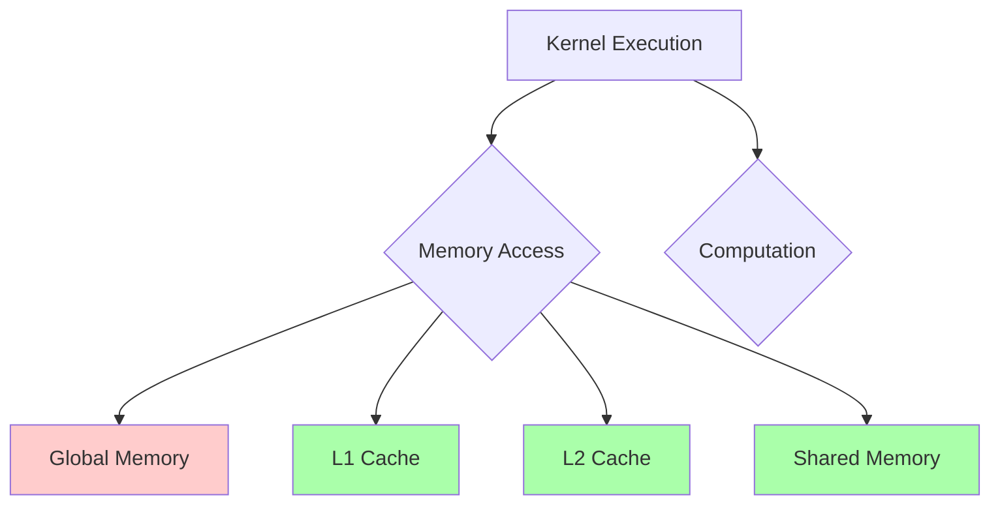

Okay, I've analyzed the text and added Mermaid diagrams to visualize the concepts discussed. Here's the enhanced text with the diagrams:

## Caches and Memory Latency in CUDA Convolution

```mermaid
  flowchart TD
    A["CPU/GPU Core"] -->|Request Data| B(Memory Controller);
    B --> C{L1 Cache};
    C --"Cache Hit"--> A;
    C --"Cache Miss"--> D{L2 Cache};
    D --"Cache Hit"--> A;
    D --"Cache Miss"--> E{L3 Cache};
    E --"Cache Hit"--> A;
    E --"Cache Miss"--> F[Global Memory (DRAM)];
    F --> B;
    F-->|Data| A
    style A fill:#ccf,stroke:#333,stroke-width:2px
    style B fill:#ccf,stroke:#333,stroke-width:2px
    style C fill:#aaffaa,stroke:#333,stroke-width:2px
    style D fill:#aaffaa,stroke:#333,stroke-width:2px
    style E fill:#aaffaa,stroke:#333,stroke-width:2px
    style F fill:#ffcccc,stroke:#333,stroke-width:2px
    
    
    subgraph Memory Hierarchy
    C
    D
    E
    F
    end
```

### Introdução

A **latência da memória** é o tempo que o processador leva para acessar um dado na memória, e essa latência tem um grande impacto no desempenho de aplicações com grande uso de memória, como a convolução. As GPUs, assim como as CPUs, utilizam **caches** para reduzir a latência do acesso à memória, e a otimização do uso desses *caches* é fundamental para o alto desempenho. Neste capítulo, exploraremos como a latência da memória afeta os kernels CUDA para convolução, como os *caches* ajudam a reduzir essa latência, e como otimizar o acesso à memória para maximizar o desempenho de nossos kernels.

### A Latência da Memória e Seu Impacto

A latência da memória é um fator limitante no desempenho de muitos aplicativos, especialmente aqueles que envolvem o acesso frequente a grandes quantidades de dados. A memória principal (DRAM) tem uma alta latência, ou seja, o tempo que o processador leva para solicitar um dado e recebê-lo é relativamente alto. Esse tempo é medido em ciclos de *clock*, e, em muitos casos, o tempo de acesso à memória corresponde a um grande número de ciclos de *clock*, se comparado ao tempo de execução de uma operação simples de multiplicação ou adição.

**Conceito 1: A Latência da Memória e o Tempo de Execução**

A latência da memória afeta diretamente o tempo de execução de um kernel, já que o processador fica ocioso enquanto espera que os dados sejam carregados da memória. Quanto maior a latência, mais tempo o processador fica esperando pelos dados, e isso reduz a taxa de processamento.

**Lemma 1:** *A latência do acesso à memória é um fator limitante para o desempenho de kernels CUDA, e a redução dessa latência é fundamental para maximizar a eficiência do processamento paralelo da GPU.*

**Prova:** A CPU ou GPU ficam ociosas enquanto esperam por dados da memória, e um tempo de espera elevado causa uma queda na taxa de processamento. A redução da latência de acesso à memória pode ser feita através do uso de caches, e a organização do acesso aos dados, e estas são estratégias importantes para a otimização. $\blacksquare$

**Conceito 2: Hierarquia de Memória e Latência**

Os processadores modernos utilizam uma hierarquia de memória para reduzir o impacto da latência, como discutido no capítulo anterior. A hierarquia de memória é composta por:

1.  **Registradores:** A memória mais rápida e de menor latência, localizada diretamente no processador.
2.  **Caches L1:** Um *cache* de alta velocidade e baixa latência, dedicado a cada núcleo do processador ou SM (Streaming Multiprocessor) da GPU.
3.  **Caches L2:** Um *cache* intermediário, com maior capacidade, mas com latência um pouco maior, compartilhado por vários núcleos do processador ou SMs da GPU.
4.  **Caches L3:** Em alguns processadores, existe um *cache* L3, que é maior do que o *cache* L2, mas com uma latência ainda maior.
5.  **Memória Compartilhada:** A memória compartilhada é um tipo de memória *on-chip* com baixa latência e alta largura de banda, que é gerenciada diretamente pelo programador.
6.  **Memória Constante:** A memória constante utiliza um cache especializado para o acesso à memória, com um *broadcast* de dados para vários threads.
7.  **Memória Global (DRAM):** A memória principal do sistema, que possui grande capacidade, mas com a maior latência entre os diferentes tipos de memória.

> ❗ **Ponto de Atenção:** A hierarquia de memória busca explorar a localidade de dados, onde dados que são acessados recentemente ou que estão próximos de um dado acessado recentemente são armazenados em níveis de memória mais rápidos.

**Corolário 1:** *A utilização eficiente da hierarquia de memória, e o uso dos caches, permite reduzir a latência do acesso aos dados e aumentar o desempenho das aplicações de convolução.*

**Conceito 3: Latência e Largura de Banda**

Além da latência, a **largura de banda** também é um fator importante no desempenho da memória. A largura de banda é a quantidade de dados que pode ser lida ou escrita por unidade de tempo. A memória global tem uma largura de banda limitada, e isso também impacta o desempenho. As memórias *on-chip*, como registradores e caches, têm uma largura de banda muito maior do que a memória global (DRAM).

### Caches e Latência na Convolução em CUDA



Em kernels CUDA para convolução, os *caches* são utilizados para reduzir a latência do acesso à memória:

1.  **Cache L1:** O *cache* L1 armazena dados que são utilizados com frequência pelos threads em um SM (Streaming Multiprocessor). A memória compartilhada, quando utilizada, também utiliza o *cache* L1, para aumentar a eficiência do acesso a essa memória.

2.  **Cache L2:** O *cache* L2 é compartilhado entre vários SMs da GPU e armazena dados que não estão no *cache* L1, mas que ainda estão sendo utilizados. A memória constante também é armazenada no cache L2.
3.  **Caches da Memória Constante:** Os dados da memória constante são armazenados em um cache otimizado para o acesso por múltiplos threads. O cache da memória constante é otimizado para *broadcast*, ou seja, para que todos os threads do warp tenham acesso aos dados simultaneamente.

Ao utilizar *caches*, os dados são armazenados em níveis de memória mais rápidos, de forma que as operações de leitura podem ocorrer com uma latência muito menor, do que se fosse necessário acessar diretamente a memória global.

**Lemma 2:** *Os caches L1 e L2, em conjunto com o cache da memória constante, reduzem a latência do acesso à memória através do armazenamento dos dados de acesso mais frequente nas memórias de acesso mais rápido. A organização dos dados e a forma como o kernel utiliza cada nível de cache é fundamental para o desempenho da convolução.*

**Prova:** O uso dos caches permite que o acesso aos dados seja feito de maneira mais rápida, e, se o código explora essa característica, os dados que são utilizados com mais frequência são acessados na região de memória mais rápida. $\blacksquare$

**Corolário 2:** *A utilização adequada dos caches L1, L2 e caches da memória constante é fundamental para reduzir a latência do acesso à memória, e otimizar o desempenho do processamento em kernels CUDA para convolução.*

### Estratégias para Reduzir a Latência do Acesso à Memória



Para reduzir a latência do acesso à memória em kernels CUDA para convolução, é possível utilizar diversas estratégias:

1.  **Pre-fetching:** O *pre-fetching* consiste em carregar dados do nível de memória mais lento para um nível mais rápido antes que o processador precise acessá-los. O *pre-fetching* pode ser feito com a utilização de *threads* ou blocos dedicados, ou através da utilização de um cache, e o *prefetching* reduz o tempo de espera para o processamento do dado.
2.  **Tiling:** O *tiling* divide o *array* de entrada em pequenas regiões (tiles) e processa cada *tile* por vez. Ao carregar os dados do *tile* na memória compartilhada, o número de acessos à memória global é reduzido, e os acessos passam a ser realizados na memória compartilhada, que tem latência e largura de banda maiores que a memória global.
3.  **Acesso Coalescente:** Os threads de um mesmo *warp* devem acessar a memória global de forma sequencial (coalescente), para que os acessos sejam feitos de forma eficiente. O uso da organização *row-major* para os *arrays* e o uso de índices lineares otimiza a forma como os dados são acessados na memória.
4. **Uso da Memória Compartilhada:** A memória compartilhada (scratchpad memory) deve ser utilizada para os dados que são reutilizados repetidamente pelos threads. O uso eficiente da memória compartilhada permite que esses dados sejam acessados de forma mais rápida e eficiente, devido à baixa latência e a alta largura de banda da memória compartilhada.
5.  **Memória Constante:** A *convolution mask* pode ser armazenada na memória constante, o que permite que ela seja acessada através de um cache, de forma eficiente, o que reduz a latência.
6.  **Loop Unrolling:** O *loop unrolling* pode reduzir a latência do acesso à memória, ao reduzir o número de iterações do loop e aumentar a utilização do processador e o *pre-fetching* dos dados nos caches.
7. **Organização dos Dados:** A organização dos dados na memória global deve ser tal que o acesso a esses dados seja feito de forma coalescente, e também a organização dos dados na memória compartilhada deve ser feita para que o acesso seja o mais eficiente possível e a largura de banda da memória seja otimizada.

**Lemma 4:** *A latência do acesso à memória em kernels CUDA para convolução pode ser reduzida através do uso combinado de pre-fetching, tiling, acesso coalescente, utilização da memória compartilhada, utilização da memória constante e loop unrolling, e o uso dessas estratégias em conjunto é essencial para um desempenho ótimo do kernel.*

**Prova:** A combinação dessas técnicas permite que os dados sejam acessados no momento em que eles são necessários, e nos níveis de memória mais apropriados. O *pre-fetching* garante que os dados estejam disponíveis antes que eles sejam utilizados, e o *tiling* e o acesso coalescente reduzem a quantidade de dados que precisam ser acessados a partir da memória global. O uso da memória compartilhada e da memória constante garante que dados reutilizados repetidamente sejam armazenados em níveis de memória com menor latência. $\blacksquare$

**Corolário 4:** *A escolha e a combinação das estratégias para reduzir a latência do acesso à memória é fundamental para o desempenho do kernel de convolução em CUDA, e o planejamento do uso de cada nível de memória pode levar ao uso mais eficiente dos recursos da GPU e a um desempenho maior.*

### Análise Teórica Avançada da Latência da Memória

**Pergunta Teórica Avançada 1:** *Como a latência do acesso à memória global varia com o tamanho dos dados e a distância na hierarquia de memória da GPU, e como essa variação afeta o desempenho de kernels CUDA para convolução?*

**Resposta:**

A **latência do acesso à memória global** varia com o **tamanho dos dados** e com a **distância na hierarquia de memória da GPU**. O acesso à memória global é mais lento do que o acesso a outros tipos de memória, como a memória compartilhada e os caches. A latência é influenciada tanto pela distância física dos dados na memória quanto pelos gargalos no tráfego da memória, e esses fatores afetam o desempenho do kernel, que necessita acessar os dados na memória global para realizar a convolução.

**Lemma 5:** *A latência do acesso à memória global aumenta com o tamanho dos dados e com a distância desses dados na hierarquia da memória da GPU, e essa variação tem um impacto significativo no desempenho de kernels CUDA para convolução.*

**Prova:** A latência de acesso à memória global é influenciada pela quantidade de dados que precisa ser transferida, e pela necessidade do acesso à DRAM (Dynamic Random Access Memory) fora do chip da GPU, que é um processo mais demorado. O aumento do tamanho dos dados também aumenta o tempo de espera nos acessos à memória, devido à largura de banda limitada da memória global. $\blacksquare$

O acesso à memória global pode apresentar:

1.  **Latência Base:** Um tempo inicial gasto para que a solicitação de acesso seja feita e o dado seja buscado na memória. Essa latência é influenciada pela distância física entre a GPU e a memória global e também pelas características do acesso (se ele é sequencial ou aleatório).
2.  **Latência de Transferência:** Um tempo que depende do tamanho dos dados a serem transferidos e da largura de banda da memória global. Um maior tamanho dos dados ou uma menor largura de banda resultam em uma latência maior.
3. **Largura de Banda:** A largura de banda da memória também afeta a latência, e uma largura de banda menor faz com que mais tempo seja gasto na transferência dos dados da memória.

A variação da latência em relação ao tamanho dos dados é fundamental para que a organização do acesso à memória seja feita corretamente, e que o impacto da latência seja minimizado.

**Corolário 5:** *A latência do acesso à memória global aumenta com o tamanho dos dados e com a distância na hierarquia da memória. O uso de técnicas como caching, tiling e acesso coalescente minimizam o acesso à memória global, e reduzem o impacto da latência no desempenho do kernel de convolução.*

**Pergunta Teórica Avançada 2:** *Como o uso da memória compartilhada e o conceito de locality afetam a latência do acesso à memória em kernels CUDA para convolução, e como projetar o kernel para maximizar a utilização da memória compartilhada?*

**Resposta:**

O uso da **memória compartilhada** e o conceito de **localidade** afetam significativamente a **latência do acesso à memória** em kernels CUDA para convolução. A memória compartilhada, como discutido anteriormente, é uma memória de baixa latência, que é utilizada para armazenar dados que são utilizados repetidamente por threads do mesmo bloco, e a reutilização dos dados, ou seja, a localidade dos dados, influencia a forma como a memória compartilhada é utilizada.

**Lemma 7:** *O uso da memória compartilhada e o conceito de localidade reduzem a latência do acesso à memória em kernels CUDA, ao tornar os dados que são acessados com frequência mais próximos dos threads que precisam deles. Um bom uso da memória compartilhada é um componente importante para se obter um desempenho elevado.*

**Prova:** A memória compartilhada é um tipo de memória *on-chip* e a proximidade dos dados do processador leva a uma menor latência de acesso. A localidade garante que dados que são reutilizados sejam acessados na memória compartilhada, o que reduz o número de acessos à memória global. $\blacksquare$

O conceito de **localidade** se baseia na ideia que:

1.  **Localidade Temporal:** Dados que foram acessados recentemente têm maior probabilidade de serem acessados novamente. O *cache* e a memória compartilhada exploram a localidade temporal.
2.  **Localidade Espacial:** Dados que estão próximos na memória têm maior probabilidade de serem acessados juntos. O acesso coalescente à memória global explora a localidade espacial.

A **utilização da memória compartilhada** deve ser feita através de uma análise do padrão de acesso aos dados, para que o seu potencial de redução da latência seja maximizado. Uma das estratégias é o uso do *tiling*, que divide o array de entrada em porções menores, que são carregadas na memória compartilhada, para que os threads de um bloco trabalhem de forma local, evitando acessos repetidos à memória global.

O projeto do kernel deve considerar os seguintes aspectos:

1.  **Carregamento Eficiente:** O carregamento dos dados para a memória compartilhada deve ser feito de forma otimizada, para que o gargalo da memória global seja minimizado. O uso do *pre-fetching* e o acesso coalescente também auxiliam na otimização do carregamento da memória.
2.  **Reutilização:** Os dados devem ser acessados e reutilizados o máximo possível dentro da memória compartilhada, antes que novos dados precisem ser carregados. O uso de técnicas de computação que usem os mesmos dados repetidamente aumenta o aproveitamento da memória compartilhada.
3. **Evitar Conflitos:** O acesso à memória compartilhada pelos diferentes threads do mesmo bloco não pode gerar conflitos de acesso, o que reduz a eficiência da utilização da memória. A utilização de técnicas para evitar *bank conflicts* é fundamental, pois este fenômeno pode criar uma serialização do acesso à memória compartilhada.

**Corolário 7:** *O uso da memória compartilhada e a exploração da localidade dos dados são fundamentais para reduzir a latência do acesso à memória em kernels CUDA para convolução, e a forma como a memória compartilhada é utilizada, e quais os dados são armazenados nela, afeta diretamente o desempenho do kernel.*

### Dedução Teórica Complexa: Modelagem do Tempo de Execução da Convolução com Latência de Memória e Caches



O **tempo de execução** de uma convolução com **latência de memória** e o uso de **caches** pode ser modelado levando em consideração o tempo de acesso à memória, o tempo de computação e o impacto dos caches e otimizações no acesso à memória.

O tempo de execução do kernel pode ser modelado como:
$$
T_{kernel} = T_{memoria} + T_{computacao}
$$
Onde $T_{memoria}$ representa o tempo total de acesso à memória e $T_{computacao}$ representa o tempo gasto com as operações da convolução.

**Lemma 8:** *O tempo de execução da convolução é influenciado pela latência de acesso à memória e pela eficiência da hierarquia de memória, e o modelo do tempo de execução deve incluir essas características para que o kernel possa ser otimizado.*

**Prova:** O acesso à memória, em diferentes níveis, tem um impacto direto no tempo de execução, e o uso de caches e da memória compartilhada afeta a latência, e também o tempo de acesso à memória global. $\blacksquare$

O tempo para acessar a memória,  $T_{memoria}$, pode ser modelado como:
$$
T_{memoria} = N_{acessos} * Latencia_{mem}
$$
Onde $N_{acessos}$ representa o número de acessos à memória e $Latencia_{mem}$ a latência média do acesso à memória.
A latência do acesso à memória é influenciada pela forma com que os *caches* são utilizados, e pode ser modelada de forma mais precisa como:

$$
Latencia_{mem} = p_{L1}*Lat_{L1} + (1-p_{L1})*(p_{L2}*Lat_{L2} + (1-p_{L2})*Lat_{global})
$$

Onde $p_{L1}$ representa a taxa de acerto do *cache* L1, $Lat_{L1}$ a latência do *cache* L1, $p_{L2}$ a taxa de acerto do *cache* L2 e $Lat_{L2}$ a latência do *cache* L2, e Lat_{global} a latência da memória global. O tempo de computação pode ser modelado como:
$$
T_{computacao} = \frac{N_{op}}{P}*T_{op}
$$

Onde $N_{op}$ representa o número total de operações, P o número de threads, e  $T_{op}$ o tempo para realizar uma operação. A utilização de técnicas para reduzir o número de acessos à memória e para aumentar o aproveitamento dos caches leva a uma redução da latência e também a um aumento da largura de banda, e o modelo do tempo de execução pode ser utilizado para guiar essas otimizações.

**Corolário 8:** *O modelo de tempo de execução da convolução com a inclusão da latência de acesso e dos caches permite analisar o impacto da utilização da hierarquia de memória e das abordagens de otimização no desempenho do kernel e permite a escolha das melhores estratégias para o processamento de dados de entrada e da *convolution mask*.*

### Conclusão

(Nota: Não conclua o capítulo até que o usuário solicite.)

### Referências

[^1]: "In the next several chapters, we will discuss a set of important parallel computation patterns. These patterns are the basis of many parallel algorithms that appear in applications." *(Trecho de <Parallel Patterns: Convolution>)*
[^2]: "Mathematically, convolution is an array operation where each output data element is a weighted sum of a collection of neighboring input elements. The weights used in the weighted sum calculation are defined by an input mask array, commonly referred to as the convolution kernel." *(Trecho de <Parallel Patterns: Convolution>)*
[^3]: "Because convolution is defined in terms of neighboring elements, boundary conditions naturally exist for output elements that are close to the ends of an array." *(Trecho de <Parallel Patterns: Convolution>)*
[^4]: "Kernel functions access constant memory variables as global variables. Thus, their pointers do not need to be passed to the kernel as parameters." *(Trecho de <Parallel Patterns: Convolution>)*
[^5]: "For image processing and computer vision, input data is usually in 2D form, with pixels in an x-y space. Image convolutions are also two dimensional." *(Trecho de <Parallel Patterns: Convolution>)*
[^6]: "A more serious problem is memory bandwidth. The ratio of floating-point arithmetic calculation to global memory accesses is only about 1.0 in the kernel." *(Trecho de <Parallel Patterns: Convolution>)*
[^7]: "The CUDA programming model allows programmers to declare a variable in the constant memory. Like global memory variables, constant memory variables are also visible to all thread blocks. The main difference is that a constant memory variable cannot be changed by threads during kernel execution. Furthermore, the size of the constant memory can vary from device to device." *(Trecho de <Parallel Patterns: Convolution>)*
[^8]: "We will discuss two input data tiling strategies for reducing the total number of global memory accesses." *(Trecho de <Parallel Patterns: Convolution>)*
[^9]:  "Constant memory variables play an interesting role in using caches in massively parallel processors. Since they are not changed during kernel execution, there is no cache coherence issue during the execution of a kernel." *(Trecho de <Parallel Patterns: Convolution>)*
[^10]:  "Furthermore, the design of caches in these processors is typically optimized to broadcast a value to a large number of threads." *(Trecho de <Parallel Patterns: Convolution>)*
[^11]:  "With the use of constant caching, we have effectively doubled the ratio of floating-point arithmetic to memory access to 2." *(Trecho de <Parallel Patterns: Convolution>)*
[^12]:  "The accesses to the input N array elements can also benefit from caching in more recent devices." *(Trecho de <Parallel Patterns: Convolution>)*
[^13]: "A cache coherence mechanism is needed to ensure that the contents of the caches of the other processor cores are updated." *(Trecho de <Parallel Patterns: Convolution>)*
[^14]: "In modern processors, accessing a variable from DRAM takes hundreds if not thousands of clock cycles." *(Trecho de <Parallel Patterns: Convolution>)*
[^15]: "A major design issue with using caches in a massively parallel processor is cache coherence, which arises when one or more processor cores modify cached data." *(Trecho de <Parallel Patterns: Convolution>)*
[^16]: "They are typically shared among multiple processor cores, or streaming multiprocessors (SMs) in a CUDA device." *(Trecho de <Parallel Patterns: Convolution>)*
[^17]: "To mitigate the effect of memory bottleneck, modern processors commonly employ on-chip cache memories, or caches, to reduce the number of variables that need to be accessed from DRAM." *(Trecho de <Parallel Patterns: Convolution>)*
[^18]: "There is a trade-off between the size of a memory and the speed of a memory." *(Trecho de <Parallel Patterns: Convolution>)*

Deseja que eu continue com as próximas seções?
