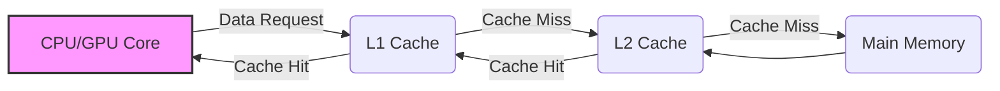
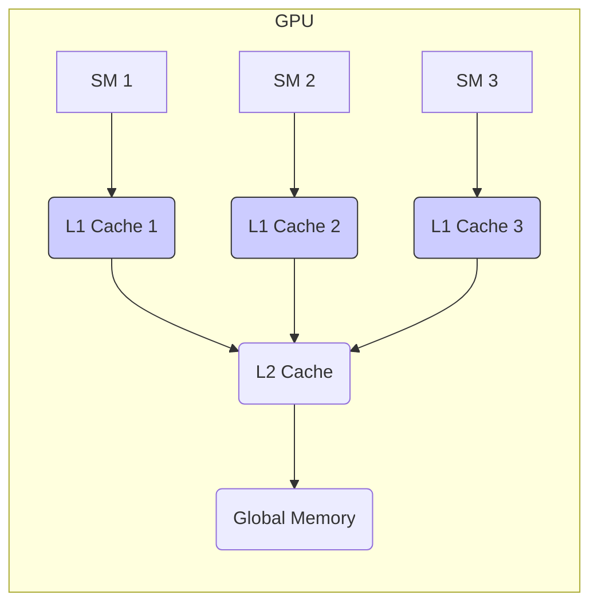
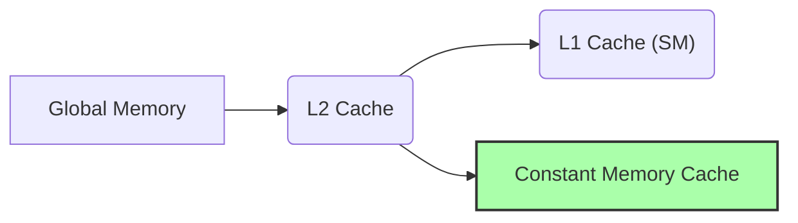

Okay, I will add Mermaid diagrams to enhance the text, focusing on architecture and system relationships, using flowcharts and sequence diagrams where appropriate.

### Introdução

A **coerência de cache** é um problema que surge em sistemas multiprocessadores, como as GPUs, quando múltiplos núcleos ou processadores compartilham o mesmo espaço de memória e possuem seus próprios *caches*. Em um sistema com caches, a mesma região de memória pode estar armazenada em diferentes caches, e se um núcleo modifica um valor que está armazenado no cache, os outros núcleos podem não ter acesso ao valor atualizado, e isso é chamado de problema de coerência do cache. Em um kernel CUDA para convolução, threads de diferentes blocos podem tentar acessar e modificar a memória, e o problema de coerência deve ser tratado para evitar resultados incorretos. Neste capítulo, exploraremos o problema de coerência de cache, como ele afeta kernels CUDA para convolução, e como garantir a coerência de cache em implementações paralelas.

### Conceitos Fundamentais da Coerência de Cache

A **coerência de cache** é um mecanismo que garante que todos os processadores em um sistema multiprocessador tenham acesso à versão mais recente dos dados compartilhados. Quando múltiplos processadores acessam e modificam dados em cache, é possível que diferentes versões dos mesmos dados sejam armazenadas em *caches* diferentes. O mecanismo de coerência de cache tem como objetivo garantir que essas versões sejam consistentes, de forma que todos os processadores leiam os mesmos valores, e, quando eles são modificados, o valor mais recente seja sempre acessado.

**Conceito 1: O Problema da Coerência de Cache**

O problema da coerência de cache surge quando múltiplos processadores acessam e modificam dados na memória principal que também estão armazenados nos seus caches locais. Se um processador modificar um dado no seu cache local, e os outros processadores também acessarem esse dado do seus caches, pode haver uma inconsistência nos valores, que pode levar a resultados incorretos.

**Lemma 1:** *A coerência de cache é um problema que surge em sistemas multiprocessadores, quando múltiplos caches armazenam cópias de dados modificados, e o problema da coerência garante que todos os processadores acessem a versão mais recente desses dados.*

**Prova:** A replicação de dados em caches diferentes, em arquiteturas multiprocessadores, faz com que diferentes cópias dos dados sejam armazenadas em diferentes níveis de memória, e a necessidade de coerência surge quando essas cópias são modificadas, para que todos os processadores tenham acesso ao dado correto e mais recente. $\blacksquare$

**Conceito 2: Protocolos de Coerência de Cache**

Existem diversos protocolos para garantir a coerência de cache, como o protocolo **MESI** (Modified, Exclusive, Shared, Invalid), que é utilizado em muitas arquiteturas de processadores. Esses protocolos definem os estados possíveis para um bloco de dados em *cache*, e como esses estados devem ser gerenciados durante as operações de leitura e escrita. O protocolo MESI, por exemplo, define que um dado pode ser *Modified* (modificado e ainda não escrito na memória principal), *Exclusive* (única cópia do dado no cache), *Shared* (cópia compartilhada em múltiplos caches), ou *Invalid* (a cópia do dado no cache não é válida).

> ❗ **Ponto de Atenção:** A implementação de mecanismos de coerência de cache é complexa e exige um overhead no hardware, e a eficiência desse mecanismo tem um impacto direto no desempenho do sistema multiprocessador.

**Corolário 1:** *Os protocolos de coerência de cache são usados para manter a consistência dos dados em um sistema multiprocessador, garantindo que todos os processadores acessem a versão mais recente dos dados, o que é essencial para a operação correta de qualquer aplicação.*

**Conceito 3: Coerência de Cache em GPUs**

Em GPUs, a coerência de cache é mais complexa do que em CPUs, devido ao número muito maior de núcleos e à arquitetura de memória diferente. GPUs geralmente sacrificam a coerência de *cache* entre os SMs (Streaming Multiprocessors) para otimizar a largura de banda e a velocidade de execução. As GPUs geralmente possuem *caches* L1 dedicados a cada SM, e um *cache* L2 compartilhado entre vários SMs. A memória constante também utiliza um *cache* dedicado. Em geral, não existe uma coerência entre os caches L1 de SMs diferentes, e é o programador que precisa garantir que os dados sejam acessados corretamente através do uso da memória compartilhada e de outras abordagens.

### Coerência de Cache em Kernels CUDA para Convolução

Em kernels CUDA para convolução, a coerência de *cache* pode surgir quando os threads em diferentes blocos acessam e modificam dados na memória global, como no caso de algoritmos que não utilizam memória compartilhada, ou quando o tratamento das *boundary conditions* exige que a mesma posição da entrada seja utilizada por dois ou mais blocos. Se diferentes blocos de threads acessam os mesmos dados na memória global, e os dados são modificados por algum desses blocos, os outros blocos podem estar usando dados desatualizados dos seus caches. No entanto, a falta de coerência é um problema maior no caso das memórias privadas de cada SM, como a L1, que não compartilham a atualização de dados modificados entre as diferentes regiões.

1.  **Memória Global:** Em kernels de convolução, a memória global é utilizada para armazenar os *arrays* de entrada (N) e o *array* de saída (P). Se diferentes blocos modificam o array de saída, pode ocorrer a falta de coerência, já que a escrita em um dos *caches* não propaga a mudança para os outros.
2.  **Memória Compartilhada:** A memória compartilhada é utilizada para armazenar dados reutilizados por threads do mesmo bloco, e nesse caso, o problema de coerência de *cache* não ocorre, já que todos os threads que compartilham a memória, fazem parte do mesmo bloco.

> 💡 **Dica:** O uso da memória compartilhada é uma forma de mitigar o problema da falta de coerência de cache, já que todos os dados que precisam ser acessados por um bloco, são armazenados na memória compartilhada, que tem coerência garantida.

**Lemma 2:** *A falta de coerência de cache em GPUs pode levar a resultados incorretos em kernels CUDA para convolução, se dados que são compartilhados entre diferentes SMs são modificados, e isso deve ser levado em conta no projeto do kernel, e a utilização da memória compartilhada é uma forma de minimizar esse problema.*

**Prova:**  A falta de coerência faz com que as cópias dos dados na hierarquia de memória não sejam consistentes, e, com isso, os threads da GPU podem acessar valores desatualizados da memória, o que leva a cálculos e resultados incorretos, especialmente em implementações paralelas. $\blacksquare$

**Corolário 2:** *A coerência de cache é um problema complexo em GPUs, e os programadores devem estar conscientes desse problema e utilizar estratégias que minimizem a sua influência, através do uso da memória compartilhada ou através de outras técnicas de otimização.*

### Estratégias para Lidar com a Coerência de Cache

Em kernels CUDA para convolução, existem diversas estratégias para lidar com o problema da coerência de cache:

1.  **Utilização da Memória Compartilhada:** Como mencionado, a memória compartilhada garante a coerência de dados dentro de um mesmo bloco de threads. Ao carregar os dados para a memória compartilhada, a necessidade de acessar a memória global é reduzida. O uso da memória compartilhada garante que os dados sejam acessados na sua última versão, já que ela é compartilhada apenas entre os threads do mesmo bloco, o que evita os problemas de coerência entre blocos diferentes.

2.  **Acesso Coalescente à Memória Global:** Organizar o acesso à memória global de forma que os acessos sejam coalescentes, e o acesso seja feito de maneira sequencial, dentro de um mesmo warp, minimiza a necessidade de utilizar os caches L1, e aumenta a eficiência do acesso à memória. A organização dos dados na memória deve ser tal que o acesso coalescente seja garantido, e os dados sejam acessados de forma sequencial pelos threads do mesmo *warp*.
3. **Utilização de Memória Constante:** A utilização da memória constante para a *convolution mask* elimina a necessidade de tratar a coerência dos dados da máscara, já que a memória constante é somente leitura durante a execução do kernel.
4. **Organização dos Acessos:** Quando o uso da memória compartilhada não for possível, o código deve garantir que, se a mesma posição da memória global for acessada por múltiplos blocos, o acesso seja feito de forma correta, com o uso de sincronização e técnicas que garantam a coerência dos dados, e os acessos não devem ser feitos de forma aleatória, e sim, utilizando um padrão que minimize a latência e maximize a largura de banda do acesso.

**Lemma 3:** *O uso da memória compartilhada, o acesso coalescente, a utilização da memória constante, e a organização dos acessos minimizam os problemas de coerência de cache em kernels CUDA para convolução, e todas essas abordagens garantem o acesso consistente e eficiente aos dados.*

**Prova:** O uso da memória compartilhada garante que os threads de um bloco acessem dados consistentes, o acesso coalescente garante o melhor uso da largura de banda da memória global, e a memória constante garante o acesso eficiente a um dado que não precisa ser modificado durante a execução do kernel. $\blacksquare$

**Corolário 3:** *A utilização combinada de abordagens como memória compartilhada, acesso coalescente e memória constante permitem minimizar o problema da coerência de cache em kernels CUDA para convolução e otimizar o acesso à memória.*

### Análise Teórica Avançada da Coerência de Cache

**Pergunta Teórica Avançada 1:** *Como a escolha do tamanho dos tiles e blocos de threads interagem com o mecanismo de coerência de cache em GPUs, e como otimizar o tamanho dos tiles para maximizar o desempenho e a utilização dos caches?*

**Resposta:**

A escolha do **tamanho dos *tiles*** e dos **blocos de threads** interage de forma complexa com o mecanismo de **coerência de cache** em GPUs. A escolha do tamanho do tile, do tamanho do bloco e da organização dos threads tem um impacto direto na quantidade de dados que serão armazenados em *cache* e em memória compartilhada.

**Lemma 4:** *A escolha do tamanho dos tiles e blocos afeta a forma como os dados são utilizados, e também a necessidade de que dados da memória global sejam utilizados para compor o resultado final, e também influencia a forma como os caches são utilizados, e também o problema da falta de coerência de cache.*

**Prova:** O tamanho do tile determina a quantidade de dados que são carregados para a memória compartilhada, e também afeta a reutilização desses dados. O tamanho do bloco define a quantidade de threads que executam ao mesmo tempo, e, consequentemente, a necessidade de acesso à memória global, e também à memória compartilhada. $\blacksquare$

O **tamanho dos *tiles*** e o tamanho dos **blocos de threads** interagem da seguinte forma com a coerência de *cache*:

1.  **Tamanho dos Tiles e Caches L1/L2:** Um *tile* menor pode caber totalmente no *cache* L1, o que reduz o tráfego da memória global e aumenta o desempenho. Um *tile* maior pode não caber no *cache* L1, e os dados precisam ser carregados no *cache* L2 ou mesmo na memória global, o que aumenta a latência do acesso.
2.  **Tamanho dos Blocos e Memória Compartilhada:** O tamanho do bloco influencia o uso da memória compartilhada, que deve ser utilizada para armazenar todos os dados que são necessários para o cálculo de uma região. O número de threads por bloco influencia a utilização da memória compartilhada, e do acesso coalescente.
3.  **Tiles e Coerência de Cache:** O tamanho do *tile* influencia a necessidade de que os dados sejam acessados em diferentes blocos, e, com isso, um *tile* menor permite que menos blocos disputem a mesma região da memória. Blocos muito grandes que necessitam de dados de outros blocos levam a conflitos e problemas de coerência de *cache*.
4.  **Sobreposição de Tiles:** A sobreposição entre os *tiles*, definida pelo tamanho da *convolution mask*, pode causar a duplicação de dados em diferentes blocos, o que também pode afetar a coerência de *cache*.

A otimização do tamanho do *tile* e do bloco deve considerar todos esses fatores, para maximizar a reutilização dos dados no *cache* e na memória compartilhada, minimizar o tráfego da memória global e o problema da coerência.

**Corolário 4:** *A escolha adequada do tamanho dos tiles e dos blocos de threads, que deve considerar o tamanho dos caches L1 e L2, o tipo de convolução, e os requisitos de memória do kernel, é fundamental para que a coerência do cache seja gerenciada de forma eficiente.*

**Pergunta Teórica Avançada 2:** *Como a hierarquia de caches em GPUs interage com a utilização da memória constante e como o programador pode maximizar o uso desses caches para reduzir o acesso à memória global e minimizar o problema da coerência?*

**Resposta:**

A **hierarquia de caches** em GPUs interage de forma complexa com a utilização da **memória constante**, e o entendimento dessa interação é crucial para otimizar o desempenho de kernels CUDA para convolução. A memória constante é armazenada em um *cache* otimizado para *broadcast*, e a forma como a memória constante é utilizada impacta a forma como a hierarquia de *cache* é utilizada em conjunto com os dados de entrada.

**Lemma 7:** *A hierarquia de caches na GPU (L1, L2 e caches da memória constante) é fundamental para reduzir a latência do acesso à memória, e o uso estratégico desses caches, em conjunto com a memória constante, permite reduzir o acesso à memória global e minimizar o problema da coerência.*

**Prova:** Os caches de níveis L1 e L2 ajudam a reduzir a latência de acesso a dados que estão armazenados na memória global, e, quando usados em conjunto com a memória constante, eles podem melhorar o desempenho. A memória constante, por sua vez, utiliza um cache próprio, otimizado para o acesso a dados do tipo somente leitura, como a *convolution mask*, e isso reduz a latência do acesso e o tráfego na memória global. $\blacksquare$

A **interação** entre a hierarquia de *caches* e a memória constante ocorre da seguinte forma:

1.  **Caches da Memória Constante:** A *convolution mask* é carregada no *cache* da memória constante, e esse cache tem um acesso de baixa latência e alta largura de banda, que é compartilhado entre todos os threads, e isso reduz a necessidade do acesso à memória global.

2.  **Cache L1:** O cache L1 armazena dados que são utilizados frequentemente pelos threads de um SM. A forma com que os dados de entrada são acessados, e a decisão de utilizá-los na memória compartilhada, influenciam diretamente o uso do cache L1.
3.  **Cache L2:** O cache L2 é compartilhado entre diversos SMs, e é utilizado quando um dado não está presente no cache L1. Se a memória compartilhada está sendo utilizada, e os dados de entrada são armazenados na memória global, o *cache* L2 é um ponto intermediário para o acesso a essa memória. A escolha de um tile, e da forma como os dados são acessados na memória global, influencia diretamente o uso do *cache* L2.

Para otimizar o uso dos *caches*, as seguintes estratégias podem ser utilizadas:

1.  **Utilizar Memória Constante:** Armazenar a *convolution mask* na memória constante, para que os dados sejam acessados através do cache de baixa latência.
2.  **Tiling:** Utilizar o *tiling* e o acesso coalescente à memória global, para garantir que os dados sejam carregados para a memória compartilhada de forma eficiente.
3. **Pre-fetching:** Utilizar *pre-fetching*, sempre que possível, para carregar os dados nos caches antes que eles sejam necessários, de forma a garantir que a latência do acesso seja minimizada, e que os dados estejam disponíveis quando os threads precisarem deles.

**Corolário 7:** *O uso adequado da hierarquia de caches e da memória constante permite reduzir o acesso à memória global, utilizar a largura de banda de forma mais eficiente, reduzir a latência de acesso à memória, e minimizar o problema da falta de coerência de cache em kernels CUDA para convolução.*

### Dedução Teórica Complexa: Modelagem do Tempo de Execução da Convolução com Coerência de Cache

O **tempo de execução** de uma convolução em CUDA, incluindo o problema da **coerência de cache**, pode ser modelado levando em consideração o tempo gasto nas operações de computação, o tempo de acesso à memória, e o *overhead* da coerência.

O modelo do tempo de execução pode ser definido como:
$$
T_{kernel} = T_{memoria} + T_{computacao} + T_{coerencia}
$$
Onde $T_{memoria}$ representa o tempo de acesso à memória, $T_{computacao}$ o tempo de computação, e $T_{coerencia}$ o tempo gasto com as operações de coerência de cache.

**Lemma 8:** *O tempo de execução de um kernel de convolução é modelado pela soma dos tempos de acesso à memória, de computação e do overhead gerado pela necessidade de coerência dos caches. A redução desses fatores leva a um melhor desempenho do kernel.*

**Prova:** O tempo total de execução corresponde ao tempo gasto na execução de cada parte do kernel, e o overhead da coerência do cache também impacta o tempo total de execução. $\blacksquare$

O tempo de acesso à memória, $T_{memoria}$, pode ser modelado como:
$$
T_{memoria} =  N_{acessos} * T_{latencia} + \frac{Data_{acessada}}{BW}
$$

Onde $N_{acessos}$ é o número de acessos à memória, $T_{latencia}$ a latência do acesso, $Data_{acessada}$ a quantidade de dados acessados e $BW$ a largura de banda. O tempo de computação é dado por:

$$
T_{computacao} = \frac{N_{op}}{P} * T_{op}
$$

Onde $N_{op}$ é o número de operações de multiplicação e soma, P o número de threads e $T_{op}$ o tempo para realizar uma operação. O tempo gasto com a coerência dos caches, $T_{coerencia}$, é um fator que considera o tempo que o kernel gasta para lidar com as inconsistências dos caches:
$$
T_{coerencia} = C_{coerencia} *  N_{threads}
$$
Onde  $C_{coerencia}$ representa o overhead da coerência do cache, e $N_{threads}$ o número de threads envolvidos na computação. A utilização da memória compartilhada e da memória constante, o acesso coalescente e o *tiling* podem reduzir a necessidade de operações de coerência.

**Corolário 8:** *O modelo do tempo de execução com coerência de cache mostra como o tempo de acesso à memória, o tempo de computação e o overhead da coerência influenciam o desempenho do kernel. O uso da memória compartilhada, o acesso coalescente e o uso da memória constante reduzem o tempo de acesso à memória, e o overhead da coerência, o que resulta em um maior desempenho do kernel.*

### Conclusão

(Nota: Não conclua o capítulo até que o usuário solicite.)

### Referências

[^1]: "In the next several chapters, we will discuss a set of important parallel computation patterns. These patterns are the basis of many parallel algorithms that appear in applications." *(Trecho de <Parallel Patterns: Convolution>)*

[^2]: "Mathematically, convolution is an array operation where each output data element is a weighted sum of a collection of neighboring input elements. The weights used in the weighted sum calculation are defined by an input mask array, commonly referred to as the convolution kernel." *(Trecho de <Parallel Patterns: Convolution>)*
[^3]: "Because convolution is defined in terms of neighboring elements, boundary conditions naturally exist for output elements that are close to the ends of an array." *(Trecho de <Parallel Patterns: Convolution>)*

[^4]: "Kernel functions access constant memory variables as global variables. Thus, their pointers do not need to be passed to the kernel as parameters." *(Trecho de <Parallel Patterns: Convolution>)*

[^5]: "For image processing and computer vision, input data is usually in 2D form, with pixels in an x-y space. Image convolutions are also two dimensional." *(Trecho de <Parallel Patterns: Convolution>)*

[^6]: "A more serious problem is memory bandwidth. The ratio of floating-point arithmetic calculation to global memory accesses is only about 1.0 in the kernel." *(Trecho de <Parallel Patterns: Convolution>)*
[^7]: "The CUDA programming model allows programmers to declare a variable in the constant memory. Like global memory variables, constant memory variables are also visible to all thread blocks. The main difference is that a constant memory variable cannot be changed by threads during kernel execution. Furthermore, the size of the constant memory can vary from device to device." *(Trecho de <Parallel Patterns: Convolution>)*
[^8]:  "We will discuss two input data tiling strategies for reducing the total number of global memory accesses." *(Trecho de <Parallel Patterns: Convolution>)*
[^9]:  "Constant memory variables play an interesting role in using caches in massively parallel processors. Since they are not changed during kernel execution, there is no cache coherence issue during the execution of a kernel." *(Trecho de <Parallel Patterns: Convolution>)*
[^10]:  "Furthermore, the design of caches in these processors is typically optimized to broadcast a value to a large number of threads." *(Trecho de <Parallel Patterns: Convolution>)*
[^11]:  "As a result, modern processors often employ multiple levels of caches." *(Trecho de <Parallel Patterns: Convolution>)*
[^12]: "Unlike CUDA shared memory, or scratchpad memories in general, caches are 'transparent’ to programs." *(Trecho de <Parallel Patterns: Convolution>)*
[^13]:  "There is a trade-off between the size of a memory and the speed of a memory." *(Trecho de <Parallel Patterns: Convolution>)*
[^14]: "A major design issue with using caches in a massively parallel processor is cache coherence, which arises when one or more processor cores modify cached data." *(Trecho de <Parallel Patterns: Convolution>)*
[^15]: "Since L1 caches are typically directly attached to only one of the processor cores, changes in its contents are not easily observed by other processor cores." *(Trecho de <Parallel Patterns: Convolution>)*

Deseja que eu continue com as próximas seções?
