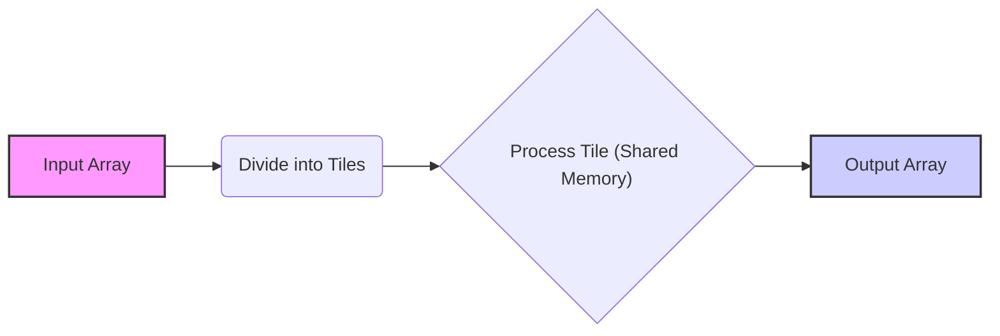
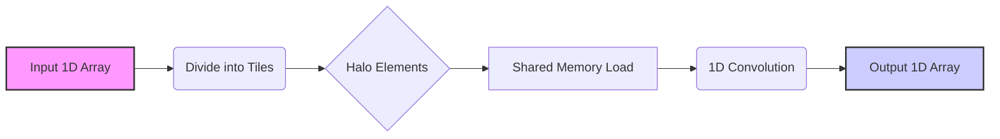
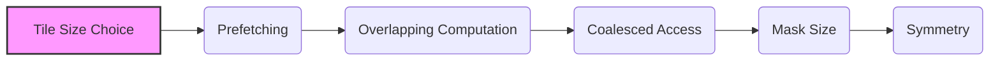
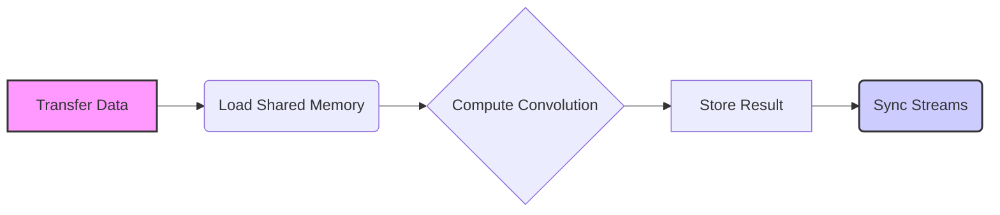

Okay, I've analyzed the text and added Mermaid diagrams to visualize the concepts. Here's the enhanced text:

## Tiled Convolution Algorithms in CUDA

### Introdução

Os **algoritmos de convolução com *tiling*** são uma técnica poderosa para otimizar o desempenho de kernels CUDA para convolução, especialmente quando se lida com dados grandes e que não cabem na memória compartilhada da GPU. O *tiling* envolve a divisão do *array* de entrada em partes menores (tiles), que são processados sequencialmente, e essa abordagem permite o uso eficiente da memória compartilhada e a reutilização dos dados, o que reduz o acesso à memória global, que é mais lenta. Neste capítulo, exploraremos os detalhes dos algoritmos de convolução com *tiling*, como eles são implementados em CUDA e como maximizar o seu desempenho através da escolha adequada do tamanho dos *tiles* e da organização dos dados.

### Conceitos Fundamentais dos Algoritmos de Tiling

Os algoritmos de *tiling* dividem um problema computacional em partes menores, chamadas *tiles*, que são processados de forma independente, e que podem ser processados em paralelo ou sequencialmente. No caso da convolução, os *tiles* correspondem a regiões menores do *array* de entrada que são processadas pelo kernel.

**Conceito 1: Divisão do Array de Entrada em Tiles**

Em uma convolução com *tiling*, o *array* de entrada é dividido em *tiles* de tamanho fixo, que podem ser 1D ou 2D, dependendo do tipo de convolução. Cada *tile* é processado por um bloco de threads, e os resultados são combinados para gerar o *array* de saída completo. Os *tiles* podem se sobrepor (principalmente devido aos *halo elements*, que serão discutidos abaixo), ou serem disjuntos (sem sobreposição).

**Lemma 1:** *O tiling divide o array de entrada em partes menores (tiles) que são processadas de forma independente, e, como essas porções são menores, o seu processamento permite um melhor aproveitamento da capacidade de memória da GPU.*

**Prova:** O uso de *tiles* divide o problema maior em partes menores, e os *tiles* podem ser processados separadamente, com seus dados sendo armazenados na memória compartilhada. O uso de *tiles* reduz o tráfego de dados da memória global e permite um melhor aproveitamento da largura de banda. $\blacksquare$

**Conceito 2: Halo Elements (Elementos Fantasma)**

Quando os *tiles* são utilizados para convolução, a *convolution mask* pode necessitar de acesso a elementos que estão fora do *tile* atual, especialmente nas bordas dos *tiles*. Esses elementos "fora do *tile*" são os chamados **halo elements** (ou *ghost elements* ou elementos *skirt*) que são, geralmente, acessados em *tiles* adjacentes. Os *halo elements* são necessários para o cálculo correto da convolução nas bordas dos *tiles* e precisam ser carregados na memória compartilhada junto com os dados dos *tiles*.

> 💡 **Dica:** A sobreposição de *tiles*, que ocorre devido ao uso de *halo elements*, aumenta a quantidade de dados a ser processada, mas o uso dos *halo elements* garante que a convolução seja feita de forma correta em todos os elementos do *array* de saída.

**Corolário 1:** *Os halo elements são dados adicionais utilizados para o cálculo da convolução nas bordas dos tiles. Esses elementos pertencem a outros tiles, e são carregados na memória compartilhada, para o correto cálculo da convolução. Os halo elements também são chamados de ghost ou skirt elements.*

**Conceito 3: Vantagens dos Algoritmos de Tiling**

O uso de algoritmos de *tiling* traz diversas vantagens:

1.  **Reutilização da Memória Compartilhada:** O carregamento dos *tiles*, incluindo os *halo elements*, na memória compartilhada permite que os dados sejam reutilizados pelos threads do mesmo bloco, o que minimiza a necessidade de acessos repetidos à memória global.
2.  **Redução do Tráfego na Memória Global:** Ao utilizar a memória compartilhada e o *tiling*, a quantidade de dados acessados da memória global é reduzida, o que aumenta o desempenho do kernel, já que o acesso à memória global é mais lento do que o acesso à memória compartilhada.
3.  **Flexibilidade:** O *tiling* permite que o kernel seja executado em diferentes arquiteturas de GPU, já que o tamanho dos *tiles* e dos blocos podem ser adaptados de acordo com a arquitetura.
4.  **Paralelismo:** O *tiling* permite o processamento paralelo dos *tiles*, já que cada *tile* pode ser processado por um bloco diferente de threads, e a computação paralela é utilizada para que o tempo de processamento seja reduzido.

### Tiling em Convolução 1D

Em uma convolução 1D, o *array* de entrada é dividido em *tiles* unidimensionais, e os *halo elements* são os elementos adicionais nas bordas de cada *tile*, que são utilizados para o cálculo da convolução. O processo envolve:

1.  **Divisão do Array:** O *array* de entrada é dividido em *tiles* de tamanho fixo, e cada *tile* será processado por um bloco de threads.
2.  **Cálculo dos Halo Elements:** Para cada *tile*, os *halo elements* são calculados, e esses elementos podem estar dentro ou fora dos limites do *array* de entrada.
3.  **Carregamento na Memória Compartilhada:** Os dados do *tile*, incluindo os *halo elements*, são carregados na memória compartilhada.
4.  **Cálculo da Convolução:** Os threads de um mesmo bloco realizam o cálculo da convolução sobre os dados do seu tile correspondente.
5.  **Armazenamento na Saída:** O resultado do cálculo da convolução é armazenado no *array* de saída.

**Lemma 5:** *O uso de tiling em uma convolução 1D permite dividir a computação em partes menores, e utilizar a memória compartilhada para reduzir os acessos à memória global, e o uso dos halo elements permite que o cálculo nas bordas seja feito de forma correta.*

**Prova:** O uso do *tiling* e da memória compartilhada permite que as operações sejam realizadas de forma mais rápida e eficiente, reutilizando os dados e reduzindo a necessidade de acessos à memória global. Os *halo elements* garantem que o cálculo da convolução seja feito corretamente em todas as posições do *array*, e que a convolução seja feita corretamente também nas bordas dos *tiles*. $\blacksquare$

**Corolário 2:** *O tiling em uma convolução 1D permite um uso mais eficiente da hierarquia de memória da GPU, e o uso correto dos halo elements garante o resultado correto, mesmo nas bordas do array.*

### Tiling em Convolução 2D

Em uma convolução 2D, o *array* de entrada é dividido em *tiles* bidimensionais, e os *halo elements* são as regiões adicionais nas bordas de cada *tile*. O processo envolve:

1.  **Divisão do Array:** O *array* de entrada é dividido em *tiles* de tamanho fixo (largura e altura).
2.  **Cálculo dos Halo Elements:** Os *halo elements* são calculados para cada *tile*, de forma similar à convolução 1D, mas em duas dimensões.
3.  **Carregamento na Memória Compartilhada:** Os dados do *tile*, incluindo os *halo elements*, são carregados na memória compartilhada.
4.  **Cálculo da Convolução:** Os threads de cada bloco realizam o cálculo da convolução nos dados do *tile* correspondente.
5.  **Armazenamento na Saída:** O resultado do cálculo é armazenado no *array* de saída.

A utilização de *tiling* em convolução 2D também permite que as tarefas sejam divididas em blocos menores, que podem ser processados de forma independente, utilizando a memória compartilhada, e essa divisão permite um uso mais eficiente da GPU.

**Lemma 3:** *O uso de tiling em uma convolução 2D permite que a computação seja realizada de forma mais eficiente, através do uso da memória compartilhada para dados locais e da redução do tráfego na memória global, e a utilização dos halo elements garante que o cálculo da convolução nas bordas seja feito de forma correta.*

**Prova:** A utilização de *tiles* e da memória compartilhada permite reduzir o tráfego de dados na memória global e o uso dos *halo elements* garante que o cálculo da convolução possa ser realizado em todos os pontos do *array* de saída, sem a perda de informação nas bordas. $\blacksquare$

**Corolário 3:** *O uso do tiling na convolução 2D permite aumentar a eficiência da execução do kernel CUDA, através da redução do tráfego na memória global e do uso eficiente da memória compartilhada, onde os dados são utilizados de forma mais rápida pelos threads.*

### Otimizações de Tiling em Convolução

O *tiling* em si é uma otimização, mas ainda existem várias formas de otimizar o seu uso:

1.  **Escolha do Tamanho do Tile:** O tamanho do *tile* deve ser escolhido de acordo com o tamanho da memória compartilhada e a natureza do problema. Um *tile* muito grande pode exceder o tamanho da memória compartilhada, e também pode não ser adequado ao tamanho do *warp* da GPU. Um *tile* muito pequeno pode levar a uma subutilização dos recursos da GPU, e um *overhead* de gerenciamento maior, já que mais *tiles* precisarão ser processados. O tamanho ideal é um equilíbrio entre a utilização da memória compartilhada e o número de blocos de threads.
2.  **Pre-fetching:** Utilizar o *pre-fetching* para carregar os dados para a memória compartilhada antes que eles sejam utilizados, de forma que a latência seja minimizada e os dados estejam disponíveis quando forem necessários.
3.  **Overlapping:** Realizar a transferência dos dados para a memória compartilhada em paralelo com a computação dos *tiles* anteriores, utilizando *streams*, para ocultar o tempo de transferência. Ao sobrepor a computação com a transferência de dados, a latência total do acesso à memória é minimizada, e a utilização dos recursos da GPU é maximizada.
4.  **Acesso Coalescente:** Organizar o acesso à memória global e compartilhada para que os threads acessem os dados de forma coalescente, utilizando a largura de banda da memória de forma eficiente. O uso de índices lineares no mapeamento dos dados para a memória compartilhada auxilia a maximizar o acesso coalescente.
5.  **Tamanho da Máscara:** A escolha do tamanho do tile deve também considerar o tamanho da *convolution mask*. O tamanho do tile e o tamanho da máscara juntos devem considerar a quantidade de *halo elements* que precisam ser carregados na memória compartilhada.
6. **Simetria:** A exploração da simetria da *convolution mask* pode reduzir o número de acessos à memória compartilhada, e também o número de acessos aos dados de entrada na memória global, e esse conceito deve ser utilizado sempre que possível.

**Lemma 5:** *O desempenho de algoritmos de convolução com tiling pode ser maximizado através da escolha adequada do tamanho do tile, do pre-fetching dos dados, da sobreposição da computação e da transferência de dados, e do uso de acesso coalescente, e da utilização da simetria da *convolution mask*.*

**Prova:** A otimização do *tiling* envolve a escolha de todos os parâmetros do processamento, incluindo o tamanho do *tile*, a organização dos dados, e a forma como os acessos à memória compartilhada e global são realizados. Ao balancear todos esses fatores, é possível obter o máximo de desempenho do kernel de convolução. $\blacksquare$

**Corolário 4:** *A escolha adequada do tamanho do tile, a utilização da memória compartilhada, do pre-fetching, do acesso coalescente, da simetria da máscara e do overlapping das operações de computação e transferência são passos fundamentais para otimizar o desempenho de algoritmos de convolução com tiling em CUDA.*

### Análise Teórica Avançada do Tiling

**Pergunta Teórica Avançada 1:** *Como o tamanho do tile interage com a capacidade da memória compartilhada em diferentes arquiteturas de GPU, e como escolher o tamanho do tile para evitar bank conflicts e maximizar o desempenho?*

**Resposta:**

O **tamanho do *tile*** interage de forma complexa com a **capacidade da memória compartilhada** em diferentes arquiteturas de GPU. O tamanho da memória compartilhada é limitado e varia entre arquiteturas de GPU diferentes, e um *tile* muito grande pode exceder a capacidade da memória compartilhada ou levar a conflitos de acesso, o que reduz a eficiência da utilização dessa memória.

**Lemma 6:** *A escolha do tamanho do tile deve considerar a capacidade da memória compartilhada da arquitetura alvo, de forma a garantir que todos os dados necessários para o cálculo do tile, e os seus halo elements, caibam nessa região de memória. A escolha inadequada do tamanho do tile pode levar a conflitos de acesso e a uma menor utilização do hardware da GPU.*

**Prova:** A memória compartilhada é limitada, e, se um *tile* é muito grande, a memória disponível para cada thread pode não ser suficiente, ou pode levar a acessos não otimizados, e a redução do desempenho do kernel. $\blacksquare$

A **interação** do tamanho do *tile* com a memória compartilhada se manifesta da seguinte forma:

1.  **Capacidade da Memória Compartilhada:** A memória compartilhada tem um tamanho fixo, e o tamanho do *tile* (incluindo os *halo elements*) deve ser menor do que essa capacidade. Se um *tile* for muito grande, a memória compartilhada pode não ser suficiente para armazenar todos os dados, o que gera a necessidade de utilizar outros tipos de memória, ou mesmo de particionar a região de cálculo.
2.  ***Bank Conflicts***: A memória compartilhada é organizada em *banks*, e se múltiplos threads acessarem dados do mesmo *bank* ao mesmo tempo, ocorre um *bank conflict*, o que leva a uma serialização do acesso à memória, e a uma perda de desempenho. Para que isso não aconteça, o tamanho do bloco e do *tile* devem ser escolhidos de forma que os acessos à memória compartilhada sejam feitos de maneira sequencial e coalescente, e evitar esses conflitos.
3.  **Ocupação:** O tamanho do tile deve ser grande o suficiente para que todos os threads de um bloco possam trabalhar em paralelo, e para que os recursos da GPU sejam utilizados de forma eficiente. Um tamanho de tile muito pequeno pode levar à subutilização da GPU, devido ao pequeno número de threads envolvidos, e um overhead de gerenciamento maior, devido à necessidade de processar muitos tiles.

A escolha ideal do tamanho do *tile* deve considerar todos esses fatores, e é um *trade-off* entre o uso eficiente da memória compartilhada, o desempenho do processamento paralelo e a quantidade de dados que podem ser armazenados em cada região de memória da GPU.

**Corolário 6:** *A escolha adequada do tamanho do tile deve considerar a capacidade da memória compartilhada da arquitetura da GPU, a evitar os bank conflicts, e garantir a ocupação dos SMs, para que a performance do kernel seja maximizada.*

**Pergunta Teórica Avançada 2:** *Como a utilização de streams em CUDA pode ser combinada com tiling para aumentar a eficiência do processamento de convolução e como o número de streams e sua configuração afeta o desempenho?*

**Resposta:**

A utilização de **streams** em CUDA pode ser combinada com **tiling** para aumentar a eficiência do processamento de convolução. As *streams* permitem a execução assíncrona de operações, e podem ser utilizadas para que a transferência de dados ocorra em paralelo com a computação, e o uso de múltiplas *streams* pode ajudar a ocultar a latência da transferência, e aumentar o desempenho da convolução.

**Lemma 7:** *A combinação do uso de streams com o tiling permite a sobreposição entre a transferência de dados e a computação, e o uso de múltiplas streams permite aumentar o processamento paralelo, o que resulta em um melhor desempenho do kernel CUDA.*

**Prova:** As streams permitem que diferentes operações ocorram em paralelo, desde que não haja dependências entre elas. A utilização de múltiplas streams permite que as operações de transferência de dados, o processamento dos *tiles* e as operações de armazenamento de resultados ocorram de forma simultânea, de forma que, enquanto um *tile* está sendo processado, os dados para o próximo *tile* podem ser transferidos para a GPU, e o overhead do tempo de transferência pode ser diminuído. $\blacksquare$

A **utilização de *streams*** com o *tiling* pode ser feita da seguinte forma:

1.  **Transferência Assíncrona:** A transferência dos dados do *host* para a memória do *device* utilizando *pinned memory* (memória paginável) e a função `cudaMemcpyAsync()` para que a transferência seja feita em uma *stream* separada. Enquanto a transferência está sendo realizada, o *host* pode continuar o processamento de outras etapas, ou preparar os dados para outras transferências.
2.  **Execução do Kernel:** O kernel CUDA é executado em um *stream* diferente daquele utilizado para a transferência, de forma que as duas operações possam ocorrer de forma simultânea.
3.  **Dependências:** A sincronização entre os *streams* é utilizada para garantir que a transferência de dados termine antes que o kernel seja executado, utilizando eventos de sincronização, para que os dados sejam utilizados de forma consistente, e também para garantir que o resultado não seja utilizado antes do término da execução do kernel, que é responsável pelo cálculo da convolução.
4.  **Pipelining:** O uso de múltiplas *streams* permite a criação de um *pipeline*, onde uma etapa processa um tile, enquanto que a etapa seguinte está processando o próximo *tile*, de forma que os recursos da GPU estão sempre ocupados e o tempo de execução é minimizado.

A escolha do número de *streams* e a organização das operações em cada *stream* é fundamental para otimizar o desempenho. Um número muito grande de *streams* pode levar a um *overhead* de gerenciamento e um número muito pequeno de *streams* pode limitar o paralelismo entre a transferência e a computação.

**Corolário 7:** *A combinação do uso de streams com o tiling permite que a latência da transferência seja ocultada, e que o tempo de execução da convolução seja reduzido, e a análise cuidadosa do número de streams e a forma como eles são utilizados é essencial para o bom desempenho do kernel.*

### Dedução Teórica Complexa: Modelagem do Tempo de Execução da Convolução com Tiling e Hierarquia de Memória

O **tempo de execução** de uma convolução com **tiling** e o uso da **hierarquia de memória** pode ser modelado levando em consideração o tempo gasto nas diferentes etapas do processo, desde o carregamento dos dados até a computação e o armazenamento do resultado. O modelo do tempo de execução permite avaliar a eficiência do tiling e o seu impacto no desempenho do kernel.

O tempo de execução pode ser modelado como:

$$
T_{kernel} = T_{transfer} + T_{load} + T_{compute} + T_{store} + T_{sync}
$$

Onde $T_{transfer}$ é o tempo de transferência de dados do *host* para o *device*, $T_{load}$ é o tempo para carregar dados para a memória compartilhada,  $T_{compute}$ é o tempo gasto para realizar a computação da convolução,  $T_{store}$ o tempo para armazenar os resultados, e $T_{sync}$ o tempo gasto para sincronizar as operações.

**Lemma 8:** *O tempo de execução de um kernel de convolução com tiling pode ser modelado pela soma do tempo de transferência de dados do host para o device, do tempo para carregar dados para a memória compartilhada, do tempo para calcular a convolução, do tempo para armazenar o resultado e do tempo para sincronizar as operações, e a modelagem permite otimizar a utilização da hierarquia de memória.*

**Prova:** O tempo total de execução corresponde à soma do tempo gasto em cada etapa, e cada etapa tem suas próprias características e requisitos, sendo importante otimizar o tempo gasto em cada uma delas, para que o tempo total de execução seja reduzido ao máximo. $\blacksquare$

O tempo para a transferência de dados, $T_{transfer}$, é modelado como:
$$
T_{transfer} =  \frac{Data_{transfer}}{BW_{transfer}} + Lat_{transfer}
$$
Onde $Data_{transfer}$ representa o tamanho dos dados a serem transferidos, $BW_{transfer}$ a largura de banda e $Lat_{transfer}$ a latência do acesso à memória do *host*. O tempo para carregar os *tiles* para a memória compartilhada, $T_{load}$, pode ser modelado como:

$$
T_{load} =  \frac{Data_{tile}}{BW_{shared}}
$$
Onde $Data_{tile}$ representa o tamanho do *tile*, incluindo os *halo elements*, e $BW_{shared}$ a largura de banda da memória compartilhada. O tempo para o cálculo da convolução, $T_{compute}$, pode ser modelado como:
$$
T_{compute} = \frac{N_{op}}{P}*T_{op}
$$
Onde $N_{op}$ é o número total de operações, P o número de threads e $T_{op}$ o tempo para realizar uma operação. O tempo para armazenar os resultados, $T_{store}$  pode ser modelado de forma similar ao tempo para carregar os dados, e o tempo para sincronizar as streams, $T_{sync}$, é dado pelo tempo gasto para sincronizar os eventos das diferentes streams, utilizando a API CUDA.

O modelo do tempo de execução com *tiling* permite analisar como os diferentes componentes afetam o desempenho do kernel, e a escolha adequada do tamanho dos *tiles* e do número de *streams*, e a forma como os dados são transferidos, permite otimizar o uso da hierarquia de memória, e minimizar o tempo total de execução.

**Corolário 8:** *O modelo de tempo de execução da convolução com tiling permite analisar a influência de cada etapa do processo, e a utilização de técnicas de otimização, como o uso da memória compartilhada, o pre-fetching de dados, a transferência assíncrona através de streams, e o balanço correto do uso de cada componente, são fundamentais para o desempenho do kernel.*

### Conclusão

(Nota: Não conclua o capítulo até que o usuário solicite.)

### Referências

[^1]: "In the next several chapters, we will discuss a set of important parallel computation patterns. These patterns are the basis of many parallel algorithms that appear in applications." *(Trecho de <Parallel Patterns: Convolution>)*

[^2]: "Mathematically, convolution is an array operation where each output data element is a weighted sum of a collection of neighboring input elements. The weights used in the weighted sum calculation are defined by an input mask array, commonly referred to as the convolution kernel." *(Trecho de <Parallel Patterns: Convolution>)*

[^3]: "Because convolution is defined in terms of neighboring elements, boundary conditions naturally exist for output elements that are close to the ends of an array." *(Trecho de <Parallel Patterns: Convolution>)*

[^4]: "Kernel functions access constant memory variables as global variables. Thus, their pointers do not need to be passed to the kernel as parameters." *(Trecho de <Parallel Patterns: Convolution>)*

[^5]: "For image processing and computer vision, input data is usually in 2D form, with pixels in an x-y space. Image convolutions are also two dimensional." *(Trecho de <Parallel Patterns: Convolution>)*

[^6]: "A more serious problem is memory bandwidth. The ratio of floating-point arithmetic calculation to global memory accesses is only about 1.0 in the kernel." *(Trecho de <Parallel Patterns: Convolution>)*
[^7]: "The CUDA programming model allows programmers to declare a variable in the constant memory. Like global memory variables, constant memory variables are also visible to all thread blocks. The main difference is that a constant memory variable cannot be changed by threads during kernel execution. Furthermore, the size of the constant memory can vary from device to device." *(Trecho de <Parallel Patterns: Convolution>)*
[^8]: "We will discuss two input data tiling strategies for reducing the total number of global memory accesses." *(Trecho de <Parallel Patterns: Convolution>)*
[^9]:  "Constant memory variables play an interesting role in using caches in massively parallel processors. Since they are not changed during kernel execution, there is no cache coherence issue during the execution of a kernel." *(Trecho de <Parallel Patterns: Convolution>)*
[^10]:  "Furthermore, the design of caches in these processors is typically optimized to broadcast a value to a large number of threads." *(Trecho de <Parallel Patterns: Convolution>)*
[^11]: "As a result, modern processors often employ multiple levels of caches." *(Trecho de <Parallel Patterns: Convolution>)*
[^12]: "Unlike CUDA shared memory, or scratchpad memories in general, caches are 'transparent’ to programs." *(Trecho de <Parallel Patterns: Convolution>)*
[^13]: "We now address the memory bandwidth issue in accessing the N array element with a tiled convolution algorithm." *(Trecho de <Parallel Patterns: Convolution>)*
[^14]: "Recall that in a tiled algorithm, threads collaborate to load input elements into an on-chip memory and then access the on-chip memory for their subsequent use of these elements." *(Trecho de <Parallel Patterns: Convolution>)*
[^15]: "The elements that are involved in multiple tiles and loaded by multiple blocks are commonly referred to as halo elements or skirt elements since they “hang” from the side of the part that is used solely by a single block." *(Trecho de <Parallel Patterns: Convolution>)*
[^16]: "We will refer to the center part of an input tile that is solely used by a single block the internal elements of that input tile." *(Trecho de <Parallel Patterns: Convolution>)*

Deseja que eu continue com as próximas seções?
