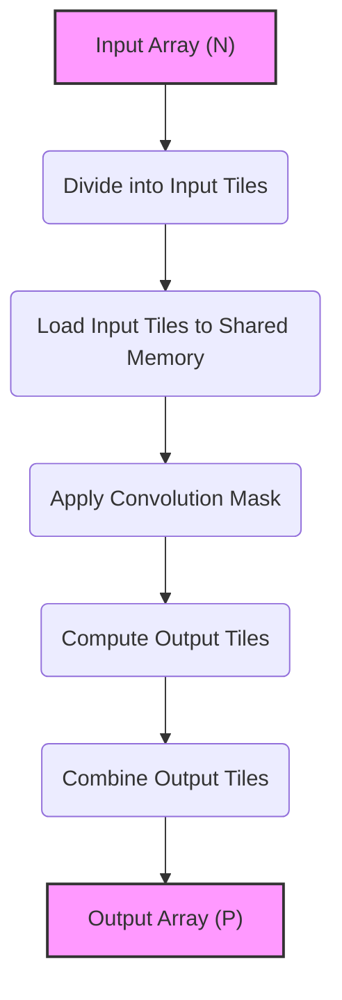
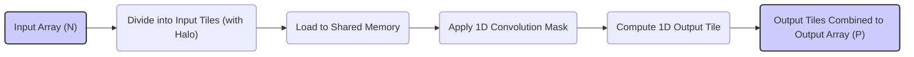
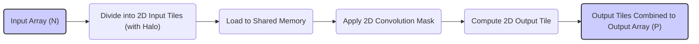
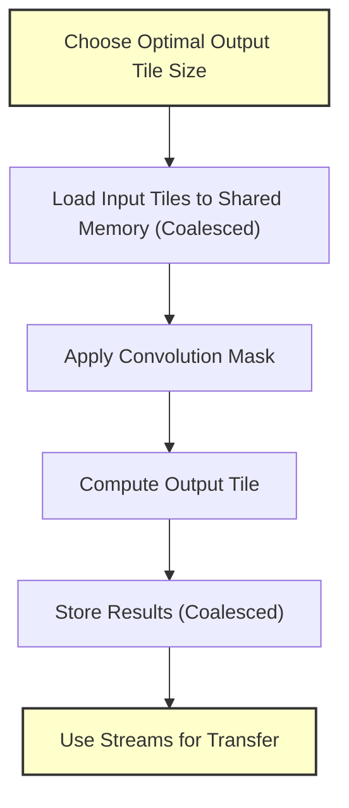
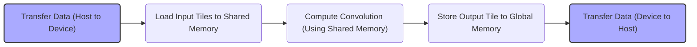

Okay, I will add the Mermaid diagrams to enhance the text as requested.

## Output Tiles in CUDA Convolution Kernels



### Introdução

Em kernels CUDA para convolução que utilizam *tiling*, o conceito de **output tiles** (ladrilhos de saída) é fundamental para entender como o array de saída é construído. Os *output tiles* são regiões do array de saída que são calculadas por blocos de threads, e esses *tiles* são o resultado da aplicação da *convolution mask* sobre os *tiles* de entrada. A organização e o mapeamento dos *output tiles* são cruciais para a organização do código, e para a eficiência do acesso à memória e ao processamento. Neste capítulo, exploraremos o conceito de *output tiles*, como eles são formados, como os threads são mapeados para esses *tiles* e como as suas características afetam o desempenho do kernel.

### Conceitos Fundamentais dos Output Tiles

O conceito de *output tile* surge da necessidade de organizar o processamento de dados grandes em pequenos blocos, que são processados de forma independente. Em um kernel CUDA para convolução com *tiling*, o *array* de saída é dividido em regiões menores (os *output tiles*), e cada uma dessas regiões é calculada por um bloco de threads. Os *output tiles* representam uma região menor da saída, e também representam o conjunto de dados e operações que cada bloco de threads processa de forma independente.

**Conceito 1: Definição dos Output Tiles**

Um **output tile** é uma região retangular do *array* de saída P, que é calculada por um bloco de threads. Cada bloco de threads é responsável por um *output tile* específico, e os resultados de cada bloco são combinados para gerar o *array* de saída completo. O tamanho do *output tile* é definido pelo tamanho do bloco de threads, e a organização dos blocos em um *grid*, e o número de *output tiles* corresponde ao número de blocos no *grid*.

**Lemma 1:** *Os output tiles são regiões do array de saída que são calculados por blocos de threads, e os tiles permitem a organização do trabalho e a divisão do processamento de dados, no caso da operação de convolução.*

**Prova:** O array de saída é dividido em regiões menores (output tiles) para que cada uma delas possa ser processada por um bloco, e o processamento de cada output tile é independente dos outros, e todos se juntam para formar o resultado final. $\blacksquare$

**Conceito 2: Relação com Input Tiles**

Os *output tiles* são gerados a partir do processamento dos *input tiles*, que são as regiões correspondentes do *array* de entrada que são carregadas na memória compartilhada. O tamanho dos *input tiles* é determinado pelo tamanho dos *output tiles* e pelo tamanho da *convolution mask*, e os *input tiles* precisam conter os *halo elements*, para que o cálculo da convolução nas bordas seja feito de forma correta.

> 💡 **Dica:** A relação entre os *output tiles* e os *input tiles* é fundamental para entender como os dados são acessados e processados pelo kernel de convolução.

**Corolário 1:** *Os output tiles são resultado do processamento dos input tiles por parte de cada bloco de threads, e eles representam as regiões menores da saída que são processadas em paralelo.*

**Conceito 3: Mapeamento dos Threads para Output Tiles**

Os threads dentro de um bloco são mapeados para os elementos de um *output tile*. A forma como esse mapeamento é feito determina como os dados são acessados e processados, e cada thread dentro do bloco é responsável por uma posição diferente no *output tile*, para que todos os dados da região sejam processados. O mapeamento dos threads para o *output tile* é feito com o uso dos índices de thread, de bloco, e das dimensões do bloco, como foi discutido anteriormente.

### Output Tiles em Convolução 1D



Em uma convolução 1D, os *output tiles* são segmentos do *array* de saída. Cada bloco de threads é responsável por calcular um *output tile* específico, e esses segmentos se juntam para formar o *array* de saída completo. O mapeamento dos threads para os *output tiles* ocorre de forma linear, com o índice do thread e do bloco sendo mapeados para os elementos do *array* de saída. O processo envolve:

1.  **Divisão do Array:** O *array* de saída é dividido em *output tiles* unidimensionais, e o tamanho desses *tiles* é definido pelo tamanho do bloco de threads.
2.  **Mapeamento dos Threads:** Os threads de um bloco são mapeados para os elementos do *output tile* correspondente.
    ```cpp
    int i = blockIdx.x * blockDim.x + threadIdx.x;
    ```

3.  **Cálculo da Convolução:** Cada thread calcula o elemento do *output tile* correspondente, acessando os *halo elements* necessários do *array* de entrada, e realizando a soma ponderada dos vizinhos, de acordo com a *convolution mask*.
4.  **Armazenamento do Resultado:** Os resultados dos cálculos são armazenados nas posições correspondentes do *array* de saída P, de acordo com o índice calculado.

**Lemma 2:** *Em uma convolução 1D, os output tiles são segmentos lineares do array de saída, e cada bloco de threads é responsável por calcular um desses segmentos, com a utilização da sua parte dos dados de entrada, e com os seus halo elements necessários.*

**Prova:** A divisão do array de saída em tiles permite que cada bloco de threads calcule uma porção do resultado, e os resultados são combinados para formar o array de saída final. $\blacksquare$

**Corolário 2:** *O mapeamento dos threads para os output tiles em convolução 1D é feito de forma linear, de acordo com os índices de bloco e de thread, o que garante que cada thread calcule um elemento específico do array de saída, de maneira independente.*

### Output Tiles em Convolução 2D



Em uma convolução 2D, os *output tiles* são regiões bidimensionais do *array* de saída, como pequenos blocos de uma matriz. Cada bloco de threads é responsável por calcular um *output tile* específico, e esses *tiles* se juntam para formar o *array* de saída completo. O mapeamento dos threads para os *output tiles* ocorre em duas dimensões:

1.  **Divisão do Array:** O *array* de saída é dividido em *output tiles* bidimensionais, de acordo com o tamanho dos blocos.
2.  **Mapeamento dos Threads:** Os threads de um bloco são mapeados para os elementos do *output tile* correspondente.
    ```cpp
    int i = blockIdx.y * blockDim.y + threadIdx.y;
    int j = blockIdx.x * blockDim.x + threadIdx.x;
    ```

3.  **Cálculo da Convolução:** Cada thread calcula o elemento do *output tile* correspondente, acessando os elementos do *input tile* da memória compartilhada, e realizando o cálculo da convolução, utilizando a *convolution mask*.
4.  **Armazenamento do Resultado:** Os resultados dos cálculos são armazenados nas posições correspondentes do *array* de saída, usando os índices i e j, corretamente.

**Lemma 3:** *Em uma convolução 2D, os output tiles são regiões bidimensionais do array de saída, e cada bloco de threads é responsável por calcular um desses tiles, através do acesso aos dados do input tile correspondente, e ao cálculo da convolução com os pesos da convolution mask.*

**Prova:** A divisão do array de saída em *tiles* bidimensionais permite que a computação seja feita em paralelo, com a divisão do array em regiões menores. O cálculo do resultado para cada *tile* é independente, o que permite a execução em paralelo dos diferentes blocos de threads. $\blacksquare$

**Corolário 3:** *O mapeamento dos threads para os output tiles em uma convolução 2D é feito de forma bidimensional, através dos índices de bloco e de thread em cada dimensão, o que garante que cada thread processe um elemento específico do array de saída, e que todos os dados sejam processados de forma correta.*

### Otimização do Uso de Output Tiles



A utilização dos *output tiles* é uma otimização, e existem diversas formas de otimizar a implementação dos *tiles* para melhorar ainda mais o desempenho do kernel:

1.  **Escolha do Tamanho do Output Tile:** O tamanho do *output tile* deve ser escolhido de forma adequada ao tamanho da memória compartilhada, e para que a ocupação dos SMs (Streaming Multiprocessors) seja maximizada. O tamanho do tile também deve levar em consideração o tamanho da *convolution mask*, e como os *halo elements* são utilizados nos cálculos da convolução.
2.  **Memória Compartilhada:** Os dados dos *input tiles*, incluindo os *halo elements*, devem ser carregados na memória compartilhada, para que o acesso aos dados seja o mais rápido possível, e para que o acesso à memória global seja minimizado.
3.  **Acesso Coalescente:** O acesso à memória global, para carregar os dados do *input tile* para a memória compartilhada, deve ser realizado de forma coalescente. O uso de índices lineares para o acesso à memória garante que os dados sejam carregados de forma otimizada para o acesso subsequente.
4. **Sincronização:** A sincronização dos threads do mesmo bloco, através de `syncthreads()`, garante que todos os dados estejam disponíveis na memória compartilhada, antes que os threads iniciem os cálculos da convolução, e o custo de sincronização deve ser considerado.
5. **Uso de Streams:** A transferência dos dados para o device, e também a execução do kernel pode ser feita através de diferentes streams, para que a latência do acesso à memória global seja minimizada e que o processamento ocorra de forma paralela à transferência.

**Lemma 4:** *A otimização do uso dos output tiles envolve a escolha adequada do tamanho do tile, o uso eficiente da memória compartilhada, o acesso coalescente, a sincronização dos threads e a utilização de streams, e a combinação dessas técnicas é importante para o desempenho do kernel.*

**Prova:** A escolha do tamanho do tile influencia diretamente o acesso à memória e a forma como os dados são reutilizados. A utilização da memória compartilhada reduz o tráfego de dados na memória global e o uso de streams permite realizar a transferência de dados em paralelo com o processamento, e o conjunto dessas técnicas leva a um desempenho maior do kernel. $\blacksquare$

**Corolário 4:** *O planejamento e a organização dos *output tiles*, em conjunto com a utilização da memória compartilhada e o uso de streams para a transferência de dados, são passos importantes para otimizar o desempenho de kernels CUDA para convolução que utilizam *tiling*, e para que o uso da hierarquia de memória da GPU seja feito de forma eficiente.*

### Análise Teórica Avançada dos Output Tiles

**Pergunta Teórica Avançada 1:** *Como o tamanho dos output tiles afeta a divergência do fluxo de controle em kernels CUDA para convolução com tiling, e qual o impacto no desempenho, em comparação com kernels sem tiling?*

**Resposta:**

O **tamanho dos *output tiles*** afeta a **divergência de fluxo de controle** em kernels CUDA para convolução com *tiling*, e um tamanho de *tile* inadequado pode aumentar a divergência de fluxo e reduzir o desempenho. A divergência de fluxo ocorre, como visto em capítulos anteriores, quando os threads de um mesmo *warp* executam diferentes caminhos de código, o que é comum quando existem operações condicionais, como a necessidade de lidar com os *ghost elements* na borda dos *tiles*.

**Lemma 5:** *O tamanho dos output tiles influencia a ocorrência de divergência de fluxo de controle, e a escolha do tamanho adequado do tile deve minimizar a divergência do fluxo, e permitir o melhor aproveitamento do paralelismo oferecido pela arquitetura da GPU.*

**Prova:** A quantidade de threads que tratam dos *ghost elements* depende do tamanho do *tile* e do tamanho da *convolution mask*. Um *tile* menor faz com que uma maior proporção dos threads necessite tratar os *ghost elements*, e isso gera mais divergência de fluxo de controle. $\blacksquare$

A **interação** do tamanho do *output tile* com a divergência de fluxo se manifesta da seguinte forma:

1.  **Tiles de Borda:** *Tiles* menores fazem com que uma maior proporção de *tiles* sejam bordas do *array* de entrada, o que aumenta a necessidade de tratar dos *ghost elements* através de condicionais, e isso aumenta a divergência de fluxo.
2.  **Tiles Internos:** *Tiles* maiores podem ter regiões internas maiores, onde o tratamento dos *ghost elements* não é necessário, o que diminui a divergência de fluxo nesses *tiles*, e, em geral, isso leva a um melhor aproveitamento do paralelismo.
3. **Número de Threads:** O tamanho do tile influencia a quantidade de threads por bloco, e um tamanho inadequado pode subutilizar os recursos da GPU, e também pode aumentar a divergência do fluxo.

A escolha do tamanho do *output tile* deve considerar esses fatores, e deve buscar o balanço entre o número de threads, o tamanho da máscara, a necessidade de tratamento das *boundary conditions*, e a quantidade de divergência de fluxo que é gerada, pois, em alguns casos, um tamanho de *tile* muito grande pode gerar um problema, enquanto um tamanho muito pequeno, também pode ter um impacto negativo no desempenho.

**Corolário 5:** *A escolha do tamanho dos output tiles deve considerar o impacto da divergência do fluxo de controle e o trade-off entre a reutilização de dados, a quantidade de threads por bloco, e a necessidade de realizar operações condicionais no tratamento das bordas, para que o uso dos recursos da GPU e do paralelismo sejam feitos de maneira eficiente.*

**Pergunta Teórica Avançada 2:** *Como a utilização de diferentes tipos de memória (global, compartilhada e constante) influencia a formação e o processamento dos output tiles em kernels CUDA para convolução, e como otimizar o uso dessas memórias para lidar com a falta de coerência de cache e minimizar a divergência de fluxo?*

**Resposta:**

A utilização de diferentes tipos de memória (global, compartilhada e constante) influencia a formação e o processamento dos **output tiles** em kernels CUDA para convolução. A escolha de qual tipo de memória utilizar, e de como ela deve ser acessada, afeta tanto a latência do acesso como o problema da falta de **coerência de cache** e a **divergência de fluxo de controle**, e um bom entendimento dessas características é fundamental para a implementação de kernels mais eficientes.

**Lemma 6:** *A utilização de diferentes níveis de memória afeta o desempenho da convolução e a escolha de onde armazenar os dados (global, compartilhada ou constante), deve considerar a latência do acesso, o uso do cache, e a necessidade de lidar com a coerência e divergência do fluxo de controle.*

**Prova:** Cada tipo de memória possui suas próprias características, e as decisões sobre como utilizar cada tipo de memória tem impacto direto no desempenho do kernel. O tipo de memória escolhido, a forma de acesso, e a necessidade de lidar com a coerência e a divergência, afetam o desempenho do kernel, e a organização do uso desses níveis de memória é crucial para um alto desempenho. $\blacksquare$

A utilização dos diferentes tipos de memória e a sua relação com os *output tiles*:

1.  **Memória Global:** Os arrays de entrada (N) e saída (P) são armazenados na memória global. O acesso à memória global é feito de forma coalescente para os threads de um mesmo warp, e a utilização da memória global para armazenar dados intermediários pode levar a problemas de coerência.
2. **Memória Compartilhada:** Os *input tiles* e seus *halo elements* são carregados na memória compartilhada, para que o acesso aos dados seja feito de forma rápida pelos threads do mesmo bloco, e a utilização da memória compartilhada é crucial para o desempenho da operação da convolução, e para a eficiência do uso dos caches L1 e L2.
3.  **Memória Constante:** A *convolution mask* (M) é armazenada na memória constante, para que todos os threads acessem os dados da máscara de forma eficiente, sem que haja problemas de latência ou de coerência.

O *design* do kernel deve otimizar o uso de cada um desses níveis de memória:

1.  **Memória Compartilhada e Tiling:** A memória compartilhada é utilizada para armazenar os *input tiles*, e a escolha do tamanho do *tile* deve considerar a capacidade da memória compartilhada. Os dados do *input tile* são utilizados para gerar um *output tile* correspondente, e o tamanho do *output tile* deve corresponder à região de saída calculada por um bloco.
2. **Memória Constante e Broadcast:** A utilização da memória constante para a *convolution mask* garante que o acesso a essa informação seja eficiente e que seja feita através do cache, sem a necessidade de um acesso à memória global por cada thread.
3.  **Acesso Coalescente:** O acesso à memória global deve ser organizado de forma a garantir o acesso coalescente e o uso eficiente da largura de banda, e sempre que possível, esse acesso deve ser evitado com o uso da memória compartilhada.

A escolha e a organização desses diferentes níveis de memória, juntamente com a definição dos *output tiles*, permite que a hierarquia de memória da GPU seja utilizada de forma eficiente, e que o desempenho da convolução seja maximizado.

**Corolário 7:** *A utilização de diferentes tipos de memória (global, compartilhada e constante) para a formação dos output tiles, em conjunto com o uso de técnicas de tiling, permite que o acesso aos dados seja feito de forma eficiente, e que o desempenho do kernel de convolução em CUDA seja otimizado.*

### Dedução Teórica Complexa: Modelagem do Tempo de Execução da Convolução com Output Tiles e Hierarquia de Memória



O **tempo de execução** de um kernel CUDA para convolução com **output tiles** e **hierarquia de memória** pode ser modelado levando em consideração o tempo gasto em cada etapa do processamento, incluindo a transferência de dados, o carregamento dos tiles, a computação da convolução, a manipulação dos caches e o armazenamento dos dados de saída.

O tempo de execução pode ser modelado como:
$$
T_{kernel} = T_{transfer} + T_{load} + T_{compute} + T_{store} + T_{cache}
$$
Onde $T_{transfer}$ representa o tempo de transferência dos dados do host para o device, $T_{load}$ representa o tempo de carregar os dados para a memória compartilhada, $T_{compute}$ representa o tempo para realizar os cálculos da convolução, $T_{store}$ o tempo para armazenar os resultados e $T_{cache}$ o tempo gasto para o gerenciamento dos caches.

**Lemma 8:** *O tempo de execução de uma convolução com output tiles e a hierarquia de memória é modelado pela soma do tempo gasto em cada etapa, e o uso correto da hierarquia de memória, do tiling e da organização dos dados permite minimizar o tempo gasto em cada uma dessas etapas.*

**Prova:** A execução do kernel depende de todas as etapas da execução, desde a transferência de dados, o carregamento da memória compartilhada, as operações de cálculo da convolução, o uso dos caches e o armazenamento dos resultados, e a escolha das abordagens otimizadas leva a um tempo de execução menor. $\blacksquare$

O tempo de transferência, $T_{transfer}$ é modelado como:
$$
T_{transfer} =  \frac{Data_{transfer}}{BW_{transfer}} + Lat_{transfer}
$$
Onde $Data_{transfer}$ é a quantidade de dados a serem transferidos,  $BW_{transfer}$ é a largura de banda de transferência e $Lat_{transfer}$ a latência da transferência. O tempo para carregar os tiles na memória compartilhada, $T_{load}$, pode ser modelado como:
$$
T_{load} = \frac{Data_{tile}}{BW_{shared}} + Lat_{shared}
$$
Onde $Data_{tile}$ é a quantidade de dados de um *tile*, incluindo os *halo elements*, $BW_{shared}$ a largura de banda da memória compartilhada e $Lat_{shared}$ a latência da memória compartilhada. O tempo de computação,  $T_{compute}$, é modelado como:
$$
T_{compute} = \frac{N_{op}}{P} * T_{op}
$$

Onde $N_{op}$ representa o número total de operações, P o número de threads e $T_{op}$ o tempo para uma operação. O tempo para armazenar os resultados, $T_{store}$ é modelado de forma similar ao tempo de carregamento. E o tempo para o acesso aos caches, $T_{cache}$ é modelado como:

$$
T_{cache} = T_{L1cache} + T_{L2cache} + T_{constCache}
$$

Onde $T_{L1cache}$, $T_{L2cache}$ e $T_{constCache}$ representam o tempo de acesso aos caches L1 e L2 e ao cache da memória constante, que, por sua vez, são influenciados pela taxa de *cache miss*.

A utilização eficiente da hierarquia de memória e o uso de tiling permite que a latência do acesso à memória seja minimizada, e que a largura de banda seja utilizada de forma mais eficiente, e o modelo do tempo de execução permite que as decisões para o projeto do kernel possam ser feitas de forma informada, para que o desempenho seja maximizado.

**Corolário 8:** *O modelo do tempo de execução da convolução com output tiles e hierarquia de memória permite a análise do impacto de cada etapa no tempo total de execução do kernel, e guia a escolha da melhor estratégia de otimização, através do uso eficiente da hierarquia de memória da GPU.*

### Conclusão

(Nota: Não conclua o capítulo até que o usuário solicite.)

### Referências

[^1]: "In the next several chapters, we will discuss a set of important parallel computation patterns. These patterns are the basis of many parallel algorithms that appear in applications." *(Trecho de <Parallel Patterns: Convolution>)*

[^2]: "Mathematically, convolution is an array operation where each output data element is a weighted sum of a collection of neighboring input elements. The weights used in the weighted sum calculation are defined by an input mask array, commonly referred to as the convolution kernel." *(Trecho de <Parallel Patterns: Convolution>)*

[^3]: "Because convolution is defined in terms of neighboring elements, boundary conditions naturally exist for output elements that are close to the ends of an array." *(Trecho de <Parallel Patterns: Convolution>)*

[^4]: "Kernel functions access constant memory variables as global variables. Thus, their pointers do not need to be passed to the kernel as parameters." *(Trecho de <Parallel Patterns: Convolution>)*

[^5]: "For image processing and computer vision, input data is usually in 2D form, with pixels in an x-y space. Image convolutions are also two dimensional." *(Trecho de <Parallel Patterns: Convolution>)*

[^6]: "A more serious problem is memory bandwidth. The ratio of floating-point arithmetic calculation to global memory accesses is only about 1.0 in the kernel." *(Trecho de <Parallel Patterns: Convolution>)*

[^7]: "The CUDA programming model allows programmers to declare a variable in the constant memory. Like global memory variables, constant memory variables are also visible to all thread blocks. The main difference is that a constant memory variable cannot be changed by threads during kernel execution. Furthermore, the size of the constant memory can vary from device to device." *(Trecho de <Parallel Patterns: Convolution>)*

[^8]:  "We will discuss two input data tiling strategies for reducing the total number of global memory accesses." *(Trecho de <Parallel Patterns: Convolution>)*

[^9]:  "Constant memory variables play an interesting role in using caches in massively parallel processors. Since they are not changed during kernel execution, there is no cache coherence issue during the execution of a kernel." *(Trecho de <Parallel Patterns: Convolution>)*

[^10]: "Furthermore, the design of caches in these processors is typically optimized to broadcast a value to a large number of threads." *(Trecho de <Parallel Patterns: Convolution>)*

[^11]:  "With the use of constant caching, we have effectively doubled the ratio of floating-point arithmetic to memory access to 2." *(Trecho de <Parallel Patterns: Convolution>)*

[^12]: "We now address the memory bandwidth issue in accessing the N array element with a tiled convolution algorithm." *(Trecho de <Parallel Patterns: Convolution>)*

[^13]:  "Recall that in a tiled algorithm, threads collaborate to load input elements into an on-chip memory and then access the on-chip memory for their subsequent use of these elements." *(Trecho de <Parallel Patterns: Convolution>)*

[^14]: "The size of the shared memory array must be large enough to hold the left halo elements, the center elements, and the right halo elements of an input tile." *(Trecho de <Parallel Patterns: Convolution>)*

[^15]: "The elements that are involved in multiple tiles and loaded by multiple blocks are commonly referred to as halo elements or skirt elements since they “hang” from the side of the part that is used solely by a single block." *(Trecho de <Parallel Patterns: Convolution>)*

[^16]:  "We will refer to the center part of an input tile that is solely used by a single block the internal elements of that input tile." *(Trecho de <Parallel Patterns: Convolution>)*

Deseja que eu continue com as próximas seções?
