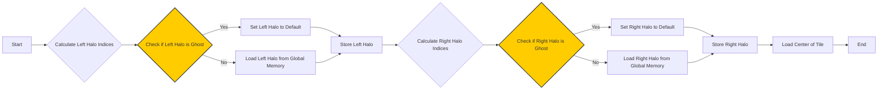

Okay, I will enhance the provided text with Mermaid diagrams to visualize the concepts.

## Halo Loading Logic in CUDA Convolution Kernels

```mermaid
  flowchart LR
      A[Start] --> B{Identify Halo Elements};
      B --> C[Calculate Global Memory Indices];
      C --> D{Load Elements to Shared Memory};
      D --> E{Handle Ghost Elements (Conditional)};
      E --> F[End];
      style B fill:#f9f,stroke:#333,stroke-width:2px
      style D fill:#ccf,stroke:#333,stroke-width:2px
```

### Introdução

Em kernels CUDA para convolução com *tiling*, a lógica de carregamento dos **halo elements** (também conhecidos como *ghost elements* ou elementos *skirt*) na memória compartilhada é uma parte crucial para o correto funcionamento do kernel e para a utilização eficiente dos recursos da GPU. Como visto em capítulos anteriores, os *halo elements* são elementos adicionais que estendem os *tiles* para fora das suas bordas, e que são necessários para que a convolução possa ser realizada de forma correta nas bordas dos *tiles*, e a implementação dessa lógica de carregamento deve garantir que os dados sejam carregados de forma eficiente e consistente. Neste capítulo, exploraremos em detalhes como a lógica de carregamento dos *halo elements* funciona, como ela é implementada em kernels CUDA, e como otimizar o seu uso para aumentar o desempenho do kernel.

### Funcionamento da Lógica de Carregamento dos Halo Elements

A lógica de carregamento dos *halo elements* envolve a identificação dos elementos que precisam ser carregados, o cálculo dos seus índices na memória global, e o carregamento desses elementos para a memória compartilhada. Essa operação é feita de forma colaborativa entre os threads de um mesmo bloco, e o uso correto dos índices, e de instruções condicionais é fundamental para que todos os elementos sejam carregados corretamente.

**Conceito 1: Cálculo dos Índices dos Halo Elements**

O primeiro passo para o carregamento dos *halo elements* envolve o cálculo dos seus índices na memória global. Esses índices são calculados a partir dos índices de bloco e de thread, e dos tamanhos do *tile* e da *convolution mask*, e existem diferentes cálculos para os *halo elements* à esquerda e à direita do *tile*, em convoluções 1D, e para as bordas superior, inferior, esquerda e direita, em convoluções 2D.

**Lemma 1:** *O cálculo correto dos índices dos halo elements é fundamental para garantir que os dados apropriados sejam carregados da memória global para a memória compartilhada. Os cálculos devem levar em consideração a posição do tile, o tamanho da máscara, e as dimensões do bloco.*

**Prova:** O cálculo dos índices dos *halo elements* é essencial para que o acesso aos dados da memória global seja realizado de forma correta, e os dados sejam colocados na posição apropriada da memória compartilhada. O cálculo dos índices também deve considerar os *ghost elements*, que correspondem a elementos fora dos limites do array. $\blacksquare$

**Conceito 2: Carregamento Colaborativo pelos Threads**
```mermaid
sequenceDiagram
    participant Thread 1
    participant Thread 2
    participant ...
    participant Thread N
    participant Shared Memory
    Thread 1 ->> Shared Memory: Load Halo Element Part 1
    Thread 2 ->> Shared Memory: Load Halo Element Part 2
    ...
    Thread N ->> Shared Memory: Load Halo Element Part N
    Note over Thread 1, Thread N: Collaborative Loading
```
O carregamento dos *halo elements* para a memória compartilhada é feito de forma colaborativa pelos threads de um bloco. Cada thread é responsável por carregar uma ou mais partes dos *halo elements* para a memória compartilhada, para que todos os dados necessários estejam presentes na memória, para o processamento posterior da convolução. Essa colaboração entre os threads deve garantir que todos os *halo elements* sejam carregados de forma eficiente, e que a capacidade de largura de banda da memória seja utilizada da melhor maneira possível.

> ❗ **Ponto de Atenção:** A ordem de carregamento e o número de threads envolvidos nessa operação devem garantir que todos os dados sejam corretamente carregados na memória compartilhada, e que a capacidade da memória seja utilizada de forma eficiente, e sem a necessidade de que todos os threads tenham que carregar todos os elementos.

**Corolário 1:** *O carregamento dos halo elements na memória compartilhada é uma operação colaborativa, onde os threads trabalham em conjunto para carregar todos os dados necessários para a convolução, e o carregamento da região dos halo elements deve ser organizado de forma a utilizar a largura de banda da memória de forma eficiente, e com o uso correto dos índices.*

**Conceito 3: Tratamento dos Ghost Elements**
```mermaid
flowchart LR
    A[Start Load Halo Element] --> B{Is Element a Ghost Element?};
    B -- Yes --> C[Set to Default Value (e.g., 0)];
    B -- No --> D[Load from Global Memory];
    C --> E[Store in Shared Memory];
    D --> E
    E --> F[End];
    style B fill:#fc0,stroke:#333,stroke-width:2px
```
Durante o carregamento dos *halo elements*, é preciso tratar dos **ghost elements**, que são os elementos que estão fora dos limites do array de entrada. Esses elementos devem ser preenchidos com um valor padrão, geralmente 0, ou com um espelhamento das bordas do array, e para isso é necessário usar instruções condicionais, que podem introduzir divergência de fluxo nos threads.

### Lógica de Carregamento dos Halo Elements em Convolução 1D



Em uma convolução 1D com *tiling*, a lógica de carregamento dos *halo elements* envolve o cálculo dos índices dos elementos à esquerda e à direita de cada *tile*, e o tratamento dos *ghost elements* através de instruções condicionais.

1.  **Cálculo dos Índices dos Halo Elements à Esquerda:** Os índices dos *halo elements* à esquerda do *tile* são calculados como:
    ```cpp
    int halo_index_left = (blockIdx.x - 1) * blockDim.x + threadIdx.x;
    ```
    onde `blockIdx.x` é o índice do bloco, `blockDim.x` é o tamanho do bloco e `threadIdx.x` o índice do thread dentro do bloco. Se o `blockIdx.x` for igual a zero, os *halo elements* da esquerda serão os *ghost elements*, e devem ser preenchidos com um valor padrão.
2.  **Carregamento dos Halo Elements à Esquerda:** Apenas os threads que estão nas bordas de cada *tile* carregam os *halo elements* à esquerda:

    ```cpp
    if (threadIdx.x >= blockDim.x - n) {
       N_ds[threadIdx.x - (blockDim.x - n)] = (halo_index_left < 0) ? 0 : N[halo_index_left];
      }
    ```
    onde n é o número de *halo elements* de cada lado, que depende do tamanho da *convolution mask*. A condição `halo_index_left < 0` garante o tratamento adequado dos *ghost elements*, que são representados como o valor 0.
3.  **Cálculo dos Índices dos Halo Elements à Direita:** Os índices dos *halo elements* à direita do *tile* são calculados como:

     ```cpp
    int halo_index_right=(blockIdx.x+1)*blockDim.x + threadIdx.x;
    ```
4.  **Carregamento dos Halo Elements à Direita:** Os threads que estão nas bordas de cada *tile* carregam os *halo elements* à direita:

     ```cpp
      if (threadIdx.x < n) {
      N_ds[n + blockDim.x + threadIdx.x] =
         (halo_index_right >= Width) ? 0 : N[halo_index_right];
      }
     ```
   A condição `halo_index_right >= Width` garante o tratamento adequado dos *ghost elements*.
5. **Central:** O centro do tile é carregado de forma contínua por todos os threads, depois dos *halo elements* da esquerda:
  ```cpp
  N_ds [n + threadIdx.x] = N[blockIdx.x*blockDim.x + threadIdx.x];
  ```

**Lemma 5:** *A lógica de carregamento dos halo elements em convolução 1D envolve o cálculo dos índices dos halo elements à esquerda e à direita, o tratamento dos ghost elements através de instruções condicionais, e o carregamento dos dados na memória compartilhada utilizando os índices calculados.*

**Prova:** O cálculo dos índices dos *halo elements*, e as instruções condicionais para o tratamento dos *ghost elements*, garantem o carregamento correto dos dados na memória compartilhada, e a escolha de quais threads são responsáveis por qual parte da memória garante a colaboração entre threads, para que toda a região necessária do *input tile* seja carregada na memória compartilhada. $\blacksquare$

**Corolário 5:** *O carregamento dos halo elements com a definição de índices e o tratamento condicional dos ghost elements garante que a convolução seja calculada corretamente nas bordas dos tiles em convolução 1D, utilizando a memória compartilhada para um acesso eficiente aos dados.*

### Lógica de Carregamento dos Halo Elements em Convolução 2D

```mermaid
flowchart LR
    A[Start] --> B{Calculate Halo Indices (Top, Bottom, Left, Right)};
    B --> C{Load Halo Elements with Ghost Handling};
    C --> D[Store in Shared Memory];
    D --> E[Synchronize Threads];
    E --> F[End];
   style C fill:#ccf,stroke:#333,stroke-width:2px
```
Em uma convolução 2D, a lógica de carregamento dos *halo elements* envolve o cálculo dos índices dos elementos em todas as bordas do *tile* (superior, inferior, esquerda e direita), e o tratamento dos *ghost elements*. O processo é mais complexo do que em 1D, devido às duas dimensões:

1.  **Divisão em Tiles:** O *array* de entrada é dividido em *tiles* bidimensionais.
2.  **Cálculo dos Índices:** Os índices para cada região dos *halo elements* (superior, inferior, esquerda e direita) são calculados, combinando os índices de bloco e de thread e os tamanhos da *convolution mask* e do *tile*.
3.  **Carregamento dos Halo Elements:** Os threads de cada bloco carregam os *halo elements* nas quatro direções para a memória compartilhada. O carregamento dos *halo elements* é feito por um conjunto limitado de threads, para garantir que todos os dados do entorno do *tile* sejam carregados corretamente na memória. Os elementos fora do *array* de entrada são representados com um valor padrão.
   ```cpp
    int halo_index_left = (blockIdx.x - 1)*blockDim.x + threadIdx.x;
        if (threadIdx.x >= blockDim.x - n) {
        N_ds[threadIdx.x - (blockDim.x - n)] = (halo_index_left < 0) ? 0 : N[halo_index_left];
    }
   //Outros carregamentos, para os halo elements da direita, de cima e de baixo, de forma similar.
   ```

4.  **Sincronização:** Os threads se sincronizam após o carregamento, utilizando a função `__syncthreads()`, para que os dados estejam disponíveis para todos os threads no início do cálculo da convolução.

A utilização dos *halo elements* em uma convolução 2D exige mais operações e código do que em convolução 1D, devido à necessidade de tratar cada borda do tile de forma adequada, e, por isso, essa operação deve ser otimizada ao máximo para que não se torne um gargalo.

**Lemma 6:** *A lógica de carregamento dos halo elements em convolução 2D envolve o cálculo dos índices dos halo elements nas quatro direções (superior, inferior, esquerda e direita), o tratamento dos ghost elements, e o carregamento eficiente desses dados na memória compartilhada, através da coordenação dos threads.*

**Prova:** O uso da lógica correta para o cálculo dos índices, e as condicionais utilizadas no tratamento dos *ghost elements*, garantem que todos os dados necessários sejam carregados de forma apropriada na memória compartilhada. $\blacksquare$

**Corolário 6:** *O carregamento dos halo elements, em uma convolução 2D com tiling, é mais complexo do que em 1D, devido à necessidade de se tratar todas as bordas do tile, e a utilização correta dos índices e das condicionais é fundamental para o bom desempenho do kernel.*

### Otimizações na Lógica de Carregamento dos Halo Elements


A lógica de carregamento dos *halo elements* pode ser otimizada utilizando diversas técnicas:

1.  **Acesso Coalescente à Memória Global:** Organizar o acesso à memória global de forma que os threads acessem os dados de maneira contígua, maximizando o uso da largura de banda da memória. O carregamento dos dados de entrada e a definição do índice em um espaço linear facilita a realização do acesso coalescente.
2.  **Utilização de Registradores:** O uso dos registradores para os índices dos *halo elements* e outras informações relacionadas a eles, pode reduzir a latência da computação, e o número de acessos à memória global. Ao armazenar os dados mais utilizados em registradores, a quantidade de acessos à memória é reduzida.
3.  **Pre-fetching:** O *pre-fetching* dos *halo elements* através da organização da leitura dos dados antes que eles sejam realmente utilizados, pode reduzir a latência do acesso à memória global e aumentar o desempenho do kernel. Essa estratégia visa garantir que os dados sejam carregados no momento exato em que eles serão necessários, sem a necessidade de espera.
4. **Simetria:** A exploração da simetria da *convolution mask* pode reduzir a necessidade de carregar um número menor de *halo elements* na memória compartilhada, já que alguns dados podem ser utilizados para vários acessos, e isso reduz a necessidade de leituras da memória global.

**Lemma 7:** *A otimização da lógica de carregamento dos halo elements envolve o uso do acesso coalescente, a utilização de registradores, o pre-fetching e a exploração da simetria, e a utilização dessas abordagens reduz a latência de acesso, e também o número de acessos à memória, o que resulta em um desempenho maior do kernel.*

**Prova:** O acesso coalescente garante a utilização eficiente da largura de banda, os registradores reduzem a latência, o pre-fetching garante que os dados sejam carregados antes de serem utilizados, e a simetria reduz o número de acessos necessários. Todas essas otimizações em conjunto levam a um carregamento mais eficiente dos *halo elements* e a um maior desempenho do kernel. $\blacksquare$

**Corolário 7:** *O carregamento eficiente da memória compartilhada para dados da convolução, incluindo os halo elements, requer uma cuidadosa análise do acesso à memória, e a utilização de técnicas de otimização que consideram a arquitetura do hardware e as características da aplicação.*

### Análise Teórica Avançada da Lógica de Carregamento dos Halo Elements

**Pergunta Teórica Avançada 1:** *Como a escolha do tamanho do tile e do tamanho da convolution mask afeta a complexidade da lógica de carregamento dos halo elements e quais são os trade-offs envolvidos?*

**Resposta:**

A escolha do **tamanho do *tile*** e o **tamanho da *convolution mask*** afetam significativamente a complexidade da lógica de carregamento dos **halo elements**, e um planejamento cuidadoso deve ser realizado para garantir que a escolha desses parâmetros seja a melhor para a sua aplicação.

**Lemma 8:** *A escolha do tamanho do tile e da convolution mask tem um impacto direto na complexidade da lógica de carregamento dos halo elements e a escolha desses parâmetros deve considerar os trade-offs entre a complexidade do código, o tráfego na memória, a utilização da memória compartilhada e o desempenho do kernel.*

**Prova:** O tamanho do *tile* determina o número de threads que irão colaborar no carregamento, e a necessidade de preenchimento dos *halo elements*, e o tamanho da máscara define a quantidade de *halo elements* a serem carregados. A escolha dos dois parâmetros deve considerar os limites de capacidade de processamento e memória da GPU. $\blacksquare$

A interação entre o tamanho do *tile*, o tamanho da máscara e a lógica de carregamento:

1.  **Tamanho do Tile:** Um *tile* pequeno leva a um maior número de *tiles* e também a uma maior necessidade de *halo elements* em proporção aos *internal elements*, e, com isso, a uma maior complexidade na lógica de carregamento, e também uma maior quantidade de dados carregados na memória compartilhada, em relação ao volume de dados processados, e um menor aproveitamento da capacidade de processamento paralelo. Um *tile* muito grande pode levar a um menor número de *tiles*, mas pode exigir mais memória compartilhada e também pode levar a acessos não coalescentes à memória.
2. **Tamanho da Máscara:** Uma *convolution mask* maior leva a uma maior necessidade de *halo elements*, e uma maior complexidade no cálculo dos seus índices. O aumento do tamanho da máscara exige o carregamento de mais dados, o que pode ter um impacto no desempenho, se o carregamento não for otimizado.

3.  **Complexidade da Lógica:** A lógica de carregamento dos *halo elements* torna-se mais complexa quando se utilizam *tiles* pequenos ou máscaras grandes, e essa lógica deve garantir o carregamento correto dos dados. A complexidade da lógica aumenta o número de condicionais e instruções necessárias, e isso pode ter um impacto no desempenho, devido à divergência de fluxo.
4. **Trade-offs:** A escolha do tamanho do *tile* e do tamanho da máscara é um *trade-off* que deve considerar o uso da memória compartilhada, e também o tempo necessário para realizar a transferência dos dados da memória global para a memória compartilhada.

**Corolário 8:** *A escolha do tamanho do tile e da convolution mask influencia a complexidade da lógica de carregamento dos halo elements e os trade-offs entre o uso da memória compartilhada e do acesso à memória global, e uma decisão cuidadosa é necessária para o melhor desempenho do kernel.*

### Modelagem do Tempo de Execução com Lógica de Carregamento dos Halo Elements

```mermaid
flowchart LR
    A[Kernel Execution Time (T_kernel)] --> B[Load Time (T_load)];
    A --> C[Compute Time (T_compute)];
    A --> D[Memory Access Time (T_memory)];
    A --> E[Synchronization Time (T_sync)];
    B --> F[Data Size and Bandwidth];
    B --> G[Shared Memory Latency];
        B --> H[Conditional Time];
    C --> I[Operations and Threads];
    D --> J[Global Memory Access and Latency];
    D --> K[Global Memory Data and Bandwidth];
    E --> L[Number of Barriers and Time];

    style B fill:#cdf,stroke:#333,stroke-width:2px
    style C fill:#cdf,stroke:#333,stroke-width:2px
    style D fill:#cdf,stroke:#333,stroke-width:2px
     style E fill:#cdf,stroke:#333,stroke-width:2px
```
O **tempo de execução** de uma convolução com a lógica de carregamento dos **halo elements** pode ser modelado levando em consideração o tempo gasto para carregar os dados, o tempo de computação, o tempo de acesso à memória e o tempo gasto na sincronização dos threads durante o carregamento. O modelo de tempo permite analisar o impacto da lógica de carregamento dos *halo elements* no desempenho do kernel.

O tempo de execução do kernel pode ser modelado como:

$$
T_{kernel} = T_{load} + T_{compute} + T_{memory} + T_{sync}
$$

Onde $T_{load}$ representa o tempo para carregar os dados na memória compartilhada, incluindo os *halo elements*, $T_{compute}$ representa o tempo gasto no cálculo da convolução, $T_{memory}$ o tempo de acesso à memória (global e compartilhada) e $T_{sync}$ o tempo gasto na sincronização dos threads.

**Lemma 8:** *O tempo de execução de um kernel CUDA para convolução com tiling e halo elements pode ser modelado levando em consideração o tempo gasto para carregar os dados para a memória compartilhada (incluindo halo elements), o tempo da computação da convolução, o tempo de acesso à memória, e o tempo gasto na sincronização dos threads.*

**Prova:** O tempo total de execução corresponde à soma do tempo gasto em cada etapa, e todas as etapas são influenciadas pela forma com que a memória é utilizada, pela complexidade do código e pela necessidade de sincronizar o acesso aos dados. A utilização eficiente dos recursos do hardware da GPU deve considerar esses fatores para minimizar o tempo total de execução. $\blacksquare$

O tempo para carregar os *halo elements* e o *tile* para a memória compartilhada, $T_{load}$, pode ser modelado como:
$$
T_{load} =  \frac{Data_{tile} + Data_{halo}}{BW_{shared}} + Lat_{shared} + T_{cond}
$$

Onde $Data_{tile}$ é o tamanho dos dados do *tile*, $Data_{halo}$ é o tamanho dos *halo elements*, $BW_{shared}$ a largura de banda da memória compartilhada, $Lat_{shared}$ a latência de acesso à memória compartilhada, e $T_{cond}$ é o tempo gasto com as instruções condicionais para o tratamento dos *ghost elements*. O tempo de computação, $T_{compute}$, pode ser modelado como:
$$
T_{compute} =  \frac{N_{op}}{P} * T_{op}
$$
Onde $N_{op}$ representa o número de operações da convolução, P o número de threads, e $T_{op}$ o tempo gasto em uma operação. O tempo de acesso à memória, $T_{memory}$,  pode ser modelado como:

$$
T_{memory} =  N_{global}*Lat_{global} + \frac{Data_{global}}{BW_{global}}
$$

Onde $N_{global}$ representa o número de acessos à memória global, $Lat_{global}$ a latência do acesso à memória global, $Data_{global}$ a quantidade de dados acessados e $BW_{global}$ a largura de banda da memória global. O tempo de sincronização, $T_{sync}$, pode ser modelado como:

$$
T_{sync} = N_{barreira} * T_{barreira}
$$
Onde $N_{barreira}$ o número de sincronizações necessárias e $T_{barreira}$ o tempo para cada sincronização.

A modelagem mostra como o tempo de execução do kernel é influenciado por cada uma das etapas, e como a otimização do carregamento dos *halo elements*, a redução do número de acessos à memória, e a escolha adequada dos parâmetros do kernel podem levar a um desempenho maior do kernel CUDA para convolução com *tiling*.

### Conclusão

(Nota: Não conclua o capítulo até que o usuário solicite.)

### Referências

[^1]: "In the next several chapters, we will discuss a set of important parallel computation patterns. These patterns are the basis of many parallel algorithms that appear in applications." *(Trecho de <Parallel Patterns: Convolution>)*
[^2]: "Mathematically, convolution is an array operation where each output data element is a weighted sum of a collection of neighboring input elements. The weights used in the weighted sum calculation are defined by an input mask array, commonly referred to as the convolution kernel." *(Trecho de <Parallel Patterns: Convolution>)*
[^3]: "Because convolution is defined in terms of neighboring elements, boundary conditions naturally exist for output elements that are close to the ends of an array." *(Trecho de <Parallel Patterns: Convolution>)*
[^4]: "Kernel functions access constant memory variables as global variables. Thus, their pointers do not need to be passed to the kernel as parameters." *(Trecho de <Parallel Patterns: Convolution>)*
[^5]: "For image processing and computer vision, input data is usually in 2D form, with pixels in an x-y space. Image convolutions are also two dimensional." *(Trecho de <Parallel Patterns: Convolution>)*
[^6]: "A more serious problem is memory bandwidth. The ratio of floating-point arithmetic calculation to global memory accesses is only about 1.0 in the kernel." *(Trecho de <Parallel Patterns: Convolution>)*
[^7]: "The CUDA programming model allows programmers to declare a variable in the constant memory. Like global memory variables, constant memory variables are also visible to all thread blocks. The main difference is that a constant memory variable cannot be changed by threads during kernel execution. Furthermore, the size of the constant memory can vary from device to device." *(Trecho de <Parallel Patterns: Convolution>)*
[^8]:  "We will discuss two input data tiling strategies for reducing the total number of global memory accesses." *(Trecho de <Parallel Patterns: Convolution>)*
[^9]: "Recall that in a tiled algorithm, threads collaborate to load input elements into an on-chip memory and then access the on-chip memory for their subsequent use of these elements." *(Trecho de <Parallel Patterns: Convolution>)*
[^10]:  "The elements that are involved in multiple tiles and loaded by multiple blocks are commonly referred to as halo elements or skirt elements since they “hang” from the side of the part that is used solely by a single block." *(Trecho de <Parallel Patterns: Convolution>)*
[^11]:  "We will refer to the center part of an input tile that is solely used by a single block the internal elements of that input tile." *(Trecho de <Parallel Patterns: Convolution>)*
[^12]: "Since the contents of shared memory of a block are only visible to the threads of the block, these elements need to be loaded into the respective shared memories for all involved threads to access them." *(Trecho de <Parallel Patterns: Convolution>)*
[^13]: "The elements that are involved in multiple tiles and loaded by multiple blocks are commonly referred to as halo elements or skirt elements since they “hang” from the side of the part that is used solely by a single block." *(Trecho de <Parallel Patterns: Convolution>)*

Deseja que eu continue com as próximas seções?
