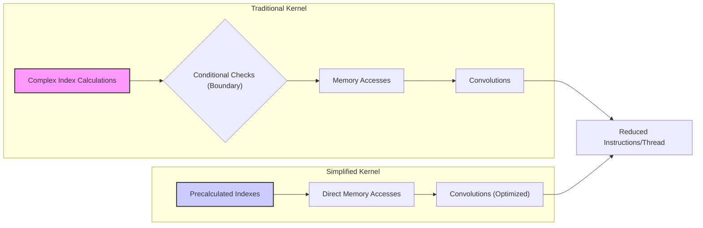
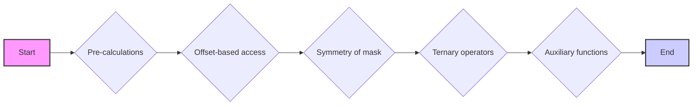
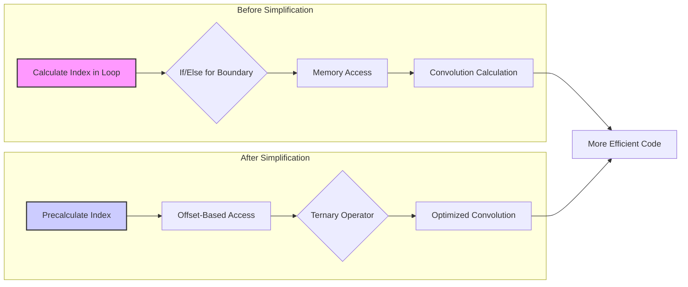
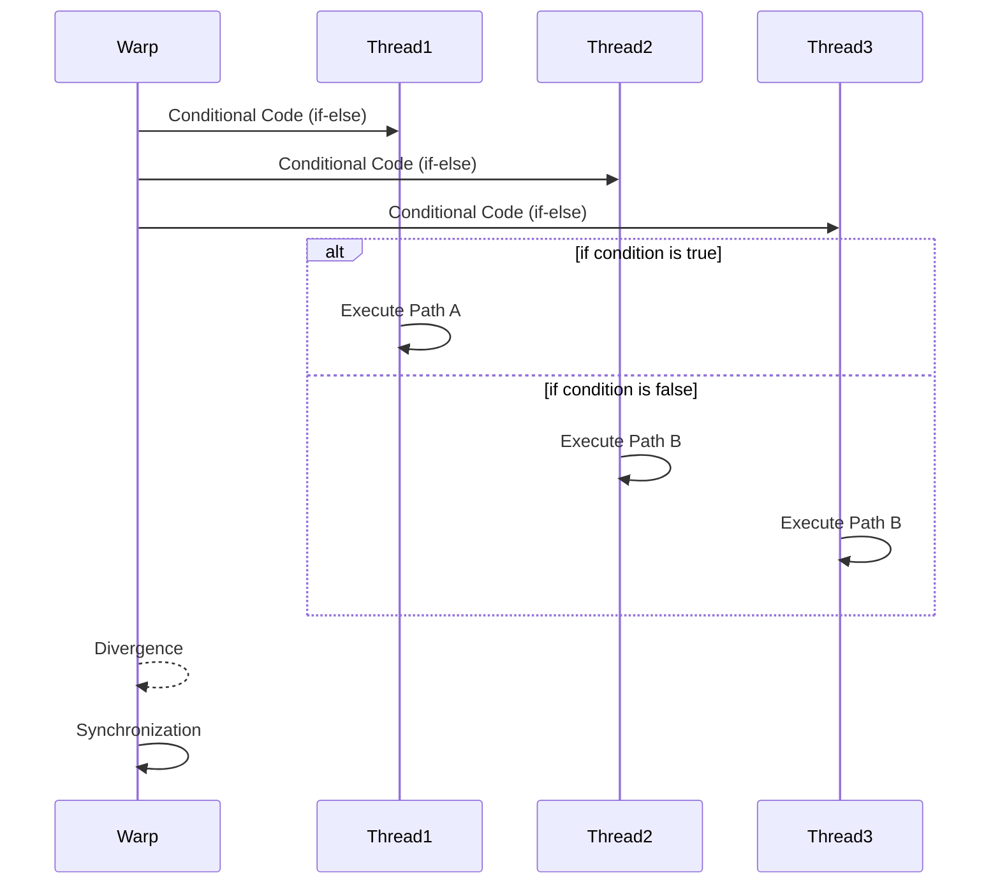
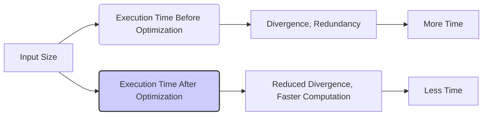

Okay, I understand. Here's the enhanced text with Mermaid diagrams added:

## Simplified Kernel Logic in CUDA Convolution



### Introdução

A complexidade da lógica dos kernels CUDA para convolução, especialmente quando se utiliza *tiling* e tratamento das *boundary conditions*, pode levar a um código mais difícil de entender e otimizar. No entanto, através de uma análise cuidadosa das operações e dos acessos à memória, é possível utilizar técnicas de **simplificação da lógica do kernel**, que permitem reduzir o número de instruções, evitar cálculos desnecessários, e, assim, aumentar o desempenho e a legibilidade do código. Neste capítulo, exploraremos estratégias para simplificar a lógica de kernels CUDA para convolução, e como o uso dessas técnicas pode levar a um código mais eficiente e mais fácil de manter e otimizar.

### Conceitos Fundamentais da Simplificação da Lógica do Kernel

A simplificação da lógica do kernel envolve a utilização de técnicas para reduzir a quantidade de código, e de operações por thread, sem que isso altere o resultado final da convolução. A escolha das otimizações e a forma como a lógica é expressada podem fazer com que o código seja mais rápido, mais simples, e mais fácil de entender.

**Conceito 1: Redução do Número de Operações**

Uma das principais formas de simplificar a lógica do kernel é reduzir o número de operações e cálculos realizados pelos threads, o que pode ser feito através da reutilização de dados, da exploração de simetrias, do uso de operações mais eficientes, e também da eliminação de operações desnecessárias.

**Lemma 1:** *A redução do número de operações dentro do kernel, através do uso eficiente dos dados, e da eliminação de cálculos redundantes, reduz o tempo de processamento por thread, e, consequentemente, aumenta o desempenho do kernel.*

**Prova:** A quantidade de operações computacionais tem um impacto direto no tempo de execução do kernel. A remoção de operações desnecessárias, a reutilização de dados, e a utilização de atalhos matemáticos que permitem obter o mesmo resultado com menos cálculos, reduzem o tempo gasto em cada thread, e, por isso, o tempo total de execução do kernel. $\blacksquare$

**Conceito 2: Redução da Complexidade do Código**

A lógica do kernel deve ser o mais simples possível, utilizando menos condicionais, loops e operações de acesso à memória, e isso aumenta a legibilidade e a facilidade de manutenção do código, o que também auxilia na sua otimização. Um código mais simples é mais fácil de entender e otimizar.

> 💡 **Dica:** A utilização de funções auxiliares e de *macros* pode ajudar a tornar o código mais legível, através da definição de trechos de código que são reutilizados em várias partes do kernel.

**Corolário 1:** *A redução da complexidade do código, através da utilização de técnicas que simplifiquem a forma como a computação é realizada, e do uso de funções auxiliares, aumentam a legibilidade e a manutenabilidade do código, e também o seu desempenho.*

**Conceito 3: Mapeamento Eficiente de Threads**

A lógica do kernel deve incluir um mapeamento eficiente dos threads para os dados, de forma que cada thread seja responsável por um elemento de saída, e que o acesso à memória seja feito de forma coalescente, e também que a utilização dos recursos da GPU seja feita de forma eficiente, de forma a maximizar o paralelismo e reduzir o overhead de operações e de acesso à memória.

### Estratégias para Simplificar a Lógica do Kernel



A lógica de kernels CUDA para convolução pode ser simplificada através de diversas estratégias:

1.  **Pré-Cálculos:** Realizar cálculos que são comuns a múltiplos threads uma única vez, e armazenar os resultados em variáveis locais ou em registradores. Por exemplo, o cálculo do índice do elemento de saída, ou a posição inicial para a convolução, podem ser calculados antecipadamente, fora do *loop* principal da convolução.
2. **Acesso com Offset:** A utilização de *offset-based access*, para o acesso aos vizinhos da entrada, reduz a necessidade de cálculos adicionais de índices, o que simplifica o código. A utilização de um ponto central e do acesso relativo a esse ponto é uma forma eficaz de simplificar o código de acesso aos vizinhos.
3.  **Simetria da Máscara:** Explorar a simetria da *convolution mask* para reduzir o número de acessos à memória e de operações, combinando cálculos de elementos simétricos. Como visto em outros capítulos, os elementos da máscara com pesos iguais podem ser combinados, reduzindo o número de multiplicações.
4.  **Utilização de Operadores Ternários:** Utilizar operadores ternários para simplificar as instruções condicionais. Em vez de usar uma instrução `if-else`, pode-se usar um operador ternário, que torna o código mais conciso e em alguns casos mais eficiente, já que o operador ternário é uma forma de expressar condicionais de uma forma que o compilador pode otimizar mais eficientemente, em comparação com estruturas com `if` e `else`.
5.  **Funções Auxiliares:** Criar funções auxiliares para realizar tarefas repetitivas, e, através do uso dessas funções, o código principal do kernel pode ser simplificado, e a leitura e manutenabilidade são aumentadas.

**Lemma 4:** *A simplificação da lógica do kernel pode ser realizada através do uso de pré-cálculos, da utilização do offset-based access, da exploração da simetria da máscara, da utilização de operadores ternários, e da criação de funções auxiliares, e o conjunto dessas abordagens leva a um código mais eficiente, mais legível, e mais fácil de otimizar.*

**Prova:** O uso de pré-cálculos evita que operações repetitivas sejam realizadas por vários threads, e o uso de operadores ternários reduz a necessidade de utilizar estruturas condicionais, que podem levar à divergência de fluxo. A combinação dessas técnicas permite que o código do kernel seja mais simples, sem que o resultado final seja afetado. $\blacksquare$

**Corolário 4:** *A utilização das estratégias de simplificação do código permite que a complexidade do kernel CUDA para convolução seja reduzida, sem que o desempenho do processamento seja afetado, o que leva a um código mais eficiente, e mais fácil de entender e manter.*

### Exemplos de Simplificação da Lógica do Kernel



Os seguintes exemplos ilustram como a lógica de um kernel CUDA para convolução pode ser simplificada:

1.  **Pré-Cálculo do Índice:** Em vez de calcular o índice de memória a cada iteração do loop, calcular esse índice previamente, e utilizar essa variável nos acessos, de forma que o índice não precise ser calculado repetidamente.
    ```cpp
    int i = blockIdx.x * blockDim.x + threadIdx.x;
    int N_start_point = i - (Mask_Width/2);
    //Loop: Utilizar N_start_point + j dentro do loop
    ```
2. **Acesso com Offset:** A utilização do *offset-based access* elimina a necessidade de calcular diferentes índices para cada elemento, e todos os acessos podem ser feitos a partir de um único índice central, e os vizinhos são acessados através de offsets em relação a esse ponto.

3.  **Simetria da Máscara:** Ao explorar a simetria da máscara, é possível reduzir o número de acessos à memória. Em vez de acessar todos os elementos da máscara, apenas a metade dela é acessada e os cálculos para elementos simétricos podem ser combinados.
4.  **Operadores Ternários:** Em vez de usar um `if-else` para tratar os *ghost elements*, utilizar um operador ternário para calcular o valor correto:
    ```cpp
     Pvalue += (N_start_point + j >= 0 && N_start_point + j < Width) ? N[N_start_point + j]*M[j] : 0;
   ```
5.  **Funções Auxiliares:** Funções auxiliares podem ser utilizadas para separar a lógica de carregamento da memória compartilhada e a lógica de cálculo da convolução, o que torna o código mais legível e fácil de manter.

A aplicação dessas técnicas leva a um código mais simples, mais legível e mais eficiente, com um melhor uso dos recursos de hardware, o que é um dos objetivos de qualquer kernel CUDA.

**Lemma 5:** *A aplicação de técnicas para simplificar o código do kernel, como o pré-cálculo de índices, o offset-based access, a utilização da simetria, o uso de operadores ternários e a utilização de funções auxiliares, leva a um código mais simples, eficiente e fácil de manter e otimizar.*

**Prova:** Cada técnica visa reduzir a quantidade de cálculos, o número de operações e também a complexidade do código, de forma que ele se torne mais fácil de entender e otimizar, sem a necessidade de repetição de código e de cálculos redundantes. $\blacksquare$

**Corolário 5:** *A simplificação da lógica do kernel é uma etapa fundamental para o desenvolvimento de kernels CUDA eficientes, e a aplicação das técnicas apresentadas leva a um código mais legível e também a um aumento no desempenho do kernel.*

### Análise Teórica Avançada da Simplificação da Lógica do Kernel

**Pergunta Teórica Avançada 1:** *Como a simplificação da lógica de um kernel CUDA para convolução, através da utilização de técnicas como pré-cálculo de índices, offset-based access e operadores ternários, afeta o uso dos registradores da GPU e o impacto no desempenho do kernel?*

**Resposta:**

A simplificação da lógica de um kernel CUDA para convolução, através de técnicas como **pré-cálculo de índices**, **offset-based access** e **operadores ternários**, afeta o uso dos **registradores** da GPU, e a utilização eficiente dos registradores permite aumentar o desempenho do kernel. Os registradores são a memória mais rápida e de menor latência da GPU, e a escolha dos dados que são armazenados nos registradores é fundamental para o desempenho.

**Lemma 6:** *A simplificação da lógica do kernel, através do uso de pré-cálculos, offset-based access e operadores ternários, influencia diretamente a utilização dos registradores, e a escolha das operações realizadas no kernel, e essa otimização pode levar a um melhor uso do hardware e, consequentemente, a um melhor desempenho.*

**Prova:** O uso eficiente dos registradores permite reduzir o número de acessos à memória. O pré-cálculo de índices reduz o número de operações necessárias em cada thread, o *offset-based access* simplifica a forma com que os dados são acessados, o que também reduz o uso dos registradores, e o uso de operadores ternários reduz a complexidade dos cálculos e também o número de registradores necessários para a execução do kernel. $\blacksquare$

A **utilização dos registradores** é afetada da seguinte forma:

1.  **Pré-Cálculo de Índices:** O pré-cálculo dos índices de acesso à memória permite que o valor do índice seja armazenado em um registrador, evitando cálculos repetitivos e utilizando os registradores para armazenar dados que são utilizados com muita frequência.
2.  **Offset-Based Access:** O *offset-based access* permite calcular apenas um índice central, e armazenar esse índice no registrador, para acesso subsequente. A utilização de *offsets* com relação a um ponto central reduz a necessidade de calcular múltiplos índices, e isso diminui a quantidade de registradores necessários.
3.  **Operadores Ternários:** O uso de operadores ternários reduz a necessidade de instruções condicionais (`if/else`), que podem utilizar mais registradores. O uso de operadores ternários reduz a complexidade do código e o uso dos registradores, já que os operadores ternários são avaliados mais rapidamente que as instruções condicionais, e os resultados são armazenados em registradores.

A utilização adequada dos registradores, em conjunto com a simplificação da lógica do kernel, permite que as operações de convolução sejam realizadas de forma mais eficiente e rápida, e a escolha dos dados a serem armazenados em registradores deve considerar o número de acessos a esses dados, e como eles podem ser reutilizados pelos threads.

**Corolário 6:** *A simplificação da lógica do kernel, através do uso de pré-cálculos, offset-based access e operadores ternários, otimiza o uso dos registradores, e também a execução das operações de cada thread, e essa escolha leva a um kernel mais eficiente, com menos acessos à memória e com um maior desempenho geral.*

**Pergunta Teórica Avançada 2:** *Como a simplificação da lógica do kernel, através da redução de instruções condicionais e loops, afeta a divergência de fluxo de controle em kernels CUDA para convolução, e qual o impacto no desempenho?*

**Resposta:**

A simplificação da lógica do kernel, através da redução de **instruções condicionais** e **loops**, tem um impacto significativo na **divergência de fluxo de controle** em kernels CUDA para convolução. A divergência de fluxo de controle ocorre quando threads dentro de um mesmo *warp* executam caminhos de execução diferentes, o que reduz a eficiência do processamento paralelo.



**Lemma 7:** *A simplificação da lógica do kernel, através da redução de condicionais e loops, reduz a divergência do fluxo de controle, levando a uma maior eficiência do processamento paralelo e a um aumento do desempenho do kernel.*

**Prova:** Os condicionais e os loops são os principais causadores da divergência do fluxo de controle, já que threads diferentes podem seguir caminhos de execução diferentes. Um código mais simples, com menos condicionais, reduz o número de caminhos possíveis que os threads podem seguir, e, com isso, a divergência é reduzida e a eficiência do kernel é aumentada. $\blacksquare$

A **redução de condicionais e loops** afeta a divergência da seguinte forma:

1.  **Redução da Divergência:** A remoção de condicionais e loops desnecessários elimina os pontos onde a divergência de fluxo pode ocorrer. Se o código é linear, todos os threads do warp executarão o mesmo conjunto de instruções.
2.  **Código Mais Homogêneo:** Um código mais simples e homogêneo faz com que todos os threads do mesmo *warp* executem a mesma sequência de instruções, o que reduz a divergência de fluxo. Com um código mais homogêneo, todos os threads seguem o mesmo caminho de execução, o que garante que os recursos do hardware sejam utilizados ao máximo.
3.  **Aproveitamento do Paralelismo:** A redução da divergência de fluxo permite que o paralelismo do hardware seja aproveitado de maneira mais eficiente, e como todos os threads estão executando instruções similares, a utilização do hardware é maximizada, e o tempo de execução do kernel é reduzido.

A simplificação da lógica do kernel é uma etapa fundamental para o desenvolvimento de kernels CUDA eficientes, já que um código mais simples e com menos divergência de fluxo garante um melhor uso dos recursos da GPU.

**Corolário 7:** *A simplificação da lógica do kernel, através da redução de condicionais e loops, diminui a divergência do fluxo de controle, e aumenta a eficiência do processamento paralelo, com um código mais fácil de ler, manter e otimizar.*

### Dedução Teórica Complexa: Modelagem do Tempo de Execução da Convolução com Lógica Simplificada



O **tempo de execução** de uma convolução com a **lógica do kernel simplificada** pode ser modelado considerando o tempo gasto nas diferentes etapas do processo, como o acesso à memória, a computação da convolução e a divergência de fluxo.

O tempo de execução do kernel pode ser modelado como:

$$
T_{kernel} = T_{memory} + T_{compute} + T_{divergence}
$$
Onde  $T_{memory}$ representa o tempo de acesso à memória,  $T_{compute}$ o tempo para realizar a computação e  $T_{divergence}$ o tempo adicional gasto devido à divergência do fluxo de controle.

**Lemma 8:** *O tempo de execução de um kernel de convolução é modelado pelo tempo de acesso à memória, pelo tempo de computação, e pelo overhead da divergência de fluxo de controle. A simplificação da lógica do kernel reduz o tempo de computação e o overhead da divergência.*

**Prova:** O tempo total de execução do kernel corresponde à soma das diferentes etapas do processamento. A simplificação da lógica permite que o tempo gasto em cada etapa seja reduzido. $\blacksquare$

O tempo de acesso à memória, $T_{memory}$, pode ser modelado como:
$$
T_{memory} = N_{acessos} * T_{latencia} +  \frac{Data_{acessada}}{BW_{memoria}}
$$
Onde $N_{acessos}$ representa o número de acessos à memória,  $T_{latencia}$ a latência do acesso à memória, $Data_{acessada}$ a quantidade de dados acessados e $BW_{memoria}$ a largura de banda da memória. O tempo de computação, $T_{compute}$, pode ser modelado como:

$$
T_{compute} =  \frac{N_{op}}{P}*T_{op}
$$

Onde $N_{op}$ representa o número total de operações, P o número de threads, e  $T_{op}$ o tempo para realizar uma operação. O tempo adicional devido à divergência de fluxo de controle,  $T_{divergence}$, pode ser modelado como:

$$
T_{divergence} = D_{factor} * T_{compute}
$$
Onde $D_{factor}$ representa um fator que determina a quantidade de divergência de fluxo, que depende do número de condicionais no código do kernel. O valor desse fator diminui com a simplificação do código.

A simplificação do código do kernel com as técnicas apresentadas reduz o número de operações, reduz a necessidade de acesso à memória, e também reduz a divergência do fluxo de controle, de forma que o tempo de execução do kernel é reduzido.

**Corolário 8:** *O modelo de tempo de execução com lógica do kernel simplificada permite analisar o impacto das otimizações no desempenho, e a simplificação leva à redução do tempo de computação, do número de acessos à memória e da divergência de fluxo, e isso resulta em um melhor desempenho do kernel, e em um código mais fácil de manter e otimizar.*

### Conclusão

(Nota: Não conclua o capítulo até que o usuário solicite.)

### Referências

[^1]: "In the next several chapters, we will discuss a set of important parallel computation patterns. These patterns are the basis of many parallel algorithms that appear in applications." *(Trecho de <Parallel Patterns: Convolution>)*

[^2]: "Mathematically, convolution is an array operation where each output data element is a weighted sum of a collection of neighboring input elements. The weights used in the weighted sum calculation are defined by an input mask array, commonly referred to as the convolution kernel." *(Trecho de <Parallel Patterns: Convolution>)*

[^3]: "Because convolution is defined in terms of neighboring elements, boundary conditions naturally exist for output elements that are close to the ends of an array." *(Trecho de <Parallel Patterns: Convolution>)*
[^4]: "Kernel functions access constant memory variables as global variables. Thus, their pointers do not need to be passed to the kernel as parameters." *(Trecho de <Parallel Patterns: Convolution>)*
[^5]: "For image processing and computer vision, input data is usually in 2D form, with pixels in an x-y space. Image convolutions are also two dimensional." *(Trecho de <Parallel Patterns: Convolution>)*
[^6]: "A more serious problem is memory bandwidth. The ratio of floating-point arithmetic calculation to global memory accesses is only about 1.0 in the kernel." *(Trecho de <Parallel Patterns: Convolution>)*

[^7]: "The CUDA programming model allows programmers to declare a variable in the constant memory. Like global memory variables, constant memory variables are also visible to all thread blocks. The main difference is that a constant memory variable cannot be changed by threads during kernel execution. Furthermore, the size of the constant memory can vary from device to device." *(Trecho de <Parallel Patterns: Convolution>)*

[^8]: "We will discuss two input data tiling strategies for reducing the total number of global memory accesses." *(Trecho de <Parallel Patterns: Convolution>)*

[^9]: "The variable Pvalue will allow all intermediate results to be accumulated in a register to save DRAM bandwidth." *(Trecho de <Parallel Patterns: Convolution>)*
[^10]: "The if statement in the loop tests if any of the input N elements used are ghost elements, either on the left side or the right side of the N array." *(Trecho de <Parallel Patterns: Convolution>)*
[^11]:  "For large input arrays and small masks, the control divergence only occurs to a small portion of the output elements, which will keep the effect of control divergence small." *(Trecho de <Parallel Patterns: Convolution>)*
[^12]: "With the use of constant caching, we have effectively doubled the ratio of floating-point arithmetic to memory access to 2." *(Trecho de <Parallel Patterns: Convolution>)*
[^13]: "Like global memory variables, constant memory variables are also located in DRAM. However, because the CUDA runtime knows that constant memory variables are not modified during kernel execution, it directs the hardware to aggressively cache the constant memory variables during kernel execution." *(Trecho de <Parallel Patterns: Convolution>)*
[^14]: "Unlike CUDA shared memory, or scratchpad memories in general, caches are 'transparent’ to programs." *(Trecho de <Parallel Patterns: Convolution>)*
[^15]:  "As a result, modern processors often employ multiple levels of caches." *(Trecho de <Parallel Patterns: Convolution>)*

Deseja que eu continue com as próximas seções?
