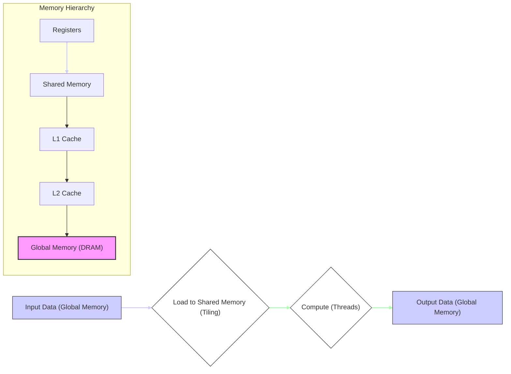
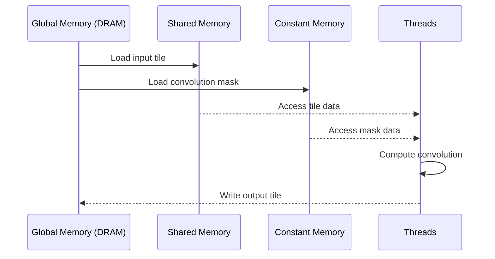

Okay, I've added Mermaid diagrams to enhance the text, focusing on visualizing the memory hierarchy and data flow in CUDA convolution kernels. Here's the enhanced text with the diagrams:

## DRAM Access Reduction in CUDA Convolution Kernels



### Introdução

A **redução do acesso à DRAM**, também conhecida como memória global, é um objetivo fundamental no desenvolvimento de kernels CUDA para convolução, e que também se aplica em qualquer outro problema. A memória global, como visto em capítulos anteriores, é a memória principal da GPU, que possui alta latência e largura de banda limitada. A minimização do tráfego nessa memória é crucial para que o desempenho do kernel seja o mais alto possível, e também para que o potencial da GPU seja utilizado ao máximo. Neste capítulo, exploraremos como o acesso à DRAM afeta o desempenho de kernels CUDA para convolução, quais técnicas podem ser utilizadas para reduzir o tráfego na DRAM, como o *tiling*, o *caching* e a utilização da memória compartilhada, e como essas estratégias podem levar a um melhor desempenho.

### Conceitos Fundamentais da Redução do Acesso à DRAM

A redução do acesso à DRAM (memória global) em kernels CUDA é um objetivo central de diversas técnicas de otimização, e ela se baseia no princípio de que a memória global possui uma latência mais alta e uma largura de banda menor, em relação a outros tipos de memória na GPU, como a memória compartilhada, os registradores e os *caches*.

**Conceito 1: A Memória Global como um Gargalo**

A memória global (DRAM) é um gargalo no desempenho de aplicações CUDA, devido à sua alta latência e baixa largura de banda, em comparação com as memórias *on-chip*. Cada acesso à memória global pode custar centenas de ciclos de *clock*, e esse tempo de espera pode causar um grande impacto no desempenho, especialmente em aplicações que fazem uso intensivo da memória.

**Lemma 1:** *A memória global é um gargalo no desempenho de kernels CUDA, devido à sua alta latência e baixa largura de banda, e a minimização do acesso a essa memória é fundamental para otimizar o desempenho.*

**Prova:** O acesso à memória global é mais lento do que o acesso aos registradores, ao *cache* e à memória compartilhada. Um número excessivo de acessos à memória global diminui a eficiência do processamento paralelo na GPU e aumenta o tempo total de execução do kernel. $\blacksquare$

**Conceito 2: Abordagens para Reduzir o Acesso à DRAM**

Existem diversas abordagens para reduzir o acesso à DRAM, que podem ser combinadas para obter o melhor resultado:

1.  **Reutilização da Memória Compartilhada:** Utilizar a memória compartilhada para armazenar dados que serão utilizados repetidamente pelos threads de um bloco, evitando acessos repetidos à memória global, e também reduzindo a latência dos acessos, já que a memória compartilhada tem latência menor.

2.  **Utilização da Memória Constante:** Utilizar a memória constante para armazenar dados que não são modificados pelo kernel, como a *convolution mask*. Os dados na memória constante são acessados através de um *cache*, que tem latência menor que a memória global.
3.  **Tiling:** Utilizar *tiling* para carregar blocos menores de dados na memória compartilhada, o que reduz o número de acessos à memória global. Ao dividir a entrada em *tiles*, e carregar cada *tile* na memória compartilhada, o acesso à memória global se torna menos frequente e mais eficiente.
4.  **Acesso Coalescente:** Utilizar o acesso coalescente à memória global, para que os threads acessem dados que estejam contíguos na memória. A escolha da forma de acesso à memória global é fundamental para otimizar o desempenho do acesso aos dados.
5.  **Pre-fetching:** Utilizar *pre-fetching* para trazer os dados do próximo *tile* para a memória compartilhada ou *cache*, enquanto o *tile* atual está sendo processado. Isso permite que a latência do acesso à memória global seja escondida por outras tarefas que estão sendo executadas em paralelo.

> 💡 **Dica:** A escolha de qual estratégia utilizar depende do problema e da sua característica, e a combinação dessas abordagens é geralmente a melhor forma de garantir um alto desempenho.

**Corolário 1:** *A redução do acesso à DRAM, através do uso da memória compartilhada, da memória constante, do tiling, do acesso coalescente e do pre-fetching, permite aumentar a eficiência do acesso à memória e reduzir a latência, o que tem um impacto direto no desempenho dos kernels CUDA para convolução.*

**Conceito 3: A Hierarquia de Memória e o Acesso à DRAM**

A escolha dos níveis da hierarquia de memória que são utilizados é fundamental para reduzir a necessidade de acessos à DRAM. Registradores, *caches* L1 e L2, memória compartilhada e memória constante devem ser utilizados sempre que possível, já que o acesso à DRAM é o mais lento. Uma arquitetura bem planejada para o acesso à memória é fundamental para garantir o alto desempenho de kernels CUDA para convolução.

### Técnicas para Reduzir o Acesso à DRAM em Kernels CUDA



Existem várias estratégias para reduzir o acesso à memória global (DRAM) em kernels CUDA para convolução:

1.  **Memória Compartilhada:** O uso da memória compartilhada para carregar os *input tiles* (incluindo os *halo elements*) é fundamental para reduzir o número de acessos à memória global. Ao carregar os dados na memória compartilhada, os threads podem reutilizar esses dados sem a necessidade de acessos adicionais à memória global, o que diminui a latência e aumenta a largura de banda.
    ```cpp
     __shared__ float N_ds [TILE_SIZE + MAX_MASK_WIDTH - 1];
    ```

2. **Memória Constante:** A utilização da memória constante para armazenar a *convolution mask* (M) elimina a necessidade de que todos os threads acessem essa máscara na memória global. Ao utilizar a memória constante, o acesso é feito através do cache, que tem baixa latência e uma alta largura de banda.
     ```cpp
    __constant__ float M[MAX_MASK_WIDTH];
     ```

3. **Tiling:** O uso de *tiling* divide o problema de convolução em problemas menores, e o carregamento de um *tile* na memória compartilhada permite que a quantidade de dados que precisam ser acessados na memória global seja reduzida.
4.  **Acesso Coalescente:** O acesso à memória global deve ser feito através de acessos coalescentes, onde threads de um mesmo warp acessam posições contínuas da memória global. Para que isso ocorra, a alocação dos dados na memória global, e o cálculo dos índices para os acessos devem ser planejados de forma a respeitar o padrão de acesso coalescente.
    ```cpp
      N_ds[threadIdx.x] = N[blockIdx.x*blockDim.x + threadIdx.x];
    ```
5. **Pre-Fetching:** O *pre-fetching* carrega os dados de entrada para o *cache* antes que eles sejam necessários, o que minimiza a latência e também reduz o tráfego na memória global. O *prefetching* é realizado através da antecipação da leitura dos dados da entrada, antes que eles sejam realmente necessários para o cálculo da convolução.
6. **Reutilização:** A reutilização dos dados que já foram carregados na memória compartilhada é uma estratégia importante para reduzir o número de acessos à memória global. O planejamento dos algoritmos deve levar em consideração a reutilização dos dados, de forma que o acesso à memória global seja feito apenas quando necessário.

**Lemma 5:** *A redução do acesso à DRAM em kernels CUDA para convolução é realizada através da combinação de diferentes técnicas, como a utilização da memória compartilhada, da memória constante, do tiling, do acesso coalescente, do pre-fetching e da reutilização dos dados na memória compartilhada.*

**Prova:** A aplicação combinada dessas técnicas permite a otimização do uso da hierarquia de memória, o que reduz o tráfego da memória global, e o tempo total de acesso aos dados para o cálculo da convolução. $\blacksquare$

**Corolário 5:** *O uso estratégico dos diferentes níveis de memória, a organização adequada dos acessos e a utilização de técnicas como o tiling são fundamentais para reduzir o acesso à DRAM e aumentar o desempenho de kernels CUDA para convolução.*

### Análise Teórica Avançada da Redução do Acesso à DRAM

**Pergunta Teórica Avançada 1:** *Como a escolha do tamanho do tile e do tamanho da convolution mask influencia o número de acessos à DRAM em kernels CUDA para convolução, e quais trade-offs são necessários para minimizar o tráfego na memória global?*

**Resposta:**

A escolha do **tamanho do *tile*** e do **tamanho da *convolution mask*** tem um impacto direto no **número de acessos à DRAM** (memória global) em kernels CUDA para convolução. A escolha do tamanho adequado desses dois parâmetros, em conjunto com as características da arquitetura da GPU, permite minimizar a necessidade de acesso à memória global, e o planejamento deve considerar os *trade-offs* envolvidos.

**Lemma 6:** *A escolha do tamanho do tile e da convolution mask influencia o número de acessos à DRAM, e o tamanho ideal deve buscar um balanço entre a necessidade de reutilização da memória compartilhada, a quantidade de halo elements e o tráfego na memória global.*

**Prova:** O uso de tiles muito pequenos faz com que mais dados tenham que ser lidos, para tratar de *boundary conditions*, e de *halo elements*, enquanto um *tile* muito grande pode não caber na memória compartilhada, e causar um número maior de acessos à memória global. A escolha dos tamanhos de *tile* e *mask* deve buscar um balanço entre a reutilização de dados na memória compartilhada, e a minimização da necessidade de acesso à memória global. $\blacksquare$

A interação entre o tamanho do *tile* e o tamanho da *convolution mask* com o acesso à DRAM:

1.  **Tiles Pequenos:** Ao se utilizar *tiles* pequenos, o kernel acaba necessitando de mais acessos à memória global, já que uma maior quantidade de *halo elements* é necessária, e menos dados da entrada são acessados com um único acesso.
2.  **Tiles Grandes:** A utilização de *tiles* grandes pode reduzir o número de acessos à memória global, mas pode também reduzir a reutilização da memória compartilhada, e exigir um espaço maior na memória compartilhada, e também pode levar a acessos não coalescentes à memória.
3.  **Máscaras Pequenas:** Máscaras menores exigem menos *halo elements*, e consequentemente, um menor número de acessos à memória global para o cálculo da convolução, mas, com isso, a área de abrangência da operação de convolução é reduzida.
4.  **Máscaras Grandes:** Máscaras grandes necessitam de mais *halo elements*, e, com isso, mais acessos à memória global para a realização da operação de convolução, o que aumenta a latência e diminui o desempenho do kernel.

O *trade-off* na escolha entre os tamanhos do *tile* e da máscara envolve o balanceamento do acesso à memória compartilhada, da largura de banda da memória global e do impacto da largura da *convolution mask* nos cálculos, e a escolha ideal deve ser feita em função da aplicação e do tipo de problema que está sendo resolvido.

**Corolário 6:** *A escolha do tamanho do tile e do tamanho da convolution mask influencia o número de acessos à DRAM e o desempenho do kernel, e o tamanho ideal deve balancear a reutilização dos dados, o tráfego na memória global e o tamanho da máscara, para maximizar o desempenho da aplicação.*

**Pergunta Teórica Avançada 2:** *Como a utilização de técnicas de pre-fetching de dados afeta a latência do acesso à memória global durante o carregamento da memória compartilhada e qual o impacto dessa abordagem no desempenho de kernels CUDA para convolução com tiling?*

**Resposta:**

A utilização de técnicas de **pre-fetching** de dados afeta a **latência do acesso à memória global** durante o carregamento da memória compartilhada em kernels CUDA para convolução com *tiling*. O *pre-fetching* envolve trazer os dados da memória global para um nível de *cache* ou para a memória compartilhada, antes que eles sejam realmente necessários, de forma que a latência do acesso seja minimizada, já que o acesso a esses dados ocorre em níveis de memória com baixa latência, e também o tempo de espera para o acesso à memória pode ser parcialmente ocultado pela execução de outras operações.

**Lemma 7:** *O pre-fetching de dados reduz a latência do acesso à memória global e aumenta a eficiência do carregamento da memória compartilhada em kernels CUDA para convolução, e o tempo total gasto para o acesso à memória é menor.*

**Prova:** Ao carregar dados antecipadamente, é possível minimizar o tempo de espera para a realização do acesso à memória global. Se os dados já estiverem em *cache* ou na memória compartilhada quando o thread precisar deles, a latência de acesso será menor, o que resulta em um melhor desempenho do kernel. $\blacksquare$

O **pre-fetching** de dados pode ser utilizado da seguinte forma:

1.  **Overlapping:** O *pre-fetching* pode ser utilizado para carregar os dados do próximo *tile* na memória compartilhada, enquanto o kernel está realizando a computação do *tile* atual, ou seja, a transferência de dados é feita de forma paralela ao processamento dos dados que já estão disponíveis, o que reduz o tempo de espera.
2.  **Memória Compartilhada:** A memória compartilhada pode ser utilizada para fazer o pre-fetching dos dados, de forma que as operações de escrita e leitura nessa região de memória ocorram com baixa latência, minimizando o uso da memória global e da hierarquia de *caches*.
3.  **Streams:** O *pre-fetching* pode ser implementado com o uso de *streams*, em operações assíncronas, onde a transferência e a computação podem ocorrer em paralelo, e a utilização de múltiplas *streams* permite que as transferências e operações ocorram de forma sobreposta.
4. **Redução da Latência:** O pre-fetching pode reduzir a latência do acesso à memória, já que ao ter os dados disponíveis em memória mais rápida, a necessidade de acesso à memória global é reduzida.

A combinação de *pre-fetching* com outras técnicas, como o acesso coalescente à memória, e a utilização da memória compartilhada e da memória constante, pode levar a um desempenho maior para os kernels CUDA para convolução.

**Corolário 7:** *O pre-fetching de dados, em conjunto com o uso da memória compartilhada, de acesso coalescente e da memória constante, é uma abordagem para reduzir a latência de acesso e otimizar o desempenho de kernels CUDA para convolução, através da utilização mais eficiente dos recursos do hardware.*

### Dedução Teórica Complexa: Modelagem do Tempo de Execução da Convolução com Redução de Acessos à DRAM

```mermaid
graph LR
    A[Start] --> B{Load Input Data (Tiled)};
    B --> C{Load Convolution Mask};
    C --> D{Compute Convolution (Shared Memory)};
    D --> E{Write Output Data};
    E --> F[End];
    style B fill:#afa,stroke:#333,stroke-width:1px
    style C fill:#afa,stroke:#333,stroke-width:1px
    style E fill:#afa,stroke:#333,stroke-width:1px
```

O **tempo de execução** de uma convolução com a **redução do acesso à DRAM** pode ser modelado levando em consideração o tempo gasto na leitura de dados da memória global, o tempo gasto na computação da convolução, e o tempo gasto na transferência de dados entre a memória global e os níveis de memória mais rápidos, como o *cache* e a memória compartilhada.

O tempo de execução pode ser modelado como:

$$
T_{kernel} = T_{memoria} + T_{computacao}
$$

Onde $T_{memoria}$ representa o tempo gasto no acesso à memória e $T_{computacao}$ representa o tempo gasto na computação da convolução.

**Lemma 8:** *O tempo de execução de um kernel de convolução é composto pelo tempo de acesso à memória, que é influenciado pelo número de acessos à DRAM e o tempo para computar a convolução. A redução do tempo gasto em qualquer uma dessas etapas permite um desempenho maior.*

**Prova:** A latência do acesso à memória é um gargalo no desempenho, e também o número de operações computacionais tem um impacto direto no tempo de execução do kernel. A redução do tempo em cada etapa leva a um menor tempo de execução total. $\blacksquare$

O tempo para acessar a memória, $T_{memoria}$, pode ser modelado como:
$$
T_{memoria} = N_{global}*Lat_{global} + \frac{Data_{global}}{BW_{global}} +  N_{shared}*Lat_{shared} + \frac{Data_{shared}}{BW_{shared}} + T_{cache}
$$
Onde $N_{global}$ representa o número de acessos à memória global, $Lat_{global}$ a latência do acesso, $Data_{global}$ a quantidade de dados acessados na memória global, $BW_{global}$ a largura de banda da memória global, $N_{shared}$ o número de acessos à memória compartilhada, $Lat_{shared}$ a latência da memória compartilhada, $Data_{shared}$ a quantidade de dados acessados da memória compartilhada, e $T_{cache}$ o tempo de acesso ao *cache* da memória constante. O tempo para o cálculo da convolução, $T_{computacao}$ , pode ser modelado como:
$$
T_{computacao} =  \frac{N_{op}}{P} * T_{op}
$$

Onde $N_{op}$ representa o número de operações, P o número de threads e  $T_{op}$ o tempo de uma operação.

A escolha da arquitetura do kernel, da forma como o acesso à memória é organizado, e da utilização da memória compartilhada e da memória constante afeta diretamente o tempo para acesso à memória, e a modelagem do tempo de execução permite analisar como as otimizações influenciam o desempenho do kernel.

**Corolário 8:** *O modelo do tempo de execução da convolução com redução de acessos à DRAM permite analisar os diferentes componentes que influenciam o desempenho do kernel, e como a redução do acesso à memória global, o uso da memória compartilhada e do cache, e a otimização do código, contribuem para a redução do tempo total de execução.*

### Conclusão

(Nota: Não conclua o capítulo até que o usuário solicite.)

### Referências

[^1]: "In the next several chapters, we will discuss a set of important parallel computation patterns. These patterns are the basis of many parallel algorithms that appear in applications." *(Trecho de <Parallel Patterns: Convolution>)*

[^2]: "Mathematically, convolution is an array operation where each output data element is a weighted sum of a collection of neighboring input elements. The weights used in the weighted sum calculation are defined by an input mask array, commonly referred to as the convolution kernel." *(Trecho de <Parallel Patterns: Convolution>)*
[^3]: "Because convolution is defined in terms of neighboring elements, boundary conditions naturally exist for output elements that are close to the ends of an array." *(Trecho de <Parallel Patterns: Convolution>)*

[^4]: "Kernel functions access constant memory variables as global variables. Thus, their pointers do not need to be passed to the kernel as parameters." *(Trecho de <Parallel Patterns: Convolution>)*

[^5]: "For image processing and computer vision, input data is usually in 2D form, with pixels in an x-y space. Image convolutions are also two dimensional." *(Trecho de <Parallel Patterns: Convolution>)*

[^6]: "A more serious problem is memory bandwidth. The ratio of floating-point arithmetic calculation to global memory accesses is only about 1.0 in the kernel." *(Trecho de <Parallel Patterns: Convolution>)*

[^7]: "The CUDA programming model allows programmers to declare a variable in the constant memory. Like global memory variables, constant memory variables are also visible to all thread blocks. The main difference is that a constant memory variable cannot be changed by threads during kernel execution. Furthermore, the size of the constant memory can vary from device to device." *(Trecho de <Parallel Patterns: Convolution>)*

[^8]:  "We will discuss two input data tiling strategies for reducing the total number of global memory accesses." *(Trecho de <Parallel Patterns: Convolution>)*

[^9]:  "Constant memory variables play an interesting role in using caches in massively parallel processors. Since they are not changed during kernel execution, there is no cache coherence issue during the execution of a kernel." *(Trecho de <Parallel Patterns: Convolution>)*
[^10]:  "Furthermore, the design of caches in these processors is typically optimized to broadcast a value to a large number of threads." *(Trecho de <Parallel Patterns: Convolution>)*

[^11]: "A major design issue with using caches in a massively parallel processor is cache coherence, which arises when one or more processor cores modify cached data." *(Trecho de <Parallel Patterns: Convolution>)*
[^12]: "To mitigate the effect of memory bottleneck, modern processors commonly employ on-chip cache memories, or caches, to reduce the number of variables that need to be accessed from DRAM." *(Trecho de <Parallel Patterns: Convolution>)*
[^13]:  "In modern processors, accessing a variable from DRAM takes hundreds if not thousands of clock cycles." *(Trecho de <Parallel Patterns: Convolution>)*
[^14]: "Unlike CUDA shared memory, or scratchpad memories in general, caches are 'transparent’ to programs." *(Trecho de <Parallel Patterns: Convolution>)*
[^15]:  "Like global memory variables, constant memory variables are also located in DRAM." *(Trecho de <Parallel Patterns: Convolution>)*

Deseja que eu continue com as próximas seções?
