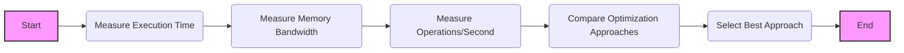
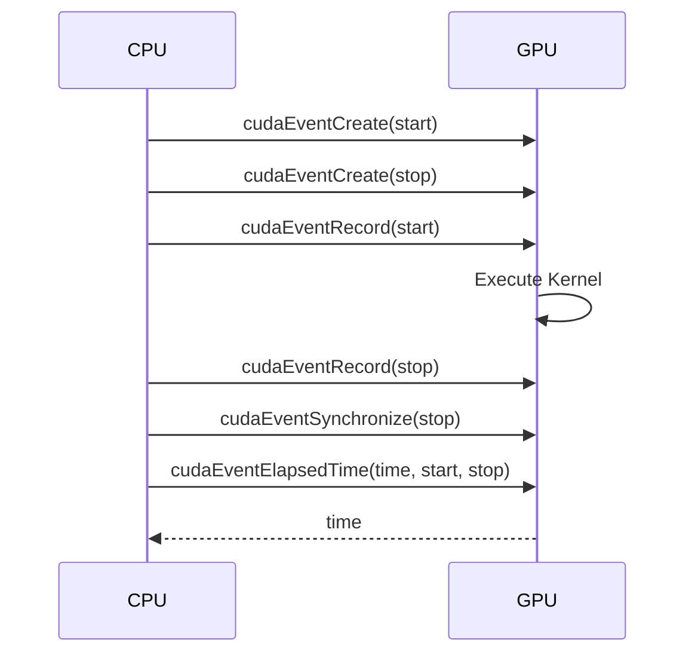
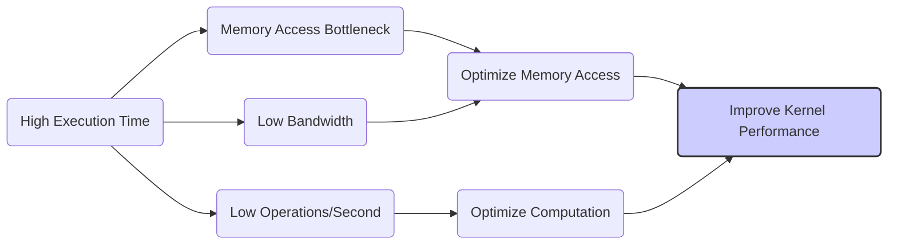
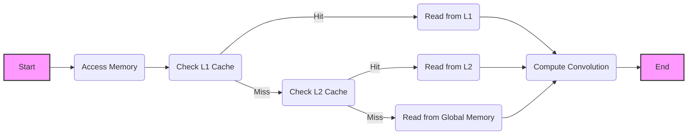
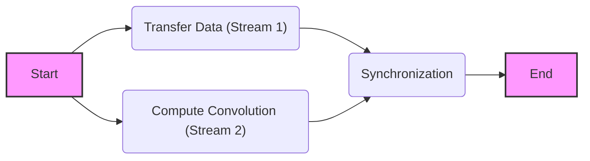

Okay, I will add Mermaid diagrams to the text to enhance its clarity and understanding. Here's the updated text with the diagrams:

## Performance Evaluation of CUDA Convolution Kernels



### Introdução

A **avaliação de desempenho** é uma etapa fundamental no desenvolvimento de kernels CUDA para convolução, já que diferentes abordagens de otimização podem levar a resultados distintos. É preciso entender quais são as métricas de desempenho a serem medidas, como elas são obtidas e como diferentes implementações se comportam, e, com isso, é possível realizar a melhor escolha para a aplicação desejada. Neste capítulo, exploraremos as principais métricas de desempenho de kernels CUDA para convolução, como obter essas métricas através da API CUDA e como utilizar as informações de desempenho para otimizar a implementação.

### Métricas de Desempenho para Kernels de Convolução

Existem diversas métricas que podem ser utilizadas para avaliar o desempenho de kernels CUDA para convolução, e cada uma delas fornece uma perspectiva diferente sobre a eficiência da implementação:

1.  **Tempo de Execução:** O tempo total que o kernel leva para completar a operação de convolução. Essa métrica é fundamental, já que o objetivo principal do processamento paralelo é reduzir o tempo de execução. O tempo de execução pode ser medido diretamente utilizando a API CUDA e também através de ferramentas de *profiling*.
2.  **Largura de Banda da Memória:** A taxa na qual os dados são transferidos entre a memória e o processador. A largura de banda da memória global é limitada, e, por isso, o acesso eficiente à memória é fundamental. A largura de banda da memória pode ser calculada através da quantidade de dados transferidos em um determinado tempo, mas a sua medida correta e precisa exige o uso de ferramentas de *profiling*.
3.  **Operações por Segundo (FLOPS ou GOPS):** O número de operações de ponto flutuante (ou operações aritméticas, em geral) realizadas por segundo. Essa métrica indica a taxa na qual o processador está realizando a computação, e ela deve ser analisada em conjunto com as métricas de acesso à memória, para que os *gargalos* possam ser identificados.

**Conceito 1: Tempo de Execução e Desempenho**

O **tempo de execução** é uma das principais métricas para avaliar o desempenho de um kernel CUDA. Um tempo de execução menor indica um kernel mais eficiente. O tempo de execução total inclui o tempo gasto na transferência dos dados, no carregamento da memória compartilhada, no processamento da convolução, e no armazenamento dos dados de saída.

**Lemma 1:** *O tempo de execução é uma métrica fundamental para avaliar o desempenho de um kernel CUDA. A redução do tempo de execução indica um kernel mais eficiente e, em geral, essa é a métrica mais importante a ser otimizada.*

**Prova:** O objetivo principal do processamento paralelo é reduzir o tempo de execução das aplicações, e, por isso, essa é a métrica mais importante para avaliar o desempenho, e para direcionar as otimizações do kernel. $\blacksquare$

**Conceito 2: Largura de Banda da Memória**

A **largura de banda da memória** mede a taxa na qual os dados são transferidos entre a memória e o processador. O acesso à memória é um gargalo comum em aplicações com grande demanda computacional, e, por isso, a largura de banda do acesso à memória é uma métrica muito importante a ser considerada na avaliação do desempenho de kernels CUDA para convolução, e a otimização da largura de banda geralmente leva a um desempenho maior.

> ❗ **Ponto de Atenção:** A largura de banda da memória global é limitada, e a utilização eficiente dos caches e da memória compartilhada, permite reduzir a necessidade de acessar a memória global, e com isso, a largura de banda da memória é utilizada de forma mais eficiente.

**Corolário 1:** *A largura de banda da memória, medida em bytes por segundo, é uma métrica que avalia a eficiência do acesso aos dados, e a minimização da quantidade de dados que precisam ser transferidos, ou a forma como esses dados são acessados de maneira coalescente, podem levar a um desempenho maior.*

**Conceito 3: Operações por Segundo (FLOPS/GOPS)**

As **operações por segundo** (FLOPS - *Floating-point Operations Per Second* ou GOPS - *Giga Operations Per Second*) medem a quantidade de operações de ponto flutuante (ou operações em geral) que o processador consegue realizar por segundo. Em kernels de convolução, essa métrica indica a taxa com a qual os cálculos de multiplicação e adição são realizados pelos threads. É importante notar que essa métrica deve ser analisada em conjunto com o tempo total de execução, já que uma alta quantidade de operações por segundo pode não levar a um alto desempenho, caso os gargalos de memória não sejam otimizados.

### Obtendo Métricas de Desempenho com a API CUDA



As métricas de desempenho podem ser obtidas utilizando a API CUDA, e também utilizando ferramentas de *profiling* especializadas, como o *NVIDIA Nsight*. A API CUDA permite medir o tempo de execução, e também outras métricas, através do uso de *events*.

1.  **Medindo o Tempo de Execução com Eventos:** A função `cudaEventCreate()` é utilizada para criar eventos que marcam o início e o fim da execução do kernel.
    ```cpp
    cudaEvent_t start, stop;
    cudaEventCreate(&start);
    cudaEventCreate(&stop);
    ```
   A função `cudaEventRecord()` é utilizada para registrar o tempo no início e no fim da execução, em *streams* específicas:
   ```cpp
    cudaEventRecord(start, 0);
    // executar o kernel
    cudaEventRecord(stop, 0);
    cudaEventSynchronize(stop);
   ```

   A função `cudaEventElapsedTime()` é utilizada para calcular o tempo transcorrido entre o início e o fim da execução, em milissegundos:
    ```cpp
    float time;
    cudaEventElapsedTime(&time, start, stop);
    ```

2.  **Utilização de Profilers:** Ferramentas de *profiling*, como o *NVIDIA Nsight*, fornecem informações mais detalhadas sobre o uso da memória e do processador, incluindo a largura de banda da memória, o número de acessos à memória, o número de operações por segundo e muitos outros dados sobre o desempenho da execução do kernel, e essas informações são importantes para identificar gargalos de desempenho e otimizar o kernel de forma mais precisa.

3.  **Acesso a Métricas da GPU:** Informações sobre o hardware da GPU podem ser obtidas com a função `cudaGetDeviceProperties()`, e os resultados dessa função podem ser utilizados para analisar o impacto do hardware no desempenho da aplicação.

As métricas obtidas através da API CUDA ou das ferramentas de *profiling* permitem analisar e comparar o desempenho de diferentes abordagens de implementação de um kernel de convolução, de forma que as melhores abordagens sejam utilizadas.

**Lemma 2:** *O tempo de execução pode ser obtido através da API CUDA, e a utilização de profilers permite a análise detalhada de diversas métricas de desempenho, como o uso da memória e o número de operações, e essas informações auxiliam o processo de otimização do kernel CUDA.*

**Prova:** A API CUDA permite medir o tempo gasto na execução do kernel, e as ferramentas de *profiling* fornecem informações mais detalhadas sobre o acesso à memória, a largura de banda, o número de operações, o que permite que o desenvolvedor possa ter dados objetivos para analisar o desempenho e para guiar o processo de otimização. $\blacksquare$

**Corolário 2:** *A obtenção de métricas de desempenho, utilizando a API CUDA e as ferramentas de profiling, é um passo fundamental para a análise e a otimização de kernels para convolução, através da medição do tempo de execução, do uso da largura de banda, e da quantidade de operações realizadas.*

### Interpretação e Utilização das Métricas de Desempenho



A interpretação das métricas de desempenho permite identificar gargalos e direcionar as otimizações no kernel.

1.  **Tempo de Execução:** Um tempo de execução longo indica que o kernel está levando muito tempo para completar a convolução. O tempo pode ser otimizado através da escolha de diferentes níveis de memória e através do uso eficiente das diferentes unidades de processamento da GPU, e também através da escolha adequada do tamanho dos blocos, tiles e da utilização dos *halo elements*.

2.  **Largura de Banda da Memória:** Uma baixa largura de banda da memória indica que o acesso à memória está sendo um gargalo no desempenho. Um baixo aproveitamento da largura de banda pode indicar a necessidade de refazer a forma como os dados são acessados na memória global e na memória compartilhada.

3.  **Operações por Segundo:** Uma baixa quantidade de operações por segundo indica que o processador não está sendo utilizado de forma eficiente. O *unrolling* de loops, e o uso da memória compartilhada e da memória constante pode aumentar o número de operações por segundo, e também otimizar a forma como o processador executa as instruções do kernel.
4. **Análise em Conjunto:** As métricas de desempenho devem ser analisadas em conjunto. Um alto valor de operações por segundo, por exemplo, pode não indicar um bom desempenho caso a largura de banda da memória seja baixa, ou se o acesso à memória for lento devido ao uso incorreto do cache.

**Lemma 3:** *A análise conjunta das métricas de desempenho permite identificar gargalos e direcionar as otimizações em um kernel CUDA para convolução. A interpretação dos dados permite que as escolhas sejam feitas de forma mais informada, para que os recursos da GPU sejam utilizados da melhor forma possível.*

**Prova:** O tempo de execução, a largura de banda da memória, e o número de operações por segundo são informações que se complementam, e que permitem identificar pontos de gargalo e otimizar o kernel para um melhor desempenho, e a análise das métricas deve ser realizada em conjunto, para se ter uma visão completa da performance. $\blacksquare$

As métricas devem ser utilizadas para guiar as otimizações. Se o tempo de execução é muito alto, e a largura de banda da memória é baixa, a otimização do acesso à memória deve ser priorizada. Se a largura de banda é alta, mas as operações por segundo são baixas, o *loop unrolling* pode ser uma boa estratégia para otimizar o desempenho. O uso de *profilers* permite identificar esses gargalos com mais precisão, e possibilita a criação de kernels mais eficientes.

**Corolário 3:** *A interpretação cuidadosa das métricas de desempenho permite identificar os gargalos e os pontos de otimização de um kernel CUDA para convolução, através da análise do tempo de execução, da largura de banda da memória e do número de operações por segundo.*

### Análise Teórica Avançada da Avaliação de Desempenho

**Pergunta Teórica Avançada 1:** *Como o tamanho dos tiles e o tamanho da máscara de convolução afetam as métricas de desempenho (tempo de execução, largura de banda, FLOPS) em kernels CUDA para convolução, e qual o trade-off entre essas métricas ao escolher os parâmetros de um kernel?*

**Resposta:**

O **tamanho dos *tiles*** e o **tamanho da *convolution mask*** afetam as **métricas de desempenho** (tempo de execução, largura de banda da memória e FLOPS) em kernels CUDA para convolução de forma complexa. A escolha desses parâmetros tem um impacto direto no comportamento do kernel e deve levar em consideração os *trade-offs* entre essas métricas.

**Lemma 4:** *O tamanho dos tiles e da convolution mask afetam as métricas de desempenho de kernels CUDA, e a escolha desses parâmetros envolve um trade-off entre o uso da memória, a largura de banda, a quantidade de operações e o tempo total de execução do kernel.*

**Prova:** O tamanho dos *tiles* e o tamanho da máscara influenciam o número de acessos à memória global, a utilização da memória compartilhada, a quantidade de operações que precisam ser feitas, e, por isso, a escolha adequada desses parâmetros é fundamental para que o desempenho seja o melhor possível. $\blacksquare$

A interação entre os **parâmetros** e as **métricas de desempenho** é a seguinte:

1.  **Tamanho do Tile e Tempo de Execução:** *Tiles* menores levam a um maior número de acessos à memória global e podem aumentar o tempo total de execução, apesar de utilizarem menos memória compartilhada. *Tiles* maiores podem reduzir o tempo de acesso à memória, mas podem causar problemas de divergência de fluxo de controle.
2.  **Tamanho do Tile e Largura de Banda:** *Tiles* menores podem reduzir o uso da largura de banda, já que eles podem levar a acessos não coalescentes, e um uso menos eficiente da memória compartilhada. *Tiles* maiores podem ter um acesso mais coalescente, mas também podem aumentar o volume de dados e o overhead da memória compartilhada.
3.  **Tamanho da Máscara e Tempo de Execução:** Máscaras maiores aumentam o número de operações por elemento, e isso também aumenta o tempo de execução do kernel, já que mais operações precisam ser feitas para cada elemento de saída.
4. **Tamanho da Máscara e FLOPS:** Máscaras maiores levam a um maior número de operações por segundo, mas essa métrica, por si só, não garante um bom desempenho, já que os gargalos podem estar no acesso à memória, e não no poder de processamento da GPU.
5.  **Trade-Off:** A escolha ideal envolve um balanço cuidadoso entre essas métricas, maximizando o número de operações por segundo, minimizando o acesso à memória global e minimizando o tempo total de execução, o que geralmente exige a análise de diferentes opções para a escolha dos melhores parâmetros.

A escolha dos parâmetros do kernel deve considerar o impacto de cada um deles, e a escolha ideal depende da arquitetura da GPU, do problema que está sendo resolvido, e também das suas características específicas.

**Corolário 4:** *A escolha do tamanho dos tiles e da convolution mask deve considerar o trade-off entre o tempo de execução, a largura de banda, e a quantidade de FLOPS, para que as métricas de desempenho sejam otimizadas para a aplicação em questão.*

**Pergunta Teórica Avançada 2:** *Como a escolha de diferentes tipos de memória (global, compartilhada e constante) afeta o tempo de acesso à memória e, consequentemente, as métricas de desempenho em kernels CUDA para convolução, e como medir o impacto de cada tipo de memória no tempo total de execução?*

**Resposta:**

A escolha de diferentes tipos de **memória (global, compartilhada e constante)** afeta diretamente o **tempo de acesso à memória**, e, consequentemente, as **métricas de desempenho** em kernels CUDA para convolução. Cada tipo de memória tem diferentes características de latência e largura de banda, e a escolha adequada de onde os dados são armazenados e acessados é fundamental para que o tempo de acesso à memória seja minimizado, e o desempenho seja otimizado.

**Lemma 5:** *A escolha entre a memória global, a memória compartilhada, e a memória constante influencia o tempo de acesso à memória e o desempenho do kernel. O uso adequado de cada tipo de memória permite reduzir o tempo total de execução, através da minimização da latência e do uso da largura de banda de forma eficiente.*

**Prova:** A memória global possui alta latência e baixa largura de banda. A memória compartilhada possui baixa latência e alta largura de banda, mas com capacidade limitada. A memória constante é otimizada para acesso por múltiplos threads. A forma com que esses tipos de memória são utilizados afeta o tempo de acesso à memória e o tempo total de execução do kernel. $\blacksquare$

A **influência dos diferentes níveis de memória** no desempenho:

1.  **Memória Global:** O acesso à memória global tem alta latência e baixa largura de banda, e quanto maior o acesso à memória global, maior o tempo de execução, já que essa etapa gera um gargalo no processamento dos dados. A minimização do uso da memória global é um objetivo principal na otimização do kernel.

2.  **Memória Compartilhada:** A memória compartilhada possui baixa latência e alta largura de banda, e a utilização dessa memória para o armazenamento e acesso dos dados que são utilizados com muita frequência pelos threads resulta em um tempo de acesso reduzido.
3.  **Memória Constante:** A memória constante possui baixa latência e alta largura de banda para dados que são lidos por vários threads, e por isso, ela é ideal para o armazenamento da *convolution mask*. O acesso através do cache da memória constante faz com que o tempo de acesso seja menor, e também garante o *broadcast* dos dados de forma eficiente.

A **medição do impacto** de cada tipo de memória no desempenho deve ser feita através de ferramentas de *profiling*, que permitem medir o tempo de acesso a cada tipo de memória, e também a quantidade de dados que são acessados em cada região da memória.

A escolha de onde armazenar os dados e de como acessá-los deve considerar o tipo de dado, a frequência de acesso, a largura de banda da memória, e a necessidade de compartilhamento dos dados entre os threads.

**Corolário 5:** *A escolha dos tipos de memória (global, compartilhada, constante) deve considerar a latência, a largura de banda, a necessidade de compartilhamento e a quantidade de acessos, e o uso correto desses tipos de memória é essencial para maximizar o desempenho do kernel CUDA para convolução.*

### Dedução Teórica Complexa: Modelagem do Tempo de Execução da Convolução e o Impacto dos Caches



O **tempo de execução** de uma convolução em CUDA, e o impacto da utilização dos diferentes níveis de **caches** (L1 e L2) pode ser modelado levando em consideração o tempo para acessar os dados na memória, e o impacto da utilização dos *caches* no tempo total de execução. A modelagem permite analisar como os diferentes níveis de memória e os caches afetam a latência do acesso aos dados, e como minimizar essa latência.

O tempo de execução do kernel pode ser modelado como:
$$
T_{kernel} = T_{access} + T_{computacao}
$$

Onde $T_{access}$ representa o tempo total de acesso aos dados, e $T_{computacao}$ representa o tempo gasto nas operações da convolução.

**Lemma 6:** *O tempo de execução de um kernel CUDA é modelado pela soma do tempo de acesso à memória e do tempo de computação. O uso eficiente dos caches reduz o tempo de acesso à memória e, consequentemente, o tempo total de execução do kernel.*

**Prova:** O tempo total de execução corresponde ao tempo necessário para realizar todas as operações do kernel, e o acesso à memória é um componente fundamental desse tempo, e o seu impacto pode ser minimizado através da utilização adequada dos caches. $\blacksquare$

O tempo para acessar a memória,  $T_{access}$ , pode ser modelado como:
$$
T_{access} = p_{L1}*Lat_{L1} + (1 - p_{L1})*(p_{L2}*Lat_{L2} + (1-p_{L2})*Lat_{global})
$$

Onde $p_{L1}$ representa a taxa de acerto do cache L1, $Lat_{L1}$ a latência do acesso a esse cache, $p_{L2}$ a taxa de acerto do cache L2, $Lat_{L2}$ a latência de acesso a esse cache, e $Lat_{global}$ a latência de acesso à memória global, e a modelagem mostra como o uso dos caches leva a uma redução do tempo de acesso à memória. O tempo de computação, $T_{computacao}$, pode ser modelado como:

$$
T_{computacao} =  \frac{N_{op}}{P}*T_{op}
$$

Onde $N_{op}$ representa o número de operações, P o número de threads e $T_{op}$ o tempo gasto em cada operação, e o número de operações também pode ser influenciado pela forma como o acesso à memória é organizado.

A modelagem mostra como a utilização dos caches reduz o tempo de acesso à memória, e como o uso eficiente dos diferentes níveis de cache é fundamental para o bom desempenho do kernel CUDA para convolução.

**Corolário 6:** *O modelo do tempo de execução com caches demonstra como o uso desses recursos pode reduzir a latência do acesso à memória, e como é importante otimizar o uso dos caches em diferentes níveis da hierarquia de memória para obter o melhor desempenho do kernel.*

### Modelagem do Tempo de Execução da Convolução com Overlapping



O **tempo de execução** de uma convolução com a utilização de **overlapping** entre a transferência de dados e a computação pode ser modelado levando em consideração o tempo gasto na transferência de dados, o tempo gasto na computação e também a latência do tempo de sincronização. O modelo do tempo de execução do kernel permite analisar o impacto do uso do *overlapping* no tempo total de execução.

O tempo de execução do kernel pode ser modelado como:

$$
T_{kernel} =  max(T_{transfer}, T_{compute}) + T_{sync}
$$

Onde $T_{transfer}$ representa o tempo para a transferência de dados, $T_{compute}$ o tempo para realizar os cálculos da convolução, e $T_{sync}$ o tempo para realizar a sincronização das operações.

**Lemma 7:** *O tempo de execução de uma convolução com o uso de overlapping pode ser modelado com o tempo de transferência, com o tempo de computação e com o tempo da sincronização, e o objetivo da técnica de overlapping é fazer com que o tempo total seja o máximo entre o tempo de computação e transferência, e também a redução do tempo da sincronização, para que o tempo total da execução do kernel seja o menor possível.*

**Prova:** A sobreposição das etapas de execução da transferência e da computação permite que a latência de uma etapa seja escondida pelo tempo gasto na execução da outra etapa. $\blacksquare$

O tempo de transferência,  $T_{transfer}$, pode ser modelado como:
$$
T_{transfer} =  \frac{Data_{transfer}}{BW_{transfer}} + Lat_{transfer}
$$

Onde $Data_{transfer}$ representa o tamanho dos dados a serem transferidos,  $BW_{transfer}$ a largura de banda e  $Lat_{transfer}$ a latência da transferência. O tempo para realizar a computação, $T_{compute}$, pode ser modelado como:
$$
T_{compute} = \frac{N_{op}}{P} * T_{op}
$$
Onde $N_{op}$ representa o número total de operações da convolução, P o número de threads, e $T_{op}$ o tempo para realizar uma operação. E o tempo de sincronização é dado por:
$$
T_{sync} = T_{event} * N_{eventos}
$$

Onde $T_{event}$ representa o tempo para executar um evento de sincronização, e $N_{eventos}$ representa o número de eventos de sincronização.

O uso do overlapping permite que os dados sejam transferidos para a GPU enquanto o processamento de um outro tile está sendo realizado, de forma que o tempo total de execução é reduzido através do uso do paralelismo entre essas duas etapas, e a latência da transferência é reduzida pelo uso de múltiplas *streams*, que realizam as operações em paralelo.

**Corolário 7:** *O modelo de tempo de execução da convolução com overlapping permite analisar como a sobreposição de transferências e cálculos diminui a latência total da operação, e como a utilização de streams pode aumentar a eficiência do uso da GPU.*

### Conclusão

(Nota: Não conclua o capítulo até que o usuário solicite.)

### Referências

[^1]: "In the next several chapters, we will discuss a set of important parallel computation patterns. These patterns are the basis of many parallel algorithms that appear in applications." *(Trecho de <Parallel Patterns: Convolution>)*
[^2]: "Mathematically, convolution is an array operation where each output data element is a weighted sum of a collection of neighboring input elements. The weights used in the weighted sum calculation are defined by an input mask array, commonly referred to as the convolution kernel." *(Trecho de <Parallel Patterns: Convolution>)*
[^3]: "Because convolution is defined in terms of neighboring elements, boundary conditions naturally exist for output elements that are close to the ends of an array." *(Trecho de <Parallel Patterns: Convolution>)*
[^4]: "Kernel functions access constant memory variables as global variables. Thus, their pointers do not need to be passed to the kernel as parameters." *(Trecho de <Parallel Patterns: Convolution>)*
[^5]: "For image processing and computer vision, input data is usually in 2D form, with pixels in an x-y space. Image convolutions are also two dimensional." *(Trecho de <Parallel Patterns: Convolution>)*
[^6]: "A more serious problem is memory bandwidth. The ratio of floating-point arithmetic calculation to global memory accesses is only about 1.0 in the kernel." *(Trecho de <Parallel Patterns: Convolution>)*
[^7]: "The CUDA programming model allows programmers to declare a variable in the constant memory. Like global memory variables, constant memory variables are also visible to all thread blocks. The main difference is that a constant memory variable cannot be changed by threads during kernel execution. Furthermore, the size of the constant memory can vary from device to device." *(Trecho de <Parallel Patterns: Convolution>)*
[^8]: "We will discuss two input data tiling strategies for reducing the total number of global memory accesses." *(Trecho de <Parallel Patterns: Convolution>)*
[^9]:  "Constant memory variables play an interesting role in using caches in massively parallel processors. Since they are not changed during kernel execution, there is no cache coherence issue during the execution of a kernel." *(Trecho de <Parallel Patterns: Convolution>)*
[^10]:  "Furthermore, the design of caches in these processors is typically optimized to broadcast a value to a large number of threads." *(Trecho de <Parallel Patterns: Convolution>)*
[^11]: "As a result, modern processors often employ multiple levels of caches." *(Trecho de <Parallel Patterns: Convolution>)*
[^12]: "Unlike CUDA shared memory, or scratchpad memories in general, caches are 'transparent’ to programs." *(Trecho de <Parallel Patterns: Convolution>)*
[^13]: "The lowest level, L1 or level 1, is the cache that is directly attached to a processor core." *(Trecho de <Parallel Patterns: Convolution>)*
[^14]: "It runs at a speed very close to the processor in both latency and bandwidth." *(Trecho de <Parallel Patterns: Convolution>)*
[^15]: "However, an L1 cache is small in size, typically between 16 KB and 64 KB." *(Trecho de <Parallel Patterns: Convolution>)*
[^16]:  "L2 caches are larger, in the range of 128 KB to 1 MB, but can take tens of cycles to access." *(Trecho de <Parallel Patterns: Convolution>)*
[^17]:  "They are typically shared among multiple processor cores, or streaming multiprocessors (SMs) in a CUDA device." *(Trecho de <Parallel Patterns: Convolution>)*

Deseja que eu continue com as próximas seções?
