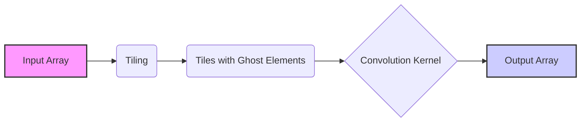
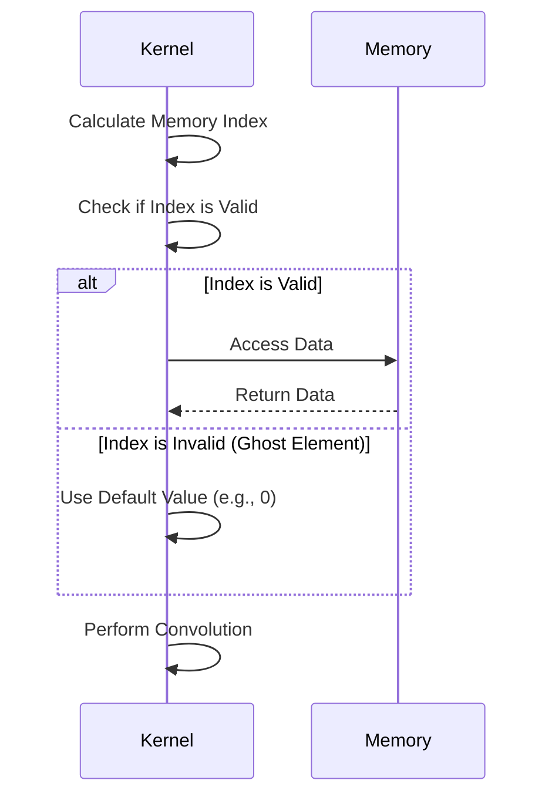
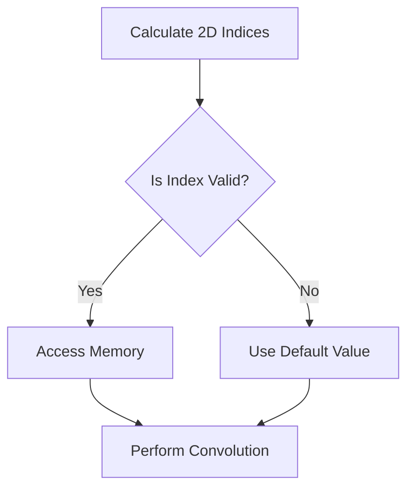
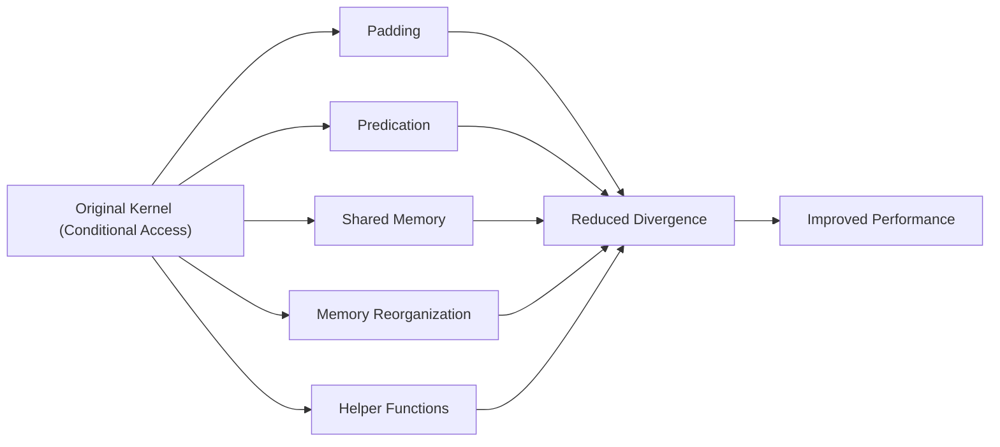
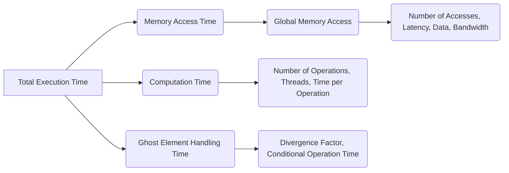

Okay, I will add Mermaid diagrams to enhance the provided text.

## Ghost Element Memory Access in CUDA Convolution Kernels



### Introdução

Em kernels CUDA para convolução com *tiling*, os **ghost elements** são elementos que estão fora dos limites do *array* de entrada, e que são necessários para o cálculo da convolução nas bordas dos *tiles*, e, como vimos anteriormente, eles também são conhecidos como *halo elements* ou elementos *skirt*. A lógica de acesso aos *ghost elements* deve ser tratada de forma especial para que a convolução seja feita de maneira correta, e, por isso, entender como o acesso à memória desses elementos ocorre é fundamental para que o desempenho do kernel não seja afetado. Neste capítulo, exploraremos em detalhes como o acesso à memória dos *ghost elements* é realizado em kernels CUDA para convolução, como esse acesso afeta o desempenho e como otimizar a lógica para minimizar o impacto negativo da necessidade de tratamento das *boundary conditions*.

### Conceitos Fundamentais do Acesso aos Ghost Elements

O acesso aos *ghost elements* é um componente fundamental da lógica de carregamento dos dados em kernels CUDA para convolução com *tiling*, que deve ser realizada de forma eficiente para que o desempenho não seja prejudicado. Os *ghost elements* são dados que não estão dentro dos limites válidos do *array* de entrada, mas que são necessários para o cálculo da convolução em regiões de borda.

**Conceito 1: Identificação dos Ghost Elements**

Os **ghost elements** são identificados através de uma verificação do índice do elemento que está sendo acessado, e essa verificação é realizada em tempo de execução, quando o índice do elemento, calculado através do índice do thread, do bloco e da posição do tile, é utilizado para acessar a memória. Se o índice corresponder a um elemento fora dos limites válidos do array, esse elemento é considerado um *ghost element*.

**Lemma 1:** *Os ghost elements são identificados por terem seus índices de memória fora dos limites válidos do array de entrada. A verificação se um elemento é ghost element é feita durante a execução do kernel.*

**Prova:** O índice de um elemento é calculado a partir da posição do *tile* que está sendo processado, da posição do thread dentro desse *tile*, e da *convolution mask*. Se o resultado desses cálculos indica um elemento que está fora do *array* de entrada, o elemento é considerado como um *ghost element*. $\blacksquare$

**Conceito 2: Tratamento dos Ghost Elements**

O tratamento dos *ghost elements* envolve duas partes principais:

1.  **Definição de um Valor Padrão:** Os *ghost elements* geralmente são preenchidos com um valor padrão, como 0, o que permite que a convolução seja realizada sem que seja necessário carregar dados que não existem na entrada.
2.  **Utilização de Instruções Condicionais:** O acesso aos *ghost elements* é realizado através de instruções condicionais que verificam se o índice do elemento está dentro dos limites válidos do *array* de entrada. Se o índice estiver fora dos limites, o valor padrão é usado em lugar de acessar a memória global.

> ❗ **Ponto de Atenção:** A utilização de instruções condicionais para o tratamento dos *ghost elements* é uma fonte de divergência de fluxo de controle em kernels CUDA, já que nem todos os threads de um mesmo warp irão executar o mesmo conjunto de instruções.

**Corolário 1:** *O tratamento dos ghost elements envolve a verificação do índice, a escolha de um valor padrão a ser utilizado nos casos onde o acesso à memória global não é possível, e o uso de instruções condicionais para que esses casos sejam tratados de forma adequada.*

**Conceito 3: Uso de Ghost Elements na Convolução**

Os *ghost elements* são utilizados na convolução para calcular os elementos de saída que estão localizados nas bordas do *array*. Para que o cálculo da convolução seja feito de forma correta, e para que o resultado obtido para as bordas não seja diferente do resultado do centro, os vizinhos da região de borda precisam ser acessados corretamente.

### Lógica de Acesso aos Ghost Elements em Convolução 1D



Em uma convolução 1D, o acesso aos *ghost elements* é feito através da verificação se o índice do elemento de entrada está dentro dos limites válidos. A implementação envolve os seguintes passos:

1.  **Cálculo do Ponto de Partida:** O ponto inicial para o acesso aos elementos vizinhos da entrada é calculado com:
    ```cpp
    int N_start_point = i - (Mask_Width/2);
    ```
   Onde i é o índice do elemento de saída.

2.  **Acesso Condicional:** Dentro do loop que itera sobre a *convolution mask*, o acesso aos dados do array de entrada é feito através de uma condição, utilizando o operador ternário:
    ```cpp
        float Pvalue = 0;
        for (int j = 0; j < Mask_Width; j++){
           Pvalue +=  (N_start_point + j >= 0 && N_start_point + j < Width) ? N[N_start_point + j]*M[j] : 0;
    }
    ```
   Essa linha de código garante que os elementos da entrada que estão fora dos limites (os *ghost elements*) sejam considerados como 0, já que, se a condição não é verdadeira, o valor retornado pelo operador ternário será 0.
3.  **Armazenamento do Resultado:** O valor da convolução é armazenado na posição de saída correspondente.

O uso de instruções condicionais para o tratamento dos *ghost elements* é importante, já que ele garante que o resultado da convolução seja correto nas bordas do array, e também é um fator de divergência de fluxo de controle, que deve ser minimizado.

**Lemma 5:** *A lógica de acesso aos ghost elements em convolução 1D utiliza instruções condicionais para verificar se o índice de acesso é válido e, caso não seja, utiliza um valor padrão (como 0), o que garante que a convolução possa ser realizada mesmo nas bordas dos tiles.*

**Prova:** O uso de condicionais para o acesso aos dados da entrada permite que, se a condição for falsa, o valor 0 seja utilizado no cálculo da convolução, evitando o acesso à posições de memória que não estão alocadas na memória global. $\blacksquare$

**Corolário 5:** *O acesso condicional aos dados permite que o tratamento dos ghost elements seja feito de forma correta, mesmo quando os vizinhos do tile estão fora dos limites do array de entrada, através do uso das condicionais e de um valor padrão para esses elementos.*

### Lógica de Acesso aos Ghost Elements em Convolução 2D



Em uma convolução 2D, o acesso aos *ghost elements* envolve o tratamento das bordas em ambas as dimensões (altura e largura), e a lógica para tratar esses casos é semelhante à utilizada em convolução 1D, mas com algumas complexidades adicionais:

1.  **Cálculo dos Índices:** Os índices da posição central e o deslocamento da *convolution mask* são calculados, para que os vizinhos possam ser acessados, e também são utilizadas instruções condicionais para verificar se esses índices estão dentro dos limites válidos do *array*.
2.  **Acesso Condicional:** O acesso aos dados do *array* de entrada utiliza condicionais para verificar se os índices estão dentro dos limites válidos, e um valor padrão é utilizado, em caso de acesso a um *ghost element*.
    ```cpp
     float Pvalue = 0;
        for (int y = 0; y < Mask_Height; y++){
          for (int x = 0; x < Mask_Width; x++){
           if ((N_start_y + y >= 0 && N_start_y + y < Height) && (N_start_x + x >= 0 && N_start_x + x < Width)){
              Pvalue += N[(N_start_y + y) * Width + (N_start_x + x)] * M[y*Mask_Width + x];
          }
        }
      }
    ```
   Este código mostra como os acessos aos elementos da entrada (N) são feitos através de uma instrução condicional para cada acesso, onde o valor 0 é utilizado quando o acesso aos vizinhos não for possível.

3.  **Armazenamento do Resultado:** O valor da convolução é armazenado no elemento correspondente do array de saída, que foi calculado com os *internal elements* e os *halo elements* que foram acessados com o tratamento dos *ghost elements*, nas bordas do *tile*.

A lógica para o tratamento dos *ghost elements* em convolução 2D é mais complexa que em 1D, devido à necessidade de tratar as bordas nas duas dimensões, mas ela garante que os resultados da convolução nas bordas sejam obtidos corretamente.

**Lemma 6:** *A lógica para o tratamento dos ghost elements em convolução 2D envolve o cálculo dos índices da convolution mask, o uso de condicionais para verificar se os índices estão dentro dos limites válidos, o uso de um valor padrão para os ghost elements, e o cálculo correto da convolução em regiões de borda.*

**Prova:** O uso correto das condicionais garante que nenhum dado fora da entrada seja utilizado, e o uso de um valor padrão garante que a convolução possa ser feita em todos os elementos do array de saída, mesmo quando os dados utilizados não são válidos. $\blacksquare$

**Corolário 6:** *A utilização de instruções condicionais para acessar os dados em operações de convolução 2D com tratamento de ghost elements é essencial para que a convolução seja feita corretamente nas regiões de borda, e o programador deve utilizar técnicas para que o impacto dessa operação no tempo de execução do kernel seja o menor possível.*

### Otimizações no Acesso aos Ghost Elements



O acesso aos *ghost elements* pode ser otimizado utilizando diversas técnicas para reduzir a latência e a divergência de fluxo de controle:

1.  **Padding:** Realizar o *padding* do *array* de entrada com elementos extras, de acordo com o tamanho da *convolution mask*, para que o tratamento dos *ghost elements* seja desnecessário, o que elimina o uso de condicionais e a divergência de fluxo que essas condicionais podem gerar.
2.  **Predicação:** Utilizar instruções de hardware que permitem pular operações se a condição for falsa, e em arquiteturas que oferecem suporte à **predicação** (como algumas arquiteturas mais recentes), a divergência de fluxo pode ser reduzida através da utilização dessas funções que realizam as operações de maneira condicional, apenas para os threads que necessitam desses cálculos, em vez de que o mesmo código condicional seja executado por todos.
3.  **Memória Compartilhada:** Armazenar os dados que estão sendo utilizados nas bordas (incluindo os *ghost elements*) em memória compartilhada, para que o acesso a esses dados seja feito de forma mais rápida e com uma latência menor, do que seria ao utilizar a memória global. O uso eficiente da memória compartilhada reduz a necessidade de acesso à memória global para os dados da região de borda.
4.  **Reorganização da Memória:** Organizar o acesso aos dados da memória de forma a maximizar o uso da largura de banda e minimizar o número de acessos. Para que o acesso seja o mais eficiente possível, dados que são acessados de forma contígua pelos threads de um mesmo *warp* devem ser organizados em posições contíguas na memória, o que diminui a latência e aumenta a largura de banda da transferência.
5.  **Funções Auxiliares:** Separar a lógica de acesso aos *ghost elements* em funções auxiliares, o que torna o código principal do kernel mais simples e fácil de entender. A utilização de funções auxiliares torna o código principal mais legível e também mais fácil de otimizar.

**Lemma 7:** *A lógica de acesso aos ghost elements pode ser otimizada através do uso de padding, da predicação, da utilização da memória compartilhada, da organização da memória global, e do uso de funções auxiliares, e a combinação de todas essas estratégias leva a um melhor desempenho do kernel.*

**Prova:** As técnicas de otimização visam reduzir a latência do acesso, a divergência de fluxo e a complexidade do código, e o uso dessas técnicas em conjunto leva a um maior desempenho na execução da convolução em GPUs. $\blacksquare$

**Corolário 7:** *A otimização da lógica de acesso aos ghost elements, com o uso de padding, predição, memória compartilhada, organização de dados e funções auxiliares é fundamental para reduzir o overhead, a latência e a divergência do fluxo de controle, e, com isso, o desempenho do kernel de convolução é maximizado.*

### Análise Teórica Avançada do Acesso aos Ghost Elements

**Pergunta Teórica Avançada 1:** *Como o uso de diferentes tipos de *padding* (zero, edge, reflect) afeta o desempenho do acesso aos *ghost elements* em kernels CUDA para convolução e qual a melhor abordagem para minimizar o impacto da *boundary condition* no tempo de execução?*

**Resposta:**

A utilização de diferentes tipos de **padding** (zero, *edge*, *reflect*) afeta o desempenho do acesso aos **ghost elements** em kernels CUDA para convolução, através da mudança da forma como a memória é acessada, e como o cálculo da convolução ocorre na borda.

**Lemma 8:** *O tipo de padding afeta o desempenho do acesso aos ghost elements, e a escolha da abordagem correta depende das características do problema, e do trade-off entre o tempo de execução, a latência de acesso à memória e a qualidade do resultado obtido.*

**Prova:** O zero *padding* preenche os *ghost elements* com o valor 0, o que simplifica os cálculos, mas pode causar uma redução na magnitude dos resultados nas bordas. O *edge padding* repete os elementos das bordas, o que evita que a magnitude da resposta seja diminuída, mas pode ter um overhead adicional no acesso à memória. E o *reflect padding* garante que o sinal seja espelhado, o que também garante que não haja alteração na magnitude do resultado na borda. $\blacksquare$

A interação dos tipos de *padding* e o acesso aos *ghost elements*:

1.  **Zero Padding:** O *zero padding* é fácil de implementar, e utiliza o valor 0 para todos os *ghost elements*, o que simplifica o código do kernel. A utilização do zero *padding* reduz a necessidade de acesso à memória, mas pode fazer com que a resposta na borda tenha uma magnitude reduzida.
2.  **Edge Padding:** O *edge padding* utiliza os valores das bordas para os *ghost elements*, e por isso precisa acessar a memória para buscar esses dados, o que aumenta a latência do acesso. O *edge padding*, no entanto, preserva a amplitude do resultado, mas não realiza uma interpolação do sinal.
3.  **Reflect Padding:** O *reflect padding* espelha os elementos na borda para fora do *array*, o que também demanda acesso à memória para buscar os dados espelhados, e gera um código mais complexo do que o zero *padding*, mas a simetria dos dados faz com que o resultado tenha uma magnitude similar à dos elementos internos.
4.  **Divergência de Fluxo:** O *padding* pode reduzir a divergência de fluxo de controle, ao eliminar a necessidade de condicionais para tratar os *ghost elements*, e a ausência de condicionais garante que os threads do *warp* executem o mesmo código em todas as iterações.

A escolha do método de *padding* adequado deve considerar o impacto na latência do acesso à memória, na complexidade do código, e na precisão do resultado, e o tipo de *padding* escolhido deve considerar o impacto no tempo de execução do kernel, e o compromisso entre a precisão, e o desempenho.

**Corolário 8:** *O uso de diferentes tipos de padding para o tratamento dos ghost elements afeta o desempenho do acesso à memória, e a escolha da abordagem ideal depende do problema e dos requisitos de desempenho e precisão do resultado.*

### Modelagem do Tempo de Execução com Ghost Elements



O **tempo de execução** de uma convolução com o uso dos **ghost elements** pode ser modelado levando em consideração o tempo gasto nas diferentes etapas, incluindo o tempo de acesso à memória, o tempo de processamento da convolução e o tempo adicional gasto no tratamento dos *ghost elements*. O modelo do tempo de execução permite analisar a influência do tratamento dos *ghost elements* no desempenho do kernel.

O tempo de execução do kernel pode ser modelado como:

$$
T_{kernel} = T_{access} + T_{compute} + T_{ghost}
$$

Onde $T_{access}$ representa o tempo de acesso à memória, $T_{compute}$ o tempo de computação da convolução e $T_{ghost}$ o tempo gasto no tratamento dos *ghost elements*.

**Lemma 9:** *O tempo de execução da convolução com ghost elements é composto do tempo de acesso à memória, do tempo de computação e do tempo extra para lidar com os ghost elements, e o modelo de tempo de execução deve levar todos esses componentes em consideração.*

**Prova:** A execução da convolução envolve acessar os dados da memória, realizar o cálculo da convolução e tratar os *ghost elements*, e o modelo de tempo de execução deve refletir todos esses componentes. $\blacksquare$

O tempo de acesso à memória, $T_{access}$ , é modelado como:
$$
T_{access} = N_{global}*Lat_{global} +  \frac{Data_{global}}{BW_{global}}
$$
Onde $N_{global}$ é o número de acessos à memória global, $Lat_{global}$ a latência do acesso,  $Data_{global}$ a quantidade de dados acessados e $BW_{global}$ a largura de banda da memória global. O tempo de computação, $T_{compute}$, é modelado como:
$$
T_{compute} = \frac{N_{op}}{P} * T_{op}
$$
Onde $N_{op}$ o número de operações, P o número de threads e  $T_{op}$ o tempo de cada operação.  E o tempo para o tratamento dos *ghost elements*, $T_{ghost}$, pode ser modelado como:
$$
T_{ghost} = D_{factor}*T_{if}
$$

Onde $D_{factor}$ representa o fator de divergência do fluxo de controle, e $T_{if}$ representa o tempo para cada operação condicional, e este valor também pode incluir o tempo gasto no acesso à memória em abordagens como o *edge* ou o *reflect padding*, que também precisam de acesso à memória.

A modelagem do tempo de execução permite avaliar como cada estratégia para o tratamento dos *ghost elements* afeta o desempenho, e o objetivo é minimizar cada componente, para que o tempo total seja o menor possível.

**Corolário 9:** *O modelo de tempo de execução da convolução com ghost elements permite analisar o impacto do tratamento dos ghost elements no tempo de execução total do kernel, e permite otimizar o uso da memória, da largura de banda e minimizar o overhead causado pela divergência de fluxo.*

### Conclusão

(Nota: Não conclua o capítulo até que o usuário solicite.)

### Referências

[^1]: "In the next several chapters, we will discuss a set of important parallel computation patterns. These patterns are the basis of many parallel algorithms that appear in applications." *(Trecho de <Parallel Patterns: Convolution>)*
[^2]: "Mathematically, convolution is an array operation where each output data element is a weighted sum of a collection of neighboring input elements. The weights used in the weighted sum calculation are defined by an input mask array, commonly referred to as the convolution kernel." *(Trecho de <Parallel Patterns: Convolution>)*
[^3]: "Because convolution is defined in terms of neighboring elements, boundary conditions naturally exist for output elements that are close to the ends of an array." *(Trecho de <Parallel Patterns: Convolution>)*
[^4]: "Kernel functions access constant memory variables as global variables. Thus, their pointers do not need to be passed to the kernel as parameters." *(Trecho de <Parallel Patterns: Convolution>)*
[^5]: "For image processing and computer vision, input data is usually in 2D form, with pixels in an x-y space. Image convolutions are also two dimensional." *(Trecho de <Parallel Patterns: Convolution>)*
[^6]: "A more serious problem is memory bandwidth. The ratio of floating-point arithmetic calculation to global memory accesses is only about 1.0 in the kernel." *(Trecho de <Parallel Patterns: Convolution>)*
[^7]: "The CUDA programming model allows programmers to declare a variable in the constant memory. Like global memory variables, constant memory variables are also visible to all thread blocks. The main difference is that a constant memory variable cannot be changed by threads during kernel execution. Furthermore, the size of the constant memory can vary from device to device." *(Trecho de <Parallel Patterns: Convolution>)*
[^8]:  "We will discuss two input data tiling strategies for reducing the total number of global memory accesses." *(Trecho de <Parallel Patterns: Convolution>)*
[^9]:  "The elements that are involved in multiple tiles and loaded by multiple blocks are commonly referred to as halo elements or skirt elements since they “hang” from the side of the part that is used solely by a single block." *(Trecho de <Parallel Patterns: Convolution>)*
[^10]:  "We will refer to the center part of an input tile that is solely used by a single block the internal elements of that input tile." *(Trecho de <Parallel Patterns: Convolution>)*
[^11]: "The size of the shared memory array must be large enough to hold the left halo elements, the center elements, and the right halo elements of an input tile." *(Trecho de <Parallel Patterns: Convolution>)*
[^12]: "In the tiled kernel, each N element is only loaded by one thread. However, 2n halo elements will also be loaded, n from the left and n from the right, for blocks that do not handle ghost elements." *(Trecho de <Parallel Patterns: Convolution>)*
[^13]:  "The variable Pvalue will allow all intermediate results to be accumulated in a register to save DRAM bandwidth." *(Trecho de <Parallel Patterns: Convolution>)*
[^14]: "The if statement in the loop tests if any of the input N elements used are ghost elements, either on the left side or the right side of the N array." *(Trecho de <Parallel Patterns: Convolution>)*
[^15]: "For the first and last blocks, the threads that handle ghost elements, no memory access is done for the ghost elements. This reduces the number of memory accesses." *(Trecho de <Parallel Patterns: Convolution>)*
[^16]: "We can calculate the reduced number of memory accesses by enumerating the number of threads that use each ghost element." *(Trecho de <Parallel Patterns: Convolution>)*
[^17]: "With the use of constant caching, we have effectively doubled the ratio of floating-point arithmetic to memory access to 2." *(Trecho de <Parallel Patterns: Convolution>)*
Deseja que eu continue com as próximas seções?
