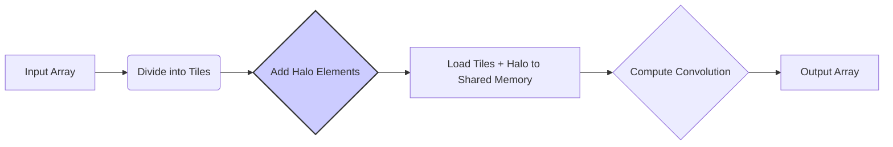
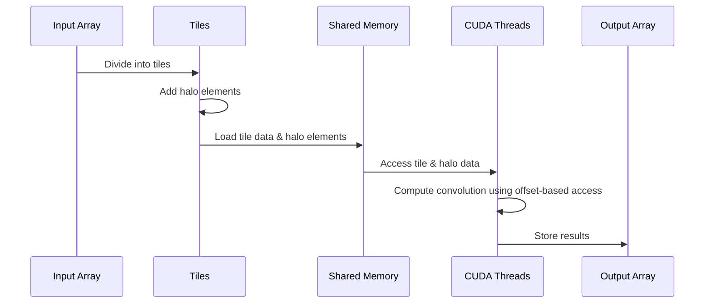
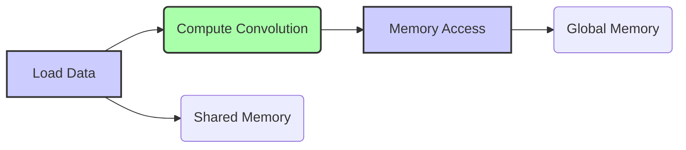

Okay, I will add Mermaid diagrams to enhance the text.

## Halo Elements in CUDA Convolution Kernels



### Introdução

Em kernels CUDA para convolução que utilizam *tiling*, os **halo elements** (também conhecidos como *ghost elements* ou elementos *skirt*) são elementos adicionais que estendem os *tiles* de entrada para além de suas bordas, e são necessários para o cálculo correto da convolução em todos os elementos, e, em particular, nas bordas. Os *halo elements* garantem que, mesmo nos *tiles* localizados nas bordas do *array* de entrada, a convolução possa ser realizada corretamente, sem a perda de informação. Neste capítulo, exploraremos o conceito de *halo elements*, como eles são utilizados em kernels CUDA para convolução, como eles influenciam o desempenho e como otimizar o seu uso.

### Conceitos Fundamentais dos Halo Elements

Os **halo elements** são elementos adicionais que são incluídos nos *input tiles*, e que estão localizados nas bordas de cada *tile*. Como a operação de convolução utiliza elementos vizinhos para calcular um elemento de saída, o uso dos *halo elements* garante que todos os elementos do *array* de saída sejam calculados corretamente, mesmo aqueles localizados nas bordas do array.

**Conceito 1: A Necessidade dos Halo Elements**

Os *halo elements* são necessários em operações de convolução com *tiling* para garantir que o cálculo da convolução seja feito corretamente em todos os pontos, incluindo as bordas dos *tiles*. Sem os *halo elements*, os elementos de saída que estão nas bordas dos *tiles* necessitariam de dados que não pertencem àquela região, e, com isso, os resultados na borda seriam incorretos.

**Lemma 1:** *Os halo elements são necessários para calcular a convolução corretamente nas bordas de cada tile. Esses elementos são vizinhos aos dados do tile, e, sem o seu uso, o resultado na borda seria incorreto.*

**Prova:** A convolução, como vista nos capítulos anteriores, utiliza dados vizinhos para realizar seus cálculos, e, na divisão do array de entrada em *tiles*, alguns desses vizinhos, em regiões de borda dos *tiles*, ficam fora do *tile*, e o uso dos *halo elements* garante que esses elementos vizinhos sejam carregados para a memória compartilhada, e que o resultado seja correto. $\blacksquare$

**Conceito 2: Onde os Halo Elements Estão Localizados**

Os *halo elements* estão localizados nas bordas dos *tiles*, e o número de *halo elements* é definido pelo tamanho da *convolution mask*. Se o tamanho da máscara for de `2n + 1`, serão necessários n *halo elements* em cada lado do *tile* em convolução 1D, e, em uma convolução 2D, será necessário ter *halo elements* em todas as bordas do *tile*.

> ❗ **Ponto de Atenção**: O uso dos *halo elements* aumenta a quantidade de dados que precisam ser carregados na memória compartilhada, o que deve ser considerado no cálculo do tamanho dos *tiles* e da capacidade da memória compartilhada.

**Corolário 1:** *Os halo elements são elementos adicionais incluídos nos tiles para o correto cálculo da convolução, e a sua localização e número dependem do tamanho da convolution mask e da dimensão da operação.*

**Conceito 3: Halo Elements e Memória Compartilhada**

Os *halo elements* são carregados para a memória compartilhada junto com os elementos do *tile*. Como a memória compartilhada tem uma capacidade limitada, o tamanho dos *tiles* e a quantidade de *halo elements* devem ser escolhidos de forma a que todos os dados caibam na memória compartilhada e que nenhum acesso à memória global seja necessário durante o cálculo da convolução.

### Halo Elements em Convolução 1D



Em uma convolução 1D, os *halo elements* estendem os *tiles* para a direita e para a esquerda, e garantem que a convolução possa ser realizada de forma correta nas bordas de cada *tile*. O processo envolve:

1.  **Divisão em Tiles:** O *array* de entrada é dividido em *tiles* unidimensionais, e os *halo elements* se estendem para fora das bordas de cada *tile*, para ambos os lados, de acordo com a máscara de convolução.

2.  **Carregamento na Memória Compartilhada:** Os dados do *tile* e os seus *halo elements* são carregados na memória compartilhada.
  ```cpp
   __shared__ float N_ds[TILE_SIZE + MAX_MASK_WIDTH - 1];
   int n = Mask_Width/2;
   //Carregar dados do tile para N_ds:
      N_ds [n + threadIdx.x] = N[blockIdx.x*blockDim.x + threadIdx.x];

    //Carregar halo elements:
     int halo_index_left = (blockIdx.x - 1)*blockDim.x + threadIdx.x;
     if (threadIdx.x >= blockDim.x - n) {
       N_ds[threadIdx.x - (blockDim.x - n)] = (halo_index_left < 0) ? 0 : N[halo_index_left];
     }
      int halo_index_right=(blockIdx.x+1)*blockDim.x + threadIdx.x;
      if (threadIdx.x < n) {
         N_ds[n + blockDim.x + threadIdx.x] =  (halo_index_right >= Width) ? 0 : N[halo_index_right];
      }
  ```

3.  **Cálculo da Convolução:** Os threads utilizam os dados carregados na memória compartilhada, e acessam os vizinhos utilizando *offset-based access* para realizar os cálculos.

4.  **Armazenamento do Resultado:** Os resultados dos cálculos são armazenados nas posições de saída correspondentes.

**Lemma 2:** *Em convolução 1D, os halo elements são elementos adicionais que estendem os tiles para a esquerda e para a direita, e eles são utilizados para o correto cálculo da convolução nas bordas dos tiles, e são armazenados em memória compartilhada junto com os elementos do tile.*

**Prova:** A necessidade de acesso aos vizinhos na convolução requer o uso de *halo elements* que são armazenados na memória compartilhada. Sem os *halo elements*, os resultados nas bordas dos *tiles* seriam incorretos. $\blacksquare$

**Corolário 2:** *A utilização dos halo elements em convolução 1D permite que a convolução seja realizada corretamente em todos os elementos do array de saída, mesmo aqueles que estão nas bordas dos tiles, através do uso desses elementos, que são carregados junto com os elementos do tile na memória compartilhada.*

### Halo Elements em Convolução 2D


Em uma convolução 2D, os *halo elements* formam uma borda ao redor de cada *tile*, e esses elementos são carregados junto com o *tile* na memória compartilhada. O processo envolve:

1.  **Divisão em Tiles:** O *array* de entrada é dividido em *tiles* bidimensionais, e os *halo elements* estendem cada *tile* para fora de suas bordas, nas quatro direções, de acordo com o tamanho da máscara.
2.  **Carregamento na Memória Compartilhada:** Os dados do *tile*, incluindo os *halo elements*, são carregados na memória compartilhada. A complexidade do carregamento da memória compartilhada é um pouco maior em relação à convolução 1D, já que envolve o carregamento de dados em duas dimensões.
3. **Acesso com Offset:** Os dados carregados na memória compartilhada são acessados utilizando *offset-based access*, de acordo com os índices dos threads e da *convolution mask*.
4.  **Cálculo da Convolução:** Os threads de um bloco utilizam os dados carregados na memória compartilhada, e realizam os cálculos da convolução, para seus elementos correspondentes no *output tile*.
5.  **Armazenamento do Resultado:** O resultado do cálculo é armazenado na região correspondente do array de saída P.

**Lemma 3:** *Em convolução 2D, os halo elements estendem as bordas dos tiles de entrada em todas as direções, e a utilização desses elementos permite que a convolução seja realizada corretamente, mesmo nas bordas dos tiles. A escolha adequada do tamanho do tile e da forma como os halo elements são carregados é fundamental para o bom desempenho do kernel.*

**Prova:** A necessidade do acesso aos vizinhos nos cálculos da convolução exige que os dados que estão nos limites dos *tiles* também sejam carregados para a memória compartilhada. Dessa forma, os resultados da convolução são garantidos, mesmo em posições que estão nas bordas do array de entrada. $\blacksquare$

**Corolário 3:** *A utilização dos halo elements em convolução 2D permite que a convolução seja realizada em todos os elementos do array de saída, incluindo aqueles que estão nas bordas, e a forma como os dados são acessados deve ser feita de forma a garantir que a largura de banda da memória compartilhada seja utilizada de forma eficiente.*

### Otimizações no Uso de Halo Elements


Apesar de os *halo elements* serem necessários para o cálculo da convolução, algumas técnicas podem ser utilizadas para otimizar o seu uso:

1.  **Acesso Coalescente à Memória Global:** Ao carregar os *halo elements* para a memória compartilhada, o acesso à memória global deve ser feito de forma coalescente, para maximizar a largura de banda e reduzir a latência, e a organização dos dados na memória global pode ser utilizada para otimizar o acesso da GPU aos dados de entrada.
2.  **Reduzir o Número de Ghost Elements:** O *padding* da entrada pode ser utilizado para reduzir a quantidade de *ghost elements*, que correspondem aos elementos fora dos limites do array de entrada, e o uso de *padding* correto pode fazer com que o tratamento dos *ghost elements* seja feito através da leitura da memória, e não através de condicionais, que podem levar à divergência do fluxo.
3.  **Reutilização:** Sempre que possível, reutilizar os *halo elements* que estão sendo acessados por diferentes blocos de threads, para que não seja necessário carregar elementos que já foram carregados. A reutilização dos dados diminui o tempo de acesso à memória compartilhada, e aumenta a eficiência da utilização dos recursos da GPU.
4. **Memória Compartilhada:**  A organização dos dados na memória compartilhada deve ser feita de forma que a leitura e escrita nesses dados seja feita de maneira eficiente, e o uso de *bank conflicts* deve ser evitado, para que o desempenho não seja reduzido por causa da necessidade de acesso sequencial a uma mesma região da memória.

**Lemma 4:** *O uso otimizado de halo elements envolve o acesso coalescente à memória global, a redução da quantidade de ghost elements, a reutilização dos elementos já carregados, e o uso eficiente da memória compartilhada, o que leva ao máximo desempenho.*

**Prova:** O carregamento eficiente dos *halo elements* e a forma com que eles são utilizados para o cálculo da convolução, é fundamental para que a largura de banda da memória e o processamento da GPU sejam utilizados de forma eficiente. A escolha de como os *halo elements* são acessados e reutilizados deve ser parte da estratégia de otimização. $\blacksquare$

**Corolário 4:** *A escolha da forma de utilizar os halo elements tem um grande impacto no desempenho de kernels CUDA para convolução com tiling, e a escolha de cada parâmetro deve ser cuidadosamente analisada para que o desempenho do kernel seja otimizado ao máximo.*

### Análise Teórica Avançada dos Halo Elements

**Pergunta Teórica Avançada 1:** *Como a escolha do tamanho da *convolution mask* e do tamanho do *tile* interagem para determinar o número de *halo elements* em um kernel CUDA para convolução, e como esse número afeta o desempenho?*

**Resposta:**

A escolha do **tamanho da *convolution mask*** e do **tamanho do *tile*** interagem diretamente para determinar o número de **halo elements** em um kernel CUDA para convolução. O número de *halo elements*, por sua vez, afeta a quantidade de dados que precisa ser carregada para a memória compartilhada, e, consequentemente, tem um impacto no desempenho do kernel. A complexidade da interação entre os diferentes fatores e parâmetros deve ser cuidadosamente analisada durante o projeto do kernel.

**Lemma 5:** *O tamanho da convolution mask e do tile determinam o número de halo elements, que, por sua vez, influencia o tráfego da memória, a complexidade do código e o desempenho do kernel de convolução.*

**Prova:** A quantidade de *halo elements* que devem ser carregados é proporcional ao tamanho da máscara de convolução, e ao tamanho do *tile*. Uma máscara maior exige que um maior número de *halo elements* seja carregado para a memória compartilhada, e um *tile* menor, em proporção ao tamanho da máscara, também exige um número maior de *halo elements*. $\blacksquare$

O **tamanho da máscara** e o **tamanho do *tile*** afetam o número de *halo elements* da seguinte forma:

1.  **Tamanho da Máscara:** O tamanho da máscara de convolução determina a quantidade de *halo elements* que são necessários. Uma máscara maior necessita de mais *halo elements*. Por exemplo, em uma convolução 1D, uma máscara de tamanho 5 necessita de dois *halo elements* em cada borda de um *tile*, enquanto que uma máscara de tamanho 7 necessita de três *halo elements*. Em convoluções 2D, a relação entre o tamanho da máscara e a quantidade de *halo elements* é similar.
2.  **Tamanho do Tile:** O tamanho do *tile* também afeta a quantidade total de *halo elements* que precisam ser carregados na memória compartilhada, pois um *tile* pequeno, com a mesma máscara, exigirá proporcionalmente uma maior quantidade de *halo elements*.
3.  **Largura e Altura da Máscara:** Se a *convolution mask* é retangular, as regiões de *halo elements* serão influenciadas pela largura e pela altura da máscara, e as duas dimensões devem ser levadas em consideração.

O número de *halo elements* afeta o desempenho, pois:

1.  **Consumo de Memória:** Mais *halo elements* aumentam a quantidade de dados que precisam ser carregados na memória compartilhada. A capacidade da memória compartilhada é limitada, e um *tile* com um número excessivo de *halo elements* pode exceder a capacidade da memória, e isso pode levar a problemas de desempenho.
2.  **Overhead de Cálculo:** O cálculo dos índices para os *halo elements* adiciona um *overhead* ao código. A redução dos *halo elements* pode simplificar o código e reduzir o custo da manipulação dos dados na memória compartilhada.

A escolha do tamanho da máscara e do tamanho do tile deve ser feita de forma a encontrar um bom balanço entre a precisão do cálculo da convolução, a quantidade de *halo elements*, e a capacidade da memória compartilhada.

**Corolário 5:** *A escolha do tamanho da convolution mask e do tamanho do tile afeta o número de halo elements, que, por sua vez, afeta o tráfego da memória compartilhada e também o overhead do cálculo dos dados, e uma análise cuidadosa desses fatores é fundamental para o projeto de um kernel eficiente.*

**Pergunta Teórica Avançada 2:** *Como a utilização da memória compartilhada para os halo elements afeta a latência do acesso à memória e a largura de banda em kernels CUDA para convolução, e como a otimização da utilização da memória compartilhada pode ser utilizada para minimizar o impacto da necessidade dos halo elements?*

**Resposta:**

A utilização da **memória compartilhada** para os **halo elements** afeta diretamente a **latência do acesso à memória** e a **largura de banda** em kernels CUDA para convolução. A memória compartilhada, como discutido em capítulos anteriores, é uma região de memória de baixa latência, que é utilizada para dados que são reutilizados frequentemente pelos threads do mesmo bloco, e o uso otimizado dessa memória é fundamental para um alto desempenho do kernel.

**Lemma 7:** *A utilização da memória compartilhada para armazenar os halo elements reduz a latência do acesso aos dados, e aumenta o número de acessos reutilizando dados, em comparação com o acesso à memória global, o que tem um impacto direto no desempenho do kernel.*

**Prova:** O uso da memória compartilhada reduz o número de acessos à memória global. Ao carregar dados do array de entrada, incluindo os halo elements, para a memória compartilhada, todos os acessos seguintes aos dados serão feitos na região de memória mais rápida, o que reduz a latência do acesso e aumenta a largura de banda do acesso aos dados. $\blacksquare$

O uso da memória compartilhada afeta:

1.  **Latência de Acesso:** A memória compartilhada tem uma latência menor do que a memória global, e isso reduz o tempo gasto para acessar os dados. Ao armazenar os *halo elements* na memória compartilhada, eles são acessados com baixa latência, e a execução do kernel pode ocorrer mais rapidamente.
2.  **Largura de Banda:** A memória compartilhada possui uma largura de banda maior do que a memória global, e isso permite transferir dados para os threads de forma mais rápida. A reutilização dos dados na memória compartilhada também aumenta a eficiência da utilização da largura de banda.
3.  **Reutilização de Dados:** Os *halo elements* são utilizados por múltiplos threads do mesmo bloco, e a utilização da memória compartilhada maximiza a reutilização desses dados e o aproveitamento do cache.
4.  **Redução do Tráfego:** A utilização da memória compartilhada reduz o tráfego na memória global, que tem alta latência, e isso permite que a memória global fique livre para a utilização por outros blocos, ou para a leitura de dados de outros *arrays*.

A otimização da utilização da memória compartilhada envolve a escolha adequada do tamanho do *tile*, da quantidade de *halo elements*, e da forma com que os dados são acessados, para que a latência e o tráfego da memória sejam minimizados.

**Corolário 7:** *A utilização da memória compartilhada para armazenar os halo elements permite que o kernel CUDA para convolução acesse os dados na memória com baixa latência, utilizando a alta largura de banda, e essa otimização é fundamental para que o kernel seja executado da maneira mais rápida e eficiente possível.*

### Dedução Teórica Complexa: Modelagem do Tempo de Execução da Convolução com Halo Elements e Tiling



O **tempo de execução** de uma convolução com **halo elements** e **tiling** pode ser modelado levando em consideração o tempo gasto para carregar os *tiles* na memória compartilhada, incluindo os *halo elements*, o tempo para o cálculo da convolução e o tempo gasto no gerenciamento da memória, no acesso aos dados e na sincronização das threads.

O modelo do tempo de execução pode ser dado por:
$$
T_{kernel} = T_{load} + T_{compute} + T_{memory}
$$

Onde $T_{load}$ representa o tempo para carregar os dados para a memória compartilhada (incluindo os *halo elements*), $T_{compute}$ o tempo para realizar o cálculo da convolução e $T_{memory}$ representa o tempo para acessar a memória (global e compartilhada).

**Lemma 8:** *O tempo de execução de um kernel de convolução com halo elements e tiling é a soma do tempo gasto para carregar os dados, para calcular a convolução, e para acessar a memória, e a redução do tempo gasto em cada uma dessas etapas leva a um melhor desempenho.*

**Prova:** O tempo total de execução do kernel corresponde ao tempo gasto em cada etapa. O uso de halo elements tem um impacto direto no tempo de acesso à memória, e um planejamento cuidadoso desse acesso garante que o tempo total seja o menor possível. $\blacksquare$

O tempo de carregamento, $T_{load}$, pode ser modelado como:
$$
T_{load} =  \frac{Data_{tile} + Data_{halo}}{BW_{shared}} + Lat_{shared}
$$

Onde $Data_{tile}$ é o tamanho do *tile*, $Data_{halo}$ é o tamanho dos *halo elements*, $BW_{shared}$ é a largura de banda da memória compartilhada e $Lat_{shared}$ a latência do acesso à memória compartilhada. O tempo de computação, $T_{compute}$, pode ser modelado como:

$$
T_{compute} = \frac{N_{op}}{P}*T_{op}
$$
Onde $N_{op}$ é o número de operações, P o número de threads, e $T_{op}$ o tempo para realizar uma operação. E o tempo de acesso à memória pode ser modelado como:
$$
T_{memory} =  N_{global}*Lat_{global} + \frac{Data_{global}}{BW_{global}}
$$

Onde $N_{global}$ o número de acessos à memória global, $Lat_{global}$ a latência do acesso à memória global, $Data_{global}$ a quantidade de dados acessados e $BW_{global}$ a largura de banda da memória global.

A modelagem do tempo de execução mostra como o uso dos *halo elements* afeta o tempo para carregar os dados na memória compartilhada, e como o uso eficiente da memória compartilhada é fundamental para a redução do tempo total de execução do kernel.

**Corolário 8:** *A modelagem do tempo de execução da convolução com halo elements e tiling permite que o programador analise o impacto do uso dos halo elements no desempenho do kernel e como a otimização dos acessos à memória compartilhada e à memória global, podem levar a um melhor uso dos recursos do hardware da GPU.*

### Conclusão

(Nota: Não conclua o capítulo até que o usuário solicite.)

### Referências

[^1]: "In the next several chapters, we will discuss a set of important parallel computation patterns. These patterns are the basis of many parallel algorithms that appear in applications." *(Trecho de <Parallel Patterns: Convolution>)*
[^2]: "Mathematically, convolution is an array operation where each output data element is a weighted sum of a collection of neighboring input elements. The weights used in the weighted sum calculation are defined by an input mask array, commonly referred to as the convolution kernel." *(Trecho de <Parallel Patterns: Convolution>)*
[^3]: "Because convolution is defined in terms of neighboring elements, boundary conditions naturally exist for output elements that are close to the ends of an array." *(Trecho de <Parallel Patterns: Convolution>)*
[^4]: "Kernel functions access constant memory variables as global variables. Thus, their pointers do not need to be passed to the kernel as parameters." *(Trecho de <Parallel Patterns: Convolution>)*
[^5]: "For image processing and computer vision, input data is usually in 2D form, with pixels in an x-y space. Image convolutions are also two dimensional." *(Trecho de <Parallel Patterns: Convolution>)*
[^6]: "A more serious problem is memory bandwidth. The ratio of floating-point arithmetic calculation to global memory accesses is only about 1.0 in the kernel." *(Trecho de <Parallel Patterns: Convolution>)*
[^7]: "The CUDA programming model allows programmers to declare a variable in the constant memory. Like global memory variables, constant memory variables are also visible to all thread blocks. The main difference is that a constant memory variable cannot be changed by threads during kernel execution. Furthermore, the size of the constant memory can vary from device to device." *(Trecho de <Parallel Patterns: Convolution>)*
[^8]: "We will discuss two input data tiling strategies for reducing the total number of global memory accesses." *(Trecho de <Parallel Patterns: Convolution>)*
[^9]:  "Constant memory variables play an interesting role in using caches in massively parallel processors. Since they are not changed during kernel execution, there is no cache coherence issue during the execution of a kernel." *(Trecho de <Parallel Patterns: Convolution>)*
[^10]:  "Furthermore, the design of caches in these processors is typically optimized to broadcast a value to a large number of threads." *(Trecho de <Parallel Patterns: Convolution>)*
[^11]: "As a result, modern processors often employ multiple levels of caches." *(Trecho de <Parallel Patterns: Convolution>)*
[^12]:  "The elements that are involved in multiple tiles and loaded by multiple blocks are commonly referred to as halo elements or skirt elements since they “hang” from the side of the part that is used solely by a single block." *(Trecho de <Parallel Patterns: Convolution>)*
[^13]: "We will refer to the center part of an input tile that is solely used by a single block the internal elements of that input tile." *(Trecho de <Parallel Patterns: Convolution>)*
[^14]: "The calculation of P[i] will use N[i-n], N[i-n+1],..., N[i-1], N[i], N[i + 1], N[i + n-1], N[i + n]. We can use a simple loop to do this calculation in the kernel: float Pvalue = 0; int N_start_point = i - (Mask_Width/2);" *(Trecho de <Parallel Patterns: Convolution>)*
[^15]: "With the use of constant caching, we have effectively doubled the ratio of floating-point arithmetic to memory access to 2." *(Trecho de <Parallel Patterns: Convolution>)*
[^16]:  "A major design issue with using caches in a massively parallel processor is cache coherence, which arises when one or more processor cores modify cached data." *(Trecho de <Parallel Patterns: Convolution>)*

Deseja que eu continue com as próximas seções?
