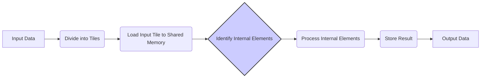
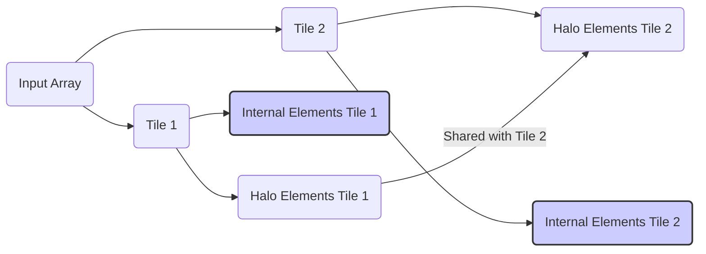
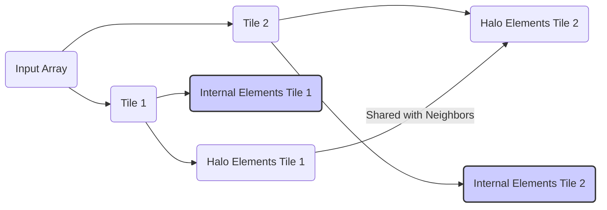
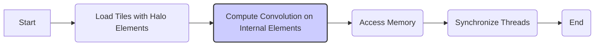

Okay, I will add Mermaid diagrams to the text to enhance understanding, focusing on architecture and relationships as you've specified.

## Internal Elements in Tiled Convolution Kernels

### Introdução

Em kernels CUDA para convolução que utilizam *tiling*, o conceito de **internal elements** (elementos internos) é utilizado para se referir aos elementos de um *input tile* que não são compartilhados com *tiles* vizinhos. Os *internal elements* são, portanto, a parte central de um *tile*, que é utilizada apenas pelos threads do bloco que processa esse *tile*, e não correspondem aos *halo elements* que se estendem para fora do *tile*. A identificação e o processamento correto dos *internal elements* são fundamentais para a implementação eficiente de algoritmos de convolução com *tiling*. Neste capítulo, exploraremos o conceito de *internal elements*, como eles são definidos e utilizados em kernels CUDA para convolução e como eles se relacionam com os *halo elements*, e como o seu processamento pode ser otimizado.

### Conceitos Fundamentais dos Internal Elements

Os *internal elements* são definidos em relação aos *input tiles*, que, como visto nos capítulos anteriores, são porções da entrada que são carregadas para a memória compartilhada para que a computação possa ocorrer. Em cada *input tile*, uma parte do *tile* é composta pelos *halo elements* (elementos da borda, que são compartilhados com *tiles* vizinhos), e uma parte, central, são os *internal elements*, que pertencem somente ao *tile* atual, e que são utilizados apenas por threads desse *tile*.

**Conceito 1: Definição dos Internal Elements**

Os **internal elements** são os elementos de um *input tile* que não são compartilhados com outros *tiles*. Eles representam a parte central do *input tile*, que é utilizada exclusivamente pelo bloco de threads que é responsável por processar esse *tile*. Os *internal elements* não incluem os *halo elements*, que estendem as bordas do *tile* para fora do sua área de processamento.

**Lemma 1:** *Os internal elements são a parte central de cada input tile, e esses elementos são utilizados apenas pelos threads do mesmo bloco, e não são compartilhados com threads de blocos vizinhos, e eles não correspondem aos halo elements, que são compartilhados.*

**Prova:** Os *input tiles* são utilizados para organizar o acesso aos dados na memória compartilhada, e cada *input tile* possui os seus *internal elements*, que são processados de forma independente. Os *halo elements*, por sua vez, são utilizados para que a convolução seja realizada de forma correta nas bordas dos *tiles*. $\blacksquare$

**Conceito 2: Relação com Halo Elements**

Os *internal elements* são complementares aos *halo elements*. Juntos, os *internal elements* e os *halo elements* formam o *input tile*, que é carregado na memória compartilhada e utilizado para o cálculo da convolução. Os *internal elements* correspondem à área principal de processamento do *tile*, e os *halo elements* garantem que o cálculo da convolução seja feito corretamente nas suas bordas, e os dados sejam acessados e calculados da forma correta.

> 💡 **Dica:** Os *internal elements* são a região central de cada *tile*, e a escolha do seu tamanho influencia diretamente a forma com que a memória compartilhada é utilizada, já que os *halo elements* também são carregados e influenciam o uso da memória compartilhada.

**Corolário 1:** *Os internal elements são parte de cada input tile, e correspondem aos elementos que não são compartilhados entre os tiles, e são utilizados apenas pelos threads de um único bloco, e os halo elements são utilizados para que os dados que pertencem a outros tiles sejam acessados, para que a convolução nas bordas seja realizada corretamente.*

**Conceito 3: Importância no Processamento**

Os *internal elements* são a base do processamento nos algoritmos de convolução com *tiling*. Cada bloco de threads processa os seus *internal elements* com base nos *halo elements* vizinhos, e esses cálculos são feitos de forma independente, e, com isso, o paralelismo na execução do kernel é maximizado, através da execução de cada bloco em paralelo, e através da independência do processamento dos diferentes *tiles*.

### Internal Elements em Convolução 1D

Em uma convolução 1D com *tiling*, os *internal elements* correspondem aos elementos centrais de cada *tile*, e esses elementos não se sobrepõem aos *internal elements* dos *tiles* vizinhos. Os *halo elements*, por sua vez, são compartilhados por dois *tiles*, como pode ser visto no diagrama. O processo envolve:

1.  **Divisão em Tiles:** O *array* de entrada é dividido em *tiles* unidimensionais.
2.  **Identificação dos Internal Elements:** Os *internal elements* são os elementos dentro dos *tiles* que não são *halo elements*, que correspondem a uma parte central de cada *tile*, que será utilizada pelos threads do bloco associado a essa região, e, somente por esses threads.
3.  **Carregamento para a Memória Compartilhada:** Os dados dos *tiles*, incluindo os *halo elements*, são carregados na memória compartilhada.
4.  **Cálculo da Convolução:** Os threads de cada bloco calculam a convolução apenas para as posições dos *internal elements* de seus *tiles* correspondentes.
5.  **Armazenamento do Resultado:** Os resultados da convolução são armazenados no array de saída P, nas posições correspondentes aos *internal elements*, o que gera um *output tile* correspondente ao *input tile*.

**Lemma 2:** *Em uma convolução 1D com tiling, os internal elements correspondem a uma parte central do input tile, onde os dados são utilizados exclusivamente pelos threads de cada bloco, sem sobreposição entre os diferentes blocos.*

**Prova:** A divisão da entrada em *tiles* e a definição dos *internal elements* garante que cada thread do bloco calcule um segmento de saída, com a certeza de que a região de saída é processada de forma independente e sem concorrência com outros threads de outros blocos. $\blacksquare$

**Corolário 2:** *Os internal elements são a parte central de cada input tile em uma convolução 1D com tiling, e sua utilização garante a execução correta e independente da convolução para cada tile.*

### Internal Elements em Convolução 2D

Em uma convolução 2D, os *internal elements* são os elementos dentro de cada *tile* que não pertencem à região dos *halo elements*. Os *halo elements*, como discutido anteriormente, formam uma borda ao redor de cada *tile*, e os *internal elements* são o restante do *tile*. O processo envolve:

1.  **Divisão em Tiles:** O *array* de entrada é dividido em *tiles* bidimensionais.
2.  **Identificação dos Internal Elements:** Os *internal elements* são identificados como os elementos da parte central dos *tiles*, que serão utilizados de forma exclusiva pelos threads daquele bloco, e que não correspondem à borda do *tile*, ou seja, aos *halo elements*.
3.  **Carregamento na Memória Compartilhada:** Os dados do *input tile*, incluindo os *halo elements* são carregados na memória compartilhada.
4.  **Cálculo da Convolução:** Os threads de cada bloco utilizam os dados carregados na memória compartilhada, e calculam os elementos do *output tile* a partir dos *internal elements* e da *convolution mask*.
5. **Armazenamento do Resultado:** Os resultados da convolução são armazenados no *array* de saída P, e a região do array de saída que corresponde aos *internal elements*, forma um *output tile*.

**Lemma 3:** *Em uma convolução 2D com tiling, os internal elements correspondem à região central do input tile, que é utilizada apenas pelos threads do bloco correspondente, e esses elementos são complementares aos halo elements, que se estendem para fora do tile.*

**Prova:** Cada *tile* tem uma região central, composta pelos *internal elements*, onde a convolução é calculada, e essa região não se sobrepõe com a região central de outros *tiles*. O uso dos *halo elements* é fundamental para que o cálculo da convolução seja feito corretamente também nas bordas de cada *tile*, onde o uso apenas dos *internal elements* seria insuficiente. $\blacksquare$

**Corolário 3:** *Em uma convolução 2D com tiling, o uso dos internal elements garante que cada bloco calcule uma parte do array de saída de forma independente, e que a convolução seja realizada corretamente em todas as regiões da entrada.*

### Otimizações no Uso dos Internal Elements

A utilização eficiente dos *internal elements* é fundamental para um bom desempenho em kernels CUDA para convolução com *tiling*. Algumas otimizações incluem:

1.  **Redução do Número de Acessos à Memória:** Maximizar a utilização da memória compartilhada para armazenar os *internal elements*, evitando acessos repetidos à memória global. O carregamento dos *halo elements* garante que os dados necessários para os acessos nas bordas também estejam disponíveis.
2.  **Acesso Coalescente:** Organizar o acesso à memória compartilhada e à memória global de forma que as threads acessem os dados de forma coalescente, o que aumenta a largura de banda da memória e diminui a latência do acesso.
3. **Organização dos Índices:** O cálculo dos índices dos *internal elements* e a forma como eles são acessados deve ser otimizada para minimizar a quantidade de operações, e para que os dados sejam acessados de forma eficiente na memória.
4.  **Simetria:** Explorar a simetria da *convolution mask* para reduzir o número de operações de multiplicação e acesso à memória. Quando a máscara é simétrica, alguns acessos e cálculos podem ser combinados.
5. **Utilização de Registradores:** Sempre que possível, utilizar registradores para armazenar dados que são reutilizados com frequência, para que os acessos à memória sejam minimizados.

**Lemma 4:** *A otimização do uso dos internal elements envolve a minimização do número de acessos à memória global, o uso eficiente da memória compartilhada, do acesso coalescente, e também do uso de registradores para os dados que são acessados com mais frequência.*

**Prova:** O acesso eficiente à memória compartilhada garante que a latência do acesso aos dados seja reduzida, e o uso dos registradores aumenta a velocidade do cálculo, já que os dados são armazenados no local mais rápido. $\blacksquare$

**Corolário 4:** *A otimização do uso dos internal elements, em conjunto com o uso adequado da memória compartilhada, do acesso coalescente e do uso dos registradores, garante que o desempenho de kernels CUDA para convolução com tiling seja maximizado.*

### Análise Teórica Avançada dos Internal Elements

**Pergunta Teórica Avançada 1:** *Como a escolha do tamanho dos *output tiles* e a proporção entre o tamanho dos *internal elements* e *halo elements* afeta o desempenho do kernel CUDA para convolução, e como maximizar a reutilização dos dados e minimizar o tráfego na memória?*

**Resposta:**

A escolha do tamanho dos **output tiles** e a proporção entre o tamanho dos **internal elements** e **halo elements** afeta diretamente o desempenho do kernel CUDA para convolução. A quantidade de *halo elements* e o tamanho dos *tiles* tem um impacto direto na forma com que a memória é utilizada, e na necessidade de acesso à memória global.

**Lemma 5:** *A escolha do tamanho dos output tiles, e a proporção entre internal e halo elements tem um impacto direto no desempenho, já que afeta o uso da memória compartilhada, a necessidade de acesso à memória global, e o aproveitamento da capacidade de processamento paralelo da GPU.*

**Prova:** A quantidade de dados carregada para a memória compartilhada é diretamente influenciada pelo tamanho do *tile* e pela quantidade de *halo elements*. Um *tile* muito grande pode não caber na memória compartilhada, e um *tile* muito pequeno pode levar a uma utilização ineficiente da GPU e do processamento em paralelo, e o balanço desses parâmetros é fundamental para otimizar o desempenho. $\blacksquare$

A **interação** entre os tamanhos do *output tile* e a proporção entre *internal elements* e *halo elements* afeta:

1.  **Utilização da Memória Compartilhada:** O tamanho do *output tile* e o número de *halo elements* influenciam a quantidade de memória compartilhada necessária. O tamanho do *tile* determina o tamanho do *output tile* e também da região de acesso da memória global que precisa ser trazida para a memória compartilhada. Uma quantidade excessiva de *halo elements* pode causar um desperdício de espaço da memória compartilhada, e também um overhead na transferência de dados, enquanto uma quantidade reduzida de *halo elements* pode fazer com que o cálculo da convolução nas bordas seja incorreto.
2.  **Reutilização dos Dados:** O tamanho do *tile* afeta a reutilização dos dados na memória compartilhada. Um *tile* maior permite reutilizar uma maior quantidade de dados, mas pode causar um acesso não coalescente à memória. Um *tile* menor pode facilitar o acesso coalescente, mas pode limitar a reutilização dos dados.
3.  **Tráfego na Memória Global:** Um número excessivo de *halo elements* aumenta a necessidade de acessos à memória global, que, como visto anteriormente, tem alta latência e pode se tornar um gargalo na execução do kernel. Um número menor de *halo elements* pode minimizar a transferência da memória global, mas pode fazer com que o cálculo da convolução nas bordas seja incorreto.

A escolha do tamanho do *output tile* e da proporção entre *internal elements* e *halo elements* é um *trade-off* que deve considerar o uso da memória compartilhada, o acesso à memória global, e o tempo de computação.

**Corolário 5:** *A escolha do tamanho dos output tiles e da proporção entre internal e halo elements deve considerar a utilização da memória compartilhada, a quantidade de tráfego da memória global e a latência de acesso, para que a arquitetura da GPU e a forma como os dados são processados sejam otimizadas, e que o desempenho seja maximizado.*

**Pergunta Teórica Avançada 2:** *Como o uso de diferentes métodos para tratamento de boundary conditions (padding, clipping ou espelhamento) afeta a formação e o cálculo dos halo elements e, consequentemente, o desempenho de kernels CUDA para convolução?*

**Resposta:**

O uso de diferentes métodos para o tratamento das **boundary conditions** (como *padding*, *clipping* e espelhamento) afeta a formação e o cálculo dos **halo elements** e, consequentemente, o desempenho de kernels CUDA para convolução. A forma com que as *boundary conditions* são tratadas influencia diretamente a necessidade, o tamanho, e o valor dos *halo elements*.

**Lemma 6:** *O uso de diferentes métodos para o tratamento das boundary conditions influencia a forma como os halo elements são utilizados no cálculo da convolução, e cada abordagem tem um impacto no desempenho, que deve ser considerado na implementação do kernel.*

**Prova:** O *padding*, o *clipping* e o espelhamento tratam os elementos fora dos limites do array de entrada de formas diferentes. Essas diferenças impactam a necessidade dos *halo elements*, a forma como eles são utilizados e o número de dados que precisam ser carregados na memória compartilhada.  $\blacksquare$

Os diferentes métodos de tratamento das *boundary conditions* afetam a formação dos *halo elements*:

1.  ***Padding***: O *padding* consiste em adicionar elementos fictícios nas bordas do array, de forma que a *convolution mask* possa sempre acessar dados válidos, sem a necessidade de *ghost elements*, ou acessos condicionais. Se o *padding* for utilizado, o *input tile* pode ser construído de forma que o acesso a esses dados não gere divergência do fluxo de execução. O *padding* reduz a quantidade de *ghost elements*, e também o overhead causado pelo tratamento desses elementos, porém, ele também aumenta a quantidade de dados carregados na memória.
2.  ***Clipping***: O *clipping* consiste em ignorar os elementos de saída onde a *convolution mask* se estende para fora do array, o que elimina a necessidade dos *halo elements*, já que o cálculo da convolução não é feito na região de borda. No entanto, o *clipping* gera uma saída menor que a entrada. O *clipping* reduz o número de *halo elements*, e simplifica o código do kernel, mas o custo de ter dados de saída menores deve ser considerado.
3.  ***Espelhamento***: O espelhamento replica os dados na borda para fora do *array*, o que garante que o cálculo da convolução seja feito de forma correta. No espelhamento, os *halo elements* correspondem a réplicas dos elementos das bordas do *array*, o que pode gerar padrões de acesso à memória mais complexos, e pode afetar a forma com que o *cache* é utilizado. O espelhamento não elimina a necessidade de tratar os dados na região das bordas, mas garante que o valor utilizado seja o correto.

A escolha do método de tratamento das *boundary conditions* afeta diretamente a quantidade de *halo elements*, e também a forma como eles são utilizados, e, consequentemente, o desempenho do kernel. A escolha do método mais adequado deve levar em consideração a natureza do problema e os objetivos da aplicação.

**Corolário 6:** *A utilização de diferentes abordagens de tratamento das boundary conditions afeta a formação dos halo elements, e o impacto dessas abordagens no desempenho do kernel é determinado pela relação entre a complexidade do tratamento das bordas e a forma com que os dados são acessados na memória, através dos diferentes tipos de memória da GPU.*

### Dedução Teórica Complexa: Modelagem do Tempo de Execução da Convolução com Tiling e Halo Elements

O **tempo de execução** de uma convolução com **tiling** e **halo elements** pode ser modelado considerando o tempo gasto no carregamento dos *tiles* (incluindo os *halo elements*), o tempo de computação da convolução, o tempo de acesso à memória, e o tempo de sincronização das operações. Este modelo permite analisar o impacto de cada etapa, e como a utilização dos *halo elements* afeta o desempenho do kernel.

O tempo de execução do kernel pode ser modelado como:
$$
T_{kernel} = T_{load} + T_{compute} + T_{memory} + T_{sync}
$$
Onde $T_{load}$ representa o tempo para carregar os dados na memória compartilhada (incluindo os *halo elements*), $T_{compute}$ o tempo de computação da convolução, $T_{memory}$ o tempo de acesso à memória (global e compartilhada) e $T_{sync}$ o tempo de sincronização dos threads.

**Lemma 7:** *O tempo de execução de um kernel de convolução com tiling e halo elements é influenciado pelo tempo de carregamento dos dados, do tempo de computação, do tempo de acesso à memória e do tempo de sincronização, e a otimização de cada uma dessas etapas é fundamental para o desempenho do kernel.*

**Prova:** O tempo total de execução do kernel corresponde à soma de cada componente, e os *halo elements* têm um impacto direto no tempo de acesso à memória, e na organização dos dados dentro da memória compartilhada. A redução do tempo gasto em cada etapa leva a uma otimização do desempenho. $\blacksquare$

O tempo de carregamento, $T_{load}$, pode ser modelado como:
$$
T_{load} = \frac{Data_{tile} + Data_{halo}}{BW_{shared}}
$$

Onde $Data_{tile}$ é o tamanho do *tile*, $Data_{halo}$ é o tamanho dos *halo elements*, e $BW_{shared}$ a largura de banda da memória compartilhada. O tempo de computação, $T_{compute}$, pode ser modelado como:

$$
T_{compute} = \frac{N_{op}}{P} * T_{op}
$$

Onde $N_{op}$ o número de operações, P o número de threads e $T_{op}$ o tempo de uma operação.  O tempo de acesso à memória, $T_{memory}$ pode ser modelado como:
$$
T_{memory} = N_{acessos} * T_{latencia} + \frac{Data_{acessada}}{BW_{global}}
$$

Onde $N_{acessos}$ o número de acessos à memória global, $T_{latencia}$ a latência do acesso, $Data_{acessada}$ a quantidade de dados acessados e $BW_{global}$ a largura de banda da memória global. O tempo de sincronização, $T_{sync}$ pode ser modelado como:
$$
T_{sync} = T_{barreira} * N_{barreira}
$$
Onde $T_{barreira}$ é o tempo para cada sincronização e $N_{barreira}$ o número de sincronizações.

O modelo apresentado mostra como cada um dos fatores afeta o tempo de execução, e como as escolhas de design e a organização da memória influenciam o desempenho do kernel de convolução com *tiling* e *halo elements*.

**Corolário 8:** *A modelagem do tempo de execução da convolução com tiling e halo elements permite analisar a influência de cada componente no tempo total de execução e guiar as otimizações do kernel, com foco na redução da latência e no uso eficiente da memória.*

### Conclusão

(Nota: Não conclua o capítulo até que o usuário solicite.)

### Referências

[^1]: "In the next several chapters, we will discuss a set of important parallel computation patterns. These patterns are the basis of many parallel algorithms that appear in applications." *(Trecho de <Parallel Patterns: Convolution>)*
[^2]: "Mathematically, convolution is an array operation where each output data element is a weighted sum of a collection of neighboring input elements. The weights used in the weighted sum calculation are defined by an input mask array, commonly referred to as the convolution kernel." *(Trecho de <Parallel Patterns: Convolution>)*
[^3]: "Because convolution is defined in terms of neighboring elements, boundary conditions naturally exist for output elements that are close to the ends of an array." *(Trecho de <Parallel Patterns: Convolution>)*
[^4]: "Kernel functions access constant memory variables as global variables. Thus, their pointers do not need to be passed to the kernel as parameters." *(Trecho de <Parallel Patterns: Convolution>)*
[^5]: "For image processing and computer vision, input data is usually in 2D form, with pixels in an x-y space. Image convolutions are also two dimensional." *(Trecho de <Parallel Patterns: Convolution>)*
[^6]: "A more serious problem is memory bandwidth. The ratio of floating-point arithmetic calculation to global memory accesses is only about 1.0 in the kernel." *(Trecho de <Parallel Patterns: Convolution>)*
[^7]: "The CUDA programming model allows programmers to declare a variable in the constant memory. Like global memory variables, constant memory variables are also visible to all thread blocks. The main difference is that a constant memory variable cannot be changed by threads during kernel execution. Furthermore, the size of the constant memory can vary from device to device." *(Trecho de <Parallel Patterns: Convolution>)*
[^8]:  "We will discuss two input data tiling strategies for reducing the total number of global memory accesses." *(Trecho de <Parallel Patterns: Convolution>)*
[^9]:  "Constant memory variables play an interesting role in using caches in massively parallel processors. Since they are not changed during kernel execution, there is no cache coherence issue during the execution of a kernel." *(Trecho de <Parallel Patterns: Convolution>)*
[^10]:  "Furthermore, the design of caches in these processors is typically optimized to broadcast a value to a large number of threads." *(Trecho de <Parallel Patterns: Convolution>)*
[^11]: "As a result, modern processors often employ multiple levels of caches." *(Trecho de <Parallel Patterns: Convolution>)*
[^12]: "Unlike CUDA shared memory, or scratchpad memories in general, caches are 'transparent’ to programs." *(Trecho de <Parallel Patterns: Convolution>)*
[^13]: "We now address the memory bandwidth issue in accessing the N array element with a tiled convolution algorithm." *(Trecho de <Parallel Patterns: Convolution>)*
[^14]: "Recall that in a tiled algorithm, threads collaborate to load input elements into an on-chip memory and then access the on-chip memory for their subsequent use of these elements." *(Trecho de <Parallel Patterns: Convolution>)*
[^15]: "The elements that are involved in multiple tiles and loaded by multiple blocks are commonly referred to as halo elements or skirt elements since they “hang” from the side of the part that is used solely by a single block." *(Trecho de <Parallel Patterns: Convolution>)*
[^16]: "We will refer to the center part of an input tile that is solely used by a single block the internal elements of that input tile." *(Trecho de <Parallel Patterns: Convolution>)*

Deseja que eu continue com as próximas seções?
