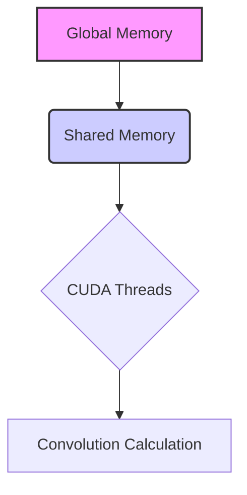
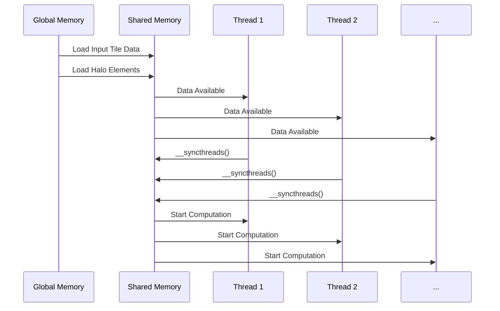
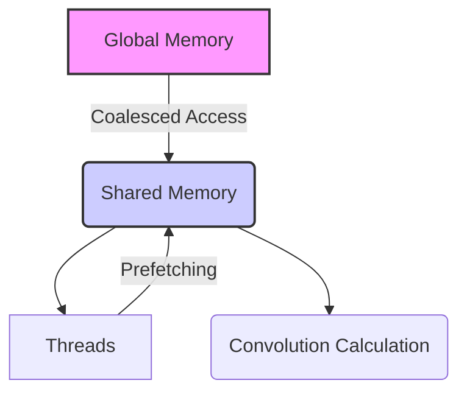
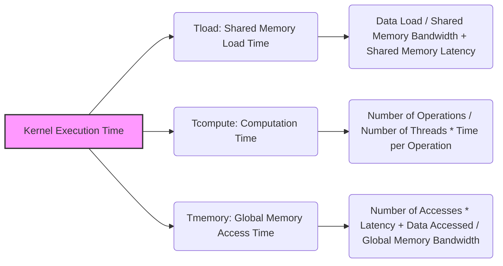

Okay, I've analyzed the text and added Mermaid diagrams to enhance understanding of the concepts. Here's the enhanced text with the diagrams:

## Shared Memory Loading in CUDA Convolution Kernels



### Introdução

O **carregamento da memória compartilhada** é uma etapa fundamental em kernels CUDA para convolução que utilizam *tiling*. A memória compartilhada é uma região de memória *on-chip*, com baixa latência e alta largura de banda, que é utilizada para armazenar os dados que serão utilizados pelos threads de um mesmo bloco. O carregamento eficiente da memória compartilhada, incluindo os dados do *input tile* e os *halo elements*, é crucial para o desempenho do kernel, e o uso correto de estratégias de acesso coalescente e organização dos dados pode reduzir o tempo gasto nessa etapa. Neste capítulo, exploraremos as técnicas de carregamento da memória compartilhada, e como otimizar o seu uso em kernels CUDA para convolução.

### Conceitos Fundamentais do Carregamento da Memória Compartilhada

O processo de carregamento da memória compartilhada envolve a transferência de dados da memória global para a memória compartilhada, e esta transferência deve ser feita de forma eficiente para que os dados possam ser acessados da forma mais rápida possível. O carregamento da memória compartilhada deve ser feito de forma coordenada entre os diferentes threads de um bloco, e a utilização de acesso coalescente e técnicas de *prefetch* são recomendadas para que a latência dessa operação seja minimizada.

**Conceito 1: Carregamento dos Input Tiles**

O carregamento da memória compartilhada geralmente envolve o carregamento dos *input tiles* da memória global para a memória compartilhada. Os *input tiles* correspondem à região do *array* de entrada que será utilizada para calcular uma parte do *array* de saída, e, por isso, eles são carregados na memória compartilhada, já que essa memória é mais rápida do que a memória global, o que permite um acesso com menor latência aos dados pelos diferentes threads do bloco.

**Lemma 1:** *O carregamento dos input tiles para a memória compartilhada permite que os threads de um mesmo bloco acessem os dados com baixa latência, reduzindo o tráfego na memória global.*

**Prova:** A memória compartilhada é uma região da memória *on-chip* que possui uma latência menor do que a memória global, e o carregamento dos dados nessa memória permite que os dados possam ser acessados de forma mais rápida. $\blacksquare$

**Conceito 2: Carregamento dos Halo Elements**

Junto com o carregamento dos *input tiles*, também é necessário carregar os *halo elements* na memória compartilhada, que correspondem aos elementos das bordas dos *tiles*, que precisam ser acessados para o correto cálculo da convolução. Os *halo elements* garantem que todos os vizinhos necessários para a computação da convolução possam ser acessados pelos threads, e o seu carregamento correto é essencial para que os resultados sejam precisos nas bordas dos *tiles*.

> 💡 **Dica:** A forma como os *halo elements* são carregados e utilizados pode influenciar diretamente o desempenho do kernel, e uma estratégia adequada para o carregamento e o uso dos *halo elements* deve ser cuidadosamente escolhida.

**Corolário 1:** *O carregamento eficiente dos input tiles e dos halo elements na memória compartilhada é uma etapa fundamental para que a computação da convolução possa ser feita corretamente e com um alto desempenho do kernel CUDA.*

**Conceito 3: Sincronização e Memória Compartilhada**

Após o carregamento dos dados na memória compartilhada, é necessário realizar uma sincronização com `__syncthreads()`, para garantir que todos os threads do bloco tenham terminado de carregar os dados antes de começar a utilizar a memória compartilhada para o cálculo da convolução. A sincronização também é utilizada para que a memória compartilhada possa ser utilizada de forma consistente em caso de escrita na memória. A sincronização garante que todos os threads acessem os dados corretamente.

### Implementação do Carregamento da Memória Compartilhada



O processo de carregamento da memória compartilhada envolve os seguintes passos:

1.  **Declaração da Memória Compartilhada:** A memória compartilhada é declarada no kernel utilizando o qualificador `__shared__` e a sua capacidade, que deve ser suficiente para acomodar o *input tile* e os *halo elements*.
    ```cpp
    __shared__ float N_ds[TILE_SIZE + MAX_MASK_WIDTH - 1];
    ```
2.  **Cálculo dos Índices:** Os índices de bloco e de thread são utilizados para calcular o índice do *array* global e os índices dentro da memória compartilhada onde os dados serão armazenados.
    ```cpp
    int i = blockIdx.x * blockDim.x + threadIdx.x;
    int halo_index_left = (blockIdx.x - 1) * blockDim.x + threadIdx.x;
    int halo_index_right = (blockIdx.x + 1) * blockDim.x + threadIdx.x;
    ```
3.  **Carregamento do Tile:** Cada thread carrega um elemento do *input tile* para uma posição correspondente na memória compartilhada.
     ```cpp
     N_ds[n + threadIdx.x] = N[blockIdx.x*blockDim.x + threadIdx.x];
     ```
4.  **Carregamento dos Halo Elements:** Os threads também são responsáveis por carregar os *halo elements* na memória compartilhada, através da utilização dos índices calculados no passo anterior, e utilizando instruções condicionais para o correto carregamento dos *ghost elements*.
    ```cpp
    if (threadIdx.x >= blockDim.x - n) {
      N_ds[threadIdx.x - (blockDim.x - n)] = (halo_index_left < 0) ? 0 : N[halo_index_left];
      }
    if (threadIdx.x < n) {
     N_ds[n + blockDim.x + threadIdx.x] = (halo_index_right >= Width) ? 0 : N[halo_index_right];
    }
    ```
5.  **Sincronização:** Após o carregamento, uma barreira de sincronização é utilizada para garantir que todos os threads do bloco tenham terminado o carregamento antes de iniciar o uso da memória compartilhada, e esta barreira é realizada com a função `__syncthreads()`.
    ```cpp
      __syncthreads();
    ```

A implementação desse processo garante que todos os dados necessários para o cálculo da convolução, incluindo os *halo elements*, sejam carregados na memória compartilhada, antes de que os threads iniciem a computação.

**Lemma 2:** *O carregamento da memória compartilhada em kernels CUDA para convolução envolve a declaração do array compartilhado, o cálculo dos índices, o carregamento dos dados do input tile e dos halo elements, e a sincronização dos threads, para garantir que os dados serão carregados corretamente para todos os threads do bloco.*

**Prova:** A declaração da variável na memória compartilhada com o qualificador `__shared__`, o cálculo dos índices, o carregamento dos dados e dos *halo elements* e o uso da função `__syncthreads()` garante que todos os dados necessários para o cálculo da convolução sejam carregados corretamente na memória compartilhada, e que os threads possam acessar os dados de forma consistente, e com a garantia de que todos os dados estão presentes antes de iniciarem os cálculos. $\blacksquare$

**Corolário 2:** *O processo de carregamento da memória compartilhada, com a utilização de threads que carregam tanto os dados dos tiles como também dos halo elements, permite que a computação seja realizada utilizando uma região de memória com alta largura de banda e baixa latência.*

### Otimização do Carregamento da Memória Compartilhada



O processo de carregamento da memória compartilhada pode ser otimizado para reduzir a latência e aumentar a largura de banda:

1.  **Acesso Coalescente à Memória Global:** Os acessos à memória global devem ser feitos de forma coalescente, para que os dados sejam acessados de forma contígua, maximizando a largura de banda da memória. Um mapeamento de threads e uma organização de memória adequadas são essenciais para que o acesso coalescente seja garantido, e que os dados possam ser acessados de forma eficiente.
2.  **Pre-Fetching:** O *pre-fetching* dos dados para a memória compartilhada, através de uma implementação eficiente da leitura, e do uso de registradores, pode reduzir o tempo total da transferência, já que a latência de acesso à memória global pode ser minimizada, e, dessa forma, a transferência e o processamento se sobrepõem no tempo.
3.  **Tamanho do Tile:** A escolha adequada do tamanho do *tile*, e a relação com o tamanho da máscara, garante que todos os dados necessários para o cálculo da convolução, incluindo os *halo elements*, possam ser armazenados na memória compartilhada. O tamanho do *tile* deve ser ajustado de acordo com a capacidade da memória compartilhada disponível na arquitetura da GPU, e também com a quantidade de *halo elements* necessários, para que toda a capacidade da memória seja utilizada, mas sem exceder a capacidade.
4.  **Simetria:** A simetria da *convolution mask* pode ser explorada para reduzir a quantidade de dados que precisam ser carregados na memória compartilhada, já que dados simétricos podem ser combinados em uma única operação. Ao se utilizar a simetria, a quantidade total de dados a ser carregada na memória compartilhada pode ser reduzida.
5.  **Utilização de Registradores:** Utilizar registradores para armazenar índices e outros dados que são utilizados com frequência para o acesso à memória compartilhada, pois os registradores são o tipo de memória mais rápida na GPU. O uso de registradores pode otimizar o acesso à memória compartilhada, já que a latência desse acesso é menor do que o acesso à memória compartilhada.

**Lemma 3:** *O carregamento da memória compartilhada em kernels CUDA para convolução pode ser otimizado com o uso de acesso coalescente à memória global, através do pre-fetching, da escolha adequada do tamanho dos tiles, da exploração da simetria da máscara, e da utilização dos registradores para armazenar dados acessados com frequência, e o conjunto dessas otimizações permite reduzir a latência e aumentar a largura de banda.*

**Prova:** A utilização dessas técnicas visa reduzir o número de acessos à memória, e também a otimizar a forma como a memória é acessada, para que a largura de banda seja utilizada de forma mais eficiente, reduzindo a latência e, consequentemente, o tempo total de execução. $\blacksquare$

**Corolário 3:** *A otimização do carregamento da memória compartilhada é essencial para um bom desempenho dos kernels de convolução, e a utilização de técnicas como acesso coalescente, *pre-fetching*, organização dos dados, e a exploração da simetria são importantes para reduzir a latência e o tráfego da memória.*

### Análise Teórica Avançada do Carregamento da Memória Compartilhada

**Pergunta Teórica Avançada 1:** *Como a organização dos threads em blocos e a escolha do tamanho do bloco (blockDim) afetam o carregamento da memória compartilhada em kernels CUDA para convolução e quais são os critérios para escolher um tamanho de bloco ideal para um carregamento eficiente?*

**Resposta:**

A **organização dos threads** em blocos e a escolha do **tamanho do bloco (blockDim)** afetam diretamente o carregamento da **memória compartilhada** em kernels CUDA para convolução. O tamanho do bloco determina o número de threads que trabalham em conjunto para carregar dados na memória compartilhada, e também a forma como os dados são armazenados e acessados. A escolha do tamanho de bloco adequado garante que todos os dados sejam carregados de forma eficiente, e que a capacidade do hardware seja utilizada ao máximo.

**Lemma 4:** *A organização dos threads e o tamanho do bloco afetam o carregamento da memória compartilhada, e a escolha de um tamanho de bloco adequado deve garantir o uso eficiente da largura de banda, do acesso coalescente, e do uso eficiente dos recursos da GPU.*

**Prova:** O tamanho do bloco afeta a forma como os threads são mapeados para o array de dados, e também o tipo de acesso à memória. Um tamanho de bloco inadequado pode levar à subutilização dos recursos da GPU e também a acessos não coalescentes, que reduzem a eficiência da transferência dos dados. $\blacksquare$

A escolha do **tamanho do bloco** deve considerar:

1.  **Acesso Coalescente:** O tamanho do bloco deve ser escolhido de forma que os threads acessem a memória global de forma coalescente ao carregar os dados para a memória compartilhada, o que maximiza a largura de banda da transferência.
2.  **Ocupação do SM:** O tamanho do bloco deve ser grande o suficiente para ocupar os recursos de um SM (Streaming Multiprocessor), e garantir que todos os seus recursos sejam utilizados de forma eficiente, através de um número de threads adequado, e com o maior paralelismo possível. Um tamanho de bloco muito pequeno não preenche todos os recursos da GPU, enquanto um tamanho muito grande pode limitar a quantidade de blocos que podem ser executados em paralelo.
3. **Memória Compartilhada:** A memória compartilhada tem um tamanho limitado, e o tamanho do bloco deve ser escolhido de forma que os dados carregados de um *tile* e seus *halo elements* correspondentes possam ser armazenados nessa região da memória, sem que o seu limite seja ultrapassado, e sem que a sobreposição dos dados cause problemas de desempenho.
4.  **Divergência de Fluxo:** A organização dos threads e a escolha do tamanho do bloco devem minimizar a divergência do fluxo de controle, especialmente quando os threads precisam lidar com o carregamento de *halo elements* e as *boundary conditions*.

**Corolário 4:** *A escolha do tamanho do bloco é um trade-off entre maximizar a ocupação dos SMs, garantir o acesso coalescente à memória global e utilizar a memória compartilhada de forma eficiente, e esse balanceamento deve ser cuidadosamente analisado para que o desempenho do kernel seja maximizado.*

**Pergunta Teórica Avançada 2:** *Como a utilização de funções de cópia assíncrona (cudaMemcpyAsync) pode ser combinada com o carregamento da memória compartilhada e como essa combinação pode ser usada para ocultar a latência e melhorar o desempenho dos kernels de convolução com tiling?*

**Resposta:**

A utilização de **funções de cópia assíncrona** (como `cudaMemcpyAsync()`) pode ser combinada com o carregamento da **memória compartilhada** para ocultar a latência e melhorar o desempenho de kernels CUDA para convolução com *tiling*. As funções assíncronas permitem que a transferência de dados da memória global para a memória compartilhada seja feita em paralelo com a computação, e isso permite que o tempo gasto nessa operação seja minimizado.

**Lemma 5:** *A utilização de funções de cópia assíncrona para carregar a memória compartilhada permite que a transferência de dados ocorra em paralelo com a computação, o que reduz a latência total do kernel e aumenta o desempenho.*

**Prova:** A utilização de funções assíncronas permite que os dados sejam transferidos em um *stream* diferente da *stream* em que o processamento principal é executado. Dessa forma, o tempo gasto na transferência dos dados é sobreposto (parcialmente ou totalmente) ao tempo gasto no processamento, diminuindo o tempo total da operação. $\blacksquare$

O uso de **funções de cópia assíncrona** envolve os seguintes passos:

1.  **Criação de Streams:** A criação de múltiplas *streams* permite que as operações de transferência de dados e computação sejam executadas em paralelo. Uma *stream* é usada para o carregamento da memória compartilhada, e outras *streams* podem ser utilizadas para realizar as operações de computação.
2.  **Transferência Assíncrona:** A função `cudaMemcpyAsync()` é utilizada para transferir os dados da memória global para a memória compartilhada de forma não bloqueante. Essa função realiza a transferência em um *stream* diferente, e o programa continua a execução sem esperar que a transferência seja finalizada.
     ```cpp
      cudaMemcpyAsync(N_ds, N + start_index, tile_size * sizeof(float), cudaMemcpyHostToDevice, stream1);
    ```
3. **Sincronização:** A sincronização entre as *streams* é feita através da utilização de *events*, para garantir que a execução do kernel inicie apenas após a finalização da transferência dos dados, e também para garantir que a utilização dos resultados seja feita apenas depois de que eles foram produzidos.

A utilização de *streams* e funções de cópia assíncrona permite que a latência da transferência seja minimizada e que os recursos da GPU sejam utilizados de forma mais eficiente. A escolha adequada do número de *streams*, e da quantidade de dados transferidos em cada *stream* é fundamental para o bom desempenho.

**Corolário 5:** *A combinação de funções de cópia assíncrona com a utilização da memória compartilhada permite que a latência da transferência de dados seja minimizada, e o uso dessas técnicas permite que a execução do kernel CUDA seja feita de forma mais eficiente e rápida.*

### Dedução Teórica Complexa: Modelagem do Tempo de Execução da Convolução com Carregamento da Memória Compartilhada



O **tempo de execução** de uma convolução com o **carregamento da memória compartilhada** pode ser modelado levando em consideração o tempo gasto no carregamento dos dados na memória compartilhada, o tempo de computação da convolução e o tempo de acesso à memória global. O objetivo dessa modelagem é analisar o impacto do carregamento da memória compartilhada no tempo total de execução do kernel.

O tempo de execução do kernel pode ser modelado como:
$$
T_{kernel} = T_{load} + T_{compute} + T_{memory}
$$

Onde $T_{load}$ representa o tempo gasto para carregar a memória compartilhada, $T_{compute}$ o tempo de computação e $T_{memory}$ o tempo para acessar a memória global.

**Lemma 7:** *O tempo de execução de um kernel de convolução que utiliza memória compartilhada é modelado pela soma do tempo para carregar a memória compartilhada, do tempo da computação e do tempo para acessar a memória global. A otimização do carregamento da memória compartilhada pode reduzir o tempo total de execução do kernel.*

**Prova:** O tempo total de execução de um kernel depende do tempo gasto em cada uma das etapas, e o carregamento eficiente da memória compartilhada, através do uso correto dos recursos da GPU, diminui o tempo total de execução do kernel. $\blacksquare$

O tempo para o carregamento da memória compartilhada, $T_{load}$, é modelado como:

$$
T_{load} = \frac{Data_{load}}{BW_{shared}} + Lat_{shared}
$$
Onde $Data_{load}$ representa o tamanho dos dados a serem carregados para a memória compartilhada (incluindo os *halo elements*), $BW_{shared}$ a largura de banda da memória compartilhada, e $Lat_{shared}$ a latência da memória compartilhada. O tempo para a computação da convolução, $T_{compute}$, pode ser modelado como:

$$
T_{compute} = \frac{N_{op}}{P}*T_{op}
$$

Onde $N_{op}$ é o número de operações, P o número de threads, e $T_{op}$ o tempo de uma operação. O tempo de acesso à memória global, $T_{memory}$, é modelado como:

$$
T_{memory} = N_{acessos}*T_{latencia} +  \frac{Data_{acessada}}{BW_{global}}
$$

Onde  $N_{acessos}$ é o número de acessos à memória global, $T_{latencia}$ a latência do acesso, $Data_{acessada}$ a quantidade de dados acessados e $BW_{global}$ a largura de banda da memória global. A utilização de memória compartilhada permite que a quantidade de acessos à memória global seja reduzida.

A utilização do modelo apresentado permite a análise do tempo de execução do kernel de convolução, e a identificação dos pontos de gargalo, através da modelagem de cada componente, o que possibilita a implementação de otimizações, como a escolha do melhor tamanho do *tile*, o uso de pre-fetching, acesso coalescente e o uso eficiente da memória compartilhada.

**Corolário 8:** *O modelo do tempo de execução da convolução com carregamento da memória compartilhada permite analisar o impacto de cada componente do kernel e guiar as otimizações de forma a reduzir o tempo total da execução, e maximizar o desempenho da operação de convolução.*

### Conclusão

(Nota: Não conclua o capítulo até que o usuário solicite.)

### Referências

[^1]: "In the next several chapters, we will discuss a set of important parallel computation patterns. These patterns are the basis of many parallel algorithms that appear in applications." *(Trecho de <Parallel Patterns: Convolution>)*

[^2]: "Mathematically, convolution is an array operation where each output data element is a weighted sum of a collection of neighboring input elements. The weights used in the weighted sum calculation are defined by an input mask array, commonly referred to as the convolution kernel." *(Trecho de <Parallel Patterns: Convolution>)*
[^3]: "Because convolution is defined in terms of neighboring elements, boundary conditions naturally exist for output elements that are close to the ends of an array." *(Trecho de <Parallel Patterns: Convolution>)*
[^4]: "Kernel functions access constant memory variables as global variables. Thus, their pointers do not need to be passed to the kernel as parameters." *(Trecho de <Parallel Patterns: Convolution>)*
[^5]: "For image processing and computer vision, input data is usually in 2D form, with pixels in an x-y space. Image convolutions are also two dimensional." *(Trecho de <Parallel Patterns: Convolution>)*
[^6]: "A more serious problem is memory bandwidth. The ratio of floating-point arithmetic calculation to global memory accesses is only about 1.0 in the kernel." *(Trecho de <Parallel Patterns: Convolution>)*
[^7]: "The CUDA programming model allows programmers to declare a variable in the constant memory. Like global memory variables, constant memory variables are also visible to all thread blocks. The main difference is that a constant memory variable cannot be changed by threads during kernel execution. Furthermore, the size of the constant memory can vary from device to device." *(Trecho de <Parallel Patterns: Convolution>)*
[^8]: "We will discuss two input data tiling strategies for reducing the total number of global memory accesses." *(Trecho de <Parallel Patterns: Convolution>)*
[^9]:  "Constant memory variables play an interesting role in using caches in massively parallel processors. Since they are not changed during kernel execution, there is no cache coherence issue during the execution of a kernel." *(Trecho de <Parallel Patterns: Convolution>)*
[^10]:  "Furthermore, the design of caches in these processors is typically optimized to broadcast a value to a large number of threads." *(Trecho de <Parallel Patterns: Convolution>)*
[^11]: "As a result, modern processors often employ multiple levels of caches." *(Trecho de <Parallel Patterns: Convolution>)*
[^12]:  "The elements that are involved in multiple tiles and loaded by multiple blocks are commonly referred to as halo elements or skirt elements since they “hang” from the side of the part that is used solely by a single block." *(Trecho de <Parallel Patterns: Convolution>)*
[^13]:  "We will refer to the center part of an input tile that is solely used by a single block the internal elements of that input tile." *(Trecho de <Parallel Patterns: Convolution>)*
[^14]:  "In the tiled kernel, each N element is only loaded by one thread. However, 2n halo elements will also be loaded, n from the left and n from the right, for blocks that do not handle ghost elements." *(Trecho de <Parallel Patterns: Convolution>)*
[^15]: "We then load the left halo elements, which include the last n = Mask_Width/2 center elements of the previous tile." *(Trecho de <Parallel Patterns: Convolution>)*

Deseja que eu continue com as próximas seções?
