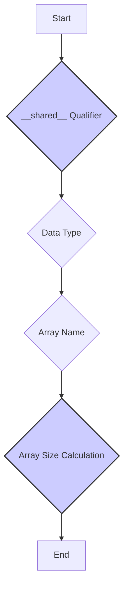
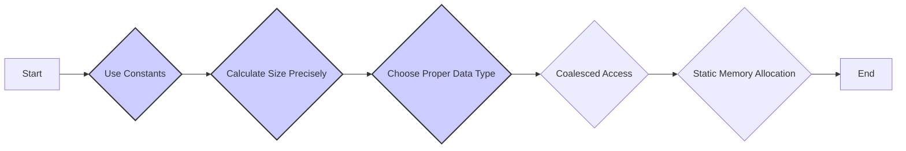
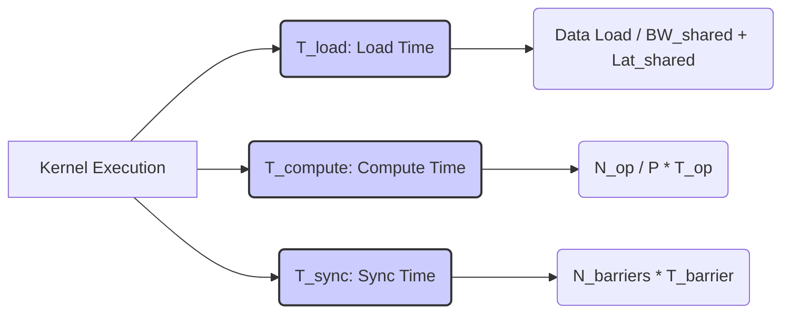

Okay, I will add Mermaid diagrams to the text to enhance understanding. Here's the enhanced text with diagrams:

## Shared Memory Array Declaration in CUDA Convolution Kernels



### Introdução

A declaração de **arrays na memória compartilhada** é uma parte fundamental da implementação de kernels CUDA para convolução que utilizam *tiling*. Como discutido em capítulos anteriores, a memória compartilhada é uma região de memória *on-chip*, com baixa latência e alta largura de banda, que é utilizada para armazenar dados que serão usados repetidamente pelos threads de um mesmo bloco. A declaração correta do *array* na memória compartilhada, incluindo a sua capacidade e tipo, é fundamental para o bom funcionamento do kernel e para o seu desempenho. Neste capítulo, exploraremos como declarar *arrays* na memória compartilhada em kernels CUDA para convolução, o uso de qualificadores, como determinar o tamanho necessário para os *arrays* e como otimizar o acesso a eles.

### Conceitos Fundamentais da Declaração de Memória Compartilhada

A declaração de um *array* na memória compartilhada em CUDA envolve alguns aspectos importantes, como o uso de qualificadores específicos, a definição do tipo de dado e o cálculo do tamanho do array.

**Conceito 1: O Qualificador __shared__**

Para declarar um *array* na memória compartilhada, é necessário usar o qualificador `__shared__` antes da declaração da variável. O qualificador `__shared__` informa ao compilador que a variável deve ser alocada na memória compartilhada do *device*, que é uma memória *on-chip* rápida e com baixa latência. A variável declarada com `__shared__` é compartilhada por todos os threads de um mesmo bloco.

**Lemma 1:** *O qualificador `__shared__` é utilizado para declarar variáveis na memória compartilhada em kernels CUDA, e esta variável é compartilhada entre todos os threads de um mesmo bloco.*

**Prova:** A declaração de variáveis utilizando o qualificador `__shared__` faz com que a memória seja alocada na região de memória compartilhada, que possui baixa latência e alta largura de banda, e o uso da memória compartilhada é feita em um escopo específico dos threads de um mesmo bloco. $\blacksquare$

**Conceito 2: Tipo de Dados do Array Compartilhado**

A declaração de um *array* na memória compartilhada também inclui a definição do tipo de dados que o *array* irá armazenar. Os tipos mais comuns são `float`, `int`, `double`, mas qualquer tipo de dado que seja suportado pela GPU pode ser utilizado. A escolha do tipo de dado deve corresponder aos dados que serão armazenados no *array*.

> ❗ **Ponto de Atenção:** A escolha do tipo de dado da memória compartilhada deve ser feita de forma a representar os dados a serem armazenados, e também para utilizar a largura de banda da memória de forma eficiente.

**Corolário 1:** *O tipo de dados definido na declaração do array na memória compartilhada define qual será o tipo de dado a ser armazenado nessa região da memória, e essa escolha deve ser consistente com o tipo dos dados usados no processamento da convolução.*

**Conceito 3: Tamanho do Array Compartilhado**

O tamanho do *array* compartilhado deve ser definido de forma a armazenar os dados que serão utilizados pelos threads, o que inclui os dados dos *input tiles* e os *halo elements*. O tamanho do *array* deve ser declarado em tempo de compilação, através de uma expressão constante, que pode ser um valor numérico literal, ou um valor definido através de uma macro. O compilador precisa saber qual o tamanho da variável para poder alocar a memória corretamente.

### Declaração de Arrays Compartilhados em Convolução 1D
```mermaid
flowchart LR
    A[Start] --> B{__shared__ float N_ds[TILE_SIZE + MAX_MASK_WIDTH - 1]};
    B --> C[End];
    style B fill:#ccf,stroke:#333,stroke-width:2px
```

A declaração de um *array* na memória compartilhada em uma convolução 1D envolve:

1.  **Qualificador __shared__:** A utilização do qualificador `__shared__` antes da declaração da variável, para indicar que ela será alocada na memória compartilhada.
2.  **Tipo de Dados:** A escolha do tipo de dado que será armazenado no *array* compartilhado. Tipicamente, usa-se `float` ou `double`, mas o tipo de dado também pode ser um inteiro, dependendo da aplicação.
3.  **Nome da Variável:** Um nome para identificar o *array* compartilhado, por exemplo, `N_ds` (*N data shared*).
4.  **Tamanho do Array:** O tamanho do array deve ser calculado para que ele seja capaz de armazenar os dados do *input tile*, e também os seus *halo elements* correspondentes.
    ```cpp
    __shared__ float N_ds[TILE_SIZE + MAX_MASK_WIDTH - 1];
    ```
    Onde `TILE_SIZE` representa o tamanho do *tile*, `MAX_MASK_WIDTH` representa o tamanho da *convolution mask*, e o valor final corresponde à soma do tamanho do *tile*, do número de *halo elements* de cada lado e também o elemento central, do *tile* a ser processado. O valor da expressão que define o tamanho do *array* deve ser uma constante conhecida em tempo de compilação.
    O tamanho do array é importante para que todos os dados necessários sejam armazenados na memória compartilhada, e também para que não haja um uso desnecessário de memória.

**Lemma 2:** *A declaração de um array na memória compartilhada em convolução 1D deve incluir o qualificador __shared__, o tipo de dado, o nome do array e o seu tamanho, e o tamanho do array deve ser suficiente para armazenar o tile e os seus halo elements.*

**Prova:** O qualificador `__shared__` aloca a memória compartilhada. O tipo de dados define que tipo de dados podem ser armazenados no array. E o tamanho do array garante que todos os dados necessários sejam armazenados corretamente nessa região de memória. $\blacksquare$

**Corolário 2:** *A declaração correta de um array na memória compartilhada, com o uso de qualificador, tipo de dado, nome e tamanho do array, garante o funcionamento do kernel CUDA para convolução 1D, e a correta alocação e acesso à memória compartilhada.*

### Declaração de Arrays Compartilhados em Convolução 2D

```mermaid
flowchart LR
    A[Start] --> B{__shared__ float N_ds [TILE_HEIGHT + MAX_MASK_HEIGHT - 1][TILE_WIDTH + MAX_MASK_WIDTH - 1]};
    B --> C[End];
    style B fill:#ccf,stroke:#333,stroke-width:2px
```

A declaração de um *array* na memória compartilhada em uma convolução 2D é similar à declaração em 1D, mas com a inclusão de duas dimensões para representar um *tile* 2D:

1.  **Qualificador __shared__:** O uso do qualificador `__shared__` para indicar que o *array* será armazenado na memória compartilhada, que é uma memória *on-chip*, de baixa latência e alta largura de banda.
    ```cpp
   __shared__ float N_ds [TILE_HEIGHT + MAX_MASK_HEIGHT - 1][TILE_WIDTH + MAX_MASK_WIDTH - 1];
    ```

2.  **Tipo de Dados:** A definição do tipo de dado que será armazenado na memória compartilhada, como `float`, `double` ou `int`.
3.  **Nome da Variável:** Um nome para identificar o *array* compartilhado, como `N_ds`.
4.  **Tamanho do Array:** O tamanho do *array* deve ser calculado para que ele possa armazenar o *input tile* e seus *halo elements* correspondentes, em duas dimensões.
    *    `TILE_WIDTH` representa a largura do *tile*.
    *   `TILE_HEIGHT` representa a altura do *tile*.
    *   `MAX_MASK_WIDTH` representa a largura da *convolution mask*.
    *   `MAX_MASK_HEIGHT` representa a altura da *convolution mask*.

O tamanho do array é calculado levando em consideração o tamanho do *tile* e o tamanho dos *halo elements*, e o valor final deve ser uma constante conhecida em tempo de compilação, pois o compilador precisa conhecer o tamanho do *array* para poder alocá-lo de forma correta na memória.

**Lemma 3:** *A declaração de um array na memória compartilhada em convolução 2D deve incluir o qualificador `__shared__`, o tipo de dado, o nome do array e suas dimensões, onde o tamanho do array é calculado para armazenar o input tile e seus halo elements.*

**Prova:** A combinação do qualificador `__shared__` com as definições do tipo de dado, do nome e tamanho do array define a forma com que esse array é armazenado na memória compartilhada, e, dessa forma, o acesso a essa região de memória ocorre de forma eficiente e otimizada, através da alocação correta dos dados em cada posição da memória. $\blacksquare$

**Corolário 3:** *A declaração correta de um array na memória compartilhada em convolução 2D, com a definição do tipo, do nome e das dimensões do array, é fundamental para o funcionamento adequado do kernel, e também para o acesso correto aos dados na memória compartilhada.*

### Otimizações e Considerações na Declaração de Arrays Compartilhados



A declaração de *arrays* na memória compartilhada pode ser otimizada através de algumas estratégias:

1.  **Utilização de Constantes:** Definir o tamanho dos *arrays* utilizando constantes, como `#define` ou `const`, para garantir que o compilador possa realizar otimizações com base nesses valores que são definidos em tempo de compilação. A utilização de constantes aumenta a legibilidade do código, e permite que o código seja mais facilmente modificado para diferentes tamanhos de *arrays*.
2.  **Cálculo do Tamanho:** Calcular o tamanho do array de forma precisa, levando em consideração o tamanho do *tile*, e o tamanho da *convolution mask* para que nenhum espaço da memória seja desperdiçado, e para que todos os *halo elements* sejam armazenados de forma adequada, e os cálculos de índices sejam simplificados.
3. **Tipo de Dado:** Escolher o tipo de dado apropriado para o array, de acordo com a precisão necessária para o cálculo e com a largura de banda necessária, já que cada tipo de dado utiliza uma quantidade diferente de memória e também possui requisitos de largura de banda diferentes.
4. **Acesso Coalescente:** Garantir que o acesso à memória compartilhada seja feito de forma coalescente, para que todos os threads possam acessar dados contíguos em cada acesso. A organização dos dados dentro da memória compartilhada e o uso de índices lineares auxiliam a garantir que o acesso seja feito de forma eficiente.
5.  **Memória Estática:** Sempre que possível, utilizar a declaração estática dos arrays compartilhados, em vez de utilizar alocação dinâmica da memória compartilhada. A alocação estática geralmente leva a um código mais eficiente e a um melhor desempenho do kernel.

**Lemma 4:** *A declaração otimizada de arrays na memória compartilhada envolve a utilização de constantes para o tamanho, a escolha adequada do tipo de dado, o uso do acesso coalescente e a alocação estática, e essas estratégias levam a uma utilização mais eficiente da memória e a um aumento do desempenho do kernel.*

**Prova:** A utilização de constantes permite que o compilador possa otimizar o código em tempo de compilação, e a escolha do tipo de dados permite que a memória seja utilizada de forma mais eficiente. A utilização da alocação estática e do acesso coalescente maximizam o uso da memória compartilhada, e do hardware da GPU, e, portanto, levam a um melhor desempenho do kernel. $\blacksquare$

**Corolário 4:** *A declaração otimizada da memória compartilhada permite um melhor aproveitamento dos recursos da GPU e também o aumento do desempenho do kernel CUDA para convolução, através do uso eficiente da memória compartilhada, e da organização dos dados para acesso coalescente.*

### Análise Teórica Avançada da Declaração de Arrays Compartilhados

**Pergunta Teórica Avançada 1:** *Como a escolha do tamanho do array compartilhado (e, consequentemente, do tamanho do tile) afeta o desempenho do kernel de convolução, considerando a hierarquia de caches da GPU e o overhead da sincronização entre threads?*

**Resposta:**

A escolha do **tamanho do *array* compartilhado** (e, consequentemente, do **tamanho do *tile***) afeta diretamente o desempenho de kernels CUDA para convolução, e a otimização da capacidade da memória compartilhada, com o tamanho do *tile*, e com os recursos da GPU é fundamental para o bom desempenho do kernel.

**Lemma 5:** *A escolha do tamanho do array compartilhado e do tile influencia o desempenho do kernel, e o uso da memória compartilhada é crucial para que o acesso aos dados seja feito de forma rápida, com baixa latência, e com alta largura de banda.*

**Prova:** A memória compartilhada é uma memória *on-chip*, que possui latência menor que a memória global. A utilização eficiente dessa memória exige que o seu tamanho seja adequado ao problema, e a uma quantidade de threads que possa utilizar os dados de forma eficiente, através da reutilização dos dados carregados em *cache*. $\blacksquare$

A **influência do tamanho do *array* compartilhado e do *tile*** no desempenho:

1.  **Capacidade da Memória Compartilhada:** O tamanho do *array* compartilhado deve ser compatível com a capacidade da memória compartilhada, que é um recurso limitado. Se o *array* for muito grande, ele não caberá na memória compartilhada, e a sua capacidade será desperdiçada.
2.  **Overhead de Sincronização:** Blocos maiores podem levar a um maior *overhead* da sincronização entre os threads, o que também reduz o desempenho. O tamanho do *tile* influencia o número de threads por bloco, que afeta também a quantidade de instruções de sincronização que precisam ser executadas.
3.  **Localidade dos Dados:** O tamanho do *tile* afeta a localidade dos dados. *Tiles* menores podem levar a um maior número de acessos à memória compartilhada, mas podem reduzir a necessidade de acesso à memória global. *Tiles* maiores podem aproveitar mais a memória compartilhada, mas podem levar a uma utilização menos eficiente da largura de banda da memória compartilhada.
4.  **Utilização dos Caches:** O tamanho dos *tiles* influencia o uso da hierarquia de *cache*. *Tiles* menores podem caber no *cache* L1, que é o mais rápido, enquanto *tiles* maiores podem utilizar o *cache* L2, que é um pouco mais lento. A escolha do tamanho adequado do *tile* deve considerar a hierarquia de *cache* da GPU, e também a forma como os dados são acessados.

A escolha ideal do tamanho do *array* compartilhado deve balancear os fatores acima, e deve considerar a arquitetura da GPU alvo, a organização dos dados e o problema que está sendo resolvido, e o uso de todos esses recursos deve levar a um bom desempenho do kernel.

**Corolário 5:** *A escolha do tamanho do array compartilhado e do tamanho do tile deve considerar a capacidade da memória compartilhada, o overhead da sincronização, a localidade dos dados, e a utilização dos caches, para maximizar o desempenho da operação de convolução.*

**Pergunta Teórica Avançada 2:** *Como o tipo de dados utilizado na declaração de um array na memória compartilhada (float, double, int, etc.) afeta o desempenho do kernel de convolução e como o uso de tipos de dados com menor precisão pode ser utilizado para otimizar o uso da largura de banda e da memória?*

**Resposta:**

O tipo de dados utilizado na declaração de um *array* na **memória compartilhada** (como `float`, `double`, `int`, etc.) tem um impacto direto no desempenho do kernel CUDA para convolução. A escolha do tipo de dado afeta a quantidade de memória utilizada, a largura de banda de acesso e a quantidade de operações que podem ser feitas com os dados em cada iteração do kernel, e essa escolha deve considerar as necessidades específicas do problema, e o nível de precisão necessário.

**Lemma 6:** *A escolha do tipo de dados utilizado na declaração de um array na memória compartilhada afeta a quantidade de memória utilizada, a largura de banda de acesso, e o desempenho das operações computacionais, e a análise desses três fatores deve ser feita para a melhor utilização da memória compartilhada.*

**Prova:** Tipos de dados com maior precisão (como `double`) utilizam mais espaço na memória, e também exigem mais largura de banda. A escolha do tipo de dado afeta o número de operações que podem ser feitas em um determinado tempo, e também a quantidade de dados que podem ser transferidos da memória compartilhada para os threads. $\blacksquare$

A **influência do tipo de dado** na utilização da memória compartilhada:

1.  **Tamanho da Memória:** Tipos de dados com maior precisão (como `double`) utilizam mais memória do que tipos de dados com menor precisão (como `float` ou `int`). O tamanho da memória compartilhada é limitado, e a escolha de um tipo de dado com menor precisão permite que mais dados possam ser armazenados na memória compartilhada, e permite que um tamanho maior de *tile* seja utilizado.

2.  **Largura de Banda:** Tipos de dados menores utilizam menos largura de banda para serem acessados, e a largura de banda da memória compartilhada é limitada, por isso, o uso de tipos de dados menores pode melhorar o desempenho. O número de bits de cada variável tem um grande impacto na largura de banda da memória, e a escolha de um tipo de dados com o número de bits adequado aos requisitos de precisão pode otimizar a largura de banda e o desempenho do kernel.
3. **Desempenho:** Tipos de dados com menor precisão podem ser processados mais rapidamente pelo hardware da GPU, e para problemas com requisitos de precisão mais baixa, o uso de `float` em lugar de `double`, por exemplo, pode aumentar o desempenho, sem que a precisão seja afetada.
4.  **Precisão:** A escolha de tipos de dados com menor precisão pode reduzir a precisão dos resultados em alguns casos. É importante escolher o tipo de dado apropriado, que garanta a precisão necessária para a aplicação, e que permita que a largura de banda e o desempenho sejam maximizados.

**Corolário 6:** *A escolha do tipo de dados a ser utilizado para o array na memória compartilhada deve considerar o trade-off entre a precisão do cálculo, a capacidade da memória, e a largura de banda, e essa escolha deve considerar as características do problema e a necessidade de otimizar os recursos da GPU.*

### Dedução Teórica Complexa: Modelagem do Tempo de Execução da Convolução com Carregamento da Memória Compartilhada



O **tempo de execução** de uma convolução em CUDA com o **carregamento da memória compartilhada** pode ser modelado levando em consideração o tempo gasto no carregamento dos dados, o tempo de computação e também o tempo gasto com a sincronização dos threads. Esta modelagem permite analisar o impacto do carregamento da memória compartilhada no desempenho do kernel, e como as otimizações no acesso à memória podem levar a um tempo total de execução menor.

O tempo de execução do kernel pode ser modelado como:

$$
T_{kernel} = T_{load} + T_{compute} + T_{sync}
$$

Onde $T_{load}$ representa o tempo de carregamento dos dados na memória compartilhada, $T_{compute}$ o tempo de computação, e  $T_{sync}$ o tempo de sincronização.

**Lemma 7:** *O tempo de execução de uma convolução com carregamento da memória compartilhada é dado pela soma do tempo de carregamento da memória compartilhada, do tempo de computação e do tempo de sincronização, e a otimização dessas três etapas é essencial para que o desempenho seja o maior possível.*

**Prova:** Cada uma das etapas da execução do kernel gasta tempo. O tempo para carregar a memória compartilhada, o tempo para realizar os cálculos da convolução, e o tempo gasto com a sincronização dos threads para o acesso à memória compartilhada, formam o tempo total de execução. O uso eficiente dos recursos e de cada um dos tipos de memória é que possibilita o baixo tempo total de execução. $\blacksquare$

O tempo para carregar a memória compartilhada, $T_{load}$, é modelado como:

$$
T_{load} = \frac{Data_{load}}{BW_{shared}} + Lat_{shared}
$$

Onde $Data_{load}$ representa o tamanho dos dados a serem carregados na memória compartilhada, $BW_{shared}$ a largura de banda da memória compartilhada e $Lat_{shared}$ a latência de acesso a essa memória. O tempo de computação, $T_{compute}$, é modelado como:
$$
T_{compute} = \frac{N_{op}}{P} * T_{op}
$$

Onde $N_{op}$ representa o número de operações da convolução, P o número de threads e $T_{op}$ o tempo gasto em uma operação. O tempo de sincronização, $T_{sync}$ pode ser modelado como:
$$
T_{sync} =  N_{barriers} * T_{barrier}
$$
Onde $N_{barriers}$ é o número de chamadas da função `__syncthreads()` e $T_{barrier}$ o tempo gasto na barreira de sincronização.

O modelo do tempo de execução com o carregamento da memória compartilhada mostra como a quantidade de dados a ser carregada, a largura de banda da memória compartilhada e a latência de acesso a ela afetam o tempo de execução do kernel, e o uso eficiente da memória compartilhada e do carregamento, permite reduzir o tempo total de execução, e maximizar o desempenho do kernel.

**Corolário 7:** *A modelagem do tempo de execução da convolução com carregamento da memória compartilhada permite analisar o impacto de cada fator no desempenho do kernel, e guiar a escolha de parâmetros que otimizem a forma como os dados são carregados na memória compartilhada, e a forma como ela é utilizada na execução do kernel.*

### Conclusão

(Nota: Não conclua o capítulo até que o usuário solicite.)

### Referências

[^1]: "In the next several chapters, we will discuss a set of important parallel computation patterns. These patterns are the basis of many parallel algorithms that appear in applications." *(Trecho de <Parallel Patterns: Convolution>)*

[^2]: "Mathematically, convolution is an array operation where each output data element is a weighted sum of a collection of neighboring input elements. The weights used in the weighted sum calculation are defined by an input mask array, commonly referred to as the convolution kernel." *(Trecho de <Parallel Patterns: Convolution>)*

[^3]: "Because convolution is defined in terms of neighboring elements, boundary conditions naturally exist for output elements that are close to the ends of an array." *(Trecho de <Parallel Patterns: Convolution>)*

[^4]: "Kernel functions access constant memory variables as global variables. Thus, their pointers do not need to be passed to the kernel as parameters." *(Trecho de <Parallel Patterns: Convolution>)*

[^5]: "For image processing and computer vision, input data is usually in 2D form, with pixels in an x-y space. Image convolutions are also two dimensional." *(Trecho de <Parallel Patterns: Convolution>)*
[^6]: "A more serious problem is memory bandwidth. The ratio of floating-point arithmetic calculation to global memory accesses is only about 1.0 in the kernel." *(Trecho de <Parallel Patterns: Convolution>)*

[^7]: "The CUDA programming model allows programmers to declare a variable in the constant memory. Like global memory variables, constant memory variables are also visible to all thread blocks. The main difference is that a constant memory variable cannot be changed by threads during kernel execution. Furthermore, the size of the constant memory can vary from device to device." *(Trecho de <Parallel Patterns: Convolution>)*

[^8]:  "We will discuss two input data tiling strategies for reducing the total number of global memory accesses." *(Trecho de <Parallel Patterns: Convolution>)*

[^9]: "Unlike CUDA shared memory, or scratchpad memories in general, caches are 'transparent’ to programs." *(Trecho de <Parallel Patterns: Convolution>)*

[^10]:  "Furthermore, the design of caches in these processors is typically optimized to broadcast a value to a large number of threads." *(Trecho de <Parallel Patterns: Convolution>)*

[^11]:  "As a result, modern processors often employ multiple levels of caches." *(Trecho de <Parallel Patterns: Convolution>)*

[^12]: "The size of the shared memory array must be large enough to hold the left halo elements, the center elements, and the right halo elements of an input tile." *(Trecho de <Parallel Patterns: Convolution>)*

[^13]: "The elements that are involved in multiple tiles and loaded by multiple blocks are commonly referred to as halo elements or skirt elements since they “hang” from the side of the part that is used solely by a single block." *(Trecho de <Parallel Patterns: Convolution>)*

[^14]: "We will refer to the center part of an input tile that is solely used by a single block the internal elements of that input tile." *(Trecho de <Parallel Patterns: Convolution>)*

[^15]:  "We then load the left halo elements, which include the last n = Mask_Width/2 center elements of the previous tile." *(Trecho de <Parallel Patterns: Convolution>)*
[^16]: "The variable Pvalue will allow all intermediate results to be accumulated in a register to save DRAM bandwidth." *(Trecho de <Parallel Patterns: Convolution>)*

Deseja que eu continue com as próximas seções?
