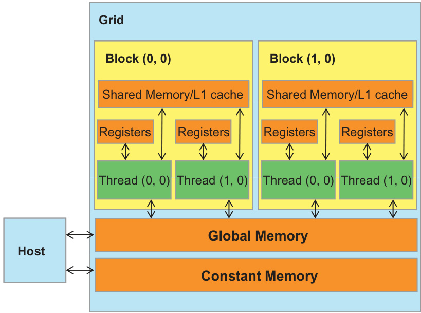
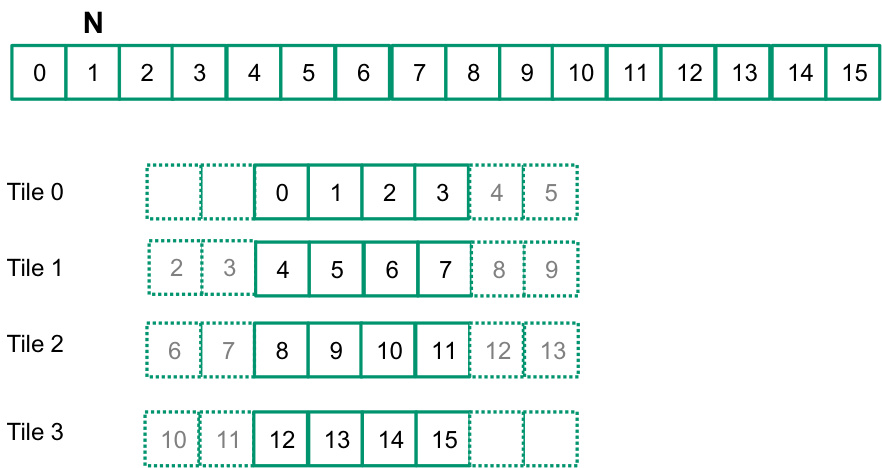
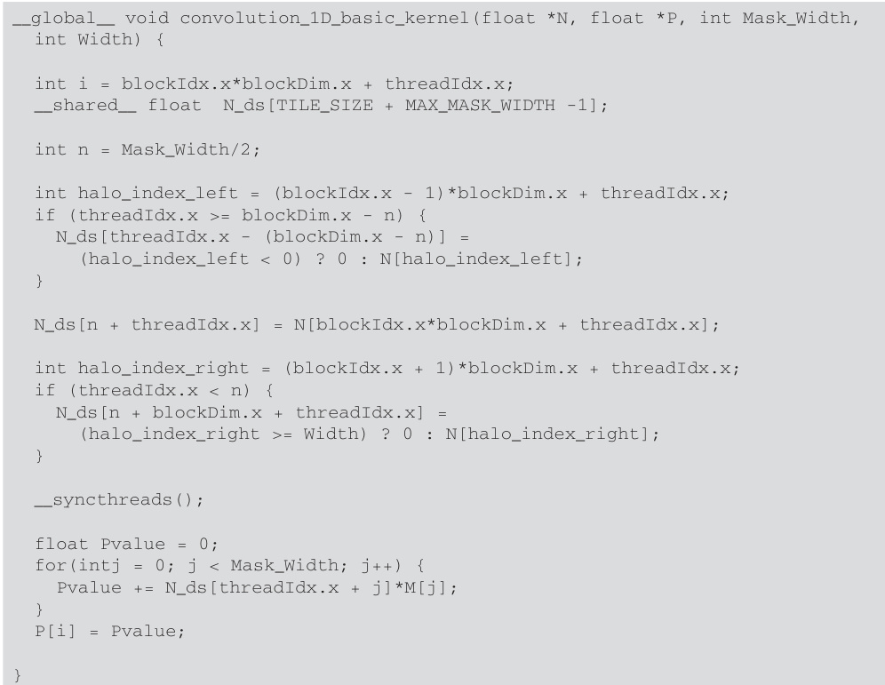
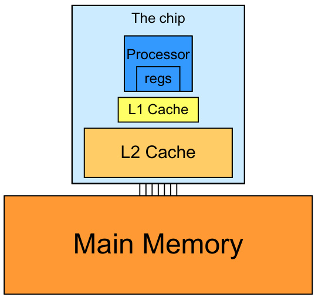

## Análise da Eficiência da Convolução 1D Tiled com Elementos Halo

### Introdução

Este capítulo aprofunda a análise da implementação de convolução 1D utilizando a técnica de *tiling* com elementos halo, expandindo os conceitos previamente introduzidos sobre kernels básicos de convolução. A motivação principal para o uso de *tiling* reside na redução do número de acessos à DRAM, um gargalo comum em computações intensivas em dados executadas em GPUs. Analisaremos a relação entre operações aritméticas e acessos à memória na versão *tiled*, comparando-a com a implementação básica para quantificar os ganhos em eficiência [^6].

### Conceitos Fundamentais

A convolução 1D, em sua forma mais elementar, requer o acesso a múltiplos elementos da entrada para calcular cada elemento da saída. Em kernels básicos, cada thread carrega os dados necessários da memória global (DRAM) a cada iteração. Essa abordagem resulta em uma alta taxa de acessos à memória, especialmente quando o tamanho do kernel de convolução é significativo.

![Illustration of 1D convolution: input array N convolved with mask M results in output array P, calculating P[2] as 57.](./../images/image2.jpg)

A técnica de *tiling* visa mitigar esse problema, dividindo o vetor de entrada em blocos (tiles) menores, que são então carregados para a memória compartilhada (SRAM) da GPU. A memória compartilhada é significativamente mais rápida que a DRAM, permitindo que os threads acessem os dados necessários para múltiplas computações sem incorrer no custo de um acesso à memória global a cada vez.

Os **elementos halo** são adicionados aos *tiles* para garantir que todos os elementos necessários para o cálculo da convolução em cada posição do *tile* estejam disponíveis na memória compartilhada, mesmo nas bordas do *tile*. O tamanho do halo depende do tamanho do kernel de convolução.

A implementação *tiled* introduz uma sobrecarga: o custo de carregar os *tiles* (incluindo os elementos halo) da DRAM para a SRAM. A eficiência da abordagem *tiled* depende, portanto, do balanço entre a redução no número de acessos à DRAM e o custo adicional de carregar os *tiles*.

**Análise da Relação Operações Aritméticas vs. Acessos à Memória:**

Para quantificar a eficiência, consideremos os seguintes parâmetros:

*   $N$: Tamanho do vetor de entrada.
*   $K$: Tamanho do kernel de convolução.
*   $T$: Tamanho do *tile*.

**Kernel Básico:**

Para o kernel básico, cada elemento da saída requer $K$ multiplicações e $K-1$ adições (aproximadamente $2K$ operações aritméticas). Cada elemento da saída também requer $K$ acessos à DRAM para os elementos da entrada. Portanto, para calcular todos os $N$ elementos da saída, temos:

*   Operações Aritméticas: $\approx 2NK$
*   Acessos à DRAM: $NK$

A relação Operações/Acessos é, portanto, $\frac{2NK}{NK} = 2$.

**Kernel Tiled com Elementos Halo:**

No kernel *tiled*, o vetor de entrada é dividido em *tiles* de tamanho $T$. Cada *tile* requer um halo de tamanho $\frac{K-1}{2}$ em cada extremidade (assumindo que $K$ é ímpar). Portanto, o tamanho total do *tile* com halo é $T + K - 1$.

O número de *tiles* é aproximadamente $\frac{N}{T}$. Cada *tile* é carregado da DRAM para a SRAM uma vez. Portanto, o número total de acessos à DRAM para carregar os *tiles* é:

*   Acessos à DRAM (para carregar os *tiles*): $\frac{N}{T} (T + K - 1) = N + \frac{N(K-1)}{T}$

Dentro de cada *tile*, cada elemento da saída é calculado utilizando os dados presentes na SRAM. O número de operações aritméticas por elemento é o mesmo que no kernel básico ($2K$). Portanto, o número total de operações aritméticas é aproximadamente $2NK$.

A relação Operações/Acessos para o kernel *tiled* é:

$$
\frac{2NK}{N + \frac{N(K-1)}{T}} = \frac{2K}{1 + \frac{K-1}{T}} = \frac{2KT}{T + K - 1}
$$

**Análise Comparativa:**

A melhoria na relação Operações/Acessos com a técnica de *tiling* depende da escolha do tamanho do *tile* ($T$). Se $T$ for muito pequeno, a sobrecarga de carregar os *tiles* dominará, e a eficiência será menor que a do kernel básico. Se $T$ for muito grande, o benefício da reutilização de dados na SRAM diminuirá.

Para avaliar o ponto de equilíbrio, podemos comparar a relação Operações/Acessos do kernel *tiled* com a do kernel básico (2):

$$
\frac{2KT}{T + K - 1} > 2
$$

$$
2KT > 2T + 2K - 2
$$

$$
KT > T + K - 1
$$

$$
T(K-1) > K - 1
$$

$$
T > 1
$$

Essa análise simplificada sugere que, contanto que o tamanho do *tile* seja maior que 1, o kernel *tiled* será mais eficiente. No entanto, essa é uma simplificação excessiva, pois não considera a latência dos acessos à memória, o overhead da sincronização entre threads e outros fatores.

Uma análise mais precisa exigiria a consideração de modelos de custo que levem em conta a latência da DRAM, a largura de banda da SRAM e a sobrecarga da sincronização. Além disso, o tamanho ideal do *tile* dependerá das características específicas da GPU (tamanho da memória compartilhada, número de registradores, etc.) e das características do problema (tamanho do kernel de convolução, tamanho do vetor de entrada).

### Conclusão

A técnica de *tiling* com elementos halo oferece um potencial significativo para melhorar a eficiência da convolução 1D em GPUs, reduzindo o número de acessos à DRAM. A relação entre operações aritméticas e acessos à memória é melhorada em comparação com o kernel básico, desde que o tamanho do *tile* seja escolhido de forma adequada. A análise apresentada fornece uma base teórica para a otimização da implementação *tiled*. Implementações práticas e benchmarks empíricos são necessários para determinar o tamanho ideal do *tile* e quantificar os ganhos reais em desempenho para diferentes configurações de hardware e tamanhos de problema.

### Referências
[^6]: Trecho do contexto que motiva a análise da relação entre operações aritméticas e acessos à memória.
<!-- END -->