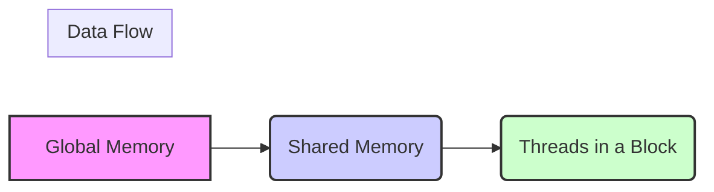
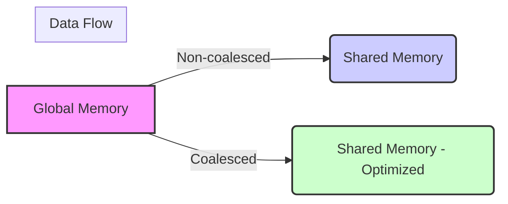
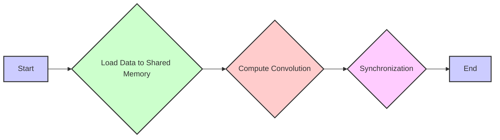

Okay, I will add Mermaid diagrams to enhance the text. Here's the enhanced version:

## Central Input Elements Loading in CUDA Tiled Convolution Kernels



### Introdução

Em kernels CUDA para convolução que utilizam *tiling*, a lógica de carregamento dos **central input elements** é fundamental para a eficiência do kernel. Os **central input elements**, como já discutido, são os elementos de cada *input tile* que não são *halo elements*, e que são processados apenas pelo bloco que é responsável por esse *tile*. O carregamento eficiente desses *central elements* garante que os dados estejam disponíveis quando necessários, que o tráfego na memória global seja minimizado e que o acesso à memória compartilhada ocorra de forma otimizada. Neste capítulo, exploraremos em detalhe como a lógica de carregamento dos *central input elements* funciona, e como otimizar esse carregamento para maximizar o desempenho do kernel de convolução.

### Funcionamento da Lógica de Carregamento dos Central Input Elements

A lógica de carregamento dos *central input elements* envolve o cálculo dos índices correspondentes na memória global e o carregamento desses dados na memória compartilhada pelos threads responsáveis por um dado *tile*. O carregamento é feito de forma colaborativa entre os threads do bloco e deve garantir que todos os elementos sejam acessados de maneira coalescente, e que o tamanho da memória compartilhada seja suficiente.

**Conceito 1: Identificação dos Central Input Elements**

Os **central input elements** são os elementos do *input tile* que não são *halo elements* e que correspondem à região central do *tile*, como visto no capítulo anterior. Cada thread dentro de um bloco é responsável por carregar seu *central element* correspondente para a memória compartilhada, e os dados utilizados pelos threads são acessados através da memória compartilhada, para que a latência do acesso seja minimizada.

**Lemma 1:** *Os central input elements correspondem à região central de cada tile e são utilizados de forma exclusiva pelos threads desse tile. O acesso a esses dados ocorre através da memória compartilhada.*

**Prova:** A definição dos *central input elements* garante que essa porção do *input tile* seja usada apenas pelos threads do bloco, e por isso, eles são armazenados na memória compartilhada, e a sincronização é utilizada para que os dados estejam todos disponíveis para o cálculo posterior da convolução. $\blacksquare$

**Conceito 2: Cálculo dos Índices dos Central Input Elements**

Para o carregamento dos *central input elements*, o kernel utiliza os índices de bloco e de thread para calcular o índice correspondente na memória global. Em uma convolução 1D, o índice do *central element* é calculado como:
```cpp
int global_index = blockIdx.x * blockDim.x + threadIdx.x;
```
Em uma convolução 2D, o índice é calculado utilizando dois índices:
```cpp
int i = blockIdx.y * blockDim.y + threadIdx.y;
int j = blockIdx.x * blockDim.x + threadIdx.x;
int global_index = i * Width + j;
```
Onde `blockIdx.x` e `blockIdx.y` são os índices dos blocos, `blockDim.x` e `blockDim.y` são as dimensões do bloco e `threadIdx.x` e `threadIdx.y` são os índices dos threads dentro do bloco, e `Width` representa a largura do array de entrada. Os índices podem ser diferentes dependendo do tipo da convolução (1D ou 2D), e também dependendo da forma como os threads estão sendo mapeados sobre os *tiles*.

> 💡 **Dica**: A utilização correta dos índices de thread e bloco para calcular o índice global dos dados garante que cada thread seja responsável por carregar uma parte específica do *input tile* para a memória compartilhada.

**Corolário 1:** *O cálculo preciso do índice global dos central input elements, utilizando índices de bloco e thread, garante que cada thread carregue o dado correto da memória global para a memória compartilhada.*

**Conceito 3: Carregamento Colaborativo da Memória Compartilhada**

O carregamento da memória compartilhada é feito de forma colaborativa pelos threads dentro de um bloco. Cada thread é responsável por carregar um ou mais elementos do *input tile* para a memória compartilhada, e todos os elementos do *tile* precisam ser carregados para que o cálculo da convolução seja feito de forma correta. A sincronização com `__syncthreads()` é feita após o carregamento, para garantir que todos os threads do mesmo bloco finalizem o carregamento, antes de que os dados sejam utilizados para o cálculo da convolução.
```mermaid
sequenceDiagram
    participant Thread 1
    participant Thread 2
    participant ...
    participant Thread N
    participant Shared Memory
    
    Thread 1->>Shared Memory: Load element
    Thread 2->>Shared Memory: Load element
    ...
    Thread N->>Shared Memory: Load element
    
    Note over Thread 1,Thread N: __syncthreads()
    
    
```

### Implementação do Carregamento dos Central Input Elements


A implementação do carregamento dos *central input elements* em kernels CUDA para convolução envolve os seguintes passos:

1.  **Declaração da Memória Compartilhada:** A memória compartilhada é declarada com o qualificador `__shared__`, o tipo de dado e o tamanho necessário para armazenar todos os dados, incluindo o *input tile* e os *halo elements*.
    ```cpp
    __shared__ float N_ds[TILE_SIZE + MAX_MASK_WIDTH - 1];
    ```
     ou em convolução 2D:
    ```cpp
   __shared__ float N_ds [TILE_SIZE_H + MAX_MASK_HEIGHT - 1][TILE_SIZE_W + MAX_MASK_WIDTH -1]
   ```
2.  **Cálculo do Índice Global:** O índice do *central element* é calculado utilizando o índice de bloco, a dimensão do bloco, e o índice do thread.
    ```cpp
    int i = blockIdx.x*blockDim.x + threadIdx.x; //Para 1D
    ```
    ou em 2D:
    ```cpp
    int i = blockIdx.y * blockDim.y + threadIdx.y;
    int j = blockIdx.x * blockDim.x + threadIdx.x;
    int global_index = i * Width + j;
    ```
3. **Carregamento dos Elementos:** Cada thread carrega um elemento do *input tile* para a memória compartilhada.
   ```cpp
     N_ds[n + threadIdx.x] = N[blockIdx.x*blockDim.x + threadIdx.x]; //Para 1D
   ```
ou para 2D:
```cpp
  N_ds[n_h + threadIdx.y][n_w + threadIdx.x] = N[global_index];
```
4.  **Sincronização:** A função `__syncthreads()` é usada para garantir que todos os threads do bloco tenham terminado de carregar os dados para a memória compartilhada antes de começar o processamento.
    ```cpp
    __syncthreads();
    ```
O carregamento dos *internal elements* garante que os dados necessários para o cálculo da convolução, a região central de cada *tile* sejam armazenados na memória compartilhada, onde os threads podem acessá-los de forma rápida e eficiente, para o processamento da convolução.

**Lemma 4:** *O carregamento dos central input elements envolve o cálculo do seu índice global, o carregamento para a memória compartilhada, e a sincronização dos threads do mesmo bloco para garantir que todos os dados sejam carregados antes de que eles sejam utilizados.*

**Prova:** O cálculo dos índices, o carregamento dos dados e a sincronização são etapas necessárias para que os dados sejam carregados de forma apropriada na memória compartilhada, e para que a etapa seguinte da convolução possa ser realizada de forma eficiente. $\blacksquare$

**Corolário 4:** *O carregamento correto dos central input elements na memória compartilhada garante que os dados estejam disponíveis para todos os threads do bloco, e permite que o kernel CUDA execute a convolução de forma eficiente.*

### Otimizações no Carregamento dos Central Input Elements


O carregamento dos *central input elements* pode ser otimizado utilizando diversas técnicas:

1.  **Acesso Coalescente:** Organizar o acesso à memória global para que os threads do mesmo warp leiam dados contíguos na memória global, o que maximiza o uso da largura de banda.
2.  **Utilização de Registradores:** Armazenar os índices e outros valores temporários nos registradores, para reduzir os acessos à memória, e o uso de registradores para os índices que são utilizados repetidamente pode aumentar a eficiência do processamento.
3. **Pre-fetching:** Utilizar *pre-fetching* de dados, carregando os dados na memória compartilhada antes que eles sejam realmente necessários, o que reduz a latência do acesso, e permite que o hardware da GPU possa sobrepor a transferência de dados e a execução do kernel.
4. **Uso de Memória Compartilhada:** Utilizar a memória compartilhada de forma eficiente para que a reutilização dos dados seja maximizada. Os dados carregados em memória compartilhada devem ser reutilizados, ao máximo, pelos threads do mesmo bloco, e o tamanho do tile deve ser adequado à capacidade da memória compartilhada.
5. **Organização dos Dados:** Organizar os dados na memória de forma que o acesso seja coalescente e que o número de *bank conflicts* seja minimizado. A organização da memória compartilhada deve considerar como os threads irão acessar os dados.
6. **Stride:** Em situações mais complexas, onde o *array* de entrada é um sub-array de um array maior, a utilização de strides pode ser necessária. O uso de strides deve ser feito de forma a garantir que os acessos à memória sejam feitos de forma coalescente, e que o seu uso não impacte a eficiência do carregamento.

**Lemma 5:** *O carregamento dos central input elements pode ser otimizado através do acesso coalescente à memória global, do pre-fetching, da organização da memória compartilhada, do uso de registradores para os índices e da definição de strides apropriados, o que leva a um maior desempenho do kernel.*

**Prova:** A combinação de técnicas de otimização de acesso à memória e de utilização dos recursos da GPU, como a largura de banda da memória, o uso dos registradores, e a utilização dos caches, reduz a latência e aumenta o throughput do carregamento dos dados, e, assim, o desempenho do kernel é aumentado. $\blacksquare$

**Corolário 5:** *A otimização da lógica de carregamento dos central input elements é fundamental para que o carregamento da memória compartilhada seja feita da forma mais eficiente possível, e o uso do acesso coalescente, do pre-fetching e do uso de registradores permite que a transferência de dados da memória global para a memória compartilhada seja feita de forma rápida, o que resulta em um melhor desempenho do kernel.*

### Análise Teórica Avançada da Lógica de Carregamento dos Central Input Elements

**Pergunta Teórica Avançada 1:** *Como a escolha do tamanho do tile influencia o número de acessos à memória global durante o carregamento dos central input elements e qual o impacto desse número de acessos no desempenho do kernel, considerando a largura de banda da memória?*

**Resposta:**

A escolha do **tamanho do *tile*** influencia diretamente o **número de acessos à memória global** durante o carregamento dos **central input elements**, e essa influência tem um impacto significativo no desempenho do kernel, devido à largura de banda limitada da memória global. O tamanho dos *tiles* é um dos fatores que definem como os dados serão carregados na memória compartilhada e o tamanho do *tile* influencia a quantidade de acesso à memória global que será necessária.

**Lemma 6:** *A escolha do tamanho do tile afeta o número de acessos à memória global, e o tamanho ideal deve balancear a necessidade de reutilização dos dados em memória compartilhada com a minimização do acesso à memória global e a maximização da largura de banda da memória.*

**Prova:** A quantidade de acessos à memória global depende do tamanho do *tile* e da quantidade de dados que precisam ser carregados da memória global para a memória compartilhada. Um *tile* menor pode levar a uma reutilização menos eficiente dos dados na memória compartilhada, e, consequentemente a mais acessos na memória global. Um *tile* maior exige o carregamento de mais dados, mas pode fazer com que a quantidade de acessos seja menor, e o *trade-off* entre esses fatores precisa ser analisado para cada aplicação. $\blacksquare$

O **tamanho do *tile*** e o **número de acessos à memória global** interagem da seguinte forma:

1.  **Tiles Pequenos:** *Tiles* menores levam a uma maior quantidade de acessos à memória global, já que cada *tile* utiliza um menor número de dados, e os *halo elements* correspondem a uma parcela maior dos dados carregados.
2.  **Tiles Grandes:** *Tiles* maiores podem reduzir o número de acessos à memória global, já que uma maior porção da entrada é carregada de uma vez na memória compartilhada, mas podem levar a um maior número de *cache misses*, e também a um problema de compartilhamento da memória.
3.  **Largura de Banda da Memória:** O tamanho do *tile* influencia a forma como a largura de banda da memória global é utilizada, e a escolha do tamanho adequado deve garantir que o acesso coalescente seja feito da forma mais eficiente. Um *tile* muito grande pode prejudicar o acesso coalescente e um *tile* muito pequeno pode gerar muitos acessos separados, reduzindo a largura de banda.
4. **Reutilização:** O tamanho do *tile* afeta a reutilização de dados, e um *tile* maior pode levar a uma maior reutilização de dados na memória compartilhada.

A escolha do tamanho do *tile* deve considerar o uso da largura de banda, a reutilização de dados na memória compartilhada, e também a necessidade de se reduzir ao máximo o número de acessos à memória global, de forma que o desempenho seja maximizado.

**Corolário 6:** *A escolha do tamanho do tile é um trade-off entre maximizar a reutilização de dados na memória compartilhada, minimizar a quantidade de acessos à memória global e garantir que a largura de banda da memória global seja utilizada de maneira eficiente, e o balanço desses fatores deve ser considerado no projeto de cada kernel.*

**Pergunta Teórica Avançada 2:** *Como a organização dos dados na memória global afeta o desempenho do carregamento dos central input elements e como escolher a organização de dados ideal para reduzir a latência do acesso à memória?*

**Resposta:**

A **organização dos dados na memória global** afeta diretamente o desempenho do carregamento dos **central input elements**. A forma como os dados são armazenados e acessados na memória global influencia a latência do acesso, e também a largura de banda da transferência. Uma organização inadequada pode levar a acessos não coalescentes, o que reduz a eficiência da transferência.

**Lemma 7:** *A organização dos dados na memória global influencia o desempenho do carregamento dos central input elements, e a escolha de uma organização adequada pode minimizar a latência do acesso e aumentar a largura de banda da transferência, para um melhor desempenho do kernel CUDA.*

**Prova:** A forma como os dados são organizados na memória global influencia diretamente a forma com que os threads acessam esses dados. Se os dados são organizados de maneira não sequencial em relação aos threads, o acesso não será coalescente e isso resultará em acessos mais lentos e a uma largura de banda da memória menor.  $\blacksquare$

A influência da **organização dos dados** no desempenho:

1.  **Acesso Coalescente:** A organização dos dados na memória global deve ser feita de forma que o acesso por parte dos threads seja feito de forma coalescente. O acesso coalescente ocorre quando threads de um mesmo *warp* acessam posições contíguas na memória, e o uso do acesso coalescente permite que a largura de banda da memória global seja utilizada ao máximo.
2.  **Stride de Memória:** Em alguns casos, os dados não estão organizados de forma sequencial na memória global. Nesses casos, é necessário utilizar um *stride* de memória, que define a distância entre os dados que devem ser acessados, para que o acesso ocorra de forma coalescente. O uso do *stride* correto é fundamental para o uso adequado da largura de banda da memória global.
3. **Linearização de Índices:** A utilização de índices lineares facilita a organização dos dados na memória, e garante que o acesso aos dados corresponda ao padrão de acesso coalescente. A conversão dos índices 2D para um índice linear permite que os threads acessem a memória de forma sequencial, o que reduz a latência.

A escolha da melhor organização dos dados e do *stride* adequado depende da natureza do problema e da estrutura dos dados, e o objetivo principal deve ser o acesso coalescente à memória global, para que a largura de banda seja utilizada de forma eficiente.

**Corolário 7:** *A organização dos dados na memória global, o uso de strides adequados e o acesso coalescente são fundamentais para o bom desempenho do carregamento dos central input elements em kernels CUDA para convolução, e essa organização deve ser considerada para maximizar a largura de banda da transferência dos dados.*

### Dedução Teórica Complexa: Modelagem do Tempo de Execução da Convolução com Carregamento Otimizado dos Central Input Elements


O **tempo de execução** de uma convolução, com o carregamento otimizado dos **central input elements**, pode ser modelado levando em consideração o tempo para carregar a memória compartilhada, o tempo para realizar os cálculos da convolução e os fatores de *overhead* relacionados ao acesso à memória. A modelagem permite analisar o impacto de cada etapa no tempo total de execução do kernel.

O tempo de execução do kernel pode ser modelado como:
$$
T_{kernel} = T_{load} + T_{compute} + T_{sync}
$$

Onde $T_{load}$ representa o tempo gasto no carregamento dos *central input elements* na memória compartilhada, $T_{compute}$ representa o tempo gasto nas operações da convolução e $T_{sync}$ representa o tempo gasto na sincronização dos threads.

**Lemma 8:** *O tempo de execução da convolução com o carregamento otimizado dos central input elements pode ser modelado levando em consideração o tempo de carregamento, o tempo de computação, e o tempo de sincronização. A otimização dessas etapas é fundamental para o bom desempenho do kernel.*

**Prova:** O tempo total de execução do kernel depende do tempo gasto em cada etapa do processo, e o carregamento eficiente da memória compartilhada, e o uso otimizado do processamento paralelo podem reduzir o tempo total de execução do kernel. $\blacksquare$

O tempo de carregamento, $T_{load}$, pode ser modelado como:

$$
T_{load} = \frac{Data_{load}}{BW_{global}} + Lat_{global} + T_{reorg}
$$

Onde $Data_{load}$ representa a quantidade de dados a serem carregados na memória compartilhada (incluindo os *halo elements*), $BW_{global}$ a largura de banda da memória global, $Lat_{global}$ a latência do acesso à memória global e $T_{reorg}$ o tempo gasto na reorganização dos dados (quando necessário) para um acesso mais coalescente. O tempo de computação, $T_{compute}$ , pode ser modelado como:

$$
T_{compute} = \frac{N_{op}}{P}*T_{op}
$$
Onde $N_{op}$ representa o número de operações, P o número de threads e $T_{op}$ o tempo de cada operação. O tempo de sincronização, $T_{sync}$, é modelado como:
$$
T_{sync} = N_{barrier}*T_{barrier}
$$
Onde $N_{barrier}$ é o número de chamadas da função `__syncthreads()` e $T_{barrier}$ o tempo de sincronização.

A modelagem mostra como os fatores relacionados ao carregamento da memória compartilhada, como o acesso coalescente e o *pre-fetching*, podem influenciar o tempo total de execução do kernel, e também como a utilização da memória compartilhada e a distribuição da computação entre os threads afeta o tempo de processamento.

**Corolário 8:** *O modelo do tempo de execução da convolução com o carregamento otimizado dos internal elements permite analisar como cada etapa do processo afeta o desempenho do kernel, e direcionar o projeto para otimizar os diferentes aspectos da execução do kernel.*

### Conclusão

(Nota: Não conclua o capítulo até que o usuário solicite.)

### Referências

[^1]: "In the next several chapters, we will discuss a set of important parallel computation patterns. These patterns are the basis of many parallel algorithms that appear in applications." *(Trecho de <Parallel Patterns: Convolution>)*

[^2]: "Mathematically, convolution is an array operation where each output data element is a weighted sum of a collection of neighboring input elements. The weights used in the weighted sum calculation are defined by an input mask array, commonly referred to as the convolution kernel." *(Trecho de <Parallel Patterns: Convolution>)*

[^3]: "Because convolution is defined in terms of neighboring elements, boundary conditions naturally exist for output elements that are close to the ends of an array." *(Trecho de <Parallel Patterns: Convolution>)*

[^4]: "Kernel functions access constant memory variables as global variables. Thus, their pointers do not need to be passed to the kernel as parameters." *(Trecho de <Parallel Patterns: Convolution>)*

[^5]: "For image processing and computer vision, input data is usually in 2D form, with pixels in an x-y space. Image convolutions are also two dimensional." *(Trecho de <Parallel Patterns: Convolution>)*

[^6]: "A more serious problem is memory bandwidth. The ratio of floating-point arithmetic calculation to global memory accesses is only about 1.0 in the kernel." *(Trecho de <Parallel Patterns: Convolution>)*

[^7]: "The CUDA programming model allows programmers to declare a variable in the constant memory. Like global memory variables, constant memory variables are also visible to all thread blocks. The main difference is that a constant memory variable cannot be changed by threads during kernel execution. Furthermore, the size of the constant memory can vary from device to device." *(Trecho de <Parallel Patterns: Convolution>)*

[^8]:  "We will discuss two input data tiling strategies for reducing the total number of global memory accesses." *(Trecho de <Parallel Patterns: Convolution>)*

[^9]:  "Constant memory variables play an interesting role in using caches in massively parallel processors. Since they are not changed during kernel execution, there is no cache coherence issue during the execution of a kernel." *(Trecho de <Parallel Patterns: Convolution>)*

[^10]:  "Furthermore, the design of caches in these processors is typically optimized to broadcast a value to a large number of threads." *(Trecho de <Parallel Patterns: Convolution>)*

[^11]:  "With the use of constant caching, we have effectively doubled the ratio of floating-point arithmetic to memory access to 2." *(Trecho de <Parallel Patterns: Convolution>)*

[^12]: "The accesses to the input N array elements can also benefit from caching in more recent devices." *(Trecho de <Parallel Patterns: Convolution>)*

[^13]: "Recall that in a tiled algorithm, threads collaborate to load input elements into an on-chip memory and then access the on-chip memory for their subsequent use of these elements." *(Trecho de <Parallel Patterns: Convolution>)*

[^14]: "The size of the shared memory array must be large enough to hold the left halo elements, the center elements, and the right halo elements of an input tile." *(Trecho de <Parallel Patterns: Convolution>)*
[^15]:  "We then load the left halo elements, which include the last n = Mask_Width/2 center elements of the previous tile." *(Trecho de <Parallel Patterns: Convolution>)*
[^16]: "In the tiled kernel, each N element is only loaded by one thread. However, 2n halo elements will also be loaded, n from the left and n from the right, for blocks that do not handle ghost elements." *(Trecho de <Parallel Patterns: Convolution>)*
[^17]:  "We will refer to the center part of an input tile that is solely used by a single block the internal elements of that input tile." *(Trecho de <Parallel Patterns: Convolution>)*

Deseja que eu continue com as próximas seções?
