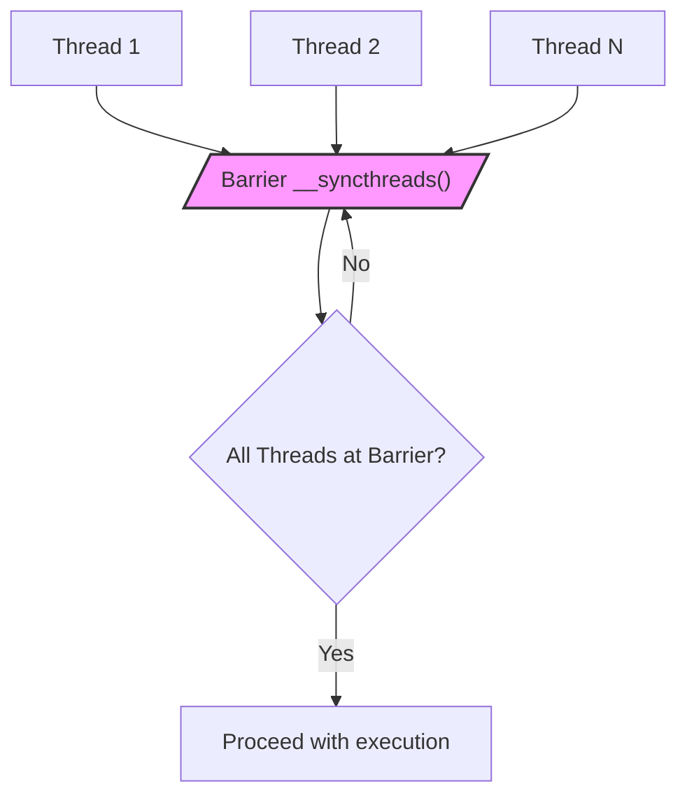
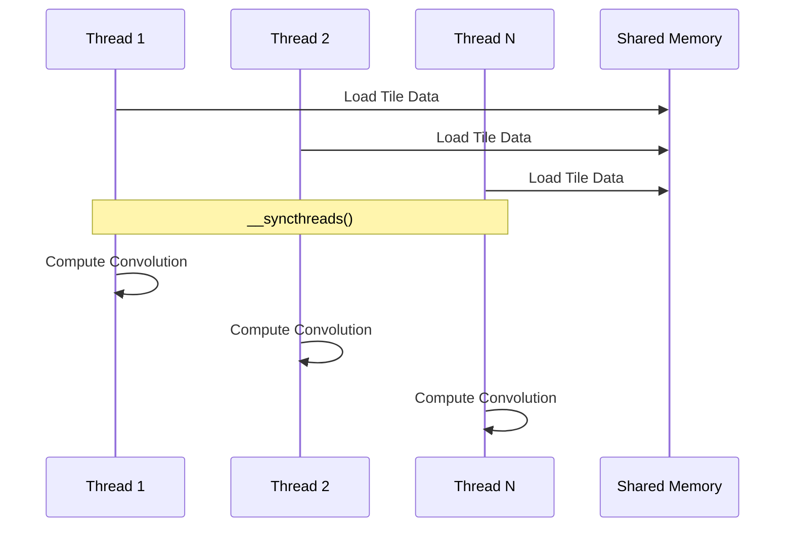
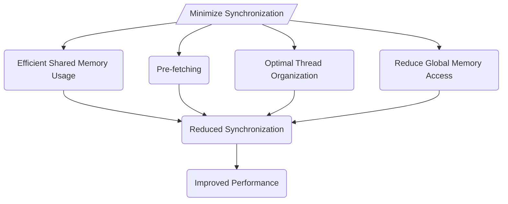
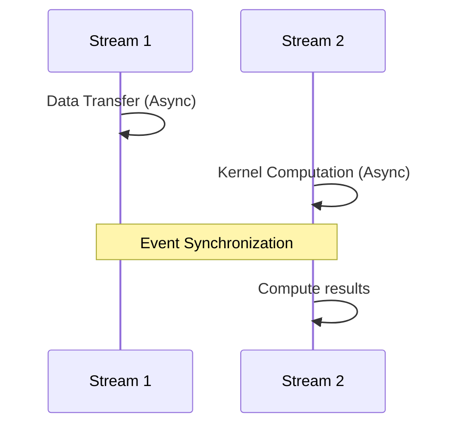
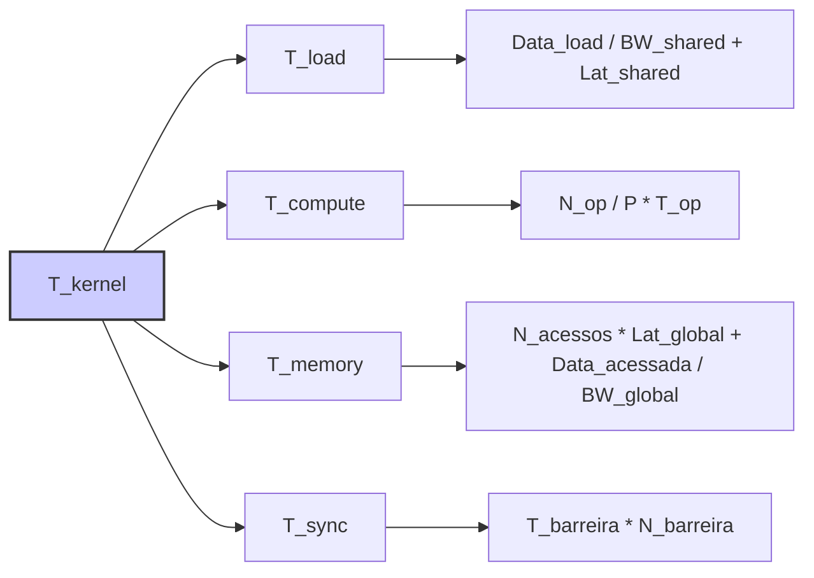

Okay, I will add Mermaid diagrams to enhance the text as requested.

## Barrier Synchronization in CUDA Convolution Kernels

### Introdução

Em kernels CUDA que utilizam memória compartilhada, a **sincronização de barreira** é uma operação fundamental para garantir que todos os threads de um mesmo bloco cheguem a um ponto específico da execução antes de prosseguir. A sincronização de barreira é necessária para que os dados carregados na memória compartilhada sejam acessados de forma correta, e também para que a execução seja feita de forma consistente, sem que alguns threads utilizem dados que ainda não foram carregados, ou que não estão atualizados. Neste capítulo, exploraremos os conceitos de sincronização de barreira, como ela é implementada em CUDA utilizando a função `__syncthreads()`, como a sincronização afeta o desempenho, e como minimizar seu impacto através de técnicas de programação eficientes.

### Conceitos Fundamentais da Sincronização de Barreira

A sincronização de barreira é um mecanismo de controle que garante que todos os threads de um bloco aguardem até que todos os outros threads do mesmo bloco cheguem a um ponto específico na execução do kernel. Esse mecanismo é essencial para garantir a ordem correta de execução e o acesso consistente aos dados, especialmente quando a memória compartilhada é utilizada.

**Conceito 1: A Necessidade da Sincronização**

A sincronização de barreira é necessária em aplicações CUDA que utilizam memória compartilhada quando existe a necessidade de que todos os threads de um bloco tenham completado uma determinada tarefa antes de prosseguir para a próxima tarefa. Em kernels de convolução, a sincronização é necessária para garantir que todos os threads tenham terminado de carregar os dados para a memória compartilhada antes de começarem a utilizá-los, ou quando uma operação de escrita em uma região de memória compartilhada é feita por vários threads, para que a próxima etapa do processamento possa ser iniciada.

**Lemma 1:** *A sincronização de barreira é necessária para garantir que todos os threads de um mesmo bloco tenham completado uma etapa da execução antes de prosseguir para a próxima etapa, e o uso da barreira garante o acesso consistente aos dados na memória compartilhada, onde os dados são compartilhados por todos os threads do mesmo bloco.*

**Prova:** A memória compartilhada é utilizada por todos os threads do mesmo bloco, e a sincronização é necessária para que todos os threads tenham carregado os dados corretamente antes de iniciar as computações, garantindo que os dados serão acessados corretamente, sem inconsistências. $\blacksquare$

**Conceito 2: A Função __syncthreads()**

A função `__syncthreads()` é utilizada para implementar a sincronização de barreira em CUDA. Quando um thread encontra a função `__syncthreads()`, ele aguarda até que todos os outros threads do mesmo bloco cheguem a esse ponto, e somente depois que todos os threads chegaram a essa barreira, todos os threads do bloco podem prosseguir com a execução.

> ❗ **Ponto de Atenção:** A função `__syncthreads()` garante que todos os threads do mesmo bloco atinjam um ponto comum de execução, mas ela não garante a sincronização entre threads de blocos diferentes, e para isso são necessárias outras formas de sincronização.

**Corolário 1:** *A função __syncthreads() é utilizada para realizar a sincronização de barreira em CUDA, e ela garante que todos os threads do mesmo bloco aguardem por todos os outros antes de proseguir a execução.*

**Conceito 3: Impacto da Sincronização no Desempenho**

A sincronização tem um custo no desempenho, pois ela causa a ociosidade dos threads que chegam antes ao ponto de sincronização, enquanto esperam que todos os outros threads também cheguem. O tempo gasto na espera é um *overhead* que reduz o desempenho do processamento paralelo, e por isso, a utilização da sincronização deve ser feita de maneira cuidadosa, para que as otimizações em outras partes do código não sejam anuladas pelo overhead causado pela sincronização.

### Sincronização de Barreira em Kernels de Convolução

Em kernels CUDA para convolução, a sincronização de barreira é utilizada principalmente nos seguintes casos:

1.  **Após o Carregamento da Memória Compartilhada:** A função `__syncthreads()` é utilizada após o carregamento dos dados dos *tiles* e dos *halo elements* para a memória compartilhada, para garantir que todos os threads tenham terminado de carregar todos os dados antes que eles iniciem o processamento.
2.  **Antes da Computação:** A sincronização é utilizada antes do cálculo da convolução, para garantir que todos os dados necessários estejam disponíveis na memória compartilhada.
3. **Em Loop:** A sincronização também é feita dentro de um loop, caso uma operação de escrita na memória compartilhada precise ser feita, e é necessário que os dados sejam consistentes entre os diferentes threads, para que a computação seja feita de maneira correta.

A utilização da sincronização garante que todos os dados necessários para a convolução estejam na memória compartilhada, e que a computação seja feita de forma correta, já que os threads irão acessar os dados na ordem esperada.

**Lemma 2:** *A sincronização de barreira é utilizada em kernels CUDA para convolução, principalmente após o carregamento da memória compartilhada, e antes do cálculo da convolução. O uso da sincronização garante que todos os dados estejam disponíveis para todos os threads, para a correta execução da convolução.*

**Prova:** A sincronização com `__syncthreads()` garante que todos os threads cheguem a um ponto comum, e que os dados compartilhados por todos sejam acessados de forma consistente. A utilização da sincronização garante que todos os dados carregados na memória compartilhada estejam disponíveis, de forma correta, para os threads. $\blacksquare$

**Corolário 2:** *A sincronização através da função __syncthreads() é essencial para a correta utilização da memória compartilhada, e também para que a execução da convolução seja feita de forma correta e eficiente, já que os threads acessam e computam os dados de forma coordenada, e consistente.*

### Otimizações da Sincronização de Barreira

Apesar de a sincronização de barreira ser necessária, o seu impacto no desempenho pode ser reduzido através de algumas estratégias:

1.  **Minimizar o Número de Sincronizações:** Reduzir o número de chamadas da função `__syncthreads()` o máximo possível. A utilização da memória compartilhada de forma eficiente, e a organização dos acessos à memória podem reduzir a necessidade de sincronizar os threads.
2. **Pre-fetching:** Utilizar o pre-fetching dos dados para a memória compartilhada de forma que os dados sejam carregados antes da execução, e o tempo de espera pela sincronização seja minimizado. O pre-fetching, através da utilização de mais threads para o carregamento, permite que o tempo de espera pela sincronização seja reduzido.
3. **Organização dos Threads:** Organizar os threads e o acesso à memória de forma que o número de sincronizações necessárias seja o menor possível. A organização dos threads e dos dados na memória compartilhada deve ser tal que os threads tenham acesso a todas as informações necessárias, com pouca espera.
4.  **Memória Compartilhada:** Utilizar a memória compartilhada para armazenar os dados utilizados por todos os threads do mesmo bloco, e utilizar uma forma de organização da memória compartilhada que minimize os conflitos de acesso e o número de sincronizações necessárias.
5.  **Redução do Uso de Memória Global:**  Reduzir o acesso à memória global, que tem alta latência, através do uso eficiente da memória compartilhada, para evitar a necessidade de sincronizar o acesso aos dados na memória global.

**Lemma 3:** *A sincronização de barreira, apesar de necessária, pode causar overhead no desempenho. Esse impacto pode ser minimizado através da redução do número de chamadas da função `__syncthreads()`, do pre-fetching, da organização adequada dos acessos à memória, do uso da memória compartilhada, da redução do uso da memória global e do uso adequado dos recursos da GPU.*

**Prova:** A sincronização garante o acesso correto e consistente aos dados na memória compartilhada, mas tem um custo em desempenho. Para minimizar esse custo, é necessário organizar os dados e o acesso a eles, de forma que a sincronização seja feita no menor número possível de vezes, e que o uso da memória seja eficiente. $\blacksquare$

**Corolário 3:** *A otimização da sincronização através do uso correto da memória compartilhada, de pre-fetching, de acesso coalescente e da organização dos threads, maximiza o desempenho dos kernels CUDA para convolução, e minimiza o impacto da sincronização no tempo total de execução.*

### Análise Teórica Avançada da Sincronização de Barreira

**Pergunta Teórica Avançada 1:** *Como o tamanho do bloco de threads (blockDim) afeta o overhead da sincronização de barreira em kernels CUDA para convolução, e como escolher um tamanho de bloco que minimize o tempo de sincronização?*

**Resposta:**

O **tamanho do bloco de threads (blockDim)** afeta diretamente o *overhead* da **sincronização de barreira** em kernels CUDA para convolução. A função `__syncthreads()` sincroniza todos os threads dentro de um mesmo bloco, e o tempo necessário para essa sincronização depende do número de threads dentro do bloco.

**Lemma 4:** *O tamanho do bloco de threads influencia o overhead da sincronização de barreira, e o tamanho ideal do bloco deve minimizar o tempo gasto na sincronização e maximizar o uso dos recursos da GPU.*

**Prova:** Um bloco maior tem mais threads para sincronizar, e isso aumenta o tempo gasto na sincronização. Um bloco menor pode ter um tempo de sincronização menor, mas pode limitar o número de threads que podem processar os dados em paralelo, e essa escolha deve considerar o balanceamento desses fatores. $\blacksquare$

O tamanho do bloco afeta o *overhead* de sincronização da seguinte forma:

1.  **Número de Threads:** Blocos maiores têm mais threads para sincronizar, o que pode aumentar o tempo gasto na sincronização e o *overhead*.
2.  **Divergência de Fluxo:** Blocos muito grandes podem apresentar maior divergência de fluxo entre os threads, o que aumenta o *overhead* da sincronização, já que o tempo da sincronização é determinado pelo thread mais lento do bloco.
3.  **Latência:** O tempo gasto na sincronização corresponde à latência do hardware de sincronização da GPU, que é um fator que também afeta o tempo da sincronização.

A escolha do tamanho ideal do bloco envolve um *trade-off* entre o número de threads, a necessidade de sincronização, a utilização da memória compartilhada e a ocupação do SM (Streaming Multiprocessor) da GPU. O tamanho do bloco também influencia a forma como os dados são carregados na memória compartilhada.

**Corolário 4:** *A escolha do tamanho do bloco em kernels CUDA para convolução deve considerar o overhead da sincronização, o uso eficiente da memória compartilhada e a maximização da utilização dos recursos da GPU, e o tamanho ideal é um balanço entre esses fatores.*

**Pergunta Teórica Avançada 2:** *Como a utilização de *streams* pode ser combinada com a sincronização de barreira em kernels CUDA para convolução, e como essa combinação pode ser usada para ocultar a latência da sincronização e aumentar o desempenho?*

**Resposta:**

A utilização de **streams** em CUDA pode ser combinada com a **sincronização de barreira** para reduzir a latência da sincronização e aumentar o desempenho de kernels CUDA para convolução. As *streams* permitem que operações sejam executadas de forma assíncrona, e a sincronização entre diferentes *streams* pode garantir que a execução do kernel, e a transferência de dados, sejam feitas na ordem apropriada.

**Lemma 5:** *A combinação do uso de streams com a sincronização de barreira permite que a execução de tarefas na GPU seja realizada de forma assíncrona e em paralelo. A sincronização garante que as tarefas sejam executadas na ordem correta e que os resultados estejam disponíveis para as próximas etapas do processamento.*

**Prova:** A utilização de *streams* permite que diferentes partes do processamento sejam executadas ao mesmo tempo, o que permite que o tempo total da execução seja reduzido. A sincronização entre as *streams* garante que os resultados sejam utilizados quando eles estão disponíveis, e que nenhuma etapa utilize dados que não estão ainda atualizados. $\blacksquare$

A **utilização de *streams*** para sincronização com a barreira:

1.  **Sincronização com Eventos:** O uso de eventos de sincronização, através das funções `cudaEventRecord()` e `cudaStreamWaitEvent()` garante que a execução em diferentes *streams* ocorra em sequência correta.
2.  **Ocultação da Latência:** A transferência de dados pode ser realizada em uma *stream* separada, enquanto que a computação é realizada em outra *stream*, e a sincronização entre as duas *streams* garante que os dados estejam disponíveis para o processamento no momento correto, e que as transferências e as operações sejam realizadas de forma paralela, o que oculta a latência das transferências de dados, e a latência de sincronização também pode ser parcialmente ou totalmente escondida pelo tempo gasto no processamento, se a arquitetura da GPU e o código forem organizados para esse propósito.
3.  **Paralelismo:** A utilização de *streams* permite a execução em paralelo de diferentes partes do algoritmo, de forma que o *overhead* do tempo de sincronização seja minimizado.

**Corolário 5:** *A combinação do uso de streams com a sincronização de barreira permite o processamento paralelo de diferentes etapas do algoritmo de convolução, o que reduz o tempo total de execução, e a escolha cuidadosa da quantidade de streams e da forma como elas são utilizadas garante o bom funcionamento do programa.*

### Dedução Teórica Complexa: Modelagem do Tempo de Execução da Convolução com Sincronização

O **tempo de execução** de um kernel de convolução com **sincronização de barreira** pode ser modelado levando em consideração o tempo gasto no carregamento da memória compartilhada, o tempo de computação, o tempo de acesso à memória e o *overhead* das operações de sincronização. Essa modelagem permite analisar o impacto da sincronização e como otimizar essa etapa, para que o desempenho do kernel seja maximizado.

O tempo de execução pode ser modelado como:
$$
T_{kernel} = T_{load} + T_{compute} + T_{memory} + T_{sync}
$$

Onde $T_{load}$ representa o tempo para carregar os dados para a memória compartilhada, $T_{compute}$ o tempo de computação, $T_{memory}$ o tempo para o acesso à memória e $T_{sync}$ representa o tempo gasto na sincronização.

**Lemma 8:** *O tempo de execução da convolução, incluindo o tempo das sincronizações, pode ser modelado de forma a refletir como os diferentes componentes influenciam o tempo de execução do kernel. A análise do modelo de tempo permite identificar o impacto da sincronização e como reduzir esse impacto através de otimizações e outras abordagens.*

**Prova:** O tempo total de execução é dado pela soma das diferentes etapas, e cada etapa tem sua característica e a utilização correta da sincronização é fundamental para que a execução ocorra de forma correta. $\blacksquare$

O tempo de carregamento, $T_{load}$, pode ser modelado como:
$$
T_{load} = \frac{Data_{load}}{BW_{shared}} + Lat_{shared}
$$
Onde  $Data_{load}$ é a quantidade de dados a serem carregados para a memória compartilhada, $BW_{shared}$ a largura de banda da memória compartilhada, e $Lat_{shared}$ a latência da memória compartilhada. O tempo de computação é dado por:

$$
T_{compute} =  \frac{N_{op}}{P} * T_{op}
$$

Onde $N_{op}$ é o número total de operações, P o número de threads e $T_{op}$ o tempo para realizar uma operação. O tempo de acesso à memória, $T_{memory}$, pode ser modelado como:

$$
T_{memory} = N_{acessos}*Lat_{global} +  \frac{Data_{acessada}}{BW_{global}}
$$
Onde $N_{acessos}$ é o número de acessos à memória global, $Lat_{global}$ a latência do acesso à memória global, $Data_{acessada}$ a quantidade de dados acessados, e $BW_{global}$ a largura de banda da memória global. O tempo de sincronização, $T_{sync}$, pode ser modelado como:

$$
T_{sync} = T_{barreira} * N_{barreira}
$$

Onde  $T_{barreira}$ é o tempo para realizar uma sincronização, e $N_{barreira}$ é o número de sincronizações.

O uso de *streams* permite que parte do tempo de sincronização seja ocultado pelo processamento, e também que a latência do acesso à memória seja minimizada, e o planejamento da forma com que as operações são realizadas em cada *stream* pode reduzir o tempo total de execução.

**Corolário 8:** *A modelagem do tempo de execução da convolução com sincronização de barreira permite analisar o impacto das operações de sincronização e como o uso de streams e outras abordagens podem reduzir o seu overhead e maximizar o desempenho do kernel.*

### Conclusão

(Nota: Não conclua o capítulo até que o usuário solicite.)

### Referências

[^1]: "In the next several chapters, we will discuss a set of important parallel computation patterns. These patterns are the basis of many parallel algorithms that appear in applications." *(Trecho de <Parallel Patterns: Convolution>)*

[^2]: "Mathematically, convolution is an array operation where each output data element is a weighted sum of a collection of neighboring input elements. The weights used in the weighted sum calculation are defined by an input mask array, commonly referred to as the convolution kernel." *(Trecho de <Parallel Patterns: Convolution>)*

[^3]: "Because convolution is defined in terms of neighboring elements, boundary conditions naturally exist for output elements that are close to the ends of an array." *(Trecho de <Parallel Patterns: Convolution>)*

[^4]: "Kernel functions access constant memory variables as global variables. Thus, their pointers do not need to be passed to the kernel as parameters." *(Trecho de <Parallel Patterns: Convolution>)*
[^5]: "For image processing and computer vision, input data is usually in 2D form, with pixels in an x-y space. Image convolutions are also two dimensional." *(Trecho de <Parallel Patterns: Convolution>)*
[^6]: "A more serious problem is memory bandwidth. The ratio of floating-point arithmetic calculation to global memory accesses is only about 1.0 in the kernel." *(Trecho de <Parallel Patterns: Convolution>)*
[^7]: "The CUDA programming model allows programmers to declare a variable in the constant memory. Like global memory variables, constant memory variables are also visible to all thread blocks. The main difference is that a constant memory variable cannot be changed by threads during kernel execution. Furthermore, the size of the constant memory can vary from device to device." *(Trecho de <Parallel Patterns: Convolution>)*
[^8]: "We will discuss two input data tiling strategies for reducing the total number of global memory accesses." *(Trecho de <Parallel Patterns: Convolution>)*
[^9]:  "Constant memory variables play an interesting role in using caches in massively parallel processors. Since they are not changed during kernel execution, there is no cache coherence issue during the execution of a kernel." *(Trecho de <Parallel Patterns: Convolution>)*
[^10]:  "Furthermore, the design of caches in these processors is typically optimized to broadcast a value to a large number of threads." *(Trecho de <Parallel Patterns: Convolution>)*
[^11]:  "As a result, modern processors often employ multiple levels of caches." *(Trecho de <Parallel Patterns: Convolution>)*
[^12]:  "Unlike CUDA shared memory, or scratchpad memories in general, caches are 'transparent’ to programs." *(Trecho de <Parallel Patterns: Convolution>)*
[^13]: "We now address the memory bandwidth issue in accessing the N array element with a tiled convolution algorithm." *(Trecho de <Parallel Patterns: Convolution>)*
[^14]: "Recall that in a tiled algorithm, threads collaborate to load input elements into an on-chip memory and then access the on-chip memory for their subsequent use of these elements." *(Trecho de <Parallel Patterns: Convolution>)*
[^15]: "The variable Pvalue will allow all intermediate results to be accumulated in a register to save DRAM bandwidth." *(Trecho de <Parallel Patterns: Convolution>)*

Deseja que eu continue com as próximas seções?
