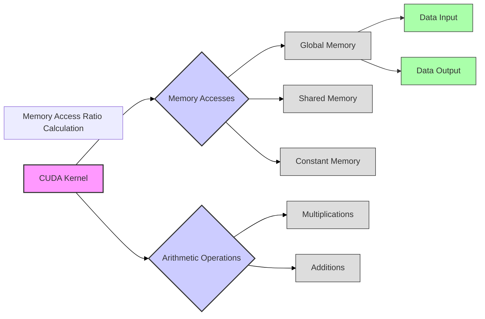

Okay, I will add Mermaid diagrams to enhance the text as requested.

## Memory Access Ratio in CUDA Convolution Kernels



### Introdução

A **razão de acesso à memória**, também conhecida como razão *aritmética-memória*, é uma métrica importante para analisar o desempenho de kernels CUDA, especialmente em aplicações que são limitadas pela largura de banda da memória, como é o caso de kernels para convolução. Essa razão mede o número de operações aritméticas realizadas para cada acesso à memória, e um valor alto dessa razão indica que o kernel está realizando mais computação para cada acesso à memória, o que geralmente leva a um melhor desempenho, e a um menor tempo total de execução. Neste capítulo, exploraremos o conceito da razão de acesso à memória, como ela é calculada, como ela afeta o desempenho dos kernels de convolução, e quais técnicas podem ser utilizadas para aumentar essa razão.

### Conceitos Fundamentais da Razão de Acesso à Memória

A razão de acesso à memória é uma métrica que indica o quanto um kernel está computando para cada acesso à memória, e um valor ideal para essa métrica indica um bom aproveitamento da capacidade de processamento do hardware, em relação aos gargalos do acesso à memória.

**Conceito 1: Definição da Razão de Acesso à Memória**

A **razão de acesso à memória** (ou razão aritmética-memória) é definida como a razão entre o número de operações aritméticas (multiplicações, adições, etc) realizadas por um kernel e o número de acessos à memória (tanto à memória global como à memória compartilhada e à memória constante). Essa métrica é usada para determinar a eficiência do uso dos recursos de computação em relação ao uso dos recursos de memória.

**Lemma 1:** *A razão de acesso à memória (aritmética-memória) é definida como a razão entre o número de operações aritméticas e o número de acessos à memória e ela é usada para quantificar o uso eficiente da capacidade de processamento do hardware da GPU em relação aos acessos à memória.*

**Prova:** O número de operações aritméticas indica a carga de processamento, e o número de acessos à memória indica o tempo gasto com a latência da memória, e a razão entre os dois mostra a eficiência do uso do hardware. $\blacksquare$

**Conceito 2: Impacto da Razão de Acesso à Memória no Desempenho**

Uma alta razão de acesso à memória indica que o kernel está realizando mais computação para cada acesso à memória, o que reduz o tempo de espera pela memória e aumenta o desempenho. Por outro lado, uma baixa razão de acesso à memória indica que o kernel está realizando muitos acessos à memória e pouca computação, o que leva a um gargalo, e isso diminui a taxa de processamento.

> ❗ **Ponto de Atenção:** O aumento da razão de acesso à memória é uma forma de otimizar o desempenho, mas a forma como essa razão é obtida, e a forma como os diferentes níveis da hierarquia de memória são utilizados, tem um grande impacto no tempo total de execução do kernel.

**Corolário 1:** *Uma alta razão de acesso à memória é uma métrica desejável para kernels CUDA, já que ela indica um uso eficiente do hardware, com um maior número de operações para cada acesso à memória.*

**Conceito 3: Cálculo da Razão de Acesso à Memória**

O cálculo da razão de acesso à memória envolve:

1.  **Contagem das Operações Aritméticas:** Contar o número de operações aritméticas (multiplicações, adições, etc) que são realizadas pelo kernel em um certo intervalo de tempo.
2.  **Contagem dos Acessos à Memória:** Contar o número de acessos à memória global, à memória compartilhada e à memória constante. É fundamental que essa métrica seja medida com precisão, através de ferramentas de *profiling* ou através da instrumentação do código.
3.  **Cálculo da Razão:** Dividir o número de operações aritméticas pelo número de acessos à memória.

O número de operações e de acessos devem ser contados em uma parte representativa do código do kernel, de forma que a razão obtida represente corretamente a forma com que o kernel utiliza a memória.

### Calculando a Razão de Acesso à Memória em Kernels de Convolução

```mermaid
graph LR
    A["Convolution Kernel"] --> B{"Arithmetic Ops"};
    A --> C{"Memory Accesses"};
    B --> D["Multiplications"];
    B --> E["Additions"];
    C --> F["Global Mem Accesses"];
    C --> G["Shared Mem Accesses"];
    C --> H["Constant Mem Accesses"];
    style A fill:#f9f,stroke:#333,stroke-width:2px
    style B fill:#ccf,stroke:#333,stroke-width:2px
    style C fill:#ccf,stroke:#333,stroke-width:2px
    subgraph "Memory Access Ratio Calculation"
        style D fill:#ddd,stroke:#333,stroke-width:1px
        style E fill:#ddd,stroke:#333,stroke-width:1px
        style F fill:#ddd,stroke:#333,stroke-width:1px
        style G fill:#ddd,stroke:#333,stroke-width:1px
         style H fill:#ddd,stroke:#333,stroke-width:1px
    end
    linkStyle 0,1 stroke:#000,stroke-width:1px;
    linkStyle 0,2 stroke:#000,stroke-width:1px;
    linkStyle 3,4 stroke:#000,stroke-width:1px;
    linkStyle 5,6,7 stroke:#000,stroke-width:1px;
```

O cálculo da razão de acesso à memória em kernels CUDA para convolução envolve as seguintes etapas:

1.  **Contagem das Operações Aritméticas:** Contar o número de multiplicações e adições que são feitas dentro dos loops da convolução. Em uma convolução 1D, o número de operações é proporcional ao tamanho da *convolution mask*. Em uma convolução 2D, o número de operações é proporcional ao produto da largura e altura da *convolution mask*.

2.  **Contagem dos Acessos à Memória Global:** Contar o número de acessos à memória global, que ocorrem ao carregar os dados de entrada para a memória compartilhada (incluindo os *halo elements*), e também quando os resultados são armazenados na memória global de saída.

3. **Contagem dos Acessos à Memória Compartilhada:** Contar o número de acessos à memória compartilhada. Para dados carregados em memória compartilhada, o número de acessos é igual ao número de threads que utilizam a memória compartilhada, e, em geral, esse acesso tem menor latência do que o acesso à memória global.
4.  **Contagem dos Acessos à Memória Constante:** Contar o número de acessos à memória constante. Em geral, os acessos à memória constante não são contabilizados diretamente, já que o *cache* da memória constante oculta parte desse tempo, mas, em casos específicos, pode ser necessário considerar esses acessos, principalmente quando o tamanho da máscara é muito grande, ou quando a taxa de acerto do cache é muito baixa.
5. **Cálculo da Razão:** Dividir o número de operações aritméticas pelo número total de acessos à memória (global, compartilhada e constante).

A contagem das operações e dos acessos pode ser feita através da instrumentação do código, através de operações manuais com base na análise do código, ou também através de ferramentas de *profiling* que medem o tempo de acesso a cada região de memória, e o número de operações realizadas. O resultado do cálculo fornece uma medida da eficiência do uso da memória por parte do kernel.

**Lemma 2:** *O cálculo da razão de acesso à memória envolve a contagem do número de operações aritméticas, o número de acessos à memória global, à memória compartilhada e à memória constante, e a razão entre esses números permite quantificar o uso eficiente da largura de banda da memória.*

**Prova:** A razão entre operações e acessos quantifica quantos cálculos o kernel realiza, a partir de dados que são acessados na memória. Ao aumentar essa razão, o tempo total de execução do kernel é reduzido, já que o processador realiza mais computações para cada acesso à memória. $\blacksquare$

**Corolário 2:** *O cálculo da razão de acesso à memória em kernels CUDA para convolução permite avaliar a eficiência do uso da hierarquia de memória, e também o quão bem o kernel está aproveitando os recursos de computação da GPU em relação ao gargalo da memória.*

### Otimização da Razão de Acesso à Memória

```mermaid
graph LR
    A["Optimization Techniques"] --> B{"Shared Memory"};
    A --> C{"Constant Memory"};
    A --> D{"Tiling"};
    A --> E{"Coalesced Access"};
     A --> F{"Loop Unrolling"};
     A --> G{"Prefetching"};
    B --> H["Input Tiles"];
    C --> I["Convolution Mask"];
    D --> J["Divided Regions"];
    E --> K["Max Bandwidth"];
    F --> L["More ops/access"];
    G --> M["Data in Shared Mem"];
     style A fill:#f9f,stroke:#333,stroke-width:2px
     style B fill:#ccf,stroke:#333,stroke-width:2px
    style C fill:#ccf,stroke:#333,stroke-width:2px
    style D fill:#ccf,stroke:#333,stroke-width:2px
    style E fill:#ccf,stroke:#333,stroke-width:2px
      style F fill:#ccf,stroke:#333,stroke-width:2px
    style G fill:#ccf,stroke:#333,stroke-width:2px
    subgraph "Techniques to increase Memory Access Ratio"
        style H fill:#ddd,stroke:#333,stroke-width:1px
          style I fill:#ddd,stroke:#333,stroke-width:1px
          style J fill:#ddd,stroke:#333,stroke-width:1px
        style K fill:#ddd,stroke:#333,stroke-width:1px
         style L fill:#ddd,stroke:#333,stroke-width:1px
          style M fill:#ddd,stroke:#333,stroke-width:1px
    end
    linkStyle 0,1,2,3,4,5,6 stroke:#000,stroke-width:1px;
    linkStyle 1,7 stroke:#000,stroke-width:1px;
     linkStyle 2,8 stroke:#000,stroke-width:1px;
      linkStyle 3,9 stroke:#000,stroke-width:1px;
       linkStyle 4,10 stroke:#000,stroke-width:1px;
        linkStyle 5,11 stroke:#000,stroke-width:1px;
         linkStyle 6,12 stroke:#000,stroke-width:1px;
```

A razão de acesso à memória pode ser otimizada através da aplicação de diversas técnicas:

1.  **Utilização da Memória Compartilhada:** Utilizar a memória compartilhada para armazenar os *input tiles*, o que permite que os dados sejam acessados repetidamente pelos threads sem a necessidade de acessar a memória global a cada iteração do cálculo da convolução. A reutilização dos dados da memória compartilhada aumenta a quantidade de operações de computação em relação aos acessos à memória.

2.  **Utilização da Memória Constante:** Utilizar a memória constante para armazenar a *convolution mask*, e isso elimina acessos repetidos à memória global para cada acesso à máscara. O *cache* da memória constante é otimizado para o acesso por múltiplos threads, e isso minimiza a latência do acesso.
3. **Tiling:** Utilizar o *tiling* para dividir a entrada em regiões menores, o que permite o uso mais eficiente da memória compartilhada, e também permite carregar uma região menor de dados por acesso à memória global.
4. **Acesso Coalescente:** O acesso à memória global deve ser feito de forma coalescente para maximizar a largura de banda, e evitar que os acessos causem gargalos no tempo de processamento do kernel. O acesso coalescente maximiza a transferência de dados em cada acesso à memória global.
5.  **Loop Unrolling:** O *loop unrolling* pode aumentar o número de operações por acesso à memória. Ao realizar o *unrolling* de loops, é possível aumentar a quantidade de computação realizada para cada acesso aos dados de entrada.
6. **Pre-fetching:** O uso de *pre-fetching* para carregar os dados em memória compartilhada antes que eles sejam realmente necessários, pode minimizar o número de acessos à memória global e aumentar a reutilização dos dados na memória compartilhada.

**Lemma 3:** *A razão de acesso à memória em kernels CUDA para convolução pode ser otimizada através do uso eficiente da memória compartilhada, da memória constante, do tiling, do acesso coalescente, do loop unrolling e do pre-fetching, e o conjunto dessas abordagens leva a um maior número de operações por acesso à memória.*

**Prova:** O uso da memória compartilhada, da memória constante e do *tiling* reduz a necessidade de acessar a memória global, e o acesso coalescente e o *loop unrolling* otimizam a largura de banda e a reutilização de dados, o que aumenta o número de operações aritméticas em relação ao número de acessos à memória. $\blacksquare$

**Corolário 3:** *A otimização da razão de acesso à memória através do uso das técnicas descritas é fundamental para melhorar o desempenho de kernels CUDA para convolução, através do uso eficiente da hierarquia de memória da GPU, e da maximização do número de operações por acesso à memória.*

### Análise Teórica Avançada da Razão de Acesso à Memória

**Pergunta Teórica Avançada 1:** *Como a latência do acesso à memória global e a largura de banda da memória afetam a razão de acesso à memória, e como equilibrar essas métricas para otimizar o desempenho de kernels CUDA para convolução?*

**Resposta:**

A **latência do acesso à memória global** e a **largura de banda da memória** afetam a **razão de acesso à memória** em kernels CUDA para convolução de forma complexa, e o equilíbrio entre essas métricas é fundamental para otimizar o desempenho, e a otimização do kernel deve levar em consideração o uso de cada tipo de memória, e o balanço entre o número de operações e o tempo gasto em cada acesso à memória.

**Lemma 4:** *A latência do acesso à memória global e a largura de banda da memória afetam a razão de acesso à memória, e o balanço entre essas métricas, e a otimização do uso da hierarquia de memória da GPU, é fundamental para que o desempenho do kernel seja o mais alto possível.*

**Prova:** A latência é o tempo gasto em cada acesso à memória, e a largura de banda é a taxa na qual os dados são acessados na memória, e a razão de acesso à memória é influenciada tanto pela quantidade de operações que são feitas, como pela latência e largura de banda da memória. $\blacksquare$

O impacto da **latência** e da **largura de banda** na razão de acesso à memória:

1.  **Latência e Acessos à Memória:** A latência do acesso à memória global afeta o tempo gasto para cada leitura ou escrita na memória, e um número excessivo de acessos à memória global aumenta o tempo total de execução, e diminui a eficiência do kernel, reduzindo a razão de acesso à memória. O uso dos *caches* e da memória compartilhada é uma forma de reduzir o impacto da latência do acesso à memória.
2.  **Largura de Banda e Quantidade de Dados:** A largura de banda da memória global influencia a quantidade de dados que podem ser acessados em um determinado tempo, e a escolha do tamanho dos *tiles* e da forma como os dados são acessados deve levar em consideração a largura de banda para que todos os dados necessários sejam acessados de forma eficiente.
3.  **Balanceamento:** Um bom balanceamento entre a computação e o acesso à memória é fundamental, e é necessário que a escolha dos parâmetros do kernel e das técnicas de otimização busquem a melhor razão possível entre as operações aritméticas e os acessos à memória. Se o kernel gasta muito tempo acessando a memória, ele estará perdendo tempo de processamento da convolução, e, se o kernel gasta tempo demais fazendo computações e acessando poucos dados, o *throughput* do processamento pode não ser o ideal.

O planejamento adequado do kernel e a escolha de como os dados são armazenados e acessados na memória deve sempre buscar o equilíbrio entre a latência, a largura de banda e a quantidade de operações, e cada caso deve ser avaliado de forma separada.

**Corolário 4:** *A escolha dos parâmetros e da forma de acesso à memória deve considerar o balanço entre a latência de acesso e a largura de banda da memória, e a otimização da razão de acesso à memória deve ser feita buscando o máximo de computação para cada acesso à memória.*

**Pergunta Teórica Avançada 2:** *Como a hierarquia de caches da GPU (L1, L2 e caches da memória constante) interage com a razão de acesso à memória em kernels CUDA para convolução com tiling e qual o impacto no desempenho do kernel?*

**Resposta:**

A **hierarquia de caches** da GPU (L1, L2 e *caches* da memória constante) interage diretamente com a **razão de acesso à memória** em kernels CUDA para convolução com *tiling*, e a otimização do uso dos *caches* é fundamental para maximizar o desempenho do kernel. Os *caches* são utilizados para reduzir o tempo de acesso aos dados, e a forma como o acesso aos dados é feito, influencia a eficiência do uso dos *caches*, e também a razão de acesso à memória.

**Lemma 5:** *A hierarquia de caches (L1, L2 e caches da memória constante) influencia a razão de acesso à memória, através da redução da latência e do tráfego na memória global, e o uso eficiente desses recursos permite aumentar o desempenho dos kernels CUDA para convolução.*

**Prova:** Cada nível da hierarquia de memória apresenta uma combinação diferente de latência, largura de banda, capacidade e custo de acesso. A utilização eficiente desses níveis, junto com a otimização do acesso à memória, e o uso da memória constante garante a melhor razão de acesso à memória. $\blacksquare$

A **interação entre os caches e a razão de acesso à memória** é a seguinte:

1.  **Caches L1 e L2:** Os *caches* L1 e L2 armazenam dados que são utilizados com mais frequência pelos threads, reduzindo a necessidade de acessar a memória global, e esses caches são gerenciados pelo hardware da GPU, que tenta prever quais dados serão utilizados com maior frequência. O carregamento e o uso da memória compartilhada também fazem uso do *cache* L1, e isso faz com que os dados necessários para o cálculo da convolução sejam acessados de forma mais eficiente.
2.  **Caches da Memória Constante:** O *cache* da memória constante é utilizado para armazenar dados que são somente leitura e que são utilizados por vários threads, como a *convolution mask*. O acesso à memória constante utiliza esse cache, e isso reduz o tempo de acesso à máscara, sem a necessidade de acessar a memória global para cada acesso.
3.  **Latência e Largura de Banda:** O uso correto da hierarquia de *caches* aumenta a largura de banda e reduz a latência do acesso à memória, e o uso dessas estratégias deve ser planejado de forma a melhorar a razão de acesso à memória. O *pre-fetching* e a reutilização dos dados na memória compartilhada, também auxiliam na utilização dos caches, o que aumenta a sua eficiência.
4.  **Acesso Coalescente:** O acesso coalescente permite que os dados sejam carregados de forma eficiente nos *caches*, o que aumenta a taxa de acerto do *cache*, e diminui o acesso à memória global.

O uso adequado da hierarquia de *caches* e a otimização da forma como os dados são acessados tem um grande impacto na razão de acesso à memória, e o conhecimento das características dos diferentes níveis de *cache* pode guiar as decisões para otimizar o kernel de convolução.

**Corolário 6:** *A hierarquia de caches da GPU, composta pelos caches L1, L2 e o cache da memória constante, possui características diferentes, e a exploração dessas diferenças permite que a latência e a largura de banda do acesso à memória seja otimizada, e que a razão de acesso à memória seja maximizada para um alto desempenho do kernel de convolução em CUDA.*

### Dedução Teórica Complexa: Modelagem do Tempo de Execução da Convolução com Razão de Acesso à Memória

```mermaid
graph LR
    A["Execution Time (T_kernel)"] --> B{"Memory Access Time (T_memory)"};
    A --> C{"Compute Time (T_compute)"};
   
    B --> D["Number of Memory Accesses"];
    B --> E["Memory Access Ratio"];
     B --> F["Access Latency"];
     
    C --> G["Number of Ops"];
    C --> H["Number of Threads"];
      C --> I["Time per Operation"];

    style A fill:#f9f,stroke:#333,stroke-width:2px
     style B fill:#ccf,stroke:#333,stroke-width:2px
    style C fill:#ccf,stroke:#333,stroke-width:2px
     subgraph "Kernel Execution Time Model"
        style D fill:#ddd,stroke:#333,stroke-width:1px
        style E fill:#ddd,stroke:#333,stroke-width:1px
         style F fill:#ddd,stroke:#333,stroke-width:1px
          style G fill:#ddd,stroke:#333,stroke-width:1px
          style H fill:#ddd,stroke:#333,stroke-width:1px
          style I fill:#ddd,stroke:#333,stroke-width:1px
    end
    linkStyle 0,1,2 stroke:#000,stroke-width:1px;
    linkStyle 1,3,4,5 stroke:#000,stroke-width:1px;
      linkStyle 2,6,7,8 stroke:#000,stroke-width:1px;
```

O **tempo de execução** de um kernel de convolução e a sua relação com a **razão de acesso à memória** podem ser modelados levando em consideração a quantidade de operações aritméticas, o tempo de acesso à memória (e como ele é influenciado pela hierarquia de memória e pelo uso dos caches), e o modelo permite analisar como o aumento da razão de acesso à memória afeta o desempenho do kernel.

O tempo de execução do kernel pode ser modelado como:

$$
T_{kernel} = T_{memory} + T_{compute}
$$

Onde $T_{memory}$ representa o tempo de acesso à memória, e $T_{compute}$ representa o tempo de computação.

**Lemma 7:** *O tempo de execução da convolução é modelado como a soma do tempo gasto com a computação e o tempo gasto no acesso à memória, e o uso eficiente da hierarquia de memória, e da utilização de estratégias para aumentar a razão de acesso à memória, leva à otimização do desempenho do kernel.*

**Prova:** O tempo total de execução de um kernel corresponde ao tempo gasto nas operações computacionais e no tempo gasto para buscar dados na memória. A melhor forma de reduzir esse tempo é aumentar o número de operações computacionais para cada acesso à memória, ou seja, otimizar a razão de acesso à memória, e reduzir também o tempo gasto em cada acesso, com o uso de caches e outras abordagens. $\blacksquare$

O tempo de acesso à memória, $T_{memory}$, pode ser modelado como:
$$
T_{memory} = \frac{N_{acessos}}{R_{access}} * Latencia_{acesso}
$$
Onde $N_{acessos}$ é o número de acessos à memória, $Latencia_{acesso}$ a latência média do acesso, e $R_{access}$ a razão de acesso à memória (aritmética / memória), e o impacto do uso de diferentes níveis de memória, com diferentes taxas de acerto nos caches, influencia a latência do acesso à memória.

O tempo para realizar a computação,  $T_{compute}$, pode ser modelado como:
$$
T_{compute} = \frac{N_{op}}{P}*T_{op}
$$
Onde $N_{op}$ é o número de operações, P o número de threads e $T_{op}$ o tempo de uma operação.

O modelo mostra como o tempo de execução depende da razão de acesso à memória, e, por isso, a estratégia de otimização deve focar em aumentar essa razão, através da reutilização dos dados, do uso da memória compartilhada, da organização dos dados para o acesso coalescente, e outras otimizações que levam ao melhor uso do hardware da GPU.

**Corolário 7:** *A modelagem do tempo de execução da convolução com razão de acesso à memória permite analisar o impacto de cada fator e como a otimização da razão de acesso à memória é fundamental para a redução do tempo total de execução do kernel.*

### Conclusão

(Nota: Não conclua o capítulo até que o usuário solicite.)

### Referências

[^1]: "In the next several chapters, we will discuss a set of important parallel computation patterns. These patterns are the basis of many parallel algorithms that appear in applications." *(Trecho de <Parallel Patterns: Convolution>)*
[^2]: "Mathematically, convolution is an array operation where each output data element is a weighted sum of a collection of neighboring input elements. The weights used in the weighted sum calculation are defined by an input mask array, commonly referred to as the convolution kernel." *(Trecho de <Parallel Patterns: Convolution>)*
[^3]: "Because convolution is defined in terms of neighboring elements, boundary conditions naturally exist for output elements that are close to the ends of an array." *(Trecho de <Parallel Patterns: Convolution>)*
[^4]: "Kernel functions access constant memory variables as global variables. Thus, their pointers do not need to be passed to the kernel as parameters." *(Trecho de <Parallel Patterns: Convolution>)*
[^5]: "For image processing and computer vision, input data is usually in 2D form, with pixels in an x-y space. Image convolutions are also two dimensional." *(Trecho de <Parallel Patterns: Convolution>)*
[^6]: "A more serious problem is memory bandwidth. The ratio of floating-point arithmetic calculation to global memory accesses is only about 1.0 in the kernel." *(Trecho de <Parallel Patterns: Convolution>)*
[^7]: "The CUDA programming model allows programmers to declare a variable in the constant memory. Like global memory variables, constant memory variables are also visible to all thread blocks. The main difference is that a constant memory variable cannot be changed by threads during kernel execution. Furthermore, the size of the constant memory can vary from device to device." *(Trecho de <Parallel Patterns: Convolution>)*
[^8]: "We will discuss two input data tiling strategies for reducing the total number of global memory accesses." *(Trecho de <Parallel Patterns: Convolution>)*
[^9]:  "Constant memory variables play an interesting role in using caches in massively parallel processors. Since they are not changed during kernel execution, there is no cache coherence issue during the execution of a kernel." *(Trecho de <Parallel Patterns: Convolution>)*
[^10]:  "Furthermore, the design of caches in these processors is typically optimized to broadcast a value to a large number of threads." *(Trecho de <Parallel Patterns: Convolution>)*
[^11]: "As a result, modern processors often employ multiple levels of caches." *(Trecho de <Parallel Patterns: Convolution>)*
[^12]: "Unlike CUDA shared memory, or scratchpad memories in general, caches are 'transparent’ to programs." *(Trecho de <Parallel Patterns: Convolution>)*
[^13]:  "There is a trade-off between the size of a memory and the speed of a memory." *(Trecho de <Parallel Patterns: Convolution>)*
[^14]: "Therefore, the hardware can aggressively cache the constant variable values in L1 caches." *(Trecho de <Parallel Patterns: Convolution>)*
[^15]:  "The variable Pvalue will allow all intermediate results to be accumulated in a register to save DRAM bandwidth." *(Trecho de <Parallel Patterns: Convolution>)*
[^16]: "The if statement in the loop tests if any of the input N elements used are ghost elements, either on the left side or the right side of the N array." *(Trecho de <Parallel Patterns: Convolution>)*

Deseja que eu continue com as próximas seções?
