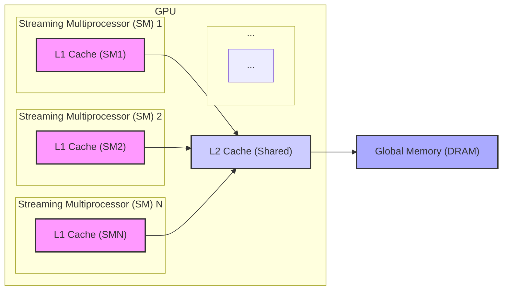
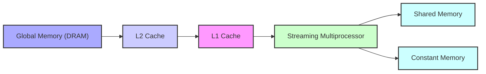
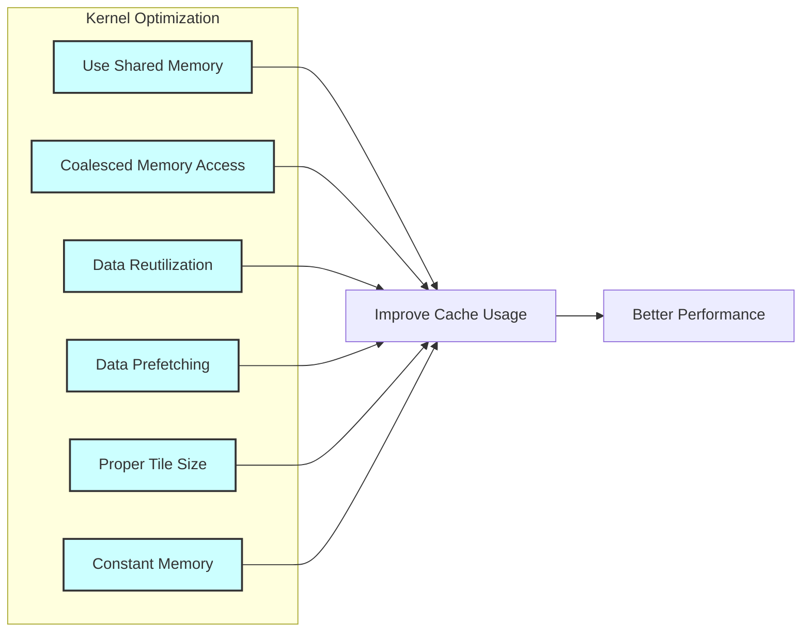
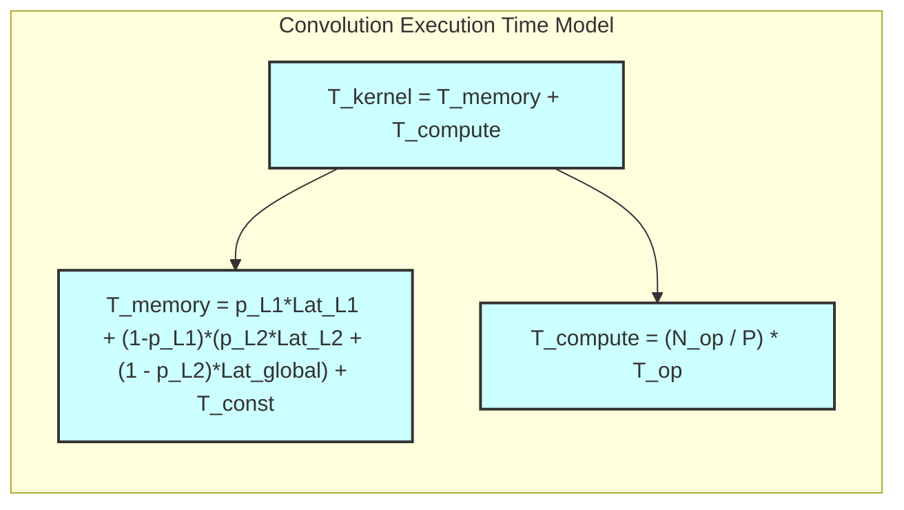

Okay, I've analyzed the text and added Mermaid diagrams to enhance understanding of the concepts. Here's the enhanced text with diagrams:

## L1 and L2 Caches in CUDA Convolution Kernels

### Introdução

Os **caches L1 e L2** são componentes essenciais da hierarquia de memória de GPUs modernas, e eles desempenham um papel fundamental na otimização do desempenho de kernels CUDA para convolução. Como visto em capítulos anteriores, a memória global (DRAM) tem alta latência e largura de banda limitada, e os *caches* L1 e L2 são utilizados para armazenar os dados que são utilizados com frequência, para que possam ser acessados de forma mais rápida, e também para minimizar a necessidade de acesso à memória global. Neste capítulo, exploraremos as características dos caches L1 e L2, como eles funcionam em kernels CUDA para convolução, como a escolha de diferentes abordagens de utilização da memória afeta o uso dos caches, e como otimizar o uso dos *caches* para maximizar o desempenho do kernel.

### Características dos Caches L1 e L2

Os *caches* L1 e L2 são *caches on-chip* (dentro do chip da GPU) que são utilizados para reduzir a latência do acesso à memória, e cada um deles tem características próprias:

1.  **Cache L1:** O *cache* L1 é um *cache* de baixa latência e alta velocidade que é dedicado a cada SM (Streaming Multiprocessor) da GPU, e cada SM tem seu próprio *cache* L1. O *cache* L1 armazena os dados que são utilizados com mais frequência pelos threads que executam em um determinado SM.
2.  **Cache L2:** O *cache* L2 é um *cache* de nível intermediário, que é compartilhado por todos os SMs da GPU. O *cache* L2 é maior do que o *cache* L1, mas possui uma latência um pouco maior do que o *cache* L1, e armazena os dados utilizados com frequência por vários SMs, e também pode ser utilizado por instruções que não acessam o *cache* L1.

**Conceito 1: Localidade de Dados e Caches**

Os caches L1 e L2 exploram a **localidade de dados**. A localidade temporal ocorre quando os mesmos dados são utilizados repetidamente ao longo do tempo. A localidade espacial ocorre quando dados que são próximos um dos outros na memória são utilizados em conjunto. Os caches armazenam os dados que são utilizados de forma repetida ou que são próximos a outros dados que foram utilizados recentemente, para que o acesso seja feito de forma mais rápida quando esses dados forem utilizados novamente.

**Lemma 1:** *Os caches L1 e L2 exploram a localidade de dados para reduzir a latência do acesso à memória, ao armazenar os dados que são utilizados com mais frequência, e que estão mais próximos do processador.*

**Prova:** O *cache* armazena dados que foram utilizados recentemente, com a hipótese de que eles serão utilizados novamente em breve. Os *caches* utilizam diferentes algoritmos para escolher quais dados serão armazenados, como LRU (Least Recently Used), e outras variações, e isso garante que os dados de acesso mais frequente estejam sempre nos *caches*. $\blacksquare$

**Conceito 2: Hierarquia de Caches e Latência**

Os *caches* L1 e L2 formam uma hierarquia, com o *cache* L1 sendo mais rápido e de menor capacidade e o *cache* L2 sendo um pouco mais lento mas com maior capacidade. Essa hierarquia permite que o acesso aos dados seja realizado de forma eficiente, utilizando o *cache* mais adequado para cada situação, e a escolha do nível de *cache* que será utilizado é feita automaticamente pelo hardware da GPU.

> ❗ **Ponto de Atenção:** A utilização eficiente dos *caches* L1 e L2 é fundamental para reduzir a latência do acesso à memória global e aumentar o desempenho do kernel CUDA.

**Corolário 1:** *A hierarquia de caches da GPU (L1 e L2) permite reduzir a latência do acesso à memória através do armazenamento de dados que são utilizados com frequência, em níveis de memória mais próximos do processador, e o bom aproveitamento dessa hierarquia garante uma maior eficiência no acesso aos dados.*

**Conceito 3: Caches e Memória Compartilhada e Constante**

A memória compartilhada (ou *scratchpad memory*) utiliza o *cache* L1, quando disponível, para armazenar dados. A memória constante utiliza um cache especializado otimizado para o acesso de múltiplos threads, e que realiza um *broadcast* dos dados para os threads que utilizam a memória constante. A hierarquia de caches auxilia na reutilização dos dados que estão armazenados na memória compartilhada e também na leitura eficiente dos dados da memória constante, com um acesso de baixa latência e uma alta largura de banda.

### Caches L1 e L2 em Kernels de Convolução

Em kernels CUDA para convolução, os caches L1 e L2 são utilizados da seguinte forma:

1.  **Cache L1 e Memória Compartilhada:** Os dados carregados na memória compartilhada também utilizam o *cache* L1, de forma que o acesso à memória compartilhada seja mais rápido. A escolha de como o carregamento da memória compartilhada é feito, afeta diretamente a utilização do cache L1. Os dados carregados na memória compartilhada são armazenados no cache L1, e, se os dados são reutilizados, o acesso ocorre com uma baixa latência.

2.  **Cache L2 e Memória Global:** Os dados da memória global, que não são carregados na memória compartilhada, podem ser armazenados no *cache* L2. O acesso aos dados da memória global que estão no cache L2 é mais rápido do que o acesso diretamente à memória global (DRAM). A escolha da forma de acesso à memória global, de forma coalescente ou não, afeta diretamente o uso do *cache* L2.
3.  **Cache da Memória Constante:** Os dados armazenados na memória constante são carregados em um *cache* otimizado para o acesso por múltiplos threads, o que reduz a latência do acesso, e aumenta a largura de banda do acesso aos dados da *convolution mask*.

A hierarquia de *caches* é gerenciada automaticamente pelo hardware da GPU, mas o programador pode influenciar como esses *caches* são utilizados através da escolha dos tipos de memória e da forma como a memória é acessada, da utilização da memória compartilhada, da utilização da memória constante e da organização do acesso à memória global, para que o uso dos caches ocorra da melhor forma possível.

**Lemma 2:** *Os caches L1 e L2 são utilizados em kernels CUDA para convolução para reduzir a latência do acesso à memória e otimizar o desempenho do kernel. A utilização adequada desses caches, e a forma com que os dados são armazenados e reutilizados, afeta diretamente a eficiência do uso da memória.*

**Prova:** Os caches são utilizados para diminuir a latência do acesso à memória. Se a lógica do kernel for escrita de forma a utilizar a localidade de dados, e também a reutilização dos dados, o uso dos caches é maximizado, e o acesso à memória é feito de forma mais eficiente. $\blacksquare$

**Corolário 2:** *O uso eficiente dos caches L1 e L2 é essencial para reduzir a latência do acesso à memória e para aumentar a eficiência do acesso aos dados, e o projeto do kernel deve levar em consideração o uso de cada nível do cache para obter o melhor desempenho.*

### Otimizações e Caches L1 e L2

O uso dos *caches* L1 e L2 pode ser otimizado através das seguintes técnicas:

1.  **Memória Compartilhada:** Utilizar a memória compartilhada para armazenar os dados dos *tiles*, para que o acesso a esses dados seja feito através do *cache* L1, e o uso da memória compartilhada reduz o número de acessos à memória global, que são mais lentos.
2.  **Acesso Coalescente à Memória Global:** O acesso à memória global deve ser feito de forma coalescente, para que os dados sejam carregados no *cache* L2 de forma eficiente, e para que o *cache* possa ser utilizado para o acesso subsequente a esses dados. O uso do acesso coalescente aumenta a quantidade de dados carregados em um único acesso.
3.  **Reutilização de Dados:** Organizar o código do kernel para que os dados sejam reutilizados o máximo possível, de forma que eles permaneçam no *cache* por mais tempo, e o número de *cache misses* seja reduzido, já que dados que já estão em cache são acessados com uma menor latência.
4.  **Pre-fetching:** Carregar os dados para os *caches* (através da memória compartilhada ou diretamente do acesso à memória global) antes que eles sejam realmente necessários, o que permite ocultar a latência do acesso à memória e o *pre-fetching* garante que dados que provavelmente serão utilizados estejam disponíveis no *cache* quando eles forem necessários.
5.  **Tamanho do Tile:** Escolher o tamanho adequado para os *tiles*, de forma que os dados utilizados caibam no cache. O tamanho do *tile* tem um grande impacto no uso dos *caches*. Um *tile* muito grande pode não caber no *cache*, enquanto que um *tile* muito pequeno não aproveita a largura de banda da memória.
6.  **Memória Constante:** A utilização da memória constante para a *convolution mask* permite que o acesso a essa memória seja feito através de caches otimizados para *broadcast* de dados para múltiplos threads, reduzindo a latência e o tráfego da memória global.

**Lemma 4:** *A utilização eficiente dos caches L1 e L2 em kernels CUDA para convolução envolve a utilização da memória compartilhada, do acesso coalescente à memória global, do pre-fetching de dados, da escolha do tamanho adequado do tile, e do uso da memória constante para a *convolution mask*, e a utilização conjunta de todas essas estratégias permite que o tempo de acesso à memória e a latência da memória sejam reduzidos ao máximo.*

**Prova:** A combinação dessas técnicas visa aumentar a taxa de acerto do *cache* e, consequentemente, diminuir a necessidade de acessar a memória global, que possui alta latência e largura de banda limitada. O uso eficiente dos *caches* diminui a latência e o tempo de acesso à memória. $\blacksquare$

**Corolário 4:** *A escolha adequada de onde os dados são armazenados e de como eles são acessados deve considerar a hierarquia de memória da GPU, para que os caches sejam utilizados de forma eficiente, de forma que a latência seja reduzida ao máximo e o desempenho do kernel seja o melhor possível.*

### Análise Teórica Avançada dos Caches

**Pergunta Teórica Avançada 1:** *Como a associatividade dos caches L1 e L2 influencia a taxa de acerto do cache em kernels CUDA para convolução com tiling, e como o tamanho do tile interage com essa associatividade?*

**Resposta:**

A **associatividade** dos *caches* L1 e L2 influencia diretamente a **taxa de acerto** do *cache* em kernels CUDA para convolução com *tiling*, e essa relação é fundamental para o desempenho do kernel. A associatividade define como os dados da memória são mapeados para o *cache*, e um *cache* com maior associatividade permite que mais dados sejam armazenados simultaneamente, o que aumenta a taxa de acerto, mas também aumenta a complexidade do hardware e o overhead da gestão desse tipo de *cache*.

**Lemma 5:** *A associatividade dos caches L1 e L2 define como os dados da memória são mapeados para o cache e, consequentemente, afeta a taxa de acerto e o desempenho. A escolha do tamanho do tile influencia diretamente a forma como os caches são utilizados, e um tamanho de tile adequado pode aumentar a taxa de acerto e o desempenho.*

**Prova:** Um cache com associatividade maior permite que diferentes dados possam ser mapeados para a mesma posição de cache, e isso reduz o número de *cache misses*. O tamanho do tile, por sua vez, determina como os dados são carregados para o cache, e como eles são reutilizados. Portanto, os dois parâmetros, associatividade do cache e tamanho do tile, são diretamente relacionados com a taxa de acerto do cache e o tempo total de execução. $\blacksquare$

O **tamanho do *tile*** e a **associatividade** interagem da seguinte forma:

1.  **Cache de Associação Direta:** Em um *cache* de associação direta, cada endereço de memória é mapeado para uma única posição do *cache*. Se os *tiles* forem muito grandes, ou com um padrão de acesso inadequado, eles podem gerar muitos *cache misses* devido a conflitos de acesso no cache, e, consequentemente, reduzindo a taxa de acerto do cache, o que diminui o desempenho.
2.  **Cache Set-Associativo:** Em um *cache* *set-associativo* (como os *caches* L1 e L2 da GPU), cada endereço de memória pode ser mapeado para um conjunto de posições do *cache*, o que reduz os conflitos de acesso. Os *caches* *set-associativos* são um meio termo entre o *cache* totalmente associativo, e o *cache* de associação direta, e seu desempenho depende da forma como os dados são acessados. O tamanho dos *tiles* deve ser escolhido de forma que o aproveitamento do *cache* seja o maior possível.
3.  **Tamanho do Tile e Cache Misses:** A escolha do tamanho do *tile* deve considerar o tamanho da linha de *cache* e a sua associatividade, para garantir que o *tile* caiba no *cache*, e também para minimizar o número de *cache misses*. O *pre-fetching* de dados e a organização do acesso também auxiliam a aumentar a taxa de acerto do *cache*, ao carregar os dados antes que eles sejam necessários para a computação.

A escolha adequada do tamanho do *tile*, e do padrão de acesso aos dados deve considerar a arquitetura dos caches da GPU, e o balanço entre esses parâmetros é essencial para o desempenho do kernel de convolução.

**Corolário 5:** *A associatividade dos caches L1 e L2 influencia diretamente a taxa de acerto do cache, e o tamanho do tile interage com essa associatividade, e a combinação entre os dois parâmetros deve ser feita de forma cuidadosa para que o desempenho do kernel CUDA para convolução seja maximizado.*

**Pergunta Teórica Avançada 2:** *Como a política de substituição do cache (LRU, FIFO, etc.) afeta a latência do acesso à memória em kernels CUDA para convolução, e como escolher a melhor estratégia de acesso aos dados para aproveitar o comportamento dos caches?*

**Resposta:**

A **política de substituição do cache** (como LRU, FIFO, etc.) afeta a **latência do acesso à memória** em kernels CUDA para convolução, e, portanto, influencia o desempenho do kernel. A política de substituição define quais dados são removidos do *cache* quando ele está cheio, para que novos dados possam ser armazenados.

**Lemma 7:** *A política de substituição do cache define como os dados são removidos do cache quando ele está cheio, o que influencia diretamente a latência de acesso aos dados. A escolha da melhor estratégia de acesso aos dados, baseada na localidade, maximiza o uso dos caches e diminui a latência.*

**Prova:** A escolha de qual dado é substituído quando o cache está cheio tem um impacto direto no número de *cache misses*, e na latência dos acessos, e a política de substituição é fundamental para que os dados mais relevantes possam ser mantidos no cache, e acessados de forma mais rápida. $\blacksquare$

As políticas de substituição mais comuns incluem:

1.  **LRU (Least Recently Used):** A política LRU remove do *cache* os dados que foram menos utilizados recentemente. Essa é uma política que funciona bem com a localidade temporal, já que os dados que são acessados com frequência, serão mantidos no *cache*, e os dados menos utilizados são descartados.
2. **FIFO (First-In, First-Out):** A política FIFO remove do *cache* os dados que foram adicionados há mais tempo. Essa política pode funcionar bem para padrões de acesso sequencial, mas pode não ser eficiente quando o acesso é não sequencial.
3.  **LFU (Least Frequently Used):** A política LFU remove do *cache* os dados que foram menos utilizados, e essa política pode funcionar bem quando o número de acessos a diferentes regiões da memória varia, e alguns acessos são mais frequentes do que outros.

A escolha da política de substituição do *cache* depende da arquitetura da GPU, e também não é algo que possa ser modificado pelo programador. No entanto, o programador pode escolher a melhor estratégia para organizar o acesso aos dados, de forma que o *cache* possa ser aproveitado ao máximo, independente da política de substituição, e a reutilização de dados, e também o acesso coalescente à memória são fundamentais para que o *cache* seja utilizado de forma eficiente.

A **organização do acesso aos dados** pode maximizar a utilização do *cache* através de:

1.  **Localidade Temporal:** Reutilizar os dados o máximo possível, para que eles permaneçam no *cache* por mais tempo.
2.  **Localidade Espacial:** Acessar dados próximos na memória de forma sequencial, para que os dados sejam carregados no *cache* de forma coalescente, para que o *cache line* seja totalmente preenchido.
3. **Pre-fetching:** Utilizar o *pre-fetching* para carregar dados para o *cache* antes que eles sejam realmente necessários, e essa abordagem permite que o acesso seja feito de forma mais eficiente.

**Corolário 7:** *A política de substituição do cache afeta a latência do acesso à memória, e a escolha da melhor abordagem para o acesso aos dados deve levar em consideração a arquitetura da GPU e a política de substituição utilizada. O uso de pre-fetching, o acesso coalescente e a reutilização dos dados são estratégias que podem auxiliar o uso dos caches de maneira eficiente, e a reduzir o tempo total de execução.*

### Dedução Teórica Complexa: Modelagem do Tempo de Execução da Convolução e o Impacto da Hierarquia de Caches

O **tempo de execução** de uma convolução com a utilização da **hierarquia de *caches*** (L1 e L2), pode ser modelado levando em consideração o tempo de acesso aos diferentes níveis de *cache*, e também o tempo gasto na computação. O modelo de tempo de execução permite avaliar o impacto do uso de *caches* no desempenho do kernel.

O tempo de execução do kernel pode ser modelado como:

$$
T_{kernel} = T_{memory} + T_{compute}
$$

Onde $T_{memory}$ representa o tempo total de acesso à memória e $T_{compute}$ o tempo para executar as operações computacionais da convolução.

**Lemma 8:** *O tempo de execução de uma convolução é dado pela soma do tempo gasto no acesso à memória e do tempo gasto nas operações computacionais, e o uso eficiente da hierarquia de caches é fundamental para que o tempo de acesso à memória seja reduzido, e para um melhor desempenho do kernel.*

**Prova:** O tempo total de execução do kernel é determinado pelo tempo gasto em cada etapa, sendo o tempo de acesso à memória um componente importante do tempo total. A utilização adequada dos *caches*, em diferentes níveis da hierarquia de memória, permite que o acesso à memória seja feito de forma mais eficiente, e que o desempenho do kernel seja aumentado. $\blacksquare$

O tempo de acesso à memória,  $T_{memory}$, pode ser modelado como:
$$
T_{memory} = p_{L1}*Lat_{L1} + (1-p_{L1})*(p_{L2}*Lat_{L2} + (1 - p_{L2})*Lat_{global}) + T_{const}
$$
Onde $p_{L1}$ representa a taxa de acerto do cache L1, $Lat_{L1}$ a latência de acesso ao cache L1,  $p_{L2}$ representa a taxa de acerto do *cache* L2, $Lat_{L2}$ a latência de acesso ao *cache* L2, e $Lat_{global}$ a latência de acesso à memória global, e $T_{const}$ o tempo gasto com o acesso à memória constante, que também utiliza seu próprio cache, otimizado para o acesso por múltiplos threads. O tempo de computação, $T_{compute}$, pode ser modelado como:
$$
T_{compute} =  \frac{N_{op}}{P} * T_{op}
$$
Onde $N_{op}$ é o número total de operações da convolução, P o número de threads e $T_{op}$ o tempo para realizar cada operação.

O modelo apresentado permite analisar como a utilização dos *caches* L1, L2 e também o *cache* da memória constante podem reduzir o tempo total de acesso à memória, e a otimização do uso da hierarquia de memória é fundamental para um bom desempenho do kernel, e a modelagem permite avaliar a influência de cada fator no tempo total de execução.

**Corolário 8:** *O modelo do tempo de execução da convolução com o uso da hierarquia de caches permite analisar o impacto dos diferentes níveis de caches no tempo de acesso à memória, e direcionar as otimizações para que a utilização dos caches seja a mais eficiente possível e o desempenho seja maximizado.*

### Conclusão

(Nota: Não conclua o capítulo até que o usuário solicite.)

### Referências

[^1]: "In the next several chapters, we will discuss a set of important parallel computation patterns. These patterns are the basis of many parallel algorithms that appear in applications." *(Trecho de <Parallel Patterns: Convolution>)*
[^2]: "Mathematically, convolution is an array operation where each output data element is a weighted sum of a collection of neighboring input elements. The weights used in the weighted sum calculation are defined by an input mask array, commonly referred to as the convolution kernel." *(Trecho de <Parallel Patterns: Convolution>)*
[^3]: "Because convolution is defined in terms of neighboring elements, boundary conditions naturally exist for output elements that are close to the ends of an array." *(Trecho de <Parallel Patterns: Convolution>)*
[^4]: "Kernel functions access constant memory variables as global variables. Thus, their pointers do not need to be passed to the kernel as parameters." *(Trecho de <Parallel Patterns: Convolution>)*
[^5]: "For image processing and computer vision, input data is usually in 2D form, with pixels in an x-y space. Image convolutions are also two dimensional." *(Trecho de <Parallel Patterns: Convolution>)*
[^6]: "A more serious problem is memory bandwidth. The ratio of floating-point arithmetic calculation to global memory accesses is only about 1.0 in the kernel." *(Trecho de <Parallel Patterns: Convolution>)*
[^7]: "The CUDA programming model allows programmers to declare a variable in the constant memory. Like global memory variables, constant memory variables are also visible to all thread blocks. The main difference is that a constant memory variable cannot be changed by threads during kernel execution. Furthermore, the size of the constant memory can vary from device to device." *(Trecho de <Parallel Patterns: Convolution>)*
[^8]:  "We will discuss two input data tiling strategies for reducing the total number of global memory accesses." *(Trecho de <Parallel Patterns: Convolution>)*
[^9]:  "Constant memory variables play an interesting role in using caches in massively parallel processors. Since they are not changed during kernel execution, there is no cache coherence issue during the execution of a kernel." *(Trecho de <Parallel Patterns: Convolution>)*
[^10]: "Furthermore, the design of caches in these processors is typically optimized to broadcast a value to a large number of threads." *(Trecho de <Parallel Patterns: Convolution>)*
[^11]: "As a result, modern processors often employ multiple levels of caches." *(Trecho de <Parallel Patterns: Convolution>)*
[^12]: "Unlike CUDA shared memory, or scratchpad memories in general, caches are 'transparent’ to programs." *(Trecho de <Parallel Patterns: Convolution>)*
[^13]: "The lowest level, L1 or level 1, is the cache that is directly attached to a processor core." *(Trecho de <Parallel Patterns: Convolution>)*
[^14]: "It runs at a speed very close to the processor in both latency and bandwidth." *(Trecho de <Parallel Patterns: Convolution>)*
[^15]: "However, an L1 cache is small in size, typically between 16 KB and 64 KB." *(Trecho de <Parallel Patterns: Convolution>)*
[^16]: "L2 caches are larger, in the range of 128 KB to 1 MB, but can take tens of cycles to access." *(Trecho de <Parallel Patterns: Convolution>)*

Deseja que eu continue com as próximas seções?
