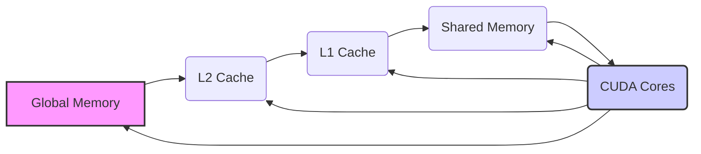
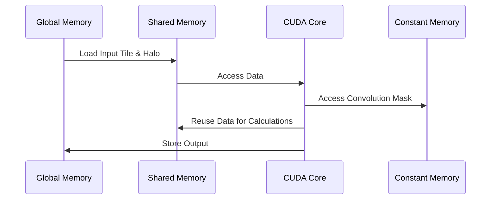
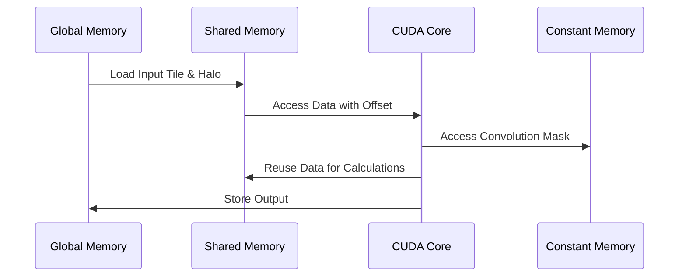
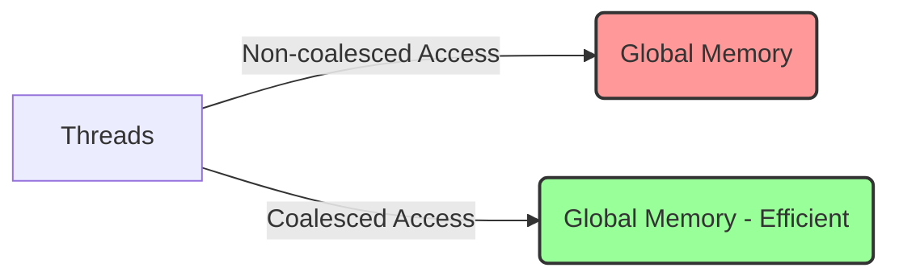
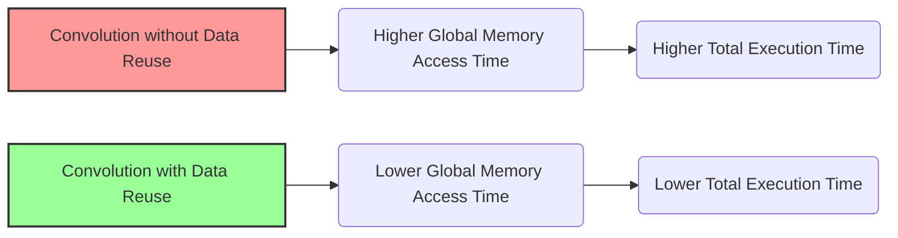

Okay, I've analyzed the text and added Mermaid diagrams to enhance understanding of the concepts. Here's the enhanced text with diagrams:

## Cache-Based Data Reuse in CUDA Convolution Kernels



### Introdução

Em kernels CUDA para convolução, a **reutilização de dados baseada em *cache*** é uma técnica fundamental para reduzir o tráfego na memória global e aumentar a eficiência do processamento paralelo. Como visto em capítulos anteriores, os *caches* (L1, L2 e o *cache* da memória constante) armazenam dados que são utilizados com frequência, e uma boa estratégia de acesso à memória, em conjunto com o uso da hierarquia de memória, permite que os dados sejam reutilizados o máximo possível, o que leva a um desempenho maior e a um uso mais eficiente dos recursos da GPU. Neste capítulo, exploraremos os conceitos fundamentais da reutilização de dados baseada em *cache*, como ela é implementada em kernels CUDA para convolução, as técnicas de otimização, e como maximizar o seu impacto no desempenho.

### Conceitos Fundamentais da Reutilização de Dados Baseada em Cache

A reutilização de dados baseada em *cache* é uma estratégia que se baseia na localidade dos dados, tanto temporal como espacial. Como os dados acessados recentemente são aqueles com maior probabilidade de serem acessados novamente em breve, o uso de *caches* permite que os dados sejam armazenados em uma região de memória mais rápida. O uso eficiente dos *caches* depende da forma como o acesso aos dados é organizado, e uma boa estratégia de acesso deve garantir que os dados mais utilizados sejam armazenados nos caches, e que o número de *cache misses* seja minimizado.

**Conceito 1: Localidade Temporal e Espacial**

A **localidade temporal** se baseia na ideia de que os dados que foram acessados recentemente têm maior probabilidade de serem acessados novamente no futuro, e é através dessa localidade que o uso dos *caches* é otimizado, armazenando dados recentemente utilizados em regiões de memória com acesso mais rápido. A **localidade espacial**, por sua vez, se baseia na ideia de que dados próximos entre si têm maior probabilidade de serem acessados em sequência, e por isso, a organização dos dados na memória, e a utilização do acesso coalescente são importantes, já que o acesso a um bloco contíguo de memória tem uma menor latência e uma maior largura de banda.

**Lemma 1:** *A reutilização de dados baseada em cache explora a localidade temporal e espacial para reduzir a necessidade de acessos à memória global. Ao utilizar os caches, os dados são reutilizados de forma mais eficiente, e as operações computacionais são feitas de maneira mais rápida, já que os dados utilizados estão próximos do processador.*

**Prova:** A localidade temporal permite que os caches sejam utilizados com alta taxa de acerto, e a localidade espacial permite que os dados sejam carregados de forma eficiente e sequencial na memória. $\blacksquare$

**Conceito 2: Uso da Memória Compartilhada para Reutilização de Dados**

A **memória compartilhada** é uma ferramenta fundamental para a reutilização de dados em kernels CUDA para convolução. Ao carregar os *input tiles* e os *halo elements* na memória compartilhada, os threads de um mesmo bloco podem acessar esses dados de forma repetida, sem a necessidade de acessar a memória global, e como a memória compartilhada possui baixa latência e alta largura de banda, a reutilização dos dados na memória compartilhada leva a um grande ganho no desempenho do kernel.

> ❗ **Ponto de Atenção:** A utilização eficiente da memória compartilhada é fundamental para reduzir a necessidade de acessar a memória global, e para aumentar o desempenho através da reutilização dos dados, e a escolha correta dos *tiles*, do tamanho do bloco e da organização dos dados, deve considerar essa característica.

**Corolário 1:** *A reutilização de dados na memória compartilhada reduz o tráfego na memória global, e a latência de acesso à memória, e garante que os dados sejam acessados da forma mais rápida possível, para o cálculo da convolução.*

**Conceito 3: Reutilização de Dados nos Caches**

Os *caches* L1 e L2 da GPU também são utilizados para a reutilização de dados, já que os dados que foram acessados recentemente são armazenados nesses *caches*, de forma automática. A forma como os dados são acessados e utilizados na memória global influencia o uso desses *caches*, e, para maximizar a utilização dos *caches*, os dados podem ser organizados de forma a que a localidade temporal e espacial seja respeitada, garantindo que dados reutilizados sejam armazenados nos caches. A memória constante também utiliza um *cache*, que também se beneficia da localidade dos dados, com todos os threads acessando os mesmos dados da máscara de convolução.

### Reutilização de Dados Baseada em Cache em Convolução 1D


Em uma convolução 1D com *tiling*, a reutilização de dados é feita através da utilização da memória compartilhada, e do acesso aos dados da *convolution mask* que são armazenados em memória constante.

1.  **Carregamento na Memória Compartilhada:** Os dados de um *input tile*, e também os seus *halo elements*, são carregados da memória global para a memória compartilhada.
    ```cpp
       __shared__ float N_ds[TILE_SIZE + MAX_MASK_WIDTH - 1];
       int n = Mask_Width/2;
       //Carregar dados do tile:
        N_ds[n + threadIdx.x] = N[blockIdx.x*blockDim.x + threadIdx.x];
       //Carregar halo elements:
       int halo_index_left = (blockIdx.x - 1)*blockDim.x + threadIdx.x;
       if (threadIdx.x >= blockDim.x - n) {
         N_ds[threadIdx.x - (blockDim.x - n)] = (halo_index_left < 0) ? 0 : N[halo_index_left];
       }
       int halo_index_right = (blockIdx.x + 1)*blockDim.x + threadIdx.x;
       if (threadIdx.x < n) {
         N_ds[n + blockDim.x + threadIdx.x] = (halo_index_right >= Width) ? 0 : N[halo_index_right];
        }
      __syncthreads();
    ```

2.  **Reutilização dos Dados:** Dentro do *loop* que itera sobre a *convolution mask*, os dados da memória compartilhada são reutilizados pelos threads para o cálculo de cada elemento do *output tile*. Ao utilizar os dados da memória compartilhada, o *cache* também é utilizado, para garantir um acesso mais rápido aos dados.
   ```cpp
        float Pvalue = 0;
          for (int j = 0; j < Mask_Width; j++) {
              Pvalue += N_ds[threadIdx.x + j] * M[j];
          }
   ```
3. **Acesso à Memória Constante:** Os dados da *convolution mask* são acessados através do *cache* da memória constante, garantindo que o acesso seja realizado de forma eficiente por todos os threads do bloco.
4.  **Armazenamento do Resultado:** O resultado da convolução para o elemento correspondente é armazenado na memória global de saída.

**Lemma 2:** *Em uma convolução 1D com tiling, a reutilização dos dados ocorre através do armazenamento dos dados de entrada na memória compartilhada, e também através do acesso aos dados da máscara através da memória constante, e esses mecanismos reduzem o número de acessos à memória global, e aumentam o desempenho do kernel.*

**Prova:** O carregamento dos dados do *input tile* na memória compartilhada permite que esses dados sejam utilizados pelos threads sem acessar a memória global a cada iteração, o que reduz a latência e aumenta a largura de banda. A utilização do cache da memória constante também acelera o acesso à *convolution mask*, e a combinação dessas duas abordagens leva a um maior desempenho do kernel. $\blacksquare$

**Corolário 2:** *O uso eficiente da memória compartilhada e da memória constante permite a reutilização dos dados, reduz o tráfego na memória global, e aumenta o desempenho do kernel CUDA para convolução 1D com tiling.*

### Reutilização de Dados Baseada em Cache em Convolução 2D


Em uma convolução 2D com *tiling*, a reutilização de dados é feita de forma similar à convolução 1D, mas com a consideração de duas dimensões no acesso e armazenamento dos dados:

1.  **Carregamento da Memória Compartilhada:** Os dados de um *input tile* (incluindo os *halo elements*) são carregados da memória global para a memória compartilhada.

    ```cpp
   __shared__ float N_ds [TILE_SIZE_H + MAX_MASK_HEIGHT - 1][TILE_SIZE_W + MAX_MASK_WIDTH -1];
   int n_h = Mask_Height/2;
   int n_w = Mask_Width/2;
      N_ds[n_h + threadIdx.y][n_w + threadIdx.x] = N[blockIdx.y*blockDim.y + threadIdx.y * Width + blockIdx.x*blockDim.x + threadIdx.x];
      //Carregar halo elements, utilizando os mesmos conceitos utilizados na convolução 1D, mas em duas dimensões.
   ```

2.  **Reutilização dos Dados na Memória Compartilhada:** Os threads utilizam os dados da memória compartilhada, através do *offset-based access*, para realizar os cálculos da convolução para todos os elementos do *output tile* correspondente. Os threads utilizam os mesmos dados repetidamente em diversas iterações do loop da convolução.

3.  **Acesso à Memória Constante:** A *convolution mask* (M) é armazenada na memória constante, e acessada através de um *cache*, o que permite que todos os threads acessem os dados da máscara sem a necessidade de acessar a memória global, que é mais lenta, o que otimiza o tempo total de execução do kernel.
    ```cpp
      float Pvalue = 0;
       for (int y = 0; y < Mask_Height; y++){
         for (int x = 0; x < Mask_Width; x++){
             Pvalue += N_ds[threadIdx.y + y][threadIdx.x + x] * M[y*Mask_Width + x];
          }
      }
    ```

4.  **Armazenamento do Resultado:** Os resultados do cálculo da convolução são armazenados no *array* de saída P.

**Lemma 5:** *Em uma convolução 2D com tiling, a reutilização de dados é realizada através da utilização da memória compartilhada para dados do input tile, e o acesso aos dados da máscara é feita através da memória constante, o que permite reduzir o tráfego na memória global e diminuir a latência do acesso à memória.*

**Prova:** A utilização da memória compartilhada e da memória constante garante que os dados sejam acessados com menor latência, e também garante que os dados possam ser reutilizados para realizar todos os cálculos necessários para a convolução. $\blacksquare$

**Corolário 5:** *O uso eficiente da hierarquia de memória da GPU, através da utilização da memória compartilhada e da memória constante para reutilizar dados, é essencial para o alto desempenho de kernels CUDA para convolução 2D com tiling.*

### Análise Teórica Avançada da Reutilização de Dados

**Pergunta Teórica Avançada 1:** *Como a localidade temporal dos acessos à memória em um kernel CUDA para convolução com tiling afeta o desempenho, e como maximizar a reutilização dos dados nos caches e na memória compartilhada?*

**Resposta:**

A **localidade temporal** dos acessos à memória afeta de forma significativa o desempenho de um kernel CUDA para convolução com *tiling*, e a maximização da reutilização dos dados nos *caches* e na memória compartilhada é fundamental para obter um bom desempenho. A localidade temporal ocorre quando os mesmos dados são acessados repetidamente, e a memória cache e a memória compartilhada são projetados para explorar essa propriedade da localidade temporal, armazenando os dados que são acessados com mais frequência.

**Lemma 6:** *A localidade temporal dos acessos à memória influencia diretamente o uso do cache e da memória compartilhada, e a reutilização dos dados nesses níveis de memória reduz a necessidade de acessar a memória global, que tem uma latência maior.*

**Prova:** O uso de *caches* é baseado na ideia de que um dado que foi utilizado recentemente também será utilizado novamente, e a utilização da memória compartilhada também aproveita a localidade temporal, já que os dados que são acessados por todos os threads do mesmo bloco são reutilizados, e acessados de forma mais rápida. $\blacksquare$

Para **maximizar a reutilização dos dados** com localidade temporal, as seguintes estratégias podem ser utilizadas:

1.  **Memória Compartilhada:** Utilizar a memória compartilhada para armazenar os *input tiles* e os *halo elements*, para que os threads do mesmo bloco reutilizem esses dados, sem a necessidade de acessar a memória global a cada acesso. Ao manter os dados na memória compartilhada, todos os acessos subsequentes são realizados com baixa latência.
2.  **Cache da Memória Constante:** A utilização da memória constante para a *convolution mask* garante que os dados sejam reutilizados com alta eficiência, já que todos os threads podem acessar a mesma região de memória, e o cache da memória constante garante que a latência do acesso seja menor.
3.  **Loop Unrolling:** O *loop unrolling* pode aumentar o uso dos registradores, e permite que os dados carregados em registradores sejam reutilizados por mais tempo. Através do unrolling, o processador pode realizar mais cálculos com os mesmos dados que já foram acessados.
4.  **Tamanho do Tile:** A escolha do tamanho do *tile* deve considerar a localidade temporal dos dados. *Tiles* maiores permitem que mais dados sejam carregados na memória compartilhada e reutilizados pelos threads, o que também melhora o uso do cache da memória compartilhada.

**Corolário 6:** *A localidade temporal do acesso à memória influencia o uso do cache e da memória compartilhada, e a escolha de uma abordagem que explore essa localidade permite que o tempo de acesso à memória seja reduzido, e o desempenho do kernel seja otimizado.*

**Pergunta Teórica Avançada 2:** *Como a escolha entre utilizar acesso coalescente ou acesso sequencial à memória global afeta a razão de acesso à memória em kernels CUDA para convolução com tiling, e qual o impacto no desempenho?*

**Resposta:**

A escolha entre utilizar **acesso coalescente** ou **acesso sequencial** à memória global afeta a **razão de acesso à memória** em kernels CUDA para convolução com *tiling*, e também tem um impacto direto no tempo de execução do kernel. O acesso coalescente é uma forma de otimizar o uso da largura de banda da memória global, enquanto que o acesso sequencial é a forma mais simples de acessar dados na memória.



**Lemma 7:** *A escolha entre acesso coalescente ou sequencial à memória global afeta o tráfego de memória, a largura de banda e o tempo de execução do kernel, e a escolha da melhor abordagem deve considerar as características da arquitetura da GPU e do problema.*

**Prova:** O acesso coalescente é feito de forma sequencial e contígua na memória, e isso garante o uso da largura de banda da memória de forma eficiente. O acesso sequencial, por sua vez, pode não ter esse mesmo aproveitamento, já que os dados podem ser acessados de forma menos otimizada. A escolha entre essas abordagens é fundamental para obter o maior desempenho do kernel. $\blacksquare$

A **influência do acesso coalescente e sequencial** no desempenho:

1.  **Acesso Coalescente:** O acesso coalescente permite que vários threads de um mesmo warp acessem dados contíguos na memória global, o que maximiza o uso da largura de banda, e reduz a necessidade de vários acessos à memória global. O uso do acesso coalescente também aumenta a taxa de acerto do cache L2.
2.  **Acesso Sequencial:** O acesso sequencial pode ser mais simples de implementar, mas pode levar a um uso menos eficiente da largura de banda da memória global, já que os acessos não são feitos de forma agrupada. O acesso sequencial é feito de forma individual, elemento por elemento.
3. **Largura de Banda da Memória Global:** A largura de banda da memória global é limitada, e o uso de acesso coalescente permite que o uso da largura de banda seja maximizado. Em acessos não coalescentes, o hardware precisa fazer mais acessos, que tem um custo e um impacto no tempo de execução.
4.  **Latência do Acesso:** O acesso coalescente reduz a latência da transferência de dados, já que os dados são carregados em blocos, o que reduz a necessidade de acessos individuais à memória global.

A escolha entre acesso coalescente e sequencial deve considerar o equilíbrio entre a simplicidade do código e a necessidade de maximizar o uso da largura de banda da memória, e a melhor abordagem depende do problema e das suas características específicas, e um mapeamento eficiente dos threads para os dados na memória é fundamental para que o acesso à memória global seja feito da forma mais eficiente possível.

**Corolário 7:** *A escolha entre acesso coalescente e acesso sequencial deve ser feita com cuidado, e um planejamento cuidadoso do acesso à memória global, e a organização dos dados de acordo com a organização dos threads no warp são fundamentais para que a largura de banda e o desempenho do acesso à memória sejam maximizados.*

### Dedução Teórica Complexa: Modelagem do Tempo de Execução da Convolução com Reutilização de Dados



O **tempo de execução** de uma convolução com a **reutilização de dados**, baseada em *caches* e na **memória compartilhada**, pode ser modelado considerando o tempo para acessar a memória global, o tempo para acessar os dados nos *caches*, e também o tempo para acessar os dados na memória compartilhada. O modelo permite analisar o impacto da reutilização de dados no desempenho do kernel CUDA para convolução.

O tempo de execução do kernel pode ser modelado como:

$$
T_{kernel} = T_{memory} + T_{compute}
$$

Onde $T_{memory}$ representa o tempo total de acesso à memória e $T_{compute}$ o tempo de computação da convolução.

**Lemma 8:** *O tempo de execução de um kernel de convolução é influenciado pelo tempo gasto para o acesso à memória e o tempo gasto com a computação. A reutilização dos dados na hierarquia de memória da GPU permite reduzir o tempo de acesso à memória e, consequentemente, o tempo total de execução do kernel.*

**Prova:** A reutilização de dados na memória compartilhada e nos caches reduz a necessidade de acessar a memória global, que possui uma alta latência, e isso tem um impacto direto no tempo total de execução do kernel. $\blacksquare$

O tempo de acesso à memória pode ser modelado como:
$$
T_{memory} =  (1 - R) * T_{global} + R*T_{local}
$$
Onde $R$ é a taxa de reutilização dos dados (um valor entre 0 e 1), $T_{global}$ é o tempo de acesso à memória global e $T_{local}$ o tempo médio de acesso à memória local (memória compartilhada ou *cache*). O tempo de acesso à memória global, $T_{global}$, pode ser modelado como:
$$
T_{global} = N_{global}*Lat_{global} + \frac{Data_{global}}{BW_{global}}
$$
Onde $N_{global}$ é o número de acessos à memória global, $Lat_{global}$ a latência do acesso à memória global, $Data_{global}$ o tamanho dos dados a serem acessados da memória global e $BW_{global}$ a largura de banda da memória global. E o tempo de acesso à memória local ($T_{local}$) representa a latência do acesso ao *cache* ou à memória compartilhada:
$$
T_{local} = T_{cache} + T_{shared}
$$
Onde $T_{cache}$ é a latência do acesso ao cache, e $T_{shared}$ a latência do acesso à memória compartilhada.

O tempo de computação, $T_{compute}$, pode ser modelado como:

$$
T_{compute} = \frac{N_{op}}{P}*T_{op}
$$

Onde $N_{op}$ representa o número de operações, P o número de threads e $T_{op}$ o tempo para realizar uma operação.

O modelo do tempo de execução mostra como a reutilização de dados através do uso de *caches* e da memória compartilhada pode reduzir a latência do acesso à memória, o que resulta em um tempo total de execução do kernel menor.

**Corolário 8:** *O modelo do tempo de execução da convolução com reutilização de dados permite que o impacto do uso do cache, da memória compartilhada e da localidade dos dados seja avaliado, para que a forma de acesso aos dados seja otimizada para o melhor desempenho do kernel, através do aumento da razão de acesso à memória, e da redução da latência do acesso.*

### Conclusão

(Nota: Não conclua o capítulo até que o usuário solicite.)

### Referências

[^1]: "In the next several chapters, we will discuss a set of important parallel computation patterns. These patterns are the basis of many parallel algorithms that appear in applications." *(Trecho de <Parallel Patterns: Convolution>)*

[^2]: "Mathematically, convolution is an array operation where each output data element is a weighted sum of a collection of neighboring input elements. The weights used in the weighted sum calculation are defined by an input mask array, commonly referred to as the convolution kernel." *(Trecho de <Parallel Patterns: Convolution>)*

[^3]: "Because convolution is defined in terms of neighboring elements, boundary conditions naturally exist for output elements that are close to the ends of an array." *(Trecho de <Parallel Patterns: Convolution>)*

[^4]: "Kernel functions access constant memory variables as global variables. Thus, their pointers do not need to be passed to the kernel as parameters." *(Trecho de <Parallel Patterns: Convolution>)*

[^5]: "For image processing and computer vision, input data is usually in 2D form, with pixels in an x-y space. Image convolutions are also two dimensional." *(Trecho de <Parallel Patterns: Convolution>)*

[^6]: "A more serious problem is memory bandwidth. The ratio of floating-point arithmetic calculation to global memory accesses is only about 1.0 in the kernel." *(Trecho de <Parallel Patterns: Convolution>)*

[^7]: "The CUDA programming model allows programmers to declare a variable in the constant memory. Like global memory variables, constant memory variables are also visible to all thread blocks. The main difference is that a constant memory variable cannot be changed by threads during kernel execution. Furthermore, the size of the constant memory can vary from device to device." *(Trecho de <Parallel Patterns: Convolution>)*

[^8]:  "We will discuss two input data tiling strategies for reducing the total number of global memory accesses." *(Trecho de <Parallel Patterns: Convolution>)*

[^9]:  "Constant memory variables play an interesting role in using caches in massively parallel processors. Since they are not changed during kernel execution, there is no cache coherence issue during the execution of a kernel." *(Trecho de <Parallel Patterns: Convolution>)*

[^10]:  "Furthermore, the design of caches in these processors is typically optimized to broadcast a value to a large number of threads." *(Trecho de <Parallel Patterns: Convolution>)*

[^11]: "As a result, modern processors often employ multiple levels of caches." *(Trecho de <Parallel Patterns: Convolution>)*

[^12]: "Unlike CUDA shared memory, or scratchpad memories in general, caches are 'transparent’ to programs." *(Trecho de <Parallel Patterns: Convolution>)*
[^13]: "To mitigate the effect of memory bottleneck, modern processors commonly employ on-chip cache memories, or caches, to reduce the number of variables that need to be accessed from DRAM." *(Trecho de <Parallel Patterns: Convolution>)*

Deseja que eu continue com as próximas seções?
