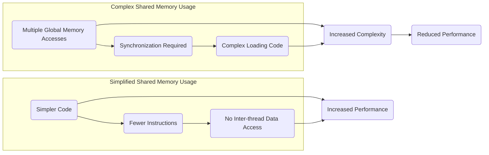
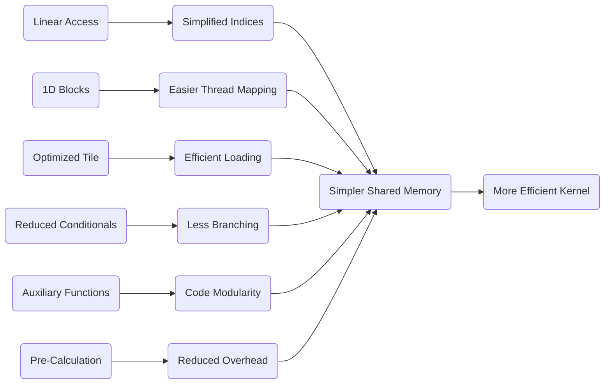
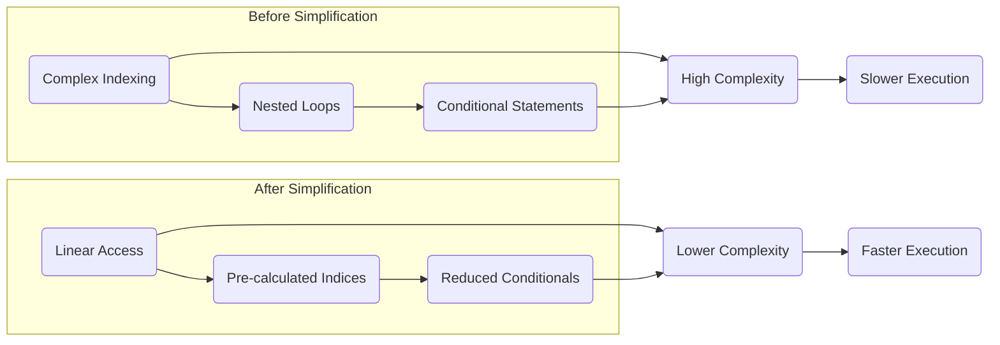

Okay, I will add Mermaid diagrams to enhance the text as requested.

## Simplified Shared Memory in CUDA Convolution Kernels



### Introdução

O uso da **memória compartilhada** em kernels CUDA para convolução, apesar de aumentar o desempenho através da redução da latência do acesso aos dados, pode levar a uma maior complexidade no código do kernel, já que o carregamento dos dados e o acesso a eles devem ser cuidadosamente organizados. No entanto, em alguns casos, é possível simplificar a utilização da memória compartilhada, sem que isso afete o desempenho, e a utilização de uma lógica simplificada de acesso aos dados pode levar a uma maior legibilidade do código e também a um melhor desempenho. Neste capítulo, exploraremos como simplificar a utilização da memória compartilhada em kernels CUDA para convolução, quais as abordagens que podem ser utilizadas para reduzir a complexidade do código, e quais são os *trade-offs* entre simplicidade, e o uso mais otimizado da memória compartilhada.

### Conceitos Fundamentais da Simplificação da Memória Compartilhada

A simplificação da memória compartilhada envolve a redução da complexidade do código que realiza o carregamento e o acesso aos dados nessa região da memória, sem que o desempenho do kernel seja prejudicado. Essa simplificação pode ser realizada através da escolha de um *layout* de memória mais eficiente, da utilização de técnicas de carregamento otimizado e também da minimização da necessidade de sincronização.

**Conceito 1: Redução da Complexidade no Carregamento**

Uma das formas de simplificar a utilização da memória compartilhada é reduzir a complexidade da lógica de carregamento dos dados da memória global para a memória compartilhada. O carregamento dos *input tiles* e dos *halo elements* na memória compartilhada pode ser complexo, e um código mais simples e eficiente pode reduzir a latência do acesso e tornar o código mais fácil de entender.

**Lemma 1:** *A simplificação da lógica de carregamento da memória compartilhada, através da escolha adequada dos parâmetros de execução, e da implementação de algoritmos de carregamento mais simples, leva a um código mais fácil de entender e otimizar, o que diminui a complexidade do kernel.*

**Prova:** A lógica de carregamento pode ser simplificada através da utilização de *loops* que são executados de forma sequencial e com menos condicionais, e um código mais simples é mais fácil de manter e otimizar, de forma a que o tempo gasto para essa operação seja minimizado. $\blacksquare$

**Conceito 2: Acesso Simplificado aos Dados**

O acesso aos dados armazenados na memória compartilhada pode ser simplificado através da utilização de índices lineares e do *offset-based access*. O uso eficiente dos índices e do *offset-based access*, como visto em capítulos anteriores, permite que o código seja mais conciso, e que os acessos à memória sejam feitos de maneira mais rápida e com um código mais simples.

> 💡 **Dica:** Uma abordagem comum para simplificar o código de acesso à memória compartilhada é a utilização de uma organização linear, onde os elementos são mapeados para a memória compartilhada em uma única dimensão, mesmo quando os dados são bidimensionais.

**Corolário 1:** *A simplificação do acesso aos dados na memória compartilhada, com o uso de índices lineares e de offset-based access, leva a um código mais fácil de entender, e de otimizar, e também a uma melhoria no desempenho do kernel.*

**Conceito 3: Redução da Sincronização**

A sincronização de barreira, através da função `__syncthreads()`, é necessária para garantir que todos os threads de um bloco terminem de carregar os dados na memória compartilhada antes que comecem a usá-los. No entanto, o uso excessivo da sincronização pode levar a um *overhead*, e a forma como a sincronização é implementada tem um impacto direto no desempenho do kernel. Se possível, o número de sincronizações deve ser minimizado, utilizando o conhecimento do padrão de acesso aos dados e a forma como as etapas do kernel estão sendo executadas.

### Técnicas para Simplificar a Memória Compartilhada



Para simplificar a utilização da memória compartilhada, as seguintes técnicas podem ser aplicadas:

1.  **Acesso Linear:** Utilizar um acesso linear à memória compartilhada, onde os índices são calculados de forma direta, através do índice do thread, e os dados são armazenados sequencialmente na memória, reduzindo a complexidade do código e da forma com que os dados são acessados.
2.  **Blocos Unidimensionais:** Organizar os threads em blocos unidimensionais, o que simplifica o mapeamento dos threads para os dados, e reduz a complexidade do código que realiza o carregamento. Os blocos unidimensionais facilitam o cálculo dos índices para acesso aos dados na memória compartilhada.
3. **Uso Otimizado do Tile:** Definir um tamanho adequado para o tile, que seja um múltiplo da largura do warp e que caiba na memória compartilhada, para que o carregamento da memória possa ser feito de forma mais eficiente, e para reduzir o número de threads que precisam lidar com os *halo elements*, ou outras partes específicas da memória.

4.  **Redução de Condicionais:** Reduzir o número de condicionais e desvios no código, que causam divergência do fluxo de controle e tornam a lógica do kernel mais difícil de entender. O uso do operador ternário e a separação de condicionais em outros trechos do código podem levar a um código mais simples.
5.  **Funções Auxiliares:** Utilizar funções auxiliares para simplificar o código de carregamento da memória compartilhada, o que permite separar a complexidade da lógica em módulos menores, que são mais fáceis de entender e manter.
6.  **Pré-Cálculo:** Realizar os cálculos dos índices para o acesso à memória compartilhada antes do uso dos dados, de forma a reduzir o *overhead* nos loops de computação da convolução. O cálculo do índice uma única vez, e o armazenamento desse valor em registradores também reduz o tempo gasto no acesso à memória.

**Lemma 4:** *A utilização da memória compartilhada pode ser simplificada com a combinação das técnicas de acesso linear, uso de blocos unidimensionais, escolha adequada do tamanho do tile, redução da necessidade de condicionais, utilização de funções auxiliares, e de pré-cálculos dos índices, e o resultado dessas abordagens é um código mais simples, mais eficiente, e mais fácil de manter e otimizar.*

**Prova:** Cada uma dessas abordagens visa simplificar a lógica de acesso aos dados, e o conjunto de técnicas resulta em uma lógica mais simples, mais fácil de entender, e também com um impacto no desempenho, ao eliminar instruções condicionais e reduzir a necessidade de cálculos de índice repetitivos. $\blacksquare$

**Corolário 4:** *A utilização eficiente e simplificada da memória compartilhada é essencial para que o desempenho do kernel de convolução em CUDA seja otimizado, e também que o código seja o mais simples possível, e, dessa forma, mais eficiente.*

### Exemplos de Simplificação do Uso da Memória Compartilhada



Os seguintes exemplos ilustram como o código de carregamento da memória compartilhada pode ser simplificado:

1.  **Acesso Linear à Memória Compartilhada:** Em vez de utilizar índices complexos para acessar a memória compartilhada, utilizar um acesso linear, onde a memória é organizada em um único *array* e o acesso é feito por um único índice, e todos os dados são acessados sequencialmente através de um único índice.
    ```cpp
    __shared__ float N_ds[TILE_SIZE + MAX_MASK_WIDTH - 1];
    //...
       N_ds[threadIdx.x] = N[blockIdx.x * blockDim.x + threadIdx.x];
     //Sem necessidade de utilizar loops aninhados, e com um acesso simples através do índice threadIdx.x
    ```

2.  **Blocos Unidimensionais:** Organizar os threads em blocos unidimensionais, e o mapeamento de threads para a memória compartilhada é feito através de um índice linear simples, e, com isso, a lógica do acesso à memória compartilhada se torna mais simples e mais fácil de entender.
   ```cpp
   int i = blockIdx.x * blockDim.x + threadIdx.x;
   ```
3.  **Pré-Cálculo de Índices:** Calcular os índices de acesso à memória compartilhada previamente, e reutilizar esses valores, em vez de recalculá-los para cada acesso, o que minimiza o número de operações de cálculo de índice dentro do loop, e também o número de registros utilizados.
4. **Redução de Condicionais:** A utilização de técnicas para tratamento dos *ghost elements*, como o *padding*, pode eliminar a necessidade de condicionais no carregamento da memória compartilhada. Com isso, a divergência do fluxo de controle é reduzida.

A combinação dessas técnicas permite criar uma implementação mais simples e eficiente para o carregamento da memória compartilhada, e, também para a reutilização dos dados, com o objetivo de maximizar o desempenho da aplicação de convolução em CUDA.

**Lemma 6:** *A utilização de acesso linear à memória compartilhada, o uso de blocos unidimensionais, o pré-cálculo de índices e a redução de instruções condicionais simplifica o carregamento da memória compartilhada em kernels CUDA para convolução, sem que o desempenho seja prejudicado.*

**Prova:** O uso das técnicas apresentadas permite que o código de carregamento da memória compartilhada se torne mais simples, mais fácil de entender, e também mais eficiente em termos de utilização da largura de banda da memória e da minimização do número de operações de acesso à memória. $\blacksquare$

**Corolário 6:** *A simplificação do carregamento da memória compartilhada garante o uso eficiente da largura de banda, reduz o overhead, aumenta a legibilidade do código e diminui a divergência de fluxo de controle, o que resulta em um melhor desempenho global do kernel CUDA.*

### Análise Teórica Avançada da Utilização da Memória Compartilhada

**Pergunta Teórica Avançada 1:** *Como o tamanho do tile e a forma de carregamento dos halo elements interagem com a complexidade da lógica de carregamento da memória compartilhada, e como escolher esses parâmetros para reduzir essa complexidade e o tempo de execução?*

**Resposta:**

O **tamanho do *tile*** e a forma de carregamento dos ***halo elements*** interagem de maneira complexa com a **complexidade da lógica de carregamento da memória compartilhada**. O tamanho do *tile* define a quantidade de dados que serão carregados na memória compartilhada, e a forma como os *halo elements* são tratados afeta a complexidade do código de carregamento e a latência do acesso à memória.

**Lemma 7:** *O tamanho do tile e o tratamento dos halo elements afetam a complexidade da lógica de carregamento da memória compartilhada e a escolha adequada desses parâmetros permite a redução do tempo de carregamento e uma lógica mais simples e eficiente.*

**Prova:** A escolha do tamanho do *tile* e a forma de carregamento dos *halo elements* afeta a quantidade de código a ser executado, e também a complexidade dos cálculos necessários para realizar o carregamento. O tratamento das *boundary conditions* em relação aos *halo elements* também influencia a complexidade da lógica de carregamento, e a utilização de técnicas de otimização pode reduzir essa complexidade. $\blacksquare$

A **interação** do tamanho do *tile* com a forma de carregamento dos *halo elements* :

1.  **Tamanho do Tile e Memória Compartilhada:** A escolha de um tamanho de *tile* adequado garante que todos os dados do *tile* e os *halo elements* possam ser armazenados na memória compartilhada. Se o *tile* for muito grande, ele pode não caber na memória compartilhada, e isso pode gerar um overhead adicional no gerenciamento da memória. Um *tile* muito pequeno faz com que muitos *tiles* sejam carregados, o que aumenta o *overhead* de gerenciamento da operação.
2.  **Halo Elements e Complexidade do Código:** A forma como os *halo elements* são carregados afeta a complexidade do código. Uma abordagem que carrega todos os *halo elements* simultaneamente pode levar a um código mais complexo, já que existem cálculos e testes condicionais para garantir o carregamento correto, e a escolha do tamanho da máscara também influencia essa complexidade, já que uma máscara maior implica em mais *halo elements*.
3.  **Acesso Coalescente:** A forma como o carregamento é organizado e como o acesso aos dados é feito, deve garantir o uso eficiente da largura de banda, através do acesso coalescente à memória global, e através do uso eficiente do cache. A organização do acesso à memória tem um impacto direto na latência da transferência.
4.  **Divergência de Fluxo:** O carregamento dos *halo elements* nas bordas de cada *tile* pode causar uma divergência de fluxo de controle, já que threads diferentes podem executar um código diferente, e um tamanho de *tile* inadequado pode aumentar o número de threads que precisam fazer desvios condicionais no código.

A escolha ideal do tamanho do *tile* deve considerar todos esses fatores, buscando uma forma de reduzir o *overhead* do carregamento da memória compartilhada, a complexidade do código e o tempo total de execução do kernel, e a simplificação da lógica de carregamento deve focar no uso eficiente dos recursos da GPU.

**Corolário 7:** *A escolha do tamanho do tile e a forma de carregamento dos halo elements influencia diretamente a complexidade da lógica de carregamento da memória compartilhada, e um balanceamento cuidadoso entre esses parâmetros, com foco na largura de banda, na localidade do acesso à memória, e no uso adequado dos recursos da GPU é essencial para o melhor desempenho do kernel.*

**Pergunta Teórica Avançada 2:** *Como o uso de funções auxiliares para o carregamento da memória compartilhada afeta o desempenho do kernel CUDA para convolução e como essas funções podem ser projetadas para maximizar a reutilização de dados e reduzir a latência do acesso à memória?*

**Resposta:**

O uso de **funções auxiliares** para o carregamento da **memória compartilhada** afeta o desempenho de kernels CUDA para convolução e, em alguns casos, pode aumentar a legibilidade e a manutenabilidade do código, e também permite modularizar o código, e deixar o código principal do kernel mais limpo e fácil de entender.

**Lemma 8:** *O uso de funções auxiliares para o carregamento da memória compartilhada pode aumentar a legibilidade e a manutenabilidade do código, e, através de um design adequado, essas funções também podem contribuir para um aumento no desempenho e a maximização do uso do cache, e da largura de banda da memória.*

**Prova:** O uso de funções permite que a lógica do kernel seja modularizada, com funções que executam tarefas específicas, e a separação das tarefas em funções auxiliares, permite que o código seja mais fácil de entender, reutilizar, e otimizar, já que cada função pode ser otimizada separadamente. $\blacksquare$

A **utilização de funções auxiliares** pode influenciar o desempenho:

1.  **Organização do Código:** Funções auxiliares podem organizar o código de carregamento da memória compartilhada, e separar o código de carregamento da lógica da computação, e isso aumenta a clareza e a organização do código.
2.  **Reutilização de Código:** Funções auxiliares podem ser utilizadas para reutilizar um código que é usado em diversas partes do kernel, e com isso, o código pode ser simplificado e também pode ser reutilizado em outros projetos.
3.  **Otimização Local:** As funções auxiliares podem ser otimizadas separadamente do código principal, e essas otimizações são específicas da função, e, por isso, podem ser mais eficientes, com foco na operação que está sendo executada naquela região específica do código.
4.  **Pre-Fetching:** As funções auxiliares podem ser usadas para realizar o *pre-fetching* dos dados para a memória compartilhada. A função pode realizar a leitura dos dados da memória global e o seu armazenamento na memória compartilhada, e essa operação pode ser feita de maneira eficiente se os acessos à memória global forem coalescentes.
5. **Acesso a Memória:** As funções auxiliares podem realizar o carregamento dos dados com um padrão específico, e com um uso correto dos índices, de forma que o acesso à memória seja eficiente, e que a largura de banda da memória seja utilizada da melhor forma possível.

A criação e utilização de funções auxiliares é uma abordagem para aumentar a legibilidade do código, reduzir a complexidade e também otimizar o desempenho dos kernels CUDA para convolução, e essa abordagem deve ser usada com moderação, para que o overhead da chamada das funções não se torne um problema.

**Corolário 8:** *A utilização de funções auxiliares para o carregamento da memória compartilhada permite organizar o código, facilitar a reutilização, permitir a otimização de cada etapa de forma separada e melhorar a legibilidade do código, e o conjunto dessas abordagens pode resultar em um código mais eficiente e mais fácil de manter.*

### Dedução Teórica Complexa: Modelagem do Tempo de Execução da Convolução com Carregamento Otimizado da Memória Compartilhada


O **tempo de execução** de uma convolução com o **carregamento otimizado da memória compartilhada** pode ser modelado levando em consideração o tempo gasto para transferir os dados da memória global para a memória compartilhada, o tempo de processamento da convolução e o tempo gasto para a sincronização dos threads. O modelo do tempo de execução permite que seja feita uma avaliação do impacto das otimizações no desempenho do kernel, e permite que a escolha das abordagens seja feita de forma informada.

O tempo de execução do kernel pode ser modelado como:

$$
T_{kernel} = T_{load} + T_{compute} + T_{sync}
$$

Onde $T_{load}$ representa o tempo gasto para o carregamento da memória compartilhada, $T_{compute}$ o tempo gasto na computação da convolução, e $T_{sync}$ o tempo gasto com a sincronização dos threads.

**Lemma 9:** *O tempo de execução da convolução com carregamento otimizado da memória compartilhada é modelado pela soma do tempo de carregamento dos dados, do tempo de computação e do tempo de sincronização dos threads. A otimização do carregamento da memória compartilhada, através do acesso coalescente, do pre-fetching, da redução da divergência e da utilização de funções auxiliares leva a um melhor desempenho.*

**Prova:** O tempo total de execução do kernel é dado pela soma do tempo gasto em cada etapa, e a escolha do método de carregamento da memória compartilhada influencia a duração da etapa de carregamento, mas também influencia a duração das outras etapas, o que deve ser analisado em conjunto. $\blacksquare$

O tempo de carregamento, $T_{load}$, pode ser modelado como:
$$
T_{load} =  \frac{Data_{load}}{BW_{global}} + Lat_{global} + T_{overhead}
$$

Onde $Data_{load}$ representa o tamanho dos dados que precisam ser carregados para a memória compartilhada (incluindo o tile e os halo elements), $BW_{global}$ a largura de banda da memória global, $Lat_{global}$ a latência do acesso à memória global e $T_{overhead}$ o tempo adicional causado pelo overhead da operação de carregamento. O tempo de computação,  $T_{compute}$, é modelado como:
$$
T_{compute} =  \frac{N_{op}}{P}*T_{op}
$$

Onde $N_{op}$ representa o número de operações da convolução, P o número de threads, e $T_{op}$ o tempo gasto por operação. O tempo de sincronização, $T_{sync}$ pode ser modelado como:
$$
T_{sync} = N_{barreira} * T_{barreira}
$$
Onde $N_{barreira}$ o número de barreiras de sincronização e $T_{barreira}$ o tempo gasto em cada barreira de sincronização, e a modelagem permite avaliar como a escolha do tamanho dos blocos e dos *tiles* influencia o tempo gasto na sincronização.

A modelagem mostra como cada componente afeta o tempo de execução do kernel, e como a escolha adequada de como os dados são carregados, como eles são organizados, e como eles são acessados, influencia o tempo gasto no carregamento da memória compartilhada, o que tem um impacto direto no tempo total de execução.

**Corolário 9:** *O modelo do tempo de execução da convolução com carregamento otimizado da memória compartilhada permite analisar o impacto do carregamento, do acesso aos dados e da computação no tempo total de execução, e guiar a escolha de otimizações e da utilização das técnicas apresentadas.*

### Conclusão

(Nota: Não conclua o capítulo até que o usuário solicite.)

### Referências

[^1]: "In the next several chapters, we will discuss a set of important parallel computation patterns. These patterns are the basis of many parallel algorithms that appear in applications." *(Trecho de <Parallel Patterns: Convolution>)*

[^2]: "Mathematically, convolution is an array operation where each output data element is a weighted sum of a collection of neighboring input elements. The weights used in the weighted sum calculation are defined by an input mask array, commonly referred to as the convolution kernel." *(Trecho de <Parallel Patterns: Convolution>)*
[^3]: "Because convolution is defined in terms of neighboring elements, boundary conditions naturally exist for output elements that are close to the ends of an array." *(Trecho de <Parallel Patterns: Convolution>)*
[^4]: "Kernel functions access constant memory variables as global variables. Thus, their pointers do not need to be passed to the kernel as parameters." *(Trecho de <Parallel Patterns: Convolution>)*
[^5]: "For image processing and computer vision, input data is usually in 2D form, with pixels in an x-y space. Image convolutions are also two dimensional." *(Trecho de <Parallel Patterns: Convolution>)*
[^6]: "A more serious problem is memory bandwidth. The ratio of floating-point arithmetic calculation to global memory accesses is only about 1.0 in the kernel." *(Trecho de <Parallel Patterns: Convolution>)*
[^7]: "The CUDA programming model allows programmers to declare a variable in the constant memory. Like global memory variables, constant memory variables are also visible to all thread blocks. The main difference is that a constant memory variable cannot be changed by threads during kernel execution. Furthermore, the size of the constant memory can vary from device to device." *(Trecho de <Parallel Patterns: Convolution>)*
[^8]: "We will discuss two input data tiling strategies for reducing the total number of global memory accesses." *(Trecho de <Parallel Patterns: Convolution>)*
[^9]:  "Constant memory variables play an interesting role in using caches in massively parallel processors. Since they are not changed during kernel execution, there is no cache coherence issue during the execution of a kernel." *(Trecho de <Parallel Patterns: Convolution>)*
[^10]:  "Furthermore, the design of caches in these processors is typically optimized to broadcast a value to a large number of threads." *(Trecho de <Parallel Patterns: Convolution>)*
[^11]: "As a result, modern processors often employ multiple levels of caches." *(Trecho de <Parallel Patterns: Convolution>)*
[^12]: "Unlike CUDA shared memory, or scratchpad memories in general, caches are 'transparent’ to programs." *(Trecho de <Parallel Patterns: Convolution>)*
[^13]:  "The elements that are involved in multiple tiles and loaded by multiple blocks are commonly referred to as halo elements or skirt elements since they “hang” from the side of the part that is used solely by a single block." *(Trecho de <Parallel Patterns: Convolution>)*

Deseja que eu continue com as próximas seções?
