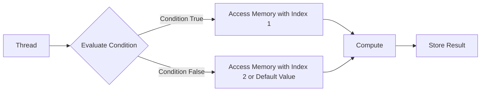
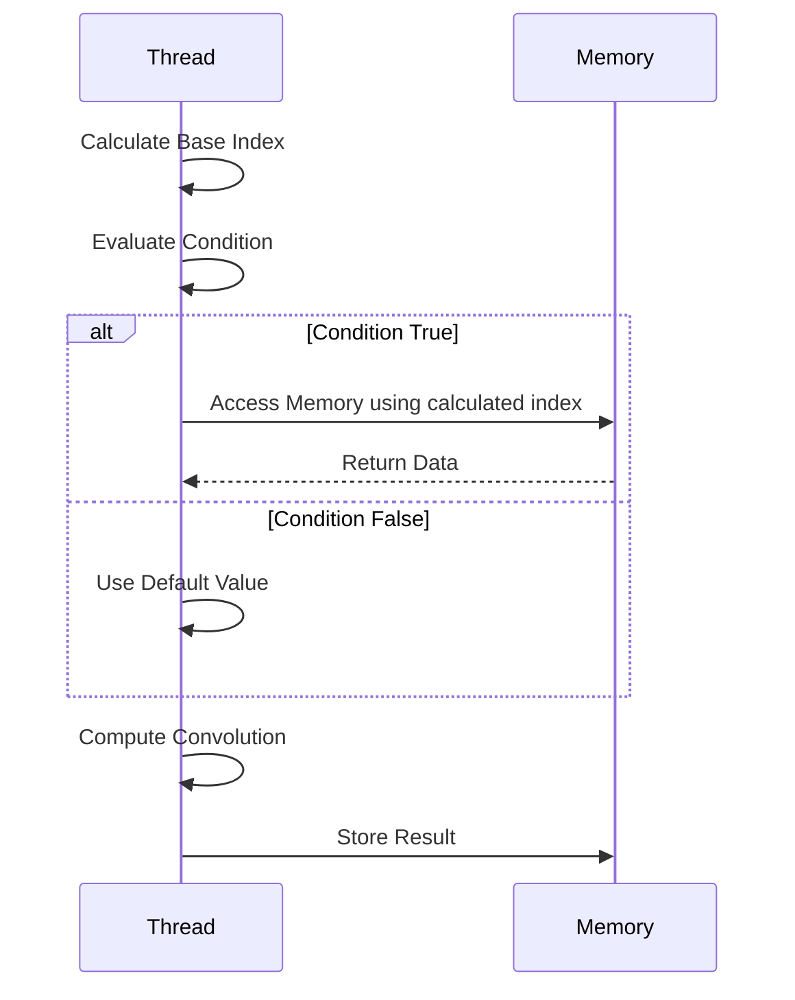
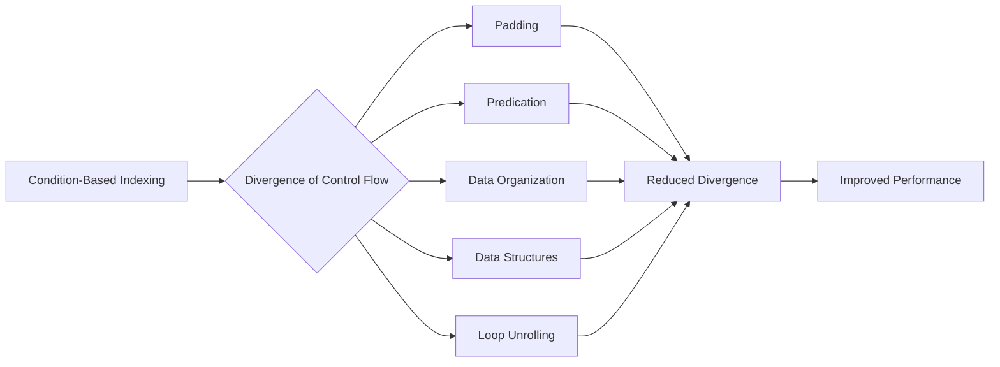
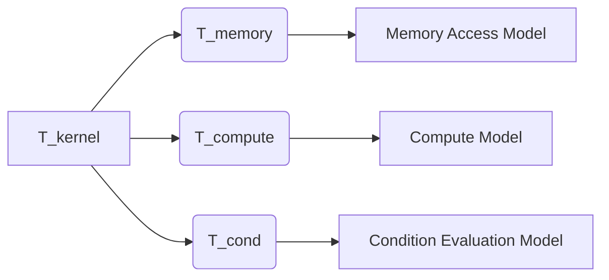

Okay, I will add Mermaid diagrams to enhance the text, following your guidelines.

## Condition-Based Indexing in CUDA Convolution Kernels



### Introdução

Em kernels CUDA para convolução, especialmente aqueles que utilizam *tiling* e abordagens mais complexas de acesso à memória, as **instruções condicionais** são frequentemente utilizadas para determinar os índices de acesso à memória. A forma como essas instruções condicionais são utilizadas pode afetar significativamente o desempenho do kernel, principalmente devido à possibilidade de **divergência de fluxo de controle**, como visto em capítulos anteriores. A divergência de fluxo de controle ocorre quando diferentes threads de um mesmo *warp* seguem caminhos de execução diferentes devido a uma condição, o que causa uma redução da eficiência do processamento paralelo. Neste capítulo, exploraremos o uso de ***condition-based indexing*** (indexação baseada em condição) em kernels CUDA para convolução, como ele afeta o desempenho do kernel e como minimizar a divergência de fluxo de controle, e otimizar o acesso à memória.

### Conceitos Fundamentais da Indexação Baseada em Condição

A indexação baseada em condição envolve o uso de instruções condicionais para determinar como um thread vai acessar a memória. Em vez de utilizar um índice fixo para o acesso à memória, o índice é calculado com base em uma condição, que é avaliada em tempo de execução. O uso de instruções condicionais para o cálculo dos índices pode ser necessário em diversas situações, mas a sua utilização deve ser feita com cuidado, e quando necessário, para que o desempenho do kernel não seja comprometido, através da redução da divergência do fluxo de controle e da otimização do acesso à memória.

**Conceito 1: Avaliação Condicional dos Índices**

O uso de **instruções condicionais**, como o `if` ou o operador ternário, para calcular o índice de acesso à memória, faz com que diferentes threads acessem diferentes posições de memória, dependendo do resultado da avaliação de uma dada condição, que é realizada em tempo de execução do código.

**Lemma 1:** *A indexação baseada em condição utiliza instruções condicionais (como if/else ou operadores ternários) para calcular os índices de acesso à memória, e isso permite que diferentes threads acessem posições de memória diferentes, com base em uma avaliação feita em tempo de execução.*

**Prova:** O uso de condicionais permite que os índices sejam calculados de maneira diferenciada, de acordo com a necessidade de cada thread ou de cada etapa da execução do kernel. $\blacksquare$

**Conceito 2: Impacto na Divergência do Fluxo de Controle**

A utilização de instruções condicionais para o cálculo dos índices, mesmo que para tratar as *boundary conditions*, pode levar à **divergência de fluxo de controle**, que ocorre quando threads de um mesmo *warp* executam diferentes instruções devido aos desvios condicionais. A divergência de fluxo de controle reduz o desempenho, já que todos os threads do *warp* precisam executar todas as instruções, mesmo que elas não sejam necessárias para todos os threads, e, por isso, esse fator deve ser considerado no projeto do kernel.

> ❗ **Ponto de Atenção:** O uso de condicionais para o acesso à memória é uma das principais fontes de divergência de fluxo de controle em kernels CUDA, e estratégias para minimizar o impacto dessa divergência devem ser aplicadas.

**Corolário 1:** *A indexação baseada em condição, através do uso de condicionais, pode levar à divergência do fluxo de controle, o que é indesejável em GPUs e outras arquiteturas paralelas, e a redução da divergência de fluxo é uma importante meta no desenvolvimento de kernels CUDA para convolução.*

**Conceito 3: Utilização do Condition-Based Indexing em Convolução**

Em kernels CUDA para convolução, a indexação baseada em condição é frequentemente utilizada para:

1.  **Tratamento dos Ghost Elements:** Determinar se um acesso à memória global está dentro ou fora dos limites do *array* de entrada, e, de acordo com esse resultado, escolher se o acesso deve ser feito à memória global ou se um valor padrão (geralmente 0) deve ser utilizado no cálculo da convolução.
2.  **Carregamento da Memória Compartilhada:** Determinar quais threads precisam carregar dados específicos para a memória compartilhada, utilizando condicionais para que apenas alguns threads realizem essa operação.
3.  **Cálculo dos Índices dos Halo Elements:** Calcular os índices dos *halo elements* nas bordas dos *tiles*. Esses cálculos também utilizam condicionais, para garantir que apenas os threads responsáveis pelos *halo elements* realizem o cálculo dos seus índices.

### Lógica de Acesso à Memória com Condition-Based Indexing



A lógica de acesso à memória com *condition-based indexing* envolve o uso de condicionais para calcular os índices de acesso à memória. Um exemplo comum é o tratamento dos *ghost elements* em kernels CUDA para convolução:

1.  **Cálculo do Índice Base:** O índice base é calculado utilizando o índice do thread, o índice do bloco e o tamanho do *tile*.
    ```cpp
    int i = blockIdx.x * blockDim.x + threadIdx.x;
    int N_start_point = i - (Mask_Width/2);
    ```
2.  **Avaliação da Condição:** O código avalia se o acesso ao elemento do *array* de entrada está dentro dos limites válidos, utilizando um condicional:
    ```cpp
       if (N_start_point + j >= 0 && N_start_point + j < Width){
          //Acessar a memória
       } else {
          //Não acessar a memória e usar um valor padrão
      }
    ```
3.  **Acesso à Memória ou Valor Padrão:** Se a condição for verdadeira, a memória global é acessada, caso contrário, um valor padrão (como zero) é utilizado, evitando o acesso à memória.
4.  **Armazenamento do Resultado:** O resultado da convolução, que pode ser influenciado ou não pelo valor padrão, é armazenado na memória.

Este processo garante que a convolução seja realizada corretamente nas bordas do *array*, mas o uso de condicionais introduz divergência do fluxo de controle, e esse problema deve ser minimizado para que o desempenho do kernel seja otimizado.

**Lemma 2:** *O acesso à memória com condition-based indexing envolve a avaliação de uma condição, o cálculo dos índices e o acesso à memória (ou a utilização de um valor padrão) com base no resultado da condição, e o uso de condicionais garante o correto cálculo da convolução, inclusive nas regiões de borda.*

**Prova:** As instruções condicionais permitem a escolha do índice correto para o acesso à memória, ou a escolha de um valor padrão, e o acesso será diferente dependendo do resultado dessa avaliação. $\blacksquare$

**Corolário 2:** *A utilização de instruções condicionais para o acesso à memória garante a flexibilidade do kernel, e também permite que as boundary conditions sejam tratadas de maneira adequada, através do uso de valores default para elementos que estão fora dos limites do array.*

### Minimizando a Divergência de Fluxo de Controle



A divergência de fluxo de controle causada pelo uso de instruções condicionais para o cálculo dos índices pode ser minimizada através de diversas estratégias:

1.  **Padding:** O *padding* do *array* de entrada com *ghost elements* de acordo com o tamanho da *convolution mask* permite eliminar a necessidade de instruções condicionais para lidar com as *boundary conditions*, o que leva à eliminação da divergência de fluxo nesses casos. Ao utilizar o *padding* adequadamente, o acesso à memória torna-se uniforme e não necessita de condicionais para tratar os elementos fora dos limites da entrada.
2.  **Predicação:** A utilização de instruções de hardware que implementam a **predicação**, permite pular a execução de algumas instruções se uma determinada condição não for satisfeita. Isso faz com que todos os threads sigam o mesmo fluxo, mas alguns simplesmente não executam algumas operações, de acordo com o resultado da condição. A predicação é uma forma mais eficiente de lidar com as condicionais, em comparação com os desvios do fluxo.
3. **Organização de Dados:** O acesso à memória deve ser feito de maneira organizada, para garantir que o acesso ocorra de forma coalescente e que a quantidade de desvios causados pelas condicionais seja o menor possível. A organização da memória, do *tile*, e do mapeamento dos threads deve ser tal que os threads sigam caminhos semelhantes na execução do kernel.
4. **Estruturas de Dados:** Utilizar estruturas de dados que permitam a utilização de acessos diretos à memória compartilhada, sem a necessidade de condicionais para o acesso aos elementos. A utilização de uma estrutura que permita um acesso linear aos dados na memória compartilhada pode simplificar o código, e eliminar a necessidade do uso de condicionais para acessar esses dados.
5.  **Loop Unrolling:** O *loop unrolling*, que desenrola algumas das iterações do *loop*, pode reduzir a divergência de fluxo de controle e também o overhead da iteração, através da redução do número de desvios e condicionais no código, e a forma como o *unrolling* é feito pode ser utilizada para otimizar a lógica de acesso aos dados.

**Lemma 3:** *A divergência de fluxo de controle causada por instruções condicionais pode ser minimizada através do uso de padding, predição, acesso coalescente, organização dos dados e loop unrolling, e a escolha adequada de cada estratégia permite que o desempenho do kernel seja maximizado.*

**Prova:** Cada uma das estratégias visa reduzir a quantidade de desvios condicionais ou a necessidade de acessar dados fora dos limites. A redução das condicionais e a organização do acesso à memória garante um menor impacto da divergência do fluxo de controle no desempenho do kernel. $\blacksquare$

**Corolário 3:** *A escolha da técnica para lidar com a divergência de fluxo de controle, deve levar em consideração o impacto de cada abordagem no desempenho do kernel, e deve buscar o melhor compromisso entre o uso da memória e a utilização eficiente dos recursos de hardware.*

### Análise Teórica Avançada da Indexação Baseada em Condição

**Pergunta Teórica Avançada 1:** *Como a complexidade da condição avaliada em instruções condicionais (if/else) para o cálculo dos índices de acesso à memória afeta o desempenho do kernel CUDA para convolução e como simplificar a lógica das condicionais para reduzir o overhead?*

**Resposta:**

A **complexidade da condição avaliada** nas instruções condicionais (`if/else`) utilizadas para o cálculo dos índices de acesso à memória afeta o desempenho do kernel CUDA para convolução. Quanto mais complexa for a condição, mais tempo o processador gastará para avaliá-la, e o número de instruções que serão necessárias para sua avaliação também será maior.

**Lemma 7:** *A complexidade da condição utilizada em condicionais para a indexação e o tratamento dos ghost elements afeta o tempo necessário para a avaliação da condição e também o número de instruções necessárias para realizá-la, e a complexidade da condicional deve ser minimizada sempre que possível.*

**Prova:** Uma condição muito complexa exige um número maior de operações aritméticas e lógicas, o que leva a um tempo de processamento maior. Um grande número de operações na condição pode levar a um tempo de espera que se torna um gargalo, e, portanto, a simplificação das condicionais é uma importante estratégia de otimização. $\blacksquare$

A **complexidade da condição** afeta o desempenho:

1.  **Tempo de Avaliação:** Condições complexas, que utilizam muitas operações lógicas e aritméticas, levam mais tempo para serem avaliadas, e esse tempo de avaliação se torna parte do tempo total de execução.
2.  **Uso de Registradores:** Condições complexas podem exigir mais registradores para o armazenamento de valores intermediários. Se uma quantidade excessiva de registradores for utilizada, o número de threads por SM pode ser reduzido, diminuindo a utilização da GPU.
3.  **Divergência de Fluxo:** Condições mais complexas aumentam a probabilidade de divergência do fluxo de controle, já que threads diferentes podem seguir caminhos de execução diferentes, de acordo com as condicionais.

A simplificação da condição pode ser feita através de técnicas como:

1.  **Pré-Cálculo:** Realizar o pré-cálculo de algumas partes da condição, para que a avaliação seja mais simples.
2.  **Operadores Ternários:** Utilizar operadores ternários em vez de instruções `if-else` completas, pois os operadores ternários podem ser avaliados de forma mais eficiente pelo compilador, e podem reduzir o número de instruções.
3.  **Funções Auxiliares:** Utilizar funções auxiliares para encapsular a lógica mais complexa da condição, o que permite que a condição principal seja mais simples e mais fácil de entender.
4. **Valores Booleanos:** Reduzir ao máximo a utilização de valores booleanos na avaliação das condições, já que as operações lógicas também tem um custo, e a utilização de outros tipos de dados ou mesmo do cálculo direto através de operadores aritméticos pode ser mais eficiente, sempre que possível.

**Corolário 8:** *A complexidade da condição usada no tratamento dos ghost elements influencia o desempenho do kernel, e a escolha de como essas condições são avaliadas deve considerar o tempo gasto na avaliação, a utilização dos recursos da GPU, e a necessidade de otimizar o acesso à memória.*

### Modelagem do Tempo de Execução da Convolução com Indexação Baseada em Condição



O **tempo de execução** de uma convolução com **indexação baseada em condição** pode ser modelado considerando o tempo gasto no acesso à memória, o tempo de computação e o tempo gasto para avaliar as condicionais que são utilizadas para calcular os índices. A modelagem permite avaliar o impacto da complexidade das condições no tempo de execução e identificar como as otimizações podem minimizar esse efeito.

O tempo de execução pode ser modelado como:

$$
T_{kernel} = T_{memory} + T_{compute} + T_{cond}
$$

Onde $T_{memory}$ é o tempo de acesso à memória, $T_{compute}$ o tempo para computar a convolução, e $T_{cond}$ o tempo para calcular o resultado das condições.

**Lemma 8:** *O tempo de execução de uma convolução com indexação baseada em condição envolve o tempo para acessar a memória, para realizar a computação e para avaliar as condições, e a otimização de cada etapa é necessária para minimizar o tempo total de execução.*

**Prova:** O tempo total corresponde à soma de todas as etapas de execução do kernel, e a escolha da abordagem que realiza cada etapa da forma mais eficiente é necessária para a redução do tempo total, e também para que todos os dados sejam processados de forma correta. $\blacksquare$

O tempo de acesso à memória,  $T_{memory}$, pode ser modelado como:

$$
T_{memory} = N_{acessos} * T_{latencia} + \frac{Data_{acessada}}{BW_{memoria}}
$$
Onde $N_{acessos}$ é o número de acessos à memória, $T_{latencia}$ a latência do acesso, $Data_{acessada}$ a quantidade de dados acessados e $BW_{memoria}$ a largura de banda da memória.  O tempo para computar a convolução,  $T_{compute}$, é modelado como:

$$
T_{compute} = \frac{N_{op}}{P} * T_{op}
$$

Onde $N_{op}$ é o número de operações, P o número de threads, e $T_{op}$ o tempo para realizar uma operação. O tempo das condicionais, $T_{cond}$, é modelado como:

$$
T_{cond} = C_{cond} * N_{cond}
$$

Onde $C_{cond}$ representa o custo da avaliação de uma condição e $N_{cond}$ representa o número de condicionais no kernel.

A escolha de como a condição é avaliada (if/else, operador ternário ou predição) influencia diretamente o valor de $T_{cond}$ e também a divergência de fluxo de controle. O modelo permite avaliar a influência da complexidade da condição e da forma como ela é avaliada no desempenho do kernel, e permite que o desenvolvedor escolha a abordagem que seja mais adequada para o problema em questão.

**Corolário 8:** *O modelo do tempo de execução da convolução com indexação baseada em condição permite analisar o impacto das condicionais e como a simplificação da lógica e a utilização eficiente dos recursos de hardware pode reduzir o tempo gasto nessas operações e também o tempo total de execução do kernel.*

### Conclusão

(Nota: Não conclua o capítulo até que o usuário solicite.)

### Referências

[^1]: "In the next several chapters, we will discuss a set of important parallel computation patterns. These patterns are the basis of many parallel algorithms that appear in applications." *(Trecho de <Parallel Patterns: Convolution>)*
[^2]: "Mathematically, convolution is an array operation where each output data element is a weighted sum of a collection of neighboring input elements. The weights used in the weighted sum calculation are defined by an input mask array, commonly referred to as the convolution kernel." *(Trecho de <Parallel Patterns: Convolution>)*
[^3]: "Because convolution is defined in terms of neighboring elements, boundary conditions naturally exist for output elements that are close to the ends of an array." *(Trecho de <Parallel Patterns: Convolution>)*
[^4]: "Kernel functions access constant memory variables as global variables. Thus, their pointers do not need to be passed to the kernel as parameters." *(Trecho de <Parallel Patterns: Convolution>)*
[^5]: "For image processing and computer vision, input data is usually in 2D form, with pixels in an x-y space. Image convolutions are also two dimensional." *(Trecho de <Parallel Patterns: Convolution>)*
[^6]: "A more serious problem is memory bandwidth. The ratio of floating-point arithmetic calculation to global memory accesses is only about 1.0 in the kernel." *(Trecho de <Parallel Patterns: Convolution>)*
[^7]: "The CUDA programming model allows programmers to declare a variable in the constant memory. Like global memory variables, constant memory variables are also visible to all thread blocks. The main difference is that a constant memory variable cannot be changed by threads during kernel execution. Furthermore, the size of the constant memory can vary from device to device." *(Trecho de <Parallel Patterns: Convolution>)*
[^8]: "We will discuss two input data tiling strategies for reducing the total number of global memory accesses." *(Trecho de <Parallel Patterns: Convolution>)*
[^9]:  "Constant memory variables play an interesting role in using caches in massively parallel processors. Since they are not changed during kernel execution, there is no cache coherence issue during the execution of a kernel." *(Trecho de <Parallel Patterns: Convolution>)*
[^10]: "Furthermore, the design of caches in these processors is typically optimized to broadcast a value to a large number of threads." *(Trecho de <Parallel Patterns: Convolution>)*
[^11]: "As a result, modern processors often employ multiple levels of caches." *(Trecho de <Parallel Patterns: Convolution>)*
[^12]: "They are typically shared among multiple processor cores, or streaming multiprocessors (SMs) in a CUDA device." *(Trecho de <Parallel Patterns: Convolution>)*
[^13]: "A major design issue with using caches in a massively parallel processor is cache coherence, which arises when one or more processor cores modify cached data." *(Trecho de <Parallel Patterns: Convolution>)*

Deseja que eu continue com as próximas seções?
