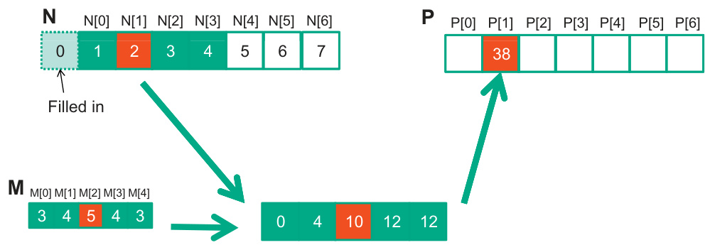

## Otimização de Convolução 1D Tiled: Abordagem de Caching Generalizado e Sincronização

### Introdução

Este capítulo aprofunda a otimização da convolução 1D tiled, expandindo os conceitos de caching e compartilhamento de dados em memória compartilhada (shared memory) para melhorar o desempenho. Em continuidade aos kernels básicos de convolução e suas otimizações, focaremos na implementação de uma técnica de caching generalizado que, embora ainda necessite de sincronização via `__syncthreads()`, modifica a estrutura do loop de cálculo dos elementos de saída `P`. A principal complexidade reside na necessidade de incorporar condições para lidar com os elementos de halo e os elementos fantasmas (ghost elements), garantindo a correção dos resultados nas bordas dos tiles.

### Conceitos Fundamentais

A convolução 1D tiled visa dividir o problema em subproblemas menores que podem ser processados em paralelo por diferentes threads dentro de um bloco. O objetivo é maximizar a utilização da memória compartilhada, que oferece acesso mais rápido aos dados do que a memória global. A técnica de caching, nesse contexto, envolve carregar partes relevantes do vetor de entrada `N` na memória compartilhada, permitindo que múltiplas threads acessem esses dados sem precisar buscar repetidamente na memória global.

O ponto central deste capítulo é a complexidade adicional introduzida ao calcular os elementos de saída `P`. Especificamente, o loop responsável por calcular esses elementos se torna mais intrincado devido à necessidade de verificar a utilização de elementos de halo e ghost elements [^1].

**Elementos de Halo:** São elementos adjacentes ao tile atual que são necessários para calcular os valores de convolução corretos nas bordas do tile. Sem os elementos de halo, o resultado da convolução nas bordas seria incorreto.


**Elementos Fantasmas (Ghost Elements):** São elementos virtuais que representam valores fora dos limites do vetor de entrada `N`. Eles são usados para lidar com as condições de contorno, determinando como a convolução se comporta nas extremidades do vetor. Conforme mencionado, o tratamento dos ghost elements utiliza a mesma instrução condicional empregada no kernel básico de convolução [^1].



A necessidade de sincronização via `__syncthreads()` persiste antes de utilizar os elementos em `N_ds` (a cópia de `N` na memória compartilhada) [^1]. Isso garante que todas as threads no bloco tenham completado a escrita dos dados em `N_ds` antes que qualquer thread tente ler esses dados.


**Implementação:**

O código que implementa essa abordagem exige cuidadosa atenção aos detalhes. O loop de cálculo de `P` deve incluir verificações condicionais para determinar se um determinado elemento de `N_ds` é um elemento de halo ou um ghost element. A lógica condicional para tratar ghost elements permanece a mesma utilizada no kernel básico.

Para ilustrar, considere um exemplo simplificado:

```c++
__global__ void tiledConvolutionOptimized(float *N, float *P, int width, int filterWidth) {
  // Calcula o índice global da thread
  int globalIndex = blockIdx.x * blockDim.x + threadIdx.x;

  // Calcula o raio do filtro
  int filterRadius = filterWidth / 2;

  // Aloca memória compartilhada para o tile
  __shared__ float N_ds[BLOCK_SIZE + 2 * filterRadius];

  // Calcula o índice local na memória compartilhada
  int localIndex = threadIdx.x + filterRadius;

  // Carrega os dados do vetor N na memória compartilhada
  if (globalIndex < width) {
    N_ds[localIndex] = N[globalIndex];
  } else {
    N_ds[localIndex] = 0.0f; // Trata ghost elements
  }

  // Carrega os elementos de halo na memória compartilhada
  if (threadIdx.x < filterRadius) {
    if (globalIndex - filterRadius >= 0) {
      N_ds[threadIdx.x] = N[globalIndex - filterRadius];
    } else {
      N_ds[threadIdx.x] = 0.0f; // Trata ghost elements para o halo esquerdo
    }

    if (globalIndex + blockDim.x < width) {
      N_ds[threadIdx.x + BLOCK_SIZE + filterRadius] = N[globalIndex + blockDim.x];
    } else {
      N_ds[threadIdx.x + BLOCK_SIZE + filterRadius] = 0.0f; // Trata ghost elements para o halo direito
    }
  }

  // Sincroniza as threads para garantir que todos os dados estejam carregados
  __syncthreads();

  // Calcula a convolução
  float sum = 0.0f;
  for (int i = -filterRadius; i <= filterRadius; ++i) {
    sum += filter[i + filterRadius] * N_ds[localIndex + i];
  }

  // Escreve o resultado na memória global
  if (globalIndex < width) {
    P[globalIndex] = sum;
  }
}
```

Neste exemplo, a parte crucial é o carregamento dos elementos de halo e o tratamento dos ghost elements. As condições `if (globalIndex - filterRadius >= 0)` e `if (globalIndex + blockDim.x < width)` garantem que não estamos acessando memória fora dos limites do vetor de entrada. Quando isso ocorre, os ghost elements são preenchidos com 0.0f, simulando um padding com zeros.

A sincronização `__syncthreads()` é essencial para garantir que todas as threads carreguem seus dados em `N_ds` antes que o cálculo da convolução comece.

### Conclusão

A implementação de uma convolução 1D tiled com caching generalizado e tratamento de ghost elements representa um passo significativo na otimização do desempenho em GPUs. A complexidade adicional no loop de cálculo dos elementos de saída `P` é compensada pela capacidade de lidar corretamente com as condições de contorno e evitar acessos inválidos à memória. A correta utilização da memória compartilhada e a sincronização adequada são cruciais para garantir a correção e eficiência do algoritmo. A abordagem apresentada serve como base para outras otimizações e variações, como o uso de diferentes estratégias de tratamento de bordas e a exploração de layouts de dados mais eficientes na memória compartilhada.
Este capítulo demonstra como a manipulação cuidadosa da memória compartilhada e a sincronização entre threads podem levar a implementações de convolução 1D altamente otimizadas para arquiteturas CUDA.

### Referências
[^1]: Informação extraída do contexto fornecido: "While barrier synchronization is still needed before using elements in N_ds, the loop that calculates the P elements becomes more complex, as it needs to add conditions to check for the use of halo elements and ghost elements. The handling of ghost elements is done with the same conditional statement used in the basic kernel."

<!-- END -->