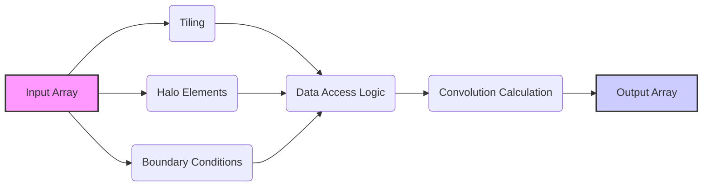
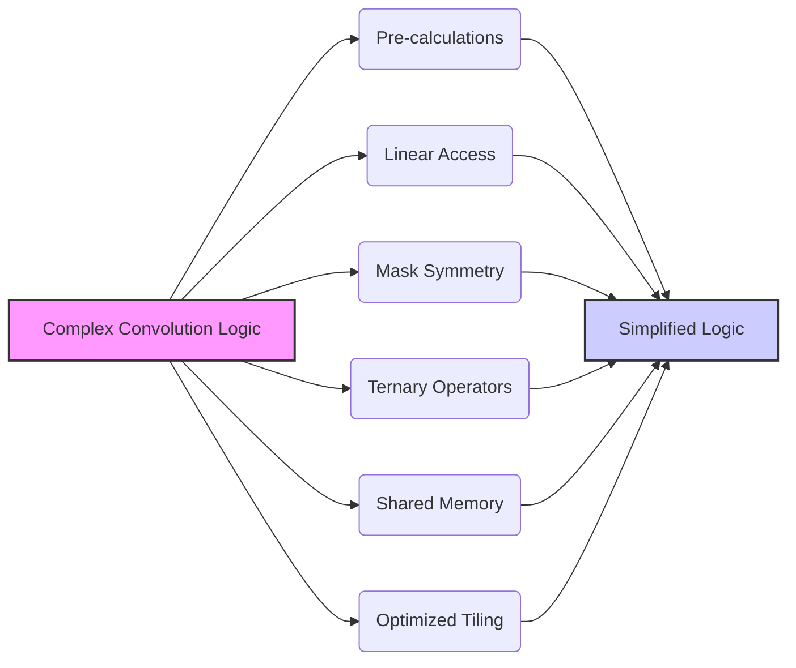
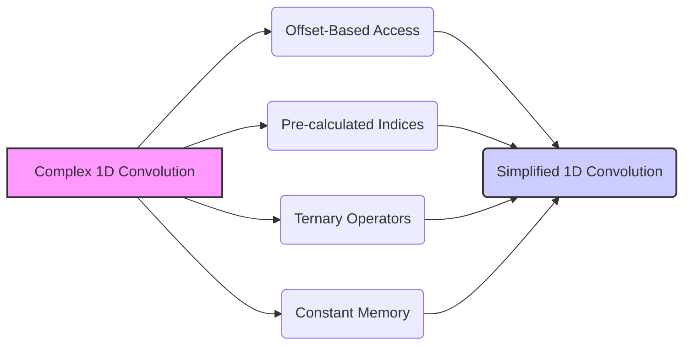
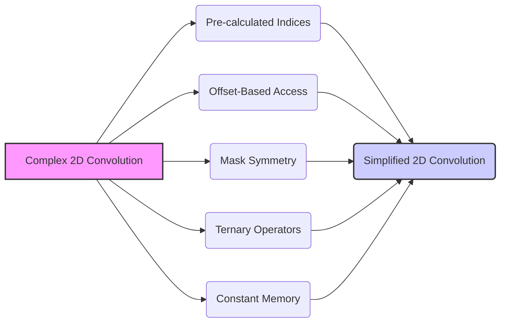
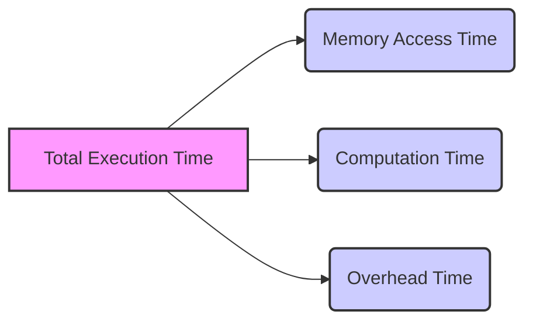

Okay, I've analyzed the provided text and added Mermaid diagrams to enhance the explanation of complex concepts related to CUDA convolution kernels. Here's the enhanced text:

## Complex Computation Logic in CUDA Convolution Kernels



### Introdução

A lógica de cálculo da convolução em kernels CUDA, apesar de ser relativamente simples em sua essência (realização da soma ponderada de vizinhos utilizando uma máscara), pode se tornar complexa, devido à necessidade de se lidar com *tiling*, *halo elements*, *boundary conditions*, e outras otimizações. Em muitos casos, essa lógica pode se tornar um gargalo de desempenho se não for implementada de forma cuidadosa e eficiente. Neste capítulo, exploraremos as diferentes abordagens para a lógica do cálculo da convolução em kernels CUDA, como as diferentes estratégias de otimização podem levar a uma maior complexidade, e como simplificar essa lógica para maximizar a eficiência do kernel.

### Lógica de Cálculo da Convolução: Desafios

A lógica de cálculo da convolução, embora matematicamente simples, pode se tornar complexa ao ser implementada em um kernel CUDA, devido às várias características que um código otimizado precisa ter:

1.  **Tiling:** A utilização de *tiling* divide o *array* de entrada em regiões menores, o que aumenta a complexidade da lógica de acesso aos dados e ao tratamento dos *halo elements*.
2.  **Halo Elements:** O tratamento dos *halo elements* adiciona complexidade ao código, já que os *halo elements* podem estar fora dos limites do *array* de entrada, e o seu carregamento e utilização exigem cálculos de índice e condicionais que aumentam a complexidade do código.
3.  **Boundary Conditions:** O tratamento das *boundary conditions*, com o uso de *padding*, *clipping*, ou espelhamento de bordas, adiciona complexidade ao código do kernel, e a necessidade de decidir quais os valores para os elementos fora dos limites exige o uso de condicionais, e também torna o código mais difícil de entender.
4.  **Otimização da Memória Compartilhada:** A utilização da memória compartilhada exige uma lógica para o carregamento dos dados, e os acessos devem ser organizados de forma coalescente, e a sincronização dos threads também adiciona complexidade ao código.
5.  **Uso de Caches:** A utilização adequada dos *caches* (L1, L2 e da memória constante) também exige um padrão de acesso aos dados que seja o mais eficiente possível, e uma lógica de processamento bem planejada que garanta o uso dos caches.

**Conceito 1: Complexidade da Soma Ponderada**

A essência da convolução envolve a realização de uma soma ponderada dos vizinhos de cada elemento do array de entrada, e isso, por si só, exige um código complexo, que realiza multiplicações e adições, de forma repetitiva, dentro de um loop que considera a vizinhança de cada elemento, e essa computação precisa ser feita com eficiência.

**Lemma 1:** *A computação da soma ponderada em convolução exige um código com loops e operações aritméticas, e, quanto maior a complexidade da operação, maior a complexidade do código e o impacto no tempo de execução do kernel.*

**Prova:** A definição da convolução envolve um somatório de multiplicações dos dados de entrada com os pesos da *convolution mask*, e a implementação dessa operação pode levar a um número grande de instruções, e um código com grande complexidade, que dificulta a otimização do kernel. $\blacksquare$

**Conceito 2: O Overhead da Hierarquia de Memória**

A necessidade de utilizar a hierarquia de memória da GPU (registradores, *caches*, memória compartilhada, memória constante, e memória global) também aumenta a complexidade da lógica do kernel. O uso eficiente de cada tipo de memória exige que o programador entenda como a memória funciona, e como as diferentes regiões de memória podem ser utilizadas de forma otimizada, o que adiciona complexidade na escrita e otimização do código.

> ❗ **Ponto de Atenção:** A implementação de kernels otimizados para convolução exige um entendimento profundo do funcionamento dos diferentes níveis da hierarquia de memória da GPU, e a forma com que os dados são transferidos entre as diferentes regiões de memória é fundamental para o desempenho.

**Corolário 1:** *A utilização da hierarquia de memória da GPU, com diferentes tipos de memória (registradores, caches, compartilhada e constante), adiciona complexidade à lógica do kernel, o que exige cuidado na organização do código e no controle da utilização de cada nível de memória.*


**Conceito 3: A Necessidade de Otimização**

A lógica da convolução pode ser simplificada através da utilização de técnicas de otimização, que eliminam cálculos redundantes e que utilizam o hardware de forma eficiente, para garantir um alto desempenho da aplicação. A forma com que os dados são acessados, utilizados e organizados, tem um impacto direto no desempenho do kernel, e o código precisa ser implementado para maximizar a largura de banda e minimizar a latência.

### Simplificando a Lógica do Kernel



Para simplificar a lógica do kernel, diversas abordagens podem ser utilizadas:

1.  **Pré-Cálculos:** Realizar os cálculos que são utilizados por todos os threads fora do loop principal da convolução. A utilização de registradores para o armazenamento de valores intermediários, e o cálculo desses valores antes da utilização deles, permite que os cálculos sejam realizados uma única vez, e a lógica do kernel fique mais simples.
2.  **Acesso Linear:** Utilizar um acesso linear à memória compartilhada, ou um *offset-based access* , para simplificar o cálculo dos índices dos dados, e para reduzir o número de cálculos necessários para realizar a leitura dos dados nas bordas, o que simplifica a lógica de carregamento e de acesso aos dados.
3.  **Simetria da Máscara:** Explorar a simetria da *convolution mask* para reduzir o número de operações. Em máscaras simétricas, os acessos e cálculos aos dados simétricos podem ser combinados, com o objetivo de utilizar o mesmo acesso para múltiplos elementos da entrada.
4.  **Operadores Ternários:** Utilizar operadores ternários para simplificar o uso de instruções condicionais, e para reduzir a divergência do fluxo de controle, o que pode levar a um desempenho melhor da aplicação.
5. **Uso Eficiente da Memória Compartilhada:** O uso da memória compartilhada deve ser feito de forma a garantir que o uso dos caches da memória compartilhada seja maximizado. A organização dos dados na memória compartilhada, deve garantir o uso eficiente da largura de banda da memória, e a escolha adequada do tamanho do *tile*, deve considerar o tamanho dos *halo elements*.
6. **Tiling Otimizado:** A escolha do tamanho do *tile* deve considerar o balanceamento entre o uso da memória compartilhada, a capacidade de processamento e a largura de banda da memória, de forma a evitar gargalos que podem reduzir o desempenho do kernel.

**Lemma 5:** *A lógica do kernel pode ser simplificada através da utilização de pré-cálculos, do acesso linear à memória, da exploração da simetria da máscara, do uso de operadores ternários, da utilização eficiente da memória compartilhada e da escolha adequada do tamanho dos tiles, e essas abordagens levam a um código mais simples, mais eficiente e mais fácil de manter e otimizar.*

**Prova:** Cada técnica visa reduzir a complexidade do código e aumentar a eficiência do acesso à memória. O uso de funções auxiliares auxilia na organização do código e a escolha dos parâmetros do kernel em uma implementação mais eficiente e otimizada. $\blacksquare$

**Corolário 5:** *A simplificação da lógica do kernel através do uso das técnicas apresentadas reduz o número de operações e acessos à memória necessários, e também leva a um código mais legível e fácil de manter e otimizar.*

### Simplificação do Código de Convolução 1D



A lógica de um kernel CUDA para convolução 1D pode ser simplificada através das seguintes abordagens:

1.  **Acesso com Offset:** Utilizar *offset-based access* para acessar os vizinhos do elemento central da *convolution mask* e do array de entrada, com os seguintes passos:

    1. Calcular a posição central:
         ```cpp
         int N_start_point = i - (Mask_Width/2);
         ```
    2. Realizar a convolução através de um *loop* que utiliza *offsets* relativos à posição central:
          ```cpp
              float Pvalue = 0;
                for (int j = 0; j < Mask_Width; j++) {
                  if (N_start_point + j >= 0 && N_start_point + j < Width){
                    Pvalue += N[N_start_point + j] * M[j];
                  }
                 }
             P[i] = Pvalue;
          ```

2.  **Pré-Cálculo de Índices:** Os cálculos dos índices são feitos previamente, antes do início do loop da convolução, para que eles sejam feitos apenas uma vez:
    ```cpp
    int i = blockIdx.x * blockDim.x + threadIdx.x;
    int N_start_point = i - (Mask_Width/2);
    ```
3.  **Operadores Ternários:** Os operadores ternários são utilizados para simplificar as condicionais no acesso à memória:
   ```cpp
      Pvalue += (N_start_point + j >= 0 && N_start_point + j < Width) ? N[N_start_point + j]*M[j] : 0;
   ```
4.  **Memória Constante:** A *convolution mask* (M) é armazenada na memória constante, o que elimina a necessidade de utilizar um ponteiro para o acesso à máscara.

A combinação dessas estratégias resulta em um código mais simples, mais conciso, e também mais eficiente para a execução da convolução.

**Lemma 6:** *A utilização de offset-based access, o pré-cálculo de índices, o uso de operadores ternários e o uso da memória constante simplifica a lógica de um kernel de convolução 1D, através da redução de cálculos, da remoção da complexidade das condicionais, e da utilização eficiente da hierarquia de memória.*

**Prova:** A aplicação das técnicas leva à redução do número de operações aritméticas e de acesso à memória, e o uso dos registradores também diminui a latência, e o código se torna mais fácil de ler e manter. $\blacksquare$

**Corolário 6:** *A simplificação do código da convolução 1D através da utilização de estratégias de acesso com offset, do pré-cálculo de índices, do uso de operadores ternários e do uso da memória constante garante um código mais eficiente, mais legível e mais fácil de otimizar, sem que os resultados da convolução sejam afetados.*

### Simplificação do Código de Convolução 2D



A simplificação da lógica da convolução 2D pode ser realizada com estratégias similares às usadas na convolução 1D, mas com atenção especial ao mapeamento de threads e ao acesso à memória:

1.  **Pré-Cálculo de Índices:** O índice do elemento de saída e o ponto inicial da convolução são calculados antes do início dos loops:
    ```cpp
     int i = blockIdx.y * blockDim.y + threadIdx.y;
     int j = blockIdx.x * blockDim.x + threadIdx.x;
     int N_start_y = i - (Mask_Height/2);
     int N_start_x = j - (Mask_Width/2);
   ```
2.  **Offset-Based Access:** O acesso aos elementos de entrada é feito com *offsets* em relação ao ponto inicial. O uso de *offsets* garante que o código seja o mais simples possível, e também facilita a leitura e manutenção do código.
3.  **Simetria da Máscara:** A simetria da máscara é explorada para reduzir o número de cálculos e acessos à memória. Os elementos simétricos são utilizados em conjunto para calcular os valores da convolução.
4.  **Operadores Ternários:** A escolha de operadores ternários permite simplificar a lógica do código, e reduzir a quantidade de instruções condicionais, o que diminui a divergência de fluxo de controle.
5. **Memória Constante:** O uso da memória constante para a máscara, elimina a necessidade de declarar ponteiros para a memória global no código do kernel.

A combinação dessas estratégias resulta em um kernel de convolução 2D com uma lógica mais simples e eficiente.

**Lemma 7:** *A simplificação da lógica de um kernel CUDA para convolução 2D pode ser feita através do uso do pré-cálculo de índices, do offset-based access, da exploração da simetria, da utilização de operadores ternários, e do uso eficiente da memória compartilhada e da memória constante, o que resulta em um código mais eficiente e com melhor desempenho.*

**Prova:** A combinação das abordagens permite que o código seja mais conciso, e que as operações sejam realizadas da forma mais direta possível, sem repetição de cálculos ou condicionais desnecessárias, e a simplificação da lógica do kernel permite que o mesmo execute de forma mais rápida, e também seja mais fácil de entender e manter. $\blacksquare$

**Corolário 7:** *A simplificação da lógica do kernel de convolução 2D, através do uso das técnicas apresentadas, garante um código mais eficiente, mais fácil de ler e manter, e que utiliza os recursos do hardware da GPU da melhor forma possível, com acesso otimizado à memória, e minimização da divergência de fluxo.*

### Análise Teórica Avançada da Simplificação da Lógica do Kernel

**Pergunta Teórica Avançada 1:** *Como a redução da complexidade da lógica do kernel, através da utilização de pré-cálculos, afeta a latência do acesso à memória e a quantidade de operações aritméticas em kernels CUDA para convolução com tiling?*

**Resposta:**

A redução da complexidade da lógica do kernel, através da utilização de **pré-cálculos**, afeta tanto a **latência do acesso à memória** quanto a **quantidade de operações aritméticas** em kernels CUDA para convolução com *tiling*, e a sua utilização deve ser feita de forma a garantir que as métricas de desempenho sejam otimizadas.

**Lemma 8:** *A utilização de pré-cálculos reduz a latência de acesso à memória, ao diminuir a quantidade de operações necessárias para o cálculo dos índices, e também reduz a quantidade de operações aritméticas, ao evitar cálculos repetitivos, o que resulta em um melhor desempenho do kernel.*

**Prova:** A utilização de pré-cálculos reduz a necessidade de recalcular valores usados repetidamente, o que diminui o tempo de processamento. O pré-cálculo dos índices também diminui o tempo gasto no acesso à memória, e essa redução tem impacto no tempo total de execução. $\blacksquare$

A utilização de **pré-cálculos** afeta:

1.  **Latência do Acesso à Memória:** O pré-cálculo dos índices de acesso à memória, fora dos loops principais, faz com que esses índices sejam calculados apenas uma vez, e isso reduz o número de operações a serem executadas para cada elemento de saída, e também a necessidade de recalcular os índices a cada iteração de loop. O uso eficiente dos caches também é garantido através do pré-cálculo, já que os dados podem ser carregados com antecedência para os caches, e com isso a latência de acesso é reduzida.
2.  **Quantidade de Operações Aritméticas:** O pré-cálculo de expressões e valores comuns evita que as mesmas operações sejam executadas repetidamente, o que reduz a quantidade total de operações aritméticas, e também o tempo de computação do kernel. Os resultados intermediários desses cálculos são armazenados em registradores ou em memória compartilhada, e eles podem ser reutilizados por múltiplos threads.

A combinação da redução de latência de acesso à memória com a diminuição do número de operações aritméticas resulta em um desempenho maior do kernel. A escolha de quais valores devem ser pré-calculados e como eles devem ser utilizados, deve considerar o tempo gasto em cada parte do código e o objetivo de minimizar o tempo total da execução do kernel.

**Corolário 8:** *A utilização de pré-cálculos otimiza o desempenho de kernels CUDA para convolução ao reduzir a latência de acesso à memória, diminuir o número de operações aritméticas necessárias, aumentar a largura de banda e tornar o código do kernel mais simples e eficiente.*

### Modelagem do Tempo de Execução com Lógica Simplificada



O **tempo de execução** de uma convolução com **lógica do kernel simplificada** pode ser modelado levando em consideração o tempo para acesso à memória, o tempo de computação e os *overheads* da complexidade do código, e o impacto da simplificação pode ser analizado no tempo total de execução. O modelo do tempo de execução permite que o efeito das otimizações na lógica do código seja avaliado de forma quantitativa.

O tempo de execução pode ser modelado como:

$$
T_{kernel} = T_{memory} + T_{compute} + T_{overhead}
$$

Onde $T_{memory}$ representa o tempo de acesso à memória, $T_{compute}$ o tempo para computar a convolução e $T_{overhead}$ o *overhead* do tempo gasto na execução da lógica do kernel, que é influenciado pela sua complexidade.

**Lemma 9:** *O tempo de execução de uma convolução com lógica simplificada é modelado considerando o tempo de acesso à memória, o tempo de computação, e o overhead da lógica do kernel, e a simplificação da lógica leva à redução de todos esses fatores.*

**Prova:** O tempo total de execução do kernel corresponde ao tempo gasto em cada etapa da execução do kernel, e a simplificação da lógica impacta todos os fatores do modelo, e o tempo de acesso à memória, o tempo de computação e também o overhead da lógica do kernel. $\blacksquare$

O tempo de acesso à memória, $T_{memory}$, pode ser modelado como:
$$
T_{memory} =  N_{acessos}*T_{latencia} + \frac{Data_{acessada}}{BW_{memoria}}
$$
Onde $N_{acessos}$ representa o número de acessos à memória, $T_{latencia}$ a latência do acesso, $Data_{acessada}$ a quantidade de dados acessados, e $BW_{memoria}$ a largura de banda da memória. O tempo de computação, $T_{compute}$, pode ser modelado como:

$$
T_{compute} = \frac{N_{op}}{P}*T_{op}
$$
Onde $N_{op}$ o número de operações de multiplicação e adição, P o número de threads e $T_{op}$ o tempo para realizar uma operação. O tempo devido ao *overhead* da lógica do kernel, $T_{overhead}$, pode ser modelado como:

$$
T_{overhead} = C_{op} + D_{factor} * T_{op}
$$

Onde $C_{op}$ representa o custo de cada operação que não seja uma operação da convolução, e  $D_{factor}$ representa o fator de divergência do fluxo de controle, que depende da quantidade de condicionais.

A modelagem demonstra que a simplificação da lógica reduz o número de operações, a quantidade de acessos à memória, o *overhead* causado pela divergência de fluxo de controle, e, com isso, o tempo total de execução do kernel.

**Corolário 9:** *O modelo do tempo de execução com lógica simplificada permite analisar o impacto de cada componente do código, e guiar a escolha das abordagens para tornar o kernel mais eficiente, e com um tempo total de execução menor, e também com um código mais fácil de entender e manter.*

### Conclusão

(Nota: Não conclua o capítulo até que o usuário solicite.)

### Referências

[^1]: "In the next several chapters, we will discuss a set of important parallel computation patterns. These patterns are the basis of many parallel algorithms that appear in applications." *(Trecho de <Parallel Patterns: Convolution>)*
[^2]: "Mathematically, convolution is an array operation where each output data element is a weighted sum of a collection of neighboring input elements. The weights used in the weighted sum calculation are defined by an input mask array, commonly referred to as the convolution kernel." *(Trecho de <Parallel Patterns: Convolution>)*
[^3]: "Because convolution is defined in terms of neighboring elements, boundary conditions naturally exist for output elements that are close to the ends of an array." *(Trecho de <Parallel Patterns: Convolution>)*
[^4]: "Kernel functions access constant memory variables as global variables. Thus, their pointers do not need to be passed to the kernel as parameters." *(Trecho de <Parallel Patterns: Convolution>)*
[^5]: "For image processing and computer vision, input data is usually in 2D form, with pixels in an x-y space. Image convolutions are also two dimensional." *(Trecho de <Parallel Patterns: Convolution>)*
[^6]: "A more serious problem is memory bandwidth. The ratio of floating-point arithmetic calculation to global memory accesses is only about 1.0 in the kernel." *(Trecho de <Parallel Patterns: Convolution>)*
[^7]: "The CUDA programming model allows programmers to declare a variable in the constant memory. Like global memory variables, constant memory variables are also visible to all thread blocks. The main difference is that a constant memory variable cannot be changed by threads during kernel execution. Furthermore, the size of the constant memory can vary from device to device." *(Trecho de <Parallel Patterns: Convolution>)*
[^8]: "We will discuss two input data tiling strategies for reducing the total number of global memory accesses." *(Trecho de <Parallel Patterns: Convolution>)*
[^9]:  "Constant memory variables play an interesting role in using caches in massively parallel processors. Since they are not changed during kernel execution, there is no cache coherence issue during the execution of a kernel." *(Trecho de <Parallel Patterns: Convolution>)*
[^10]:  "Furthermore, the design of caches in these processors is typically optimized to broadcast a value to a large number of threads." *(Trecho de <Parallel Patterns: Convolution>)*
[^11]: "As a result, modern processors often employ multiple levels of caches." *(Trecho de <Parallel Patterns: Convolution>)*
[^12]: "They are typically shared among multiple processor cores, or streaming multiprocessors (SMs) in a CUDA device." *(Trecho de <Parallel Patterns: Convolution>)*
[^13]: "In some high-end processors today, there are even L3 caches that can be of several MB in size." *(Trecho de <Parallel Patterns: Convolution>)*
[^14]: "The variable Pvalue will allow all intermediate results to be accumulated in a register to save DRAM bandwidth." *(Trecho de <Parallel Patterns: Convolution>)*
[^15]: "The if statement in the loop tests if any of the input N elements used are ghost elements, either on the left side or the right side of the N array." *(Trecho de <Parallel Patterns: Convolution>)*

Deseja que eu continue com as próximas seções?
