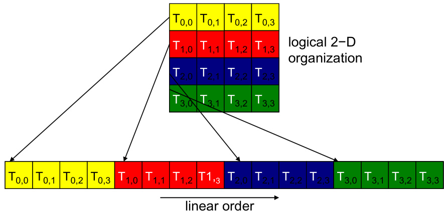

## Warps e Execução de Threads em CUDA

### Introdução

Em CUDA, a arquitetura de *single-instruction multiple-thread* (SIMT) é fundamental para a programação paralela em GPUs. A organização dos threads em uma hierarquia de grid e blocos [^1] facilita a escalabilidade transparente na execução paralela. Este capítulo se aprofunda na execução de threads dentro de warps e blocos, detalhando como a estrutura hierárquica do CUDA afeta o desempenho e a correção de kernels.

### Conceitos Fundamentais

#### Hierarquia de Grid e Blocos

Os kernels CUDA geram um grid de threads organizados em uma hierarquia de dois níveis: um grid de blocos 1D, 2D ou 3D, cada um contendo um array 1D, 2D ou 3D de threads [^1]. Essa estrutura permite a escalabilidade transparente na execução paralela, pois os blocos podem ser executados em qualquer ordem.

A organização dos threads em blocos permite o compartilhamento eficiente de dados através da memória compartilhada (shared memory) e a sincronização entre threads usando barreiras. O tamanho dos blocos é limitado pelos recursos da GPU, como memória compartilhada e número máximo de threads por bloco.

#### Warps: a Unidade de Execução

Internamente, a GPU agrupa threads em *warps*. Um warp é um conjunto de threads (tipicamente 32) que executam a mesma instrução simultaneamente. A arquitetura SIMT significa que todos os threads em um warp executam a mesma instrução em um dado ciclo de clock. Se os threads em um warp divergem devido a um desvio condicional (por exemplo, uma instrução `if`), o warp serializa a execução dos diferentes caminhos, desativando os threads que não seguem o caminho atual. Isso é conhecido como *divergência de warp* e pode levar a uma degradação significativa do desempenho.



#### Sincronização dentro de Blocos

Dentro de um bloco, os threads podem se comunicar e sincronizar usando a memória compartilhada e a função `__syncthreads()`. A função `__syncthreads()` atua como uma barreira: nenhum thread no bloco pode prosseguir além da chamada de `__syncthreads()` até que todos os threads no bloco tenham atingido esse ponto.

A sincronização correta é crucial para garantir a consistência dos dados na memória compartilhada e para evitar condições de corrida (race conditions). Como os threads dentro de um bloco podem potencialmente executar em qualquer ordem [^1], a sincronização é necessária para garantir a ordem correta das operações.

#### Considerações sobre Desempenho

A eficiência da execução de kernels CUDA depende fortemente da minimização da divergência de warp e da utilização eficiente da memória compartilhada.

1.  **Divergência de Warp:** Para minimizar a divergência de warp, é importante projetar algoritmos que minimizem as condições de ramificação dentro dos warps. Técnicas como a ordenação de dados e a utilização de máscaras de bits podem ser usadas para reduzir a divergência.

2.  **Utilização da Memória Compartilhada:** A memória compartilhada é muito mais rápida do que a memória global, mas é limitada em tamanho. O acesso à memória compartilhada deve ser cuidadosamente coordenado para evitar conflitos de banco (bank conflicts), que podem serializar o acesso à memória.

    

#### Exemplo Ilustrativo

Considere um kernel simples que adiciona dois vetores:

```c++
__global__ void vectorAdd(float *a, float *b, float *c, int n) {
    int i = blockIdx.x * blockDim.x + threadIdx.x;
    if (i < n) {
        c[i] = a[i] + b[i];
    }
}
```

Neste exemplo, cada thread calcula a soma de um elemento dos vetores `a` e `b` e armazena o resultado em `c`. Para garantir que todos os elementos sejam processados, o índice `i` é verificado em relação ao tamanho do vetor `n`.

Em um cenário onde `n` não é um múltiplo do tamanho do bloco, alguns threads dentro do último warp podem estar inativos. No entanto, isso geralmente tem um impacto mínimo no desempenho, pois apenas alguns threads estão ociosos.

Para otimizar ainda mais, poderíamos considerar o uso de tiling e memória compartilhada para carregar blocos de dados na memória compartilhada e realizar a adição localmente. Isso pode reduzir o número de acessos à memória global e melhorar o desempenho.

### Conclusão

A arquitetura de warps e a hierarquia de threads em CUDA fornecem um poderoso modelo para programação paralela em GPUs. Entender como os threads são executados dentro de warps e blocos é essencial para escrever kernels CUDA eficientes e corretos. A minimização da divergência de warp, a utilização eficiente da memória compartilhada e a sincronização adequada são cruciais para otimizar o desempenho dos kernels CUDA.

### Referências
[^1]: CUDA kernels generate a grid of threads organized in a two-level hierarchy: a grid of 1D, 2D, or 3D blocks, each containing a 1D, 2D, or 3D array of threads. This structure enables transparent scalability in parallel execution, as blocks can execute in any order. Threads within a block should be treated as potentially executing in any sequence, requiring barrier synchronizations for correctness.
<!-- END -->