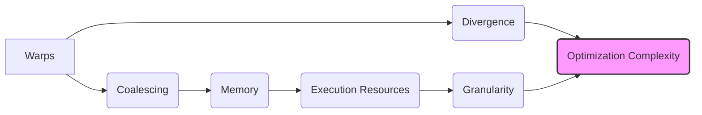
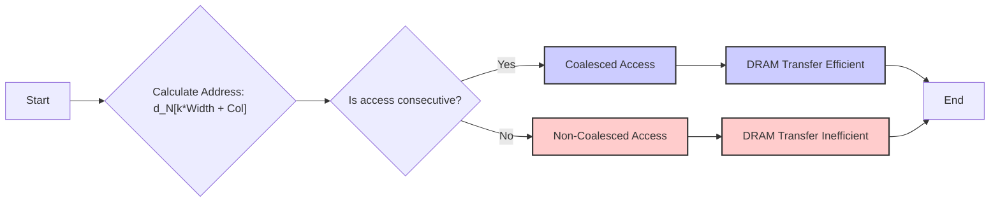
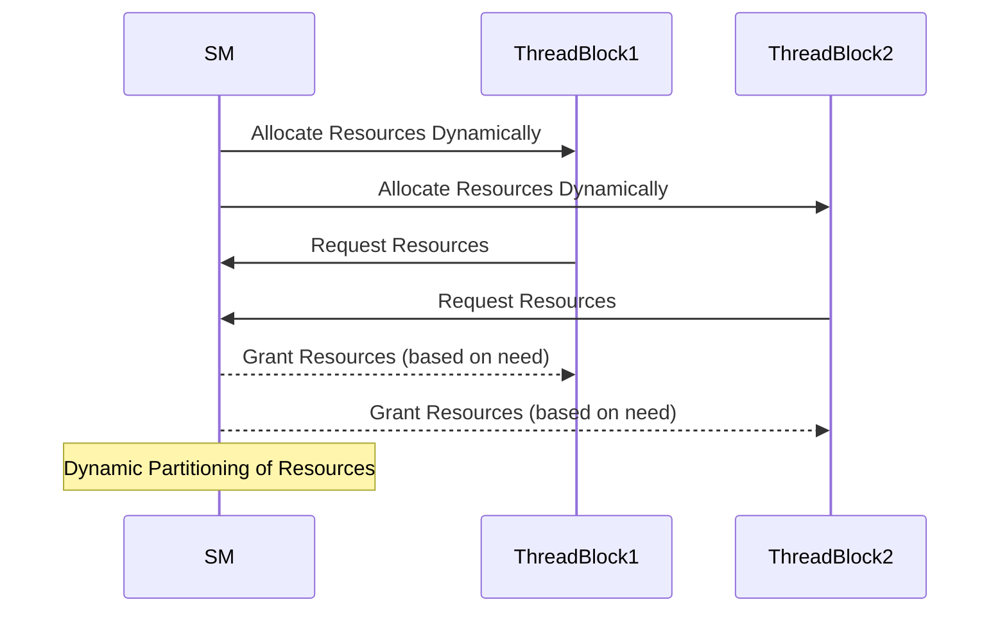
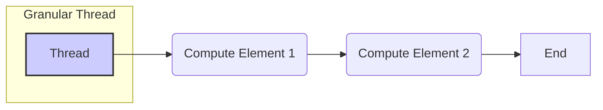

Okay, here's the enhanced text with Mermaid diagrams added where appropriate:

## Performance Considerations in CUDA: A Deep Dive (Cont.)

### Introdução

(Repetindo a introdução para manter o contexto, com pequenas adaptações)

Atingir o máximo desempenho em aplicações CUDA requer um profundo entendimento das restrições de recursos e como elas afetam a execução do kernel [^1]. Este capítulo explora as principais limitações em dispositivos CUDA e como ajustar o código para alcançar níveis de performance superiores. Em aplicações distintas, as restrições de recursos podem variar, tornando essencial a compreensão de como um recurso afeta outro. A otimização de desempenho não é trivial e exige um conhecimento profundo da arquitetura CUDA para identificar gargalos e implementar soluções eficientes [^1]. Este capítulo também visa desenvolver a intuição sobre padrões de algoritmos que levam a uma alta performance, além de estabelecer ideias e princípios para guiar a otimização [^1]. Nesta seção, exploraremos a largura de banda da memória global, a partição dinâmica de recursos e o ajuste da granularidade das instruções e threads, com foco na escalabilidade transparente.

### Conceitos Fundamentais (Continuação)

Continuando com a exploração da arquitetura CUDA, vamos agora abordar conceitos que afetam diretamente o desempenho e a escalabilidade de aplicações CUDA.

**Conceito 4: Global Memory Bandwidth**

A **largura de banda da memória global** é um fator crucial para o desempenho de kernels CUDA, pois as aplicações tendem a processar grandes quantidades de dados armazenados na memória global [^10]. A memória global é implementada usando **DRAMs** (Dynamic Random Access Memory), cujas células armazenam bits como pequenos capacitores que representam 0 ou 1 pela presença ou ausência de carga elétrica [^10]. A leitura de dados de uma célula DRAM envolve o uso de sua carga elétrica para ativar uma linha capacitiva, o que resulta em uma velocidade de acesso relativamente baixa (da ordem de dezenas de nanossegundos) [^10]. Para compensar essa lentidão, as DRAMs utilizam paralelismo ao acessar várias localizações de memória consecutivas simultaneamente, por meio de múltiplos sensores [^10].

A técnica de **coalescing** é essencial para aproveitar o paralelismo das DRAMs. Essa técnica consiste em fazer com que os threads em um warp acessem endereços de memória global consecutivos [^10]. Quando isso acontece, o hardware combina os acessos em uma única requisição de leitura, permitindo que os dados sejam transferidos em taxas próximas à largura de banda máxima da memória global [^10].

> ⚠️ **Ponto Crítico:** O coalescing é uma técnica fundamental para otimizar o acesso à memória global, permitindo que as DRAMs forneçam dados na taxa mais alta possível. O desalinhamento dos acessos pode levar a um desempenho significativamente menor [^10].

Os elementos de um array multidimensional em C/CUDA são armazenados na memória em ordem *row-major* [^11], ou seja, os elementos de uma mesma linha são armazenados em localizações consecutivas na memória [^11]. No exemplo de uma matriz 4x4 (Figura 6.6), a sequência de acesso na memória é M0,0, M0,1, M0,2, M0,3, M1,0, M1,1, etc [^11].  Ao acessar uma matriz na memória global, é fundamental organizar os threads de forma que o padrão de acesso siga essa ordem para tirar proveito do *coalescing*. Caso contrário, a performance será drasticamente reduzida.

**Lemma 3:** *Em um acesso de memória com coalescing, os threads em um warp acessam localizações de memória consecutivas na memória global, o que garante a eficiência da transferência de dados.*

**Prova do Lemma 3:** Para demonstrar o coalescing, considere um warp onde cada thread *t* acessa o endereço de memória base + *t*. Por exemplo, se um thread 0 acessa o endereço *N*, então os threads 1, 2, 3... 31 acessarão os endereços *N+1*, *N+2*, *N+3*... *N+31*. Essa é uma sequência de endereços consecutivos. Ao detectar que os acessos são consecutivos, o hardware pode combinar esses acessos em uma única solicitação para o DRAM, maximizando a taxa de transferência. Isso garante que a leitura da memória seja realizada da forma mais rápida possível, uma vez que as DRAMs já acessam um bloco de dados que incluem essas localizações. $\blacksquare$

**Corolário 3:** *O acesso a matrizes em ordem row-major por threads em um warp onde os indices 'x' dos threads correspondem as colunas, por meio de  `d_N[k*Width + Col]`, possibilita o coalescing. Já o acesso por meio de `d_M[Row*Width + k]` não possibilita, pois os acessos em memória são não consecutivos.*

Na Figura 6.7, temos um exemplo de acesso de matrizes onde o acesso à matriz `d_N` utiliza `d_N[k*Width + Col]` e garante o coalescing. Ao contrário do acesso a matriz `d_M`, com `d_M[Row*Width + k]`, que não garante o acesso coalescido, pois os elementos acessados estão em locais não consecutivos na memória [^12].

Para ilustrar isso com mais detalhes, podemos considerar a Figura 6.8, que apresenta o acesso coalescido a matriz *d_N*. O cálculo do índice usado por cada thread no acesso à matriz `d_N` é dado por `d_N[k*Width + Col]`, onde `Col` = `blockIdx.x*blockDim.x + threadIdx.x` [^12]. Como `blockIdx.x` e `blockDim.x` são constantes dentro de um bloco, a única parte que varia nesse índice é `threadIdx.x` [^12]. Dessa forma, cada thread acessa um endereço de memória que é consecutivo, o que possibilita o coalescing. Já na Figura 6.9, que mostra o acesso não coalescido, o índice é `d_M[Row*Width + k]`, onde `Row` = `blockIdx.y*blockDim.y + threadIdx.y` [^13]. Neste caso, a variação no índice se dá por `threadIdx.y`, o que gera acessos não consecutivos.

> ✔️ **Destaque:**  Quando o algoritmo exige iteração ao longo das linhas de uma matriz, a memória compartilhada pode ser usada para tornar os acessos coalescidos. Os dados são carregados na memória compartilhada de forma coalescida e depois acessados pelos threads na ordem desejada [^13].

**Conceito 5: Dynamic Partitioning of Execution Resources**

Os **recursos de execução** em um Streaming Multiprocessor (SM) incluem registros, memória compartilhada, slots de bloco e slots de thread. Esses recursos são alocados dinamicamente para suportar a execução de threads [^14]. Cada SM possui um número fixo de slots de thread, por exemplo, 1536 slots [^14]. Os slots são particionados em blocos de threads durante a execução.

A capacidade de alocar os recursos dinamicamente torna o SM versátil, permitindo que execute blocos com diferentes números de threads [^14]. Ao contrário de um sistema de alocação fixa, a alocação dinâmica evita o desperdício de slots quando um bloco possui poucos threads. Por outro lado, uma má alocação de recursos pode levar à subutilização do hardware.

Por exemplo, com 1536 slots de thread, se um bloco tem 128 threads, então até 12 blocos podem ser executados simultaneamente [^15]. No entanto, como há um número limitado de slots de blocos (por exemplo, 8), apenas 8 blocos podem ser executados, resultando na subutilização de threads [^15]. Para utilizar todos os recursos, é necessário que cada bloco tenha pelo menos 256 threads [^15].

> ❗ **Ponto de Atenção:** A alocação dinâmica de recursos pode levar a interações sutis entre os limites de diferentes recursos (slots de bloco, slots de thread, registradores), o que pode causar subutilização do hardware. É fundamental analisar essas interações para otimizar o desempenho do kernel.

A quantidade de registradores que um kernel usa é também um fator importante na alocação dinâmica de recursos. Variáveis automáticas são alocadas em registradores [^15]. Alguns kernels usam poucos registradores, enquanto outros usam muitos. Ao particionar os registradores dinamicamente, o SM consegue acomodar mais blocos com poucos registradores e menos blocos com muitos registradores [^15]. No entanto, aumentar o uso de registradores pode levar a uma redução no número de blocos em execução simultânea em um SM, reduzindo a performance [^15].

**Conceito 6: Instruction Mix and Thread Granularity**

A **granularidade de threads** é uma decisão algorítmica importante na otimização de desempenho [^16]. Muitas vezes é vantajoso colocar mais trabalho em cada thread e usar menos threads, especialmente quando há trabalho redundante [^16]. Cada SM possui uma largura de banda limitada para processar instruções [^16]. Reduzir o número de instruções executadas e o trabalho redundante pode melhorar a velocidade de execução do kernel [^16].

Na multiplicação de matrizes, por exemplo, o algoritmo inicial carrega várias vezes a mesma linha de dados para diferentes blocos. Essa redundância pode ser eliminada ao fazer com que um mesmo bloco realize o cálculo de mais de um elemento da matriz resultante, usando menos blocos e threads [^16].

Na Figura 6.12, um exemplo é apresentado onde um mesmo bloco realiza o calculo de dois elementos de uma matriz. Em vez de cada thread computar um elemento da matriz resultante, cada thread computa dois elementos. Isso reduz o numero de acessos à memória global, por usar os mesmos dados para computar dois valores de saída.

> ✔️ **Destaque**: A granularidade dos threads deve ser ajustada de forma a equilibrar o paralelismo com o overhead da alocação e execução de threads. A escolha adequada depende do algoritmo e das características da arquitetura CUDA.

### Dedução Teórica Complexa da Largura de Banda da Memória Global

**Pergunta Teórica Avançada:** *Como podemos modelar matematicamente o impacto do coalescing na largura de banda efetiva da memória global em CUDA, considerando os diferentes níveis de acesso e a organização da DRAM?*

**Resposta:**

Para modelar o impacto do coalescing, é preciso considerar as características da arquitetura da memória DRAM, que é composta de bancos de memória. O acesso a esses bancos tem uma latência inicial e uma taxa de transferência subsequente. O coalescing visa combinar múltiplos acessos de memória em um único acesso, maximizando a taxa de transferência e minimizando a latência inicial.

Vamos definir algumas variáveis:

*   $N_w$: número de threads em um warp (tipicamente 32).
*   $B_s$: tamanho do bloco de dados que a DRAM transfere em uma única operação (por exemplo, um bloco de 128 bytes).
*   $L$: latência inicial de acesso à memória (em ciclos de clock ou nanossegundos).
*   $T_t$: tempo de transferência de um bloco de dados ($B_s$) (em ciclos de clock ou nanossegundos).
*   $A$: número de acessos de memória por thread.

**Modelo de Acesso não Coalescido:**

Em um acesso não coalescido, cada thread acessa uma localidade não contígua na memória global. Isso resulta em múltiplos acessos individuais à memória, cada um com sua latência inicial e tempo de transferência. Em um cenário sem coalescing, o tempo total de acesso à memória pode ser estimado como:
$$T_{nc} \approx N_w \times (L + A \times T_t)$$
Assumindo que cada thread acessa uma posição distinta na memória e a DRAM processa esses acessos individualmente. Isso indica que o tempo é diretamente proporcional ao número de threads e aos acessos realizados.

**Modelo de Acesso Coalescido:**

Em um acesso coalescido ideal, todos os threads em um warp acessam posições consecutivas na memória, permitindo que o hardware combine esses acessos em uma única solicitação. O tempo total de acesso à memória pode ser estimado como:
$$T_c \approx L + (A \times T_t)$$
Nesse caso, a latência é paga apenas uma vez, e o tempo total depende do número de blocos de dados transferidos e da latência de acesso à memória.

**Largura de Banda Efetiva:**

Podemos definir a largura de banda efetiva como a quantidade de dados transferidos por unidade de tempo:

* Largura de banda efetiva sem coalescing:
$$B_{ef\_nc} = \frac{N_w \times B_s}{T_{nc}}$$

* Largura de banda efetiva com coalescing:
$$B_{ef\_c} = \frac{N_w \times B_s}{T_{c}}$$

**Lemma 4:** *O ganho de largura de banda do coalescing é proporcional ao número de threads por warp e o tamanho do bloco de dados transferidos, e é inversamente proporcional à latência de acesso à memória.*

**Prova do Lemma 4:** Comparando as equações de largura de banda, vemos que `Bef_c` será maior que `Bef_nc`. A largura de banda efetiva de um acesso coalescido é significativamente maior porque o fator `N_w` (número de threads) afeta o denominador na versão sem coalescing. Ao usar coalescing, a latência inicial é compartilhada, e o acesso é feito em uma única transação, maximizando o uso da largura de banda da memória global e reduzindo o tempo de transferência. Isso resulta em um aumento na largura de banda efetiva, especialmente quando a latência é alta. $\blacksquare$

**Corolário 4:** *A largura de banda efetiva é maximizada quando o número de acessos de memória por thread é minimizado e os acessos são coalescidos, reduzindo a latência e otimizando o uso dos recursos da DRAM.*

A modelagem matemática do coalescing nos permite quantificar o impacto do coalescing no desempenho de kernels CUDA e otimizar o acesso à memória global, reduzindo a latência e maximizando a taxa de transferência de dados.

### Prova ou Demonstração Matemática Avançada da Partição Dinâmica de Recursos

**Pergunta Teórica Avançada:** *Como podemos demonstrar formalmente que a partição dinâmica de recursos em CUDA permite uma utilização mais eficiente dos recursos em comparação com uma partição estática, e quais os limites teóricos dessa eficiência?*

**Resposta:**

Vamos analisar formalmente o impacto da partição dinâmica de recursos em CUDA, comparando com uma abordagem estática. Para isso, vamos usar um modelo simplificado dos recursos do Streaming Multiprocessor (SM).

**Definições:**

*   $R$: número total de recursos (registros, slots de thread, etc.) em um SM.
*   $B$: número de blocos de threads.
*   $T_b$: número de threads por bloco.
*   $R_b$: número de recursos necessários por bloco.
*   $R_t$: número de recursos necessários por thread.

**Modelo de Partição Estática:**

Em uma partição estática, cada bloco recebe uma quantidade fixa de recursos, independentemente de suas necessidades. Suponha que cada bloco receba `R_b` recursos. O número máximo de blocos que podem ser executados simultaneamente é dado por:
$$B_{static} = \lfloor \frac{R}{R_b} \rfloor$$
Nesse modelo, os blocos são todos do mesmo tamanho e precisam da mesma quantidade de recursos. O número máximo de threads em execução simultânea é:
$$Threads_{static} = B_{static} \times T_b$$

**Modelo de Partição Dinâmica:**

Na partição dinâmica, o sistema aloca recursos para cada bloco com base em suas necessidades individuais. O sistema pode acomodar mais blocos se eles precisarem de menos recursos. Para um caso genérico com N blocos, podemos modelar como:
$$\sum_{i=1}^{N} R_{b_i} \leq R$$
Onde Rbi é a quantidade de recursos que cada bloco precisa. O número máximo de threads executando simultaneamente é:
$$Threads_{dynamic} = \sum_{i=1}^{N} T_{b_i}$$
Onde Tbi é o numero de threads por bloco.

**Teorema da Eficiência da Partição Dinâmica:** *A partição dinâmica de recursos em CUDA possibilita que o número de threads executando simultaneamente seja maior ou igual ao número de threads executando simultaneamente com partição estática, para qualquer distribuição de blocos.*
$$Threads_{dynamic} \geq Threads_{static}$$

**Prova do Teorema:**

1.  **Partição Estática Homogênea:**  Em uma partição estática, todos os blocos são do mesmo tamanho (T_b) e necessitam da mesma quantidade de recursos (R_b). O número máximo de blocos (B_static) é determinado pela divisão do total de recursos pelo número de recursos por bloco. O total de threads em execução é dado por Threads_static = B_static * T_b.
2.  **Partição Dinâmica Heterogênea:** Na partição dinâmica, blocos podem ter tamanhos e requisitos de recursos diferentes. O limite é dado pela condição que a soma dos recursos de todos os blocos deve ser menor ou igual ao total de recursos no SM (R).
3.  **Comparação:** Na partição estática, devido a uma distribuição homogenea de recursos, uma parte deles pode ser desperdiçada. Na partição dinâmica, o sistema aloca recursos para cada bloco apenas com o necessário, e, portanto, o sistema é capaz de executar o mesmo numero de threads da versão com partição estática e, possivelmente, mais threads.
4.  **Caso Extremo:** Considere o caso em que todos os blocos têm exatamente o mesmo tamanho e necessitam da mesma quantidade de recursos. Neste caso, as duas abordagens resultam na mesma utilização. Portanto, Threads_dynamic é igual a Threads_static.
5.  **Generalização:** Quando os blocos têm diferentes necessidades de recursos, a alocação dinâmica permite que mais blocos com requisitos menores de recursos sejam executados, explorando a capacidade total dos recursos do SM e maximizando o número de threads em execução, o que prova a afirmação do teorema. $\blacksquare$

**Corolário 5:** *A partição dinâmica de recursos permite que o hardware aproveite as variabilidades do número de threads e da quantidade de recursos que cada bloco precisa. Por outro lado, o limite teórico dessa melhoria é dado pelo overhead da alocação dinâmica.*

A alocação dinâmica de recursos possibilita a adaptação da execução do kernel às características das aplicações, promovendo uma melhor utilização dos recursos do SM e maior escalabilidade. Isso, no entanto, não implica que uma alocação dinâmica sempre resulta em um desempenho superior. Isso dependerá das características do problema e da implementação do kernel.

### Continuação

Tendo detalhado a largura de banda da memória global, a partição dinâmica de recursos e o mix de instruções e granularidade de threads, estamos agora mais preparados para lidar com otimizações avançadas. Próximas seções podem explorar em detalhes as seguintes áreas:

-   **Otimizações de Código:** Técnicas avançadas para minimizar a divergência de warps, usando coalescing e prefetching de dados.
-   **Casos de Estudo:** Análise detalhada de algoritmos como multiplicação de matrizes, redução, convolução e sua otimização para CUDA.
-   **Ferramentas de Profiling:** Uso de ferramentas de profiling para identificar gargalos de desempenho e otimizar kernels.

### Referências

[^1]: "The execution speed of a CUDA kernel can vary greatly depending on the resource constraints of the device being used. In this chapter, we will discuss the major types of resource constraints in a CUDA device and how they can affect the kernel execution performance in this device. To achieve his or her goals, a programmer often has to find ways to achieve a required level of performance that is higher than that of an initial version of the application. In different applications, different constraints may dom- inate and become the limiting factors. One can improve the performance of an application on a particular CUDA device, sometimes dramatically, by trading one resource usage for another. This strategy works well if the resource constraint alleviated was actually the dominating constraint before the strategy was applied, and the one exacerbated does not have negative effects on parallel execution. Without such understanding, perfor- mance tuning would be guess work; plausible strategies may or may not lead to performance enhancements. Beyond insights into these resource constraints, this chapter further offers principles and case studies designed to cultivate intuition about the type of algorithm patterns that can result in high-performance execution. It is also establishes idioms and ideas that" *(Trecho de Performance Considerations)*
[^10]: "One of the most important factors of CUDA kernel performance is acces- sing data in the global memory. CUDA applications exploit massive data parallelism. Naturally, CUDA applications tend to process a massive amount of data from the global memory within a short period of time. In Chapter 5, we discussed tiling techniques that utilize shared memories to reduce the total amount of data that must be accessed by a collection of threads in the thread block. In this chapter, we will further discuss memory coalescing techniques that can more effectively move data from the global memory into shared memories and registers. Memory coalescing techni- ques are often used in conjunction with tiling techniques to allow CUDA devices to reach their performance potential by more efficiently utilizing the global memory bandwidth. The global memory of a CUDA device is implemented with DRAMs. Data bits are stored in DRAM cells that are small capacitors, where the presence or absence of a tiny amount of electrical charge distinguishes between 0 and 1. Reading data from a DRAM cell requires the small capacitor to use its tiny electrical charge to drive a highly capacitive line leading to a sensor and set off its detection mechanism that determines whether a sufficient amount of charge is present in the capacitor to qualify as a “1” (see “Why Are DRAMs So Slow?” sidebar). This process takes tens of nanoseconds in modern DRAM chips. Because this is a very slow process relative to the desired data access speed (sub-nanosecond access per byte), modern DRAMs use parallelism to increase their rate of data access. Each time a DRAM location is accessed, many consecutive locations that include the requested location are actually accessed. Many sensors are provided in each DRAM chip and they work in parallel. Each senses the content of a bit within these consecutive locations. Once detected by the sensors, the data from all these consecutive locations can be transferred at very high speed to the processor. If an application can make focused use of data from consecutive locations, the DRAMs can supply the data at a much higher rate than if a truly random sequence of locations were accessed." *(Trecho de Performance Considerations)*
[^11]: "multidimensional array elements. As we showed in Chapter 4 (Figure 4.3, replicated as Figure 6.6 for convenience), multidimensional array elements in C and CUDA are placed into the linearly addressed memory space according to the row-major convention. That is, the elements of row 0 of a matrix are first placed in order into consecutive locations. They are followed by the ele- ments of row 1 of the matrix, and so on. In other words, all elements in a row are placed into consecutive locations and entire rows are placed one after another. The term row major refers to the fact that the placement of data pre- serves the structure of rows: all adjacent elements in a row are placed into consecutive locations in the address space. Figure 6.6 shows a small example where the 16 elements of a 4 × 4 matrix M are placed into linearly addressed locations. The four elements of row 0 are first placed in their order of appear- ance in the row. Elements in row 1 are then placed, followed by elements of row 2, followed by elements of row 3. It should be clear that M0,0 and M1,0, though they appear to be consecutive in the 2D matrix, are placed four loca- tions away in the linearly addressed memory." *(Trecho de Performance Considerations)*
[^12]: "Within a given iteration of the k loop, the k*Width value is the same across all threads. Recall that Col = blockIdx.x*blockDim.x + threadIdx. x. Since the value of blockIndx.x and blockDim.x are of the same value for all threads in the same block, the only part of k*Width + Col that varies across a thread block is threadIdx.x. For example, in Figure 6.8, assume that we are using 4 × 4 blocks and that the warp size is 4. That is, for this toy example, we are using only one block to calculate the entire P matrix. The values of Width, blockDim.x, and blockIdx.x are 4, 4, and 0, respec- tively, for all threads in the block. In iteration 0, the k value is 0. The index used by each thread for accessing d_N is d_N[k*Width + Col]=d_N[k*Width + blockIdx.x*blockDim.x + threadIdx.x] = d_N[0*4 + 0*4 + threadidx.x] = d_N[threadIdx.x] That is, the index for accessing d_N is simply the value of threadIdx.x. The d_N elements accessed by To, T1, T2, and T3 are d_N[0], d_N[1], d_N[2], and d_N[3], respectively. This is illustrated with the “Load iteration 0" box of Figure 6.8. These elements are in consecutive locations in the global memory. The hardware detects that these accesses are made by threads in a warp and to consecutive locations in the global memory. It coa- lesces these accesses into a consolidated access. This allows the DRAMs to supply data at a high rate." *(Trecho de Performance Considerations)*
[^13]: "Figure 6.9 shows an example of a matrix data access pattern that is not coalesced. The arrow in the top portion of the figure shows that the kernel code for each thread accesses elements of a row in sequence. The arrow in the top portion of Figure 6.9 shows the access pattern of the kernel code for one thread. This access pattern is generated by the access to d_M in Figure 4.7: d_M[Row*Width + k] Within a given iteration of the k loop, the k*Width value is the same across all threads. Recall that Row = blockIdx.y*blockDim.y +" *(Trecho de Performance Considerations)*
[^14]: "The execution resources in a streaming multiprocessor (SM) include regis- ters, shared memory, thread block slots, and thread slots. These resources are dynamically partitioned and assigned to threads to support their execu- tion. In Chapter 4, we have seen that the current generation of devices have 1,536 thread slots, each of which can accommodate one thread. These thread slots are partitioned and assigned to thread blocks during runtime. If each thread block consists of 512 threads, the 1,536 thread slots" *(Trecho de Performance Considerations)*
[^15]: "are partitioned and assigned to three blocks. In this case, each SM can accommodate up to three thread blocks due to limitations on thread slots. If each thread block contains 128 threads, the 1,536 thread slots are parti- tioned and assigned to 12 thread blocks. The ability to dynamically parti- tion the thread slots among thread blocks makes SMs versatile. They can either execute many thread blocks each having few threads, or execute few thread blocks each having many threads. This is in contrast to a fixed partitioning method where each block receives a fixed amount of resources regardless of their real needs. Fixed partitioning results in wasted thread slots when a block has few threads and fails to support blocks that require more thread slots than the fixed partition allows. Dynamic partitioning of resources can lead to subtle interactions between resource limitations, which can cause underutilization of resources. Such interactions can occur between block slots and thread slots. For example, if each block has 128 threads, the 1,536 thread slots can be partitioned and assigned to 12 blocks. However, since there are only 8 block slots in each SM, only 8 blocks will be allowed. This means that only 1,024 of the thread slots will be utilized. Therefore, to fully utilize both the block slots and thread slots, one needs at least 256 threads in each block. As we mentioned in Chapter 4, the automatic variables declared in a CUDA kernel are placed into registers. Some kernels may use lots of auto- matic variables and others may use few of them. Thus, one should expect that some kernels require many registers and some require fewer. By dynamically partitioning the registers among blocks, the SM can accom- modate more blocks if they require few registers and fewer blocks if they require more registers. One does, however, need to be aware of potential interactions between register limitations and other resource limitations." *(Trecho de Performance Considerations)*
[^16]: "An important algorithmic decision in performance tuning is the granularity of threads. It is often advantageous to put more work into each thread and use fewer threads. Such advantage arises when some redundant work exists between threads. In the current generation of devices, each SM has limited instruction processing bandwidth. Every instruction consumes instruction processing bandwidth, whether it is a floating-point calculation instruction, a load instruction, or a branch instruction. Eliminating redun- dant instructions can ease the pressure on the instruction processing band- width and improve the overall execution speed of the kernel. Figure 6.12 illustrates such an opportunity in matrix multiplication. The tiled algorithm in Figure 6.11 uses one thread to compute one element of the output d_P matrix. This requires a dot product between one row of d_M and one column of d_N. The opportunity of thread granularity adjustment comes from the fact that multiple blocks redundantly load each d_M tile. As shown in Figure 6.12, the calculation of two d_P elements in adjacent tiles uses the same d_M row. With the original tiled algorithm, the same d_M row is redundantly loaded by the two blocks assigned to generate these two Pd tiles. One can eliminate this redundancy by merging the two thread blocks into one. Each thread in the new thread block now calculates two d_P ele- ments. This is done by revising the kernel so that two dot products are computed by the innermost loop of the kernel. Both dot products use the" *(Trecho de Performance Considerations)*

**Deseja que eu continue com as próximas seções?**
