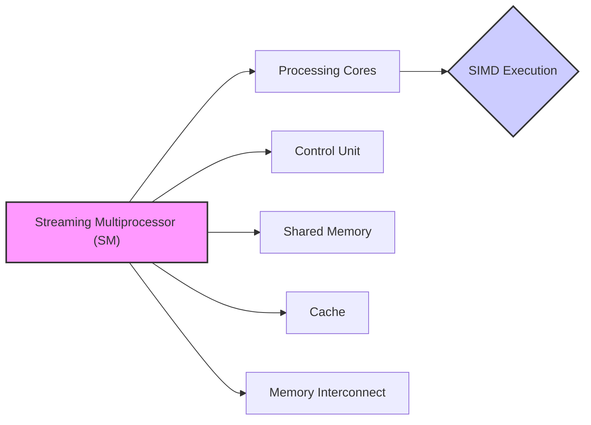
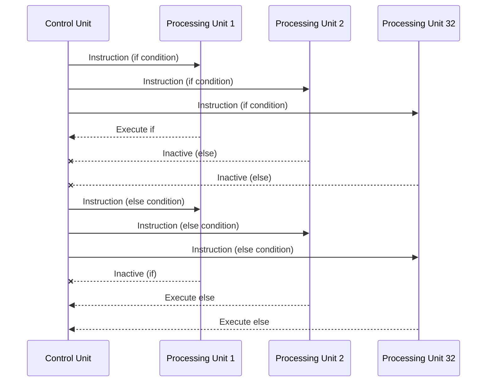

Okay, I will add the Mermaid diagrams to the text as requested, focusing on visual representations of architecture and system relationships, specifically flowcharts and sequence diagrams.

## Performance Considerations in CUDA: A Deep Dive (Cont.)

### Introdução

(Repetindo a introdução para manter o contexto, com pequenas adaptações)

Atingir o máximo desempenho em aplicações CUDA requer um profundo entendimento das restrições de recursos e como elas afetam a execução do kernel [^1]. Este capítulo explora as principais limitações em dispositivos CUDA e como ajustar o código para alcançar níveis de performance superiores. Em aplicações distintas, as restrições de recursos podem variar, tornando essencial a compreensão de como um recurso afeta outro. A otimização de desempenho não é trivial e exige um conhecimento profundo da arquitetura CUDA para identificar gargalos e implementar soluções eficientes [^1]. Este capítulo também visa desenvolver a intuição sobre padrões de algoritmos que levam a uma alta performance, além de estabelecer ideias e princípios para guiar a otimização [^1]. Nesta seção, focaremos na interação entre o hardware SIMD e os warps, explorando a importância da execução de threads em paralelo e as implicações da divergência de fluxo de controle.

### Conceitos Fundamentais (Continuação)

Continuando a análise da arquitetura CUDA, vamos agora examinar em detalhes como o hardware SIMD e a organização em warps interagem para afetar o desempenho das aplicações.

**Conceito 7: SIMD Hardware e Warps**

A arquitetura subjacente à execução de warps em GPUs CUDA é o modelo **SIMD (Single Instruction, Multiple Data)** [^2]. Nesse modelo, uma única unidade de controle busca e decodifica instruções, e o mesmo sinal de controle é enviado para múltiplas unidades de processamento [^2]. Cada unidade de processamento executa uma thread dentro de um warp. Embora todas as unidades de processamento executem a mesma instrução, a diferença na execução ocorre devido aos diferentes valores dos operandos nos registros [^2].

> ⚠️ **Ponto Crítico:** O modelo SIMD é essencial para a eficiência energética e a redução de custos em GPUs, permitindo que múltiplas unidades de processamento compartilhem uma única unidade de controle [^2].

The implementation of warps is an optimization that aims to reduce hardware costs, power consumption and optimize memory access [^3]. Each block of threads is divided into warps, and the execution of these warps is carried out by SIMD hardware [^3]. In CUDA devices, each warp consists of 32 threads [^3].

The organization of threads into warps is crucial to understand how SIMD hardware executes instructions. In a 1D array, the threads are sequential within the warp, but the projection to other dimensions also follows a linear pattern, as discussed earlier. The execution of each warp is done jointly by SIMD hardware [^3].

**Lemma 5:** *The linear organization of threads in warps, combined with SIMD execution, ensures that all threads in the same warp execute the same instruction in the same clock cycle.*

**Prova do Lemma 5:**  The SIMD hardware has a control unit that fetches and decodes instructions. This same signal is sent to each processing unit, where each one executes a thread within the warp. Since all units receive the same control signal, all threads execute the same instruction simultaneously. This characteristic is fundamental to the functioning of the SIMD model. This joint execution optimizes the control flow within a warp. The processing unit is only activated when the thread index corresponds to the one needed for processing. $\blacksquare$

**Corolário 6:** *SIMD execution of warps ensures efficiency in instruction execution when all threads within a warp follow the same execution path and operate on contiguous data in memory.*

However, when there is control flow divergence, SIMD hardware needs to execute multiple passes to serve all paths, which reduces execution efficiency, as discussed previously [^5]. This feature is essential to understand the importance of minimizing divergence in CUDA kernels.

**Conceito 8: Divergência e o Modelo SIMD**

A **divergência de fluxo de controle** (control flow divergence) occurs when threads within the same warp follow different execution paths due to conditionals or loops [^5]. In a SIMD context, all threads in a warp should ideally execute the same instruction. However, when threads take different paths, the hardware needs to execute the same piece of code several times, with different subsets of active threads. This adds extra cost to the execution time.

If some threads execute the `if` part and others the `else` part of a conditional, the hardware first executes the `if` part, with the threads that are not in this path inactive, and then the `else` part, with the other threads inactive during this execution [^5]. This execution in multiple steps significantly reduces performance.

> ❗ **Ponto de Atenção:** Avoiding control flow divergence is essential for optimizing performance in CUDA GPUs, as it results in inefficient SIMD hardware execution [^5].

Loops with different numbers of iterations between threads also cause divergence. In a loop that may iterate 6, 7 or 8 times, the hardware will execute the first 6 loops together, but will need one more loop for threads that iterate 7 times and another loop for threads that iterate 8 times [^5].

**Conceito 9: Impacto da Divergência no Desempenho**

Control flow divergence not only adds execution time, but also impacts the utilization of SIMD hardware. In an ideal scenario, all threads in a warp execute the same instruction in the same clock cycle, allowing the hardware to operate at maximum capacity. When there is divergence, processing units are inactive in certain execution steps, reducing parallelism and efficiency [^5].

To illustrate the impact of divergence, we can again analyze the reduction kernel in Figure 6.2. Initially, all odd threads are inactive in the first step. In each iteration of the loop, the number of active threads decreases, leading to underutilization of the processing units and an increase in execution time. The improvement presented in Figure 6.4 reduces this initial divergence, grouping the threads that perform the sum in the same warp, which minimizes the extra steps needed for each iteration of the loop. However, the use of the `if` in the loop still causes divergence in the last iterations, even if to a lesser degree.

### Análise Teórica Avançada da Execução SIMD e Divergência

**Pergunta Teórica Avançada:** *How can we mathematically model the impact of divergence on the performance of a CUDA kernel, considering the SIMD hardware structure and the overhead of executing multiple passes?*

**Resposta:**

To mathematically model the impact of divergence, let's introduce some variables and concepts:

*   $N_w$: Number of threads in a warp (typically 32).
*   $T_i$: Execution time of a SIMD instruction without divergence.
*   $N_p$: Number of passes (code sections) needed to execute a warp with divergence.
*   $T_p$: Overhead time per execution pass (context switching and selection of active threads).

**Model of Execution Without Divergence:**

In an ideal scenario without divergence, all threads in a warp execute the same instruction simultaneously. The execution time for one instruction is given by:
$$T_{no\_div} = T_i$$
This represents the fastest possible execution, with efficient use of all processing units within the warp.

**Model of Execution With Divergence:**

In the presence of divergence, the SIMD hardware needs to execute multiple passes to serve all possible paths. If the path diverges into `N_p` different sections, the execution time is given by:
$$T_{div} = N_p \times (T_i + T_p)$$
Where `T_p` is the cost of each extra pass, which includes the time to deactivate and activate the processing units that are selected at each pass, and the instruction execution time.

**Impact of Divergence on Execution Time:**

We can define the impact of divergence as the ratio between the execution time with divergence and the time without divergence:
$$Imp_{div} = \frac{T_{div}}{T_{no\_div}} = \frac{N_p \times (T_i + T_p)}{T_i} = N_p \times (1 + \frac{T_p}{T_i})$$
This formula allows us to quantify the increase in execution time due to divergence. The ratio between the instruction execution time and the overhead time `(T_p/T_i)` is an important factor that affects the impact of divergence. The greater this factor, the greater the additional cost of each extra pass.

**Lemma 6:** *The cost of divergence in SIMD hardware is directly proportional to the number of passes needed to serve all execution branches within the warp, and to the overhead of each pass.*

**Prova do Lemma 6:** The equation `Tdiv` shows that the execution time with divergence increases linearly with `N_p`, the number of additional passes, and also with the sum of the instruction time with the overhead of the pass `(T_i + T_p)`. This means that the greater the divergence (greater the number of passes) and the greater the overhead (greater `T_p`), the greater the impact on execution time. $\blacksquare$

**Corolário 7:** *Minimizing control flow divergence, either by restructuring the algorithm or by removing conditionals within the warp, is essential to reduce execution time and optimize the use of SIMD hardware, and the gain will be greater when the overhead time is greater compared to the instruction execution time.*

The mathematical modeling of divergence allows us to understand how different factors contribute to the impact of divergence on performance, and how optimization strategies can reduce this impact.

### Continuação

After this detailed analysis of SIMD hardware and the impact of divergence, we can now move on to the exploration of memory optimizations, including:

*   **Coalesced Access to Global Memory:** Advanced techniques to ensure contiguous access to memory and optimize bandwidth.
*   **Use of Shared Memory:** How to use shared memory to reduce dependence on global memory and reduce latency.
*   **Data Prefetching:** How to use prefetching to avoid stalls due to memory accesses and to mask access latency.

With the understanding of these concepts, we can further improve the efficiency and performance of CUDA applications.

### Referências

[^1]: "The execution speed of a CUDA kernel can vary greatly depending on the resource constraints of the device being used. In this chapter, we will discuss the major types of resource constraints in a CUDA device and how they can affect the kernel execution performance in this device. To achieve his or her goals, a programmer often has to find ways to achieve a required level of performance that is higher than that of an initial version of the application. In different applications, different constraints may dom- inate and become the limiting factors. One can improve the performance of an application on a particular CUDA device, sometimes dramatically, by trading one resource usage for another. This strategy works well if the resource constraint alleviated was actually the dominating constraint before the strategy was applied, and the one exacerbated does not have negative effects on parallel execution. Without such understanding, perfor- mance tuning would be guess work; plausible strategies may or may not lead to performance enhancements. Beyond insights into these resource constraints, this chapter further offers principles and case studies designed to cultivate intuition about the type of algorithm patterns that can result in high-performance execution. It is also establishes idioms and ideas that" *(Trecho de Performance Considerations)*
[^2]: "The motivation for executing threads as warps is illustrated in the following diagram (same as Figure 5.4). The processor has only one control unit that fetches and decodes instructions. The same control signal goes to multiple processing units, each of which executes one of the threads in a warp. Since all processing units are controlled by the same instruction, their exe- cution differences are due to the different data operand values in the register files. This is called single instruction, multiple data (SIMD) in processor design. For example, although all processing units are controlled by an instruction add r1, r2, r3 the r2 and r3 values are different in different processing units." *(Trecho de Performance Considerations)*
[^3]: "Control units in modern processors are quite complex, including sophisticated logic for fetching instructions and access ports to the instruction memory. They include on-chip instruction caches to reduce the latency of instruction fetch. Having multiple processing units share a control unit can result in significant reduction in hardware manufacturing cost and power consumption. As the processors are increasingly power-limited, new processors will likely use SIMD designs. In fact, we may see even more processing units sharing a control unit in the future. Conceptually, one should assume that threads in a block can execute in any order with respect to each other. Barrier synchronizations should be used whenever we want to ensure all threads have completed a common phase of their execution before any of them start the next phase. The cor- rectness of executing a kernel should not depend on the fact that certain threads will execute in synchrony with each other. Having said this, we also want to point out that due to various hardware cost considerations, current CUDA devices actually bundle multiple threads for execution. Such an implementation strategy leads to performance limitations for cer- tain types of kernel function code constructs. It is advantageous for appli- cation developers to change these types of constructs to other equivalent forms that perform better. As we discussed in Chapter 4, current CUDA devices bundle several threads for execution. Each thread block is partitioned into warps. The execution of warps are implemented by an SIMD hardware (see “Warps and SIMD Hardware” sidebar). This implementation technique helps to reduce hardware manufacturing cost, lower runtime operation electricity cost, and enable some optimizations in servicing memory accesses. In the foreseeable future, we expect that warp partitioning will remain as a popu- lar implementation technique. However, the size of a warp can easily vary from implementation to implementation. Up to this point in time, all CUDA devices have used similar warp configurations where each warp consists of 32 threads." *(Trecho de Performance Considerations)*
[^5]: "The SIMD hardware executes all threads of a warp as a bundle. An instruction is run for all threads in the same warp. It works well when all threads within a warp follow the same execution path, or more formally referred to as control flow, when working their data. For example, for an if-else construct, the execution works well when either all threads exe- cute the if part or all execute the else part. When threads within a warp take different control flow paths, the SIMD hardware will take multiple passes through these divergent paths. One pass executes those threads that follow the if part and another pass executes those that follow the else part. During each pass, the threads that follow the other path are not allowed to take effect. These passes are sequential to each other, thus they will add to the execution time. The multipass approach to divergent warp execution extends the SIMD hardware's ability to implement the full semantics of CUDA threads. While the hardware executes the same instruction for all threads in a warp, it selectively lets the threads take effect in each pass only, allowing every thread to take its own control flow path. This preserves the indepen- dence of threads while taking advantage of the reduced cost of SIMD hardware. When threads in the same warp follow different paths of control flow, we say that these threads diverge in their execution. In the if-else exam- ple, divergence arises if some threads in a warp take the then path and some the else path. The cost of divergence is the extra pass the hardware needs to take to allow the threads in a warp to make their own decisions. Divergence also can arise in other constructs; for example, if threads in a warp execute a for loop that can iterate six, seven, or eight times for dif- ferent threads. All threads will finish the first six iterations together. Two passes will be used to execute the seventh iteration, one for those that take the iteration and one for those that do not. Two passes will be used to exe- cute the eighth iteration, one for those that take the iteration and one for those that do not. In terms of source statements, a control construct can result in thread divergence when its decision condition is based on threadIdx values. For example, the statement if (threadIdx.x > 2) {} causes the threads to fol- low two divergent control flow paths. Threads 0, 1, and 2 follow a differ- ent path than threads 3, 4, 5, etc. Similarly, a loop can cause thread" *(Trecho de Performance Considerations)*

**Deseja que eu continue com as próximas seções?**
