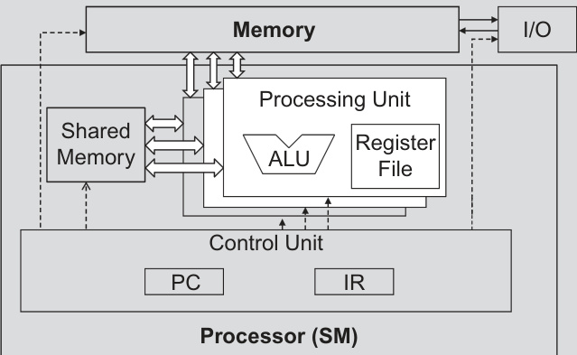

## Warp Execution via SIMD in CUDA

### Introdução

Este capítulo explora a implementação da execução de *warps* em CUDA utilizando a arquitetura SIMD (Single Instruction, Multiple Data). A arquitetura SIMD desempenha um papel fundamental na eficiência e no desempenho das GPUs, permitindo a execução paralela de instruções em múltiplos dados simultaneamente. Detalharemos como essa abordagem reduz custos de hardware, diminui o consumo de energia e possibilita otimizações de acesso à memória.

### Conceitos Fundamentais

A execução de *warps* em CUDA é baseada na arquitetura SIMD [^3]. Em uma arquitetura SIMD, uma única unidade de controle (control unit) busca e decodifica instruções. Este sinal de controle decodificado é então distribuído para múltiplas unidades de processamento (processing units), cada uma responsável por executar a instrução em um *thread* diferente dentro do *warp* [^3].

**Arquitetura SIMD e Warps:**

A arquitetura SIMD é crucial para o desempenho das GPUs. A ideia central é que, em muitas aplicações, operações similares precisam ser realizadas em grandes conjuntos de dados. Em vez de ter unidades de controle duplicadas para cada unidade de processamento, uma única unidade de controle é usada para distribuir a mesma instrução para todas as unidades de processamento. Isso resulta em uma significativa redução nos custos de hardware e no consumo de energia.



A imagem, referida na página 124 como sendo a mesma da Figura 5.4, ilustra a motivação para a execução de threads como warps, mostrando esquematicamente um processador (SM) com uma unidade de controle que busca e decodifica instruções. Um mesmo sinal de controle é enviado a múltiplas unidades de processamento, cada uma executando uma thread em um warp, destacando o conceito de Single Instruction, Multiple Data (SIMD), onde diferenças na execução ocorrem devido aos valores de operandos nos arquivos de registro. A figura detalha a interconexão entre a unidade de processamento (contendo ALU e arquivo de registradores), memória compartilhada, memória, unidade de controle (com PC e IR) e interfaces de I/O.

**Unidade de Controle e Unidades de Processamento:**

A unidade de controle é responsável por buscar a instrução na memória, decodificá-la e, em seguida, emitir os sinais de controle necessários para as unidades de processamento [^3]. Cada unidade de processamento executa a instrução com seus próprios dados, permitindo que um *warp* de *threads* execute a mesma instrução simultaneamente.

**Divergência de Threads:**

Apesar de todos os *threads* em um *warp* receberem a mesma instrução, as operações podem divergir devido a diferentes valores dos operandos de dados [^3]. Por exemplo, considere um *warp* executando uma instrução condicional `if (data[threadIdx] > 0) { ... }`. Alguns *threads* podem satisfazer a condição, enquanto outros não. Isso leva à execução serializada dos ramos da condição para os diferentes subconjuntos de *threads* dentro do *warp*.

**Vantagens da Arquitetura SIMD:**

*   **Redução de Custos de Hardware:** Compartilhando uma única unidade de controle entre múltiplos *threads*, o custo de hardware é significativamente reduzido.
*   **Menor Consumo de Energia:** A consolidação da lógica de controle diminui o consumo de energia, tornando as GPUs mais eficientes.
*   **Otimizações de Acesso à Memória:** A arquitetura SIMD permite otimizações de acesso à memória, como coalescing, onde múltiplos *threads* no mesmo *warp* acessam dados contíguos na memória, maximizando a largura de banda da memória.

**Exemplo:**

Considere um *warp* de 32 *threads* executando a seguinte linha de código:

```c++
result[threadIdx] = inputA[threadIdx] + inputB[threadIdx];
```

Cada *thread* dentro do *warp* realizará a adição de um elemento correspondente de `inputA` e `inputB`, armazenando o resultado em `result`. A unidade de controle busca a instrução de adição uma vez e a distribui para as 32 unidades de processamento, cada uma utilizando seu próprio `threadIdx` para acessar os dados corretos.

### Conclusão

A implementação da execução de *warps* usando a arquitetura SIMD é um componente chave para o desempenho e eficiência das GPUs em CUDA. A capacidade de executar a mesma instrução em múltiplos dados simultaneamente reduz custos de hardware, diminui o consumo de energia e permite otimizações de acesso à memória. Compreender como a arquitetura SIMD opera e lida com a divergência de *threads* é essencial para otimizar o desempenho de aplicações CUDA.

### Referências

[^3]: Warp execution is implemented using SIMD (Single Instruction, Multiple Data) hardware. This reduces hardware costs, lowers power consumption, and enables memory access optimizations. A single control unit fetches and decodes instructions, distributing the same control signal to multiple processing units, each handling a thread in the warp. Execution differences within a warp arise from different data operand values.
<!-- END -->