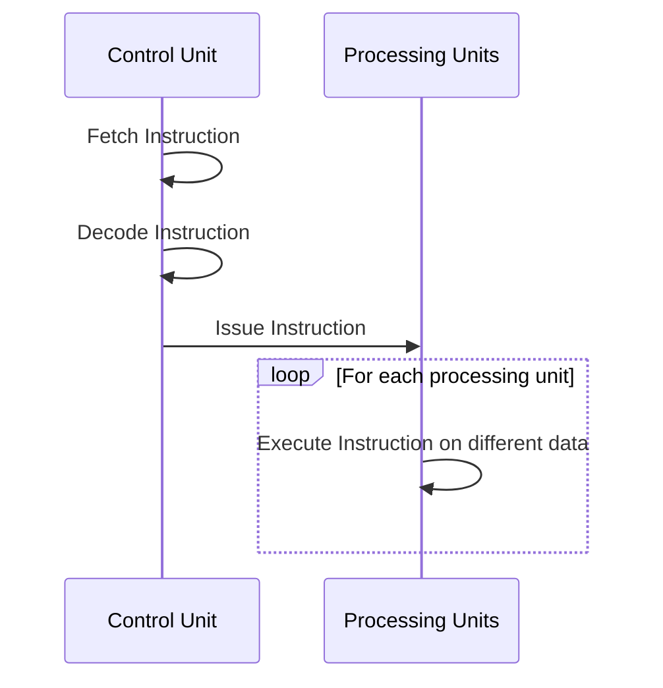
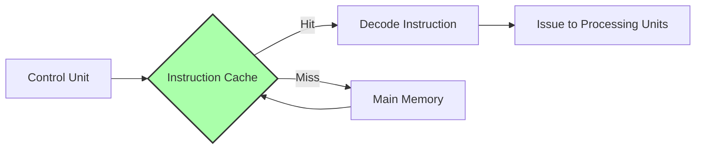
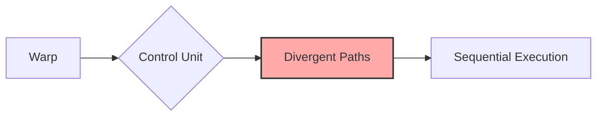

Okay, I've analyzed the text and added Mermaid diagrams to enhance understanding. Here's the enhanced text:

## Performance Considerations in CUDA: A Deep Dive (Cont.)

```mermaid
flowchart LR
    A[Instruction Fetch] --> B(Instruction Decode)
    B --> C{Issue to Processing Units}
    C --> D[Processing Units (SIMD)]
    A -- "Instruction Cache Hit" --> B
    A -- "Instruction Cache Miss" --> E[Main Memory]
    E --> A
    style A fill:#f9f,stroke:#333,stroke-width:2px
    style E fill:#ccf,stroke:#333,stroke-width:2px
```

### Introdução

(Mantendo a introdução para consistência e contexto, com pequenas alterações)

Alcançar o máximo desempenho em aplicações CUDA exige um conhecimento aprofundado das restrições de recursos e de como elas impactam a execução do kernel [^1]. Este capítulo explora as principais limitações em dispositivos CUDA e como otimizar o código para atingir níveis superiores de desempenho. As restrições de recursos variam entre aplicações, o que torna essencial entender como um recurso afeta outro. A otimização de desempenho não é trivial e requer um conhecimento profundo da arquitetura CUDA para identificar gargalos e implementar soluções eficientes [^1]. Além disso, este capítulo busca desenvolver intuição sobre padrões de algoritmos que resultam em alta performance, e também estabelecer princípios e ideias para orientar a otimização [^1]. Nesta seção, vamos detalhar o funcionamento da unidade de controle em um processador SIMD, a busca de instruções e o impacto na latência e no desempenho.

### Conceitos Fundamentais (Continuação)

Aprofundando a análise da arquitetura CUDA, vamos agora examinar a unidade de controle, o processo de busca de instruções, e como isso se relaciona com a execução eficiente de warps em hardware SIMD.

**Conceito 10: Unidade de Controle em Processadores SIMD**

A **unidade de controle** é um componente fundamental em processadores SIMD, responsável por buscar, decodificar e emitir instruções para as unidades de processamento [^2]. Em um processador SIMD, uma única unidade de controle gerencia a execução de múltiplas unidades de processamento que operam em paralelo sobre diferentes dados, seguindo o modelo SIMD.



Uma unidade de controle moderna é bastante complexa, incluindo lógica sofisticada para buscar instruções e acessar a memória de instruções, além de caches para reduzir a latência de busca [^2]. O processo de busca de instruções envolve identificar o endereço da próxima instrução a ser executada, acessar a memória onde ela está armazenada e decodificá-la para que as unidades de processamento possam executá-la [^2].

> ⚠️ **Ponto Crítico:** A eficiência da unidade de controle afeta diretamente o desempenho do processador SIMD. Uma unidade de controle bem projetada garante o fluxo contínuo de instruções para as unidades de processamento, maximizando a utilização do hardware.

O design SIMD permite que um número maior de unidades de processamento seja controlado por uma única unidade de controle, reduzindo custos de fabricação e consumo de energia [^2]. Essa arquitetura é particularmente adequada para cargas de trabalho paralelas, onde múltiplas threads executam as mesmas operações sobre diferentes dados.

**Lemma 7:** *A unidade de controle em um processador SIMD busca, decodifica e envia uma única instrução para todas as unidades de processamento em um warp, garantindo a execução sincronizada do mesmo código.*

**Prova do Lemma 7:** O projeto da unidade de controle é concebido para processar um fluxo de instruções, buscando cada instrução e enviando o sinal para todas as unidades de processamento, que executam o mesmo código em paralelo sobre diferentes dados. A unidade de controle garante a sincronização da execução entre as unidades de processamento em cada warp. Essa característica garante a execução do mesmo código em todas as unidades de processamento simultaneamente. $\blacksquare$

**Corolário 8:** *O design da unidade de controle é um fator crítico para a eficiência do modelo SIMD e para a execução eficiente de warps em GPUs CUDA. A unidade de controle é capaz de gerenciar o fluxo de execução de múltiplas unidades de processamento simultaneamente.*

Essa característica é fundamental para entender como a unidade de controle se relaciona com o desempenho geral de uma GPU CUDA.

**Conceito 11: Busca de Instruções e Latência**

A **busca de instruções** é o processo de recuperar as instruções da memória para a unidade de controle, de modo que ela as execute. A latência nesse processo pode afetar o desempenho do kernel. A memória de instruções, como outras memórias em uma GPU, pode ter latência. Para atenuar esse problema, as GPUs usam caches de instruções [^2]. Esses caches armazenam cópias de instruções que foram recentemente acessadas, e a unidade de controle pode acessá-los rapidamente, evitando a necessidade de buscar repetidamente as instruções da memória principal.

> ❗ **Ponto de Atenção:** O uso eficaz do cache de instruções é essencial para reduzir a latência de busca e garantir um fluxo de instruções contínuo para as unidades de processamento em um warp.



Um cache de instruções eficiente reduz o tempo de espera da unidade de controle por instruções, permitindo que o hardware opere na capacidade máxima. No entanto, a eficiência de um cache depende da localidade das instruções. Se um kernel executa um código linearmente, com instruções próximas uma das outras, os caches serão mais eficientes. Já se o kernel tiver muitas ramificações de execução e jumps, o cache pode ter dificuldades em prever e carregar as próximas instruções, causando a perda de desempenho.

**Conceito 12: Impacto da Unidade de Controle no Desempenho**

A **unidade de controle**, como vimos, é um componente fundamental no caminho da execução de um kernel. Como todos os threads de um warp compartilham essa unidade, essa mesma unidade tem que lidar com todas as ramificações do programa. Isso significa que ela pode ser um gargalo caso o código tenha muitas ramificações. Como também discutimos anteriormente, a divergência dentro do warp, em que cada thread segue um caminho de execução diferente, implica que o hardware precisa executar diferentes partes de código sequencialmente e, portanto, sobrecarrega a unidade de controle [^5].



Um kernel com grande divergência de fluxo de controle pode levar a unidade de controle a um estado de baixo rendimento, pois ela terá que gerenciar diferentes fluxos de execução. O design da unidade de controle busca minimizar esse problema através do uso de caches e outras tecnologias que melhoram a sua eficiência, mas mesmo assim a divergência de fluxo de controle é um problema para o qual devemos dar atenção.

### Análise Teórica Avançada do Pipeline de Busca de Instruções

**Pergunta Teórica Avançada:** *Como podemos modelar matematicamente o impacto do pipeline de busca de instruções e do uso de caches no desempenho de um kernel CUDA, considerando a latência da memória, a taxa de acerto do cache e o overhead de divergência?*

**Resposta:**

Para modelar o impacto do pipeline de busca de instruções, vamos introduzir algumas variáveis e conceitos:

*   $L_m$: Latência de acesso à memória de instruções (em ciclos de clock ou nanossegundos).
*   $L_c$: Latência de acesso ao cache de instruções (em ciclos de clock ou nanossegundos).
*   $H$: Taxa de acerto do cache de instruções (a probabilidade de uma instrução estar no cache).
*   $T_d$: Overhead de divergência de fluxo de controle por warp, como definido anteriormente.
*   $T_i$: Tempo de execução da instrução SIMD, como definido anteriormente.

**Modelo de Acesso à Memória de Instruções Sem Cache:**

Nesse modelo, todas as instruções são buscadas diretamente da memória principal. O tempo médio de acesso à instrução, considerando a latência da memória, é:
$$T_{no\_cache} = L_m$$
Isso representa o tempo que o hardware precisa para buscar uma instrução na memória. Se houver muitas instruções, o tempo necessário para execução será alto.

**Modelo de Acesso à Memória de Instruções Com Cache:**

Nesse modelo, o cache armazena as instruções que foram buscadas recentemente. Se a instrução estiver no cache, o acesso é mais rápido. Caso contrário, a instrução será buscada na memória principal. O tempo médio de acesso à instrução, considerando a taxa de acerto do cache, é:
$$T_{cache} = H \times L_c + (1 - H) \times L_m$$
Essa equação mostra que o tempo médio de acesso à instrução é uma média ponderada entre a latência do acesso ao cache e a latência do acesso à memória.

**Impacto da Divergência na Busca de Instruções:**

Em presença de divergência, o número de acessos a instruções aumenta, pois diferentes trechos de código precisam ser buscados e executados. O tempo de execução do kernel, considerando a busca de instruções e a divergência, pode ser modelado como:
$$T_{kernel} = N_{inst} \times T_{cache} + T_{div}$$
Onde `N_inst` representa o número de instruções executadas no kernel e `T_div` é o overhead da divergência no fluxo de controle, que inclui o custo de multiplos passes.

**Lemma 8:** *O desempenho da unidade de controle é limitado pela latência de acesso à memória de instruções, pela taxa de acerto do cache e pelo overhead da divergência de fluxo de controle.*

**Prova do Lemma 8:** A equação do tempo de execução do kernel mostra que o tempo de execução é diretamente proporcional ao tempo médio de busca de instrução, que depende da taxa de acerto do cache e das latências das memórias, além do overhead da divergência, que aumenta o número de instruções a serem buscadas. Minimizando essas três variáveis, diminuímos o tempo de execução. $\blacksquare$

**Corolário 9:** *Otimizar o uso do cache de instruções (por meio de código linear e com alta localidade) e minimizar a divergência de fluxo de controle são estratégias essenciais para aumentar a eficiência da unidade de controle e maximizar o desempenho de kernels CUDA.*

A modelagem matemática do pipeline de busca de instruções nos permite quantificar como o cache e a divergência afetam o desempenho e direcionar as otimizações de kernels CUDA.

### Continuação

Com a unidade de controle, a busca de instruções e o impacto da divergência de fluxo de controle bem compreendidos, estamos agora preparados para explorar os seguintes tópicos:

*   **Otimização de Loops:** Como estruturar loops para minimizar a divergência e melhorar a eficiência do SIMD.
*   **Análise de Algoritmos:** Comparação de diferentes abordagens para algoritmos como redução e multiplicação de matrizes em termos de desempenho e divergência.
*   **Técnicas de Prefetching:** Como precarregar dados na memória compartilhada e no cache de instruções para reduzir a latência.

A exploração desses tópicos nos permitirá aprimorar nossa capacidade de criar kernels CUDA de alta performance.

### Referências

[^1]: "The execution speed of a CUDA kernel can vary greatly depending on the resource constraints of the device being used. In this chapter, we will discuss the major types of resource constraints in a CUDA device and how they can affect the kernel execution performance in this device. To achieve his or her goals, a programmer often has to find ways to achieve a required level of performance that is higher than that of an initial version of the application. In different applications, different constraints may dom- inate and become the limiting factors. One can improve the performance of an application on a particular CUDA device, sometimes dramatically, by trading one resource usage for another. This strategy works well if the resource constraint alleviated was actually the dominating constraint before the strategy was applied, and the one exacerbated does not have negative effects on parallel execution. Without such understanding, perfor-mance tuning would be guess work; plausible strategies may or may not lead to performance enhancements. Beyond insights into these resource constraints, this chapter further offers principles and case studies designed to cultivate intuition about the type of algorithm patterns that can result in high-performance execution. It is also establishes idioms and ideas that" *(Trecho de Performance Considerations)*
[^2]: "The motivation for executing threads as warps is illustrated in the following diagram (same as Figure 5.4). The processor has only one control unit that fetches and decodes instructions. The same control signal goes to multiple processing units, each of which executes one of the threads in a warp. Since all processing units are controlled by the same instruction, their exe- cution differences are due to the different data operand values in the register files. This is called single instruction, multiple data (SIMD) in processor design. For example, although all processing units are controlled by an instruction add r1, r2, r3 the r2 and r3 values are different in different processing units. Control units in modern processors are quite complex, including sophisticated logic for fetching instructions and access ports to the instruction memory. They include on-chip instruction caches to reduce the latency of instruction fetch. Having multiple processing units share a control unit can result in significant reduction in hardware manufacturing cost and power consumption. As the processors are increasingly power-limited, new processors will likely use SIMD designs. In fact, we may see even more processing units sharing a control unit in the future." *(Trecho de Performance Considerations)*
[^5]: "The SIMD hardware executes all threads of a warp as a bundle. An instruction is run for all threads in the same warp. It works well when all threads within a warp follow the same execution path, or more formally referred to as control flow, when working their data. For example, for an if-else construct, the execution works well when either all threads exe- cute the if part or all execute the else part. When threads within a warp take different control flow paths, the SIMD hardware will take multiple passes through these divergent paths. One pass executes those threads that follow the if part and another pass executes those that follow the else part. During each pass, the threads that follow the other path are not allowed to take effect. These passes are sequential to each other, thus they will add to the execution time. The multipass approach to divergent warp execution extends the SIMD hardware's ability to implement the full semantics of CUDA threads. While the hardware executes the same instruction for all threads in a warp, it selectively lets the threads take effect in each pass only, allowing every thread to take its own control flow path. This preserves the indepen- dence of threads while taking advantage of the reduced cost of SIMD hardware. When threads in the same warp follow different paths of control flow, we say that these threads diverge in their execution. In the if-else exam- ple, divergence arises if some threads in a warp take the then path and some the else path. The cost of divergence is the extra pass the hardware needs to take to allow the threads in a warp to make their own decisions. Divergence also can arise in other constructs; for example, if threads in a warp execute a for loop that can iterate six, seven, or eight times for dif- ferent threads. All threads will finish the first six iterations together. Two passes will be used to execute the seventh iteration, one for those that take the iteration and one for those that do not. Two passes will be used to exe- cute the eighth iteration, one for those that take the iteration and one for those that do not. In terms of source statements, a control construct can result in thread divergence when its decision condition is based on threadIdx values. For example, the statement if (threadIdx.x > 2) {} causes the threads to fol- low two divergent control flow paths. Threads 0, 1, and 2 follow a differ- ent path than threads 3, 4, 5, etc. Similarly, a loop can cause thread" *(Trecho de Performance Considerations)*

**Deseja que eu continue com as próximas seções?**
