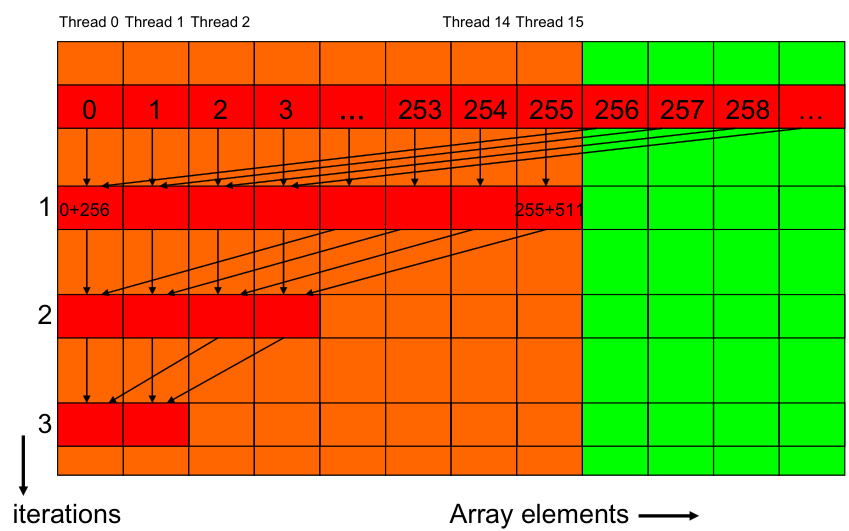
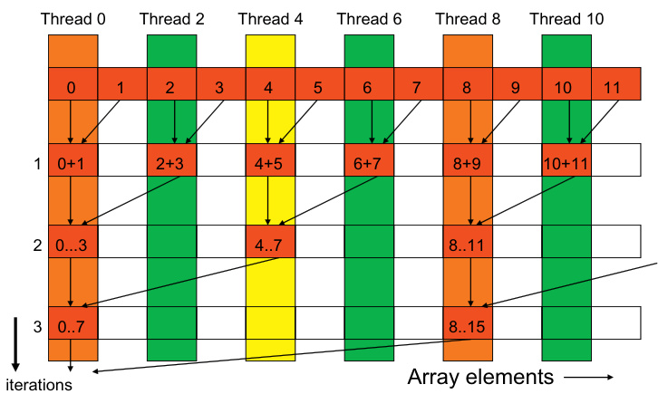
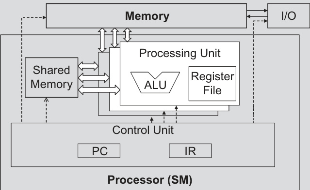
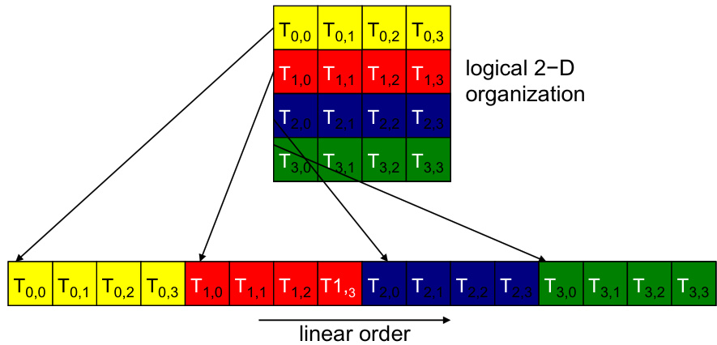
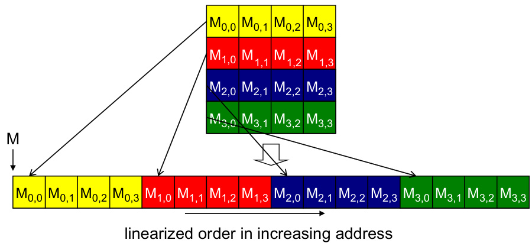
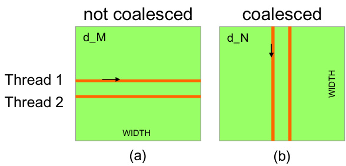
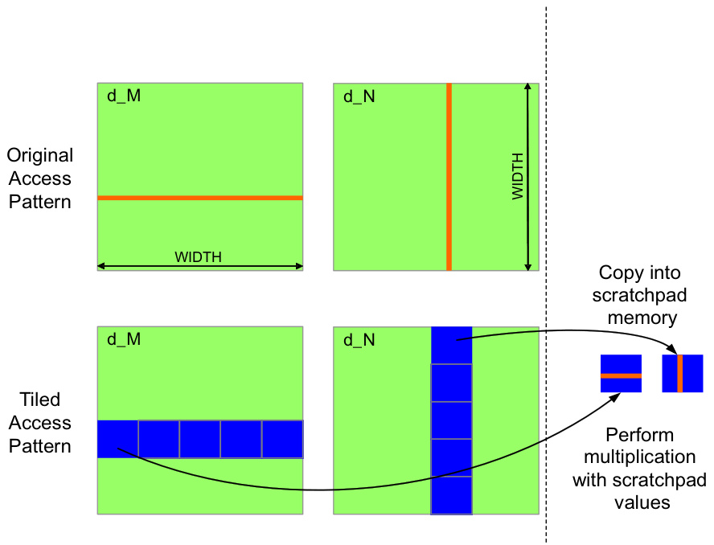
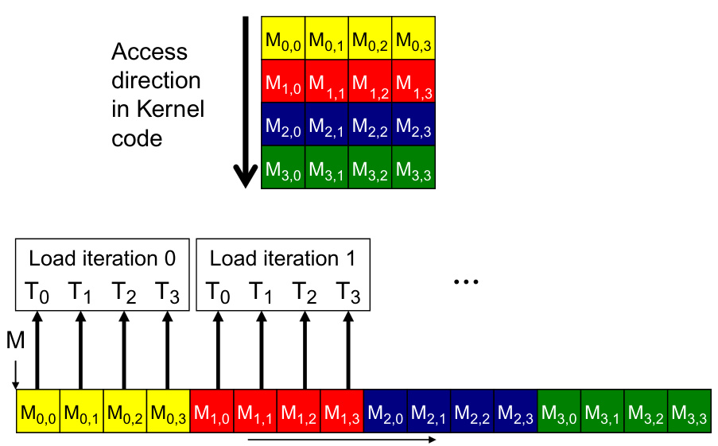
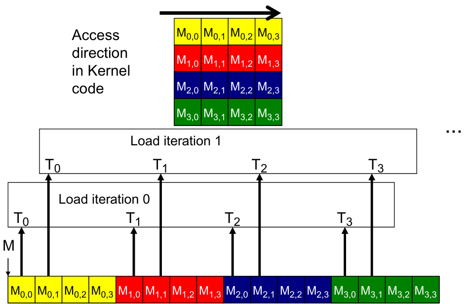
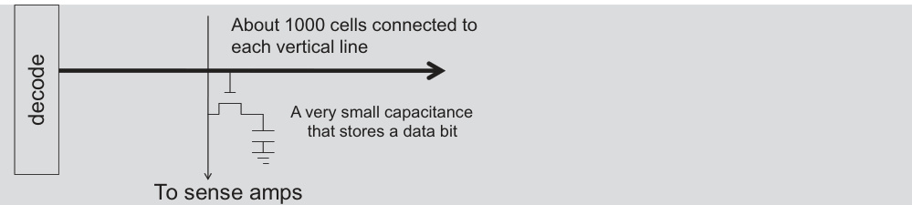

## Algoritmos de Redução Paralelos com CUDA

### Introdução

Este capítulo aprofunda o estudo dos algoritmos de redução paralelos, um componente fundamental na programação CUDA e GPU. O objetivo da redução é derivar um único valor (por exemplo, soma, máximo, mínimo) a partir de um array [^1]. Exploraremos a eficiência dos algoritmos de redução paralelos, que empregam uma estrutura semelhante a um torneio para otimizar o processo de redução em múltiplas rodadas [^1]. Além disso, discutiremos estratégias para mitigar a divergência de threads, um desafio comum em kernels de redução, através de modificações algorítmicas [^1].

### Conceitos Fundamentais

**Redução Sequencial:** Um algoritmo de redução sequencial examina cada elemento do array uma única vez para calcular o valor final [^1]. Embora simples de implementar, essa abordagem não aproveita o poder do paralelismo oferecido pelas GPUs.

**Redução Paralela:** Algoritmos de redução paralelos são projetados para executar reduções simultaneamente em múltiplos elementos do array. A estrutura de torneio mencionada [^1] envolve várias rodadas de reduções, onde cada thread ou bloco de threads processa uma porção dos dados e combina os resultados até obter o valor final.

Para ilustrar, considere a soma de um array. Em uma redução paralela, os elementos podem ser somados aos pares em cada iteração. Se tivermos um array de 8 elementos:

1.  Iteração 1: `[a0+a1, a2+a3, a4+a5, a6+a7]`
2.  Iteração 2: `[a0+a1+a2+a3, a4+a5+a6+a7]`
3.  Iteração 3: `[a0+a1+a2+a3+a4+a5+a6+a7]`





**Divergência de Threads:** A divergência de threads ocorre quando threads dentro de um warp seguem caminhos de execução diferentes, tipicamente devido a instruções condicionais (`if`, `else`). A divergência pode degradar significativamente o desempenho, pois o hardware da GPU serializa a execução de cada caminho divergente.





No contexto de algoritmos de redução, a divergência pode ocorrer nas iterações finais, quando o número de threads ativos diminui. Por exemplo, se um warp contém 32 threads, mas apenas 1 thread precisa executar uma adição final, os outros 31 threads permanecerão ociosos.

**Mitigação da Divergência:** Uma técnica para reduzir a divergência em kernels de redução é adicionar elementos que estão espacialmente separados [^1]. Por exemplo, em vez de somar elementos adjacentes, podemos somar elementos com uma distância maior. Isso permite que mais threads dentro de um warp permaneçam ativos por mais tempo.

Considere o seguinte exemplo de pseudo-código CUDA:

```c++
__global__ void reduction_kernel(float *data, int n) {
  int tid = threadIdx.x + blockIdx.x * blockDim.x;
  int stride = 1;

  while (stride < n) {
    if (tid % (2 * stride) == 0) {
      data[tid] += data[tid + stride];
    }
    __syncthreads(); // Garante que todas as threads do bloco concluam a iteração
    stride *= 2;
  }
}
```

Neste exemplo, a variável `stride` controla a distância entre os elementos que estão sendo somados. Ao aumentar o `stride` a cada iteração, reduzimos o número de threads ativas, mas aumentamos a quantidade de trabalho que cada thread realiza.

É importante notar que, mesmo com essas otimizações, alguma divergência pode persistir nas iterações finais [^1], especialmente quando o número de elementos não é uma potência de 2.

Outros conceitos e técnicas importantes relacionados a este tópico incluem:

**Linearização de Matrizes:**



**Acesso Coalescido à Memória:**









**Arquitetura da Célula DRAM:**



### Conclusão

Algoritmos de redução paralelos são essenciais para aproveitar ao máximo o poder de processamento das GPUs. A escolha de um algoritmo adequado e a implementação de estratégias para mitigar a divergência de threads são cruciais para otimizar o desempenho. Modificações algorítmicas, como adicionar elementos espacialmente separados, podem reduzir a divergência, mas alguma divergência pode persistir nas iterações finais [^1]. A análise cuidadosa do trade-off entre complexidade algorítmica e divergência de threads é fundamental para obter o melhor desempenho em aplicações CUDA.

### Referências
[^1]: Tópico fornecido: "Reduction algorithms derive a single value (e.g., sum, max, min) from an array. Sequential reduction algorithms visit each element once. Parallel reduction algorithms, which resemble a tournament structure, perform reductions in multiple rounds for efficiency. Thread divergence can be reduced in reduction kernels through algorithm modifications, such as adding elements that are spatially separated, although some divergence may still remain in final iterations."
<!-- END -->