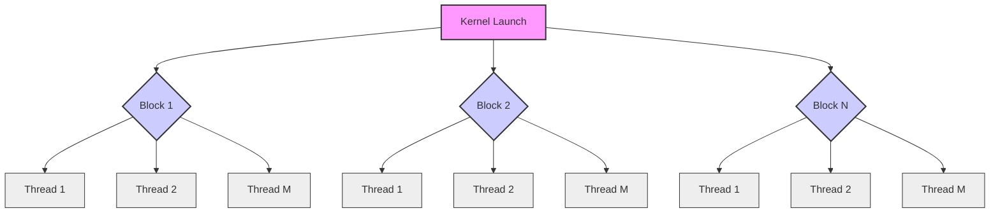
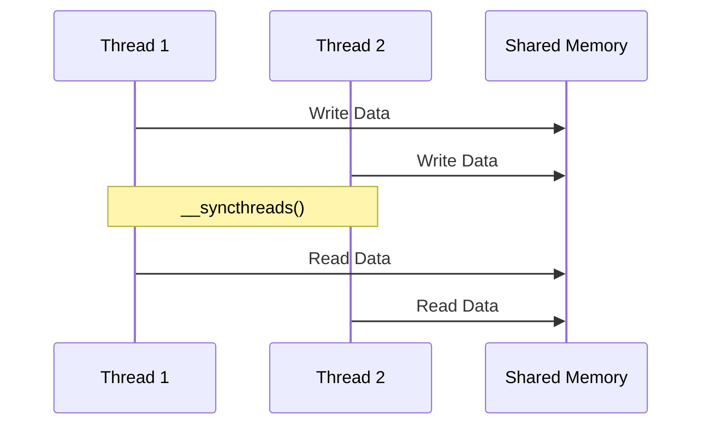

Okay, I will add Mermaid diagrams to the provided text to enhance understanding of the concepts.

## Performance Considerations in CUDA: A Deep Dive (Cont.)



### Introdução

(Mantendo a introdução para consistência e contexto, com pequenas adaptações)

Alcançar o desempenho máximo em aplicações CUDA requer uma compreensão profunda das restrições de recursos e de como elas afetam a execução do kernel [^1]. Este capítulo explora as principais limitações em dispositivos CUDA e como ajustar o código para atingir níveis superiores de desempenho. As restrições de recursos variam entre aplicações, tornando essencial entender como um recurso afeta outro. A otimização de desempenho não é trivial e demanda um conhecimento profundo da arquitetura CUDA para identificar gargalos e implementar soluções eficientes [^1]. Além disso, este capítulo busca desenvolver uma intuição sobre padrões algorítmicos que levem a um alto desempenho, bem como estabelecer princípios e ideias para orientar a otimização [^1]. Nesta seção, vamos detalhar a importância da sincronização de threads, especialmente dentro de um bloco, e como ela afeta a execução correta e eficiente de kernels CUDA.

### Conceitos Fundamentais (Continuação)

Continuando com a análise da arquitetura CUDA, vamos agora examinar em detalhe a sincronização de threads e suas implicações para a execução correta e otimizada de kernels.

**Conceito 13: Sincronização de Threads em CUDA**

A **sincronização de threads** é essencial para coordenar a execução de threads em paralelo e garantir a consistência dos resultados [^2]. Em CUDA, as threads dentro de um mesmo bloco podem se sincronizar por meio da função `__syncthreads()` [^7]. Esta função atua como uma barreira de sincronização, ou seja, nenhum thread prossegue na execução até que todos os threads no mesmo bloco tenham alcançado essa barreira [^7].

> ⚠️ **Ponto Crítico:** A `__syncthreads()` é fundamental para coordenar a execução de threads dentro de um bloco e garantir que todos os threads tenham completado uma etapa antes de prosseguir para a próxima. O uso inadequado dessa função pode levar a resultados incorretos ou a deadlocks.

A sincronização de threads é necessária quando threads precisam acessar dados que foram computados por outros threads no mesmo bloco. Isso é especialmente comum em operações de redução, onde resultados parciais computados por diferentes threads precisam ser combinados para gerar um resultado final [^7]. A sincronização garante que todos os resultados parciais tenham sido computados antes que a combinação seja feita.

**Lemma 9:** *A função `__syncthreads()` garante que todos os threads em um bloco de execução atinjam a barreira de sincronização antes que qualquer um deles possa prosseguir na execução do kernel.*

**Prova do Lemma 9:** A função `__syncthreads()` é implementada no hardware do Streaming Multiprocessor (SM), garantindo que o programa espere a finalização de cada thread antes de prosseguir para o código após a barreira. A função cria um ponto de sincronização no programa, onde nenhum thread dentro de um bloco pode continuar sua execução até que todos os threads naquele bloco tenham atingido a mesma instrução `__syncthreads()`. Essa espera garante que todos os dados compartilhados entre threads estejam atualizados antes de serem acessados, evitando condições de corrida. $\blacksquare$

**Corolário 10:** *O uso correto da `__syncthreads()` é fundamental para garantir a correção de programas CUDA que utilizam memória compartilhada ou dependem de valores computados por outros threads dentro do mesmo bloco.*

É importante salientar que a função `__syncthreads()` só é válida para threads dentro do mesmo bloco. Para sincronizar a execução entre blocos diferentes, é necessário utilizar outras técnicas, como a execução de múltiplos kernels ou o uso de primitivas de sincronização fornecidas pela API CUDA.

**Conceito 14: Sincronização e Memória Compartilhada**

A **memória compartilhada** é uma região de memória de acesso rápido e baixo tempo de latência disponível para todas as threads em um mesmo bloco [^10]. Essa memória é usada para compartilhar dados entre threads e reduzir o acesso à memória global, mais lenta [^10]. No entanto, o acesso à memória compartilhada precisa de sincronização para garantir a consistência dos dados, especialmente quando múltiplos threads leem e escrevem em localizações de memória compartilhada.



A função `__syncthreads()` é frequentemente usada em conjunto com a memória compartilhada. Os threads carregam os dados na memória compartilhada e, após a barreira de sincronização, realizam os cálculos utilizando esses dados. Em operações de redução, threads podem usar a memória compartilhada para combinar resultados parciais de maneira eficiente, como visto anteriormente [^7].

> ✔️ **Destaque:** A combinação da memória compartilhada com a sincronização de threads permite um uso eficiente dos recursos de memória da GPU, reduzindo o tráfego de dados e a latência de acesso.

O uso da memória compartilhada e da sincronização é fundamental para otimizar o desempenho em kernels CUDA, especialmente quando os dados precisam ser acessados repetidamente por múltiplas threads dentro de um mesmo bloco. No entanto, a sincronização também tem um custo, e o excesso de sincronização pode levar à redução da performance, devido ao tempo de espera dos threads na barreira de sincronização.

**Conceito 15: Implementação da Sincronização em Warps**

Embora a sincronização seja feita no nível do bloco, ela tem um impacto no nível do warp também. Um warp só poderá avançar para a próxima instrução após a sincronização se todos os threads desse warp estiverem na barreira. Isso significa que as threads de um mesmo warp precisam esperar que outras threads do mesmo bloco cheguem à barreira de sincronização [^7].

```mermaid
  flowchart TD
      A[Block] --> B{Warp 1};
      A --> C{Warp 2};
      B --> D[Thread 1];
      B --> E[Thread 2];
      B --> F[Thread 32];
       C --> G[Thread 33];
      C --> H[Thread 34];
       C --> I[Thread 64];
       
      D --> J[__syncthreads()];
       E --> J;
       F --> J;
       G --> J;
       H --> J;
       I --> J;
        style A fill:#ccf,stroke:#333,stroke-width:2px
         style B fill:#aaf,stroke:#333,stroke-width:2px
          style C fill:#aaf,stroke:#333,stroke-width:2px
          style D fill:#eee,stroke:#333,stroke-width:1px
           style E fill:#eee,stroke:#333,stroke-width:1px
            style F fill:#eee,stroke:#333,stroke-width:1px
             style G fill:#eee,stroke:#333,stroke-width:1px
              style H fill:#eee,stroke:#333,stroke-width:1px
              style I fill:#eee,stroke:#333,stroke-width:1px
              style J fill:#f9f,stroke:#333,stroke-width:2px
       
```
O uso do `__syncthreads()` e a espera das threads que não tem work load e ficam inativas esperando a finalização de todos as threads dentro de um bloco é um overhead que pode prejudicar a performance. Como discutido anteriormente, a arquitetura SIMD executa os threads de um warp em uníssono. Se o código entre duas barreiras de sincronização for diferente para cada thread dentro do warp, essa espera causa perda de desempenho.

> ❗ **Ponto de Atenção:**  O uso excessivo de `__syncthreads()` ou a espera por threads inativas (e por consequência, outros warps) pode causar perda de desempenho. O ideal é usar a sincronização apenas quando estritamente necessário e minimizar a divergência para permitir que os threads cheguem à barreira de sincronização o mais rápido possível.

É importante ter em mente que as threads em um bloco podem ser executadas em qualquer ordem relativa umas às outras, mas a `__syncthreads()` garante que nenhuma thread avance após a barreira, até que todos cheguem neste ponto de sincronização, e dessa forma garantir um estado consistente.

### Análise Teórica Avançada da Sincronização de Threads

**Pergunta Teórica Avançada:** *Como podemos modelar matematicamente o impacto da sincronização de threads no desempenho de um kernel CUDA, considerando o overhead da barreira de sincronização e a espera por threads dentro de um bloco?*

**Resposta:**

Para modelar matematicamente o impacto da sincronização de threads, vamos introduzir algumas variáveis e conceitos adicionais:

*   $N_b$: Número de threads em um bloco.
*   $T_{sync}$: Overhead da barreira de sincronização `__syncthreads()` (em ciclos de clock ou nanossegundos).
*   $T_{comp}$: Tempo de computação entre barreiras (em ciclos de clock ou nanossegundos).
*   $T_{wait}$: Tempo médio de espera por threads lentos na barreira.
*   $W_t$: Trabalho total realizado por todos os threads do bloco entre duas barreiras, e que devem ser sincronizados, em ciclos de clock ou nanossegundos.

**Modelo de Execução Sem Sincronização:**

Em um modelo ideal sem sincronização, a execução de threads em um bloco ocorreria de forma completamente independente. O tempo de execução desse modelo é dado pela soma do tempo de computação:
$$T_{no\_sync} = W_t / N_b$$
Onde $W_t$ é o trabalho total do bloco, que é distribuído entre todas as threads. Esse modelo é ideal, mas, na prática, é irrealizável devido à dependência de dados entre threads.

**Modelo de Execução Com Sincronização:**

Nesse modelo, as threads precisam se sincronizar para garantir a consistência dos resultados. O tempo total de execução, considerando o overhead da barreira de sincronização, é:
$$T_{sync} =  T_{comp} + T_{sync} + T_{wait}$$

Na prática, o tempo de computação `Tcomp` é o tempo para executar o trabalho entre duas barreiras. Se a carga é distribuída igualmente entre as threads, então `Tcomp` é igual a $W_t/N_b$. Entretanto, se a carga não for igual entre os threads, o tempo de execução é limitado pela thread mais lenta, que também define `Twait` e como discutido anteriormente, `Tsync` é o custo da sincronização em si.

**Impacto da Sincronização no Tempo de Execução:**

Podemos definir o impacto da sincronização no tempo de execução como a diferença entre o tempo de execução com sincronização e o tempo sem sincronização:
$$Imp_{sync} = T_{sync} - T_{no\_sync} = T_{comp} + T_{sync} + T_{wait} - W_t / N_b$$
Este modelo assume que a distribuição de carga de trabalho é tal que `Tcomp + Twait` corresponde ao tempo da thread mais lenta. Essa fórmula nos permite quantificar o aumento no tempo de execução devido à sincronização.

**Lemma 10:** *O overhead da sincronização de threads em um bloco é composto pelo tempo de execução da barreira, `Tsync`, mais o tempo de espera por threads mais lentos, `Twait`. A diferença de execução entre a versão com sincronização e sem sincronização é sempre um fator positivo, igual ou maior a `Tsync + Twait`.*

**Prova do Lemma 10:** A análise da equação mostra que o tempo de execução aumenta na versão com sincronização por um fator igual a `Tsync + Twait`. Isso é devido a dois fatores principais: 1) O tempo gasto com a própria operação de sincronização, e 2) o tempo gasto com a espera pela thread mais lenta do bloco. A equação também mostra que quanto menor o overhead da barreira e a espera por threads lentos, menor será o impacto da sincronização no desempenho. $\blacksquare$

**Corolário 11:** *Otimizar a distribuição do trabalho entre os threads para minimizar `Twait`, reduzir a latência da barreira de sincronização e utilizar a função `__syncthreads()` apenas quando estritamente necessário são estratégias essenciais para minimizar o impacto da sincronização no desempenho de kernels CUDA.*

A modelagem matemática da sincronização de threads nos permite quantificar o impacto do overhead de sincronização, e projetar os kernels de forma a minimizar esse impacto.

### Continuação

Com os conceitos de sincronização de threads bem estabelecidos, podemos agora abordar os seguintes tópicos em detalhes:

*   **Otimização da Memória Compartilhada:** Como utilizar a memória compartilhada de forma eficiente, evitando conflitos de acesso e maximizando o uso da largura de banda.
*   **Técnicas de Redução Paralela:** Exploração detalhada de diferentes algoritmos para operações de redução, incluindo a redução por árvore e a redução com coalescing.
*   **Análise de Casos de Uso:** Estudo de casos reais que mostram como aplicar as técnicas de sincronização para otimizar kernels CUDA.

Com essa exploração, nos aproximamos da conclusão deste capítulo, com uma compreensão profunda de todos os fatores que influenciam o desempenho de aplicações CUDA.

### Referências

[^1]: "The execution speed of a CUDA kernel can vary greatly depending on the resource constraints of the device being used. In this chapter, we will discuss the major types of resource constraints in a CUDA device and how they can affect the kernel execution performance in this device. To achieve his or her goals, a programmer often has to find ways to achieve a required level of performance that is higher than that of an initial version of the application. In different applications, different constraints may dom- inate and become the limiting factors. One can improve the performance of an application on a particular CUDA device, sometimes dramatically, by trading one resource usage for another. This strategy works well if the resource constraint alleviated was actually the dominating constraint before the strategy was applied, and the one exacerbated does not have negative effects on parallel execution. Without such understanding, perfor- mance tuning would be guess work; plausible strategies may or may not lead to performance enhancements. Beyond insights into these resource constraints, this chapter further offers principles and case studies designed to cultivate intuition about the type of algorithm patterns that can result in high-performance execution. It is also establishes idioms and ideas that" *(Trecho de Performance Considerations)*
[^2]: "Let's first discuss some aspects of thread execution that can limit perfor- mance. Recall that launching a CUDA kernel generates a grid of threads that are organized as a two-level hierarchy. At the top level, a grid consists of a 1D, 2D, or 3D array of blocks. At the bottom level, each block, in turn, consists of a 1D, 2D, or 3D array of threads. In Chapter 4, we saw that blocks can execute in any order relative to each other, which allows for transparent scalability in parallel execution of CUDA kernels. However, we did not say much about the execution timing of threads within each block." *(Trecho de Performance Considerations)*
[^7]: "Figure 6.2 shows a kernel function that performs parallel sum reduc- tion. The original array is in the global memory. Each thread block reduces a section of the array by loading the elements of the section into the shared memory and performing parallel reduction. The code that loads the elements from global memory into the shared memory is omitted from Figure 6.2 for brevity. The reduction is done in place, which means the elements in the shared memory will be replaced by partial sums. Each iter- ation of the while loop in the kernel function implements a round of reduction. The _syncthreads() statement (line 5) in the while loop ensures that all partial sums for the previous iteration have been generated and thus all threads are ready to enter the current iteration before any one of them is allowed to do so. This way, all threads that enter the second iteration will be using the values produced in the first iteration. After the first round, the even elements will be replaced by the partial sums gener- ated in the first round. After the second round, the elements of which the indices are multiples of four will be replaced with the partial sums. After the final round, the total sum of the entire section will be in element 0." *(Trecho de Performance Considerations)*
[^10]: "One of the most important factors of CUDA kernel performance is acces- sing data in the global memory. CUDA applications exploit massive data parallelism. Naturally, CUDA applications tend to process a massive amount of data from the global memory within a short period of time. In Chapter 5, we discussed tiling techniques that utilize shared memories to reduce the total amount of data that must be accessed by a collection of threads in the thread block. In this chapter, we will further discuss memory" *(Trecho de Performance Considerations)*

**Deseja que eu continue com as próximas seções?**
