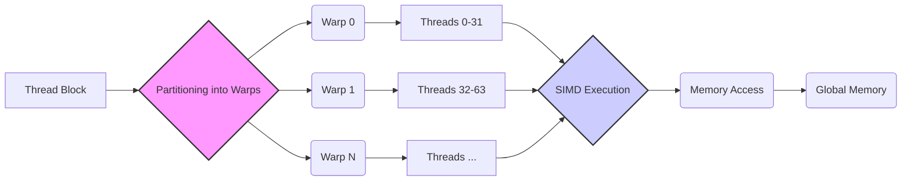

Okay, I will add Mermaid diagrams to enhance the text as requested.

## Performance Considerations in CUDA: A Deep Dive (Cont.)



### Introdução

(Mantendo a introdução para consistência e contexto, com pequenas alterações)

Alcançar o desempenho máximo em aplicações CUDA exige uma compreensão profunda das restrições de recursos e de como elas impactam a execução do kernel [^1]. Este capítulo explora as principais limitações em dispositivos CUDA e como ajustar o código para atingir níveis superiores de desempenho. As restrições de recursos variam entre aplicações, tornando essencial entender como um recurso afeta outro. A otimização de desempenho não é trivial e demanda um conhecimento profundo da arquitetura CUDA para identificar gargalos e implementar soluções eficientes [^1]. Além disso, este capítulo busca desenvolver uma intuição sobre padrões algorítmicos que levam a um alto desempenho, bem como estabelecer princípios e ideias para orientar a otimização [^1]. Nesta seção, vamos detalhar o particionamento de blocos de threads em warps, como isso afeta a execução e os cuidados necessários para evitar problemas de desempenho.

### Conceitos Fundamentais (Continuação)

Aprofundando a análise da arquitetura CUDA, vamos agora examinar detalhadamente o processo de particionamento de blocos de threads em warps e como esse processo impacta o desempenho do kernel.

**Conceito 16: Particionamento de Blocos em Warps**

Em dispositivos CUDA, os blocos de threads são divididos em **warps** para facilitar a execução pelo hardware SIMD [^3]. Cada warp é uma unidade de execução que consiste em 32 threads (em arquiteturas CUDA comuns) que executam a mesma instrução simultaneamente [^3]. O particionamento de um bloco em warps é um processo fundamental, e a ordem em que os threads são agrupados em warps pode afetar a eficiência da execução do kernel.

> ⚠️ **Ponto Crítico:** O particionamento de blocos em warps é uma etapa fundamental na execução de kernels CUDA e sua forma de implementação afeta diretamente a eficiência da execução, pois influencia a organização dos threads dentro dos warps.

A forma como os threads são particionados em warps é baseada em seus índices. Para blocos de threads organizados em um array 1D (usando apenas `threadIdx.x`), a partição é direta: os threads com índices consecutivos e crescentes são agrupados no mesmo warp [^3]. Por exemplo, em um warp de tamanho 32, o warp 0 contém os threads 0 a 31, o warp 1 contém os threads 32 a 63, e assim por diante [^3]. Para blocos de threads de tamanhos que não são múltiplos de 32, o último warp é preenchido com threads adicionais para completar os 32 threads [^3]. Em blocos com mais de uma dimensão, a linearização segue um padrão *row-major* e depois os threads são particionados [^4].

**Lemma 11:** *O particionamento de blocos de threads em warps segue uma ordem linear baseada nos índices dos threads, onde os índices mais baixos são agrupados em warps iniciais, e os índices mais altos são agrupados em warps subsequentes. Os threads são organizados como um array 1D e depois particionados em warps.*

**Prova do Lemma 11:** A função de particionamento é definida de forma a agrupar as threads por ordem crescente de seus índices. Se a organização do bloco for 1D, a organização é direta. Caso contrário, a organização é feita pela linearização *row-major* dos índices: primeiro, o índice z, depois o y e depois o x. A função garante que cada warp contenha 32 threads consecutivas na ordem linear. $\blacksquare$

**Corolário 12:** *O particionamento linear dos threads em warps garante que threads dentro do mesmo warp acessem dados próximos na memória, possibilitando o coalescing e maximizando o uso da largura de banda da memória global. O particionamento de blocos de threads é feito a partir dos índices dos threads.*

Essa organização linear também tem um impacto na execução, como veremos adiante.

**Conceito 17: Padded Warps**

Como mencionado anteriormente, quando o tamanho de um bloco de threads não é um múltiplo do tamanho do warp, o último warp é preenchido com **threads extras** [^3]. Essas threads extras, que podem não executar nenhuma instrução útil, são conhecidas como *padded threads*.

```mermaid
flowchart LR
    A[Thread Block (48 threads)] --> B{Partitioning into Warps};
    B --> C(Warp 0);
    B --> D(Warp 1);
    C --> E[Threads 0-31];
    D --> F[Threads 32-47];
    F --> G[Padded Threads];
    style G fill:#faa,stroke:#333,stroke-width:2px
    style D fill:#ccf,stroke:#333,stroke-width:2px
```

Por exemplo, se um bloco tem 48 threads, ele será particionado em dois warps. O primeiro warp conterá as threads 0 a 31, e o segundo warp conterá as threads 32 a 47 e, para completar o warp, 16 threads extras serão adicionadas [^3]. Essas threads extras podem ter um impacto negativo no desempenho, pois o hardware SIMD precisa executar as mesmas instruções para todos os threads em um warp, mesmo que algumas threads não realizem operações úteis.

> ❗ **Ponto de Atenção:** Os *padded warps* podem levar ao desperdício de recursos de computação, e é importante considerar o uso de tamanhos de bloco que sejam múltiplos do tamanho do warp para minimizar este problema. O overhead pode ser alto se muitos blocos tem esse problema.

Além do overhead, os *padded warps* podem também dificultar o entendimento do código e gerar erros inesperados caso o programador não esteja ciente deles. É importante garantir que o código trate de forma correta as threads extras. Em muitos casos, é necessário fazer com que elas não realizem operações.

**Conceito 18: Impacto do Particionamento no Desempenho**

O particionamento de blocos em warps tem um impacto significativo no desempenho, especialmente quando o tamanho do bloco não é um múltiplo do tamanho do warp. Em tais casos, os *padded warps* levam ao desperdício de recursos de computação, e também dificultam a otimização de código [^3].

Além disso, a organização das threads nos warps afeta a eficiência do coalescing. Como os threads em um warp executam a mesma instrução SIMD, e threads contíguos em um warp acessam posições de memória contíguas na memória global, a escolha do tamanho de bloco pode afetar também a eficiência do acesso da memória global.

### Análise Teórica Avançada do Particionamento de Warps

**Pergunta Teórica Avançada:** *Como podemos modelar matematicamente o impacto do particionamento de blocos de threads em warps no desempenho de um kernel CUDA, considerando a presença de padded warps e a sua influência no coalescing e no overhead da execução SIMD?*

**Resposta:**

Para modelar matematicamente o impacto do particionamento de blocos em warps, vamos introduzir algumas variáveis e conceitos adicionais:

*   $N_b$: Número de threads em um bloco.
*   $N_w$: Número de threads em um warp (tipicamente 32).
*   $N_{warp}$: Número de warps em um bloco.
*   $N_{pad}$: Número de threads extras no último warp, se $N_b$ não for um múltiplo de $N_w$.
*   $T_i$: Tempo de execução de uma instrução SIMD (sem divergência).
*   $T_{pad}$: Tempo adicional devido aos *padded threads* em um warp.
*   $B_s$: Tamanho do bloco de dados transferido na memória em um acesso coalescido.
*   $B_{ef\_c}$: Largura de banda efetiva da memória em um acesso coalescido.

**Modelo de Particionamento Ideal:**

Em um cenário ideal, onde o tamanho do bloco é um múltiplo do tamanho do warp, não há *padded threads*. O número de warps no bloco é dado por:
$$N_{warp} = \frac{N_b}{N_w}$$
O tempo de execução de um warp é dado por `T_i`, e não há overhead devido a *padded threads*.

**Modelo de Particionamento Não Ideal (Com *Padded Warps*):**

Neste cenário, o tamanho do bloco não é um múltiplo do tamanho do warp, e o último warp é preenchido com *padded threads*. O número de warps no bloco é dado por:
$$N_{warp} = \lceil \frac{N_b}{N_w} \rceil$$
O número de *padded threads* é dado por:
$$N_{pad} = N_{warp} \times N_w - N_b$$
O tempo de execução do último warp é dado por `T_i + T_pad`, onde `T_pad` é o tempo adicional devido ao processamento das threads extras no warp, que executam instruções sem fazerem trabalho útil.

**Impacto do Particionamento no Desempenho:**

O tempo de execução total de um bloco é dado pela soma do tempo de execução de todos os warps. Em um caso ideal:
$$T_{block\_ideal} = N_{warp} \times T_i$$
Já no caso com *padded warps*:
$$T_{block} = (N_{warp} -1) \times T_i + T_i + T_{pad} $$
Em que o último warp tem um custo adicional.

**Lemma 12:** *O impacto do particionamento de blocos de threads em warps no desempenho é dado pelo overhead adicional causado pelos *padded warps*, que executam instruções para threads que não fazem trabalho útil.*

**Prova do Lemma 12:** Na versão com *padded warps*, o tempo do último warp aumenta por um fator igual ao overhead dos *padded threads* (`Tpad`). Assim, se temos varios blocos com *padded warps*, o tempo de execução aumentará em proporção ao número deles. Se o trabalho fosse distribuído de forma igualitária, o número de instruções executadas e tempo de execução seria menor. $\blacksquare$

**Corolário 13:** *A escolha do tamanho do bloco de threads deve ser feita de forma a minimizar o número de *padded warps*. Utilizar tamanhos de blocos que sejam múltiplos do tamanho do warp é uma estratégia essencial para maximizar o desempenho e reduzir o impacto dos *padded threads* na execução do kernel.*

A modelagem matemática do particionamento de warps nos permite quantificar o impacto das escolhas do tamanho do bloco no desempenho.

### Continuação

Com o particionamento de warps compreendido, estamos agora preparados para explorar os seguintes tópicos:

*   **Tiling e Memória Compartilhada:** Como usar a técnica de tiling para reduzir o acesso à memória global e melhorar o desempenho.
*   **Otimização de Redução:** Diferentes abordagens para a redução paralela, considerando a divergência de warps, o coalescing e o uso da memória compartilhada.
*   **Profiling de Kernels:** Como usar ferramentas de profiling para identificar gargalos de desempenho e otimizar kernels CUDA.

A exploração desses tópicos nos permitirá aprimorar nossa capacidade de projetar kernels CUDA de alta performance.

### Referências

[^1]: "The execution speed of a CUDA kernel can vary greatly depending on the resource constraints of the device being used. In this chapter, we will discuss the major types of resource constraints in a CUDA device and how they can affect the kernel execution performance in this device. To achieve his or her goals, a programmer often has to find ways to achieve a required level of performance that is higher than that of an initial version of the application. In different applications, different constraints may dom- inate and become the limiting factors. One can improve the performance of an application on a particular CUDA device, sometimes dramatically, by trading one resource usage for another. This strategy works well if the resource constraint alleviated was actually the dominating constraint before the strategy was applied, and the one exacerbated does not have negative effects on parallel execution. Without such understanding, perfor-mance tuning would be guess work; plausible strategies may or may not lead to performance enhancements. Beyond insights into these resource constraints, this chapter further offers principles and case studies designed to cultivate intuition about the type of algorithm patterns that can result in high-performance execution. It is also establishes idioms and ideas that" *(Trecho de Performance Considerations)*
[^3]: "As we discussed in Chapter 4, current CUDA devices bundle several threads for execution. Each thread block is partitioned into warps. The execution of warps are implemented by an SIMD hardware (see “Warps and SIMD Hardware” sidebar). This implementation technique helps to reduce hardware manufacturing cost, lower runtime operation electricity cost, and enable some optimizations in servicing memory accesses. In the foreseeable future, we expect that warp partitioning will remain as a popu- lar implementation technique. However, the size of a warp can easily vary from implementation to implementation. Up to this point in time, all CUDA devices have used similar warp configurations where each warp consists of 32 threads. Thread blocks are partitioned into warps based on thread indices. If a thread block is organized into a 1D array (i.e., only threadIdx.x is used), the partition is straightforward; threadIdx.x values within a warp are consecutive and increasing. For a warp size of 32, warp 0 starts with thread 0 and ends with thread 31, warp 1 starts with thread 32 and ends with thread 63. In general, warp n starts with thread 32 × n and ends with thread 32(n + 1) – 1. For a block of which the size is not a multiple of 32, the last warp will be padded with extra threads to fill up the 32 threads. For example, if a block has 48 threads, it will be partitioned into two warps, and its warp 1 will be padded with 16 extra threads." *(Trecho de Performance Considerations)*
[^4]: "For blocks that consist of multiple dimensions of threads, the dimen- sions will be projected into a linear order before partitioning into warps. The linear order is determined by placing the rows with larger y and z coordinates after those with lower ones. That is, if a block consists of two dimensions of threads, one would form the linear order by placing all threads of which threadIdx.y is 1 after those of which threadIdx.y is 0, threads of which threadIdx.y is 2 after those of which threadIdx.y is 1, and so on." *(Trecho de Performance Considerations)*

**Deseja que eu continue com as próximas seções?**
