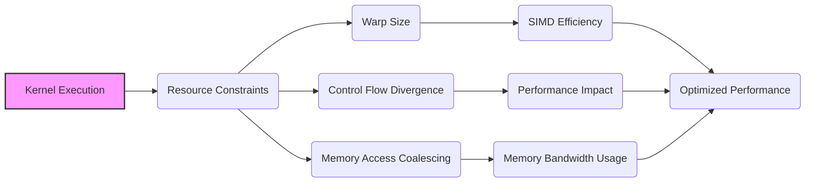
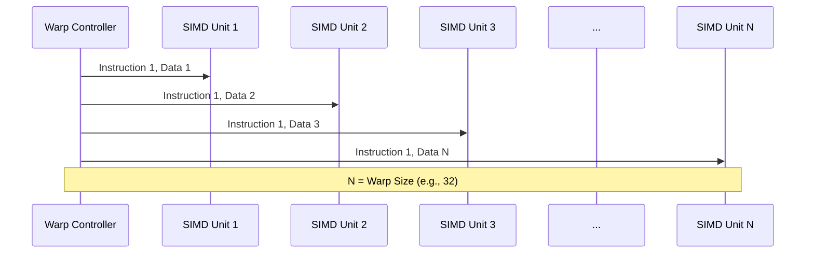
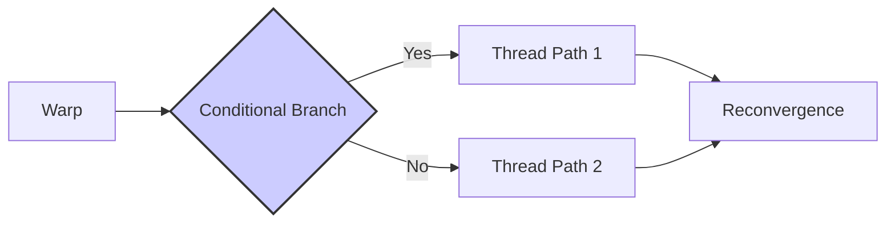
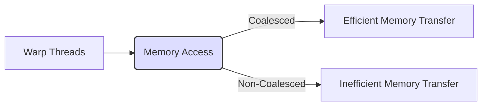

Okay, I understand. Here's the enhanced text with Mermaid diagrams added:

## Performance Considerations in CUDA: A Deep Dive (Cont.)

### Introdução

(Mantendo a introdução para consistência e contexto, com pequenas adaptações)

Alcançar o máximo desempenho em aplicações CUDA requer um entendimento profundo das restrições de recursos e de como elas impactam a execução do kernel [^1]. Este capítulo explora as principais limitações em dispositivos CUDA e como ajustar o código para atingir níveis superiores de desempenho. As restrições de recursos variam entre aplicações, tornando essencial entender como um recurso afeta outro. A otimização de desempenho não é trivial e demanda um conhecimento profundo da arquitetura CUDA para identificar gargalos e implementar soluções eficientes [^1]. Além disso, este capítulo busca desenvolver uma intuição sobre padrões algorítmicos que levem a um alto desempenho, bem como estabelecer princípios e ideias para orientar a otimização [^1]. Nesta seção, vamos detalhar a importância do tamanho do warp e como ele afeta o desempenho, a divergência de fluxo de controle e o uso eficiente do hardware SIMD.

### Conceitos Fundamentais (Continuação)

Continuando com a análise da arquitetura CUDA, vamos agora examinar em detalhe o impacto do tamanho do warp no desempenho e na eficiência da execução de kernels.

**Conceito 19: Tamanho do Warp e a Arquitetura SIMD**

O **tamanho do warp** é um parâmetro fixo da arquitetura que determina o número de threads que executam a mesma instrução simultaneamente [^3]. Em GPUs CUDA comuns, o tamanho do warp é tipicamente 32 threads. O tamanho do warp está intimamente ligado à arquitetura SIMD, que busca executar operações idênticas em múltiplos dados ao mesmo tempo.

> ⚠️ **Ponto Crítico:** O tamanho do warp é um fator fundamental no projeto de GPUs CUDA e é diretamente relacionado à quantidade de unidades de processamento SIMD que compartilham uma mesma unidade de controle. Esse número é fixo para cada arquitetura.

O tamanho do warp influencia diretamente a eficiência da execução SIMD. Um warp de 32 threads permite que o hardware SIMD processe 32 elementos de dados em paralelo, o que é ideal para aplicações com alto grau de paralelismo de dados. Um tamanho de warp inadequado pode levar a um baixo uso do hardware SIMD, divergência de fluxo de controle e acesso ineficiente à memória.

**Lemma 13:** *O tamanho do warp define o nível de paralelismo no nível mais baixo da arquitetura CUDA. A quantidade de unidades de processamento que operam em paralelo é determinada pelo tamanho do warp, que define quantas threads executam a mesma instrução ao mesmo tempo.*

**Prova do Lemma 13:** A arquitetura SIMD (Single Instruction, Multiple Data) funciona enviando a mesma instrução para múltiplas unidades de processamento. Cada unidade executa essa instrução sobre diferentes dados, o que gera o paralelismo de dados. O tamanho do warp define quantas unidades de processamento compartilham a mesma unidade de controle. Portanto, ele define a quantidade de dados que o hardware SIMD consegue operar simultaneamente. $\blacksquare$

**Corolário 14:** *A escolha do tamanho do warp é um fator determinante para o aproveitamento do paralelismo na execução do kernel e tem impacto direto no desempenho e na eficiência energética do hardware SIMD.*

É fundamental entender que o tamanho do warp não é um parâmetro ajustável pelo programador, mas uma característica fixa da arquitetura da GPU. O programador deve adequar o código ao tamanho de warp oferecido pelo hardware.

**Conceito 20: Impacto do Tamanho do Warp na Divergência**

Como vimos anteriormente, a **divergência de fluxo de controle** ocorre quando threads dentro de um mesmo warp seguem diferentes caminhos de execução devido a condicionais ou loops [^5]. O tamanho do warp influencia o impacto da divergência.

Um warp com um tamanho maior terá uma maior probabilidade de divergência quando houver condicionais ou loops que afetem os índices das threads, uma vez que um número maior de threads pode tomar caminhos de execução diferentes. Por outro lado, um warp menor terá menor divergência, uma vez que a quantidade de threads que tem mais chance de divergir será menor, mas terá um desempenho geral inferior devido a menor quantidade de unidades de processamento SIMD trabalhando simultaneamente.

> ❗ **Ponto de Atenção:**  Em kernels com alta divergência, um tamanho de warp menor pode levar a uma menor perda de performance devido à divergência, mas essa redução da divergência tem um custo, que é o menor número de threads executando simultaneamente.

O impacto da divergência é diretamente proporcional ao número de threads que divergem dentro do mesmo warp. A escolha do tamanho do bloco e a organização dos dados também podem afetar a frequência da divergência dentro do mesmo warp.

**Conceito 21: Impacto do Tamanho do Warp no Coalescing**

O **coalescing** é uma técnica de otimização que permite que threads dentro de um warp acessem posições de memória consecutivas na memória global, o que maximiza o uso da largura de banda da memória [^10]. O tamanho do warp influencia a eficiência do coalescing.

Um warp maior precisa acessar uma maior quantidade de posições de memória consecutivas para garantir o coalescing. Caso contrário, o acesso à memória pode ser ineficiente. Por outro lado, um warp menor acessará menos posições consecutivas, o que pode diminuir o impacto de um acesso não coalescido.

> ✔️ **Destaque:** Um tamanho de warp adequado, alinhado com o padrão de acesso à memória do kernel, pode melhorar significativamente a eficiência do coalescing e, consequentemente, o desempenho. Um tamanho de warp menor, mesmo com acesso não coalescido, pode trazer um melhor desempenho em certas situações.

É fundamental analisar o padrão de acesso à memória do kernel e o tamanho do warp para garantir o coalescing adequado. O tamanho do bloco deve ser escolhido de forma a garantir o número certo de warps para o coalescing funcionar.

### Análise Teórica Avançada do Impacto do Tamanho do Warp

**Pergunta Teórica Avançada:** *Como podemos modelar matematicamente o impacto do tamanho do warp no desempenho de um kernel CUDA, considerando o trade-off entre o aumento do paralelismo e o overhead de divergência e a perda do coalescing?*

**Resposta:**

Para modelar matematicamente o impacto do tamanho do warp, vamos introduzir algumas variáveis e conceitos adicionais:

*   $N_w$: Número de threads em um warp (tamanho do warp).
*   $T_i$: Tempo de execução de uma instrução SIMD (sem divergência).
*   $T_{div}(N_w)$: Overhead de divergência de fluxo de controle em um warp de tamanho $N_w$.
*   $B_{ef\_c}(N_w)$: Largura de banda efetiva da memória com coalescing em um warp de tamanho $N_w$.
*   $N_b$: Número de threads em um bloco.
*   $N_{warp}$: Número de warps por bloco.
*   $W$: Trabalho total realizado por um bloco.
*   $T_g$: Tempo de acesso à memória global por bloco.

**Modelo de Execução com Diferentes Tamanhos de Warp:**

Vamos considerar o impacto do tamanho do warp no tempo de execução, considerando a divergência de fluxo de controle e o coalescing.
O número de warps em um bloco pode ser calculado como:
$$N_{warp} = \frac{N_b}{N_w}$$.

O tempo de execução com tamanho de warp arbitrário é dado por:
$$T_{warp} = N_{warp} \times (T_i + T_{div}(N_w)) + T_{g} $$,
onde, $T_{div}(N_w)$ depende do número de threads no warp, e a latência na memória global ($T_g$) depende de $B_{ef\_c}(N_w)$, que depende do tamanho do warp.

**Impacto da Divergência e do Coalescing no Desempenho:**

O impacto da divergência no tempo de execução aumenta com o tamanho do warp. Um tamanho de warp grande pode significar que um maior número de threads pode seguir caminhos de execução distintos, resultando em um tempo de execução maior e menor eficiência.

Por outro lado, um warp maior pode possibilitar um maior coalescing, caso os acessos na memória global sejam realizados de forma adequada.

**Lemma 14:** *O tamanho ideal do warp, que minimiza o tempo de execução de um bloco, representa um trade-off entre a maximização da utilização do hardware SIMD, a redução da divergência de fluxo de controle e o aumento da eficiência do coalescing.*

**Prova do Lemma 14:** A equação acima mostra que não existe um tamanho ideal universal para o warp, pois depende de três fatores: o tamanho do warp, e como isso influencia a divergência e o coalescing. $\blacksquare$

**Corolário 15:** *O tamanho do warp é uma característica fixa da arquitetura da GPU, mas o programador pode adaptar o código para otimizar o desempenho, buscando minimizar a divergência de fluxo de controle, maximizar o coalescing, ajustar os blocos de acordo com o tamanho do warp e, assim, maximizar o uso do hardware SIMD para o tamanho de warp existente.*

A modelagem matemática do tamanho do warp nos permite entender a importância da escolha de um tamanho de bloco adequado para cada tipo de aplicação, que equilibre o paralelismo, a divergência e o coalescing.

### Continuação

Com a compreensão do impacto do tamanho do warp, podemos agora avançar para os seguintes tópicos:

*   **Otimização de Kernels de Redução:** Como utilizar diferentes algoritmos para reduzir os dados de forma eficiente.
*   **Algoritmos de Multiplicação de Matrizes:** Exploração de diferentes abordagens para a multiplicação de matrizes, considerando o coalescing, a memória compartilhada e o tamanho dos blocos.
*   **Uso de Ferramentas de Profiling:** Como usar as ferramentas de profiling para identificar gargalos e pontos de otimização nos kernels CUDA.

Com esse conhecimento, podemos criar aplicações CUDA mais eficientes e de alto desempenho.

### Referências

[^1]: "The execution speed of a CUDA kernel can vary greatly depending on the resource constraints of the device being used. In this chapter, we will discuss the major types of resource constraints in a CUDA device and how they can affect the kernel execution performance in this device. To achieve his or her goals, a programmer often has to find ways to achieve a required level of performance that is higher than that of an initial version of the application. In different applications, different constraints may dom- inate and become the limiting factors. One can improve the performance of an application on a particular CUDA device, sometimes dramatically, by trading one resource usage for another. This strategy works well if the resource constraint alleviated was actually the dominating constraint before the strategy was applied, and the one exacerbated does not have negative effects on parallel execution. Without such understanding, perfor-mance tuning would be guess work; plausible strategies may or may not lead to performance enhancements. Beyond insights into these resource constraints, this chapter further offers principles and case studies designed to cultivate intuition about the type of algorithm patterns that can result in high-performance execution. It is also establishes idioms and ideas that" *(Trecho de Performance Considerations)*
[^3]: "As we discussed in Chapter 4, current CUDA devices bundle several threads for execution. Each thread block is partitioned into warps. The execution of warps are implemented by an SIMD hardware (see “Warps and SIMD Hardware” sidebar). This implementation technique helps to reduce hardware manufacturing cost, lower runtime operation electricity cost, and enable some optimizations in servicing memory accesses. In the foreseeable future, we expect that warp partitioning will remain as a popu- lar implementation technique. However, the size of a warp can easily vary from implementation to implementation. Up to this point in time, all CUDA devices have used similar warp configurations where each warp consists of 32 threads." *(Trecho de Performance Considerations)*
[^5]: "The SIMD hardware executes all threads of a warp as a bundle. An instruction is run for all threads in the same warp. It works well when all threads within a warp follow the same execution path, or more formally referred to as control flow, when working their data. For example, for an if-else construct, the execution works well when either all threads exe- cute the if part or all execute the else part. When threads within a warp take different control flow paths, the SIMD hardware will take multiple passes through these divergent paths. One pass executes those threads that follow the if part and another pass executes those that follow the else part. During each pass, the threads that follow the other path are not allowed to take effect. These passes are sequential to each other, thus they will add to the execution time. The multipass approach to divergent warp execution extends the SIMD hardware's ability to implement the full semantics of CUDA threads. While the hardware executes the same instruction for all threads in a warp, it selectively lets the threads take effect in each pass only, allowing every thread to take its own control flow path. This preserves the indepen- dence of threads while taking advantage of the reduced cost of SIMD hardware. When threads in the same warp follow different paths of control flow, we say that these threads diverge in their execution. In the if-else exam- ple, divergence arises if some threads in a warp take the then path and some the else path. The cost of divergence is the extra pass the hardware needs to take to allow the threads in a warp to make their own decisions. Divergence also can arise in other constructs; for example, if threads in a warp execute a for loop that can iterate six, seven, or eight times for dif- ferent threads. All threads will finish the first six iterations together. Two passes will be used to execute the seventh iteration, one for those that take the iteration and one for those that do not. Two passes will be used to exe- cute the eighth iteration, one for those that take the iteration and one for those that do not. In terms of source statements, a control construct can result in thread divergence when its decision condition is based on threadIdx values. For example, the statement if (threadIdx.x > 2) {} causes the threads to fol- low two divergent control flow paths. Threads 0, 1, and 2 follow a differ- ent path than threads 3, 4, 5, etc. Similarly, a loop can cause thread" *(Trecho de Performance Considerations)*
[^10]: "One of the most important factors of CUDA kernel performance is acces- sing data in the global memory. CUDA applications exploit massive data parallelism. Naturally, CUDA applications tend to process a massive amount of data from the global memory within a short period of time. In Chapter 5, we discussed tiling techniques that utilize shared memories to reduce the total amount of data that must be accessed by a collection of threads in the thread block. In this chapter, we will further discuss memory" *(Trecho de Performance Considerations)*

**Deseja que eu continue com as próximas seções?**
