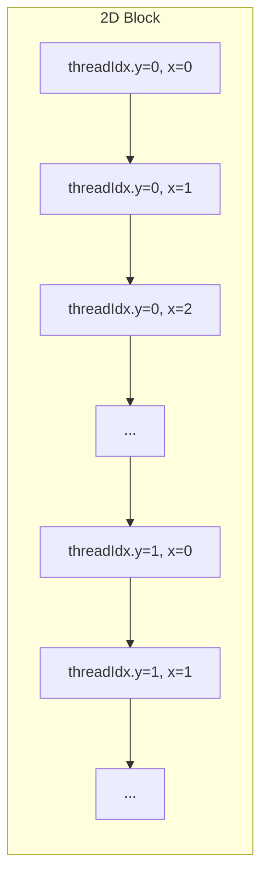
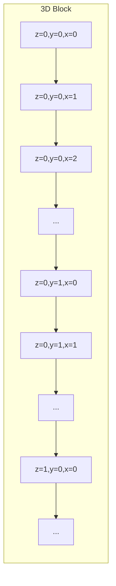
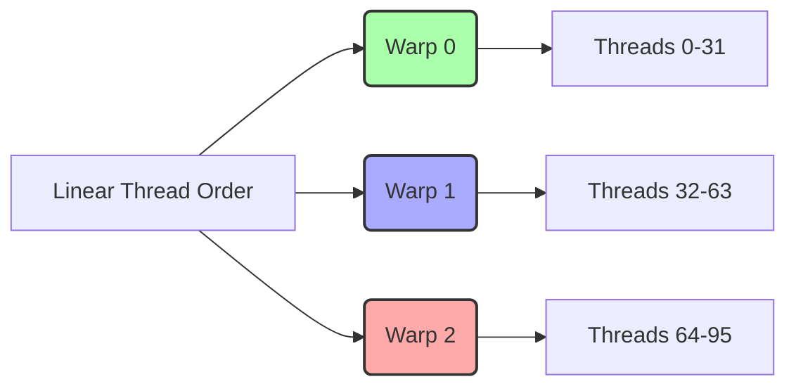

Okay, I've analyzed the provided text and added Mermaid diagrams to enhance understanding of the concepts related to CUDA thread indexing, warp formation, and memory access. Here's the enhanced text with the diagrams:

## Performance Considerations in CUDA: A Deep Dive (Cont.)

```mermaid
flowchart LR
    A["Thread Block"] -->|Thread Indices (threadIdx.x, threadIdx.y, threadIdx.z)| B("Linear Thread Order");
    B -->|Warp Partitioning| C("Warps");
    C -->|Memory Access Pattern| D["Global Memory"];
    style A fill:#f9f,stroke:#333,stroke-width:2px
    style D fill:#ccf,stroke:#333,stroke-width:2px
```

### Introdução

(Mantendo a introdução para consistência e contexto, com pequenas alterações)

Alcançar o máximo desempenho em aplicações CUDA requer uma compreensão profunda das restrições de recursos e de como elas impactam a execução do kernel [^1]. Este capítulo explora as principais limitações em dispositivos CUDA e como ajustar o código para atingir níveis superiores de desempenho. As restrições de recursos variam entre aplicações, tornando essencial entender como um recurso afeta outro. A otimização de desempenho não é trivial e demanda um conhecimento profundo da arquitetura CUDA para identificar gargalos e implementar soluções eficientes [^1]. Além disso, este capítulo busca desenvolver uma intuição sobre padrões algorítmicos que levem a um alto desempenho, bem como estabelecer princípios e ideias para orientar a otimização [^1]. Nesta seção, vamos explorar em detalhes o mapeamento de índices de thread para a ordem linear de threads dentro de um bloco, como esse mapeamento afeta o particionamento em warps e como ele se relaciona com o acesso à memória.

### Conceitos Fundamentais (Continuação)

Continuando com a análise da arquitetura CUDA, vamos agora examinar em detalhe como o mapeamento dos índices de threads influencia o particionamento em warps e o acesso à memória.

**Conceito 22: Índices de Threads e Espaço de Execução**

Os índices de thread (`threadIdx.x`, `threadIdx.y` e `threadIdx.z`) são utilizados para identificar cada thread dentro de um bloco [^2]. Esses índices são definidos como variáveis internas do kernel, e cada thread tem um conjunto único de valores para esses índices [^2]. A combinação desses índices determina a posição da thread dentro do bloco, o que influencia a forma como ela acessa dados e participa da execução SIMD.

> ⚠️ **Ponto Crítico:** Os índices de thread são a base para a computação paralela em CUDA e seu mapeamento para a ordem linear de threads influencia o particionamento de warps, o acesso à memória e a eficiência da execução.

O espaço de execução de um kernel é definido pela combinação de grids e blocos de threads. Cada bloco de threads opera de forma independente e pode executar em qualquer ordem relativa aos outros blocos. Os índices de thread determinam a posição de cada thread dentro do bloco, e essa posição influencia diretamente a forma como cada thread acessa os dados e participa das computações paralelas.

**Lemma 15:** *Os índices de thread (`threadIdx.x`, `threadIdx.y` e `threadIdx.z`) mapeiam cada thread para uma posição única dentro do espaço de execução de um bloco, e essa posição é a base para o particionamento em warps.*

**Prova do Lemma 15:** Os índices `threadIdx.x`, `threadIdx.y` e `threadIdx.z` definem as coordenadas de cada thread dentro de um bloco de threads. Como cada thread tem um conjunto único desses índices, cada thread tem uma posição única no espaço de execução do bloco. O particionamento dos threads em warps usa o mapeamento linear criado pelos índices. $\blacksquare$

**Corolário 16:** *O mapeamento dos índices de threads para posições no bloco é a base para o particionamento em warps e também para as operações de acesso à memória, e afeta diretamente o desempenho das aplicações CUDA.*

O entendimento de como os índices de thread são mapeados para posições lineares e como isso influencia os warps é essencial para otimizar o desempenho do kernel.

**Conceito 23: Mapeamento Linear de Índices de Thread**

Para o particionamento de blocos em warps, os índices de thread são mapeados para uma ordem linear. A forma como essa ordem é construída depende da organização do bloco de threads [^4]. Para um bloco 1D (com apenas `threadIdx.x`), a ordem linear é simplesmente a sequência crescente dos valores de `threadIdx.x` [^3].


Para blocos 2D e 3D, a ordem linear é construída colocando as linhas com índices `y` e `z` maiores depois das linhas com índices menores [^4]. Assim, todos os threads com `threadIdx.y` igual a 0 são posicionados antes dos threads com `threadIdx.y` igual a 1, e assim por diante. O mesmo princípio se aplica para `threadIdx.z`, e a ordem final da linearização é dada por `(threadIdx.z, threadIdx.y, threadIdx.x)`.




> ✔️ **Destaque:**  O mapeamento linear dos índices de threads para uma ordem sequencial é essencial para o particionamento em warps e para o coalescing. O hardware do CUDA utiliza essa ordem linear para agrupar as threads dentro de um warp.

Essa ordem linear é fundamental para otimizar o acesso à memória global e para garantir que os threads em um warp acessam dados contíguos na memória.

**Conceito 24: Relação entre o Mapeamento e o Particionamento de Warps**

O mapeamento linear dos índices de threads é usado para particionar o bloco de threads em warps. Os primeiros 32 threads na ordem linear formam o primeiro warp, os próximos 32 formam o segundo warp, e assim por diante [^3]. Essa forma de particionar os threads garante que os threads que estão no mesmo warp acessam dados consecutivos na memória quando o padrão de acesso é o adequado para o coalescing.



Para os blocos 1D, essa organização é direta. Para os blocos 2D e 3D, o mapeamento linear é essencial para o funcionamento do modelo SIMD, e influencia tanto a divergência de fluxo de controle como o acesso à memória global.

> ❗ **Ponto de Atenção:** Um entendimento claro do mapeamento dos índices de thread para a ordem linear é crucial para o correto particionamento dos blocos de threads em warps, o que, por sua vez, tem um impacto direto no desempenho do kernel.

A escolha do tamanho do bloco e o mapeamento correto dos dados são fatores essenciais para o correto particionamento em warps.

### Análise Teórica Avançada do Mapeamento de Índices de Thread

**Pergunta Teórica Avançada:** *Como podemos definir formalmente o mapeamento de índices de thread para a ordem linear e derivar matematicamente o índice global para um thread, considerando blocos 1D, 2D e 3D, e como essa ordem afeta a coalescência?*

**Resposta:**

Vamos definir formalmente o mapeamento de índices de thread para a ordem linear e derivar o índice global para um thread, e como isso afeta a coalescência de memória.

**Definições:**

*   `threadIdx.x`, `threadIdx.y`, `threadIdx.z`: Índices locais de thread dentro de um bloco.
*   `blockDim.x`, `blockDim.y`, `blockDim.z`: Dimensões do bloco de threads.
*   `blockIdx.x`, `blockIdx.y`, `blockIdx.z`: Índices do bloco dentro de uma grid.
*   `gridDim.x`, `gridDim.y`, `gridDim.z`: Dimensões da grid de blocos.
*   `linearIndex`: Índice linear do thread dentro do bloco.
*   `globalIndex`: Índice global do thread dentro da grid.

**Mapeamento Linear de Índices de Thread:**

O mapeamento linear de índices de thread para um bloco 3D é dado por:
$$linearIndex = threadIdx.z \times blockDim.y \times blockDim.x + threadIdx.y \times blockDim.x + threadIdx.x$$

Para um bloco 2D, onde `blockDim.z = 1`, a equação se reduz a:
$$linearIndex = threadIdx.y \times blockDim.x + threadIdx.x$$

Para um bloco 1D, onde `blockDim.y = 1` e `blockDim.z = 1`, a equação se reduz a:
$$linearIndex = threadIdx.x$$

**Índice Global de um Thread:**

O índice global de um thread é calculado a partir do índice do bloco e o índice do thread dentro do bloco. Para uma grid 3D, o índice global é dado por:
$$globalIndex = (blockIdx.z \times gridDim.y \times gridDim.x + blockIdx.y \times gridDim.x + blockIdx.x) \times (blockDim.z \times blockDim.y \times blockDim.x) + linearIndex$$
Para um grid 2D, a equação se reduz a:
$$globalIndex = (blockIdx.y \times gridDim.x + blockIdx.x) \times (blockDim.y \times blockDim.x) + linearIndex$$

Para um grid 1D, a equação se reduz a:
$$globalIndex = blockIdx.x \times blockDim.x + linearIndex$$

**Impacto na Coalescência:**

O mapeamento linear dos índices de threads, quando combinado com o acesso correto à memória global, pode gerar acesso coalescido. Por exemplo, se threads em um warp acessam memória usando o índice `linearIndex`, os acessos serão coalescidos, já que os threads dentro de um warp terão linearIndex consecutivos. A forma como a memória global é acessada no kernel, alinhada com a ordem do `linearIndex` é o que irá definir a coalescência.
Se a memória global é acessada de forma não linear, com uma expressão que depende de `blockIdx`, `threadIdx` e `linearIndex` , o acesso não será coalescido.

**Lemma 16:** *O índice linear de um thread, obtido pelo mapeamento dos índices locais, é o fator chave para o particionamento em warps e, quando alinhado com o padrão de acesso à memória, pode gerar acesso coalescido à memória global, maximizando a largura de banda.*

**Prova do Lemma 16:**  O índice linear determina como os threads são organizados em um bloco e particionados em warps.  Quando o acesso à memória usa índices de thread que são consecutivos no mapeamento linear de um warp, o hardware é capaz de gerar um acesso coalescido. $\blacksquare$

**Corolário 17:** *Um entendimento profundo do mapeamento de índices de thread para a ordem linear é essencial para a criação de kernels eficientes em CUDA, onde o acesso à memória global é feita utilizando o `linearIndex` ou uma função de  `linearIndex`, maximizando o uso do hardware SIMD e da memória.*

A modelagem matemática do mapeamento de índices de threads nos permite criar kernels mais eficientes em CUDA, onde o mapeamento dos threads é essencial para otimizar tanto a execução SIMD como os acessos à memória.

### Continuação

Tendo compreendido a importância do mapeamento de índices de thread e do particionamento de warps, vamos agora abordar os seguintes tópicos:

*   **Técnicas de Otimização de Memória:** Como utilizar a memória compartilhada para reduzir a dependência da memória global e como organizar os dados para maximizar o coalescing.
*   **Balanceamento de Carga:** Como dividir o trabalho de forma eficiente entre as threads, evitando gargalos e maximizando a utilização dos recursos do hardware.
*   **Uso de Bibliotecas CUDA:** Como utilizar as bibliotecas de CUDA para implementar algoritmos de forma eficiente e com baixo esforço de desenvolvimento.

Com esses tópicos, concluímos a nossa exploração da otimização de kernels CUDA e estamos preparados para criar aplicações de alto desempenho.

### Referências

[^1]: "The execution speed of a CUDA kernel can vary greatly depending on the resource constraints of the device being used. In this chapter, we will discuss the major types of resource constraints in a CUDA device and how they can affect the kernel execution performance in this device. To achieve his or her goals, a programmer often has to find ways to achieve a required level of performance that is higher than that of an initial version of the application. In different applications, different constraints may dom- inate and become the limiting factors. One can improve the performance of an application on a particular CUDA device, sometimes dramatically, by trading one resource usage for another. This strategy works well if the resource constraint alleviated was actually the dominating constraint before the strategy was applied, and the one exacerbated does not have negative effects on parallel execution. Without such understanding, perfor-mance tuning would be guess work; plausible strategies may or may not lead to performance enhancements. Beyond insights into these resource constraints, this chapter further offers principles and case studies designed to cultivate intuition about the type of algorithm patterns that can result in high-performance execution. It is also establishes idioms and ideas that" *(Trecho de Performance Considerations)*
[^2]: "Let's first discuss some aspects of thread execution that can limit perfor- mance. Recall that launching a CUDA kernel generates a grid of threads that are organized as a two-level hierarchy. At the top level, a grid consists of a 1D, 2D, or 3D array of blocks. At the bottom level, each block, in turn, consists of a 1D, 2D, or 3D array of threads. In Chapter 4, we saw that blocks can execute in any order relative to each other, which allows for transparent scalability in parallel execution of CUDA kernels. However, we did not say much about the execution timing of threads within each block." *(Trecho de Performance Considerations)*
[^3]: "As we discussed in Chapter 4, current CUDA devices bundle several threads for execution. Each thread block is partitioned into warps. The execution of warps are implemented by an SIMD hardware (see “Warps and SIMD Hardware” sidebar). This implementation technique helps to reduce hardware manufacturing cost, lower runtime operation electricity cost, and enable some optimizations in servicing memory accesses. In the foreseeable future, we expect that warp partitioning will remain as a popu- lar implementation technique. However, the size of a warp can easily vary from implementation to implementation. Up to this point in time, all CUDA devices have used similar warp configurations where each warp consists of 32 threads. Thread blocks are partitioned into warps based on thread indices. If a thread block is organized into a 1D array (i.e., only threadIdx.x is used), the partition is straightforward; threadIdx.x values within a warp are consecutive and increasing. For a warp size of 32, warp 0 starts with thread 0 and ends with thread 31, warp 1 starts with thread 32 and ends with thread 63. In general, warp n starts with thread 32 × n and ends with thread 32(n + 1) – 1. For a block of which the size is not a multiple of 32, the last warp will be padded with extra threads to fill up the 32 threads. For example, if a block has 48 threads, it will be partitioned into two warps, and its warp 1 will be padded with 16 extra threads." *(Trecho de Performance Considerations)*
[^4]: "For blocks that consist of multiple dimensions of threads, the dimen- sions will be projected into a linear order before partitioning into warps. The linear order is determined by placing the rows with larger y and z coordinates after those with lower ones. That is, if a block consists of two dimensions of threads, one would form the linear order by placing all threads of which threadIdx.y is 1 after those of which threadIdx.y is 0, threads of which threadIdx.y is 2 after those of which threadIdx.y is 1, and so on." *(Trecho de Performance Considerations)*

**Deseja que eu continue com as próximas seções?**
