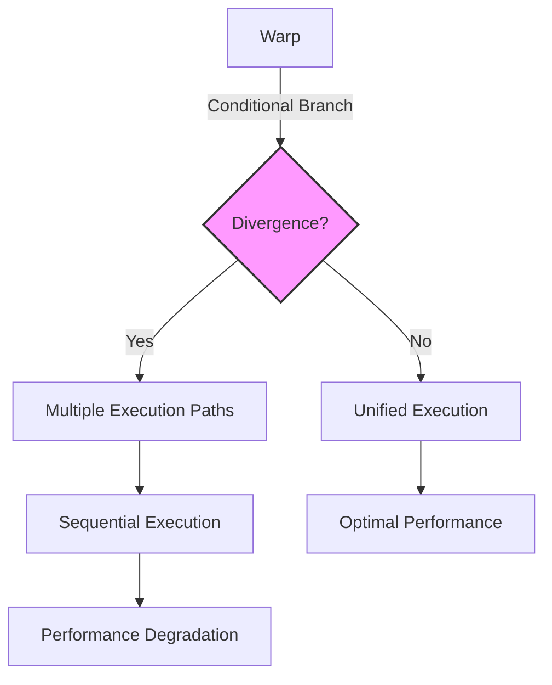
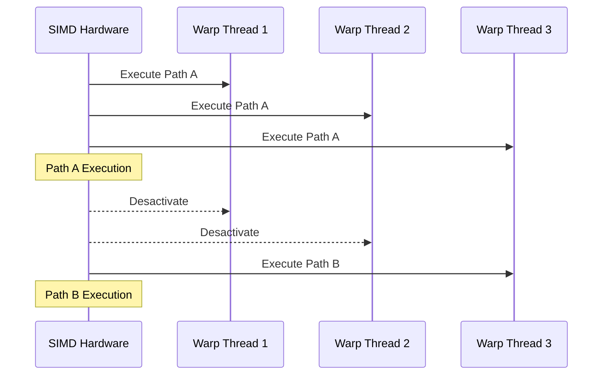

Okay, I will add Mermaid diagrams to the text to enhance understanding, focusing on architectural and system relationships.

## Performance Considerations in CUDA: A Deep Dive (Cont.)

### Introdução

(Mantendo a introdução para consistência e contexto, com pequenas alterações)

Alcançar o máximo desempenho em aplicações CUDA requer uma compreensão profunda das restrições de recursos e de como elas impactam a execução do kernel [^1]. Este capítulo explora as principais limitações em dispositivos CUDA e como ajustar o código para atingir níveis superiores de desempenho. As restrições de recursos variam entre aplicações, tornando essencial entender como um recurso afeta outro. A otimização de desempenho não é trivial e demanda um conhecimento profundo da arquitetura CUDA para identificar gargalos e implementar soluções eficientes [^1]. Além disso, este capítulo busca desenvolver uma intuição sobre padrões algorítmicos que levam a um alto desempenho, bem como estabelecer princípios e ideias para orientar a otimização [^1]. Nesta seção, vamos nos aprofundar na análise da divergência de fluxo de controle, explorando como ela ocorre, quais são as suas consequências e como podemos mitigar seus efeitos negativos.

### Conceitos Fundamentais (Continuação)

Aprofundando a análise da arquitetura CUDA, vamos agora examinar detalhadamente o conceito de divergência de fluxo de controle e como ele afeta o desempenho de kernels CUDA.

**Conceito 25: Divergência de Fluxo de Controle (Warp Divergence)**

A **divergência de fluxo de controle** (*warp divergence*) ocorre quando threads dentro de um mesmo warp seguem diferentes caminhos de execução devido a construções de controle de fluxo, como `if-else` e loops [^5]. Em um modelo SIMD, o ideal é que todos os threads em um warp executem a mesma instrução simultaneamente. No entanto, quando ocorre divergência, o hardware SIMD precisa executar múltiplos passes para atender a todos os caminhos possíveis, o que reduz o paralelismo e causa um overhead significativo.

> ⚠️ **Ponto Crítico:** A divergência de fluxo de controle é uma das maiores fontes de ineficiência em kernels CUDA e seu impacto no desempenho pode ser significativo. O hardware SIMD opera de forma mais eficiente quando as threads em um mesmo warp seguem o mesmo caminho de execução.

A divergência de fluxo de controle pode ocorrer por diversas razões, como:

*   **Condicionais:**  Um `if-else` em que diferentes threads em um warp tomam caminhos diferentes (por exemplo, `if (threadIdx.x > 16) {...} else {...}` ).
*   **Loops:** Loops que têm diferentes números de iterações para threads distintos dentro do mesmo warp.
*   **Desvio de Fluxo:** Desvios de fluxo que causem a mudança no caminho de execução para diferentes threads.

**Lemma 17:** *A divergência de fluxo de controle ocorre quando threads dentro de um mesmo warp seguem caminhos de execução diferentes devido a construções de controle de fluxo, e isso causa a execução sequencial de diferentes partes do código em um warp.*

**Prova do Lemma 17:** A arquitetura SIMD foi concebida para executar a mesma instrução em threads de um mesmo warp. Quando um condicional ou um loop faz com que as threads tomem caminhos diferentes, o hardware SIMD tem que desativar as unidades que não fazem parte do caminho atual de execução. Assim, cada caminho será executado sequencialmente. $\blacksquare$

**Corolário 18:** *A divergência de fluxo de controle leva à subutilização das unidades de processamento SIMD e ao aumento do tempo de execução, pois o hardware precisa executar múltiplas passagens, reduzindo a eficiência.*

O hardware SIMD é mais eficiente quando todos os threads seguem o mesmo caminho, aproveitando ao máximo o paralelismo de dados.

**Conceito 26: Consequências da Divergência no Hardware SIMD**

Quando ocorre divergência de fluxo de controle, o hardware SIMD precisa executar cada caminho de execução separadamente [^5]. Isso significa que:

1.  **Múltiplos Passes:** O hardware executa as instruções em múltiplos passes, um para cada caminho possível [^5].
2.  **Desativação de Threads:** Durante cada passe, os threads que não pertencem ao caminho atual de execução são desativados [^5].
3.  **Subutilização:** As unidades de processamento que correspondem às threads desativadas permanecem ociosas, o que leva à subutilização do hardware SIMD [^5].

> ✔️ **Destaque:**  A divergência de fluxo de controle causa a serialização parcial da execução do warp, pois threads em diferentes caminhos não podem executar simultaneamente.

O tempo total de execução do warp aumenta com cada passe adicional devido à divergência, pois é necessário executar um trecho de código diversas vezes para que todos os threads o executem.

**Conceito 27: Mitigação da Divergência de Fluxo de Controle**

Mitigar a divergência de fluxo de controle é essencial para obter um alto desempenho em kernels CUDA. Algumas técnicas que podem ser utilizadas incluem:

*   **Evitar Condicionais em Threads:**  Evitar o uso de condicionais com base em índices de thread dentro de um mesmo warp sempre que possível.
*   **Reformulação de Algoritmos:** Reformular o algoritmo para que diferentes threads sigam os mesmos caminhos de execução.
*   **Predicação:** Utilizar instruções de predicação para desativar threads que não fazem parte do caminho de execução em vez de utilizar condicionais.

> ❗ **Ponto de Atenção:**  A mitigação da divergência de fluxo de controle geralmente requer um trade-off entre a clareza do código e o desempenho. Em muitos casos, uma pequena alteração no algoritmo pode reduzir a divergência e resultar em melhorias significativas no desempenho.

O projetista de um kernel CUDA deve considerar a divergência no design, pois ela afeta a performance da execução e a otimização do uso de recursos do hardware SIMD.

### Análise Teórica Avançada da Divergência e do Desempenho

**Pergunta Teórica Avançada:** *Como podemos modelar matematicamente o impacto da divergência de fluxo de controle no desempenho de um kernel CUDA, considerando o número de passes necessários, o overhead de desativação e ativação de threads, e a interação com o tamanho do warp?*

**Resposta:**

Para modelar matematicamente o impacto da divergência de fluxo de controle, vamos introduzir algumas variáveis e conceitos adicionais:

*   $N_w$: Número de threads em um warp (tamanho do warp).
*   $N_p$: Número de passes necessários para executar um warp com divergência.
*   $T_i$: Tempo de execução de uma instrução SIMD (sem divergência).
*   $T_{overhead}$: Overhead por passe de execução (desativação e ativação de threads).
*   $T_{div}(N_w)$: Tempo adicional devido à divergência em um warp de tamanho $N_w$.

**Modelo de Execução Sem Divergência:**

No cenário ideal sem divergência, o tempo de execução para uma instrução SIMD é dado por `T_i`.

**Modelo de Execução Com Divergência:**

Em presença de divergência, o tempo de execução do warp é dado por:
$$T_{warp\_div} = N_p \times (T_i + T_{overhead}) $$
onde `N_p` é o número de passes necessários para atender todos os caminhos de execução divergentes, e `T_{overhead}` inclui o tempo para desativar as unidades que não fazem parte do caminho atual e para ativar as unidades que fazem parte do novo caminho de execução.

**Relação com o Tamanho do Warp:**

O número de passes `N_p` depende do número de caminhos divergentes dentro do warp. Em geral, `N_p` tende a aumentar com o tamanho do warp, pois um número maior de threads pode tomar caminhos diferentes.
O tempo `T_{overhead}` pode também aumentar com o número de threads no warp devido ao maior overhead de ativação e desativação das unidades de execução. Assim, podemos escrever `T_{overhead}(Nw)`.

**Impacto da Divergência no Tempo de Execução:**

Podemos definir o tempo adicional devido à divergência no warp como:
$$T_{div}(N_w) = T_{warp\_div} - T_i = N_p \times (T_i + T_{overhead}(N_w)) - T_i = (N_p - 1)T_i + N_p \times T_{overhead}(N_w)$$

**Lemma 18:** *A divergência de fluxo de controle aumenta o tempo de execução do warp em um fator proporcional ao número de passes necessários para atender a todos os caminhos de execução, e a um overhead devido a ativação e desativação das unidades de processamento.*

**Prova do Lemma 18:**  A equação acima mostra que `Tdiv` aumenta linearmente com o número de passos adicionais e também com o tempo de overhead da troca de contexto, que é uma característica da arquitetura SIMD. $\blacksquare$

**Corolário 19:** *Minimizar a divergência de fluxo de controle e o número de passes necessários para executar um warp é essencial para otimizar o desempenho de kernels CUDA, e essa otimização é mais significativa em arquiteturas SIMD com um alto overhead de divergência.*

A modelagem matemática da divergência de fluxo de controle nos permite quantificar o impacto da divergência, e também permite que o projetista de kernels CUDA seja capaz de focar nos pontos que geram a maior perda de performance.

### Continuação

Tendo analisado em detalhe o impacto da divergência de fluxo de controle, podemos agora avançar para a exploração dos seguintes tópicos:

*   **Técnicas de Pré-busca (Prefetching):** Como utilizar a pré-busca de dados para mascarar a latência de acesso à memória global e melhorar o desempenho geral do kernel.
*   **Acesso à Memória Global:** Uma análise mais profunda de como organizar os dados para maximizar o coalescing e o uso da largura de banda da memória global.
*   **Estudo de Casos Práticos:** Análise de casos de uso reais, demonstrando o impacto das otimizações de memória e a mitigação da divergência.

A exploração desses tópicos nos permitirá aprimorar nossa capacidade de projetar kernels CUDA de alto desempenho.

### Referências

[^1]: "The execution speed of a CUDA kernel can vary greatly depending on the resource constraints of the device being used. In this chapter, we will discuss the major types of resource constraints in a CUDA device and how they can affect the kernel execution performance in this device. To achieve his or her goals, a programmer often has to find ways to achieve a required level of performance that is higher than that of an initial version of the application. In different applications, different constraints may dom- inate and become the limiting factors. One can improve the performance of an application on a particular CUDA device, sometimes dramatically, by trading one resource usage for another. This strategy works well if the resource constraint alleviated was actually the dominating constraint before the strategy was applied, and the one exacerbated does not have negative effects on parallel execution. Without such understanding, perfor-mance tuning would be guess work; plausible strategies may or may not lead to performance enhancements. Beyond insights into these resource constraints, this chapter further offers principles and case studies designed to cultivate intuition about the type of algorithm patterns that can result in high-performance execution. It is also establishes idioms and ideas that" *(Trecho de Performance Considerations)*
[^5]: "The SIMD hardware executes all threads of a warp as a bundle. An instruction is run for all threads in the same warp. It works well when all threads within a warp follow the same execution path, or more formally referred to as control flow, when working their data. For example, for an if-else construct, the execution works well when either all threads exe- cute the if part or all execute the else part. When threads within a warp take different control flow paths, the SIMD hardware will take multiple passes through these divergent paths. One pass executes those threads that follow the if part and another pass executes those that follow the else part. During each pass, the threads that follow the other path are not allowed to take effect. These passes are sequential to each other, thus they will add to the execution time. The multipass approach to divergent warp execution extends the SIMD hardware's ability to implement the full semantics of CUDA threads. While the hardware executes the same instruction for all threads in a warp, it selectively lets the threads take effect in each pass only, allowing every thread to take its own control flow path. This preserves the indepen- dence of threads while taking advantage of the reduced cost of SIMD hardware. When threads in the same warp follow different paths of control flow, we say that these threads diverge in their execution. In the if-else exam- ple, divergence arises if some threads in a warp take the then path and some the else path. The cost of divergence is the extra pass the hardware needs to take to allow the threads in a warp to make their own decisions. Divergence also can arise in other constructs; for example, if threads in a warp execute a for loop that can iterate six, seven, or eight times for dif-ferent threads. All threads will finish the first six iterations together. Two passes will be used to execute the seventh iteration, one for those that take the iteration and one for those that do not. Two passes will be used to exe- cute the eighth iteration, one for those that take the iteration and one for those that do not. In terms of source statements, a control construct can result in thread divergence when its decision condition is based on threadIdx values. For example, the statement if (threadIdx.x > 2) {} causes the threads to fol- low two divergent control flow paths. Threads 0, 1, and 2 follow a differ- ent path than threads 3, 4, 5, etc. Similarly, a loop can cause thread" *(Trecho de Performance Considerations)*

**Deseja que eu continue com as próximas seções?**
