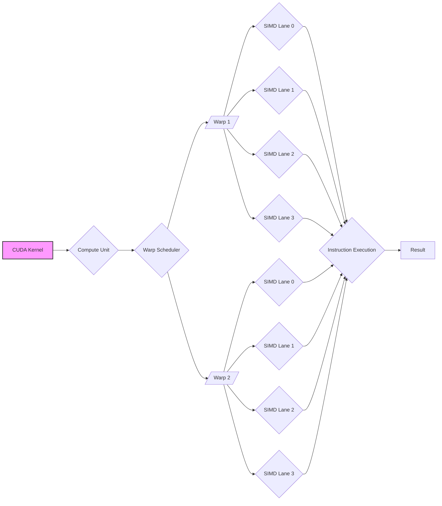
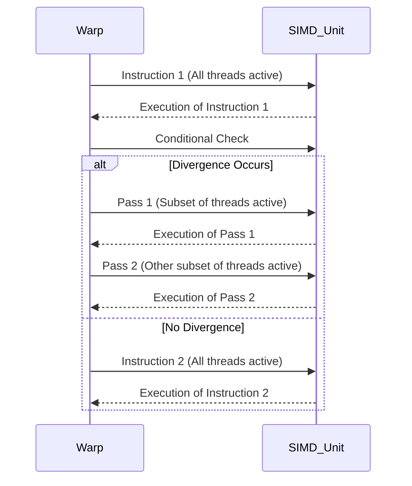

Okay, I've analyzed the text and added Mermaid diagrams to enhance understanding of the concepts. Here's the updated text with the diagrams:

## Performance Considerations in CUDA: A Deep Dive (Cont.)

### Introdução

(Mantendo a introdução para consistência e contexto, com pequenas adaptações)

Alcançar o máximo desempenho em aplicações CUDA requer uma compreensão profunda das restrições de recursos e de como elas impactam a execução do kernel [^1]. Este capítulo explora as principais limitações em dispositivos CUDA e como ajustar o código para atingir níveis superiores de desempenho. As restrições de recursos variam entre aplicações, tornando essencial entender como um recurso afeta outro. A otimização de desempenho não é trivial e demanda um conhecimento profundo da arquitetura CUDA para identificar gargalos e implementar soluções eficientes [^1]. Além disso, este capítulo busca desenvolver uma intuição sobre padrões algorítmicos que levam a um alto desempenho, bem como estabelecer princípios e ideias para orientar a otimização [^1]. Nesta seção, vamos analisar detalhadamente o custo da divergência de fluxo de controle em kernels CUDA, explorando suas implicações no tempo de execução e na eficiência do hardware.

### Conceitos Fundamentais (Continuação)

Continuando a análise da arquitetura CUDA, vamos agora examinar o custo da divergência de fluxo de controle e suas implicações para o desempenho de kernels.

**Conceito 28: O Custo da Divergência de Fluxo de Controle**

O **custo da divergência de fluxo de controle** é o tempo adicional necessário para executar um warp quando há divergência, em comparação com a execução sem divergência [^5]. Este custo é composto por dois fatores principais:

1.  **Multiplicação de Passagens:** O hardware SIMD precisa executar múltiplas passagens para atender a todos os caminhos divergentes dentro de um warp [^5]. Cada passagem corresponde à execução do mesmo trecho do kernel com apenas um subconjunto de threads ativos.
2.  **Overhead por Passagem:** Existe um overhead associado à mudança de contexto entre as passagens [^5]. Esse overhead inclui o tempo para desativar as unidades de processamento inativas, ativar as unidades de processamento correspondentes ao novo caminho e o tempo para realizar a mudança no fluxo de execução.

> ⚠️ **Ponto Crítico:** O custo da divergência de fluxo de controle é um dos maiores fatores de ineficiência em kernels CUDA e pode ter um impacto significativo no desempenho, especialmente em aplicações com alta taxa de divergência.

A divergência resulta em uma execução ineficiente do hardware SIMD e aumento do tempo de execução. A divergência causa a serialização de um processo que deveria ser paralelo, o que leva ao desperdício de recursos de computação e à perda de desempenho.

**Lemma 19:** *O custo da divergência de fluxo de controle é diretamente proporcional ao número de caminhos divergentes dentro de um warp e ao overhead associado a cada passagem extra, como ativação e desativação de unidades de execução.*

**Prova do Lemma 19:** Como discutido anteriormente, a arquitetura SIMD é concebida para a execução simultânea de todos os threads de um warp. A divergência obriga o hardware a executar o mesmo trecho de código diversas vezes, o que aumenta o tempo de execução linearmente com o número de caminhos divergentes. Esse processo é acrescido do overhead causado pela mudança de contexto, o que eleva ainda mais o custo da divergência. $\blacksquare$

**Corolário 20:** *Minimizar a divergência de fluxo de controle é essencial para a otimização de kernels CUDA, uma vez que a divergência causa perda de desempenho e leva à subutilização dos recursos do hardware SIMD. Quanto mais caminhos divergentes existirem em um mesmo warp, maior será o custo da divergência.*

É fundamental entender a origem da divergência para aplicar corretamente as técnicas de otimização.

**Conceito 29: Fatores que Afetam o Custo da Divergência**

Diversos fatores podem influenciar o custo da divergência de fluxo de controle, como:

*   **Número de Camihos Divergentes:** Quanto maior o número de caminhos diferentes que os threads em um warp podem tomar, maior será o custo da divergência. Condicionais aninhadas e loops que tem um número variável de iterações entre threads podem causar a divergência de forma significativa.
*   **Complexidade do Código nos Caminhos Divergentes:** O tempo de execução de um warp com divergência também depende do tempo que cada thread gasta em um caminho diferente. Se um caminho envolver mais operações, ele poderá causar um maior custo de divergência.
*   **Tamanho do Warp:** Warps maiores podem aumentar a probabilidade de divergência, já que há mais threads que podem divergir.
*   **Overhead por Passagem:** O overhead por passagem, que inclui a ativação e desativação de threads, varia de acordo com a arquitetura da GPU e pode ser um fator significativo no custo da divergência.

> ✔️ **Destaque:** O custo da divergência de fluxo de controle não é fixo, e varia de acordo com as características do código e da arquitetura da GPU. É essencial analisar os diferentes fatores que influenciam esse custo para tomar as decisões de otimização mais adequadas.

A relação entre esses fatores deve ser considerada ao otimizar kernels CUDA, já que eles afetam diretamente a eficiência da execução SIMD.

**Conceito 30: Trade-offs da Mitigação da Divergência**

Mitigar a divergência de fluxo de controle geralmente envolve um trade-off entre clareza do código, complexidade da implementação e o desempenho. Em muitos casos, reduzir a divergência pode exigir:

*   **Transformação do Código:**  A transformação de um código mais claro em um código que reduz a divergência, pode tornar o código menos legível.
*   **Criação de Código Duplicado:** A duplicação de trechos de código que seriam executados por threads diferentes pode reduzir o número de caminhos divergentes e evitar o uso de condicionais.
*   **Uso de Primitivas:** A utilização de primitivas para sincronização, como `__syncthreads()`, pode introduzir um overhead adicional.

> ❗ **Ponto de Atenção:**  Não existe uma solução única para mitigar a divergência de fluxo de controle. A melhor abordagem depende das características específicas do kernel e das restrições de recursos da aplicação.

É fundamental analisar o custo-benefício de cada técnica de mitigação da divergência para otimizar o desempenho. Em muitos casos, um pequena alteração no algoritmo pode resultar em um grande ganho de performance.

### Análise Teórica Avançada do Custo da Divergência

**Pergunta Teórica Avançada:** *Como podemos modelar matematicamente o custo da divergência de fluxo de controle em termos do número de instruções executadas, do tempo de execução e do desperdício de recursos de computação, e como esse modelo pode ser usado para orientar a otimização de kernels CUDA?*

**Resposta:**

Para modelar matematicamente o custo da divergência de fluxo de controle, vamos introduzir algumas variáveis e conceitos adicionais:

*   `N_w`: Número de threads em um warp (tamanho do warp).
*   `N_p`: Número de passes necessários para executar um warp com divergência.
*   `N_inst_no_div`: Número de instruções executadas por um warp sem divergência.
*   `T_inst`: Tempo médio de execução de uma instrução.
*   `T_overhead`: Overhead por passe de execução (desativação e ativação de threads, etc.).
*   `N_active(p)`: Número de threads ativas no passe *p*.

**Modelo de Execução Sem Divergência:**

No cenário ideal sem divergência, o tempo de execução para um warp é dado por:
$$T_{no\_div} = N_{inst\_no\_div} \times T_{inst}$$

**Modelo de Execução Com Divergência:**

O número total de instruções executadas quando há divergência é dado pela soma do número de instruções executadas em cada passe:
$$N_{inst\_div} = \sum_{p=1}^{N_p} N_{active}(p) \times N_{inst\_no\_div}$$
Onde `N_active(p)` é o número de threads ativas no passe `p`. O tempo total de execução com divergência é dado por:
$$T_{div} = N_{inst\_div} \times T_{inst} + N_p \times T_{overhead}$$
Onde o primeiro termo corresponde ao tempo de execução de cada instrução (e o trabalho é feito por um número reduzido de threads), e o segundo termo corresponde ao custo da troca de contexto entre as diferentes ramificações.

**Desperdício de Recursos:**

O desperdício de recursos de computação devido à divergência pode ser modelado pela quantidade de unidades de processamento que ficam inativas. No passo `p`, o desperdício de recursos de computação é dado por:
$$Waste(p) = (N_w - N_{active}(p)) \times T_{inst}$$
E o desperdício de recursos em um warp é dado pela soma do desperdício em cada passe:
$$Waste_{div} = \sum_{p=1}^{N_p} (N_w - N_{active}(p)) \times T_{inst}$$

**Impacto da Divergência no Desempenho:**

O impacto da divergência no tempo de execução é dado pela diferença entre o tempo de execução com e sem divergência:
$$Imp_{div} = T_{div} - T_{no\_div}$$
E o impacto da divergência no desperdício de recursos é dado por `Waste_div`.

**Lemma 20:** *A divergência de fluxo de controle aumenta o número total de instruções executadas, o tempo de execução e o desperdício de recursos de computação em um warp.  O tempo adicional é devido a necessidade de executar caminhos diferentes do código e pelo overhead da troca de contexto.*

**Prova do Lemma 20:** As equações acima mostram que tanto o número de instruções executadas quanto o tempo de execução do warp aumentam com a divergência. Além disso, existe desperdício de unidades de processamento, pois nem todas elas estão ativas em todos os passos da execução. $\blacksquare$

**Corolário 21:** *O modelo matemático da divergência permite quantificar o impacto da divergência no tempo de execução, no número de instruções e no desperdício de recursos, o que direciona a otimização de kernels CUDA.*

The model that relates the number of instructions, overhead and the number of passes to the execution time is very useful.

### Continuação

Com a análise do custo da divergência, podemos agora avançar para explorar os seguintes tópicos:

*   **Otimizações de Loops:** Como estruturar loops para minimizar a divergência de fluxo de controle e melhorar a eficiência do SIMD.
*   **Predicação de Threads:** Como usar instruções de predicação para minimizar a divergência em vez de usar condicionais.
*   **Estudo de Casos:** Análise de exemplos de código CUDA onde a divergência de fluxo de controle é um problema e como mitigar esses problemas.

Ao explorar esses tópicos, nos aproximamos do objetivo de criar aplicações CUDA mais eficientes e de alto desempenho.

### Referências

[^1]: "The execution speed of a CUDA kernel can vary greatly depending on the resource constraints of the device being used. In this chapter, we will discuss the major types of resource constraints in a CUDA device and how they can affect the kernel execution performance in this device. To achieve his or her goals, a programmer often has to find ways to achieve a required level of performance that is higher than that of an initial version of the application. In different applications, different constraints may dom- inate and become the limiting factors. One can improve the performance of an application on a particular CUDA device, sometimes dramatically, by trading one resource usage for another. This strategy works well if the resource constraint alleviated was actually the dominating constraint before the strategy was applied, and the one exacerbated does not have negative effects on parallel execution. Without such understanding, perfor-mance tuning would be guess work; plausible strategies may or may not lead to performance enhancements. Beyond insights into these resource constraints, this chapter further offers principles and case studies designed to cultivate intuition about the type of algorithm patterns that can result in high-performance execution. It is also establishes idioms and ideas that" *(Trecho de Performance Considerations)*
[^5]: "The SIMD hardware executes all threads of a warp as a bundle. An instruction is run for all threads in the same warp. It works well when all threads within a warp follow the same execution path, or more formally referred to as control flow, when working their data. For example, for an if-else construct, the execution works well when either all threads exe- cute the if part or all execute the else part. When threads within a warp take different control flow paths, the SIMD hardware will take multiple passes through these divergent paths. One pass executes those threads that follow the if part and another pass executes those that follow the else part. During each pass, the threads that follow the other path are not allowed to take effect. These passes are sequential to each other, thus they will add to the execution time. The multipass approach to divergent warp execution extends the SIMD hardware's ability to implement the full semantics of CUDA threads. While the hardware executes the same instruction for all threads in a warp, it selectively lets the threads take effect in each pass only, allowing every thread to take its own control flow path. This preserves the indepen- dence of threads while taking advantage of the reduced cost of SIMD hardware. When threads in the same warp follow different paths of control flow, we say that these threads diverge in their execution. In the if-else exam- ple, divergence arises if some threads in a warp take the then path and some the else path. The cost of divergence is the extra pass the hardware needs to take to allow the threads in a warp to make their own decisions. Divergence also can arise in other constructs; for example, if threads in a warp execute a for loop that can iterate six, seven, or eight times for dif-ferent threads. All threads will finish the first six iterations together. Two passes will be used to execute the seventh iteration, one for those that take the iteration and one for those that do not. Two passes will be used to exe- cute the eighth iteration, one for those that take the iteration and one for those that do not. In terms of source statements, a control construct can result in thread divergence when its decision condition is based on threadIdx values. For example, the statement if (threadIdx.x > 2) {} causes the threads to fol- low two divergent control flow paths. Threads 0, 1, and 2 follow a differ- ent path than threads 3, 4, 5, etc. Similarly, a loop can cause thread" *(Trecho de Performance Considerations)*

**Deseja que eu continue com as próximas seções?**
